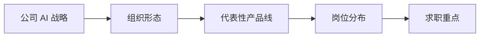

## 常见大厂与架构简介

本类别收录**头部公司与大模型创业公司的 AI 组织与架构观察**：公司 AI 战略、组织形态、代表性产品线、AI 产品经理岗位分布与团队特点，以及求职层面的观察。每篇按三个问题组织：这家公司的 AI 组织长什么样？AI 产品经理落在哪些部门、和谁协作？去这家公司求职要注意什么？

???+ note "信息时效"
    组织架构变化快，本类别各篇文章信息截至 2026-08，以官方招聘与最新公开信息为准。

核心关系是：先从战略和组织判断岗位落点，再用产品线与求职观察校准目标公司的真实工作环境。

## 内容列表

-   [字节跳动](bytedance.md)：AI 产品组织与架构观察
-   [阿里巴巴](alibaba.md)：AI 产品组织与架构观察
-   [腾讯](tencent.md)：AI 产品组织与架构观察
-   [百度与美团](baidu-meituan.md)：AI 产品组织与架构观察
-   [华为](huawei.md)：AI 产品组织与架构观察
-   [大模型创业公司](ai-startups.md)：组织与岗位特点（智谱AI、月之暗面、MiniMax、深度求索、百川智能等）

## 怎么用本类别

-   先看「公司概况与 AI 战略」，判断这家公司在 AI 上的投入力度与方向（自研模型 / 应用 / 云生态）
-   再看「AI 相关组织架构」与「岗位分布」，理解 AI 产品经理的工作环境：业务线主导还是中台支撑，和算法、研发的协作关系
-   最后横向对比「求职观察」，提炼可泛化的经验（如面试侧重点、流程特点）
-   面试前想快速了解一家公司，只读对应文章的「岗位分布与团队特点」与「求职观察」两节即可

## 相关阅读

-   [求职专题简介](../index.md)
-   [常见岗位与JD](../positions/index.md)：岗位职责与 JD 解读
-   [AI 产品经理面试](../interviews/interview-guide.md)：答题框架与典型题
-   [如何参与](../../intro/htc.md)：欢迎补充你所在公司的组织观察
