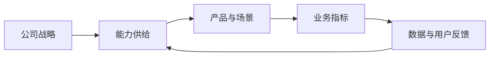
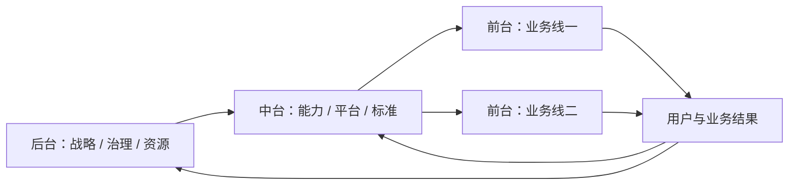
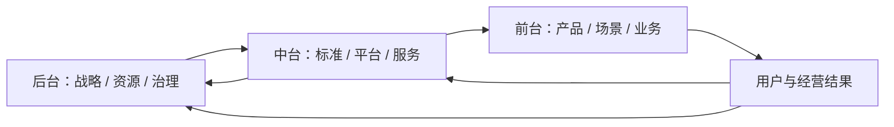
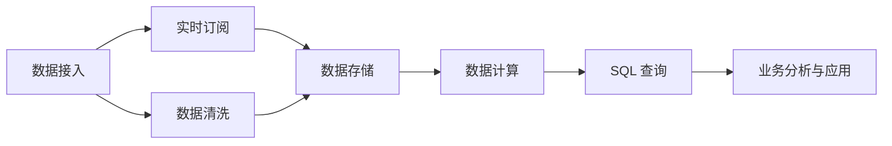
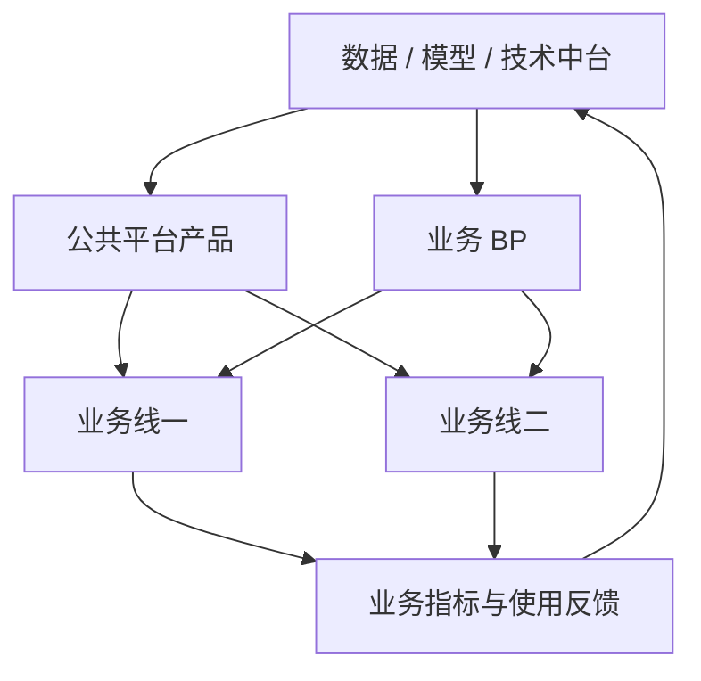
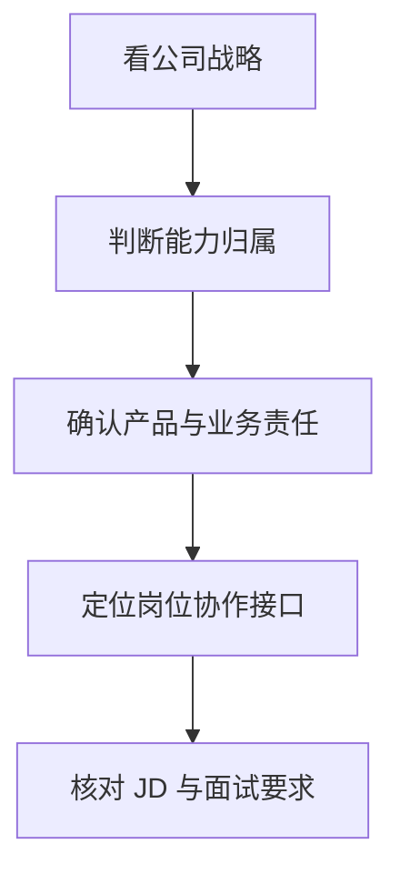

## 常见大厂与架构简介

大厂的 AI 组织需要同时看公司战略、公共能力归属、业务责任和协作接口。先判断公共能力由谁建设、业务结果由谁负责、需求和资源如何流动，再判断一个岗位的实际工作范围。本类别先介绍通用组织模式，再用字节、阿里、腾讯、百度、美团、华为和大模型创业公司的文章说明具体落地。

???+ note "信息时效"
    组织架构、事业群名称和岗位职责变化快。

    本页提供分析框架，不对应任何一家公司的完整现行架构。

    各公司文章的信息截至 2026-09，组织与岗位信息以官方招聘页面和最新公开信息为准。

公共能力进入产品和业务场景，业务指标与用户反馈推动下一轮资源配置。

## 先看四个判断轴

同一个公司可能同时使用几种模式。模型研发、数据平台、业务应用和行业交付的组织方式也可能不同。阅读公司介绍时，先沿着四个判断轴定位，不要急着给公司贴一个固定标签。

| 判断轴 | 要回答的问题 | 常见信号 |
| --- | --- | --- |
| 能力供给 | 模型、数据、算力和基础设施由谁建设 | 集团平台、云事业群、模型中心、业务线自建 |
| 产品归属 | 公共能力和最终产品分别由谁负责 | 平台产品、业务产品、独立 AI 事业部 |
| 业务责任 | 谁对收入、活跃、成本或交付结果负责 | 业务线负责人、产品事业部、行业军团 |
| 协作接口 | 需求、资源和优先级怎样在团队之间流动 | BP、双汇报、项目制、服务目录、评测机制 |

**最重要的判断是产品结果归谁负责。** 中台提供组件或平台，不代表中台自动拥有所有场景的业务目标；业务线接入模型，也不代表它负责模型底座的长期建设。

## 前台、中台、后台：大厂组织的基本骨架

前台、中台、后台描述企业的分工，不是前端、后端、数据库等技术分层。这里的后台也不是服务器后台。三者按服务对象、能力范围和结果责任区分：

后台确定战略、规则和资源边界，中台把公共能力做成服务，前台把服务转化为用户价值和业务结果。结果与反馈再回到中台和后台，推动能力迭代与资源调整。

| 层级 | 主要服务对象 | 典型团队 | 主要交付物 | 核心指标 |
| --- | --- | --- | --- | --- |
| 前台 | 消费者、企业客户、行业客户、业务经营者 | C 端产品、B 端产品、行业方案、业务运营 | 产品功能、客户方案、业务流程、运营结果 | 活跃、转化、收入、留存、交付、效率 |
| 中台 | 多个前台团队和内部开发者 | 数据平台、模型平台、技术平台、内容中台、营销中台 | API、数据服务、组件、标准、工具、评测和服务等级 | 采用率、复用率、稳定性、时延、质量、单位成本 |
| 后台 | 公司管理层和内部组织 | 战略、财务、人力、法务、合规、采购、审计、内审、内部 IT | 战略规划、预算、制度、风险控制、资源配置和组织服务 | 资源效率、合规性、风险、成本、组织稳定性 |

前台、中台、后台不是三个依次传递任务的部门，也不是固定的行政上下级。它们是按服务对象和责任边界划分的三种组织角色：前台面向客户和业务结果，中台面向多个前台提供公共能力，后台面向全公司提供战略、治理和资源保障。

三者形成两个闭环：

-   **业务闭环**：前台提出用户问题和业务目标，中台提供数据、模型、技术和流程能力，前台把能力转化为产品与经营结果
-   **治理闭环**：后台制定战略、预算、权限、安全和合规边界，中台把规则落实到平台和服务，前台在边界内开展业务并反馈执行结果

具体关系可以拆成三组：

-   **前台与中台**：前台是能力使用方，中台是公共服务提供方。前台提出场景和结果要求，中台判断哪些需求适合沉淀为通用能力，并通过服务目录、接口、权限和 SLA 提供服务
-   **中台与后台**：中台负责能力建设和日常运营，后台负责预算、组织、制度、风险和审计。后台不替代中台做产品设计，中台也不能绕过后台的治理边界
-   **前台与后台**：后台通过战略、预算、绩效和制度约束前台，同时为前台提供组织与资源保障。前台通过经营结果证明资源投入的价值，重大风险和超出授权范围的事项再向后台升级

因此，前台、中台、后台的核心关系是**前台创造业务结果，中台提供复用能力，后台建立治理和资源条件**。中台不是前台的需求外包团队，后台也不是所有业务事项的审批层。
### 前台：对客户和业务结果负责

前台距离用户和客户最近。互联网公司的前台通常是 App、搜索、内容、游戏、办公等业务线；企业服务公司的前台还包括销售、客户成功和行业解决方案团队；大厂内部的某个业务集团，也可以作为集团层面的前台。

前台团队通常负责：

-   识别用户或客户问题，定义场景和产品目标
-   设计功能、流程、运营策略和商业化方案
-   协调算法、研发、设计、运营和销售完成交付
-   对活跃、转化、收入、留存、效率或客户交付结果负责

前台不一定自建全部技术能力。它可以调用模型平台、数据服务和通用组件，把精力集中在场景、体验和业务指标上。需要快速验证、强差异化或涉及敏感业务的数据和模型，也可能由前台自行建设。

前台产品经理最需要确认的是**结果责任和资源权限是否匹配**。岗位如果要求对增长或收入负责，却没有业务数据、算法资源和运营权限，实际工作可能只能停留在需求协调。

### 中台：把共性能力做成可复用服务

中台服务多个前台，负责沉淀重复出现的能力。它的产物通常不是某一个业务页面，而是其他团队可以调用的 API、数据集、模型、组件、工具、流程和标准。

#### 数据中台建设的六种基础能力

一个完整的数据平台至少应覆盖数据接入、实时订阅、数据清洗、数据存储、数据计算和 SQL 查询六种能力。六种能力组成从数据进入平台到被分析和使用的完整链路：

-   **数据接入**：接收业务数据库、埋点、日志、文件、第三方接口和消息流中的数据，完成连接、鉴权、采集和接入状态管理
-   **实时订阅**：让下游系统订阅数据变化和事件消息，支持实时同步、实时风控、实时推荐和实时运营等场景
-   **数据清洗**：处理重复、缺失、异常、格式不一致和口径不统一的数据，保留清洗规则、任务日志和问题追踪记录
-   **数据存储**：按照数据类型、访问频率、时效和成本选择数据库、数仓、数据湖、对象存储或缓存，管理生命周期和权限
-   **数据计算**：通过批处理、流处理和交互式计算完成聚合、关联、指标加工、标签生成和特征计算
-   **SQL 查询**：提供面向分析师、产品经理、研发和运营人员的查询入口，支持权限控制、任务调度、结果复用和查询审计

六种能力并非六个孤立的产品。数据接入和实时订阅决定数据能否及时进入平台；清洗和存储决定数据是否可靠、可追溯；计算和 SQL 查询决定数据能否被业务人员稳定使用。

#### 数据中台建设的三个基本目标

数据中台建设最终围绕**质量、成本、效率**三个基本目标展开：

-   **质量**：保证数据的准确性、完整性、一致性、及时性和可追溯性，让业务使用同一套可信数据
-   **成本**：控制数据采集、传输、存储、计算、查询、维护和权限治理的成本，关注资源利用率和单位数据服务成本
-   **效率**：缩短数据接入、开发、查询和问题排查的时间，提高指标、标签、数据服务和分析结果的复用率

三个目标相互制约。只追求质量，可能引入过度治理和高昂成本；只追求成本，可能牺牲数据时效和准确性；只追求效率，可能留下口径混乱和权限风险。数据平台产品经理需要根据业务场景确定质量等级、服务等级和成本边界。

数据中台不等于把所有数据集中到一个团队，也不等于统一制作报表。强业务差异、强实时性或高敏感度的数据，可以保留在业务线，由中台提供标准、权限和服务接口。

AI 公司的中台可能包括：

-   **模型中台**：模型服务、推理路由、版本管理、微调、提示词管理和模型成本控制
-   **数据中台**：数据采集、数仓或数据湖、指标、标签、权限、质量治理和数据服务
-   **技术中台**：账号、权限、消息、工作流、实验、监控和发布能力
-   **评测与安全平台**：评测集、人工标注、质量监控、内容安全、审计和风险处置
-   **开发者平台**：控制台、SDK、文档、调试工具、知识库和 Agent 编排能力

中台产品经理面对的用户通常是内部产品经理、研发、算法、运营和外部开发者。需求文档要写清楚服务对象、调用方式、权限、SLA、失败处理、成本和迁移方案。只写功能清单，无法说明平台是否真正可用。

中台的价值不由建设了多少功能决定。至少要同时观察：

-   有多少前台真正接入并持续使用
-   相同能力是否减少了重复建设
-   服务质量是否稳定，问题由谁响应
-   使用成本是否可计算、可分摊、可优化
-   平台标准是否降低了数据、模型和安全风险

中台过度集中时，前台排队等资源，业务响应速度下降；中台过度松散时，各前台重复购买、重复开发，数据和模型标准无法统一。

### 后台：提供治理、资源和组织保障

后台负责公司的共同规则与组织基础。它通常不直接设计面向消费者的产品，但决定业务可以使用什么资源、遵守什么规则、承担什么风险。

与 AI 相关的后台工作包括：

-   **战略与财务**：确定 AI 投入方向、预算、成本中心和投入产出要求
-   **人力与组织**：招聘模型、算法、产品和销售人才，设计汇报关系与绩效机制
-   **法务与合规**：审查数据来源、隐私、版权、模型输出和行业监管要求
-   **采购与供应商管理**：管理云资源、模型 API、数据服务、标注服务和硬件采购
-   **安全与审计**：制定访问控制、数据分级、日志留存、发布审核和事件处置规则
-   **内部 IT 与知识管理**：建设员工使用的账号、权限、协作和内部知识系统

后台也可能拥有产品经理岗位。内部财务系统、采购系统、权限系统和合规平台都有真实用户，只是用户是员工或管理者，指标偏向效率、风险和成本，而不是 C 端增长。

安全、合规和数据治理没有固定归属。有的公司把它们放在后台的治理职能，有的公司把它们做成面向所有业务的中台服务，也有的公司采用双重管理。判断归属时，应看它是否拥有平台建设权、规则制定权和风险审批权。

### 前中后台如何协作

一个业务需求经过前中后台，通常会经历以下过程：

1. 前台提出用户问题、业务目标和结果指标
2. BP 或产品负责人判断需求涉及的公共能力，区分一次性交付与平台化建设
3. 中台评估复用价值、建设成本、数据权限、服务等级和长期维护责任
4. 后台确认预算、合规、安全、采购和组织边界
5. 前台接入能力并完成场景上线，中台提供监控、迭代和故障支持
6. 业务结果、使用数据和风险事件回流，作为下一轮产品和资源决策依据

这里的顺序不是固定审批链。成熟组织会让前台、中台和后台在需求早期共同参与，避免方案确定后才发现数据不能用、预算无法承担或没有团队长期维护。

### 前中后台与 COE、SSC、BP 的关系

前台、中台、后台回答“团队站在哪一层、服务谁、对什么结果负责”；COE、SSC、BP 回答“同一项专业职能怎样分工”。两套概念可以叠加，不能互相替代。

| 角色 | 英文全称 | 核心职责 | 常见位置 |
| --- | --- | --- | --- |
| COE | Center of Expertise | 专家政策、专业方法、标准、治理和能力建设 | 中后台 |
| SSC | Shared Service Center | 标准化流程、事务处理、共享服务和工单响应 | 中台或后台的共享服务单元 |
| BP | Business Partner | 贴近业务，理解经营目标，提供本地化方案和决策支持 | 前台附近，也可能服务中后台 |

三支柱最常见于人力和财务，也可以迁移到战略、法务、数据和 AI。它描述的是一项职能内部的分工，不意味着 COE 永远等于中台，也不意味着 BP 一定拥有业务线的行政汇报关系。

#### BP 的角色变化

传统模式是 COE 制定政策，SSC 执行标准流程，BP 进入业务单元检查预算、编制、权限和流程。BP 的决策权小，工作容易变成政策传达、流程审核和风险拦截。

成熟的 BP 化模式增加了业务反馈和本地化决策：

-   BP 先理解业务战略、经营模型和关键指标，再把专业方法应用到具体业务
-   BP 参与业务规划、预算、组织和资源决策，而不是只在方案完成后审核
-   BP 将一线需求带回 COE，推动政策、指标和方法调整
-   COE 从单向发布规则，转为与 BP 共同建设适用于不同业务的解决方案
-   SSC 将高频、标准、可重复的事务收敛为服务，减少 BP 的事务性工作

**BP 化的关键是让专业能力进入业务决策，并让业务反馈回到专业中心。** BP 只有传话和审批权限时，无法真正承担业务伙伴的角色。

#### BP 为什么会进入组织前线

BP 主要处理三组张力：

-   **授权**：在总部统一控制和一线快速决策之间建立边界，明确哪些事项可以下放，哪些事项必须升级
-   **激励**：在统一政策和业务单元的本地化需求之间建立规则，结合业务阶段设计预算、绩效或资源方案
-   **赋能**：把专业方法带进业务现场，用业务经验校准政策、模型和流程，避免专业规则脱离经营实际

这也是 BP 与普通职能支持岗位的区别。普通支持岗位完成规定流程；BP 需要解释业务目标、评估方案影响、提出可执行的专业方案，并跟踪方案结果。

#### 三类常见 BP

| BP 类型 | 服务对象 | 主要工作 | 判断重点 |
| --- | --- | --- | --- |
| 事业部 / BG / BU BP | 一个完整业务单元 | 参与战略、预算、组织和经营分析，支持业务负责人决策 | 是否与业务负责人共同对经营结果负责 |
| 区域或下属单元 BP | 事业部下的区域、产品组或一线团队 | 执行政策、跟踪指标、管理流程、反馈本地问题 | 是否拥有本地化调整和资源协调权限 |
| 中后台 BP | 中台、职能或支持部门 | 分析平台或职能部门的投入产出，连接前台需求，推动服务改进 | 是否把支持部门的工作转化为可衡量的服务价值 |

同一个公司可以同时设置三类 BP。岗位名称相同，不代表决策权、指标和工作深度相同。JD 中写“支持业务”时，应继续确认支持对象、业务指标、权限边界和汇报关系。

### 以数据平台为例

数据平台最容易体现前台、中台、后台和 BP 的差异。可以把一次数据需求拆成六个角色：

-   **前台业务团队**：提出经营问题，使用统一指标和数据产品，对转化、留存、收入、效率或风险结果负责
-   **数据 BP**：进入业务线理解流程，把业务问题翻译成数据需求，参与优先级排序，推动业务采用统一口径
-   **数据 COE**：制定指标口径、数据模型、治理方法和质量标准，处理跨业务的专业问题
-   **数据平台产品与研发团队**：建设采集、数仓或数据湖、标签、指标、权限和数据服务，保证质量、时效、复用和可追溯性
-   **数据 SSC**：承接标准化的数据申请、权限开通、报表生成、数据导出和常规问题响应
-   **后台治理职能**：制定数据分级、隐私、权限、审计、预算和供应商规则，处理跨业务的数据风险

例如，业务线提出“找出新用户次日留存下降的原因”：

1. 前台负责定义业务问题、观察窗口和行动目标
2. 数据 BP 拆解用户、渠道、版本、行为和时间口径，确认问题是否适合沉淀为公共分析能力
3. 数据 COE 确认留存指标定义、数据模型和质量要求
4. 数据平台团队提供指标、明细和分析服务，数据 SSC 处理权限与标准报表请求
5. 后台治理职能确认数据使用范围、隐私边界和审计要求
6. 前台根据分析结果调整产品或运营策略，并将结果回传给 BP 和数据平台

最终的留存改善仍由业务线负责，数据平台负责服务质量，数据 BP 负责协作闭环。若 BP 只有收集需求的职责，COE 只发布口径，SSC 只处理工单，这套架构就仍然是职能分工，还没有形成真正的业务伙伴关系。

### 前中后台不是固定的上下级

前台、中台和后台首先是**相对角色**，不等于固定的行政级别。一家公司集团层面的中台，可能是某个事业群眼中的后台；云平台对集团是中台，对使用云服务的开发者又是前台。

组织还可以递归嵌套：集团有集团中台，事业群内部再建设自己的业务中台，业务中台下面还有面向最终用户的前台产品。判断一个团队属于哪一层，要先确定分析范围和服务对象。

“大中台、小前台”只是强调公共能力和前台团队的资源比例，不是所有公司的目标结构。前台过小会失去业务判断和创新能力，前台过大则容易重复建设。合理的结构取决于业务差异、能力复用程度、合规要求和响应速度。

## 常见组织架构模式

### 职能制：按专业能力集中管理

职能制按照算法、数据、研发、产品、设计、运营等专业划分团队。各团队由专业负责人管理，项目需要跨职能协作完成。

-   **能力归属**：专业能力集中在职能团队
-   **产品经理位置**：负责需求分析、方案设计和跨职能推进，通常需要协调多个专业负责人
-   **适用场景**：公司规模较小、业务方向还在收敛，或专业能力需要统一建设
-   **主要问题**：项目优先级依赖协调；团队容易只完成职能目标，忽略最终业务结果

职能制下，判断岗位边界要看产品经理是否拥有明确的场景和指标。只写平台规划、需求收集和项目推进的岗位，实际工作可能更接近项目协调或内部产品。

### 事业群制：按业务或客户线经营

事业群制，也常写作 BG 制，按照电商、社交、游戏、云服务、终端或行业客户等业务单元组织团队。一个事业群通常拥有相对完整的产品、研发、运营和商业化能力。

-   **能力归属**：业务线拥有较强自主权，公共平台提供基础支持
-   **产品经理位置**：直接嵌入业务线，围绕用户、收入、留存、交付或成本负责
-   **适用场景**：业务规模大、客户差异明显，需要快速响应具体场景
-   **主要问题**：重复建设；跨业务复用困难；公共能力的投入回报不易分摊

事业群制下，同一个职位名称在不同 BG 可能对应完全不同的工作。看 JD 时应确认服务对象、业务指标、汇报对象和可调用的技术资源。

### 中台 + BP 制：公共能力集中，需求与落地贴近业务

中台 + BP 制把公共能力与业务连接分开处理。中台建设可复用的能力和平台，BP 作为业务合作方进入业务线，负责把业务目标翻译成平台需求，并推动能力在业务中落地。

**中台负责公共能力，BP 负责业务连接，业务线负责场景结果。** 三者边界清晰，平台才不会变成需求堆积处，BP 也不会退化为工单转发角色。

#### 数据平台中的典型分工

-   **数据中台**：建设数据采集、数仓或数据湖、指标体系、标签、权限、质量治理、数据服务和分析工具
-   **数据平台产品经理**：定义公共数据产品、服务目录、数据标准、权限流程和使用体验，关注复用率、稳定性、时效与成本
-   **数据 BP**：理解业务流程和经营目标，识别数据需求，参与优先级排序，推动业务采用统一指标和平台能力
-   **业务产品与运营团队**：提出场景需求，使用数据完成决策，对转化、留存、收入、效率或风险等业务结果负责

#### 这套模式的工作机制

1. 业务线提出目标和场景，不直接要求中台照单开发
2. BP 将场景拆成数据、模型、流程和指标需求，判断哪些能力适合沉淀为公共服务
3. 中台评估通用性、建设成本、数据安全和服务等级，排定平台建设优先级
4. 业务线接入并使用平台，BP 跟踪采用情况和业务结果
5. 评测数据回到中台，推动指标、模型和服务迭代

#### 识别这套模式的三个问题

-   业务 BP 是否参与平台规划和优先级决策，还是只负责收集需求
-   中台是否提供明确的服务边界、接口、SLA 和数据权限规则
-   平台价值按复用率和业务结果衡量，还是只按上线项目数量衡量

中台 + BP 制解决的是协作和复用问题，不等于所有能力都必须集中。敏感数据、强业务差异和实时性要求高的能力，仍可能由业务线独立建设。

### 平台 + 业务线嵌入：底座统一，应用分布在场景团队

这是 AI 组织常见的组合方式。模型、算力、数据治理、评测和模型服务由平台团队建设，搜索、推荐、客服、办公、内容创作或行业应用由业务团队嵌入式开发。

-   **平台团队**：负责模型服务、API、知识库、Agent 编排、评测、监控、成本和安全能力
-   **业务团队**：负责场景选择、用户体验、业务流程、上线运营和结果指标
-   **产品经理分工**：平台产品经理关注能力产品化；业务产品经理关注场景价值；双方通过接口、评测集和服务等级协作
-   **主要风险**：平台指标与业务指标脱节，或者业务团队绕过公共平台重复接入模型

这套模式与中台 + BP 制经常同时出现。前者描述能力如何分布，后者描述平台如何与业务协作。

### 矩阵制：专业线与业务线双重管理

矩阵制把职能管理和项目或业务管理叠加。产品经理可能接受产品线负责人对专业方法和能力发展的管理，同时接受业务负责人对项目目标和交付节奏的管理。

-   **优势**：复用专业能力，也保留业务响应速度
-   **产品经理要求**：明确决策权、资源权、优先级和绩效归属，记录关键决策，处理两条管理线的冲突
-   **常见场景**：集团型公司、跨地域业务、平台服务多个 BG、复杂行业解决方案
-   **主要风险**：双重汇报导致目标冲突；职责写得很宽，但实际资源和决策权不足

看到 JD 中的矩阵管理、跨部门协同或双线汇报时，应继续确认谁决定需求优先级，谁评价工作结果，谁可以调动算法和研发资源。

### 专项战队：围绕明确目标临时组队

专项战队由产品、算法、工程、设计、运营和业务人员组成，围绕一个明确目标集中推进，例如上线 AI 搜索、完成模型迁移或验证一个新场景。

-   **优势**：决策链短，适合抢占窗口和验证方向
-   **产品经理要求**：快速定义问题、压缩范围、建立评测和上线标准，持续处理依赖与风险
-   **结束方式**：目标完成后解散、并入业务线，或转为长期产品团队
-   **主要风险**：长期责任人不清；项目结束后的运营、成本和质量无人承接

专项战队是项目组织，不一定是公司的长期架构。面试时要区分岗位属于短期专项，还是已经沉淀为稳定产品线。

### 独立 AI 事业部：集中资源经营 AI 产品

当 AI 产品拥有独立用户、收入或战略目标时，公司可能设立独立 AI 事业部。该单元通常同时拥有模型、产品、商业化和运营资源，公共能力仍可能由集团平台或云业务提供。

-   **优势**：资源集中，决策链短，产品目标清晰
-   **产品经理位置**：更接近完整产品负责人，可能覆盖战略、规划、商业化和生态
-   **主要风险**：与既有业务争夺用户、数据和资源；公共能力与独立事业部之间出现重复建设

独立 AI 事业部与业务线嵌入并不矛盾。公司可以让 C 端 AI 产品独立经营，同时让其他业务继续以嵌入式方式接入模型平台。

## AI 产品经理通常落在哪些位置

把组织模式翻译成岗位时，重点看产品经理对哪一段链路负责：

| 岗位落点 | 主要工作 | 典型指标 |
| --- | --- | --- |
| 模型与技术平台 | API、模型服务、评测、监控、成本和安全能力产品化 | 调用量、稳定性、效果、时延、单位成本 |
| 数据平台 | 数据资产、指标、标签、权限、治理和分析工具 | 数据质量、时效、复用率、覆盖率、使用成本 |
| 业务线 AI 产品 | 把模型能力嵌入具体产品和业务流程 | 活跃、转化、留存、效率、收入或风险 |
| 数据 / AI BP | 连接平台与业务，推动需求治理和能力采用 | 需求命中率、采用率、交付周期、业务结果 |
| 解决方案与交付 | 面向企业或行业客户设计方案，推进部署和验收 | 签约、交付周期、验收、续约、项目毛利 |
| 专项与战略产品 | 验证新方向，统筹跨团队资源和阶段目标 | 实验结论、里程碑、投入产出、转量产结果 |

**岗位名称不能代替工作边界。** 同样叫 AI 产品经理，平台岗位可能服务开发者，业务岗位可能服务消费者，解决方案岗位可能长期面对客户和交付现场。

面试或看 JD 时，至少确认五件事：

-   直接汇报给平台负责人、业务负责人还是项目负责人
-   负责公共能力、具体场景还是客户交付
-   指标属于平台效率、业务增长还是项目收入
-   算法、研发、数据和运营资源是否归属本团队
-   需求优先级由谁决定，产品经理拥有建议权还是决策权

## 用通用框架阅读具体公司

专题下的其他文章沿用上面的判断轴。先看组织模式，再看岗位分布和求职要求：

-   [字节跳动](bytedance.md)：Seed 做基模，豆包产品做入口，火山引擎与创造力服务平台做 To B 出口，抖音与 TikTok 完成场景落地，适合观察产品业务单元下的平台 + 业务嵌入
-   [阿里巴巴](alibaba.md)：集团级 AI 事业群、云平台与多个业务集团并存，适合观察集中式能力供给与事业群协作
-   [腾讯](tencent.md)：六大事业群加 S 线并行，混元在 TEG、应用出口在 CSIG、微信自研小微，适合观察事业群制下的场景驱动
-   [百度](baidu.md)：MEG、ACG、IDG、PSIG 分场景经营，文心由 BMC 统筹，适合观察模型集中供给与事业群落地
-   [美团](meituan.md)：核心本地商业与新业务两段经营，AI Transformation 与业务线并行，适合观察场景落地、履约约束和成本账
-   [华为](huawei.md)：算力、云、终端和行业组织纵向协作，适合观察全栈能力与行业解决方案的矩阵关系
-   [大模型创业公司](ai-startups.md)：模型团队与产品团队距离近、组织扁平，适合与大厂的分工和流程对比

组织的能力分配和责任边界决定岗位的真实工作范围；产品线和招聘信息用于校准判断。

## 怎么用本类别

-   先读本页的通用模式，建立中台、BP、事业群、矩阵和业务嵌入等概念
-   再读目标公司的「AI 相关组织架构」，确认公共能力和场景团队的关系
-   对照「岗位分布与团队特点」，判断目标岗位属于平台、业务、BP、解决方案还是专项团队
-   最后读「求职观察」，把组织结构转换成面试准备重点和入职前需要确认的问题
-   面试前想快速了解一家公司，优先阅读对应文章的「AI 相关组织架构」和「岗位分布与团队特点」两节

## 来源说明

-   [大厂都在用的“BP化”管理，到底好在哪？](https://zhuanlan.zhihu.com/p/360686223)：中欧商业评论，2021-03-29。本文借鉴其中关于授权、激励、赋能，以及 COE、SSC、BP 和中后台 BP 的讨论，并结合 AI 与数据平台场景重新组织。

## 相关阅读

-   [求职专题简介](../index.md)
-   [产品经理协作团队与岗位](../positions/index.md)：岗位职责与协作接口
-   [AI 产品经理面试](../interviews/interview-guide.md)：答题框架与典型题
-   [数据分析入门](../../pm/data-analysis.md)：数据指标、分析方法与业务判断
-   [如何参与](../../intro/htc.md)：欢迎补充你所在公司的组织观察
