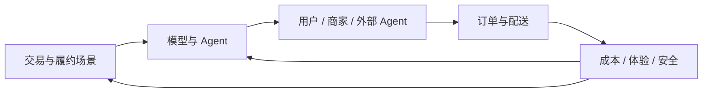
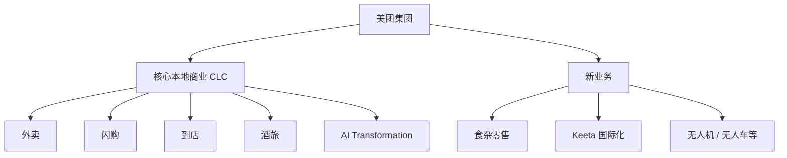
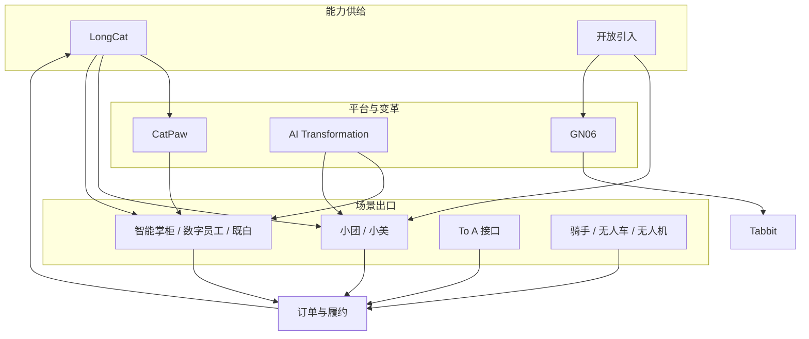
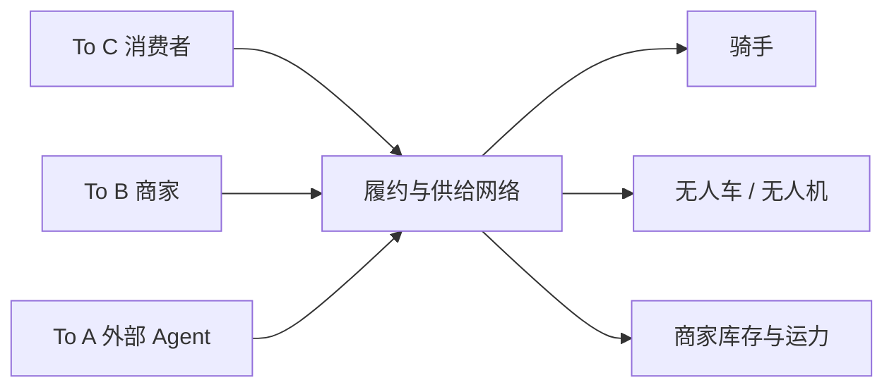
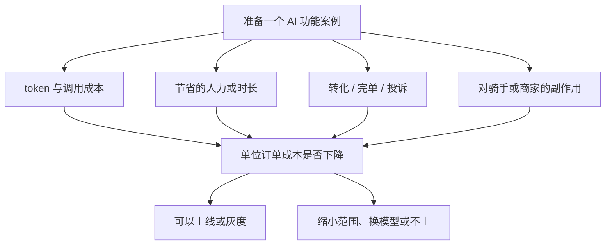

## 美团：AI 产品组织与架构观察

???+ note "信息时效"
    信息截至 2026-09，以官方招聘与最新公开信息为准。

    业务线名称和汇报关系会调整，看 JD 时以招聘部门字段为准。

## 公司概况与 AI 战略

美团的业务以**本地生活**为核心，覆盖到家、到店、酒旅、零售与国际化。财报把经营结果分成**核心本地商业**与**新业务**两段。公开战略是零售加科技，把 AI 用进订单、履约和商家经营。

AI 方向采取**自研 LongCat + 业务线落地 + 开放引入**的组合：

-   **LongCat**：2025 年 9 月起陆续发布；2026 年 6 月开源 LongCat-2.0，总参数 1.6 万亿，公开口径为国产算力集群上完成预训练与推理全流程（[华尔街见闻](https://wallstreetcn.com/articles/3775961)、[美团技术团队](https://tech.meituan.com/2026/07/28/CatPaw-LongCat.html)）
-   **场景先行**：用户侧助手、商家工具、配送调度、客服与内部研发提效，都绑在外卖、到店、酒旅等交易链路上
-   **开放引入**：Tabbit 等产品同时接入 LongCat 与外部模型，按场景效果取舍
-   **物理 AI 与 To A**：用骑手、无人车、无人机把数字决策落到履约；把外部 AI Agent 当成新客户，开放跑腿等能力接口

2026 年一季度研发投入 70 亿元，同比增长 22%。二季度收入 1046 亿元，其中核心本地商业 715 亿元、新业务 331 亿元（[美团 Q1](https://www.meituan.com/news/NN260601238004976)、[美团 Q2](https://www.meituan.com/news/NN260828216013035)）。王莆中公开表示每年 AI 投入超过百亿元，具体以财报与官方口径为准。

本地生活的订单、供给和履约数据进入模型与智能体；智能体再回到下单、调度和经营工具，用成本、体验和安全决定下一轮投入。

## 集团组织：核心本地商业与新业务

看美团岗位，先分清财报两段，再看 CLC 内部的业务线。

CLC 对即时零售和到店酒旅的经营结果负责；新业务覆盖零售扩张、国际化和部分科技履约。AI 能力同时进入两段，财报仍按这两段披露。

| 板块 | 主责 | 代表业务 | AI 岗位常见方向 |
| --- | --- | --- | --- |
| 核心本地商业 | 即时零售、到店与酒旅的经营结果 | 外卖、闪购、到店、酒旅、平台能力 | 点单助手、调度、客服、商家工具 |
| AI Transformation | CLC 内一级部门，统筹 AI to B 与内部流程改造 | CatPaw 协同、商家方案、内部 AI 化 | 商家 Agent、流程改造、跨业务复用 |
| 新业务 | 零售、国际化与部分科技探索 | 小象超市、快乐猴、Keeta | 零售供给、跨境运营中的 AI 工具 |
| 模型与履约科技 | 模型底座与物理配送 | LongCat、CatPaw、无人机、无人车 | 模型产品、自动配送、成本与安全 |

**核心本地商业（CLC）**：外卖、闪购、到店、酒旅是经营主线。2026 年 6 月成立 **AI Transformation**，由前大众点评总经理牧遥负责，向 CLC CEO 王莆中汇报，与外卖、闪购等一级部门平级，聚焦商家侧 AI 与内部变革（[36氪](https://www.36kr.com/p/3868284948108296)）。

**新业务**：食杂零售与国际化是财报公开的增长段。小象超市、快乐猴走线上线下零售；Keeta 覆盖中国香港、中东与巴西等市场。无人机长期投入，公开报道中直接向王兴汇报。

**模型与 GN06**：LongCat 团队提供基础模型。原光年之外收购后整合为 GN06，产品包括 Tabbit、妙刷等；外卖、到店等经营结果仍由 CLC 业务线负责。

## AI 相关组织架构

美团的 AI 组织是**模型底座统一、场景责任留在业务线**：

LongCat 和外部模型进入 CatPaw、助手和商家工具；AI Transformation 负责跨业务推进。最终都汇到订单与履约，再把成本和体验反馈给模型。

这套结构也可以按服务对象读：

消费者、商家和外部智能体都在调用同一张本地生活网络。岗位差异在于：你服务哪一类调用方，以及你对哪一段履约成本负责。

近年与求职直接相关的调整：

-   **2023-2024 年**：收购光年之外并整合为 GN06；持续投入无人机与自动配送
-   **2025 年 9 月起**：发布 LongCat 系列，后续覆盖文本与多模态
-   **2026 年一季度**：王兴提出服务 AI Agent（To A）；小美与腾讯元宝打通本地生活调用
-   **2026 年 5-6 月**：小团进入 App 核心导航；CLC 成立 AI Transformation；Tabbit 1.0 公开
-   **2026 年 6-7 月**：开源 LongCat-2.0，上线 CatPaw；内部把研发提效和无人配送人效一并写入 AI 化目标

美团的 AI 产品经理大多**嵌入具体业务线**，对交易、履约或商家经营指标负责。平台型岗位主要在 CatPaw、LongCat 与 AI Transformation。看 JD 时先认 CLC / 新业务 / 无人配送，再认外卖、到店、酒旅或助手产品名。

## 代表性 AI 产品线

-   **小团**：美团 App 内助手。2026 年二季度口径已从找答案升级到代理执行，可协助下单、打车、订位；当年五一相关服务曝光超过 39 亿次（[美团 Q2](https://www.meituan.com/news/NN260828216013035)）
-   **小美**：独立 App 形态的生活秘书，公开接入腾讯元宝等外部助手，走 To A 调用
-   **智能掌柜、数字员工、既白**：商家侧工具。一季度口径中，智能掌柜服务超过 70 万餐饮商家，数字员工覆盖超过 30 万到店商户，既白面向酒店（[美团 Q1](https://www.meituan.com/news/NN260601238004976)）
-   **CatPaw**：2026 年 7 月上线的全场景 Agent 平台，提供智能工作台与企业级托管，并封装本地生活行业技能（[美团技术团队](https://tech.meituan.com/2026/07/28/CatPaw-LongCat.html)）
-   **LongCat**：自研模型系列，2.0 起强调智能体与代码负载，同时服务内部提效与业务场景
-   **Tabbit**：GN06 的 AI 原生浏览器，自研与外部模型并存
-   **跑腿 Skill 等 To A 接口**：把下单与履约能力封装给外部助手
-   **无人机与无人车**：自动配送。无人机在北京、上海等地公开进入常态化配送；无人车团队在招聘中归属软硬件服务（[美团招聘](https://zhaopin.meituan.com/)）

## AI 产品经理岗位分布与团队特点

-   **岗位分布**：CLC 各业务线内嵌 AI 岗、AI Transformation、CatPaw / 商家工具、小团与小美、LongCat 平台、GN06、无人配送
-   **团队规模**：业务线以场景小组为主；AI Transformation 与 CatPaw 要跨外卖、到店、酒旅协调；无人配送团队同时面对算法、硬件和区域运营
-   **协作方式**：与算法、调度、运营和商家服务一起算效果。本地生活毛利薄，方案通常要同时过用户体验、骑手效率、商家经营和平台成本四道门
-   **看 JD 的方法**：先认业务线，再认服务对象是消费者、商家、内部员工还是外部 Agent。CLC 外卖岗与 CatPaw 平台岗都可能叫 AI 产品经理，指标完全不同

本地生活的策略岗位还要处理多角色冲突，框架见[业务导向型策略框架](../../case/strategy-pm/06-business-oriented/01-framework.md)。

## 求职观察

-   **渠道**：美团招聘官网（[zhaopin.meituan.com](https://zhaopin.meituan.com/)）为主，内推比例高；部门字段会直接写出外卖、到店、无人车等
-   **流程**：简历筛选 → 业务面（通常 2-3 轮）→ HR 面；节奏视业务线而定，部分技术协同岗有测评
-   **特点**：极看重落地与成本意识。高频问题是：这个 AI 功能增加多少调用成本、省掉多少人力、带来多少转化或投诉下降，会不会伤骑手效率或商家体验
-   **可泛化经验**：面试前把一个功能的成本账算完，再讲清它落在哪条业务线、服务哪个角色、失败时如何回退

成本、收益和副作用写到同一张表里，比只讲模型能力更接近美团面试的判断方式。

## 相关阅读

-   [阿里巴巴](alibaba.md)：同样覆盖本地生活，但集团模型供给更集中
-   [百度](baidu.md)：平台能力与事业群分发的对照
-   [大模型创业公司](ai-startups.md)：创业公司与大厂的岗位差异
-   [AI 产品经理面试](../interviews/interview-guide.md)：题型结构与答题框架
-   [求职专题简介](../index.md)

## 来源说明

???+ note "来源说明"
    财报两段划分、小团、商家工具、研发投入与二季度收入，以美团 2026 年一季报、二季报新闻稿为准。

    LongCat-2.0 与 CatPaw 以美团技术团队文章及同步公开报道为准。AI Transformation、Tabbit、To A 与 GN06 来自 2026 年公开报道，正文已就近给出链接。

    整理日期：2026-09-05。
