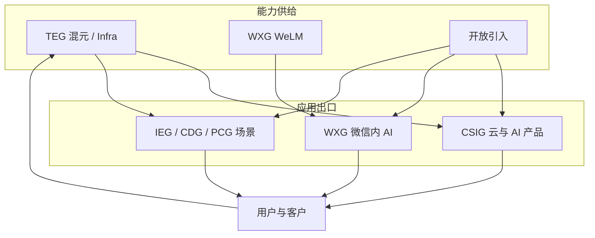

## 腾讯：AI 产品组织与架构观察

???+ note "信息时效"
    信息截至 2026-09，以官方招聘与最新公开信息为准。

    事业群职责和产品归属会调整，看 JD 时以招聘部门字段为准。

## 公司概况与 AI 战略

腾讯的业务以**社交与游戏**为基本盘，同时覆盖金融科技、广告、云计算与企业服务。现行组织骨架是 2018 年确立的**六大事业群 + S 线**，之后产品在群间有划转，骨架未改（[腾讯关于我们](https://www.tencent.com/zh-cn/about.html)、[腾讯校招](https://join.qq.com/about.html)）。

AI 方向采取**自研混元 + 事业群自研 + 开放引入**的组合：

-   **混元大模型**：2023 年公开发布，覆盖文本与多模态，是集团公共模型底座，经腾讯云对外提供 API；2025 年 12 月起由首席 AI 科学家姚顺雨统筹 Infra 与模型研发，2026 年 7 月语言与多模态团队合并为 TEG **基础模型部**（[证券时报](https://www.stcn.com/article/detail/3612110.html)、[21 世纪经济报道](https://m.21jingji.com/article/20260724/herald/03f8e18f8f5d4450ea494f10e809748e.html)）
-   **事业群自研**：微信侧长期维护适配超大用户规模的 WeLM，支撑微信内 AI；优图等应用向实验室仍留在产业侧
-   **开放引入**：元宝、微信搜一搜、游戏与办公等产品公开接入 DeepSeek 等外部模型，与自研并行
-   **场景驱动**：优先用 AI 增强微信、QQ、游戏、广告、文档等既有产品，独立 AI 应用与云出口由 CSIG 承接

2025 年全年资本开支 792 亿元、研发投入 857.5 亿元；财报将广告定向、游戏互动与云收入增长部分归因于 AI（[腾讯 2025 年业绩](https://news.qq.com/rain/a/20260318A07IZA00)）。

## 集团组织：六大事业群与 S 线

模型、云、微信、游戏、广告分属不同 BG。岗位落点先看事业群，再看产品线。

```mermaid
flowchart TB
    G[腾讯集团]
    G --> WXG[WXG 微信事业群]
    G --> PCG[PCG 平台与内容事业群]
    G --> IEG[IEG 互动娱乐事业群]
    G --> CSIG[CSIG 云与智慧产业事业群]
    G --> CDG[CDG 企业发展事业群]
    G --> TEG[TEG 技术工程事业群]
    G --> S[S 线 三大职能系统]

    WXG --> W1[微信 / 视频号 / 小程序]
    WXG --> W2[企业微信 / 支付入口]
    WXG --> W3[小微 / WeLM]

    PCG --> P1[QQ / QQ 空间]
    PCG --> P2[腾讯视频 / 新闻]
    PCG --> P3[应用宝 / 动漫 / 影业]

    IEG --> I1[游戏研发与发行]
    IEG --> I2[电竞]
    IEG --> I3[智能 NPC / AI 队友]

    CSIG --> C1[腾讯云 / 安全]
    CSIG --> C2[元宝 / ima / 浏览器]
    CSIG --> C3[会议 / 文档 / 地图]
    CSIG --> C4[WorkBuddy / QClaw]

    CDG --> D1[腾讯广告]
    CDG --> D2[金融科技]
    CDG --> D3[SSV / 战略投资]

    TEG --> T1[混元基础模型]
    TEG --> T2[AI Infra / 数据]
    TEG --> T3[数据中心 / 技术中台]

    S --> S1[S1 职能线]
    S --> S2[S2 财经线]
    S --> S3[S3 HR 与管理线]
```

六大事业群经营产品与收入，S 线提供法务、财经与人力等集团职能。看 JD 时先认 BG 缩写，再认具体产品。

| 事业群 | 全称 | 主责 | 代表产品与单元 | AI 岗位常见方向 |
| --- | --- | --- | --- | --- |
| WXG | Weixin Group | 微信生态与开放平台 | 微信、公众号、小程序、视频号、搜一搜、企业微信、QQ 邮箱、微信读书 | 超级 App 内助手、搜索、开放平台与交易链路 |
| PCG | Platform and Content Group | 社交平台与数字内容 | QQ、QQ 空间、腾讯视频、腾讯新闻、应用宝、动漫、影业 | 社交推荐、内容分发与创作工具 |
| IEG | Interactive Entertainment Group | 游戏与电竞 | 游戏工作室、发行、电竞 | 玩法与 NPC、AI 队友、内容生产 |
| CSIG | Cloud and Smart Industries Group | 云、产业与 AI 应用出口 | 腾讯云、安全、会议、文档、地图、元宝、ima、QQ 浏览器、WorkBuddy | 云平台、C 端助手、办公智能体、行业方案 |
| CDG | Corporate Development Group | 商业化与新业务 | 腾讯广告、金融科技、SSV、战略与投资 | 广告智能投放与创意、金融科技风控与服务 |
| TEG | Technology and Engineering Group | 技术中台与基础研究 | 混元、AI Infra、数据平台、数据中心、客服 | 模型产品、评测、平台与开发者体验 |
| S 线 | 三大职能系统 | 集团职能 | S1 法务与公共事务等；S2 财经；S3 HR | 业务 AI 产品岗少见 |

**WXG**：搭建微信生态，官方表述覆盖公众号、小程序、微信支付、企业微信、微信搜索，以及邮箱、通讯录、微信读书（[腾讯关于我们](https://www.tencent.com/zh-cn/about.html)）。2026 年微信内测原生助手**小微**，报道称主模型为微信团队自研 WeLM，部分场景调用外部模型（[钛媒体](https://www.tmtpost.com/8054184.html)）。微信支付出现在微信开放能力里，金融科技经营与合规常见于 CDG 招聘字段。

**PCG**：QQ、在线视频、新闻资讯、应用宝等内容与流量平台。2025 年 2 月公开报道称 QQ 浏览器、搜狗输入法、ima 从 PCG 转入 CSIG（[新京报](https://news.qq.com/rain/a/20250220A04TCK00)）。腾讯音乐、阅文等上市公司有独立招聘入口。

**IEG**：游戏策划、研发、发行、运营与电竞。AI 用在智能 NPC、AI 队友、内容生产与安全审核，模型可来自混元、外部模型或工作室自研。

**CSIG**：腾讯云、安全与产业解决方案，并承接集团主要 AI 应用出口。2025 年 1 月元宝从 TEG 转入 CSIG；随后 ima、QQ 浏览器等汇入，与会议、文档、地图同一事业群（[腾讯新闻](https://news.qq.com/rain/a/20250117A01C7Q00)）。2026 年 7 月 QClaw 团队划入云产品六部，与 WorkBuddy 同部门管理（[AIBase](https://news.aibase.cn/news/29778)）。

**CDG**：金融科技、广告营销服务，以及战略、投资、市场公关、SSV 等专业支持（[腾讯校招](https://join.qq.com/about.html)）。广告侧公开产品包括智能投放与 AI 创意工具；金融科技覆盖支付、理财与信贷等。

**TEG**：数据中心、技术中台、研发管理与客服，并牵头技术委员会。混元基础模型、AI Infra、AI Data 在此；2026 年 3 月撤销 AI Lab，部分人员并入混元团队（[第一财经](https://www.yicai.com/news/103097489.html)）。

**S 线**：S1 职能线（法务、公共事务、行政、采购等）、S2 财经线、S3 HR 与管理线。支持全公司运转，不经营 C 端产品。

## AI 相关组织架构

腾讯的 AI 组织是**多供给、按事业群接入**：

混元和 Infra 在 TEG，C 端助手与云 API 在 CSIG，微信内 AI 走 WXG 自研链路，游戏、广告、QQ 在各自 BG 落地。外部模型按产品接入，用户与业务反馈再回到模型与平台。

近年与求职直接相关的调整：

-   **2025 年 1 月**：元宝产品团队从 TEG 转入 CSIG，模型研发与 C 端应用分开
-   **2025 年 2 月**：QQ 浏览器、搜狗输入法、ima 从 PCG 转入 CSIG，与云和办公产品并列
-   **2025 年 4 月至 12 月**：TEG 成立大语言模型部、多模态模型部，随后组建 AI Infra、AI Data；姚顺雨任首席 AI 科学家
-   **2026 年 3 月**：撤销 AI Lab，核心研发并入混元
-   **2026 年 7 月**：语言与多模态合并为基础模型部；QClaw 并入云产品六部，与 WorkBuddy 整合

腾讯的 AI 产品经理大多**依托具体事业群场景**工作，要求场景理解与模型运用兼备。纯平台型岗位主要在 CSIG 腾讯云与 TEG 模型侧。

## 代表性 AI 产品线

-   **腾讯元宝**：C 端 AI 助手，2024 年 5 月上线，2025 年起由 CSIG 运营，覆盖搜索、文档、图像等
-   **ima**：浏览器团队孵化的 AI 工作台，与 QQ 浏览器一并进入 CSIG
-   **WorkBuddy / QClaw / CodeBuddy**：CSIG 云产品体系下的办公与开发智能体；QClaw 于 2026 年 7 月并入云产品六部
-   **腾讯云混元服务**：模型 API、知识引擎、Agent 与行业方案，面向企业
-   **微信小微与搜一搜 AI**：WXG 产品内能力；小微 2026 年灰度，搜一搜已公开接入外部推理模型
-   **会议、文档、地图**：CSIG 协同与出行产品中的总结、写作、导航等 AI 功能
-   **游戏内 AI**：IEG 项目中的智能 NPC、AI 队友与内容工具
-   **广告 AI**：CDG 腾讯广告的智能投放与创意生产，公开产品包括 AIM+ 与妙创等

## AI 产品经理岗位分布与团队特点

-   **岗位分布**：CSIG（元宝、云、会议文档、地图、办公智能体）、WXG（微信内 AI 与开放平台）、IEG（游戏 AI）、CDG（广告与金融科技）、PCG（QQ 与内容）、TEG（模型与平台）
-   **团队规模**：以场景小组为主；微信、游戏等成熟 BG 沉淀深，CSIG 应用团队 2025 年后扩得快
-   **协作方式**：与算法一起做模型选型（自研混元、事业群自研、外部引入），需要效果评测与成本意识；WXG 还受隐私、调用规模与开放平台约束
-   **看 JD 的方法**：先认事业群缩写，再认产品名。CSIG 地图岗与 WXG 小微岗都叫 AI 产品经理，服务对象、指标和可调用模型不同

## 求职观察

-   **渠道**：腾讯招聘官网（[join.qq.com](https://join.qq.com/)）为主，内推比例高；校招简介按事业群展示部门
-   **流程**：简历筛选 → 笔试/测评（部分岗位）→ 业务面（2-3 轮）→ HR 面；节奏视事业群而异
-   **特点**：看重用户导向与产品 sense，面试常从具体产品场景切入；对黑话免疫、对细节较真
-   **可泛化经验**：准备一个「用 AI 增强某个既有产品」的真实案例，并说清该产品落在哪个 BG、模型从哪来、指标是什么

## 相关阅读

-   [字节跳动](bytedance.md)、[阿里巴巴](alibaba.md)、[百度](baidu.md)、[美团](meituan.md)：同梯队大厂的组织与岗位对比
-   [大模型创业公司](ai-startups.md)：创业公司与大厂的岗位差异
-   [AI 产品经理面试](../interviews/interview-guide.md)：题型结构与答题框架
-   [求职专题简介](../index.md)

## 来源说明

???+ note "来源说明"
    事业群划分与职责以 [腾讯关于我们](https://www.tencent.com/zh-cn/about.html) 与 [腾讯校招「了解腾讯」](https://join.qq.com/about.html) 为准。

    产品在事业群之间的划转、混元团队调整、小微与办公智能体，来自 2025-2026 年公开报道，正文已就近给出链接。

    整理日期：2026-09-05。
