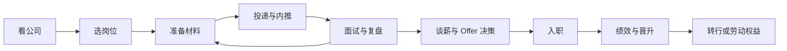

## 求职专题简介

求职专题是 **AI 产品经理与大模型行业求职的资源合集**：从目标公司的组织与架构观察、常见岗位与 JD 解读，到真实面经与过来人的感悟，覆盖求职全流程。

核心关系是：求职从公司和岗位判断开始，以材料、投递、面试反馈持续迭代，完成 Offer 决策后继续管理入职后的绩效、发展和风险。

## 内容分类

### 常见大厂与架构

[常见大厂与架构](companies/index.md)：头部公司与大模型创业公司的 AI 组织架构观察、代表性产品线，以及 AI 产品经理岗位的分布与团队特点。

### 求职实操

[内推机制](referral.md)与[简历与作品集](resume-portfolio.md)：准备求职材料、寻找内推机会，并把项目经历整理成可验证、可追问的证据。

### 常见岗位与 JD

[常见岗位与 JD](positions/index.md)：AI 产品经理、大模型应用工程师与 Agent 工程师、算法工程师、提示词工程师等产品与技术岗，数据、评测与训练类岗位（含 AI 训练相关岗位），设计师、研发、测试、硬件、行政等协作岗，以及 AI Infra、FDE 与高管岗位，共 14 个岗位方向。

### 面经

[面经](interviews/index.md)：校招与社招的真实面经、面试流程全览、复盘方法论与谈薪 Offer 选择。

### 入职之后

[入职之后](after-entry/index.md)：绩效管理与考核、晋升与职业发展、转行与职业转换、裁员与劳动权益。这个栏目覆盖从入职后的目标与反馈，到发展选择和劳动风险应对的连续问题。

### 真实感悟

[真实感悟](insights/index.md)：入行、职业发展、踩坑与心态的真实感悟，帮你提前看到路上的坑与光。

## 怎么用本栏目

按求职与入职阶段参考对应内容：

1.  **看公司**：先读[常见大厂与架构](companies/index.md)，了解目标公司的 AI 组织形态与岗位分布，圈定目标清单
2.  **选岗位**：对照[常见岗位与 JD](positions/index.md)，明确各岗位的职责边界，判断自己匹配哪个方向
3.  **备面试**：读[面经](interviews/index.md)了解真实流程与常见问题，再配合[AI 产品经理面试](interviews/interview-guide.md)的答题框架做针对性练习
4.  **查黑话**：面试用词必须准确，出口前查[产品经理黑话速查](../intro/glossary.md)
5.  **做复盘**：每场面试后按[面试复盘方法论](interviews/review-methodology.md)系统复盘，避免在同一处跌倒两次
6.  **做 Offer 决策**：结合[谈薪与 Offer 选择](interviews/offer-negotiation.md)核对书面条件，再决定是否入职
7.  **入职后持续迭代**：先读[入职之后](after-entry/index.md)，按需查看绩效、晋升、转行和劳动权益内容
8.  **定心态**：焦虑、纠结时读[真实感悟](insights/index.md)，看看过来人是怎么走过来的

## 时效性声明

AI 行业变化极快，组织架构、岗位 JD 与薪酬信息**以最新公开信息为准**。本栏目各页面顶部均注明信息时效，阅读时请结合官方招聘页面与近期公开报道交叉验证。

## 相关阅读

-   [AI 产品经理面试](interviews/interview-guide.md)：题型结构与典型题答题框架
-   [产品经理黑话速查](../intro/glossary.md)：面试用语准确性的保障
-   [如何参与](../intro/htc.md)：贡献面经、公司观察与感悟，帮助后来者
