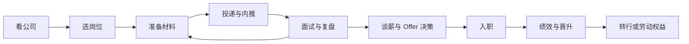

## 求职专题简介

求职专题是 **AI 产品经理与大模型行业求职的资源合集**：从目标公司的组织与架构观察、产品经理岗位类别与真实 JD 样本，到产品经理需要协作的团队与岗位、面经和过来人的感悟，覆盖求职全流程。

核心关系是：求职从公司和岗位判断开始，以材料、投递、面试反馈持续迭代，完成 Offer 决策后继续管理入职后的绩效、发展和风险。

## 内容分类

### 公司架构与岗位

从公司组织、产品经理岗位方向和协作团队三个角度，判断求职岗位的真实工作边界。

#### 常见大厂与架构

[常见大厂与架构](companies/index.md)：头部公司与大模型创业公司的 AI 组织架构观察、代表性产品线，以及 AI 产品经理岗位的分布与团队特点。

#### 产品经理岗位类别

[产品经理岗位类别](product-manager-types/index.md)：按技术对象、服务对象和结果责任理解 AI、互联网、平台、策略、数据、商业化与智能终端等产品经理方向，并用公开招聘页的真实 JD 样本核对岗位边界。

#### 产品经理协作团队与岗位

[产品经理协作团队与岗位](positions/index.md)：梳理产品经理需要共同工作的算法、训练、评测、研发、Infra、设计、测试、运营、市场、销售、解决方案、FDE、硬件、法务、安全、行政与管理角色。

### 求职实操

[内推机制](referral.md)与[简历与作品集](resume-portfolio.md)：准备求职材料、寻找内推机会，并把项目经历整理成可验证、可追问的证据。

#### JD 拆解

[JD 拆解](jd-breakdowns/index.md)：一篇文章拆一份真实 JD，逐条还原岗位职责、用户、技术协作、指标、面试信号和投递前需要确认的问题。先用[产品经理岗位类别](product-manager-types/index.md)确定方向，再用具体案例判断某个团队的实际工作范围。

#### 面经

[面经](interviews/index.md)：校招与社招的真实面经、面试流程全览、复盘方法论与谈薪 Offer 选择。

[入职之后](after-entry/index.md)：绩效管理与考核、晋升与职业发展、转行与职业转换、裁员与劳动权益。这个栏目覆盖从入职后的目标与反馈，到发展选择和劳动风险应对的连续问题。

### 真实感悟

[真实感悟](insights/index.md)：入行、职业发展、踩坑与心态的真实感悟，帮你提前看到路上的坑与光。

## 怎么用本栏目

按求职与入职阶段参考对应内容：

1.  **看公司**：从[常见大厂与架构](companies/index.md)了解目标公司的 AI 组织形态与岗位分布，圈定目标清单
2.  **选岗位**：先读[产品经理岗位类别](product-manager-types/index.md)，用真实 JD 样本判断目标方向；再看[产品经理协作团队与岗位](positions/index.md)，确认需要共同工作的团队和角色
3.  **拆 JD**：从[JD 拆解](jd-breakdowns/index.md)中挑选具体案例，把岗位文字翻译成用户、任务、指标和面试准备问题
4.  **备面试**：读[面经](interviews/index.md)了解真实流程与常见问题，再配合[AI 产品经理面试](interviews/interview-guide.md)的答题框架做针对性练习
5.  **查黑话**：面试用词必须准确，出口前查[产品经理黑话速查](../intro/glossary.md)
6.  **做复盘**：每场面试后按[面试复盘方法论](interviews/review-methodology.md)系统复盘，避免在同一处跌倒两次
7.  **做 Offer 决策**：结合[谈薪与 Offer 选择](interviews/offer-negotiation.md)核对书面条件，再决定是否入职
8.  **入职后持续迭代**：先读[入职之后](after-entry/index.md)，按需查看绩效、晋升、转行和劳动权益内容
9.  **定心态**：焦虑、纠结时读[真实感悟](insights/index.md)，看看过来人是怎么走过来的

## 时效性声明

AI 行业变化极快，组织架构、岗位 JD 与薪酬信息**以最新公开信息为准**。本栏目各页面顶部均注明信息时效，阅读时请结合官方招聘页面与近期公开报道交叉验证。

## 相关阅读

-   [AI 产品经理面试](interviews/interview-guide.md)：题型结构与典型题答题框架
-   [产品经理黑话速查](../intro/glossary.md)：面试用语准确性的保障
-   [如何参与](../intro/htc.md)：贡献面经、公司观察与感悟，帮助后来者
-   [垂直领域](../vertical/index.md)：行业与交付型岗位需要的领域结构、监管和 AI 切入点
