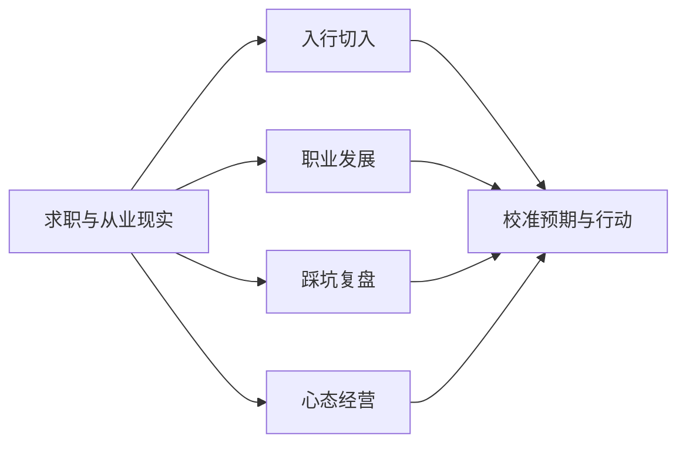

## 真实感悟

本栏目汇集 AI 产品经理从业者的**真实感悟**：入行体验、职业发展、踩坑教训与心态建设。内容来自过来人的实际经历与回头视角，帮你把预期校准到现实。

核心关系是：入行、发展、踩坑和心态四类经验共同帮助求职者校准预期，再转化为具体行动。

!!! warning "声明:主观经验,非事实陈述"
    本栏目内容来自从业者的**匿名分享与经验观点整理**，不是事实陈述，也不构成求职或职业建议。

    个人经历千差万别，同一件事在不同人身上可能得出相反结论；结合自身情况对照参考，不要将任何一条当作「标准答案」或「成功公式」。

## 内容列表

-   [入行感悟](newcomers.md)：应届入行与转行者的真实体验：切入点、第一年的信息差与上手路径
-   [职业发展感悟](career.md)：晋升、跳槽、平台选择与职业瓶颈期的真实处境
-   [踩坑教训](lessons.md)：过来人复盘出的共性问题：选错方向、业务不成立、依赖幻觉、过早乐观
-   [心态感悟](mindset.md)：焦虑、同龄人比较、行业变化快带来的不安全感，以及可持续的心态经营

## 怎么用本栏目

-   先读[求职专题首页](../index.md)，了解栏目全貌与你的需求落在哪
-   四篇文章可以按需读，但建议把[踩坑教训](lessons.md)和[心态感悟](mindset.md)也过一遍：它们谈的是入行前很少有人提醒的事
-   感悟类内容时效性有限，搭配[常见岗位与JD](../positions/index.md)与[面试](../interviews/index.md)栏目阅读，信息更完整
-   所有文章都标注了信息截至时间，请留意行业变化可能让部分观点过时

## 欢迎投稿

我们欢迎从业者以**匿名或化名**方式分享自己的真实经历与感悟：入行故事、踩坑复盘、心态变化都行。不求文采，只求真实与克制：不编造、不贩卖焦虑、对不确定的事如实说明。

投稿方式见[如何参与](../../intro/htc.md)；如果你的投稿涉及敏感信息，可以只留化名，我们会按你的意愿处理。
