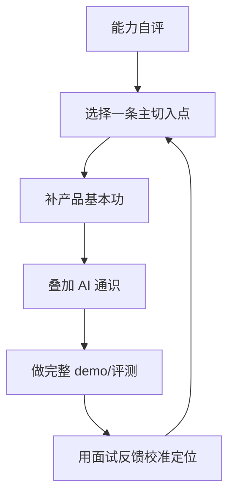

## 入行感悟

### 引子

AI 产品经理是近几年才出现的岗位名称，没有成熟的人才培养体系，也没有统一的入行路径。想入行的人常常面临类似的困惑：从哪个岗位、哪个行业、哪项技能切入？第一年到底会经历什么？网上信息两极分化：一边把 AI PM 描述成风口上的黄金岗位，一边劝退说「大部分是伪 AI 岗」。真实的体验介于两者之间，而且高度因人而异。

本页把匿名从业者分享的入行经验做泛化整理，不指向任何具体个人。它是一张别人走过的路的地图，路线因人而异。

核心关系是：先根据背景选一条切入路径，补基本功并做出完整作品，再用市场反馈而不是想象调整方向。

!!! info "时效性"
    本文信息截至 2026-08。AI 行业岗位定义与行情变化较快，请以最新招聘信息为准。

## 过来人共识

### 共识一：先有产品基本功，再谈 AI

**现象**：入行者常见两类倾向：技术背景的人觉得「我懂 AI 就够」，非技术背景的人担心「我不懂算法怎么办」。第一年之后，多数人会发现两者都不是重点。

**为什么**：AI 产品经理首先是产品经理。需求分析、用户研究、评审、项目管理、数据复盘是日常动作，AI 只是叠加在这些基本功之上的能力层；AI 相关的部分（模型选型、评测、兜底）考的是判断，不是实现。

**建议**：入行前先对照[AI 产品经理能力模型](../../intro/capability.md)自评，把通用产品技能补到位，再叠加 AI 认知。本站[自学路线](../../intro/self-study-roadmap.md)的阶段零与阶段一按这个顺序设计，可以直接参照。

### 共识二：切入点有三条，没有标准答案

**现象**：常见的入行路径大致有三类：**岗位平移**（从运营、研发、设计、测试等岗位转过来）、**行业切入**（进入 AI 公司，或进入传统行业的 AI 部门）、**技能切入**（先做出作品集、demo、评测报告再求职）。

**为什么**：三类路径各有利弊。AI 公司节奏快、认知新，但竞争激烈、岗位要求高；传统行业的 AI 岗更稳、竞争小，但 AI 深度和话语权往往有限；技能切入最能体现主动性，但需要时间和自律。没有哪条一定对，取决于你的背景与风险承受力。

**建议**：结合自己的背景选一条主路径深耕，不要三条同时铺开；同时对照[产品经理岗位类别](../product-manager-types/index.md)和[产品经理协作团队与岗位](../positions/index.md)了解当前市场上的真实岗位要求与协作边界，避免凭想象求职。

### 共识三：第一年的真实体验——信息差大，上手靠做

**现象**：不少过来人回顾第一年时提到三件事：学校与教程和一线实践脱节；模型能力变化快（半年到一年就可能换代，去年学的今年过时）；会用 AI 工具和会做 AI 产品之间差距比想象中大。

**为什么**：AI 领域的知识保鲜期短，信息来源的质量决定了认知速度；产品能力只有通过完整走一遍「需求—设计—评测—上线—迭代」才能建立，看教程替代不了。

**建议**：第一年把重心放在**建立信息获取系统**和**动手做完整项目**上，而不是背知识点。重度使用 2-3 款主流 AI 产品、记录惊喜与失望时刻、做一两个可演示的 demo，产出 10 条「AI 能力边界」笔记：这些都是[自学路线](../../intro/self-study-roadmap.md)里可落地的动作。

### 共识四：「AI 产品经理」这个 title 下的实际工作差异很大

**现象**：很多挂着「AI 产品经理」头衔的岗位，实际内容差别很大：有的确实是做 AI 产品（模型选型、评测、数据、兜底都要管），有的只是传统产品岗要求会使用 AI 工具，还有的偏运营执行。

**为什么**：岗位定义还在演化期，不同公司对 AI PM 的预期完全不同。入职前如果没问清楚，入职后容易产生「名不副实」的落差。

**建议**：面试和 offer 沟通阶段，主动问清职责边界：是否涉及评测、模型选型、数据闭环？对候选人的技术预期是什么？可以参考[面试](../interviews/index.md)栏目里关于「鉴别伪 AI PM 岗」的提示。

## 常见误区

-   **误区一：把会用 AI 工具当成岗位能力**。会聊天式地使用 ChatGPT 不等于具备 AI 产品能力；评测体系、兜底设计、需求判断才是差异点所在。
-   **误区二：技术焦虑的两个极端**。要么觉得「不懂算法就没资格入行」，要么完全回避技术细节。实际需要的是中间层：和技术团队对话、理解能力边界，而不是自己训练模型。
-   **误区三：只输入不输出**。收藏夹里堆满教程、每天刷资讯，但没有笔记、没有作品、没有拆解：输入没有沉淀，等于没学。

## 建议的行动

1.  **自评并选切入点**：对照[能力模型](../../intro/capability.md)写出差距清单，结合自身背景选定一条主切入点（岗位/行业/技能），给自己设一个 3 个月的验证期。
2.  **按学习路线补基本功并做出作品**：走完[自学路线](../../intro/self-study-roadmap.md)的阶段零到阶段二，产出至少一个可演示的 demo 和一份产品方案；作品是求职时最有说服力的材料。
3.  **建立信息源与能力边界笔记**：整理 5-10 个高质量信息源，每周记录；结合[模型能力与边界](../../ai/capabilities.md)写出自己的「AI 能力边界」笔记。
4.  **用面试做体检**：投递前先拿[面试](../interviews/index.md)栏目和[AI 产品经理面试](../interviews/interview-guide.md)的典型题自测，用反馈修正自己的定位与表达。

## 相关阅读

-   [求职专题首页](../index.md)
-   [产品经理协作团队与岗位](../positions/index.md)
-   [产品经理岗位类别](../product-manager-types/index.md)
-   [面试](../interviews/index.md)
-   [自学路线](../../intro/self-study-roadmap.md)
-   [AI 产品经理能力模型](../../intro/capability.md)
-   [转行与职业转换](../after-entry/career-transition.md)：针对已有工作经历的在职转岗、转行业与桥接计划
