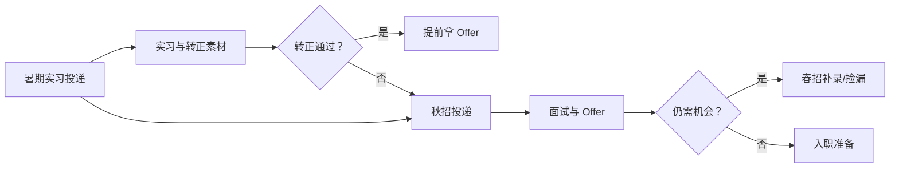

## 校招面经

校招是应届生进入大厂产品岗最主要的通道，特点是**节奏固定、竞争集中、信息差大**。校招的通用时间线、实习转正路径、笔试准备与常见坑，帮第一次求职的人少走弯路。

信息截至 2026-08，各家招聘节奏每年微调，以最新公开信息为准。

## 应届生求职时间线

产品岗校招的主线是：**暑期实习 → 秋招 → 春招补录**。

核心关系是：实习转正和秋招是主路径，未拿到确定 Offer 时继续投入春招补录，不把备胎池或口头承诺当成结果。

### 阶段一：暑期实习（3-6 月投递，暑期入职）

-   大厂暑期实习一般 3-5 月开放投递，暑期 7-8 月入职，周期 2-3 个月
-   实习不仅是简历加分项，**转正**是校招 Offer 的重要来源（见下节）
-   错过暑期实习的同学，可关注日常实习（全年滚动，周期更灵活）

### 阶段二：秋招（7-9 月投递，8-11 月面试）

-   秋招是校招**主战场**，岗位量最大、流程最正式
-   各家节奏不同：互联网大厂一般 7 月陆续开投，8-10 月集中面试，10-11 月陆续发 Offer
-   建议**广投 + 分批面试**：先投保底梯队练手，再冲目标梯队：把前几次面试当模拟（见[面试复盘方法论](review-methodology.md)）

### 阶段三：春招补录（次年 3-4 月）

-   秋招 Offer 毁约、HC 追加会产生补录名额，岗位量少于秋招
-   春招也是考研失利、秋招不顺的同学的第二机会

### 阶段四：补录/捡漏（次年 5-6 月）

-   少量公司持续零星补招，信息主要靠内推与招聘平台
-   走到这一步心态很重要：补录岗位随机性大，别把运气当实力，也别把没赶上当失败

## 实习转正路径

暑期实习转正是校招最重要的上岸路径之一，流程一般是：

1.  **入职即开始攒转正素材**：日常的每个项目、每次反馈都是素材
2.  **中期沟通**：实习过半主动与导师/主管沟通转正意向，明确差距
3.  **转正答辩**：提交实习总结，面向主管与 HR 展示项目结果与成长
4.  **结果**：通过则直接拿 Offer（通常早于秋招），不通过则回到秋招流程

转正要点：

-   结果要可量化：做了什么、带来什么指标变化，和[讲项目的方法](social-interviews.md)一致
-   主动要反馈：实习期定期问导师「我还有哪里要改进」，转正答辩不过是这些反馈的总结
-   转正不只看能力，也看**融入度**：和团队协作顺畅，是重要的隐性考察点

## 笔试准备

校招笔试（含在线测评）是淘汰率较高的环节，建议：

1.  **提前熟悉题型**：公开平台（牛客、应届生论坛等）有大量往年真题与讨论，提前做 2-3 套熟悉形式
2.  **分题型准备**：产品岗笔试常见题型：行测类（逻辑、数量）、专业主观题（需求分析、产品设计）、英语阅读（少数公司）
3.  **主观题按框架写**：需求→方案→验证→风险，结构完整比文采重要，答题框架参考 [AI 产品经理面试指南](interview-guide.md)
4.  **时间分配**：先做会做的，别在单题上恋战

## 常见节奏与坑

1.  **投递窗口错过**：秋招投递窗口可能只有 1-2 个月，**越早投越早面**，别等「准备好再投」：准备永远没有「完全好」的一天
2.  **流程停滞**：简历已读不回、面试后长时间无消息。对策：通过内推人/HR 礼貌跟进；同时继续投其他家，**别押注单一流程**
3.  **备胎池（人才库）**：面试通过但 HC 不足，候选人被放入备选池，后续有坑才捞，特征常是口头说「通过但没 HC」。对策：不拒绝也不等待，继续面其他公司，把它当「额外机会」而非「确定性」
4.  **口头 Offer 变卦**：以书面 Offer 为准，拿到前继续面
5.  **信息差**：岗位要求、面试风格、HC 情况，内推人/学长学姐的信息比帖子更准，**主动积累人脉比刷帖子有效**

## 相关阅读

-   [大厂面试流程全览](interview-process.md)：从投递到 Offer 的完整流程
-   [面试复盘方法论](review-methodology.md)：每场面试后的复盘方法
-   [AI 产品经理面试指南](interview-guide.md)：答题框架
-   [自学路线](../../intro/self-study-roadmap.md)：面试前的系统准备路径
-   [谈薪与 Offer 选择](offer-negotiation.md)：拿到 Offer 后怎么选
-   [求职黑话合集](../jargon.md)：网申、OT、Base、三方与备胎池
