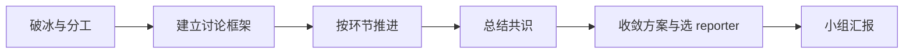
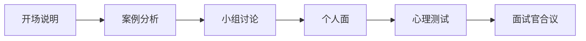

## 群面 / 无领导小组 / AC 面：校招产品岗怎么打

单面还能靠答题框架救场，群面暴露的是即时反应与协作能力。校招产品岗的群面、无领导小组讨论与 AC 面（Assessment Center）淘汰率普遍高于单面：一场讨论 6-10 人，常只进 1-2 个。本文拆三种形式的考察逻辑、无领导小组的打法、AI 产品群面真题思路与 AC 面的组合准备。

信息截至 2026-08，各家形式与节奏存在差异，以最新公开信息与招聘方通知为准。

## 三种形式：考察什么，淘汰什么

三种形式经常被混着叫，但考察逻辑不同。先分清形式，再谈打法。

### 群面

**形式**：多名候选人同场，围绕同一题目进行角色扮演、辩论或方案讨论，面试官旁观不参与。题目常是商业/产品方案题，偶见辩论题。

**考察点**：即兴反应、口头表达、结构化思维、协作意识。单面可以提前背，群面考的是临场发挥。

**淘汰逻辑**：群面是筛选机制不是排序机制，一场只进少数人。被刷常见：全程低参与、发言无信息量、攻击队友、跑题、把讨论变成个人演讲。

常见的群面题目形态：

-   **方案讨论**：给一个开放产品或商业问题，小组产出方案，如「设计一个校园二手交易平台」
-   **辩论**：给一个对立命题，分成正反两方，如「AI 产品该不该先追求用户体验而非商业化」。辩论考的仍是结构化表达，不是嗓门
-   **角色扮演**：给具体情境与角色，现场演一段，如模拟与研发沟通需求变更

面试官手上通常有一张评分表，维度大同小异，发言往这几个方向靠即可：

-   **逻辑结构**：发言是否有框架、有依据
-   **表达沟通**：是否清楚、简洁、易听懂
-   **协作意识**：是否接话、让话、拉回跑题
-   **岗位潜力**：整体表现像不像一个产品经理

### 无领导小组讨论

**形式**：不给指定角色，候选人自行组织讨论，最后一般要产出结论并派代表汇报。题目以方案讨论为主，和群面里的方案讨论很像，差别在于「无人组织」。

**考察点**：在无人组织的前提下，能否推动讨论形成结论。比群面更看重组织与推进能力，不只是说得好。

**淘汰逻辑**：与群面类似，但特别看重参与质量。说了很多却没推动结论，和没说一样危险。

!!! tip "群面与无领导的分界"
    不少公司把两者合并使用：先自由讨论（无领导），再插入角色要求（群面）。按题目形态应对，不用纠结叫法。

### AC 面（Assessment Center）

**形式**：多环节组合评估，半天到一天：案例分析、小组讨论、个人面、心理测试按顺序排，每个环节由不同面试官观察记录。

**考察点**：综合管理潜力，多用于对跨环节一致性、时间管理与抗压要求高的岗位。环节本身难度一般，难在连续作战不掉链子。

**淘汰逻辑**：AC 面看的是多环节画像，某一环节平平可以靠其他环节拉回，但跨环节矛盾（案例里说重视数据、个人面又说靠直觉）会被重点追问。

### 一张表对比

| 维度 | 群面 | 无领导小组 | AC 面 |
| --- | --- | --- | --- |
| 组织形式 | 有角色 / 辩论 / 方案讨论 | 自由讨论 | 多环节串行 |
| 考察重点 | 即兴与表达 | 组织与推进 | 综合与一致性 |
| 常见时长 | 30-60 分钟 | 30-60 分钟 | 半天到一天 |
| 淘汰逻辑 | 参与度与质量 | 结论贡献度 | 跨环节画像 |

## 无领导小组怎么打

无领导是校招产品岗最常见的群面形式，也最有方法可循。**你的任务是帮小组形成高质量结论，对结论的贡献才是打分依据**。出风头不重要，把队友当对手必输。

### 讨论流程：破冰 → 框架 → 推进 → 收敛

核心关系是：群面不是个人演讲，而是用分工、框架和总结把小组从发散推进到可汇报的结论。

一场 40 分钟的讨论，时间大致可以这样切：

1.  **破冰（1-3 分钟）**：有人先开口，给出初步方向或提议分工。先开口不等于抢 leader，提一个「我们先花 3 分钟各自看题，再统一思路」的动议就能完成破冰
2.  **框架（3-8 分钟）**：把题目拆成结构，把讨论拉回主线。产品方案题常见框架：用户场景 → 方案 → 验证 → 风险 → 收束
3.  **推进（8-35 分钟）**：逐环节讨论，每完成一块就总结一句共识再进入下一块。讨论跑偏时，主动拉回话题的人贡献最大
4.  **收敛（最后 5 分钟）**：停止新发散，汇总结论、确认汇报结构、选 reporter、补漏

!!! tip "时间感"
    组里没人计时时，主动承担计时是低成本高回报的动作。

### 开场第一句话怎么说

破冰的质量决定讨论基调，三种开口都成立：

-   **给流程**：「我们先花 3 分钟各自看题，然后依次说观点，最后统一方案」，给的是结构
-   **给框架**：「我建议按用户、方案、风险三步走」，给的是思路
-   **给分工**：「我记一下要点，XX 帮我们看下时间」，给的是组织

避免的开场：上来就抛一个具体方案让所有人讨论，「我觉得做个语音助手就行」。太早收敛，后面所有人都在你一个点子上打转。

### 角色选择：不是只有 leader 能过

很多候选人一进组就抢 leader，觉得只有 leader 才被看见。观察官打分的是**你在当前角色里是否创造了价值**，不是头衔。

-   **leader**：定框架、控节奏、适时拍板。适合有全局观、能让讨论跟着结构走的人；不适合只是想说话的人
-   **timer**：看时间、提醒进度。做好要在关键节点提醒「还剩 10 分钟，该收敛第二部分了」，只说「时间快到了」没有价值
-   **recorder**：记录讨论要点，结构化整理。记录做得清晰的人，最后常自然成为 reporter
-   **reporter**：代表小组汇报。压力最大，需要条理与抗压；汇报质量直接决定小组结论的呈现
-   **facilitator**：调和分歧、把沉默的人拉进来、把偏题的拉回来。观察者视角，容易出彩

判断自己该拿哪个角色：**先评估组里已有什么，再补缺**。有人抢了 leader 且控制得不错，就别硬争，转做结构补充或 facilitator 同样出彩。

### 高质量发言

-   **框架先行**：先给结构再填细节。「我建议分三步：先定用户场景，再谈方案，最后给风险」比直接抛一个点子有信息量
-   **承上启下**：先接住前一个人的话再往前推。「刚才 XX 说的场景很有道理，我再补一个落地角度」。讨论因此连成线，而不是一堆散点
-   **总结推进**：讨论发散时，把已达成共识的话复述一遍，提出下一步。「我们已确定目标用户是新手商家，接下来把第一个方案细化」是全场最加分的发言类型
-   **给依据**：观点带理由。「我建议先做 FAQ，因为它命中 80% 的重复问题，成本最低」

### 低质量发言避免

-   **抢话**：打断别人是全场最减分行为，再好的观点也要等别人说完
-   **无依据反对**：「我觉得不行」说不出理由，比不说更糟；要反对就给出替代方案
-   **自说自话**：讲自己的方案不接别人的话，面试官看到的是不协作
-   **复读机**：把别人说过的换个说法再说一遍，不产生增量信息
-   **过度表演**：为了表现而刻意多说话、抢角色、抬杠，观察官一眼看穿

### 讨论中常见分歧的处理

小组讨论必然遇到分歧，处理分歧的方式比分歧本身更被观察官看重。

-   **有人跑题**：不指责，给出口。「刚才那个点先记下来，我们回到主线把结论收了再补」，把话题拉回来
-   **有人霸占发言**：不硬抢，用「我补充一句」接话，或把话题交给别人：「我想听听 XX 的想法」
-   **两个方案僵持**：不站队，给比较维度。「两个方案都行，我们看哪个成本低、哪个更稳」，把对立变成选择
-   **时间不够**：主动提议收敛。「还有 5 分钟，我们先定结论，细节放汇报里」
-   **冷场**：主动开口接话或抛问题，冷场时的第一句话很加分

**把对立转化为比较，把分歧交给规则**。谁能在僵持时给出「怎么比」的标准，谁就是实际上的推进者。

### 「谁当 leader」的判断

**leader 由框架能力决定，不由开口先后决定**。判断标准：你抛出的结构，大家愿不愿意跟着走。

-   你能在 2 分钟内给出清晰框架，且组里没人反对 → 值得争
-   组里已有人给出不错框架、大家默认跟随 → 做高质量参与者，别内耗
-   你擅长调和与总结，但框架感一般 → 做 facilitator，同样高分

盲目争 leader 反而暴露短板：框架不清、听不进人、把讨论带偏，都是 leader 的减分项。

### 汇报与补充

讨论结束后通常由 reporter 汇报，面试官有时会追问「其他人有没有补充」。

-   汇报时别插嘴：哪怕 reporter 讲漏了，也等汇报完再补充
-   补充讲增量：面试官追问时，补充一个讨论中没提的角度，别把结论复述一遍
-   被点名提问：从容复述你的角色贡献，「我主要负责计时和推进，在 XX 节点提醒了收敛」

## AI PM 群面真题思路

AI 产品岗的群面题，套路比传统产品题更固定：**先定场景、谈能力边界、给评测与兜底**。掌握这三点，任何 AI 题都有话可接。

### 真题一：设计一个 AI 客服

**题目示例**：给某电商平台设计一个 AI 客服，请小组给出方案。

**讨论框架**：

1.  **定场景**：先回答给谁用、解决什么问题。售前咨询、售后处理、内部工单是三个不同场景，先锁定一个再展开
2.  **定边界**：哪些问题自动答、哪些转人工。先划边界：「简单重复问题走 AI，退款、投诉等高风险问题一律转人工」
3.  **方案**：FAQ 检索 + 大模型生成，知识库做兜底。检索命中率高就答，命中低就转人工或给标准话术
4.  **评测与兜底**：建种子评测集、设置信度阈值、失败案例回填。展开方法见[评估与评测](../../ai/evaluation.md)
5.  **成本**：token 成本 vs 人工成本，高频场景算一笔账
6.  **收束**：给 v1 范围与上线指标（解决率、转人工率、用户满意度）

**加分表达**：主动把「转人工」讲清楚。AI 客服的信任感来自「知道什么时候不硬答」。

### 真题二：某场景要不要用大模型

**题目示例**：给公司内部知识库做一个 AI 问答，请讨论要不要用大模型。

**讨论框架**：

1.  **先定义需求**：问答是开放式的还是固定形式的？信息量多大、更新频率多高？
2.  **判断模型必要性**：规则匹配/关键词检索能不能解决；大模型解决的是开放问答、跨文档总结这类规则做不到的事
3.  **权衡代价**：幻觉风险（内部知识答错会误导决策）、token 成本、可解释性
4.  **给结论**：用 / 不用 / 混合，必须给出理由。「不用」也是好答案，关键是分析过程
5.  **如果用**：给评测与兜底方案。「先小范围试、错误转人工」这类表述加分

**加分表达**：说出「不用大模型」的充分理由，比盲目堆 AI 更体现产品判断。

### 真题三：给老年用户设计一个 AI 产品

**题目示例**：为 60 岁以上用户设计一个 AI 产品，请给出方案。

**讨论框架**：

1.  **用户与场景**：老人痛点（看不清、不会打字、怕误操作、担心隐私），先选一个具体场景
2.  **交互设计**：语音优先、大字号、简化流程、一键恢复
3.  **AI 能力**：语音识别、意图识别、对话式引导
4.  **信任与兜底**：隐私说明要直白、误操作可恢复、关键时刻转人工
5.  **验证**：小样本试用，观察真实使用障碍

**加分表达**：谈「家人辅助模式」或「误操作恢复」，把边界场景讲细比讲概念加分。

### 群面答题的三个共性

1.  **先框架后内容**：无论什么题，先给结构再展开，这是产品思维本身
2.  **主动谈边界与兜底**：AI 题的加分项永远是「出错怎么办」
3.  **收束给结论**：讨论最后要有明确结论，别停在发散

## AC 面：多环节的组合博弈

AC 面少见，但一旦遇到淘汰率极高，因为很多人把它当「几场单面」，忽略了环节之间的组合逻辑。

### 环节组合逻辑

AC 面把考察维度拆到不同环节，每个环节各看一部分：

| 环节 | 常见形式 | 考察维度 |
| --- | --- | --- |
| 案例分析 | 限时读材料 + 方案呈现 | 分析框架、结构化表达 |
| 小组讨论 | 与群面类似 | 协作、推动力 |
| 个人面 | 行为面 + 动机 | 经历真实性、匹配度 |
| 心理测试 | 问卷 | 性格稳定性、动机倾向 |

单环节都不是决定性的，决定的是**组合起来呈现的画像**：案例分析里的数据敏感、小组讨论里的协作、个人面里的动机一致，构成「这个人综合可培养」的判断。

### AC 面典型的一天

半天到一天的流程大致长这样：

核心关系是：AC 面通过连续环节观察分析、协作、动机和稳定性，关键不是单环节取胜而是保持跨环节一致。

1.  **开场说明**：面试官介绍流程与规则，约 15 分钟
2.  **案例分析**：发一份材料，限时 30-60 分钟阅读并写方案，随后 10 分钟呈现
3.  **小组讨论**：与群面类似的团队任务，约 45-60 分钟
4.  **个人面**：每个候选人单独面，行为面 + 动机，约 20-30 分钟
5.  **心理测试**：问卷，约 30 分钟
6.  **收尾**：面试官合议，当天或隔几天出结果

中间可能有茶歇。**茶歇是社交观察**：面试官会观察你在非正式场合的状态，保持和正式环节一致的专业度。

### 时间管理

-   环节间节奏快，半天排 4-5 个环节，前一环节超时会影响后一环节状态
-   案例分析注意阅读时间分配：先扫结构再细读，别在开头材料上恋战
-   小组讨论同样按「破冰 → 框架 → 推进 → 收敛」控时
-   心理测试按真实想法答，别刻意装成理想候选人，前后不一致会露馅

### 案例分析怎么读材料

-   **先扫结构再细读**：先花 1 分钟看材料有几部分、每部分讲什么，再按需精读，避免在开头材料上恋战
-   **边读边标要点**：把关键数字、矛盾点、限制条件圈出来，这些是方案的抓手
-   **留 10 分钟想结构**：阅读结束前留出时间把答案搭成「问题 → 分析 → 方案 → 风险」的框架，别写到哪算哪

### 跨环节一致性

**面试官手里有你在上一个环节的记录，言行前后矛盾会被追问**。

-   案例里体现的决策风格，要和小组讨论里的一致
-   个人面说的求职动机，要和简历与案例呈现的方向一致
-   心态上把 AC 面当「同一场面试的四个子环节」，保持同一人设

## 心态与准备

### 练习渠道

-   **校内模拟**：不少学校有模拟群面社团或就业指导活动，优先参加
-   **线上 mock**：牛客等社区常有人组织模拟群面，免费或低成本
-   **自组局**：拉 5-6 个同学，用往年真题模拟，按真实流程走一遍
-   **看面经**：公开平台有大量群面复盘，重点看别人为什么被刷，比看怎么过更有用

### 面试前一天与当天

-   **前一天**：过一遍真题框架，不背新题；准备 2-3 个自己讲得顺的案例
-   **提前到场**：群面迟到基本直接失去资格，提前 15-20 分钟到场，熟悉环境
-   **开场前调整**：前几个发言的紧张感最重，先开口或先记笔记都能缓解
-   **穿对衣服**：商务休闲即可，不用正装全套，整洁比隆重重要

### 复盘方法

1.  **面完当天记录**：题目、自己说了什么、卡在哪、队友哪些发言让你印象深刻
2.  **按角色复盘**：我拿的角色做得好不好，换一个角色会不会更好
3.  **录音回放**：征得同意后录音，回放听自己的发言密度与质量，车轱辘话、语速过快这类问题现场意识不到
4.  **每次只改一点**：下一场 mock 只针对 1-2 个问题，别想一口气全改

### 被刷的常见原因

-   **全程低参与**：沉默不等于沉稳，在群面里等于放弃
-   **只顾自己说**：表达欲强但全程不接别人，协作分直接归零
-   **把队友当对手**：攻击性发言、抢话、抬杠，群面最忌讳
-   **跑题**：讨论到结束都没给结论，整组陪跑
-   **情绪化**：被反驳就急、语气变冲，抗压分全丢
-   **表演欲过强**：为了当 leader 而当 leader，框架没立住反而暴露短板

### 从群面到单面的衔接

群面表现好，会被面试官在后续单面里追问，尤其是你发言里的亮点。衔接要点：

-   群面里说过的重要观点，单面时能展开讲细节，别让面试官觉得讨论时一套、单面时另一套
-   群面中你提出的方案，准备好被问「如果真让你做，第一步做什么」
-   把群面当单面的素材库：你在讨论里说的好观点，直接整理进面试素材库，方法见[面试复盘方法论](review-methodology.md)

!!! warning "群面是协作，不是辩论"
    目标是小组一起产出好方案，不是说服队友认输。

## 相关阅读

-   [校招面经](campus-interviews.md)：校招时间线、笔试准备与常见坑
-   [AI 产品经理面试指南](interview-guide.md)：单面题型与答题框架
-   [大厂面试流程全览](interview-process.md)：从投递到 Offer 的完整流程
-   [面试复盘方法论](review-methodology.md)：把每场面试当评测，迭代自己
-   [AI 产品开发生命周期（CC/CD）](../../pm/ai-lifecycle.md)：群面方案题的落地框架
-   [评估与评测](../../ai/evaluation.md)：AI 题「评测与兜底」的展开
-   [模型能力与边界](../../ai/capabilities.md)：谈「用不用大模型」时的依据

**来源说明**：本文为校招群面 / 无领导 / AC 面的通用经验整理，题目与框架由本站基于公开面经与产品方法论撰写，不指向任何具体公司或个人。信息截至 2026-08，以最新公开信息为准。

欢迎补充更多真题与打法（见[如何参与](../../intro/htc.md)）。
