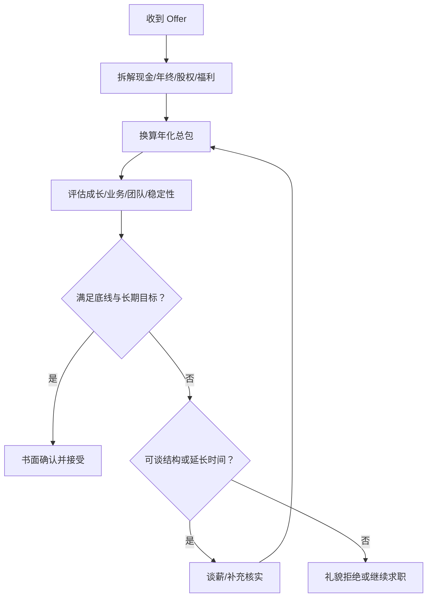

## 谈薪与 Offer 选择

面试通过只是第一步，真正影响你未来 1-3 年状态的是**Offer 怎么谈、怎么选**。总包拆解、谈薪的基本原则与话术、Offer 比较维度，以及接受/拒绝的礼貌做法。

信息截至 2026-08，薪酬结构各公司差异大且变化快，请以最新公开信息与 Offer 沟通为准。

## 总包拆解：先看懂 Offer 到底给多少

Offer 里的数字 ≠ 到手收入。总包一般由几部分组成：

| 组成部分 | 说明 | 注意点 |
| --- | --- | --- |
| 月薪（基本工资） | 按月发放的部分 | 问清「税前还是税后」、发几个月 |
| 年终奖 | 通常为 1-6 个月月薪，与绩效挂钩 | **写进 Offer 才算数**，口头承诺要落到书面 |
| 期权/股票 | 分年归属，一般 4 年分批解锁 | 问清归属节奏、行权价、回购机制，并自行判断公司估值风险 |
| 签字费/一次性奖金 | 入职一次性发放 | 问清发放条件与是否需要返还 |
| 福利 | 公积金比例、补充医疗、餐补、年假等 | 公积金比例差异可达数个百分点，折算下来也是实打实的钱 |

**换算成年化总包再比较**：月薪 × 月份数 + 年终 + 股权年化 + 福利折算。别只看月薪。月薪高几百但年终少几个月，总包可能反而低。

核心关系是：Offer 先拆结构再比较长期价值，谈判和决策都以书面条件、个人底线与备选方案为依据。

## 谈薪的基本原则与话术

### 原则

1.  **先让对方出价**：尽量让对方先报范围，你报价过高或过低都会压缩谈判空间
2.  **基于总包谈，不基于月薪**：「我期望总包在 XX 左右」比「我要月薪 XX」更专业、更灵活
3.  **拿数据说话**：同类岗位的公开薪资范围、你现有总包水平（可提供流水/Offer 佐证）是谈判依据
4.  **保留弹性**：给一个区间而不是一个死数，「总包在 XX 到 XX 之间，具体看结构」，留出谈空间，也避免因几百块谈崩
5.  **别为谈判而谈判**：如果对方给的价格已在你接受范围，果断接受比压价后失去机会更划算

### 常见话术示例

-   对方问期望薪资：「我了解同级别岗位的公开范围大概在 XX 到 XX，结合我的经历，期望总包在 XX 左右。」
-   对方压价：「这个数字和我预期的差距主要在年终结构上，能否在 XX 上调整？」
-   对方问现有薪资（部分公司/地区不允许强制询问，可礼貌回应）：「我可以提供现有总包的大致构成，更希望基于岗位价值来谈。」

## Offer 比较维度

拿到多个 Offer 时，别只比钱。建议按以下维度比较：

1.  **成长性**：岗位能接触的业务的广度与深度、团队是否愿意培养人、有没有成熟的方法论可学
2.  **业务**：业务处于什么阶段（从 0 到 1 / 快速扩张 / 成熟稳定）、是不是公司核心方向。核心业务的边缘岗位，可能不如边缘业务的核心岗位
3.  **团队**：直属上级的风格（是否愿意带人）、团队氛围、协作方式。面试就是最直接的观察窗口
4.  **地点与通勤**：通勤时间是被低估的成本，每天多 1 小时通勤，一年下来是 250+ 小时
5.  **稳定性**：公司/业务的稳定性（公开信息可查），期权在纸面与到手的差距
6.  **机会成本**：入职后至少一年内不太会再看机会，现在选什么 = 未来一年在什么环境成长

建议：列一个权重表打分，把收入和成长、环境分开看。**短期差价税后其实很小，环境与成长的差距很难用钱补**。

## 背调注意事项

谈薪与 Offer 确认阶段，往往伴随背景调查（部分公司、部分职级）：

-   **信息一致性**：工作经历、职位、时间与简历一致，别在时间线或职级上「微调」
-   **离职原因口径统一**：背调可能联系前同事，你的解释要与对外表述一致
-   **授权范围**：正规背调会先取得你的授权，对超出合理范围的信息索取可礼貌询问用途
-   **及时配合**：背调流程卡顿最常见的原因是候选人回复慢

## 接受/拒绝 Offer 的礼貌做法

### 接受

-   确认书面 Offer 内容（薪资结构、入职时间、试用期条款）后再回复
-   书面确认（邮件/系统）并问清入职流程、需要准备的资料

### 拒绝

-   **尽早告知**：拖到入职前一周才说不来，等于浪费对方一个 HC 周期，圈子很小
-   表达感谢 + 给出简单理由：「经过综合考虑，我选择了另一个更适合的方向，非常感谢贵司的认可与沟通。」
-   理由给「方向不合适」这类中性表述即可，不必详细解释，也别说谎
-   留好后路：与 HR、面试官保持体面，未来还有合作可能

### 如果还想等另一家

-   礼貌询问可否延长决策时间（一般可争取数天到一周），同时尽快推进另一家流程
-   如果拖不下去，权衡确定性的 A 与不确定的 B：**别为了不确定的 B 放弃确定的 A 且没有 Plan C**

## 相关阅读

-   [大厂面试流程全览](interview-process.md)：Offer 审批与发放环节
-   [校招面经](campus-interviews.md) / [社招面经](social-interviews.md)：不同阶段的 Offer 场景
-   [面试复盘方法论](review-methodology.md)：面试全过程的记录与改进
-   [产品经理黑话速查](../../intro/glossary.md)：「总包」「HC」「备胎池」等词义确认
