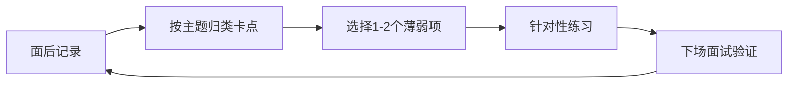

## 面试复盘方法论

面试是一次**免费的实测**：面试官用真实问题测试你的产品能力，还附赠追问与反馈。把反馈记下来、迭代自己，面试次数越多，你越强。这就是复盘的价值：**把面试当评测，像做产品一样迭代自己**。

## 为什么复盘

1.  **面试是最高质量的产品评测**：真实场景、真实追问、真实压力，比任何模拟都接近实战
2.  **不复盘 = 浪费**：同一类问题反复答不好，不是能力问题，是没把反馈变成改进
3.  **复盘能积累素材**：答得好的题、卡住的题，都沉淀成你自己的「题库」，下一场面试直接用
4.  **面试表现是方差很大的事**：状态、题目运气都在波动，不记录就无法区分「这次没发挥好」和「这块真的不会」

## 面经记录模板

面完**当天**（趁记忆新鲜）按模板记录，字段建议：

| 字段 | 内容 | 示例 |
| --- | --- | --- |
| 题目 | 原题（尽量还原原话） | 「讲一个你推动数据决策的经历」 |
| 我的回答 | 当场怎么答的（要点） | 讲了 XX 项目，先列结论再展开 |
| 追问 | 面试官追问了什么 | 「评测集只有 20 条会不会以偏概全？」 |
| 卡点 | 哪里卡壳/答得不好 | 追问第二层就没接住，开始绕 |
| 更好的答法 | 复盘后怎么答更好 | 用 STAR + 主动承认样本局限并给补救 |

记录要点：

-   **当天记**：隔一天细节就丢一半
-   **只记要点**：别写成逐字稿，记录是为了提炼，不是存档
-   **卡点是最有价值的字段**：「答不上来」暴露的是准备盲区，重点补

## 复盘频率与改进闭环

建议节奏：

1.  **每场面试后**：当天完成面经记录（30 分钟以内）
2.  **每周**：把本周所有记录的「卡点」汇总，按主题归类（概念不清/项目讲不清/表达冗长），**每周只重点改 1-2 个主题**
3.  **每轮求职季**：整理全部记录，形成自己的「薄弱项清单」，作为下一阶段准备清单

改进闭环（与做产品同构）：

核心关系是：复盘只为下一场验证服务，每次从记录中选择少量可执行改进项，形成个人题库的回归循环。

> 记录（评测）→ 归类（定位问题）→ 针对性练习（修复）→ 下场面试验证（回归）→ 再记录

**别用复盘逃避行动**。复盘的价值在下一场面试，不在笔记本身。改进项要落到具体动作（「下次先给结论再展开」「把 XX 项目的指标背熟」），而不是「我要更自信」这种不可执行的口号。

## 如何积累自己的「题库」

面试题其实高度重复，积累到一定量，新题大多是旧题的变体：

1.  **按题型建库**：概念题/产品设计题/案例题/行为面（题型框架见 [AI 产品经理面试指南](interview-guide.md)），每道题记录「我的答法 + 更好的答法」
2.  **项目库**：把自己的每个项目按「背景/角色/动作/结果/复盘」写成 3 分钟版本和 1 分钟版本，适配不同时长的提问
3.  **追问库**：每场面试的追问是别人帮你出的题，收集起来，下次主动预演
4.  **定期回归**：面试淡季每月翻一遍题库，旺季每场面试前过一遍自己的薄弱项

## 相关阅读

-   [AI 产品经理面试指南](interview-guide.md)：按题型准备的答题框架
-   [大厂面试流程全览](interview-process.md)：知道每轮考什么，复盘才能对症
-   [校招面经](campus-interviews.md) / [社招面经](social-interviews.md)：不同阶段的常见场景
-   [产品经理黑话速查](../../intro/glossary.md)：复盘时校准用词
-   [自学路线](../../intro/self-study-roadmap.md)：系统查漏补缺的路径
