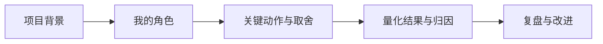

## 社招面经

社招与校招最大的不同：**看机会时机可以自己掌握，但每一段经历都会被深挖**。校招看潜力，社招看「你做过什么、做得怎么样、能不能复用到我们这里」。以下整理社招节奏、简历与讲项目的方法、背调与离职交接注意事项。

信息截至 2026-08，以最新公开信息为准。

## 社招节奏与看机会时机

### 什么时机看机会

-   传统旺季：3-4 月、9-10 月，岗位放出多、流程快
-   年底（11-12 月）：HC 收紧、流程慢，但竞争也小，适合定向投递
-   个人层面：项目上线后的空窗期、年终奖到手后（一般次年 3-4 月）是离职常见时间点

### 建议的节奏

1.  **先了解市场再投**：花 1-2 周刷招聘平台，了解当前岗位要求与公开薪资范围，给自己定位
2.  **定向准备**：社招岗位 JD 写得具体，按目标岗位准备比广撒网有效
3.  **同步进行不辞职**：多数人先在职面试、拿到 Offer 再提离职，避免空窗期谈判筹码变弱
4.  **控制面试密度**：在职面试精力有限，建议同时并行 3-5 家，既不拖太久也不至于面到麻木

## 简历与经历准备

社招简历的核心是**结果与增量**：

-   每段经历写「背景 → 我的动作 → 结果（量化）」，而不是职责流水账
-   与目标岗位强相关的经历放前面、写详细；弱相关的压缩
-   项目成果尽量量化（指标提升、成本下降、时间缩短）
-   **简历上的每一条都经得起追问**：面试官会沿着简历深挖，写上去的都要讲得出细节

## 面试中讲项目的方法

社招面试的主体是**讲项目**，通用结构：

**项目背景 → 我的角色 → 我的动作 → 结果 → 复盘**

核心关系是：社招讲项目要从背景和个人贡献出发，用取舍解释结果，再以复盘体现可迁移的判断力。

1.  **项目背景**：一句话讲清项目要解决什么问题、当时业务状态是什么
2.  **我的角色**：明确哪些是我负责的、哪些是协作的。面试官最反感把团队成果全揽到自己身上，也反感分不清自己的贡献
3.  **我的动作**：讲关键决策与取舍，「为什么这么做、为什么不做另一个方案」比动作本身更重要
4.  **结果**：量化结果 + 客观归因（哪些结果来自你的决策，哪些是外部因素）
5.  **复盘**：主动讲「如果重来，哪里会改」。这是与普通执行者拉开差距的关键

常见追问（提前准备）：项目最大困难是什么？数据从哪来？如果现在重做会有什么不同？你的方案和同事的差异在哪？

## 背调注意事项

社招 Offer 一般有背景调查环节（部分公司、部分职级）：

-   **信息一致**：背调按你提供的信息核实，工作经历、职位、时间要与简历和面试表述一致，别在时间线或职级上「微调」
-   **离职原因口径统一**：背调可能联系前同事，你对离职原因的解释要与对外表述一致
-   **授权与告知**：正规背调前会请你授权并告知范围；对超出合理范围的信息索取，可以礼貌询问用途
-   **配合度**：及时回复背调机构/HR 的确认。流程卡在背调最常见的原因是候选人迟迟不配合

## 离职交接注意事项

拿到新 Offer、确定离职后：

1.  **按公司流程提离职**：一般提前一个月（以合同与公司规定为准），用书面方式提出，留好记录
2.  **完整交接**：交接文档（项目、账号权限、进行中事项）做到「人走事不瘫」。行业圈子小，口碑是社招的隐形资产
3.  **维护关系**：和前领导、同事保持体面，背调与日后内推都靠他们
4.  **确认手续**：离职证明与社保/公积金转出时间，别影响新公司入职流程

## 相关阅读

-   [大厂面试流程全览](interview-process.md)：社招轮次与通过标准
-   [面试复盘方法论](review-methodology.md)：每场面试后的复盘方法
-   [AI 产品经理面试指南](interview-guide.md)：答题框架
-   [谈薪与 Offer 选择](offer-negotiation.md)：谈薪与 Offer 选择
-   [产品经理黑话速查](../../intro/glossary.md)：面试用词准确
