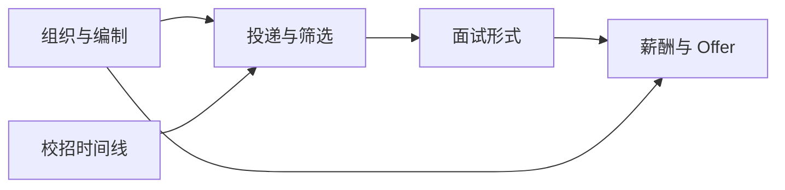
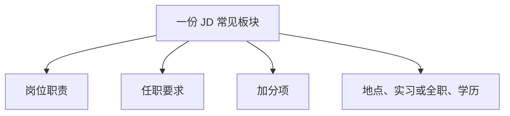
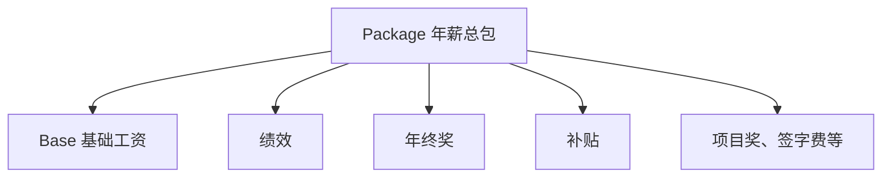

## 求职黑话合集

本页收 **校招、社招、实习**里 HR 通知、面经和谈薪时的高频黑话。产品协作用词见[产品经理黑话速查](../intro/glossary.md)；公司管理与职级见[高管岗位与公司管理黑话](positions/cxo-roles.md)；JD 正文里的能力词见该页的岗位 JD 节。

**黑话 ≠ 能力**。会说词要能追问口径：这个数字含不含绩效、HC 是新设还是补缺、下一轮是视频还是现场。

信息截至 2026-09。薪酬结构、社保个税和招聘流程因公司、城市和年份而异，以劳动合同、当地政策和招聘方书面说明为准。

???+ note "怎么查"
    先看「同词多义」，再按投递、面试、薪酬、组织四类定位。

    流程怎么走见[面试流程全览](interviews/interview-process.md)；数字怎么拆见[谈薪与 Offer 选择](interviews/offer-negotiation.md)。

核心关系是：编制和岗位决定你能投什么，面试形式决定你准备什么，Offer 数字要拆成 Base、绩效、补贴和总包再比较。

## 同词多义

同一缩写在不同句子里不是同一个意思。先看语境，再决定怎么答。

| 黑话 | 常见义项 |
| --- | --- |
| OT | Overtime，加班；Online Test，网申后的在线笔试 |
| BG | Business Group，事业群；应届语境里也指 Background，学历、院系、GPA 等学术背景 |
| CV | Curriculum Vitae，简历；CV 面指面试官围着简历经历追问的一轮 |
| Base / 贝斯 | 月薪里的基础工资；有的公司把绩效算进 Base，有的不算 |
| Offer | 录用意向；口头 Offer 和书面 Offer 效力不同 |
| 面 | 面试；也用来数轮次，如一面、二面、HR 面 |

## 投递与筛选

从填表到进入面试队列。渠道差异见[内推机制](referral.md)。

| 黑话 | 含义 |
| --- | --- |
| 网申 | 网上申请。在官网或招聘系统提交简历和附加题，是校招主通道 |
| OA | Online Application，网申；部分公司把在线测评也叫 OA |
| ATS | Applicant Tracking System，招聘方用来收简历、筛人和推流程的系统 |
| 海投 | 大批量投递。能练手，但匹配度低时简历关通过率也低 |
| 内推 / Referral | 内部员工转介。加快被看到的概率，不等于免筛或保过 |
| 简历关 | 人工或系统按匹配度筛简历。过了才进入笔试或面试 |
| 捞 | 从简历库、人才库或已读未面的池子里把人重新拉进流程 |
| 挂 | 该轮未通过。有时系统只显示「流程结束」，要自己判断 |
| 流程中 | 系统状态：已投、已读、测评中、面试中等，不等于有人在跟 |
| 已读不回 | 简历被打开后长期无下一步。继续投其他岗位，再礼貌跟进一次 |
| 人才库 / 备胎池 | 面试评价尚可但暂无 HC，先入库、有坑再捞。当额外机会，不当确定性 |
| freeze / 招聘冻结 | HC 暂停释放。已进行的流程可能变慢、取消或转入人才库 |
| 改期 | 协商更换面试时间。尽早说、给备选时段 |
| 已终止 | 流程结束。可能是未通过、HC 没了或候选人自己退出 |
| 宣讲会 / 双选会 | 校园招聘现场沟通与投递。补充渠道，不是唯一通道 |

## 岗位与材料

JD 是岗位说明书，简历是你的证据清单。拆一份真实 JD 的方法见[JD 拆解](jd-breakdowns/index.md)，经历怎么写成可追问证据见[简历与作品集](resume-portfolio.md)。

核心关系是：职责写「入职后做什么」，任职要求写「必须具备什么」，加分项写「有则更好」。投递前用自己的经历逐条对上，对不上的不要硬编。

| 黑话 | 含义 |
| --- | --- |
| JD | Job Description，职位描述。含职责、任职要求、加分项，以及地点和招聘类型 |
| 任职要求 | 应聘者需要具备的学历、技能、经历。写「熟悉 / 掌握 / 精通」时，面试会按最高口径追问 |
| 加分项 | 非硬性门槛。没有也可以投，有则在简历关和面试里更容易被记住 |
| 对口 | 专业、实习或项目与岗位职责重合。对口不是唯一标准，但能降低简历关成本 |
| CV | Curriculum Vitae。学术场景强调论文与科研；校招口语里 CV 就是简历，和 Resume 常混用 |
| Resume | 面向岗位裁剪的经历摘要。篇幅短、结果导向，社招更常用这个叫法 |
| CV 面 | 面试官主要按简历经历追问的一轮，也叫简历面。细节对不上会直接减分 |
| 作品集 | 可演示的项目、原型、数据分析或文章。产品岗不是设计师，但要能讲清你做了什么、结果是什么 |

## 面试形式

同一家公司也可能混用叫法。群面、无领导和 AC 的打法见[群面与无领导小组](interviews/group-interview.md)；单面题型见[AI 产品经理面试指南](interviews/interview-guide.md)。

| 黑话 | 含义 |
| --- | --- |
| VI | Video Interview，视频面试。一种是腾讯会议等实时视频；另一种是按题目录视频上传，英语看图说话常见，通常限时 |
| F2F | Face to Face，线下面试。也写成 F2F 面试、现场面 |
| 1on1 | One on One，一对一。一名候选人对应一名面试官 |
| 电话面 | 语音沟通，多用于初筛动机、经历和时间。短，但一样计入评价 |
| 业务面 / 专业面 | 直属上级或团队骨干面岗位基本功，通常是一面 |
| 交叉面 | 非直属团队的面试官来面，用来校验风格和评价是否一致 |
| HR 面 | 人事面动机、稳定性、期望薪资、离职原因和价值观。产品岗也常在这一轮谈薪 |
| 终面 / 老板面 | 部门负责人或更高一级。看潜力、业务判断和能不能扛事 |
| 压力面 | 追问快、语气硬、故意打断。考的是稳定输出，不是把面试官辩赢 |
| 加面 | 评价分歧或 HC 需再确认时多排一轮。当新信息，不默认是坏信号 |
| 一面 / 二面 / 三面 | 按轮次计数。轮次内容和顺序因公司而异，以通知为准 |
| AC | Assessment Center，评估中心。案例分析、小组讨论、角色扮演、个人面等组合，常见于线下面试，时长从一轮到一天不等 |
| GA | Group Assessment，群面。多人自我介绍、HR 提问或小组观点输出；和 AC、无领导常被混称，按当场规则应对 |
| 群面 | 多名候选人同场讨论或角色扮演。淘汰率通常高于单面 |
| 无领导小组 | 不指定主持人，小组自己组织讨论并给结论 |
| 笔试 | 书面或在线答题。产品岗常见行测、案例和产品设计主观题 |
| 机试 | 上机编程或系统操作。技术岗常见，部分产品岗没有 |
| 测评 | 认知、性格或职业倾向测试。一般不单独定专业分，极端不匹配可能直接淘汰 |
| OT | 看语境：HR 问「能接受 OT 吗」多指加班；网申后收到的 OT 多指 Online Test |
| OQ | Open Question，开放题。网申附加题里常见，如「为什么投这个岗位」 |
| BQ | Behavior Question，行为问题。面试里按经历追问，和 OQ 内容常重叠，场景不同 |
| STAR | Situation / Task / Action / Result。答 BQ 的骨架，结果要具体 |
| 自我介绍 | 开场一两分钟的经历摘要。对准岗位，不要背完整简历 |
| 反问环节 | 面试末尾你向面试官提问。问业务、团队和成功标准，把能查到的待遇问题留给 HR |

???+ tip "VI 的两种现场"
    实时视频面：网络、环境、摄像头先自检，按 1on1 准备。

    录制题：读完题再录，注意时限；英语看图描述按审题、结构、收尾三段走，不要卡在找「标准答案」。

## 薪酬与 Offer

谈薪先拆结构，再比较年化总包。比较维度和话术见[谈薪与 Offer 选择](interviews/offer-negotiation.md)。

核心关系是：口头说的月薪往往是几块拼出来的；比较 Offer 时把现金、年终、股权和福利折成年化，并问清哪些计入社保基数、哪些只计税。

| 黑话 | 含义 |
| --- | --- |
| K | 千元。月薪 25K 通常指税前 25000 元，先问清税前还是税后 |
| 月薪 | 按月发的现金。要问发几个月：12 薪、13 薪还是 16 薪 |
| Base / 贝斯 | 基础工资。谈薪时必须问：我的 Base 包不包含绩效 |
| 绩效 | 按考核结果浮动的部分。可能按月、按季或按年发，也可能打折或不发 |
| 补贴 | 交通、餐补、通讯等。常见口径是不进社保基数，但计入当月应税所得 |
| Package / 总包 | 年薪总收入口径：基础工资、绩效、年终奖、补贴、项目奖和其他现金激励。股权是否计入总包，各家说法不同，要单独问 |
| 13 薪 / 16 薪 | 年固定发薪月数。13 薪常在年底多发一个月 Base；16 薪等要问清多出来的部分是固定还是绩效 |
| 年终奖 | 通常按月薪倍数发，常与绩效挂钩。写进 Offer 才稳定，口头承诺要落到书面 |
| 项目奖 | 跟项目或业务结果走的额外奖金。别默认每年都有 |
| 签字费 | Sign-on bonus，入职一次性奖金。问发放时间和是否离职返还 |
| 白菜 | 该职级最常见、也往往最低一档的 Offer，俗称白菜价 |
| SP | Special Offer，给评价更好的候选人，现金或签字费高于白菜 |
| SSP | Super Special Offer，高于 SP。口头口径里 SSP > SP > 白菜，档差月薪两到五千常见，签字费也可能拉开 |
| Argue / A 一把 | 拿到 Offer 后与 HR 谈薪，常用另一份 Offer 做参照，争取上调档位或结构 |
| 口头 Offer | 电话或聊天里的意向。无书面结构、无审批完成，继续推进其他流程 |
| 书面 Offer | 邮件或系统发出的录用条件。以书面条款为准 |
| 意向书 | 部分校招先发意向、再补正式 Offer 或三方。问清和正式录用的差别 |
| 三方协议 | 学校、学生、用人单位的就业协议。应届主路径之一，违约条款要自己看 |
| 毁约金 | 三方或 Offer 里约定的违约金额。接受前读条款，不要只听口述 |
| 期权 / RSU | 股权激励。问归属期、行权价或授予口径、离职回购。纸面价值和到手差得远 |
| 背调 | Background check。核经历、职位和时间。授权范围以外的索取可以问用途 |
| 税前 / 税后 | 谈薪默认税前。税后到手还要减社保、公积金和个人所得税 |
| 五险一金 | 养老、医疗、失业、工伤、生育保险和住房公积金。缴纳基数与比例影响到手和保障 |
| 公积金比例 | 个人与单位缴存比例。同样月薪，比例不同，现金和住房账户差一截 |

???+ example "月薪 25K 的一种拆法"
    20K 基础工资 + 1K 交通补贴 + 1K 餐补 + 3K 绩效，口头仍可能说成月薪 25K。

    这时 Base 通常指 20K，不含补贴和绩效。

    谈薪时向 HR 确认：Base 包不包含绩效；总包含哪些项、年终按几薪、绩效按什么规则发。

    多数口头口径：五险一金按 Base 缴，补贴不算社保基数；个税按当月应税所得缴，补贴一般要计税。

    以劳动合同和当地社保、个税政策为准，不要用面经里的拆法代替书面条款。

???+ warning "Argue 之前先有书面数字"
    用另一份 Offer 去谈，先确保那份数字真实、结构清楚。

    档位（白菜 / SP / SSP）是内部口语，Offer 上未必打印这三个字；要的是 Base、月数、年终、签字费和总包的书面构成。

## 组织、编制与角色

问清你进的是哪条业务线、HC 从哪来，比只记住公司名更有用。大厂事业群观察见[常见大厂与架构](companies/index.md)。

| 黑话 | 含义 |
| --- | --- |
| HC | Headcount，编制。没有 HC 就发不出 Offer；「锁 HC / 扩 HC」决定坑还在不在 |
| 坑 / 坑位 | 一个可招人的编制或岗位名额。面试通过但没坑，常进人才库 |
| BG | Business Group，事业群。如历史上腾讯、字节的多事业群架构；应届口语里也指学术 Background |
| BU | Business Unit，挂在 BG 下的业务线或产品线。同职位在不同 BU，工作内容可能差一截 |
| HR | Human Resources，人事。招聘、薪酬、劳动关系等 |
| HRBP | HR Business Partner，对口某条业务的 HR。发 Offer 前通常要过用人经理和 HRBP |
| Recruiter | 招聘专员或招聘 HR，负责寻源、约面和推流程，不一定是 HRBP |
| 用人经理 / Hiring Manager | 业务侧负责人，通常是未来上级或上级的上级，对是否录用和档位有决定权 |
| 编制 / 正式 | 与公司直接签劳动合同的常规雇佣。先问清楚是正式、实习还是外包 |
| 外包 / 派遣 | 与第三方签合同、在甲方现场工作。工牌和办公地点像内部，合同主体不同 |
| 校招生 | 应届招聘通道录用的人。培养节奏和考核常与社招不同 |
| 管培生 | 管理培训生。轮岗后定岗，看综合潜力 |
| 培训生 | 部分公司的校招项目名，如专项培训生。以 JD 为准，不要用另一家的项目去套 |

## 校招时间线口语

完整节奏见[校招面经](interviews/campus-interviews.md)。

| 黑话 | 含义 |
| --- | --- |
| 提前批 | 官方秋招前的批次，常走内推或提前网申。额少、结束早 |
| 秋招 | 校招主战场，岗位量最大 |
| 春招 | 次年补录为主，承接毁约、追加 HC 和秋招未完成的需求 |
| 暑期实习 | 暑期集中实习，转正是重要上岸路径 |
| 日常实习 | 全年滚动、周期更灵活的实习 |
| 转正 | 实习后转为校招 Offer。答辩看结果和融入，不通过就回到秋招 |
| Return Offer | 实习结束时给的回聘或转正 Offer |
| 补录 / 捡漏 | 主批次之后的零星名额。随机性大，不当唯一计划 |
| 开奖 | 某天集中发 Offer 或更新状态的口语 |

## 状态与圈内口语

这些词出现在面经、群聊和同学对话里，不是 HR 的正式状态机。

| 黑话 | 含义 |
| --- | --- |
| 保底 Offer | 先拿到的、用来托底的 Offer。有更匹配的选择再比较，接受前仍要读条款 |
| 梦中情司 | 最想去的公司。别为不确定的梦中情司放弃已书面确认、且没有备选的 Offer |
| 海王 | 同时推进很多流程。进度管理有用，约面失约会反噬 |
| 锁 Offer | 口头或书面让你尽快接受、不要再面。以书面为准，并评估决策期限是否合理 |
| 鸽了 / 放鸽子 | 约定后爽约。候选人与招聘方都可能发生；改期要早说 |
| 卡 HC | 人过了、编制没批下来。继续其他流程，同时问预计时间 |
| 等通知 | 没有下一步信息。可以跟进一次，然后把注意力放回别的投递 |
| 面经 | 面试经验记录。用来还原题型和流程，不是标准答案 |
| 面评 | 面试官写的评价。候选人通常看不到原文 |

## 收到通知时先问清的五件事

HR 消息短、缩写多。回消息前把这五件事问清楚，少一轮来回。

1.  **下一轮是什么形式**：VI、F2F、1on1、群面还是测评；OT 是加班还是笔试
2.  **面试官角色**：业务、交叉、HR 还是负责人，决定你准备题型
3.  **岗位落在哪条线**：BG / BU / 团队，同名岗位内容可能不同
4.  **数字口径**：月薪是否含绩效和补贴；总包含哪些项；五险一金按什么基数
5.  **结果是什么状态**：通过、加面、进人才库，还是书面 Offer

## 相关阅读

-   [面试流程全览](interviews/interview-process.md)：从投递到 Offer 的轮次
-   [群面与无领导小组](interviews/group-interview.md)：GA、AC 与无领导怎么打
-   [谈薪与 Offer 选择](interviews/offer-negotiation.md)：总包拆解与谈判
-   [校招面经](interviews/campus-interviews.md)：时间线、转正与备胎池
-   [内推机制](referral.md)：Referral 能做什么、不能做什么
-   [简历与作品集](resume-portfolio.md)：CV 面之前先把经历写成证据
-   [JD 拆解](jd-breakdowns/index.md)：把一份真实 JD 翻译成工作内容
-   [产品经理黑话速查](../intro/glossary.md)：入职后开会还要用的词
-   [高管岗位与公司管理黑话](positions/cxo-roles.md)：职级、HC、PIP 与汇报链

> **来源说明**：综合校招社招口语、公开面经与本站求职栏目既有口径整理；口误谐音（如贝斯、A 一把）按通行写法校正。档位名称、薪资结构和审批流程因公司而异，不指向某一份 Offer。信息截至 2026-09，以最新公开信息与书面合同为准。
