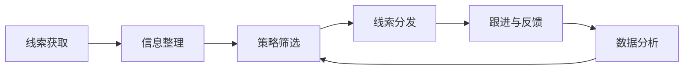

## 「实习」百度｜策略产品实习生

这是一份策略产品方向的实习生 JD，核心工作围绕线索获取至分发的策略流程、内容策略和教育 AI 场景展开。岗位同时要求参与大模型应用、模型准召优化、数据分析、文档撰写和跨团队推进。

本文先保留用户提供的岗位原文，再把职责翻译成可理解的工作任务、能力证据和面试准备问题。招聘链接、职位 ID、工作城市、团队名称和具体业务线未在材料中提供，以下内容不对这些信息作推断。

!!! info "素材说明"
    本文根据用户提供的岗位职责与任职资格整理。

    用户未提供招聘链接、职位 ID、城市、发布日期、薪酬或原始页面截图；这些信息不在正文中补写。

    “线索”具体指什么对象、由哪些渠道获取、分发给谁，以及模型准召的业务口径，需要向招聘方进一步确认。

## 原始 JD

以下内容按用户提供的文字整理，不补充未出现的岗位信息。

### 工作职责

- 核心参与线索相关策略产品设计项目，协助产品经理优化线索获取至分发全流程逻辑，输出策略优化方案
- 与研发团队紧密合作，应用行业前沿大模型满足业务需求，优化模型准召效果，提供数据支撑协助
- 撰写相关文档，包括需求文档、调研报告等，确保策略落地的规范性和可执行性
- 配合跨部门（策略、研发、运营）沟通，推动策略的落地、测试及迭代，跟踪产品落地效果并及时反馈
- 辅助完成内容策略相关的其他日常工作，包括行业竞品策略调研、用户需求分析等

### 任职资格

- 本科及以上学历，在校生（大三、研一／研二优先），了解教育 AI 应用场景，有行业大模型应用经验优先
- 具备清晰的产品逻辑思维和问题分析能力，能快速理解业务需求，擅长拆解复杂问题，提出可行的产品思路
- 具备基础的数据敏感度，有较强的数据分析能力（会使用 SQL 者加分），能通过数据发现问题、验证模型效果
- 具备良好的沟通协调能力和执行力，能高效完成分配的任务，有团队协作意识
- 对内容策略、线索策略有一定了解，愿意深入学习策略产品逻辑，有较强的学习和探索能力
- 能独立完成文档撰写和数据整理工作，有策略产品相关实习经验者优先

## JD 明确写了什么

| 维度 | JD 明确信息 | 可以确认的信号 |
| --- | --- | --- |
| 招聘类型 | 在校生，大三、研一／研二优先 | 这是面向在校生的实习岗位，标签为「实习」 |
| 岗位方向 | 线索策略、内容策略、策略产品 | 工作重点在业务策略和产品逻辑，不是单纯页面功能设计 |
| 业务流程 | 线索获取至分发全流程 | 需要理解线索在不同环节的流转、筛选和分配逻辑 |
| AI 工作 | 应用行业前沿大模型，优化模型准召效果 | 需要参与模型应用效果分析，但 JD 未说明具体模型、任务和评估口径 |
| 数据工作 | 通过数据发现问题、验证模型效果，完成数据整理 | 数据分析是日常工作的一部分，SQL 属于加分项 |
| 协作对象 | 策略、研发、运营团队 | 需要参与策略落地、测试、迭代和效果反馈 |
| 文档交付 | 需求文档、调研报告、策略优化方案 | 需要把分析结论转成可执行、可交接的文档 |
| 场景偏好 | 教育 AI 应用场景 | 候选人需要理解教育场景，但 JD 没有进一步说明具体产品或用户 |

岗位名称中的“百度”来自用户提供的岗位标题。招聘主体、具体业务部门和汇报关系仍应以招聘页面与面试沟通为准。

## 先下判断：它是什么岗位

这份 JD 更接近**业务策略与 AI 应用结合的产品实习岗位**。工作对象不是一个已经明确的单一页面功能，而是围绕线索流程和内容策略，参与规则、模型、数据与协作流程的优化。

岗位可以拆成四类责任：

1. **理解流程**：梳理线索从获取到分发的各个环节，找出策略问题和优化机会。
2. **设计策略**：协助产品经理输出策略优化方案，把业务需求转成流程、规则或模型应用方案。
3. **验证效果**：通过数据分析和模型效果验证，判断策略是否改善了目标结果。
4. **推动落地**：与策略、研发和运营团队协作，完成测试、迭代和效果反馈。

其中“优化模型准召效果”是岗位区别于普通策略产品实习的信号。候选人不一定负责训练模型，但需要理解模型在业务流程中的输入、输出、误差和验证方式，并能与研发讨论优化方向。

## 把职责翻译成日常工作

### 1. 梳理线索获取至分发流程

JD 没有说明“线索”的具体定义，因此不能直接推断它是用户线索、销售线索、内容线索还是其他业务对象。可以确认的是，实习生需要协助产品经理研究一条从获取到分发的完整流程：

实际工作可能包括：

- 记录线索进入的来源、时间、字段和上下文
- 梳理线索筛选、排序、打标和分发的现有规则
- 识别重复、遗漏、误判、分发不均或反馈不完整等问题
- 对比优化前后的流程差异，整理策略方案和待验证假设
- 与产品经理确认策略目标、边界条件、优先级和上线范围

上图展示的是需要核验的流程骨架，不代表 JD 已经确认了所有环节。面试时应重点询问线索对象、分发去向、现有系统和主要痛点。

### 2. 参与策略方案设计

“输出策略优化方案”不只是提出一个想法，还需要说明问题、依据、方案和验证方法。一份可执行的策略方案至少应包含：

- **问题定义**：当前流程在哪个环节出现什么问题，影响了谁
- **现状基线**：现有规则、模型或人工流程的表现如何
- **目标指标**：希望改善什么结果，目标如何计算
- **方案内容**：调整哪些规则、字段、模型调用或人工操作
- **适用范围**：哪些线索进入新策略，哪些情况需要保留旧流程
- **风险与兜底**：误判、漏判、重复分发或模型不可用时如何处理
- **验证计划**：如何通过离线数据、灰度测试或人工抽检验证效果

实习生通常会在产品经理指导下完成资料整理、问题拆解、方案撰写和数据验证。具体决策权限需要根据团队分工确认，不能仅凭 JD 推断实习生独立负责完整策略。

### 3. 应用大模型并分析准召效果

JD 写的是“应用行业前沿大模型满足业务需求，优化模型准召效果”。这里至少包含三层工作：

1. **明确任务**：判断模型用于分类、抽取、匹配、排序、打标、内容理解还是其他任务。
2. **定义效果**：明确什么算召回、什么算准确，以及不同错误对业务的影响。
3. **比较方案**：通过样本、指标和 Badcase 比较 Prompt、模型、规则或流程调整的效果。

“准召”通常需要同时关注精确性和覆盖范围，但具体口径必须以团队定义为准。可以使用下面的分析框架与研发对齐：

| 分析问题 | 需要确认的内容 |
| --- | --- |
| 模型输入 | 线索包含哪些文本、结构化字段或上下文 |
| 模型输出 | 标签、分类、排序、匹配结果还是分发建议 |
| 正确标准 | 由人工标注、业务结果、规则还是用户反馈判断 |
| 错误类型 | 误召、漏召、分类错误、信息抽取错误或格式错误 |
| 验证数据 | 离线样本、历史数据、人工抽检还是线上实验 |
| 业务影响 | 错误对分发效率、用户体验、运营成本或线索价值的影响 |
| 约束条件 | 延迟、调用成本、隐私、稳定性和人工复核要求 |

候选人不需要把自己包装成算法工程师，但需要能把“模型效果不好”继续拆成数据问题、任务定义问题、模型问题、Prompt 问题、规则问题或流程问题。

### 4. 文档与策略落地

JD 明确要求撰写需求文档、调研报告和策略优化方案。不同文档承担的任务不同：

| 文档 | 主要回答的问题 | 交付时需要避免的问题 |
| --- | --- | --- |
| 需求文档 | 做什么、为谁做、流程怎样变化、如何验收 | 只写功能描述，不写边界、异常和验收标准 |
| 调研报告 | 现状是什么、用户或行业有什么问题、证据是什么 | 只罗列资料，不形成判断和建议 |
| 策略优化方案 | 为什么调整、调整什么、预期改善什么、如何验证 | 只提出规则，不说明数据依据和失败兜底 |

策略文档要让产品、研发和运营对同一套逻辑形成一致理解。涉及模型的方案还应记录样本范围、模型或 Prompt 版本、评测口径和典型 Badcase，方便后续复盘。

### 5. 跨部门沟通与迭代

岗位需要配合策略、研发和运营团队推动落地、测试及迭代。三个协作对象关注点不同：

- **策略团队**：业务目标、规则逻辑、线索定义和策略边界
- **研发团队**：数据字段、接口、系统流程、模型调用、日志和发布限制
- **运营团队**：实际使用流程、线索质量、人工反馈和异常案例

实习生可以通过会议纪要、问题清单、验收记录和效果跟踪表减少信息损耗。一次方案落地后，还需要继续记录线上反馈，确认问题来自策略逻辑、数据质量、模型效果、系统实现还是使用流程。

## 产品问题一：如何拆解线索策略

### 先确认线索是什么

“线索”是本文最大的未定义对象。投递或面试时需要先确认：

1. 线索来自用户提交、内容触达、销售渠道、搜索行为还是其他来源？
2. 线索的基本单位是什么，是个人、企业、内容、需求还是事件？
3. 获取阶段需要解决数量、质量、去重、合规还是时效问题？
4. 分发对象是销售、运营、教育服务人员、系统流程还是其他团队？
5. 分发后是否存在跟进、转化、关闭和回流机制？

没有这些信息，就不能判断岗位最重要的指标，也不能直接把“线索策略”解释成某一种固定业务。

### 策略产品的分析维度

| 维度 | 需要回答的问题 | 可能的验证方式 |
| --- | --- | --- |
| 线索质量 | 什么样的线索对业务更有价值 | 人工标注、历史转化或业务规则 |
| 获取效率 | 不同来源带来的线索数量和质量如何 | 渠道拆分、漏斗分析 |
| 分发匹配 | 线索是否被分给合适的对象 | 匹配结果抽检、处理时长、后续反馈 |
| 处理时效 | 从获取到分发是否存在延迟 | 时间戳分析、节点耗时统计 |
| 重复与遗漏 | 是否重复触达或遗漏有效线索 | 去重规则、人工复核、回流数据 |
| 策略稳定性 | 规则或模型在不同样本上的效果是否一致 | 分层评测、线上监控、Badcase 分析 |

具体指标需要结合业务确认。JD 只明确要求通过数据发现问题、验证模型效果，没有给出目标数值或固定指标。

## 产品问题二：如何评估模型准召

### 不把单一指标当成全部效果

模型用于线索策略时，准确率和召回率的取舍取决于业务错误成本：

- 如果漏掉有效线索的损失更高，可能需要优先保证覆盖范围，再通过人工复核降低误召影响。
- 如果误分发会带来较高运营成本或用户打扰，可能需要提高准确性，并为不确定样本设置人工处理路径。
- 如果线索数量大、人工处理能力有限，还需要同时考虑处理时延和单位成本。

这些是评估时的通用问题，不代表该岗位已经采用某种指标权重。候选人应先询问业务目标，再选择指标。

### 用 Badcase 推动优化

一个可执行的模型优化闭环可以按以下步骤展开：

1. 固定样本、模型版本、Prompt、规则和上下文，保证问题可以复现。
2. 对错误样本分类，区分数据缺失、任务定义不清、模型判断错误、格式错误和流程误导。
3. 判断错误更影响准确性还是召回覆盖，并评估业务后果。
4. 选择补充数据、修改 Prompt、调整规则、改模型、增加人工确认或改变分发流程。
5. 在独立样本上回归，确认目标指标改善且没有引入明显副作用。
6. 上线后持续抽检，关注不同来源、用户群和时间段的效果差异。

这套流程也能作为面试中回答“如何优化模型效果”的骨架。重点是说明如何定位问题和验证方案，而不是只说“换一个更强的模型”。

## 产品问题三：教育 AI 场景需要补充什么

任职资格要求候选人了解教育 AI 应用场景，但没有指定具体产品。教育场景通常需要额外确认用户角色和风险边界：

- 使用者是学生、家长、教师、教务人员还是教育机构员工？
- 线索对应的是咨询、课程需求、服务申请、内容兴趣还是其他对象？
- 模型输出是否会影响推荐、分发、跟进优先级或用户沟通？
- 是否需要人工审核，未成年人数据和敏感信息如何处理？
- 如何区分模型效果问题与教育业务规则问题？

候选人可以准备一个熟悉的教育 AI 场景，但不要把个人猜测写成百度该岗位的确定业务。更稳妥的回答方式是先说明假设，再列出需要向团队确认的业务事实。

## 能力匹配：实习生需要证明什么

### 产品逻辑与问题拆解

对应 JD 中的产品逻辑思维和问题分析能力，可以准备一段完整案例，说明：

- 原始问题是什么，涉及哪些用户或业务角色
- 如何把复杂流程拆成几个可验证的环节
- 如何区分现象、原因和待验证假设
- 方案为什么优先解决某个问题，哪些内容暂不处理
- 如何定义上线前后的验收标准

### 数据分析与 SQL

JD 没有要求必须会 SQL，但明确强调数据敏感度、数据分析、数据整理和模型效果验证。准备时可以覆盖：

- 使用 SQL 或表格完成筛选、去重、分组、聚合和异常检查
- 根据时间、渠道、用户类型或策略版本进行分层比较
- 计算并解释准确率、召回率、通过率、转化率或处理时延等指标
- 从数据异常追查到样本和业务流程，而不是停留在图表描述
- 记录口径、过滤条件、样本范围和计算时间，保证分析可复现

不会 SQL 不等于无法匹配岗位，但需要用可复现的数据整理或分析作品证明基础能力。

### AI 应用理解

候选人可以准备一个真实做过的 AI 应用案例，重点说明：

- 业务任务是什么，为什么使用大模型
- 输入、输出和人工审核节点分别是什么
- 如何构造测试样本和判断结果是否正确
- 遇到哪些误召、漏召或其他 Badcase
- 如何在效果、延迟、成本和稳定性之间取舍

“使用过某个模型”本身不是充分证据。更有价值的是能够展示任务定义、评测数据、错误分析和迭代记录。

### 文档与协作

可以准备需求文档、调研报告、竞品分析或数据分析报告作为作品材料，并明确标注：

- 本人独立完成和协作完成的部分
- 文档服务的读者和决策场景
- 如何从资料和数据形成结论
- 方案如何被研发或运营理解、测试和执行
- 结果如何反馈到下一轮迭代

## 面试准备：把 JD 转成练习题

| 练习题 | 回答应覆盖的内容 |
| --- | --- |
| 如何优化线索从获取到分发的流程 | 线索定义、流程节点、现状问题、策略方案、指标和异常兜底 |
| 如何评估一个模型的准召效果 | 任务定义、标注标准、准确率与召回率、分层评估、Badcase 和业务成本 |
| 如果模型效果不好，你会怎么定位 | 数据、Prompt、模型、规则、上下文、系统流程和人工审核逐层排查 |
| 如何做一次教育 AI 场景调研 | 用户角色、任务流程、痛点证据、风险边界、竞品和可验证假设 |
| 需求文档和调研报告有什么区别 | 文档目标、读者、内容结构、证据要求和后续动作 |
| 如何与研发、运营推进一个策略上线 | 对齐目标、确认数据和接口、制定验收、测试反馈、上线监控和迭代 |
| SQL 能帮助策略产品解决什么问题 | 样本筛选、漏斗分析、分层对比、异常发现、效果验证和数据复现 |
| 你做过什么 AI 应用 | 用户问题、模型任务、输入输出、评测方法、Badcase、迭代结果和本人职责 |

## 投递前必须确认的内容

这份 JD 能确认岗位方向，但以下内容仍需要在招聘沟通中核实：

1. **业务对象**：线索具体指什么，获取和分发分别对应哪些业务环节？
2. **产品归属**：岗位所在的产品线、团队和汇报对象是谁？
3. **用户角色**：教育 AI 场景服务学生、家长、教师、机构还是内部团队？
4. **模型任务**：大模型承担分类、抽取、匹配、排序、生成还是其他任务？
5. **准召口径**：准确率、召回率、人工标注和业务结果如何定义？
6. **数据权限**：实习生可以访问哪些数据，数据如何脱敏和审批？
7. **工作比例**：策略分析、文档撰写、数据处理、模型评测和会议协作分别占多少时间？
8. **技术协作**：研发是否提供统一模型服务、评测工具和数据查询环境？
9. **实习安排**：实习周期、每周出勤、工作地点和转正机会如何？
10. **考核方式**：更看重策略方案质量、模型指标、上线效果、交付效率还是其他结果？

## 适合什么样的候选人

这份实习岗位更适合以下候选人：

- 对教育 AI、内容策略或线索策略有真实兴趣，愿意先理解业务再设计方案
- 能把复杂流程拆成问题、假设、数据和验证步骤
- 有基础的数据分析能力，能够独立完成数据整理，掌握 SQL 会更有优势
- 体验过大模型应用，能够描述任务定义、效果评估和典型错误
- 能独立完成需求文档、调研报告和策略分析材料
- 具备跨团队沟通和执行意识，能跟进测试、反馈和迭代

如果候选人只会罗列模型名称或竞品功能，却无法说明线索流程、策略逻辑、数据证据和落地协作，匹配度可能不足。相反，项目规模不大也可以，只要能清楚讲出问题、方法、结果和本人贡献。

## 结论

这份 JD 的核心是参与线索策略和内容策略产品的实际优化，把业务流程、模型应用、数据分析和团队协作连接起来。岗位判断可以收束为四句话：

1. **岗位类型**：百度的策略产品实习岗位。
2. **工作对象**：线索获取至分发流程，以及相关内容策略和教育 AI 场景。
3. **能力重点**：产品逻辑、问题拆解、数据分析、模型准召理解、文档和协作落地。
4. **信息边界**：具体线索定义、业务线、城市、指标和模型方案未在材料中给出，必须向招聘方核验。

## 相关阅读

-   [产品经理岗位类别](../product-manager-types/index.md)：按技术对象、服务对象和结果责任理解产品经理方向
-   [AI 产品经理](../positions/ai-pm.md)：AI 产品经理的职责结构与面试前核验清单
-   [评估与评测](../../ai/evaluation.md)：评测集、线上指标、人工评测和 Badcase 闭环
-   [数据分析入门](../../pm/data-analysis.md)：从指标、样本到结论的数据分析基础
-   [简历与作品集](../resume-portfolio.md)：把 JD 要求转成项目结果和可追问证据

## 来源说明

-   岗位名称与 JD 原文：用户提供的「百度策略产品实习生」岗位职责与任职资格。
-   用户未提供招聘链接、职位 ID、城市、发布日期、薪酬或原始页面截图；上述信息未作补写。
-   本文中的流程、指标、面试问题和能力分析属于基于 JD 的站内解读，不代表百度对岗位的额外承诺；具体内容以最新招聘页面和招聘沟通为准。
