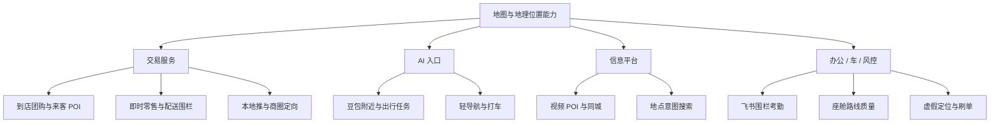

## 「校招」字节跳动｜产品经理 - 业务中台

这是一份 2027 届校园招聘的正式产品经理岗位，方向是业务中台。JD 的工作对象是地图数据及相关应用能力、跨产品业务场景、策略方案和流程机制；日常工作覆盖需求分析、数据分析、项目推进与业务反馈闭环。

本文先固定用户提供的岗位原文，再把职责翻译成日常工作、能力证据和面试准备问题。公开报道只用于对照「地图数据可能服务哪些字节产品」，不把外部信息写成该岗位已确认的职责。

!!! info "素材说明"
    本文根据用户提供的岗位描述与任职资格整理。

    原始材料包含北京、上海、深圳三个工作城市、正式、产品 - 产品经理、2027 届校园招聘和职位 ID A250886A。

    团队介绍写有「字节跳动系产品相关应用场景」，因此按字节跳动命名。

    具体招聘主体和团队归属以招聘页面为准。

    公开业务背景读取于 2026-09-06，用于对照地图数据的可能应用场景。

    JD 未出现的招聘主体、薪酬、小组名称和首个项目，正文不补写。

## 岗位信息

| 项目 | 原文信息 |
| --- | --- |
| 岗位名称 | 产品经理 - 业务中台 |
| 招聘类型 | 2027 届校园招聘 |
| 职位类型 | 正式；产品 - 产品经理 |
| 工作城市 | 北京、上海、深圳 |
| 职位 ID | A250886A |
| 团队方向 | 跨产品业务方向、中台能力与技术解决方案 |

## 原始 JD

以下内容按用户提供的岗位文字整理，不补充未出现的招聘信息。

### 职位描述

团队负责公司多个跨产品业务方向，提供可复用的平台能力及技术解决方案。我们为公司多业务提供如地理位置、行业数据等多类型的中台能力与技术解决方案，积极利用 AI 等技术做中台能力提效与升级。

加入我们，你将有机会从中台的多视角参与业务建设，感受不同类型／阶段的业务特点；通过用户场景的开发与架构工作，学习和解决极富挑战的技术问题；你也可以从数据出发，积极利用策略和模型，为业务提供有价值的助力。

1. 负责协助产品经理支持地图数据及相关应用能力的建设，包括需求分析、策略方案产出、数据分析、项目进度管理等；
2. 负责协助产品经理梳理字节跳动系产品相关应用场景，以体验、收益为驱动，参与制定解决方案，推动业务需求高效落地；
3. 负责处理业务方反馈的各项问题，梳理当前流程及机制中的问题并及时跟进。

### 职位要求

1. 2027 届获得本科及以上学历，计算机、通信和地理信息系统等相关专业优先；
2. 具备优秀的自主学习和数据分析能力，有判断力，对数据敏感，逻辑性强，善于发现问题；沟通协作能力强，工作耐心细致，有高度的责任心；
3. 有测绘、数理、AI 相关教育或实习背景者优先。

## JD 明确写了什么

| 维度 | JD 明确信息 | 可以确认的信号 |
| --- | --- | --- |
| 招聘类型 | 2027 届校园招聘；正式 | 校招正式岗位 |
| 产品对象 | 地图数据及相关应用能力 | 需要理解数据能力如何被业务产品使用 |
| 平台方向 | 地理位置、行业数据等可复用的中台能力 | 工作面向多业务复用，不锁单一终端产品 |
| 方案工作 | 需求分析、策略方案、数据分析和解决方案制定 | 把业务问题转成策略、数据和产品方案 |
| 场景范围 | 字节跳动系产品相关应用场景 | 需要梳理不同产品或业务阶段的使用场景 |
| 推进工作 | 项目进度管理、需求落地、跟进 | 参与从方案到落地的项目过程 |
| 反馈闭环 | 处理业务方反馈，梳理流程和机制问题 | 把零散问题归纳为可改进的流程或机制 |
| 技术交叉 | AI、策略和模型用于中台能力提效与升级 | 需要理解 AI 应用；JD 未要求承担模型训练 |
| 专业偏好 | 计算机、通信、地理信息系统优先；测绘、数理、AI 背景加分 | 空间数据和分析能力是偏好，不是唯一背景 |

## 先下判断：它是什么岗位

这份 JD 更接近**跨业务中台与数据策略结合的产品经理校招岗位**。工作对象是可被多个业务使用的地图与地理位置能力，方法是策略、模型和数据分析，结果看体验和收益。

岗位的核心责任可以概括为四点：

1. **建设中台能力**：参与地图数据及相关应用能力建设，关注能力如何被不同业务复用。
2. **理解业务场景**：梳理字节跳动系产品的应用场景，识别体验和收益目标。
3. **设计并验证方案**：结合需求、策略、数据和模型参与解决方案制定，通过数据发现问题、验证效果。
4. **推动问题闭环**：跟进业务反馈、项目进度和流程机制问题，推动需求落地和后续改进。

协助产品经理，说明校招生会在更成熟的产品经理指导下参与工作。JD 没有承诺独立负责完整产品线。面试时应确认授权范围、首个项目和交付物。

组织与产品线对照见[字节跳动：AI 产品组织与架构观察](../companies/bytedance.md)。同领域但面向 C 端导航体验的岗位，见[「校招」腾讯｜地图 AI 产品经理培训生](tencent-map-ai-pm-trainee.md)。

## 公开背景：字节的地图能力落在哪

JD 只写了地图数据、地理位置和字节跳动系产品，没有点名具体 App。公开信息可以把场景补具体，方便面试讨论。这些材料不等于本岗位已确认是地理位置中台，也不等于校招生会负责下列任一产品。

字节没有独立的 C 端地图 App。地图相关能力主要落在中台的地理位置服务，以及各业务产品里的 POI、同城、到店和轻导航。

公开可核对的事实如下。

-   **中台方向**：2026 年报道称，技术中台垂直功能组「地理位置中台」面向豆包、抖音、生活服务建设地理位置能力，给 AI Agent 提供现实世界感知（[泰伯网](https://www.taibo.cn/p/99517)、[钛媒体](https://www.tmtpost.com/8056535.html)）。更早的公开招聘把职责写成：负责核心产品的 POI 数据与应用能力，对数据质量、搜索、推荐及其他应用效果负责（[脉脉转载](https://maimai.cn/article/detail?efid=amRflpCg2cx5ysar5xfHRA&fid=1733990402)）。
-   **数据产线**：2023 年报道称字节招聘地图数据产品、生产运营和工艺岗位，拟申请导航电子地图制作甲级测绘资质，并称当时只服务集团业务（[泰伯网](https://www.taibo.cn/p/91562)）。2026 年公开招聘仍可见地图业务负责人、地图质量运营等岗位，职责覆盖路网、导航、动态交通、大门拓扑、步行设施，以及车载端与政企客户的路线质量（[猎聘：地图业务负责人](https://www.liepin.com/job/1984714983.shtml)、[猎聘：地图质量运营](https://www.liepin.com/job/1984181513.shtml)）。
-   **豆包出行**：2026 年 6 月，豆包 App 上线内置导航。步行与骑行可在 App 内完成；驾车与公交仍跳转高德等第三方。同期还有生活服务与打车能力接入。报道称底层仍由百度等提供地图数据与技术支持。
-   **抖音交易**：抖音侧的视频 POI、附近与同城、来客门店认领、到店团购、即时零售配送围栏，以及巨量本地推的半径与商圈定向，都依赖位置与门店数据。门店匹配要求使用 GCJ-02 坐标（[抖音开放平台](https://developer.open-douyin.com/docs/resource/zh-CN/local-life/develop/OpenAPI/life.capacity.shop/match.tasksubmit)）。
-   **资质约束**：自然资源部 2022 年甲导复审换证名单及后续公开整理中，未见字节相关主体。在资质未公开落地前，自研完整导航底图并对外提供仍受限制。公开地图还须符合审图与精度规定，见 [GIS 与测绘](../../vertical/earth-science/geospatial/gis-and-surveying.md)。

读这些背景时，岗位判断仍回到 JD 的四个词：可复用、地图数据、体验、收益。

## 把职责翻译成日常工作

### 1. 支持地图数据及应用能力建设

岗位原文没有说明具体地图数据类型、服务对象或产品形态。可以确认工作会围绕数据、能力、业务应用这条链路展开：

图后关系是：中台先把数据做成可调用能力，业务接入后再用体验和收益把需求与策略反馈回来。岗位不一定负责采集、底图生产或全部中台服务。

面试前可把「地图数据」先拆成几类，便于向团队确认首个工作对象：

| 数据类型 | 业务通常拿它做什么 | 质量问题会直接打到哪 |
| --- | --- | --- |
| POI / 地址 / 门店匹配 | 搜索附近、挂载内容、认领门店、导航终点 | 错挂、重复、找不到店 |
| AOI / 商圈 / 围栏 | 同城分发、本地推、配送范围、考勤 | 圈错人、超范围履约、无效曝光 |
| 步行与骑行路网、出入口 | 到店最后一公里、轻导航 | 绕路、找错门 |
| 机动车路网、动态事件 | 驾车规划、ETA、事件提醒 | 规划不合理、情报漏报或误报 |
| 公交地铁实时 | 出行方案卡片 | 班次不准、换乘失败 |

公开招聘里的质量口径，例如拓扑正确率、属性完整率、绕路投诉率、事件及时率，可当讨论用语。它们不是本岗位 JD 写明的考核指标。

可能涉及的日常任务包括：

-   整理业务方需求，明确使用场景、用户对象和问题优先级
-   梳理数据字段、数据质量、更新频率和可用范围
-   产出策略方案，说明规则、模型或流程如何影响业务结果
-   用数据分析定位异常、瓶颈和机会点
-   记录项目节点、依赖关系、风险和待决策事项
-   跟进开发、测试、上线和反馈；方案提交不是项目结束

### 2. 梳理跨产品应用场景

「字节跳动系产品相关应用场景」要求同一项中台能力被多个业务看懂。分析时至少回答：

-   哪类业务使用这项地图或数据能力？
-   用户在什么任务节点需要它？
-   业务方当前如何解决问题？
-   现有方案在体验、效率、收益或稳定性上缺什么？
-   哪些需求适合沉淀成通用能力，哪些只适合业务定制？
-   不同业务对数据口径、时效、权限和质量的要求是否一致？

结合公开产品线，可以按字节三条主干对照可能的使用方。下表是面试讨论框架，不是本岗位的服务清单。

| 可能业务 | 用户任务 | 更依赖哪类数据 | 体验或收益信号 |
| --- | --- | --- | --- |
| 到店团购 / 来客 | 找到正确门店并完成核销 | POI、出入口、步行最后一公里 | 导航到店成功率；错挂投诉 |
| 即时零售 / 小时达 | 在可达范围内准时送达 | 围栏、路网、ETA | 超范围单；履约超时 |
| 巨量本地推 | 把广告送到门店附近的人 | 商圈、半径、到访与常住 | 无效曝光；到店或核销 |
| 豆包出行 Agent | 用一句话完成附近、导航、打车 | POI 检索、可达、路径事实 | 任务完成率；跳转第三方次数 |
| 抖音附近 / 同城 | 把内容和供给推给附近的人 | POI 覆盖、更新、去重 | 错地推荐；商家投诉 |
| 飞书考勤 | 在有效范围内完成打卡 | 定位精度、围栏 | 误判内外勤 |
| 座舱 / 车载 | 路线可走、事件可信 | 路网、动态事件 | 绕路投诉；车端反馈 |

中台产品的难点是平衡共性与差异。过度定制会增加维护成本，过度抽象会接不住真实场景。JD 没有给出具体业务案例，候选人应在面试中询问首个负责的产品和场景。

### 3. 从体验与收益出发制定方案

JD 写明以体验、收益为驱动。方案需要同时说明用户价值和业务结果。

| 方案分析 | 需要回答的问题 |
| --- | --- |
| 用户体验 | 哪个用户在什么环节遇到什么阻碍；流程是否更清晰、及时、稳定 |
| 业务收益 | 希望改善效率、转化、成本、供给质量还是其他结果 |
| 中台复用 | 是否可被多个业务使用；哪些部分需要配置或差异化 |
| 数据依据 | 当前基线是什么；问题由哪些数据或反馈证明 |
| 落地成本 | 需要哪些研发、数据、策略和运营资源；上线依赖是什么 |
| 验收标准 | 上线后用什么指标和用户反馈判断方案有效 |

收益在此处没有被定义为某个固定财务指标，可能对应效率、使用结果或其他团队目标。面试回答应先向招聘方确认收益口径。

对不同业务，同一项地图能力的验收口径不同：到店看核销和找店失败；履约看超时和超范围；广告看到店成本；豆包看任务是否在 App 内完成。中台方案要把能力上线翻译成接入方真正认的那一项结果。

### 4. 处理业务反馈并梳理流程机制

业务方反馈往往以零散问题出现。岗位要求及时跟进，并把当前流程和机制中的问题梳理出来。

地图相关反馈常见几类：单个 POI 坐标错误、门店重复、围栏不准、路线绕路、动态事件漏报、第三方 SDK 与自有数据口径不一致、业务接入流程断点。先分类，再决定是修数据、改规则、改流程，还是只处理这一单。

可以按以下方式处理：

1. 记录反馈来源、发生时间、影响范围和复现条件。
2. 区分单个数据异常、产品缺陷、流程断点、规则问题和协作机制问题。
3. 判断紧急程度、影响对象和临时兜底方式。
4. 与业务、研发和策略团队确认原因、负责人和完成时间。
5. 跟踪修复、测试和上线结果，保留反馈闭环记录。
6. 对重复出现的问题回溯流程和机制。

反馈要判断普遍性、是否影响核心目标、是否已有替代方案，再进入开发排期。这项工作需要耐心、细致、责任心和判断力。

## 产品问题一：中台产品如何平衡复用与定制

### 可复用能力的判断框架

面对一个业务需求，可以先判断它是否值得沉淀为中台能力：

| 判断维度 | 需要确认的问题 | 可能的处理方式 |
| --- | --- | --- |
| 需求共性 | 是否有多个业务存在相似需求 | 抽象通用能力，或保留业务侧实现 |
| 数据基础 | 数据来源、口径和质量是否稳定 | 先补数据治理，再承诺服务能力 |
| 使用方式 | 不同业务的输入、输出和时效要求是否相近 | 标准化接口，并提供必要配置 |
| 体验影响 | 接入后是否减少用户操作或提高结果质量 | 以用户任务和体验指标验收 |
| 业务收益 | 是否有清晰的效率、质量、成本或收益改善 | 明确基线与目标后再排优先级 |
| 维护成本 | 规则、模型和数据更新由谁负责 | 明确责任边界、监控和回滚方式 |
| 合规约束 | 是否涉及测绘资质、审图、坐标和对外提供 | 对内复用与对外能力分开承诺 |

放到地图场景里，判断会更具体：

| 需求例子 | 共性判断 | 处理倾向 |
| --- | --- | --- |
| 地理编码、POI 检索、逆地理 | 内容、交易、广告、助手都会用 | 中台标准化 |
| 门店匹配、出入口、步行可达 | 到店、轻导航、履约共用 | 可沉淀；字段和更新责任要统一 |
| 某品类室内图、独家运力围栏 | 单一业务定制深 | 业务侧实现，或中台只给配置扩展 |
| 驾车导航与实时路况 | 依赖底图、资质和第三方合同 | 先确认数据来源，再承诺体验 |

### 中台方案的常见风险

-   只从技术抽象出发，没有验证业务是否真的会使用
-   为单一业务快速定制，后续难以被其他业务复用
-   只关注接口或数据供给，不看接入后的到店、核销或任务完成
-   没有统一口径，导致不同业务对同一 POI 或围栏产生不同理解
-   只上线一次，不跟踪数据质量、调用情况和业务反馈
-   把平台可复用理解成所有业务必须采用同一流程
-   在第三方底图和自有数据并存时，不说明冲突时以谁为准

这些是中台产品设计时需要主动检查的风险，不代表该团队已经存在这些问题。

## 产品问题二：AI、策略和模型在岗位中如何配合

团队介绍提到利用 AI 做中台能力提效与升级，也提到从数据出发利用策略和模型为业务提供助力。JD 没有明确 AI 的具体任务。

地图场景里，模型和地图数据要先分工，再谈提效。

一个可讨论的分工是：

-   **地图数据与专业算法**：提供坐标、路网、可达、距离、路线等结构化事实。
-   **大模型**：理解自然语言、整理上下文、做门店匹配辅助、解释结果、协调多步任务。
-   **规则与校验**：约束高风险输出，处理冲突口径、格式和权限。
-   **用户或业务确认**：处理不确定需求、偏好和特殊情况。

「附近有什么好吃的」可以交给模型理解意图；「这家店的坐标、是否营业、怎么走到门口」必须回到地图事实。公开报道把地理位置能力写成 AI Agent 的现实世界感知基础，讨论时应把感知理解成可校验的数据，而不是模型生成的地点。

需要向团队确认的问题包括：

-   模型用于数据理解、分类、预测、推荐、匹配还是其他任务？
-   产品经理负责任务定义、样本分析、Prompt、评测还是产品接入？
-   规则策略和模型策略如何分工，什么情况下需要人工审核？
-   使用哪些离线和线上指标判断效果？
-   模型或数据错误时，业务如何发现、纠正和回滚？
-   数据权限、隐私、调用成本和第三方授权由谁负责？

岗位匹配点在于理解业务任务，参与数据和策略方案设计，和研发、算法一起验证模型是否稳定支持中台能力。

## 产品问题三：如何用数据发现问题

JD 将数据分析、自主学习、判断力和数据敏感度同时列为重要要求。地图与中台场景里，数据分析通常同时看数据质量和业务结果。覆盖、更新、合并、去重、冲突核验是基础数据工作；标签和策略建立在这些事实之上。方法见[数据策略](../../case/strategy-pm/07-growth-risk-data/03-data.md)。

一个完整的数据分析任务通常包括：

1. 明确业务问题和分析对象，避免先取数再寻找结论。
2. 统一指标定义、时间范围、数据来源、坐标系和过滤条件。
3. 按业务、产品、地区、道路等级、用户或策略版本分层比较。
4. 检查缺失值、重复记录、异常值、坐标偏移和口径变化。
5. 对异常结果回到具体样本和流程节点，寻找可解释原因。
6. 提出可验证的策略或产品方案，说明需要补充什么数据。
7. 通过抽检、灰度或上线后的数据验证方案是否改善目标结果。

可以把数据分析交付物写成问题、证据、判断、方案、验证：

| 环节 | 产出示例 |
| --- | --- |
| 问题 | 某类到店导航在部分城市集中失败 |
| 证据 | 按城市、品类、数据版本拆分后的失败样本 |
| 判断 | 可能是门店匹配错误、出入口缺失或第三方路线问题 |
| 方案 | 调整匹配规则、补步行设施字段或改变冲突处理优先级 |
| 验证 | 预设指标、抽检样本、灰度结果和业务反馈记录 |

表中的问题和方案是通用示例，不是该岗位已确认的业务结论。坐标系混用会造成位置偏移；直线距离也不等于步行或骑行距离。分析前应先确认坐标和距离口径。

## 产品问题四：中台补地图数据时先服务谁

JD 要求梳理应用场景，并以体验、收益为驱动。公开背景显示，字节在补地理位置能力，同时仍深度使用第三方地图。面试时很可能被问：如果中台要新增或增强一类地图数据，你会先支持哪条业务。

可以按六个问题排序，而不是按产品名气排序：

1. 是否已有明确用户任务和验收指标？
2. 当前瓶颈是数据质量、能力缺失，还是业务自己的交互问题？
3. 是否有两条以上业务会使用同一类数据？
4. 上线后体验或收益是否会出现可观察的变化？
5. 是否受测绘资质、审图、隐私和第三方合同约束？
6. 中台是否接得住更新、质检和冲突处理的长期成本？

按公开主干讨论时，一个可辩护的优先级是：

1. **到店与履约**：门店坐标、出入口、围栏和步行可达，直接打到核销、找店和超时。交易服务是字节公开战略主干之一，也是最缺自有位置质量的地方。
2. **豆包出行与 Agent**：把 POI、可达和路径事实做成可调用能力，减少「推荐的店不在附近、导航终点和团购门店不是同一个点」。轻导航已经部分留在 App 内，驾车和公交仍跳转第三方，承诺要和数据来源匹配。
3. **内容 POI 与同城**：规模最大，对路网精度要求低于导航；工作重点是覆盖、更新、去重和冲突核验。
4. **本地推、考勤、风控、座舱**：有明确位置需求，但往往先吃中台已经标准化的围栏、POI 和路网质量，而不是单独开一条产线。

不适合当成校招方案第一承诺的，是对外做 C 端地图 App，或在资质和第三方绑定未变时承诺替换完整驾车导航。2023 年公开口径是地图能力服务集团业务。

## 能力匹配：校招生需要证明什么

### 产品逻辑与问题分析

准备一个从需求到落地的项目案例，说明：

-   如何理解业务方提出的模糊需求
-   如何拆解用户、场景、流程和约束
-   如何区分表面现象、根因和待验证假设
-   如何比较多个方案并解释优先级
-   如何定义方案边界、验收标准和异常处理

有多业务共用同一数据或接口的经历更有说服力：讲清哪些做成通用能力，哪些留给业务定制。

### 数据分析与判断力

材料没有规定必须掌握某种工具，但明确要求数据分析能力。候选人可以展示：

-   用 SQL、Python 或表格完成数据清洗、筛选、聚合和分层分析
-   从数据中发现异常，并回到业务流程解释原因
-   记录指标口径、样本范围、坐标系和计算过程
-   通过前后对比、实验或人工抽检验证策略效果
-   识别数据无法回答的问题，不把相关关系直接当成因果结论

### 技术与空间数据理解

计算机、通信和地理信息系统是优先专业，测绘、数理和 AI 教育或实习背景属于加分项。准备时可以围绕真实经历说明：

-   接触过什么数据、系统或 AI 应用
-   数据如何进入产品流程，可能有哪些质量问题
-   坐标、拓扑、更新频率或第三方授权如何限制产品方案
-   如何与研发、算法或数据团队沟通实现边界

没有 GIS 或测绘背景时，不要虚构领域经验。可以用真实的数据项目、AI 应用或复杂流程产品经历证明迁移能力，并补上对 POI、围栏、路径规划和资质约束的基本理解。

### 项目推进与协作

岗位包含项目进度管理、业务反馈处理和跨团队落地。面试案例应讲清：

-   项目目标、参与团队和本人负责范围
-   关键节点、依赖关系和阻塞问题
-   如何同步信息、推动决策和跟进执行
-   测试或上线后发现什么问题，如何处理
-   最终结果和本人复盘

沟通能力要用具体行动证明：组织需求澄清、维护问题清单、推动验收、同步风险。

## 面试准备：把 JD 转成练习题

| 练习题 | 回答应覆盖的内容 |
| --- | --- |
| 你如何理解业务中台？ | 可复用能力、业务接入、共性与定制、平台结果和责任边界 |
| 如何建设地图数据相关产品能力？ | 用户与业务场景、数据类型、质量、能力抽象、应用接入、指标和反馈 |
| 字节没有独立地图 App，中台为什么还要做地图数据？ | 到店、履约、广告、内容 POI、Agent 事实层；第三方依赖与资质边界 |
| 如果中台要增强一类地图数据，你先支持谁？ | 任务与指标、复用面、体验收益、合规成本；给出排序和放弃项 |
| 一个业务方提出了模糊需求，你怎么处理？ | 目标澄清、用户任务、现状流程、数据证据、方案和验收 |
| 如何判断需求是否适合沉淀为中台能力？ | 需求共性、复用范围、数据基础、收益、维护成本、合规和责任人 |
| 大模型和地图数据如何分工？ | 意图理解、结构化事实、规则校验、用户确认和错误降级 |
| 如何从数据中发现策略问题？ | 指标口径、分层分析、坐标与样本回溯、假设和验证 |
| 业务方说导航到店经常失败，你怎么查？ | 复现样本、POI 匹配、出入口、路线、第三方冲突、流程断点 |
| 业务方反馈与研发判断不一致时怎么办？ | 固定问题、复现样本、对齐目标、确认责任、测试和反馈闭环 |
| 如何管理一个跨团队项目？ | 目标、里程碑、依赖、风险、决策记录、测试、上线和复盘 |
| 你没有地图或 GIS 背景，如何匹配岗位？ | 真实数据或 AI 项目、问题拆解、技术协作和快速学习证据 |
| 为什么想做业务中台产品？ | 对跨业务复用、空间数据、策略验证和长期能力建设的具体理解 |

## 投递前必须确认的内容

JD 已明确岗位为 2027 届校招正式岗位，以下内容仍需要向招聘方核实：

1. **招聘主体**：职位对应的具体公司主体和业务团队是什么？是否就是公开报道中的地理位置中台？
2. **首个产品**：主要负责 POI、围栏、路网、动态交通、行业数据中的哪一类？
3. **服务对象**：中台能力具体服务哪些字节跳动系产品和业务团队？首个接入方是谁？
4. **数据来源**：自有生产、业务回流、第三方授权如何并存，冲突时以谁为准？
5. **合规边界**：测绘资质、审图、坐标和对外提供分别限制什么承诺？
6. **工作比例**：需求分析、策略方案、数据分析、项目管理和反馈处理分别占多少时间？
7. **AI 边界**：AI、策略和模型具体用于什么任务，产品经理参与到哪一层？
8. **数据权限**：校招生可以接触哪些数据，数据权限和脱敏机制如何管理？
9. **考核指标**：岗位更看重能力复用、业务收益、体验、数据质量还是项目交付？
10. **项目阶段**：当前工作重点是平台建设、业务接入、存量优化还是新能力探索？
11. **团队协作**：产品、策略、研发、算法、数据生产和运营之间如何分工？
12. **培养与发展**：校招生的导师机制、轮岗安排、定岗方式和转正考核如何？

## 适合什么样的候选人

这份校招岗位更适合以下候选人：

-   对数据、策略和跨业务产品有兴趣，愿意理解底层能力如何服务真实场景
-   快速学习陌生业务，把模糊反馈拆成流程、数据和可验证问题
-   有基础的数据分析能力，独立完成数据整理、分析和结论表达
-   做过 AI、GIS、测绘、数理或复杂系统相关项目，并说明本人贡献
-   写清需求、调研和策略文档，跟进项目节点和测试反馈
-   具备耐心、细致、责任心和跨团队协作意识

把中台只理解成给其他团队提供接口，却讲不清业务场景、复用边界、体验收益和数据反馈，匹配度会不够。项目不一定要来自大厂或地图公司。完整展示问题拆解、方案判断、数据验证和协作落地，即可证明基础能力。

## 结论

这份 JD 的核心是参与建设面向多业务复用的地图数据及相关应用能力，用需求分析、策略方案、数据分析和项目推进支持业务落地。岗位判断可以收束为四句话：

1. **岗位类型**：字节跳动 2027 届校园招聘的正式产品经理岗位。
2. **产品对象**：地图数据及相关应用能力，以及地理位置、行业数据等中台能力。
3. **工作方法**：从业务场景和数据出发，结合体验、收益、策略和模型制定解决方案。
4. **能力重点**：问题拆解、数据分析、空间数据理解、项目推进和跨团队协作。

公开产品线里，到店与履约、豆包出行 Agent、内容 POI 和本地推都可能消费同一层地理位置能力。真实工作边界仍取决于首个产品、数据来源、合规约束、团队分工和考核指标。材料未说明的内容，以职位页面和招聘沟通为准。

## 相关阅读

-   [字节跳动：AI 产品组织与架构观察](../companies/bytedance.md)：三条主干、豆包与生活服务的组织落点
-   [「校招」腾讯｜地图 AI 产品经理培训生](tencent-map-ai-pm-trainee.md)：C 端导航 Agent 岗，可对照本岗位的中台数据视角
-   [「校招」字节跳动｜开发者 AI 产品经理](bytedance-developer-ai-pm.md)：同一公司、不同产品对象的 JD 拆解
-   [GIS 与测绘](../../vertical/earth-science/geospatial/gis-and-surveying.md)：坐标系、拓扑、审图与资质对地图产品的约束
-   [数据策略](../../case/strategy-pm/07-growth-risk-data/03-data.md)：覆盖、更新、去重和冲突核验等基础数据工作
-   [数据分析入门](../../pm/data-analysis.md)：从指标、样本到结论的数据分析基础
-   [评估与评测](../../ai/evaluation.md)：模型、策略和产品效果的评估方法
-   [产品经理岗位类别](../product-manager-types/index.md)：按技术对象、服务对象和结果责任理解产品经理方向
-   [简历与作品集](../resume-portfolio.md)：把 JD 要求转成项目结果和可追问证据

## 来源说明

-   岗位名称、工作城市、职位类型、招聘批次、职位 ID 与 JD 原文：用户提供的招聘信息，职位 ID 为 A250886A。
-   岗位招聘类型：原文写有 2027 届校园招聘和正式，因此标记为「校招」。
-   公司命名依据：团队介绍写有「字节跳动系产品相关应用场景」。具体招聘主体、团队名称和业务线以最新招聘页面为准。
-   公开业务背景：泰伯网 2023-04-28 关于字节招聘地图岗、拟申请甲导资质的报道；钛媒体与泰伯网 2026-07 关于豆包导航、地理位置中台的报道；脉脉转载的地理位置中台产品经理招聘（约 2022）；猎聘 2026 年地图业务负责人、地图质量运营等公开岗位；抖音开放平台门店匹配与坐标说明；自然资源部 2022 年导航电子地图制作甲级测绘资质复审换证公告及后续公开整理。读取日期 2026-09-06。
-   本文中的流程、指标、业务对照、面试问题和能力分析属于基于 JD 与公开资料的站内解读，不代表招聘方的额外承诺。
