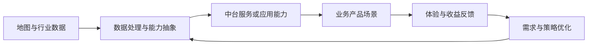
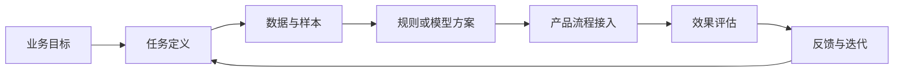

## 「校招」字节跳动｜产品经理 - 业务中台

这是一份 2027 届校园招聘的正式产品经理岗位，方向是业务中台。JD 的工作对象包括地图数据及相关应用能力、跨产品业务场景、策略方案和流程机制，工作内容覆盖需求分析、数据分析、项目推进与业务反馈闭环。

本文先整理用户提供的岗位原文，再把职责翻译成日常工作、能力证据和面试准备问题。城市、职位类型和职位 ID 已在材料中给出；公司命名依据与团队归属仍需结合招聘页面核验，不作超出材料的推断。

!!! info "素材说明"
    本文根据用户提供的岗位描述与任职资格整理。

    原始材料包含北京、上海、深圳三个工作城市、“正式”“产品 - 产品经理”“2027 届校园招聘”和职位 ID A250886A。

    团队介绍中提到“字节跳动系产品相关应用场景”，因此按字节跳动命名；具体招聘主体和团队归属仍以招聘页面为准。

## 岗位信息

| 项目 | 原文信息 |
| --- | --- |
| 岗位名称 | 产品经理 - 业务中台 |
| 招聘类型 | 2027 届校园招聘 |
| 职位类型 | 正式；产品 - 产品经理 |
| 工作城市 | 北京、上海、深圳 |
| 职位 ID | A250886A |
| 团队方向 | 跨产品业务方向、中台能力与技术解决方案 |

## 原始 JD

以下内容按用户提供的岗位文字整理，不补充未出现的招聘信息。

### 职位描述

团队负责公司多个跨产品业务方向，提供可复用的平台能力及技术解决方案。我们为公司多业务提供如地理位置、行业数据等多类型的中台能力与技术解决方案，积极利用 AI 等技术做中台能力提效与升级。

加入我们，你将有机会从中台的多视角参与业务建设，感受不同类型／阶段的业务特点；通过用户场景的开发与架构工作，学习和解决极富挑战的技术问题；你也可以从数据出发，积极利用策略和模型，为业务提供有价值的助力。

1. 负责协助产品经理支持地图数据及相关应用能力的建设，包括需求分析、策略方案产出、数据分析、项目进度管理等；
2. 负责协助产品经理梳理字节跳动系产品相关应用场景，以体验、收益为驱动，参与制定解决方案，推动业务需求高效落地；
3. 负责处理业务方反馈的各项问题，梳理当前流程及机制中的问题并及时跟进。

### 职位要求

1. 2027 届获得本科及以上学历，计算机、通信和地理信息系统等相关专业优先；
2. 具备优秀的自主学习和数据分析能力，有判断力，对数据敏感，逻辑性强，善于发现问题；沟通协作能力强，工作耐心细致，有高度的责任心；
3. 有测绘、数理、AI 相关教育或实习背景者优先。

## JD 明确写了什么

| 维度 | JD 明确信息 | 可以确认的信号 |
| --- | --- | --- |
| 招聘类型 | 2027 届校园招聘；正式 | 这是校招正式岗位，不应标为实习岗位 |
| 产品对象 | 地图数据及相关应用能力 | 需要理解数据能力如何被业务产品使用 |
| 平台方向 | 地理位置、行业数据等可复用的中台能力 | 工作不只面向一个终端产品，还涉及跨业务复用 |
| 方案工作 | 需求分析、策略方案、数据分析和解决方案制定 | 需要把业务问题转成策略、数据和产品方案 |
| 场景范围 | 字节跳动系产品相关应用场景 | 需要梳理不同产品或业务阶段的使用场景 |
| 推进工作 | 项目进度管理、需求落地、测试与跟进 | 需要参与从方案到落地的项目过程 |
| 反馈闭环 | 处理业务方反馈，梳理流程和机制问题 | 需要把零散问题归纳为可改进的流程或机制 |
| 技术交叉 | AI、策略和模型用于中台能力提效与升级 | 需要理解 AI 应用，但 JD 未要求承担模型训练 |
| 专业偏好 | 计算机、通信、地理信息系统优先；测绘、数理、AI 背景加分 | 技术、空间数据和分析能力是岗位偏好，不是唯一背景 |

## 先下判断：它是什么岗位

这份 JD 更接近**跨业务中台与数据策略结合的产品经理校招岗位**。它的工作重点不是单独设计一个面向消费者的功能，也不是只做地图数据维护，而是协助建设可被多个业务使用的能力，并通过策略、模型和数据分析支持业务落地。

岗位的核心责任可以概括为四点：

1. **建设中台能力**：参与地图数据及相关应用能力建设，关注能力如何被不同业务复用。
2. **理解业务场景**：梳理字节跳动系产品的应用场景，识别体验和收益目标。
3. **设计并验证方案**：结合需求、策略、数据和模型参与解决方案制定，通过数据发现问题、验证效果。
4. **推动问题闭环**：跟进业务反馈、项目进度和流程机制问题，推动需求落地和后续改进。

“协助产品经理”说明岗位会在更成熟的产品经理指导下参与工作；JD 没有承诺独立负责完整产品线，因此面试时需要确认实习生或校招生的实际授权范围、首个项目和交付物。

## 把职责翻译成日常工作

### 1. 支持地图数据及应用能力建设

岗位原文没有说明具体地图数据类型、服务对象或产品形态，但可以确认工作会围绕一条“数据—能力—业务应用”的链路展开：

可能涉及的日常任务包括：

- 整理业务方需求，明确使用场景、用户对象和问题优先级
- 梳理数据字段、数据质量、更新频率和可用范围
- 参与策略方案产出，说明规则、模型或流程如何影响业务结果
- 通过数据分析定位异常、瓶颈和机会点
- 记录项目节点、依赖关系、风险和待决策事项
- 跟进开发、测试、上线和反馈，不把方案提交当作项目结束

上图是从 JD 提炼的工作链路，不代表岗位一定负责数据生产、底层架构或所有中台服务。具体职责需要结合团队分工确认。

### 2. 梳理跨产品应用场景

“字节跳动系产品相关应用场景”意味着产品经理需要从多个业务视角理解同一项中台能力。分析时至少要回答：

- 哪类业务使用这项地图或数据能力？
- 用户在什么任务节点需要它？
- 业务方当前通过什么方式解决问题？
- 现有方案在体验、效率、收益或稳定性上有什么不足？
- 哪些需求适合沉淀成通用能力，哪些需求只能保留为业务定制？
- 不同业务对数据口径、时效、权限和质量的要求是否一致？

中台产品的难点不只是“把能力做出来”，还要平衡共性与差异：过度定制会增加维护成本，过度抽象则可能无法满足真实业务场景。JD 没有给出具体业务案例，候选人应在面试中询问首个负责的产品和场景。

### 3. 从体验与收益出发制定方案

JD 明确提出“以体验、收益为驱动”。这表示方案不能只描述技术实现，还需要同时说明用户价值和业务结果：

| 方案分析 | 需要回答的问题 |
| --- | --- |
| 用户体验 | 哪个用户在什么环节遇到什么阻碍？流程是否更清晰、及时和稳定？ |
| 业务收益 | 方案希望改善效率、转化、成本、供给质量还是其他结果？ |
| 中台复用 | 能否被多个业务使用？哪些部分需要配置化或差异化？ |
| 数据依据 | 当前基线是什么？问题由哪些数据或反馈证明？ |
| 落地成本 | 需要哪些研发、数据、策略和运营资源？上线依赖是什么？ |
| 验收标准 | 上线后用什么指标和用户反馈判断方案有效？ |

“收益”在此处没有被 JD 定义为某个固定财务指标，可能对应业务效率、使用结果或其他团队目标。不要在面试回答中自行假定具体收益口径，应先向招聘方确认。

### 4. 处理业务反馈并梳理流程机制

业务方反馈往往以零散问题出现。岗位要求不仅是“及时跟进”，还包括梳理当前流程和机制中的问题。可以按以下方式处理：

1. 记录反馈来源、发生时间、影响范围和复现条件。
2. 区分单个数据异常、产品缺陷、流程断点、规则问题和协作机制问题。
3. 判断问题的紧急程度、影响对象和临时兜底方式。
4. 与业务、研发和策略团队确认原因、负责人和完成时间。
5. 跟踪修复、测试和上线结果，保留反馈闭环记录。
6. 对重复出现的问题回溯流程和机制，而不是只处理单个工单。

这类工作需要耐心、细致和责任心，也要求产品经理具备判断力：不是所有反馈都直接进入开发排期，需要判断问题是否普遍、是否影响核心目标以及是否已有替代方案。

## 产品问题一：中台产品如何平衡复用与定制

### 可复用能力的判断框架

面对一个业务需求，可以先判断它是否值得沉淀为中台能力：

| 判断维度 | 需要确认的问题 | 可能的处理方式 |
| --- | --- | --- |
| 需求共性 | 是否有多个业务存在相似需求？ | 抽象通用能力或保留业务侧实现 |
| 数据基础 | 数据来源、口径和质量是否稳定？ | 先补数据治理，再承诺服务能力 |
| 使用方式 | 不同业务的输入、输出和时效要求是否相近？ | 标准化接口并提供必要配置 |
| 体验影响 | 接入后是否减少用户操作或提高结果质量？ | 以用户任务和体验指标验收 |
| 业务收益 | 是否有清晰的效率、质量、成本或收益改善？ | 明确基线与目标后再排优先级 |
| 维护成本 | 规则、模型和数据更新由谁负责？ | 明确责任边界、监控和回滚方式 |

### 中台方案的常见风险

- 只从技术抽象出发，没有验证业务是否真的会使用
- 为单一业务快速定制，后续难以被其他业务复用
- 只关注接口或数据供给，不负责接入后的体验和结果
- 没有统一口径，导致不同业务对同一数据产生不同理解
- 只上线一次，不跟踪数据质量、调用情况和业务反馈
- 把“平台能力可复用”误解成“所有业务必须采用同一流程”

这些是中台产品设计时需要主动检查的风险，不代表该团队已经存在这些问题。

## 产品问题二：AI、策略和模型在岗位中如何配合

团队介绍提到积极利用 AI 技术做中台能力提效与升级，也提到从数据出发利用策略和模型为业务提供助力。JD 没有明确 AI 的具体任务，因此面试时可以围绕以下链路追问：

需要确认的问题包括：

- 模型用于数据理解、分类、预测、推荐、匹配还是其他任务？
- 产品经理负责任务定义、样本分析、Prompt、评测还是产品接入？
- 规则策略和模型策略如何分工，什么情况下需要人工审核？
- 使用哪些离线和线上指标判断效果？
- 模型输出错误时，业务如何发现、纠正和回滚？
- 数据权限、隐私和调用成本由谁负责？

候选人不需要把岗位描述成算法岗。更准确的匹配方式是：理解业务任务，参与数据和策略方案设计，和研发、算法一起验证模型能否稳定支持中台能力。

## 产品问题三：如何用数据发现问题

JD 将数据分析、自主学习、判断力和数据敏感度同时列为重要要求。一个完整的数据分析任务通常包括：

1. 明确业务问题和分析对象，避免先取数再寻找结论。
2. 统一指标定义、时间范围、数据来源和过滤条件。
3. 按业务、产品、地区、用户或策略版本进行分层比较。
4. 检查缺失值、重复记录、异常值和数据口径变化。
5. 对异常结果回到具体样本和流程节点，寻找可解释原因。
6. 提出可验证的策略或产品方案，说明需要补充什么数据。
7. 通过测试或上线后的数据验证方案是否改善目标结果。

可以把数据分析交付物写成“问题—证据—判断—方案—验证”的结构：

| 环节 | 产出示例 |
| --- | --- |
| 问题 | 某类业务反馈集中在一个流程节点 |
| 证据 | 按业务、时间和版本拆分后的数据与样本 |
| 判断 | 可能是数据质量、规则逻辑或接入流程问题 |
| 方案 | 调整流程、规则、数据字段或模型调用 |
| 验证 | 预设指标、测试样本、灰度结果和反馈记录 |

表中的问题和方案是通用示例，不是该岗位已确认的业务结论。

## 能力匹配：校招生需要证明什么

### 产品逻辑与问题分析

可以准备一个从需求到落地的项目案例，说明：

- 如何理解业务方提出的模糊需求
- 如何拆解用户、场景、流程和约束
- 如何区分表面现象、根因和待验证假设
- 如何比较多个方案并解释优先级
- 如何定义方案边界、验收标准和异常处理

### 数据分析与判断力

材料没有规定必须掌握某种工具，但明确要求数据分析能力。候选人可以展示：

- 用 SQL、Python 或表格完成数据清洗、筛选、聚合和分层分析
- 从数据中发现异常，并回到业务流程解释原因
- 记录指标口径、样本范围和计算过程
- 通过前后对比、实验或人工抽检验证策略效果
- 识别数据无法回答的问题，不把相关关系直接当成因果结论

### 技术与空间数据理解

计算机、通信和地理信息系统是优先专业，测绘、数理和 AI 教育或实习背景属于加分项。准备时可以围绕真实经历说明：

- 接触过什么数据、系统或 AI 应用
- 数据如何进入产品流程，可能有哪些质量问题
- 技术约束如何影响产品方案和用户体验
- 如何与研发、算法或数据团队沟通实现边界

没有 GIS 或测绘背景时，不应虚构领域经验，可以用真实的数据项目、AI 应用或复杂流程产品经历证明迁移能力。

### 项目推进与协作

岗位包含项目进度管理、业务反馈处理和跨团队落地。面试案例应讲清：

- 项目目标、参与团队和本人负责范围
- 关键节点、依赖关系和阻塞问题
- 如何同步信息、推动决策和跟进执行
- 测试或上线后发现什么问题，如何处理
- 最终结果和本人复盘

“沟通能力强”需要用具体行动证明，例如如何组织需求澄清、维护问题清单、推动验收和同步风险，而不是只作自我评价。

## 面试准备：把 JD 转成练习题

| 练习题 | 回答应覆盖的内容 |
| --- | --- |
| 你如何理解业务中台？ | 可复用能力、业务接入、共性与定制、平台结果和责任边界 |
| 如何建设地图数据相关产品能力？ | 用户与业务场景、数据质量、能力抽象、应用接入、指标和反馈 |
| 一个业务方提出了模糊需求，你怎么处理？ | 目标澄清、用户任务、现状流程、数据证据、方案和验收 |
| 如何判断需求是否适合沉淀为中台能力？ | 需求共性、复用范围、数据基础、收益、维护成本和责任人 |
| 如何从数据中发现策略问题？ | 指标口径、分层分析、异常检查、样本回溯、假设和验证 |
| 如何评估模型或策略效果？ | 任务定义、标注标准、准确性与覆盖、业务结果、Badcase 和回归 |
| 业务方反馈与研发判断不一致时怎么办？ | 固定问题、复现样本、对齐目标、确认责任、测试和反馈闭环 |
| 如何管理一个跨团队项目？ | 目标、里程碑、依赖、风险、决策记录、测试、上线和复盘 |
| 你没有地图或 GIS 背景，如何匹配岗位？ | 真实数据或 AI 项目、问题拆解、技术协作和快速学习证据 |
| 为什么想做业务中台产品？ | 对跨业务复用、数据策略、复杂场景和长期能力建设的具体理解 |

## 投递前必须确认的内容

虽然这份 JD 已明确岗位为 2027 届校招正式岗位，但以下内容仍需要向招聘方核实：

1. **招聘主体**：职位对应的具体公司主体和业务团队是什么？
2. **首个产品**：主要负责地图数据、地理位置、行业数据中的哪类能力？
3. **服务对象**：中台能力具体服务哪些字节跳动系产品和业务团队？
4. **工作比例**：需求分析、策略方案、数据分析、项目管理和反馈处理分别占多少时间？
5. **AI 边界**：AI、策略和模型具体用于什么任务，产品经理参与到哪一层？
6. **数据权限**：校招生可以接触哪些数据，数据权限和脱敏机制如何管理？
7. **考核指标**：岗位更看重能力复用、业务收益、体验、数据质量还是项目交付？
8. **项目阶段**：当前工作重点是平台建设、业务接入、存量优化还是新能力探索？
9. **团队协作**：产品、策略、研发、算法、数据和运营之间如何分工？
10. **培养与发展**：校招生的导师机制、轮岗安排、定岗方式和转正考核如何？

## 适合什么样的候选人

这份校招岗位更适合以下候选人：

- 对数据、策略和跨业务产品有兴趣，愿意理解底层能力如何服务真实场景
- 能快速学习陌生业务，把模糊反馈拆成流程、数据和可验证问题
- 有基础的数据分析能力，能够独立完成数据整理、分析和结论表达
- 做过 AI、GIS、测绘、数理或复杂系统相关项目，并能说明本人贡献
- 能写清需求、调研和策略文档，跟进项目节点和测试反馈
- 具备耐心、细致、责任心和跨团队协作意识

如果候选人只把中台理解为“给其他团队提供接口”，却无法说明业务场景、复用边界、体验收益和数据反馈，匹配度可能不足。相反，项目不一定要来自大厂，只要能够完整展示问题拆解、方案判断、数据验证和协作落地过程，就能证明基础能力。

## 结论

这份 JD 的核心是参与建设面向多业务复用的地图数据及相关应用能力，用需求分析、策略方案、数据分析和项目推进支持业务落地。岗位判断可以收束为四句话：

1. **岗位类型**：字节跳动 2027 届校园招聘的正式产品经理岗位。
2. **产品对象**：地图数据及相关应用能力，以及地理位置、行业数据等中台能力。
3. **工作方法**：从业务场景和数据出发，结合体验、收益、策略和模型制定解决方案。
4. **能力重点**：问题拆解、数据分析、技术理解、项目推进和跨团队协作。

岗位的真实工作边界仍取决于首个产品、团队分工、数据权限和考核指标。以上材料未说明的内容，应以职位页面和招聘沟通为准。

## 相关阅读

-   [产品经理岗位类别](../product-manager-types/index.md)：按技术对象、服务对象和结果责任理解产品经理方向
-   [「校招」字节跳动｜开发者 AI 产品经理](bytedance-developer-ai-pm.md)：开发者 AI 产品岗位的 JD 拆解
-   [数据分析入门](../../pm/data-analysis.md)：从指标、样本到结论的数据分析基础
-   [AI 产品经理](../positions/ai-pm.md)：AI 产品经理的职责结构与面试前核验清单
-   [评估与评测](../../ai/evaluation.md)：模型、策略和产品效果的评估方法
-   [简历与作品集](../resume-portfolio.md)：把 JD 要求转成项目结果和可追问证据

## 来源说明

-   岗位名称、工作城市、职位类型、招聘批次、职位 ID 与 JD 原文：用户提供的招聘信息，职位 ID 为 A250886A。
-   岗位招聘类型：原文明确写有“2027 届校园招聘”和“正式”，因此标记为「校招」，不标记为「实习」。
-   公司命名依据：团队介绍明确提及“字节跳动系产品相关应用场景”；具体招聘主体、团队名称和业务线以最新招聘页面为准。
-   本文中的流程、指标、面试问题和能力分析属于基于 JD 的站内解读，不代表招聘方的额外承诺。
