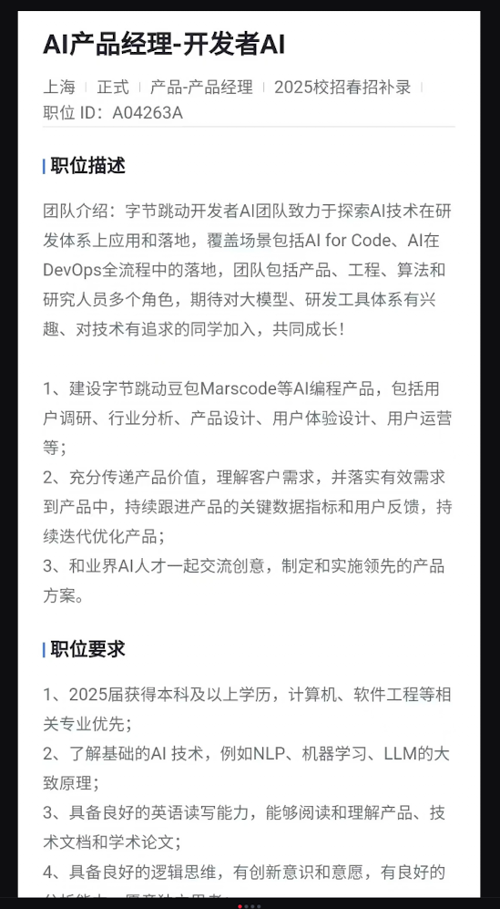
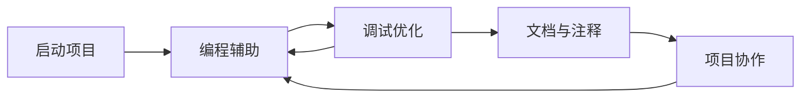

## 字节跳动开发者 AI 产品经理：一份 JD 的拆解

这是一份面向开发者工具的 AI 产品经理 JD。职位名称写的是「AI 产品经理」，但团队方向、产品名称和截图中提出的问题共同指向一个更具体的工作对象：把大模型能力嵌入代码开发流程，做出开发者愿意持续使用的产品。

本文先区分 JD 明确写出的信息，再分析它隐含的用户、产品和技术问题。分析中的「可能」「需要确认」不是招聘方的承诺，投递或面试前应向招聘方核验。

!!! info "素材说明"
    本文基于用户提供的四张岗位分析截图整理，读取时间为 2026-08-31。

    第一张截图是职位信息与职位描述；后三张截图是围绕该岗位形成的产品问题、竞品形态和面试准备思路。

    第一张截图底部的职位要求未完整展示。本文只使用可见内容，不补写缺失要求。

## 原始信息：这份 JD 写了什么

截图中可读出的职位信息如下：

| 项目 | 截图内容 |
| --- | --- |
| 职位 | AI 产品经理-开发者 AI |
| 地点与类型 | 上海；正式 |
| 职类 | 产品-产品经理 |
| 招聘批次 | 2025 校招春招补录 |
| 职位 ID | A04263A |
| 团队方向 | 开发者 AI；AI for Code；AI 在 DevOps 全流程中的落地 |
| 协作角色 | 产品、工程、算法和研究人员 |

### 职位描述中的三层责任

JD 的职责可以按「做产品、对结果负责、探索新方案」分成三层：

1.  **建设产品**：建设字节跳动豆包、Marscode 等 AI 编程产品，覆盖用户调研、行业分析、产品设计、用户体验设计和用户运营
2.  **推动迭代**：传递产品价值、理解客户需求，把有效需求落实到产品中，持续跟进关键数据指标和用户反馈
3.  **探索方案**：与业界 AI 人才交流创意，制定和实施领先的产品方案

这三层责任说明岗位不只是写需求文档，也不只是做模型能力包装。它同时包含发现问题、设计方案、推动落地、观察数据和持续迭代。

### 可读出的任职要求

截图中完整可读的要求包括：

-   2025 届本科及以上学历，计算机、软件工程等相关专业优先
-   了解 NLP、机器学习、LLM 的大致原理
-   具备良好的英语读写能力，能够阅读和理解产品、技术文档与学术论文
-   具备良好的逻辑思维，有创新意识和意愿

最后一条要求在截图底部未完整展示，因此不把它扩展成完整的任职条件。

## 先下判断：它是什么岗位

这份 JD 更接近**开发者工具方向的 AI 应用产品经理**，而不是训练基础模型的算法产品经理，也不是只负责内容或运营的 AI 岗位。

| 判断维度 | JD 明确信号 | 对岗位的解释 |
| --- | --- | --- |
| 产品对象 | 豆包、Marscode 等 AI 编程产品 | 产品嵌入代码开发与 DevOps 流程 |
| 工作范围 | 调研、分析、设计、体验、运营、指标和反馈 | 需要参与从发现到迭代的完整链路 |
| 技术门槛 | 了解 NLP、机器学习、LLM 大致原理 | 重点是理解能力边界、分析问题和协作，不等于承担模型训练 |
| 协作方式 | 产品、工程、算法、研究人员共同参与 | 需要把用户问题翻译成技术问题，再把技术限制翻译成产品取舍 |
| 结果责任 | 关键数据指标、用户反馈和产品迭代 | 不能只交付功能，还要解释功能是否带来有效使用 |
| 候选人画像 | 计算机或软件工程背景优先，要求英语读写 | 团队希望候选人读懂代码开发场景和技术资料 |

这个判断仍然需要通过面试确认。尤其要问清楚岗位主要服务 Marscode 的哪条产品线、面向哪类用户，以及「用户运营」在实际工作中占多大比重。

## 把职责翻译成入职后的工作

### 1. 「建设 AI 编程产品」意味着什么

这句话覆盖范围很宽，至少可能包含以下工作：

-   **用户研究**：观察开发者如何启动项目、编写代码、调试、查资料、提交代码和协作
-   **行业分析**：比较 AI 编程产品、开发者工具和 DevOps 产品的形态，寻找未被满足的任务
-   **产品设计**：决定功能优先级、交互流程、模型介入方式和人工确认节点
-   **用户体验设计**：处理等待、流式输出、代码差异、错误提示、撤销、重试和结果预览
-   **用户运营**：教育用户、推动试用、收集反馈、维护开发者社区或企业客户关系

因此，面试时不能只准备「我会写 PRD」。更有价值的证据是：你是否做过真实用户观察，是否理解代码开发流程，是否把一个 AI 能力做成过可验证的功能。

### 2. 「理解客户需求并落实有效需求」意味着什么

JD 没有直接给出用户类型，也没有列出需求优先级。这个表述至少需要追问三件事：

1.  **谁是客户**：个人开发者、学生、企业开发团队、研发管理者，还是购买企业服务的决策者
2.  **什么是有效需求**：高频任务、付费意愿、留存、开发效率、代码质量，还是企业交付结果
3.  **产品经理的权限**：产品经理能否决定需求进入路线图，还是主要负责执行已确定的方向

截图中的分析把用户分为专业开发者、非专业用户和企业团队。这是值得验证的用户假设，不是 JD 已经确认的用户画像。

### 3. 「跟进关键数据指标和用户反馈」意味着什么

JD 没有点名指标。针对 AI 编程产品，可以先建立一组指标候选，再在面试中确认团队当前采用的口径：

| 目标 | 指标候选 | 需要防止的误判 |
| --- | --- | --- |
| 用户是否完成任务 | 任务完成率、代码采纳率、从描述到运行的成功率 | 生成次数高不代表任务完成 |
| 产品是否可持续使用 | 次日/周留存、重复使用率、活跃项目数 | 一次尝鲜可能制造虚假的活跃 |
| AI 输出是否可靠 | 编译通过率、测试通过率、回滚率、badcase 率 | 用户复制代码不等于代码正确 |
| 交互是否顺畅 | 首次响应延迟、完整响应时长、重试率 | 只看平均延迟会掩盖长尾 |
| 成本是否可控 | 单次任务 token 成本、模型调用成本、单位有效任务成本 | 调用便宜但返工多，整体成本仍可能更高 |
| 团队是否愿意采用 | 团队启用率、协作项目覆盖率、权限配置完成率 | 账号注册数不能代表组织采用 |

一份好的面试回答不需要一次报出所有指标，而应先说明任务和成功标准，再选择 2–3 个核心指标，并说明如何结合人工抽检与 badcase 分析。

## 产品问题一：先拆 AI 编程的核心工作流

后三张截图首先提出了一个重要问题：如果现在要做类似 Cursor 的 AI 代码产品，用户实际如何完成任务，产品在哪些节点介入？

核心关系是：AI 编程产品不是单点代码补全，而是嵌入项目生命周期的连续工作流；每个介入点都要定义输入、输出、验证和撤销方式。

### 启动项目

用户可能用自然语言描述需求，让产品生成初始化项目、文件结构、基础配置和依赖。

需要想清楚：

-   需求描述不完整时，产品是直接生成，还是先询问关键约束
-   生成项目后，用户如何看到文件变化、依赖来源和待确认事项
-   生成结果如何运行、预览和回滚
-   产品如何避免为了完成 Demo 而生成无法维护的项目结构

首个任务的成功标准不应只是「生成了多少文件」，而应包括项目能否启动、用户是否理解生成内容，以及后续是否愿意继续修改。

### 编程过程辅助

代码补全、代码生成、重构、解释和自然语言改代码，都属于编程过程中的辅助能力。

专业开发者通常更关注以下控制权：

-   让 AI 只改当前文件，还是允许跨文件修改
-   生成建议是否自动写入，还是先以 diff 展示
-   用户能否指定语言、框架、代码风格和项目约束
-   AI 是否理解当前仓库的约定，而不是只生成局部正确的代码
-   建议被采纳、拒绝和修改后，反馈是否进入后续交互

这里的产品难点是**介入程度**。AI 介入太少，用户感受不到价值；介入太深，用户会担心失去控制或引入隐蔽错误。

### 调试与优化

调试场景比生成场景更能检验产品价值。产品至少需要区分：复现问题、定位原因、提出修复、执行修改和验证修复。

-   让 AI 先解释错误上下文，再提出候选修复
-   修改前展示影响范围和差异
-   通过测试、日志、trace 或运行结果验证修复
-   修复失败时保留原状态，支持重试、撤销和人工接管
-   对性能、资源管理和图形渲染等问题，不把猜测包装成确定结论

「给出一段看起来合理的修复代码」不等于「解决了问题」。产品验收需要落到编译、测试、运行和性能结果。

### 文档与注释

自动生成文档和注释的价值不只在于减少输入，还在于降低代码维护成本。需要确认：

-   文档是否与代码变更同步
-   注释是否解释设计原因，而不是重复代码表面行为
-   产品能否识别过时文档并提示更新
-   团队是否有统一的文档结构与审阅流程

这类功能可以作为辅助能力，但不能替代团队对代码规范和知识沉淀的责任。

### 项目管理与协作

截图把 Git 管理、人员协作等内容列为可能的产品流程。企业团队场景还需要加入：

-   仓库、分支和项目权限
-   代码与提示上下文的访问边界
-   变更审计、审批和责任追踪
-   团队共享规则、模板和评测结果
-   私有化部署或数据不出域的要求

截图作者也明确表示对企业团队部分了解有限。这个不确定性本身就是面试时应主动验证的地方。

## 产品问题二：产品形态决定用户体验

AI 编程产品可以作为 IDE 插件、独立 IDE、在线开发环境或终端工具存在。形态不是包装选择，它会影响上下文获取、安装成本、权限边界、交互空间和迁移成本。

### Fork IDE 还是做插件

| 方案 | 优点 | 代价与待确认问题 |
| --- | --- | --- |
| 基于现有 IDE 的插件 | 用户保留原有编辑器与快捷键；安装成本相对低 | 受 IDE 扩展接口、界面空间和权限限制；跨 IDE 适配成本高 |
| Fork 一个 IDE | 可以深度控制上下文、交互和发布节奏 | 用户需要迁移环境；上游版本同步、生态兼容和稳定性成本高 |
| 在线 IDE | 环境统一；便于协作和快速启动 | 代码、依赖和运行环境上云；隐私、网络和复杂项目兼容性需要验证 |
| 终端助手 | 接近开发者原有命令流；适合脚本和批处理 | 交互反馈较弱；新手上手难；复杂 diff 和状态不容易展示 |

面试中可以把选择题改写成约束题：目标用户是谁、任务发生在哪里、需要多少上下文、用户能否迁移环境、企业是否允许代码出域。约束明确后，形态选择才有依据。

### 截图中列出的产品形态

后三张截图列出了若干产品，目的是比较不同形态服务的需求。下表只整理截图中的形态信息，不把它当作完整的竞品评测。

| 产品 | 截图中的形态描述 | 可以比较的问题 |
| --- | --- | --- |
| Copilot | 基于 IDE 的插件 | 插件介入深度、补全与会话功能如何平衡 |
| Cursor | 本地 IDE | 深度上下文、迁移成本和本地开发体验如何权衡 |
| v0 | 基于会话的代码编写 | 对话生成与代码预览如何衔接；[产品页面](https://v0.dev/chat) |
| llamacoder | 轻量会话式 IDE，带 sandbox | 快速试用、运行隔离和复杂项目能力如何取舍；[产品页面](https://llamacoder.together.ai/) |
| Replit | 可协作式在线 IDE | 多人协作、在线运行和团队管理如何结合；[产品页面](https://replit.com/) |
| Aider | 基于终端的本地代码助手 | 为什么一部分用户愿意在终端中完成 AI 辅助开发 |
| bolt.new | 会话式代码生成 + 在线 IDE | 快速生成、预览和在线环境如何组成闭环；[产品页面](https://bolt.new/) |

比较这些产品时，不要只问「谁的模型更强」。至少应从五个维度观察：

1.  **任务**：解决启动项目、修改代码、调试还是部署问题
2.  **上下文**：产品能看到当前文件、整个仓库、运行结果还是团队知识
3.  **控制**：用户能否审阅 diff、限制文件范围、撤销和恢复
4.  **环境**：本地、插件、在线 IDE 和终端分别承担什么运行责任
5.  **结果**：产品优化的是代码生成量、任务完成、协作效率还是部署成功

产品差异化应从用户任务和结果出发，而不是从产品名称或模型名称出发。

## 产品问题三：用户分层决定「好用」的含义

截图中提出了专业用户、非专业用户和企业团队三类用户。三者对 AI 代码产品的期待不同，不能用同一个「用户体验好」概括。

| 用户 | 主要任务 | 关键需求 | 主要风险 |
| --- | --- | --- | --- |
| 专业开发者 | 在真实项目中提效、重构、调试和协作 | 模型质量、仓库级上下文、细粒度控制、可复现性 | 生成错误、上下文误判、打断既有工作流 |
| 非专业用户或学生 | 快速完成小项目，同时学习代码 | 低上手成本、三步内得到可运行结果、预览与解释 | 只会复制结果，不理解代码；失败后无法恢复 |
| 企业团队 | 在权限和规范内协作开发 | 私有部署、权限、审计、团队规则、成本控制 | 代码泄露、责任不清、组织采用率低 |

### 专业开发者：深度与控制

专业开发者对细节和上限更敏感。产品需要支持他们控制 AI 的介入范围，而不是把所有任务自动化：

-   指定上下文文件和仓库范围
-   选择只读分析、生成 diff 或直接修改
-   配置项目规范、测试命令和代码风格
-   解释生成依据、引用相关文件和展示不确定性
-   快速拒绝、撤销和恢复不符合预期的修改

专业用户是否愿意付费，往往取决于产品能否稳定减少真实任务中的返工，而不是 Demo 中一次生成了多少代码。

### 非专业用户或学生：低门槛与成长空间

非专业用户首先需要一次可理解、可运行、可预览的成功体验。截图提出「三步内快速准确实现需求」和提供学习成长辅助，这两个方向可以转成具体设计：

-   把自然语言需求拆成少量可确认的步骤
-   在生成后提供运行预览和错误解释
-   给出代码修改前后的差异
-   将复杂错误转换成下一步行动，而不是只展示日志
-   让用户逐步理解项目结构、依赖和调试方法

低上手成本和高深度上限之间存在张力。一个可行的版本策略是：初次使用采用向导和默认值，熟练用户可以逐层展开配置、上下文和权限控制。

### 企业团队：协作与治理

企业团队是截图中提出但尚未展开的方向。需要补充确认：

-   使用者、采购者和最终决策者分别是谁
-   哪些代码、文档和提示上下文可以被模型访问
-   是否要求私有化部署、专有网络或数据不出域
-   团队如何共享规则、模板、评测集和模型配置
-   AI 生成的代码如何审阅、审批、追责和回滚
-   组织购买后，如何判断团队真的采用而不是只开通账号

如果岗位实际服务企业团队，产品经理的工作就不止是 IDE 交互，还会涉及权限、审计、交付和组织采用。

## 产品问题四：模型能力边界如何转成产品方案

AI 编程产品的模型能力不是稳定不变的。产品经理需要知道模型能做什么、在哪些任务上容易失败，以及产品功能是否真的补足了失败原因。

截图中提到「代码方面 Claude 是 SOTA」「如果只能使用国内模型则比较信任 DeepSeek」等判断。这些是截图作者在特定时间点的观察，不能直接当作行业结论。模型版本、可用区域、调用限制和评测结果都会变化，面试回答应回到具体模型、具体任务和具体评测集。

### 从能力边界到补偿方案

| 典型边界 | 产品补偿思路 | 验收方式 |
| --- | --- | --- |
| 难以理解大型代码库的依赖关系 | 建立代码索引；按任务选择相关文件；展示上下文来源；允许用户补充和删减上下文 | 相关文件召回率、跨文件任务完成率、错误引用率 |
| 难以判断复杂问题的正确修复 | 先生成复现步骤；关联日志与测试；以 diff 方式修改；要求运行验证或人工确认 | 测试通过率、回滚率、修复后新增 badcase |
| 对性能和资源管理考虑不足 | 接入静态检查、性能分析和运行数据；对高风险修改给出提醒 | 基准测试变化、资源消耗、线上故障率 |
| 缺少领域或项目规范知识 | 接入版本化文档、代码规范和示例；明确知识来源与更新时间 | 规范命中率、引用正确率、文档过时率 |
| 无法稳定完成长链路任务 | 拆成可观察步骤；设置停止条件、预算、重试和人工接管 | 端到端成功率、单步失败率、接管率、单任务成本 |

产品补偿要满足两个条件：一是针对真实失败模式，二是可以用评测或线上指标验证。为了弥补一个模型版本的缺陷而增加大量固定流程，可能会变成难以维护的产品负担。

### 「少而轻量」的设计原则

截图提出：模型能力不足时，可以通过产品功能补足，但这些雕花功能应尽量少且轻量，未来模型能力达到预期后可以下架。

这个思路可以进一步落实为：

-   把模型特定的提示词、路由和校验策略版本化
-   用评测集记录某个补偿功能解决了哪些 badcase
-   给补偿功能设置启用条件，不让所有用户都承担复杂交互
-   定期比较「模型升级前后」的收益，避免旧逻辑叠加
-   设计删除和回滚路径，让临时兼容层不会变成永久债务

这里体现的是产品经理对模型与产品关系的判断：产品不是把模型缺陷全部藏起来，而是用可观测、可验证的机制把风险控制在用户能接受的范围内。

## 面试准备：截图中的能力信号

后三张截图把面试准备归纳为教育背景与实习经历、大模型基础、方向思考三部分。下面把它们改写成可准备的证据。

### 教育背景与实习经历

计算机或软件工程背景的价值，不只是简历筛选上的专业匹配，还包括：

-   能理解代码开发流程、项目结构和开发者的真实约束
-   面对代码 badcase 时，能先理解问题背景，再判断模型或产品哪里出错
-   能与工程、算法和研究人员使用相对准确的技术语言沟通
-   有项目推动、团队协作和需求落地经历
-   知道如何设计反馈数据、收集样本和分析指标

没有计算机专业背景时，可以用等价证据补位：完整的 AI 编程产品作品、真实代码项目、可复现的评测报告、对 badcase 的分析，以及清晰说明技术取舍的项目复盘。

### 大模型基础

准备重点不是背模型术语，而是能回答「模型为什么在这里失败，产品可以怎样验证和补足」：

-   大模型的基本工作方式与上下文限制
-   代码生成、代码理解、代码调试之间的能力差异
-   RAG、代码索引、工具调用、运行验证分别解决什么问题
-   模型输出不稳定时，如何设计评测集、回归和人工抽检
-   模型升级后，如何识别是模型、Prompt、上下文、工具还是产品交互导致效果变化
-   如何把模型能力、延迟、成本、隐私和用户控制放在同一套取舍里

截图特别强调：分析 badcase 时，不仅要看懂开发背景，还要理解模型原理和错误原因。这样与算法团队沟通时，才能讨论优化路径，而不是笼统地说「效果不好」。

### 对开发者 AI 方向的持续思考

这类岗位通常会追问候选人是否真实使用和比较过相关产品。准备时可以为每个产品写一页短复盘：

1.  **用户是谁**：专业开发者、学生、独立开发者还是企业团队
2.  **任务是什么**：启动、补全、重构、调试、文档、协作还是部署
3.  **产品怎样介入**：插件、IDE、网页、终端，在哪个节点获取上下文
4.  **做得好的地方**：具体到一个任务和一次交互
5.  **做得不好的地方**：错误、延迟、上下文、控制权、隐私或成本
6.  **可以怎样改**：说明方案、指标和失败兜底，而不是只提一个功能点

「我用过 Cursor、Copilot、Marscode」不是完整答案。面试官更关心你能否说出它们服务的不同任务、产品形态和差异化定位。

## 可能的练习题与回答骨架

以下问题是根据截图中的产品分析整理的练习题，不是公司公开题库。

| 练习题 | 回答应覆盖的内容 |
| --- | --- |
| 设计一个类似 Cursor 的 AI 代码产品 | 用户分层、核心任务、产品形态、模型与上下文、MVP、评测、隐私和人工兜底 |
| 你会做插件还是 Fork 一个 IDE | 用户已有工作流、上下文深度、迁移成本、扩展能力、发布与维护成本 |
| 模型不够聪明，产品怎么补 | 先定位失败类型，再选择检索、代码索引、工具、测试、交互确认或降级，并给出验证指标 |
| 你如何判断一次代码修改成功 | 编译、测试、运行、性能、用户采纳和回滚等指标，按任务选择验收组合 |
| 专业用户和学生用户如何平衡 | 低门槛默认流程 + 可展开的高级控制，分别定义激活和深度使用指标 |
| 如何保护敏感代码 | 数据边界、权限、传输与存储、私有化部署、日志脱敏、审计和用户确认 |
| 如何分析一个代码 badcase | 复现输入、上下文、模型版本、工具调用、输出、运行结果、错误归因和回归样本 |
| 你怎么看 Copilot、Cursor、v0、Replit 等产品 | 先按形态和任务分类，再比较上下文、控制、运行环境和结果，不只比较模型名称 |

### 代码 badcase 的回答结构

遇到「模型生成了错误代码，你怎么办」时，可以按以下顺序回答：

1.  **复现**：固定用户输入、代码上下文、模型版本、Prompt、工具调用和运行环境
2.  **分类**：区分需求理解错、上下文缺失、知识错误、推理错误、工具失败、交互误导和验收缺失
3.  **判断影响**：看是否编译失败、测试失败、性能退化、隐私越权或引入不可见风险
4.  **选择修复**：通过补充上下文、改检索、加工具、改 Prompt、换模型、调整交互或降低代理权处理
5.  **回归**：把样本加入评测集，验证修复没有损害其他任务
6.  **上线观察**：关注线上指标、人工抽检、用户反馈、回滚和再次发生率

这个结构能同时展示产品判断、技术理解和协作能力。

## 投递前必须确认的内容

JD 给出了产品方向，但没有把实际边界全部写清。建议在招聘沟通或业务面试中确认：

1.  **首个产品对象**：主要负责 Marscode、豆包相关能力，还是新的开发者 AI 产品
2.  **核心用户**：个人开发者、学生、企业研发团队，还是多类用户同时覆盖
3.  **首个目标**：新用户激活、任务完成、留存、付费、代码质量、研发效率还是企业采用
4.  **职责比例**：用户研究、产品设计、数据分析、用户运营和行业研究分别占多少时间
5.  **技术参与权**：产品经理是否参与模型、Prompt、检索、工具和评测方案的决策
6.  **团队配置**：算法、工程、研究、设计、测试、数据和运营是否有专门角色
7.  **数据边界**：代码是否出域，是否支持私有化部署，日志和反馈如何脱敏
8.  **工作方式**：产品是插件、独立 IDE、在线环境还是终端工具，是否需要同时维护多种形态
9.  **结果责任**：产品经理负责上线功能，还是对使用率、代码质量、研发效率或商业结果负责
10. **招聘要求缺口**：截图未完整展示的任职要求是什么，哪些属于硬门槛，哪些只是优先项

### 需要警惕的模糊信号

-   JD 同时写用户调研、行业分析、产品设计、体验设计和用户运营，但没有说明团队分工与优先级
-   只强调「领先方案」或「AI 浪潮」，不说明用户任务、基线和成功标准
-   只说「跟进关键指标」，却说不清指标名称、数据来源和责任人
-   产品覆盖个人和企业用户，但没有权限、隐私、部署和协作边界
-   职位要求提到大模型，却无法确认产品经理是否参与评测、badcase 和模型迭代

这些信号不等于岗位有问题。它们表示候选人需要通过沟通把工作边界补全。

## 适合什么样的候选人

这份岗位更适合以下候选人：

-   有计算机、软件工程或同等代码实践背景，能与开发者讨论真实任务
-   做过 AI 应用、开发者工具、效率工具或复杂工作流产品
-   能把模型能力边界转成产品方案、评测标准和用户交互
-   愿意同时处理用户研究、产品设计、数据反馈和跨团队推进
-   有持续体验和比较前沿产品的习惯，能够形成自己的判断
-   能阅读英文技术文档、产品资料和论文，并把信息转成产品决策

如果候选人只对 Prompt 调整感兴趣，却不愿意理解代码工作流、评测、隐私和用户控制，匹配度可能不足。反过来，代码能力不是为了把产品经理变成算法工程师，而是为了让他们更准确地理解用户问题、定位 badcase 并参与技术取舍。

## 结论

这份 JD 的核心不是「做一个会生成代码的聊天框」，而是围绕开发者任务建立一套可持续的 AI 辅助开发流程。岗位判断可以收束为四句话：

1.  **产品对象**：开发者 AI 与 AI for Code 产品
2.  **用户问题**：在启动、编程、调试、文档和协作中减少真实任务的成本
3.  **能力要求**：产品基本功 + 代码开发理解 + 大模型边界意识 + 数据与 badcase 分析
4.  **面试重点**：能否从用户和任务出发，解释产品形态、模型取舍、评测方法与安全边界

真正决定是否值得投递的，不是岗位名称里有没有「AI」，而是招聘方能否说清用户、任务、指标、团队接口和候选人的决策权限。

## 相关阅读

-   [AI 产品经理](../positions/ai-pm.md)：AI 产品经理的岗位方向、职责结构与面试前核验清单
-   [大模型应用工程师与 Agent 工程师](../positions/llm-app-engineer.md)：应用开发与 Agent 编排岗位的技术边界
-   [AI 产品经理面试指南](../interviews/interview-guide.md)：概念题、产品设计题、案例题与行为面答题框架
-   [简历与作品集](../resume-portfolio.md)：把岗位要求转成项目结果和可追问证据
-   [评估与评测](../../ai/evaluation.md)：评测集、线上指标、人工评测和 badcase 闭环
-   [AI 产品开发生命周期（CC/CD）](../../pm/ai-lifecycle.md)：从验证、发布到持续校准的产品流程

## 来源说明

-   职位信息与职位描述：用户提供的「AI 产品经理-开发者 AI」岗位截图，职位 ID A04263A；截图显示为上海、正式、2025 校招春招补录岗位。
-   产品问题、竞品形态与面试准备：用户提供的后三张岗位分析截图。
-   截图读取时间：2026-08-31。岗位批次、产品名称、功能形态和招聘要求可能发生变化，具体以目标公司的最新公开招聘页面和面试沟通为准。
