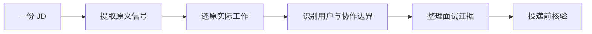

## JD 拆解

这里的每篇文章只拆一份具体 JD：先保留岗位的原始信息，再把职责、要求、用户、协作对象、指标和面试准备拆成可验证的问题。

JD 不是岗位全貌。招聘页面通常只写团队希望候选人承担的方向，实际工作范围还要结合面试沟通、汇报关系、团队配置和入职后的首个目标确认。文章中的推断会与截图或原文分开标注，不把推断写成招聘方的承诺。

核心关系是：JD 拆解把岗位文字转成一组关于工作对象、结果责任和能力证据的问题，帮助候选人判断是否值得投、应该怎么准备。

!!! info "阅读说明"
    岗位信息、薪酬、组织架构和招聘批次变化较快。每篇文章会记录素材来源与读取时间，投递前仍应以目标公司的最新招聘页面和面试沟通为准。

## 案例列表

-   [「校招」字节跳动｜开发者 AI 产品经理](bytedance-developer-ai-pm.md)：从一份 2025 校招 JD 出发，拆解 AI 编程产品的用户分层、IDE 形态、模型边界、评测与面试准备
-   [「社招」MiniMax｜AI Agent 产品经理](minimax-ai-agent-pm.md)：从一份 Agent 产品 JD 出发，拆解用户场景、Agent 机制、效果评估、能力匹配与面试准备
-   [「实习」百度｜策略产品实习生](baidu-strategy-product-intern.md)：从一份策略产品实习 JD 出发，拆解线索流程、内容策略、大模型准召、数据分析与跨团队落地
-   [「校招」字节跳动｜产品经理 - 业务中台](bytedance-business-platform-pm.md)：从一份 2027 届校招 JD 出发，拆解地图数据、中台能力、业务场景、策略方案与项目落地
-   [「校招」腾讯｜地图 AI 产品经理培训生](tencent-map-ai-pm-trainee.md)：从一份地图导航 AI 产品岗位 JD 出发，拆解导航 Agent、AI Buddy、用户体验、数据分析与模型协作

## 一篇 JD 怎么拆

1.  **先固定原文**：记录岗位名称、城市、招聘类型、职位 ID、发布日期和来源；截图不完整时标出缺失部分，不补写看不见的内容
2.  **再拆职责**：把「建设产品」「理解需求」「跟进指标」翻译成具体交付物、决策权限和结果责任
3.  **补用户与场景**：确认使用者、购买者、决策者和协作方是否相同，区分 JD 明写的信息与分析者提出的假设
4.  **拆技术协作**：对 AI 岗位追问模型、数据、检索、工具、评测、成本、权限与人工兜底分别由谁负责
5.  **转成面试证据**：每条能力要求都对应一段经历、一个作品或一次可复现的实验，避免只准备术语
6.  **留下核验问题**：把不能从 JD 判断的内容整理成向招聘方或业务面试官确认的问题

## 与产品经理岗位分类、协作对象的关系

[产品经理岗位类别](../product-manager-types/index.md)按技术对象、服务对象和结果责任建立产品经理方向，并收录带有官方来源的真实 JD 样本；[产品经理协作团队与岗位](../positions/index.md)梳理产品经理需要沟通协调的团队与角色。本栏目按真实招聘文本逐份建立案例：先用岗位分类确定大方向，再用具体案例判断某个团队的实际工作范围。

!!! info "来源分层"
    产品经理岗位类别中的公开样本有可点击的官方招聘页、职位 ID 和访问日期，原文摘录与站内分析分开。

    本栏目现有的「校招」字节跳动开发者 AI 产品经理、「社招」MiniMax Agent 产品经理、「实习」百度策略产品实习生、「校招」字节跳动业务中台产品经理与「校招」腾讯地图 AI 产品经理培训生案例来自用户提供的岗位截图或岗位文字，采用 OCR 转写或原文整理并记录素材来源；它们不是产品经理岗位类别中公开招聘页样本的替代品。

## 相关阅读

-   [AI 产品经理](../positions/ai-pm.md)：AI 产品经理的岗位方向、职责结构与面试前核验清单
-   [简历与作品集](../resume-portfolio.md)：把 JD 关键词转成项目结果、评测证据和可追问材料
-   [AI 产品经理面试指南](../interviews/interview-guide.md)：概念题、产品设计题、案例题和行为面答题框架
-   [如何参与](../../intro/htc.md)：提交新的 JD 拆解案例
