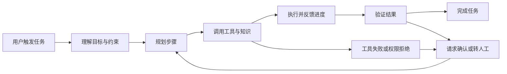

## 「社招」MiniMax｜AI Agent 产品经理

这是一份面向 AI Agent 产品的产品经理 JD。岗位标题是「AI Agent 产品经理」，职责同时覆盖产品规划、用户研究、Agent 场景设计、跨团队落地和效果评估，核心不是把模型能力包装成单个功能，而是对 Agent 产品从规划到优化的闭环负责。

本文先保留截图中可见的招聘原文，再把岗位要求翻译成日常工作、能力证据和面试问题。后文的判断与建议来自岗位分析截图和产品方法论，不是 MiniMax 对候选人的额外承诺。

!!! info "素材说明"
    本文基于用户提供的 7 张 BOSS 直聘岗位详情与岗位分析截图整理，读取时间为 2026-08-31。

    前两张截图是职位详情，包含岗位信息、职位描述、职位要求、员工福利和公司卡片。

    后五张截图是围绕岗位核心工作、能力匹配、求职准备和职业发展的分析提纲。

    原始 JD 只转写前两张截图中的可见文字，原图不在正文中直接展示；后五张截图仅作为岗位解读素材。

## 原始 JD（OCR 转写）

!!! info "转写说明"
    以下文本按前两张截图中的视觉内容转录，仅合并因页面滚动造成的换行，不对招聘原句润色。

    页面卡片中的招聘动态、福利和公司信息也一并保留，但不将其视为岗位职责或长期承诺。

    文本无法可靠辨认处标记为 `[无法辨认]`；本组截图未见需要补写的截断句，不根据分析截图反向补充原始 JD。

```text
AI Agent产品经理
35-65K·16薪
北京·海淀区·学院路
5-10年
本科
该职位于5日内新发布

蔡女士
MiniMax·招聘专家
昨天活跃

职位详情
用户研究

一、职位描述
1. 负责 MiniMax Agent 相关产品的规划、设计和迭代；
2. 深入理解用户需求，设计 Agent 场景、交互流程、功能机制和产品体验；
3. 与研发、算法、设计、运营团队协作，推动产品高质量落地；
4. 建立产品效果评估方式，通过数据、用户反馈和 Badcase 持续优化产品。

二、职位要求
1. 有1年以上产品经验，有 AI / AIGC / 工具类 / 效率类 / 创作类产品经验优先；
2. 有较好的产品 sense，能判断一个 AI 功能解决什么问题、适合什么用户；
3. 对 AI Agent 有持续兴趣，不只是关注热点，而是真正愿意研究和使用 AI 产品；
4. 自驱力强，学习能力强，能与研发和算法团队高效沟通；
5. 自己尝试做过 Demo 或小工具者优先。

员工福利
五险一金；定期体检；年终奖；股票期权；带薪年假；员工旅游；餐补；交通补助；包吃；节日福利；住房补贴

上海稀宇极智科技有限公司
A轮·100-499人·人工智能
北京市海淀区蓟门壹号8层
```

### 结构化摘要：JD 明确写了什么

下表只把 OCR 原文整理成便于阅读的字段，不增加招聘方没有写出的职责：

| 维度 | 截图中的信息 | 对岗位的直接信号 |
| --- | --- | --- |
| 岗位 | AI Agent 产品经理 | 负责 Agent 产品，而不是泛化的 AI 运营或内容岗位 |
| 页面卡片 | 北京海淀区学院路；5–10 年；本科；35–65K·16 薪 | 平台展示的经验区间较高，薪酬与工作地点需要以沟通为准 |
| 职位要求 | 1 年以上产品经验；AI、AIGC、工具、效率或创作类产品经验优先 | 1 年是文字要求中的最低经验门槛，和页面卡片的 5–10 年口径需要核实 |
| 产品工作 | 规划、设计、迭代；场景、交互流程、功能机制和体验设计 | 工作范围覆盖产品定义和 Agent 机制设计 |
| 协作对象 | 研发、算法、设计、运营 | 需要推动从方案到上线，而不是只产出需求文档 |
| 结果责任 | 数据、用户反馈和 Badcase 持续优化 | 需要建立效果评估闭环，并对产品表现负责 |
| 公司卡片 | 上海稀宇极智科技有限公司；A 轮；100–499 人；人工智能 | 公司阶段、团队规模和岗位实际汇报关系仍需面试确认 |

## 岗位解读

### 先下判断：它是什么岗位

这份 JD 更接近**产品型 Agent 产品经理**，而不是只负责模型训练的算法产品经理，也不是把现成模型接入页面的普通功能产品经理。

岗位的核心边界可以概括为四点：

1. **选对问题**：判断什么任务值得用 AI Agent 解决，服务哪类用户，用户为什么需要 Agent。
2. **设计好机制**：把用户目标拆成场景、步骤、工具、上下文、反馈和控制节点。
3. **推动真实落地**：与研发、算法、设计和运营共同完成可实现、可上线、可运营的方案。
4. **用证据持续优化**：用数据、用户反馈和 Badcase 判断效果，推动下一轮产品迭代。

“有产品 sense”在这里不是抽象的审美判断，而是要能回答：这个功能解决什么问题、为什么适合 Agent、哪些用户会使用、怎样证明它真的有效。

### 把职责翻译成日常工作

#### 1. 产品规划、设计与迭代

JD 原文写的是“负责 MiniMax Agent 相关产品的规划、设计和迭代”。入职后的工作可能包括：

- 识别高价值用户任务，明确产品服务的用户、场景和目标。
- 制定版本目标、功能优先级和阶段性验证计划。
- 设计从触发、输入、执行到结果反馈的完整流程。
- 跟进上线效果，基于数据和反馈调整产品路线图。

这项职责要求产品经理从问题定义开始参与，而不是等算法能力确定后再补交互。

#### 2. 用户与场景研究

JD 把“深入理解用户需求”和“设计 Agent 场景”放在一起，说明用户研究需要落到任务结构，而不只是收集偏好：

- 观察用户当前怎样完成任务，记录步骤、工具、等待、返工和失败点。
- 判断哪些环节适合交给 Agent，哪些环节必须保留用户控制。
- 区分一次性尝试、重复工作流和高风险决策任务。
- 把用户语言转成 Agent 可以执行、验证和评估的任务定义。

高价值场景通常同时具备明确目标、一定步骤复杂度、可调用的工具或知识、可验证的结果，以及足够高的使用频率或失败成本。

#### 3. 跨团队推动高质量落地

与研发、算法、设计、运营协作，不等于把任务分别转交给不同团队。产品经理需要持续对齐四类问题：

- 算法：模型能力边界、数据需求、评测方法和 Badcase 归因。
- 研发：工具接入、上下文获取、状态管理、权限、日志和发布节奏。
- 设计：用户控制、过程反馈、等待体验、错误提示和结果确认。
- 运营：用户教育、反馈收集、使用引导、内容供给和线上问题回流。

高质量落地的判断标准不是功能上线，而是用户可以理解、使用、验证并在失败后恢复。

#### 4. 建立评估方式并持续优化

“通过数据、用户反馈和 Badcase 持续优化产品”意味着产品经理要参与定义效果，而不是上线后被动看一个总指标：

- 先定义任务成功的条件，再选择任务成功率、质量、时延、成本和可控性等指标。
- 记录模型、Prompt、工具、上下文和流程版本，确保 Badcase 可以复现。
- 区分需求理解错误、模型错误、工具失败、上下文缺失、交互误导和验收缺失。
- 把典型失败样本加入评测集，验证修复是否改善目标问题并避免引入新问题。

## 产品问题一：先拆 Agent 核心工作流

截图分析把岗位的产品对象进一步落到 Agent 的完整任务链路。一个可讨论的基础流程如下：



核心关系是：Agent 产品不是单次生成，而是围绕一个用户目标组织多步骤执行；每一步都需要明确输入、输出、状态、权限、验证和失败后的处理方式。

### 什么问题适合 Agent

面试或产品设计中，可以从以下维度判断任务是否值得 Agent 化：

| 判断维度 | 需要回答的问题 | 可能的反例 |
| --- | --- | --- |
| 用户价值 | Agent 完成后减少了什么时间、成本或认知负担 | 只把一个两步操作改成聊天输入 |
| 步骤复杂度 | 是否存在多个步骤、工具或信息来源需要协调 | 单一、规则明确且已有快捷操作的任务 |
| 工具可用性 | Agent 是否有可靠的 API、数据或执行工具 | 只能凭模型猜测，无法读取或改变真实状态 |
| 结果可验证性 | 如何判断任务完成、质量达标或需要人工确认 | 结果没有验收标准，只能凭感觉接受 |
| 失败代价 | 出错会不会造成资金、隐私、内容或业务风险 | 高风险动作没有审批、回滚和责任记录 |
| 使用频率 | 用户是否会重复遇到这个任务 | 一次性需求却需要复杂学习成本 |

### 交互机制：让用户知道 Agent 在做什么

Agent 执行时间越长、步骤越多，产品越需要把过程变成可理解的状态：

- 展示当前目标、已完成步骤、正在执行的动作和下一步计划。
- 在关键动作前说明影响范围，必要时要求用户确认。
- 允许用户暂停、修改约束、跳过步骤、撤销变更或转人工。
- 区分“模型提出建议”“工具已经执行”和“结果已经验证”，避免把计划当成事实。
- 对长时间任务提供可恢复状态，而不是让用户重新描述全部上下文。

### 工具、上下文与权限

Agent 的效果不只由模型决定。产品经理需要把工具和上下文当成产品边界的一部分：

- 工具 schema 是否清晰，参数是否可校验，失败是否返回可诊断信息。
- Agent 能看到哪些用户数据、文档、历史状态和外部系统结果。
- 哪些工具只能读取，哪些工具可以写入，哪些动作需要二次确认。
- 多步骤执行是否设置预算、最大步数、停止条件、重试和降级。
- 日志和反馈是否脱敏，用户能否查看和撤销已经发生的变更。

如果 Agent 没有可靠工具和可验证结果，增加更多对话轮次通常不能解决根本问题。

### 失败兜底与 Badcase

产品效果评估不能只看成功案例。至少要为以下失败准备处理路径：

- 目标理解错误：让用户修改目标或补充约束，而不是直接继续执行。
- 工具调用失败：展示失败原因，支持重试、替代工具或人工处理。
- 上下文不足：说明缺少什么信息，允许用户补充、删除或限制上下文。
- 长链路中断：保存中间状态，支持恢复、回滚和从指定步骤重试。
- 结果不可验证：降低自动执行权限，要求用户确认或转入人工审核。

## 产品问题二：这个岗位和普通产品岗有什么区别

截图分析把岗位特点归纳为“产品 sense + AI 能力边界判断”。这可以具体化为以下差异：

| 维度 | 普通功能产品 | Agent 产品经理 |
| --- | --- | --- |
| 问题定义 | 说明用户要哪个功能 | 判断问题是否适合 Agent，为什么值得自动化 |
| 方案设计 | 页面、流程和规则 | 场景、任务、工具、上下文、代理权和失败兜底 |
| 验收方式 | 功能是否按需求上线 | 任务是否完成、输出是否可靠、用户是否可控 |
| 迭代依据 | 业务指标和用户反馈 | 业务指标 + 任务评测 + Badcase + 模型与工具版本 |
| 技术协作 | 确认需求和实现方案 | 持续讨论模型边界、数据、工具、时延、成本和安全 |

这份 JD 还明显偏好真实研究和实操：持续使用 AI 产品、自己做过 Demo 或小工具，说明团队可能更看重候选人能否快速验证假设，而不是只会描述行业趋势。

“模型能力不足时加很多固定流程”不一定是好方案。更稳妥的产品判断是：先确认失败模式，再用少量、可观测、可回滚的机制补偿；模型能力变化后重新评估这些补偿是否仍然必要。

## 产品问题三：用户与场景分层

截图分析提出了“适合什么用户”的问题，但招聘 JD 没有明确写出目标用户。下面的分层是产品分析假设，投递或面试时需要核验：

| 用户假设 | 可能的高价值任务 | 需要重点设计的内容 | 需要确认的结果 |
| --- | --- | --- | --- |
| 普通用户 | 内容创作、信息整理、日常计划和重复事务 | 低门槛、默认流程、过程解释和失败恢复 | 任务完成、满意度、重复使用 |
| 专业用户 | 多步骤研究、创作、分析或生产流程 | 高级配置、工具编排、上下文控制和可复现性 | 质量、效率、时延、成本 |
| 企业或团队 | 跨系统协作、知识处理和规范内的业务流程 | 权限、审计、数据边界、共享配置和人工审批 | 组织采用、合规、稳定性、单位任务成本 |

不要把“用户想要一个 Agent”当作完整需求。需要进一步问清：用户想完成什么任务、现有替代方案是什么、Agent 介入哪几步、哪些动作必须由用户掌控。

## 产品问题四：模型、工具与评测边界

Agent 产品经理需要把模型能力、工程能力和产品机制放在同一套评估框架里。可以先用下表建立问题清单：

| 典型边界 | 产品补偿方向 | 评估指标 |
| --- | --- | --- |
| 模型难以理解复杂目标或隐含约束 | 结构化澄清、目标确认、任务拆解和上下文选择 | 目标理解准确率、任务成功率、澄清后放弃率 |
| 工具调用参数错误或执行失败 | schema 校验、工具状态反馈、重试、替代工具和人工接管 | 工具调用成功率、重试成功率、接管率 |
| 长链路中上下文丢失 | 状态持久化、步骤摘要、可恢复执行和上下文来源展示 | 中断恢复率、跨步骤错误率、上下文命中率 |
| 结果质量不稳定 | 运行验证、规则检查、人工抽检和 Badcase 回流 | 质量评分、Badcase 率、回归通过率 |
| 任务耗时或成本过高 | 分级模型、预算、最大步数、缓存和降级 | 首次响应时延、完成时延、单位任务成本 |
| 高风险动作不可逆 | 权限分级、确认节点、审计、撤销和回滚 | 越权率、误操作率、回滚成功率 |

评测不应只有一个“模型效果分”。对于不同任务，需要同时说明：什么叫完成、什么叫质量达标、什么叫用户可接受，以及失败后由谁负责处理。

## 能力匹配：T 型能力画像

截图分析把最适配的候选人概括为“成熟产品基本功 + Agent 深度使用 + 技术协同能力”。可以拆成以下六项证据：

- **产品规划与落地能力**：能从需求研究、方案设计、排期推进到上线复盘，完整负责产品迭代。
- **AI 产品判断力**：能说明某项 AI 能力解决什么问题、服务哪类用户、价值是否足够，以及何时不应使用 Agent。
- **Agent 体验与机制设计**：理解多步骤任务、工具调用、上下文、过程反馈、失败兜底和用户控制感。
- **评估与 Badcase 分析**：能定义任务成功率、质量、时延、成本、可控性等指标，并对失败案例分类归因。
- **跨团队沟通**：能与研发和算法讨论能力边界、数据和技术取舍，也能与设计、运营共同推动落地。
- **自驱与学习速度**：长期研究和使用 AI 产品，主动做过 Demo 或小工具，用作品证明理解深度。

### 跨界背景如何补齐短板

跨界候选人可以申请，但需要用具体产出补齐短板，而不是只在简历中声明“对 AI 感兴趣”：

1. **产品或业务背景、技术偏弱**：独立做一个可运行的 Agent Demo，至少包含明确用户任务、模型调用、过程反馈和失败兜底；再整理 20–30 条测试任务，记录成功率和典型 Badcase。
2. **技术或算法背景、产品偏弱**：完成具体用户群的访谈或任务观察，说明为什么某个场景值得 Agent 化、现有方案哪里低效，并用原型验证交互。
3. **运营、设计或内容背景**：从熟悉的工作流切入，补齐产品目标、优先级、指标和跨团队推进证据。
4. **所有跨界候选人**：准备一份“需求—方案—Demo—评估—迭代”的完整案例，说明自己的决策、取舍和结果。

## 面试准备：把能力变成证据

### 什么样的项目经验最匹配

截图分析列出了三类与 JD 直接匹配的经历：

1. **Agent 产品从 0 到 1 项目**：面向真实用户任务完成需求研究、场景定义、交互设计、功能机制、上线与迭代，最好能展示真实用户或使用数据。
2. **Agent 效果评估项目**：为一个 Agent 建立测试集和指标，对不同模型、Prompt、工具或流程方案进行对比，并用 Badcase 分类推动产品优化。
3. **Demo 或效率小工具**：针对研究、内容、办公、编程或创作场景，亲手做出可运行工具，证明自己能把 AI 能力转化为产品。

作品最好同时包含目标用户、问题证据、核心流程、产品链接或演示视频、本人职责、关键取舍、效果指标和下一步计划。模型或框架名称只能说明技术选型，不能代替产品结果。

### 简历怎么写

- 把 Agent 项目和作品链接前置，在个人简介或项目标题直接提供 Demo、演示视频或作品页。
- 按“用户问题—场景判断—方案与交互—跨团队落地—评估与 Badcase—迭代结果”的结构描述项目。
- 除用户数、转化率、留存外，补充任务成功率、人工接管率、响应时延、成本、满意度和 Badcase 下降等指标。
- 写清为什么选择这个 AI 场景、哪些需求被排除、模型边界是什么，体现产品判断而不是追热点。
- 明确呈现产品经验年限、独立负责范围、项目复杂度和量化结果，同时突出 Agent 实操。

### 面试官可能怎么追问

预计会集中在四类问题：

- **场景判断题**：“什么问题适合 Agent 解决？”回答应覆盖任务价值、步骤复杂度、工具可用性、结果可验证性、失败成本和使用频率，并给出不适合的反例。
- **产品设计题**：“为某类用户设计一个 Agent。”先明确用户、任务和现有替代方案，再讲交互流程、关键机制、用户控制与失败兜底。
- **效果评估题**：“上线后如何判断有效？”覆盖任务成功率、质量、时延、成本、满意度及 Badcase 分类，并说明如何驱动下一轮迭代。
- **项目深挖题**：准备一个亲手做的 Demo，用目标假设—方案—数据—失败—复盘讲清关键取舍；面试前深度体验 MiniMax 相关产品，形成 3 项优点、3 项问题和 1 个可验证优化方案。

### 练习题与回答骨架

| 练习题 | 回答应覆盖的内容 |
| --- | --- |
| 设计一个面向普通用户的 Agent | 用户任务、替代方案、触发方式、工具、过程反馈、权限、评测和失败恢复 |
| 如何判断一个 AI 功能是否值得做 | 用户价值、任务频率、Agent 适配度、结果验证、成本和失败代价 |
| Agent 调用了错误工具怎么办 | 错误分类、参数校验、重试、替代工具、人工接管、审计和回归样本 |
| 如何建立一个 Agent 评测集 | 典型、边界、对抗和应拒答样本；标注规则、指标、Badcase 和版本回归 |
| 产品效果不好但模型能力有限怎么办 | 先定位失败原因，再选择上下文、工具、交互、模型、降级或人工兜底，并说明验证指标 |
| 跨界候选人如何证明匹配度 | 可运行 Demo、用户观察、端到端案例、量化评估和清晰的技术协作证据 |

## 职业发展：这份工作可能积累什么

截图分析用“长期 ROI”帮助候选人评估 Offer。它不是对个人发展的保证，但可以作为核验岗位内容的视角。

### 可以积累的核心经验

- **Agent 产品化方法论**：从用户场景、产品机制到上线迭代的端到端经验。
- **AI 效果评估能力**：把主观体验、数据、反馈和 Badcase 转成结构化问题。
- **模型与工程协同能力**：理解模型边界如何影响功能、交互、成本和商业结果。
- **AI 产品判断力**：通过持续研究和真实使用形成对场景价值、技术可行性与用户适配度的判断。
- **高复杂度产品 owner 经验**：独立负责关键模块并交付可量化结果，为后续负责更大产品线提供证据。

### 可能的发展路径

1. **Agent 产品负责人**：从单一场景或模块扩展到完整产品线，逐步对用户价值、模型效果与业务结果共同负责。
2. **垂直 AI 产品负责人**：把 Agent 方法迁移到办公、内容、研究、开发者工具、客服或企业服务等领域，形成“领域 Know-how + AI 产品化”的优势。
3. **AI 平台或模型产品经理**：进一步负责模型能力、工具平台、评测体系或开发者生态，连接底层能力与多个上层应用。
4. **AI 创业或早期核心成员**：利用场景判断、快速验证、跨团队交付与效果评估能力，寻找高价值工作流并完成从 0 到 1 验证。

实际发展取决于产品线阶段、汇报关系、岗位权限和本人交付结果。不要只根据公司名称、模型热度或 Offer 薪资推断长期价值。

## 投递前必须确认的内容

JD 给出了 Agent 产品方向，但没有写清全部工作边界。建议在招聘沟通或业务面试中确认：

1. **产品对象**：主要负责 MiniMax 的哪条 Agent 产品线、哪个用户场景和哪个阶段？
2. **核心用户**：普通用户、专业用户、创作者、企业团队，还是多类用户同时覆盖？
3. **首个目标**：用户激活、任务成功、留存、付费、内容产出、效率提升还是企业采用？
4. **职责比例**：用户研究、产品设计、数据分析、评测、运营和行业研究分别占多少时间？
5. **技术参与权**：产品经理是否参与模型、Prompt、工具、上下文、评测和发布策略的决策？
6. **协作配置**：研发、算法、设计、运营、数据和测试是否有专门角色？产品经理的汇报关系是什么？
7. **评估口径**：当前最重要的任务成功率、质量、时延、成本、满意度和 Badcase 指标分别是什么？
8. **数据边界**：用户数据、内容和反馈如何使用、脱敏、存储和审计？
9. **岗位层级**：页面显示 5–10 年经验，但职位要求写 1 年以上产品经验；实际职级、薪资区间和最低门槛如何对应？
10. **首个交付物**：是用户研究、产品方案、可运行 Demo、评测集、上线功能还是运营结果？

### 需要警惕的模糊信号

- 只强调“做 Agent 产品”，却说不清用户任务、工具边界和成功标准。
- 要求建立效果评估，却无法说明数据来源、评测集、Badcase 责任人和回归方式。
- 同时要求产品、运营、行业研究和交付，但没有明确优先级与团队分工。
- 以“模型很强”替代对权限、失败恢复、成本、延迟和用户控制的说明。
- 页面展示的经验区间、职位要求和实际职级之间无法对应。

这些信号不等于岗位有问题。它们表示候选人需要通过面试把工作对象、决策权限和结果责任补全。

## 适合什么样的候选人

这份岗位更适合以下候选人：

- 有产品规划、用户研究、交互设计、数据分析和跨团队推进的完整经验。
- 真实使用过 AI Agent，能说明具体任务、产品机制、失败案例和改进方向。
- 能把“用户觉得不好用”拆成模型、工具、上下文、交互、评估或业务目标问题。
- 愿意亲手做 Demo 或小工具，用可运行产出验证自己的产品判断。
- 能与研发和算法讨论能力边界、数据、评测、成本和上线风险。
- 能把用户反馈和 Badcase 转成优先级、指标和可执行的产品方案。

如果候选人只关注模型名称和行业热点，不愿意理解用户任务、工具调用、评测与失败兜底，匹配度可能不足。反过来，技术背景不是为了把产品经理变成算法工程师，而是为了让他们更准确地判断 Agent 能否稳定解决真实问题。

## 结论

这份 JD 的核心不是“做一个会聊天的 AI 功能”，而是围绕真实用户任务建立可执行、可验证、可持续迭代的 Agent 产品闭环。岗位判断可以收束为四句话：

1. **产品对象**：MiniMax Agent 相关产品。
2. **核心工作**：规划产品、研究用户场景、设计 Agent 机制、推动跨团队落地。
3. **结果责任**：通过数据、用户反馈和 Badcase 建立效果评估与持续优化。
4. **能力重点**：成熟产品基本功 + Agent 深度使用 + AI 能力边界判断 + 技术协同。

真正决定岗位价值的，不是标题里有没有“Agent”，而是招聘方能否说清用户、任务、工具、指标、团队接口和产品经理的决策权限。

## 相关阅读

-   [AI 产品经理](../positions/ai-pm.md)：AI 产品经理的岗位方向、职责结构与面试前核验清单
-   [Agent 产品](../../practice/agent-product.md)：Agent 的权限、观测、失败恢复与工作流选择
-   [评估与评测](../../ai/evaluation.md)：评测集、线上指标、人工评测与 Badcase 闭环
-   [AI 产品开发生命周期（CC/CD）](../../pm/ai-lifecycle.md)：从验证、发布到持续校准的产品流程
-   [AI 产品经理面试指南](../interviews/interview-guide.md)：概念题、产品设计题、案例题与行为面答题框架
-   [简历与作品集](../resume-portfolio.md)：把 JD 要求转成项目结果和可追问证据

## 来源说明

-   职位详情与原始 JD：用户提供的 BOSS 直聘岗位截图，岗位标题为「AI Agent 产品经理」，显示北京海淀区学院路、5–10 年、本科、35–65K·16 薪；职位要求包含 1 年以上产品经验，具体以最新招聘信息和面试沟通为准。
-   岗位分析：用户提供的 5 张分析截图，涉及核心工作、能力匹配、项目与简历准备、面试问题和职业发展路径。
-   截图读取时间：2026-08-31。福利、公司阶段、岗位经验区间和业务重点可能变化，不能替代正式 Offer 或招聘方说明。
