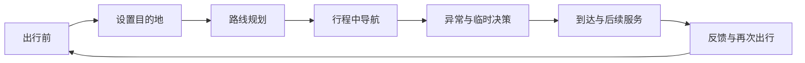
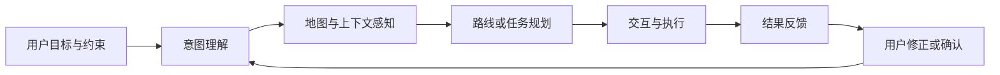

## 「校招」腾讯｜地图 AI 产品经理培训生

这是一份面向腾讯地图导航 AI 方向的产品经理培训生岗位。岗位核心是从用户体验角度重新设计导航场景，参与把导航从路径工具发展为能够理解意图、主动提供帮助并具备连续交互能力的出行助手。

本文先整理用户提供的岗位原文，再把职责翻译成产品工作、能力证据和面试准备问题。材料包含产品方向、岗位要求、面试方式和招聘部门，但没有提供招聘批次、职位 ID、薪酬、实际办公城市或具体汇报关系；以下内容不作补写。

!!! info "素材说明"
    本文根据用户提供的腾讯地图 AI 产品经理培训生岗位信息整理。

    原文岗位名称为“AI 产品经理培训生”，产品方向为腾讯地图导航 AI，招聘部门和工作地字段显示“CSIG 云与智慧产业事业群”，面试方式为远程面试。

    “培训生”是本文归入「校招」的依据，但用户提供的材料未明确写出校招批次或毕业年份；具体招聘类型仍应以官方招聘页面为准。

## 岗位信息

| 项目 | 原文信息 |
| --- | --- |
| 公司与产品 | 腾讯；腾讯地图 |
| 岗位名称 | AI 产品经理培训生 |
| 产品方向 | 导航 AI、导航 Agent、AI Buddy |
| 岗位类别 | 产品 |
| 面试方式 | 远程面试 |
| 招聘部门和工作地字段 | CSIG；云与智慧产业事业群 |
| 未提供的信息 | 招聘批次、职位 ID、薪酬、实际办公城市、汇报关系 |

## 原始 JD

以下内容按用户提供的岗位文字整理，仅对标题和排版做结构化处理。

### 岗位描述

> 下一代 AI Buddy，由你定义！

导航是腾讯地图 APP 核心的功能和场景，导航 Agent 作为导航的大脑，承担了将导航从工具变成有思考能力、具备人格、情感的日常出行助手的重要职责。导航 Agent 除了能更智能地理解用户意图、精准完成用户指令外，更重要的是要能主动思考和识别用户还未曾明确的需求，做真正“聪明”的导航。

当前市场上还没有一家形成真正“智能化导航”用户心智的产品，腾讯地图导航在 2024 年 AI 开始爆发阶段就组建了导航 AI 研发团队，已经完成了初步的 AI 架构设计开发，初步完成了感知、规划、交互链路的设计开发。

现在需要对导航和 AI 感兴趣的年轻产品同学参与进来，从用户体验角度来整体设计导航各个场景和环节的用户智能化需求，并和团队一起实现。

### 岗位要求

1. 教育背景：计算机科学、地理信息科学、数学、统计学等相关专业优先；
2. 熟练掌握 Axure、Sketch 等产品设计工具；熟悉大模型技术原理和应用场景，了解地图数据处理、算法优化等相关技术；具备良好的数据处理和分析能力，熟练使用 SQL、Python 等数据分析工具，能够从数据中发现问题并提出解决方案；
3. 能力素质：具备敏锐的市场洞察力和用户需求分析能力，能够准确把握市场趋势和用户痛点；具有较强的创新能力和解决复杂问题的能力，能够在快速变化的环境中推动产品创新和发展；
4. 其他要求：对大模型技术在地图领域的应用充满热情；具备良好的学习能力和适应能力，能够快速掌握新知识和技能，适应不断变化的工作需求。

### 面试与招聘信息

- 参加面试的城市：远程面试
- 招聘部门和工作地：CSIG；云与智慧产业事业群

## JD 明确写了什么

| 维度 | JD 明确信息 | 可以确认的信号 |
| --- | --- | --- |
| 产品场景 | 腾讯地图导航 | 产品工作发生在出行和导航这一高频场景 |
| AI 形态 | 导航 Agent、AI Buddy | 重点是持续交互和场景智能，不只是单次问答 |
| 用户价值 | 理解用户意图、完成指令、识别未明确需求 | 需要同时设计被动响应和主动服务 |
| 产品工作 | 从用户体验角度整体设计各场景和环节的智能化需求 | 需要参与场景定义、交互设计和体验落地 |
| 技术协作 | AI 架构、感知、规划、交互链路已初步设计开发 | 产品经理需要与 AI 研发团队共同推进，而非只做界面 |
| 专业偏好 | 计算机科学、地理信息科学、数学、统计学 | 偏好技术、空间信息和数据分析背景 |
| 工具能力 | Axure、Sketch、SQL、Python | 同时要求原型设计与数据处理能力 |
| 技术理解 | 大模型原理与应用、地图数据处理、算法优化 | 需要理解 AI 能力怎样进入地图产品流程 |
| 招聘信息 | 产品；AI 产品经理培训生；CSIG 云与智慧产业事业群 | 岗位属于产品方向，具体招聘批次仍需核验 |

## 先下判断：它是什么岗位

这份 JD 更接近**导航场景的 AI 应用产品经理培训生岗位**。产品经理需要围绕地图导航的真实出行任务，定义 Agent 应该理解什么、主动做什么、怎样与用户交互，以及如何通过数据判断体验是否变好。

岗位的核心责任可以概括为四点：

1. **重构导航场景**：从用户出行任务出发，寻找路线规划、途中决策和到达后服务中的智能化机会。
2. **设计 Agent 机制**：定义意图理解、主动识别、任务执行、交互反馈和用户控制之间的关系。
3. **连接 AI 与地图能力**：把大模型、地图数据、算法能力和导航流程组合成用户可理解、可使用的产品体验。
4. **用数据推动迭代**：通过 SQL、Python 和用户反馈发现问题，验证方案效果并推动持续优化。

它不是单纯的地图功能产品岗，也不是模型训练岗位。候选人需要具备足够的技术理解，参与模型和地图能力的产品化，但具体算法研发边界要结合团队分工确认。

## 把职责翻译成日常工作

### 1. 梳理导航全场景的用户任务

JD 要求“整体设计导航各个场景和环节的用户智能化需求”。这意味着产品经理需要从一次完整出行，而不是单个页面出发理解用户：

可以研究的问题包括：

- 用户如何表达目的地、时间、偏好和同行条件？
- 用户只给出模糊目标时，导航需要询问哪些约束？
- 路线推荐除了距离和时间，还需要理解哪些个人偏好？
- 行程中发生堵车、道路变化、临时停靠或目的地变更时，谁来决定下一步？
- 用户在驾驶、步行或骑行时，适合接收什么形式的提醒？
- 到达目的地后，哪些服务仍然属于本次出行任务？

以上是从 JD 提炼的场景研究问题，不代表腾讯地图已经确认采用这些功能。面试时应从一个具体出行任务切入，说明用户、约束、AI 介入点和失败处理。

### 2. 设计意图理解与主动服务

JD 将“更智能地理解用户意图、精准完成用户指令”和“识别用户还未曾明确的需求”同时列为目标。两者的产品设计重点不同：

| 任务类型 | 产品需要解决的问题 | 关键风险 |
| --- | --- | --- |
| 明确指令 | 正确理解用户说了什么，并调用合适的地图能力完成任务 | 目的地、时间、交通方式或约束理解错误 |
| 隐含意图 | 从上下文和当前出行状态推断用户可能需要什么 | 过度打扰、误判意图或替用户做决定 |
| 主动提醒 | 在合适时机提供路线、风险或服务建议 | 时机不当、信息过载或影响驾驶安全 |
| 连续任务 | 记住前后文，持续支持一段完整出行 | 上下文错误、状态丢失或无法撤销 |

产品经理需要给主动能力设置清晰边界：什么情况下可以主动提示，什么情况下只能等待用户确认；哪些动作可以自动执行，哪些动作必须二次确认；用户如何关闭、修改或撤销主动服务。

### 3. 设计 AI Buddy 的人格与情感表达

JD 提到具备人格、情感的日常出行助手，但没有规定具体人格风格。产品设计不能只停留在语气和拟人化文案，还需要明确人格表达服务什么用户价值：

- 是否帮助用户更快理解路线和风险？
- 是否在复杂或紧张的出行情况下提供更清晰的安抚和选择？
- 是否根据用户偏好调整表达方式，而不改变事实和安全提示？
- 是否让用户知道哪些内容来自地图数据、哪些是模型生成的建议？
- 用户能否关闭人格化表达，切换为简洁、直接的导航模式？

人格和情感不能替代路线准确性、信息时效性和用户控制。尤其在导航场景中，产品应优先保证信息清楚、反馈及时和操作安全。

### 4. 与 AI 研发团队共同实现

原文提到导航 AI 研发团队已初步完成 AI 架构、感知、规划和交互链路的设计开发，产品经理需要参与把这些能力转成可使用的场景方案：

协作时需要对齐：

- 模型或算法能读取哪些地图数据和用户上下文？
- 感知结果、规划结果和交互输出分别由谁负责？
- Agent 是否可以直接改变路线、发起操作或调用外部服务？
- 哪些结果需要规则校验、地图数据校验或人工兜底？
- 模型不确定、数据缺失或服务不可用时，用户看到什么？
- 如何记录版本、日志和用户反馈，支持 Badcase 复现？

产品经理不需要代替算法团队实现模型，但需要能把用户问题翻译为任务定义、输入输出、验收标准和失败案例。

### 5. 用 SQL 和 Python 分析体验问题

JD 明确要求熟练使用 SQL、Python 等工具，并能够从数据中发现问题和提出解决方案。导航 AI 产品的数据分析可以覆盖：

- 用户指令或意图的类型分布
- 关键任务的完成率、改写率和重复询问率
- 推荐路线被采纳、切换和取消的情况
- 主动提醒的触达、查看、忽略和关闭情况
- 不同交通方式、时间段、地域或场景下的效果差异
- 模型或策略版本上线前后的体验变化
- 用户反馈、投诉和典型 Badcase 的分布

一个完整的分析任务可以按“问题—样本—指标—原因—方案—验证”展开：

| 环节 | 需要说明的内容 |
| --- | --- |
| 问题 | 哪个导航任务或用户环节出现了异常 |
| 样本 | 数据来自哪些用户、场景、时间和版本 |
| 指标 | 如何定义理解正确、任务完成和体验改善 |
| 原因 | 是意图识别、地图数据、规划逻辑、交互还是执行失败 |
| 方案 | 调整模型、Prompt、规则、数据、流程或交互 |
| 验证 | 如何离线评测、灰度测试和跟踪线上反馈 |

JD 没有提供具体指标口径。候选人不应自行把某个通用指标说成团队的考核标准，面试时应先确认业务目标和数据定义。

## 产品问题一：什么才是“智能化导航”

“智能化导航”不是把聊天框加到地图里。判断一个场景是否值得 Agent 化，可以从六个问题开始：

1. 用户要完成的出行任务是什么？
2. 任务中有哪些需要理解上下文、比较选项或连续决策的步骤？
3. 地图数据、实时信息和其他工具能提供哪些可靠输入？
4. 哪些结果可以验证，哪些判断必须交给用户？
5. Agent 主动介入会减少什么成本，是否会增加打扰或风险？
6. 出错时用户如何理解、纠正、撤销和恢复？

适合 Agent 的场景通常需要一定的上下文和连续步骤，但如果一个动作已经可以通过清晰的按钮快速完成，强行改成对话未必会改善体验。

## 产品问题二：主动服务如何避免打扰

导航是实时场景，主动服务的价值和风险都很高。产品方案至少要定义：

| 设计问题 | 需要明确的边界 |
| --- | --- |
| 触发条件 | 哪些状态、事件或用户信号允许触发主动建议 |
| 触发时机 | 出行前、行程中还是到达后；是否避开复杂驾驶操作 |
| 建议内容 | 提供信息、推荐选项还是直接执行动作 |
| 用户控制 | 是否可关闭、延后、修改约束或撤销操作 |
| 置信度 | 不确定时如何表达，不把推测说成事实 |
| 失败处理 | 数据过期、路线变化、模型错误或服务不可用时如何降级 |

候选人可以用一个具体案例回答“你会不会让导航主动提醒用户”，先说明用户任务和触发信号，再讨论收益、打扰成本、误判风险和兜底方式。

## 产品问题三：地图数据与大模型如何分工

地图导航不能只依赖模型生成。对于路线、道路、位置和实时交通等事实性内容，产品需要考虑数据来源、时效和校验机制。一个可讨论的分工框架是：

- 地图数据和专业算法提供结构化事实、空间关系和计算结果。
- 大模型负责理解自然语言、整理上下文、生成解释或协调多步交互。
- 规则和校验机制约束高风险动作、事实一致性和输出格式。
- 用户确认和反馈处理不确定需求、偏好变化和特殊情况。

这只是产品分析框架，不是对腾讯地图现有技术架构的描述。实际模型、地图服务和算法边界需要向团队确认。

## 产品问题四：如何评估导航 Agent

导航 Agent 的评估不能只看对话是否自然，还要覆盖任务完成、信息正确、体验打扰和行程安全等维度：

| 目标 | 指标候选 | 需要避免的误判 |
| --- | --- | --- |
| 理解用户意图 | 意图识别准确率、澄清后正确率、改写率 | 用户继续对话不等于理解正确 |
| 完成导航任务 | 任务完成率、路线采纳率、重试率、人工接管率 | 生成了回复不等于完成任务 |
| 路线与地图事实 | 路线正确率、数据时效性、异常发现率 | 语言表达自然不等于地图事实正确 |
| 主动服务质量 | 建议采纳率、关闭率、误触发率、打扰投诉 | 触达量高不等于主动服务有价值 |
| 交互体验 | 首次响应时延、完整任务时长、用户满意度 | 平均时延可能掩盖关键场景长尾 |
| 系统成本与稳定性 | 调用成本、服务可用性、降级成功率 | 单次调用便宜不等于整体体验成本低 |

最终指标应根据具体任务选择。高风险或实时导航场景还需要明确事实校验、降级、用户确认和安全审查机制。

## 能力匹配：培训生需要证明什么

### 用户研究与场景建模

准备一个真实的地图、出行、效率工具或复杂任务产品案例，说明：

- 用户在什么情境下遇到问题
- 用户的明确目标、隐含约束和关键决策是什么
- 如何把完整任务拆成多个场景和流程节点
- 哪个环节适合 AI 介入，为什么不在其他环节介入
- 如何通过访谈、观察、日志或反馈验证判断

### AI 与地图技术理解

岗位要求了解大模型原理、地图数据处理和算法优化。候选人可以准备：

- 大模型在意图理解、任务拆解、信息组织和交互生成中的适用边界
- 地图数据的结构化特点、时效性和可能的质量问题
- 模型、规则、检索、地图服务和用户确认如何组合
- 模型输出错误时，如何区分模型、数据、策略和交互原因
- 为什么某个场景需要模型，什么情况下使用确定性规则更可靠

不需要把回答变成算法实现细节，但不能只停留在“接入大模型就更智能”。

### 原型与产品设计工具

Axure、Sketch 是 JD 明确提到的工具。准备作品时应展示：

- 用户流程、状态变化和关键交互节点
- Agent 思考或执行过程如何向用户反馈
- 主动建议、确认、拒绝、撤销和异常状态
- 不同场景下的简洁模式与详细模式
- 设计方案如何与数据、地图能力和技术约束对应

### 数据分析与工具能力

可以准备一个 SQL 或 Python 分析案例，说明：

- 数据表或数据集如何定义，样本如何筛选
- 指标口径、分组维度和异常检查方法
- 如何从数据发现问题并提出产品或策略方案
- 如何验证方案效果，如何处理数据不足或口径变化
- 本人独立完成了哪些部分，结论是否可复现

### 创新与复杂问题解决

“创新”不等于提出一个拟人化功能。更有说服力的案例应说明：

- 复杂问题由哪些相互影响的因素组成
- 如何在用户价值、技术可行性、风险和成本之间取舍
- 如何先做最小验证，再逐步扩大场景范围
- 方案失败后学到了什么，如何调整产品判断

## 面试准备：把 JD 转成练习题

| 练习题 | 回答应覆盖的内容 |
| --- | --- |
| 你如何理解导航 Agent？ | 用户任务、意图理解、地图能力、连续交互、主动服务和用户控制 |
| 如何把导航从工具变成 AI Buddy？ | 具体场景、用户价值、Agent 介入点、人格表达、事实边界和评估 |
| 设计一个导航主动提醒功能 | 触发条件、时机、建议内容、打扰成本、确认机制和失败兜底 |
| 用户只说“带我去一个适合晚餐的地方”，你怎么设计？ | 目标澄清、偏好与约束、候选推荐、路线规划、反馈和隐私边界 |
| 大模型和地图算法如何分工？ | 事实数据、意图理解、规划计算、生成解释、规则校验和用户确认 |
| 如何评估导航 Agent 的效果？ | 任务完成、事实准确、主动服务、时延、成本、稳定性和 Badcase |
| 你会如何分析用户频繁切换路线？ | 样本定义、分层分析、地图数据、规划逻辑、用户偏好和验证方案 |
| 模型给出了错误路线怎么办？ | 错误复现、数据与模型排查、降级、用户提示、回滚和回归评测 |
| 如何处理 AI Buddy 的人格与安全之间的关系？ | 表达服务、事实优先、风险场景、用户控制、关闭机制和透明度 |
| 为什么想做地图 AI 产品？ | 对出行场景、空间数据、AI 交互和真实用户价值的具体理解 |

## 投递前必须确认的内容

这份 JD 已明确产品方向和招聘部门，但以下内容仍需要在招聘沟通中核验：

1. **招聘类型**：该“培训生”岗位对应哪一届校园招聘，是否面向应届毕业生？
2. **实际工作地**：CSIG 和云与智慧产业事业群是组织信息，实际办公城市和办公安排是什么？
3. **产品范围**：主要负责导航 Agent、AI Buddy，还是地图中的其他 AI 场景？
4. **首个项目**：入职后优先参与出行前、行程中、到达后还是其他场景？
5. **技术边界**：产品经理参与意图理解、规划、Prompt、评测、数据和交互的哪些环节？
6. **用户对象**：主要服务驾车、步行、骑行用户，还是覆盖多种出行方式？
7. **数据权限**：可以访问哪些用户行为、地图数据和模型日志，如何脱敏和审批？
8. **评估口径**：团队当前如何定义智能化导航、任务完成、主动服务价值和用户满意度？
9. **团队协作**：产品、算法、研发、地图数据、设计和测试如何分工？
10. **培养机制**：培训生的导师、轮岗、定岗和考核方式是什么？

## 适合什么样的候选人

这份岗位更适合以下候选人：

- 对地图、导航、出行和大模型产品有持续兴趣，能够从真实任务而非功能清单出发思考
- 具备用户需求分析和复杂场景拆解能力，能发现明确需求之外的约束和机会
- 熟悉 Axure、Sketch 等原型工具，能把 Agent 流程、状态和异常做成可讨论的方案
- 掌握 SQL、Python 或同等数据分析能力，能用数据验证体验问题和产品假设
- 理解大模型、地图数据和算法能力的边界，能与研发团队使用准确语言协作
- 能在快速变化的 AI 环境中学习新知识，并把学习结果转成产品判断

如果候选人只强调“给地图加一个聊天机器人”，却无法说明地图数据、实时任务、主动打扰、用户控制和效果验证，匹配度可能不足。相反，项目不一定来自地图领域，只要能完整展示用户问题、复杂流程、AI 介入、数据验证和本人贡献，也可以证明迁移能力。

## 结论

这份 JD 的核心是参与设计导航 Agent 的用户体验，让地图导航更好地理解用户意图，在合适的场景提供主动帮助，并与 AI 研发团队共同把能力落地。岗位判断可以收束为四句话：

1. **岗位类型**：腾讯地图 AI 产品经理培训生岗位，本文按“培训生”归入「校招」，具体批次需核验。
2. **产品对象**：导航 Agent、AI Buddy 以及导航各个场景和环节的智能化体验。
3. **能力重点**：用户场景分析、原型设计、大模型与地图技术理解、SQL／Python 数据分析和复杂问题解决。
4. **工作方式**：与 AI 研发及相关团队协作，从用户体验出发设计、验证和迭代产品方案。

岗位的真实工作边界仍取决于首个项目、团队分工、数据权限和评估口径。以上材料未说明的内容，应以腾讯官方招聘页面和招聘沟通为准。

## 相关阅读

-   [产品经理岗位类别](../product-manager-types/index.md)：按技术对象、服务对象和结果责任理解产品经理方向
-   [「校招」字节跳动｜产品经理 - 业务中台](bytedance-business-platform-pm.md)：中台、数据策略与业务场景产品岗位的 JD 拆解
-   [「校招」字节跳动｜开发者 AI 产品经理](bytedance-developer-ai-pm.md)：开发者 AI 产品的场景、模型边界和评测分析
-   [AI 产品经理](../positions/ai-pm.md)：AI 产品经理的职责结构与面试前核验清单
-   [评估与评测](../../ai/evaluation.md)：模型、Agent 和产品效果的评估方法
-   [数据分析入门](../../pm/data-analysis.md)：从指标、样本到结论的数据分析基础

## 来源说明

-   岗位名称、产品方向、岗位描述、任职资格、面试方式和招聘部门：用户提供的腾讯地图 AI 产品经理培训生岗位信息。
-   原文明确提到腾讯地图导航、导航 Agent、AI Buddy、CSIG 和云与智慧产业事业群；本文据此命名，不补写具体职位 ID、薪酬、办公城市或汇报关系。
-   本文按“培训生”岗位名称归入「校招」；用户提供的材料未明确写出校招批次或毕业年份，具体招聘类型以官方招聘页面为准。
-   本文中的场景、流程、指标、面试问题和能力分析属于基于 JD 的站内解读，不代表腾讯对岗位的额外承诺。
