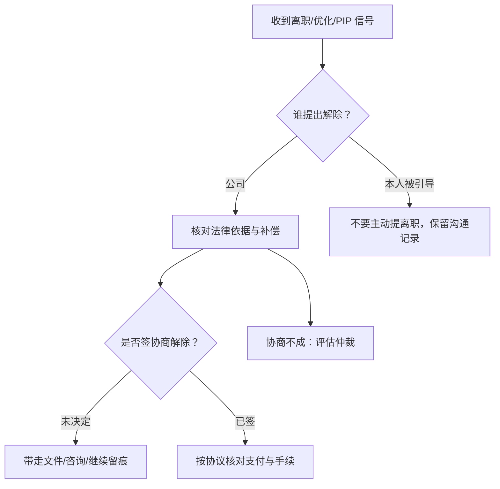
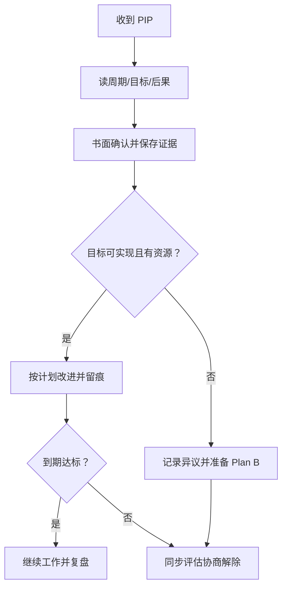
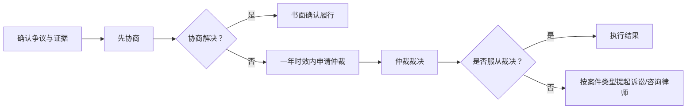
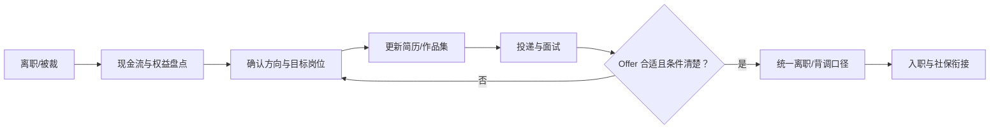

## 裁员、PIP 与劳动权益:AI 从业者的自我保护

「被裁」是当前就业环境下的真实风险,不只在 AI 行业。本页写给两类人:正在经历裁员、PIP、竞业限制、试用期考核的人;以及想提前把这些规则搞清楚、避免踩坑的人。

???+ warning "法规免责声明"
    本页涉及中国的劳动法律法规与常见实践,仅供信息参考,**不构成法律意见**。具体条款以《中华人民共和国劳动合同法》《中华人民共和国劳动合同法实施条例》等现行有效版本与当地规定为准;涉及金额、时限、仲裁与诉讼策略时,建议咨询当地人社部门、劳动仲裁机构或执业律师。

## 先分清:裁员、优化与离职话术

-   **裁员(Layoff)**:公司因经营需要缩减人力,与你个人能力无关。法律上的「经济性裁员」有法定情形(依《劳动合同法》第四十一条),但现实中「裁员」二字经常被公司回避
-   **优化 / 末位淘汰**:公司口径里的「优化」常是裁员的委婉说法。「末位淘汰」本身在中国劳动法下**不是合法的解除理由**——绩效考核末位不等于「不能胜任工作」,直接以此解除大概率构成违法解除
-   **协商解除**:公司与你谈「好聚好散」,签协议解除劳动关系。这是最常见的现实路径,给的钱往往介于 N 与 N+1 之间(也可能更多),但协议一签通常放弃后续追偿
-   **主动离职**:你提离职(或「被引导」提离职),没有经济补偿。**被裁时别主动提离职**——一旦书面提出离职,维权空间基本归零
-   **试用期劝退 / 转正失败**:试用期内公司以「不符合录用条件」解除。公司要承担举证责任,见 [三方协议与试用期](#三方协议与试用期校招向)

一句话:**HR 用什么词不重要,关键看「谁提出的解除」「解除的法律依据是什么」「给了多少补偿」**。这三个要素决定你接下来能主张什么。

核心关系是：先识别解除主体和法律依据，再在签字前核对补偿、证据与后续维权路径。

## 裁员现实:行业节奏与信号识别

### 行业裁员的普遍节奏

AI 行业的裁员往往跟着资本周期与业务重心走:

-   **融资收紧**:VC 减少投入 → 公司砍非核心业务线、压缩成本,裁员是第一刀
-   **业务重心转移**:大模型从「拼参数」转向「拼落地」,烧钱探索型团队被合并或裁撤,与商业化直接挂钩的团队相对安全
-   **组织调整(reorg)**:部门合并、汇报线重排、HC 冻结,往往先于裁员到来
-   **大厂 vs 创业公司**:大厂多为「优化」局部业务线,给 N+1 相对规范;创业公司可能拖补偿、劝你主动离职、甚至欠薪

### 被裁的信号识别

信号往往提前一两个季度出现,越早识别越主动:

-   **业务线收缩**:你所在的业务线停止投入、预算削减、重点项目被砍、对外声音消失
-   **招聘冻结与人员流出**:HC 冻结、同事陆续离职不补、核心成员被调走
-   **组织调整**:团队并入其他部门、汇报线频繁变动、你的岗位在重组后变得「没有明确职责」
-   **绩效与 PIP**:突然被给低绩效、被约谈 PIP、绩效沟通中「铺垫」你的不足,见 [PIP](#pip绩效改进计划意味着什么)
-   **资源变化**:不再给你分配新项目、把你调离核心工作、座位/工位调整、资产收回
-   **消息面**:公司财报、融资新闻、行业媒体曝出降本增效;内网流传裁员传闻

识别到信号后的动作:**不恐慌、不摆烂、不提前裸辞**。先更新简历、梳理作品集、接触外部机会,同时把手头工作正常做完——「正在找工作」和「工作敷衍」是两件事,前者是被裁后最需要的姿态。

### 裁员流程:从约谈到签字会经历什么

把流程走一遍,心里有底,现场才不慌:

1.  **约谈通知**:HR(常带直属 leader 或法务)约你一对一面谈,大概率当天谈完当天走。谈话可能被录音,保持冷静,少说多听
2.  **告知方案**:HR 讲「业务调整/组织优化」理由与补偿方案(常见口径是 N+1)。先听完,别当场答应也别当场翻脸
3.  **签署协议**:给一份《协商解除劳动合同协议书》或《离职证明》。**当场签字不是义务**,你可以要求把文件带走/拍照、咨询后再签
4.  **交接与离职**:交接工作、交还设备、办理离职手续、拿离职证明、确认社保停缴时间
5.  **善后**:结算工资与补偿、确认年假折算、确认竞业是否启动;如需维权,进入仲裁流程

关键原则:**任何文件,看清楚、想清楚、谈清楚再签**。谈判筹码在签字前最大,签完协议再想改就难了。

### 裁员 vs 优化 vs 离职:话术背后的含义

| 公司口径 | 常见场景 | 你该关注什么 |
| --- | --- | --- |
| 裁员 / 业务调整 | 经济性裁员、业务线裁撤 | 是否属于法定裁员情形、补偿是否 N+1、是否集体裁员(需报备) |
| 优化 / 结构优化 | 绩效末位、成本压缩 | 是否借「优化」规避赔偿;末位 ≠ 可无条件解除 |
| 协商解除 | 给一笔补偿、签协议走人 | 补偿金额、协议条款、是否限制你再就业 |
| 主动离职 / 自己考虑下 | 公司想让你走但不想赔 | 千万别主动提;提出即放弃经济补偿 |
| 试用期不符合录用条件 | 试用期劝退 | 公司须证明你不符合录用条件,否则属违法解除 |

## PIP:绩效改进计划意味着什么

### PIP 是什么

PIP(Performance Improvement Plan,绩效改进计划)是公司给「绩效不达标」员工的一份书面改进计划:设定改进目标、时间周期(通常 1-3 个月)、考核节点,到期评估是否达标。

### 被 PIP 意味着什么

-   **两种可能**:真改进机会(公司想留你、给你路径),或辞退前置程序(公司想让你走,用 PIP 走流程、留证据)
-   **多数情况下是后者**:PIP 被普遍用作「劝退倒计时」。公司借 PIP 记录「你不胜任」,为后续解除做铺垫
-   **区分方法**:看目标是否可实现、是否有资源支持、你的绩效记录是否真的差、是否同时有其他人被 PIP。目标离谱(不可能达成)往往是「假 PIP」
-   **法律意义**:依《劳动合同法》第四十条,「不能胜任工作,经过培训或者调整工作岗位,仍不能胜任工作」的,公司可解除(付 N+1)。PIP 是公司证明「不能胜任 + 培训/调岗」的手段之一;但 PIP 本身不是法律概念,公司不能仅凭「PIP 不通过」直接合法解除

### 应对策略

核心关系是：PIP 既可能是改进机会也可能是解除前置程序，应在正常履职的同时留存证据并准备职业与协商方案。

1.  **了解规则**:拿到 PIP 文件先读条款——周期、目标、考核标准、达成与否的后果;不签字也不一定有用,但要留下「我读过且不认可不合理目标」的记录
2.  **留存证据**:保存 PIP 文件、绩效记录、工作产出、考勤与沟通记录;保留邮件与书面沟通,重要谈话可事后书面确认(「按我们 X 日沟通,我的目标是……,对吗」)
3.  **评估去留**:一边按 PIP 要求正常努力(别给人把柄),一边开始看机会。PIP 周期就是你找工作的缓冲期
4.  **谈离职方案**:如果判断公司去意已决,主动谈「协商解除」比被动等 PIP 到期更有利——争取 N+1(或更高)、社保衔接、离职时间,见 [法定权益](#法定权益中国n1-与协商解除)
5.  **守住底线**:不主动提离职、不签空白文件、不在情绪下做任何书面承诺

#### PIP 应对清单

| 时间点 | 要做的事 | 别做的事 |
| --- | --- | --- |
| 收到 PIP 时 | 通读条款、记录异议点、保存原件 | 当场签「认账」文件、情绪化回复 |
| PIP 期间 | 按目标尽力完成、留存产出与沟通记录 | 摆烂、公开抱怨、放弃治疗 |
| 每周 | 邮件/书面确认目标与进展,留痕 | 只口头对齐,不留任何书面 |
| 约谈前后 | 录音或事后书面确认谈话要点 | 当场做任何口头承诺 |
| PIP 到期 | 复盘结果,判断去留,谈方案 | 被动等通知、不准备 Plan B |

## 法定权益(中国):N+1 与协商解除

???+ warning "以法规为准"
    本节为常见口径的说明,**具体金额与适用情形以《劳动合同法》及地方规定为准**。涉及大额补偿或复杂情形,建议咨询劳动仲裁机构或律师。

### N+1 经济补偿金的算法

「N+1」是通俗说法,由两部分组成:

-   **N(经济补偿金,依《劳动合同法》第四十七条)**:按劳动者在本单位工作的年限,每满一年支付一个月工资;六个月以上不满一年的,按一年计算;不满六个月的,支付半个月工资
-   **1(代通知金)**:公司**没有提前 30 天书面通知**就解除劳动合同时,额外支付一个月工资作为代替(依《劳动合同法》第四十条)。提前 30 天通知的,不需要这份「1」
-   **月工资口径**:劳动合同解除或者终止前十二个月的平均应发工资(含奖金、津贴等货币性收入,各地口径略有差异);月工资高于当地上年度职工月平均工资三倍的,按三倍封顶,且支付年限最高不超过十二年
-   **举例**:工作 2 年 8 个月、前 12 个月平均月薪 2 万,公司未提前 30 天通知解除 → N = 3 个月工资(2 年 8 个月按 3 年算),加 1 个月代通知金,合计 4 个月工资;若提前 30 天通知,则合计 3 个月工资

### 违法解除的 2N

-   **2N(赔偿金,依《劳动合同法》第八十七条)**:用人单位违法解除或者终止劳动合同,应当按经济补偿标准的**二倍**向劳动者支付赔偿金
-   **常见违法情形**:没有法定解除理由、程序不合法(如未提前通知工会)、以「末位淘汰」「优化」直接解除、试用期随意解除等
-   **N 与 2N 的关系**:赔偿金(2N)与补偿金(N)**不能同时主张**。是「合法解除但应补偿」还是「违法解除应赔偿」,由解除的理由与程序决定
-   **仲裁时效**:劳动争议申请仲裁的时效期间为一年,从知道或应当知道权利被侵害之日起计算

#### 常见解除情形与补偿一览

| 解除情形 | 提出方 | 常见补偿 | 说明 |
| --- | --- | --- | --- |
| 协商解除(公司提出) | 公司 | N | 金额可谈,常见 N、N+1 或更高 |
| 协商解除(员工提出) | 员工 | 无(除非另有约定) | 主动提离职没有经济补偿 |
| 经济性裁员 | 公司 | N 或 N+1 | 需符合法定情形并履行程序 |
| 不能胜任经培训/调岗仍不胜任 | 公司 | N+1 | 未提前 30 天通知时 |
| 医疗期满不能从事原工作 | 公司 | N+1 | 未提前 30 天通知时 |
| 严重违纪(依规章制度) | 公司 | 无 | 公司须证明违纪事实与制度依据 |
| 违法解除 | 公司 | 2N | 可主张赔偿金;或选择要求继续履行合同 |
| 试用期不符合录用条件 | 公司 | 无 | 公司须证明不符合录用条件 |

-   **「N+1」里的「1」是代通知金**,只在未提前 30 天书面通知时才有;公司提前通知或员工被协商解除时,通常就是 N 或谈定金额
-   **税前还是税后**:经济补偿在当地上年职工平均工资三倍数额以内的部分,免征个税(以现行税法为准);超出部分并入收入计税

### 协商解除与协议签署注意

现实中大多数「被裁」以协商解除收场。签协议前逐条核对:

-   **补偿金额**:是 N、N+1、还是更高(裁员背景下谈 2N 较难,但可争取 N+1 以上的「诚意金」「关怀金」)
-   **支付时间与方式**:补偿何时到账、税前还是税后、是否分期(尽量一次性)
-   **放弃条款**:协议里常见的「双方再无其他争议」意味着签后难再追偿,对金额不满先谈好再签
-   **未休年假 / 加班费**:未休的年休假应折算工资;如有加班费争议一并谈清
-   **离职时间与社保**:离职日期、当月社保由谁缴纳、离职证明出具时间,见 [求职自我保护](#求职自我保护)
-   **竞业限制**:协议是否触发竞业限制、竞业补偿怎么算,见 [竞业协议](#竞业协议)

### 失业保险金领取

-   **领取条件**:缴纳失业保险费满一年、非因本人意愿中断就业(被裁属于;主动辞职通常不符合)、已办理失业登记并有求职要求
-   **标准与期限**:各地不同,一般与缴费年限挂钩,最长不超过 24 个月;具体金额以当地人社部门公布为准
-   **别错过**:被裁后及时办理失业登记,别因「嫌麻烦」或「怕影响找下一份工作」放弃;领取失业保险金不影响你找新工作
-   **社保衔接**:失业保险金领取期间,部分地区由失业保险基金代缴医保;新工作入职后停止领取

### 劳动仲裁与维权路径(知道流程再决定要不要走)

核心关系是：先用证据协商，协商不成在仲裁时效内行动，再根据裁决结果权衡执行、诉讼和时间成本。

-   **先协商,再仲裁**:大多数争议在协商阶段解决;协商不成再启动仲裁。仲裁不收费,但耗时(通常数个月),且会与公司对簿
-   **申请仲裁**:向用人单位所在地或劳动合同履行地的劳动人事争议仲裁委员会申请;时效一年,从知道权利被侵害之日起算
-   **材料**:申请书、身份证明、劳动合同、工资流水、解除/离职证明、沟通记录(邮件、聊天记录、录音)等证据
-   **对裁决不服**:可向人民法院提起诉讼(一审);部分案件一裁终局。涉及金额不大时,权衡时间成本与结果
-   **请律师**:金额较大或情形复杂的,值得付费咨询;劳动仲裁法律援助/工会法律服务在部分地区可申请

## 竞业协议

### 竞业限制是什么

竞业限制(竞业禁止)是约定劳动者离职后**一定期限内不得去竞争对手或自营竞争业务**的协议。法律上它并非对所有员工有效:

-   **适用人员有限定**(依《劳动合同法》第二十四条):限于**高级管理人员、高级技术人员和其他负有保密义务的人员**。普通执行岗位被随意塞竞业条款,效力存疑
-   **期限限制**:竞业限制期限**不得超过二年**
-   **必须有补偿**:用人单位在竞业限制期限内应当**按月给予经济补偿**;不付补偿,劳动者可主张解除竞业限制

### 怎么判断是否有效

-   **你是否属于限定人员**:普通岗位、不接触核心商业秘密的员工,竞业条款很可能被认定无效或可主张不履行
-   **补偿是否到位**:未约定补偿标准的,司法实践中常见按劳动合同解除前十二个月平均工资的 **30%** 按月支付(且不低于当地最低工资标准,以司法解释与地方口径为准)。**公司只约束不付钱,你可以不遵守,或发函要求支付补偿或解除竞业**
-   **范围是否合理**:竞业范围(地域、业务、期限)明显过宽的,超出部分可能无效
-   **是否口头说说**:只有口头承诺、没签书面竞业协议、也没约定补偿的,约束力弱

### 入职新公司前怎么核查

-   **翻劳动合同与补充协议**:入职时签的合同、保密协议、竞业协议里有没有竞业条款;有的公司写在入职文件角落里
-   **离职时问清**:HR/法务是否启动竞业限制(是否发「竞业限制履行通知」)、是否按月支付补偿。**公司没启动就不受限制**
-   **判断新公司是否竞争关系**:看两家公司业务是否构成直接竞争、你将要做的方向是否踩线;模糊地带先咨询律师
-   **别主动暴露**:面试新公司时不必主动透露前公司的竞业条款,但若新公司背调/问询,如实说明自己未被启动竞业即可

### 违约风险

-   **违约金**:违反竞业限制的违约金由双方约定,金额可能很高;公司还可要求你返还已支付的竞业补偿
-   **对前公司的义务**:竞业限制是离职后义务,即使前公司没付补偿,也建议先书面催告,而不是直接违约,避免被动
-   **权衡**:被起诉的风险、金额、与「新机会」的价值对比;拿不准时花点钱咨询劳动法律师,比事后应诉便宜

#### 签署/履行竞业协议前检查清单

-   **你属于哪类人**:高级管理、高级技术、其他负有保密义务;普通岗位被塞竞业条款,先打问号
-   **范围是否写清**:竞业的公司名单、业务范围、地域、期限;「全部同行」这类过宽表述可主张无效
-   **补偿怎么付**:金额、支付方式(按月)、支付主体;公司不按月付补偿,你有解除/抗辩空间
-   **启动条件**:离职时是否书面启动;没收到启动通知,通常视为不履行
-   **违约后果**:违约金金额、返还补偿条款;金额过高可请求调低
-   **是否覆盖新机会**:先判断新公司与前公司是否构成竞争关系,再决定是否履行

## 三方协议与试用期(校招向)

### 三方协议与违约金

-   **三方协议是什么**:毕业生、学校、用人单位三方签订的就业协议(就业协议书),约定毕业后到用人单位报到入职。它不是劳动合同,入职签劳动合同后,三方协议的效力由劳动合同承接
-   **违约金**:三方协议中常约定违约金(如「违约不去入职赔 X 元」)。法律上三方协议适用民事规则,违约金应合理;明显过高的,法院/仲裁通常支持调低。**违约金 ≠ 补偿金**,方向别搞反
-   **违约场景**:「签了三方又不去」「签了又撕毁」可能被主张违约金;但若用人单位违约(不录用、撤销 offer),你可主张其承担违约责任
-   **试用期与三方关系**:入职后以劳动合同为准,三方协议不再约束双方劳动关系

### 试用期时长与工资

-   **时长上限**(依《劳动合同法》第十九条):合同期限三个月以上不满一年的,试用期不超过一个月;一年以上不满三年的,不超过二个月;三年以上固定期限或无固定期限的,不超过六个月;以完成一定工作任务为期限或合同期限不满三个月的,不得约定试用期。**同一用人单位与同一劳动者只能约定一次试用期**
-   **工资下限**(依《劳动合同法》第二十条):试用期工资不得低于本单位相同岗位最低档工资或劳动合同约定工资的 **80%**,并不得低于当地最低工资标准
-   **试用期计入合同期**:试用期包含在劳动合同期限内;只在试用期签「试用期合同」而不签正式合同是不合规的

### 试用期被裁的权益

-   **公司要举证**:试用期解除须证明劳动者**不符合录用条件**(录用条件应事先明确、公示);不能证明就解除的,构成违法解除
-   **你可以主张**:违法解除的赔偿金(2N,试用期通常金额不大但性质重要);公司也须结清工资、出具离职证明
-   **别被「试用期不合格」PUA**:要求明确「不符合哪条录用条件、依据是什么」;不合理的「不合格」可依法主张权利

#### 试用期考核的应对

-   **入职先对齐录用条件**:把试用期考核标准(目标、指标、验收方式)落到书面或邮件,别等到考核时才被告知「没达标」
-   **过程留痕**:周报、月度复盘、产出文档留存;试用期被质疑时,用产出说话
-   **识别「变相劝退」**:试用期考核标准临时加码、目标不可实现、频繁被否定却无具体依据,可能是公司想让你「自己走」
-   **谈解除方案**:试用期被裁,仍可依法主张经济补偿(违法解除为 2N,试用期金额不大但性质重要);被要求「主动离职」时,先想清楚放弃的是什么

## 求职自我保护

### 背景调查与背调授权

-   **背调是什么**:新公司(或委托第三方)核对你简历中的教育经历、工作经历、职位、时间线、离职原因等
-   **授权原则**:正规背调会先取得你的**书面授权**,并在授权范围内调查;超出范围(如婚姻、健康等隐私信息)索取可礼貌拒绝或询问用途
-   **一致性最重要**:简历、面试、背调信息保持一致,时间线和职级别「微调」;离职原因口径统一,见 [谈薪与 Offer 选择](interviews/offer-negotiation.md)
-   **前同事联系**:背调可能联系你填写的证明人,提前打好招呼,别让人措手不及

### 离职证明

-   **公司义务**:解除或终止劳动合同时,用人单位应当出具解除或终止劳动合同的证明,写明劳动合同期限、解除/终止日期、工作岗位、在本单位的工作年限(依《劳动合同法》第五十条),并在 15 日内办理档案和社保关系转移
-   **离职证明的用处**:新公司入职、失业保险金申领、社保衔接都要用
-   **不给怎么办**:公司不出具离职证明的,你可向劳动行政部门投诉或申请仲裁;因此造成的损失(如无法入职新公司),可主张赔偿
-   **内容核实**:离职证明上的离职日期、职位、年限与你实际一致;公司写「个人原因离职」而实际是协商解除的,先沟通更正

### 社保衔接

-   **离职当月社保**:离职当月社保由谁缴,看当月是否在职(一般由最后在职单位缴到离职当月,各地实操不同);入职新公司当月/次月的起缴规则也因地而异
-   **断缴影响**:医保(断缴后报销待遇受影响,各地有缓冲期)、部分城市落户/购房/车牌资格(对连续缴纳年限有要求)、养老金(累计计算,短期断缴影响小)
-   **无缝衔接建议**:尽量让离职与入职时间衔接(如月底离职、次月初入职),或与新旧公司 HR 确认社保缴纳安排;被裁后领失业保险金期间,部分地区由失业保险基金代缴医保

## 心态与策略

### 被裁后怎么稳住

-   **先处理情绪,再处理事务**:被裁不是能力否定,是公司经营决策。给自己几天时间消化,别在情绪里做决定(尤其是「马上签协议」或「马上裸辞创业」)
-   **算清现金流**:至少留 3-6 个月生活费的缓冲;有补偿金先落袋,别等「更好的 offer 谈完」再处理
-   **建立支持系统**:和家人、朋友、信任的前同事聊聊,别一个人扛;找工作本身是消耗情绪的,有个能说话的圈子很重要
-   **把求职当项目做**:固定作息、投递节奏、复盘机制,参考 [真实感悟](../job/insights/mindset.md) 与 [入行感悟](../job/insights/newcomers.md)
-   **维护关系**:离职也要体面,前同事、leader 是下一份工作的内推资源(内推机制见求职专题相关页面)

### 怎么谈更好的离职 package

-   **心里有底再谈**:先算清自己应得的 N+1 或 2N 区间,再定谈判目标;参考 [谈薪与 Offer 选择](interviews/offer-negotiation.md) 的谈判原则
-   **谈什么**:补偿金额、支付时间、社保缴纳到几月、离职证明内容、竞业是否启动、年假折算、期权/股票的处理
-   **怎么谈**:冷静、书面留痕、不威胁、不情绪化;把「我的诉求」列成清单逐条确认;必要时说「我需要时间考虑/咨询律师」,别当场签字
-   **不要主动辞职**:公司让你走,主动权在你手里;你主动提离职,前面所有谈判筹码归零

### 下一份工作的节奏

核心关系是：先稳住现金流和劳动权益，再根据方向准备材料与求职，确认 Offer 和背调口径后完成衔接。

-   **别急着接 offer**:被裁后最容易「病急乱投医」,接到不合适的 offer 半年内又想走,简历更难看
-   **盘点自己的方向**:AI 行业岗位多,想清楚是继续同类岗位、转方向、还是进更稳的平台;参考 [岗位与 JD 简介](positions/index.md)
-   **时间窗口**:空窗期长短不是致命伤,「这段时间在做什么」才是;可以学习、复盘、做作品集,把空窗期变成叙事的一部分
-   **谈新 offer 时**:如实但不消极地解释离职原因,统一口径;背调与离职证明见 [求职自我保护](#求职自我保护)

## 常见误区与速答

-   **「公司让我走,我主动提离职也能拿补偿」** → 错。主动辞职没有经济补偿;被裁务必让公司方提出并走解除流程
-   **「PIP 就是合法的解除依据」** → 错。PIP 不是法定概念,公司不能仅凭「PIP 不通过」合法解除;要解除还得满足法定情形与程序
-   **「N+1 是法定的最高标准」** → 错。N+1 是「合法解除+未提前通知」的常见底线;违法解除可主张 2N,裁员背景也可谈更高
-   **「竞业协议签了就一定生效」** → 不一定。人员范围、补偿、期限任一环节缺失都可能被认定无效或可解除
-   **「试用期公司可以随便让我走」** → 错。试用期解除须证明不符合录用条件,否则是违法解除
-   **「签了协商解除协议还能反悔追偿」** → 基本不能。协议载明「双方再无争议」后,再追偿空间很小,所以签前谈透
-   **「领失业保险金会影响找下一份工作」** → 不影响。领取失业保险金是法定权利,与求职不冲突
-   **「被裁后要赶紧接个 offer 保底」** → 不着急。空窗期可以被合理解释,接了不合适的 offer 半年再走,简历代价更大
-   **「背调只看工作经历」** → 还要看教育经历、时间线、离职原因的一致性;口径统一比「经历完美」重要

## 相关阅读

-   [高管岗位与公司管理黑话](positions/cxo-roles.md):PIP、reorg、HC、末位淘汰等公司管理黑话的「求职者视角」
-   [谈薪与 Offer 选择](interviews/offer-negotiation.md):总包拆解、谈判原则、背调注意事项
-   [面试复盘方法论](interviews/review-methodology.md):求职过程的记录与改进
-   [大厂面试流程全览](interviews/interview-process.md):从投递到 Offer 的完整路径
-   [产品经理黑话速查](../intro/glossary.md):「总包」「HC」「备胎池」等词义确认
-   内推机制与简历/作品集:求职专题下对应专页(合并后可见),与本文互链

## 来源说明

-   **法规类**(以官方发布为准,引用日期 2026-08):《中华人民共和国劳动合同法》(第四十条、第四十一条、第十九条、第二十条、第二十三条、第二十四条、第四十七条、第五十条、第八十七条);《中华人民共和国劳动合同法实施条例》;《失业保险条例》。本页为常见口径的框架说明,不构成法律意见。
-   **实务口径**:经济补偿的「月工资」上限封顶、竞业限制补偿的 30% 参考标准、试用期工资的 80% 下限等,具体以当地裁判口径为准。
-   **站内体系**:本文为 [求职专题](index.md) 下的劳动权益与心态页,与岗位、面经、真实感悟子系列互补。
-   **免责声明**:本文不构成法律意见;涉及具体权益主张,建议咨询劳动仲裁机构或执业律师。
