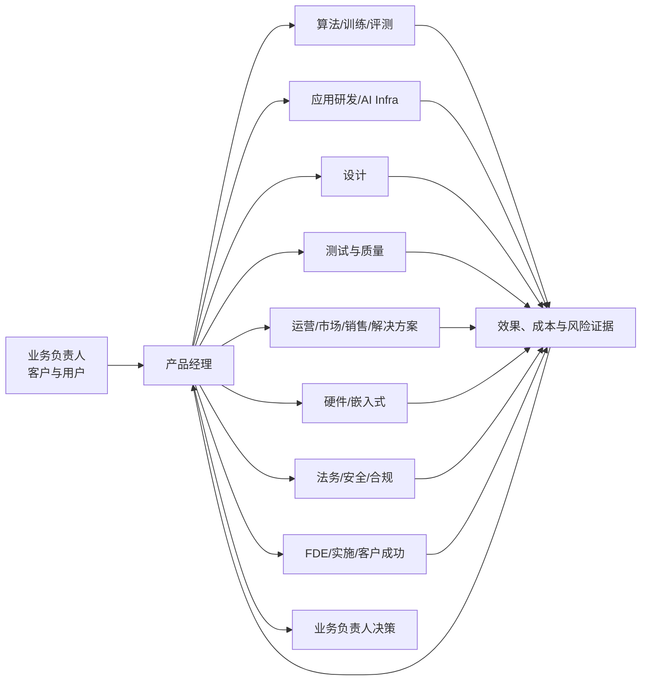

本页回答一个比岗位名称更实际的问题：产品经理要和谁一起把产品做出来。协作对象包括同一项目中的技术团队、业务与客户团队、设计和运营团队，也包括决定资源与风险边界的负责人。先理解这些关系，再阅读具体岗位页面，能更准确地判断职责边界和沟通成本。

## 产品经理协作对象地图

产品经理通常连接问题、决策和交付，而不是替代其他岗位完成专业工作。一个 AI 产品从目标确定到上线迭代，常见的协作关系如下：

核心关系是：产品经理把用户问题和业务目标转成方案、优先级与验收标准，再让专业团队共同交付；上线后的数据、反馈和风险证据回到产品决策中。

### 常见协作对象与共同决策

| 协作对象 | 共同决策 | 产品经理需要提供或对齐的证据 | 常见摩擦 |
| --- | --- | --- | --- |
| 业务负责人、管理者 | 目标、优先级、资源与上线取舍 | 用户问题、业务价值、方案比较、风险与里程碑 | 目标宏大但成功标准不清；资源承诺没有落到排期 |
| 用户、客户、业务专家 | 场景、流程、角色权限与验收 | 访谈记录、任务流程、痛点证据、试点反馈 | 把单个客户的定制要求当成通用需求 |
| 算法、训练与评测团队 | 模型能力、数据、评测集、阈值与 badcase 归因 | 任务定义、样本、评分规则、质量与安全门槛 | “效果不好”没有拆成数据、模型、检索或交互问题 |
| 应用研发与 AI Infra | 系统边界、接口、部署、容量、成本与发布节奏 | PRD、流程、接口契约、非功能要求、成本预算 | 需求持续变化；忽略延迟、容量、降级和回滚 |
| 设计团队 | 信息架构、交互、反馈、等待与错误恢复 | 用户任务、状态流转、边界场景、验收样例 | 只评审静态页面，不讨论流式输出和失败状态 |
| 测试与质量团队 | 功能验收、回归范围、异常与上线准入 | 验收标准、测试任务、风险分级、发布门槛 | 把 AI 的概率性质量当成一次性功能验收 |
| 运营、市场、销售与解决方案 | 用户教育、定价、渠道、交付承诺与反馈回流 | 目标用户、产品价值、使用数据、限制条件 | 对外承诺超过当前能力；反馈无法回到路线图 |
| FDE、实施与客户成功 | 部署边界、客户配置、现场问题与产品化 | 标准能力边界、交付清单、问题分类、升级路径 | 个案需求长期停留在定制项目中 |
| 硬件与嵌入式团队 | 设备形态、传感器、功耗、端云协同与量产节奏 | 使用场景、设备约束、体验指标、版本计划 | 云端功能方案没有考虑设备周期与物理约束 |
| 法务、安全与合规 | 数据边界、权限、审计、内容安全与责任 | 数据流、风险分级、用户授权、处置和回滚方案 | 合规在上线前才介入；风险责任人不明确 |
| 行政、采购与组织支持 | 预算、供应商、场地、资产和人员服务 | 需求规模、预算依据、时间节点、验收单据 | 业务目标与采购流程、服务边界没有对齐 |

这些角色不一定属于同一个部门，也不一定由专职人员承担。小团队中一个人可能兼任多种角色；大团队中同一角色也可能拆成多个专业团队。页面中的“协作对象”指产品经理需要共同做决策或完成交付的人，不等于汇报对象。

!!! note "时效性说明"
    协作角色的名称、组织归属和分工会随公司阶段与产品形态变化。详情页提供的是可迁移的职责与协作框架，具体岗位仍以目标团队的最新 JD 和面试沟通为准。

## 协作岗位资料

以下页面从岗位职责、交付物、指标、协作界面和求职核验问题出发，帮助你理解产品经理在每条协作链路中的接口。页面中的典型 JD 是岗位模型或综合示例；可核验的真实招聘文本统一收录在[产品经理岗位类别](../product-manager-types/index.md)的公开 JD 样本，以及[JD 拆解](../jd-breakdowns/index.md)案例中。

-   [AI 产品经理](ai-pm.md)：定义用户任务、AI 方案、评测与上线责任，连接业务、算法、研发和治理团队
-   [大模型应用工程师与 Agent 工程师](llm-app-engineer.md)：把模型能力做成应用、Workflow 和 Agent，与产品经理共同确定系统边界
-   [算法工程师（LLM/NLP/多模态）](algorithm-engineer.md)：训练、微调、推理、检索与多模态算法，与产品经理对齐能力和评测
-   [提示词工程师：现实定位与 JD 解读](prompt-engineer.md)：理解 Prompt 工作在产品、应用和算法岗位中的实际位置
-   [数据、评测与训练类岗位](data-ai-trainer.md)：管理数据、标注、评测与数据科学工作，支撑 AI 质量闭环
-   [设计师（UI/UX/交互/视觉）](designer.md)：把需求转成信息架构、交互和视觉方案，与产品经理共同验收体验
-   [研发工程师（前端/后端/客户端）](rd-engineer.md)：实现业务功能与系统接口，和产品经理对齐边界、排期、联调与发布
-   [测试工程师](test-engineer.md)：覆盖功能、自动化、性能与 AI 测试，与产品经理共同定义验收和风险门槛
-   [硬件相关岗位](hardware-pm.md)：覆盖硬件产品、嵌入式、AIoT 与机器人，处理软硬件节奏和交付约束
-   [AI 训练相关岗位](ai-trainer.md)：参与训练师、偏好训练和对齐训练，与产品经理共同定义行为目标与验收
-   [AI Infra 相关岗位](ai-infra.md)：负责 MLOps、推理优化、算力平台和稳定性，连接成本、性能与发布决策
-   [FDE（前沿部署工程师）](fde.md)：在客户现场部署和排障，把一线需求转成产品反馈与标准能力
-   [高管岗位与公司管理黑话](cxo-roles.md)：理解 CEO、CTO、CIO 等负责人对战略、资源、风险和组织的决策接口
-   [行政岗位与 JD 解读](administrative-roles.md)：理解采购、资产、场地、供应商和员工服务等组织支持接口

## 如何使用这些页面

-   **准备做产品**：按目标项目找到对应的算法、研发、设计、测试、运营、合规和交付接口，提前写清共同决策与验收证据。
-   **阅读岗位 JD**：先看岗位服务的用户和业务，再看它需要协调哪些团队、交付什么产物、对什么结果负责。
-   **准备求职**：把“沟通协调能力”具体化为一次需求取舍、一次技术约束对齐、一次跨团队发布或一次 badcase 闭环。
-   **判断岗位边界**：如果 JD 只写“推动项目”“跟进需求”，却没有用户、决策权、交付物和结果指标，应在面试中继续核验。

## 如何阅读协作岗位 JD

-   **先看职责再看要求**：职责决定入职后的工作内容，要求用于筛选候选人；两者不一致时，优先核对职责与面试描述。
-   **区分硬门槛与软偏好**：学历、经验、技术栈可能是硬门槛；“优先”“加分项”属于软偏好，应结合岗位实际交付判断。
-   **找到协作接口**：从 JD 中标出用户、业务负责人、技术团队、交付团队和风险团队，确认谁提供输入、谁做决策、谁验收结果。
-   **警惕全能岗**：同时要求产品、算法、前端、运营和销售，却不写团队配置与权限范围时，需要确认岗位是完整的产品责任，还是多人职责压缩到一个人身上。

## 相关阅读

-   [产品经理岗位类别](../product-manager-types/index.md)：按技术对象、服务对象和结果责任理解不同产品经理，并查看公开真实 JD 样本
-   [AI 产品经理岗位解读](ai-pm.md)：AI 产品经理的职责结构、能力要求与面试前核验清单
-   [JD 拆解](../jd-breakdowns/index.md)：按真实招聘文本拆解用户、任务、指标、协作和面试信号
-   [产品生命周期](../../pm/product-lifecycle.md)：按导入、成长、成熟、衰退判断资源投向，并和 CC/CD 区分开
-   [项目管理与迭代](../../pm/project-management.md)：发现与交付双轨、干系人 RACI 与发布节奏
-   [AI 产品开发生命周期（CC/CD）](../../pm/ai-lifecycle.md)：理解模型、评测、代理权和上线治理的协作关系
