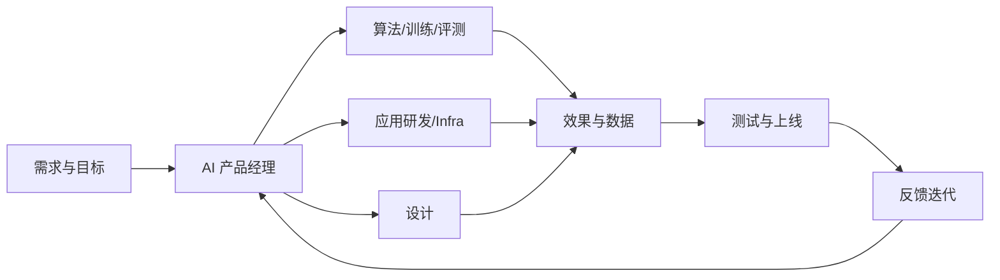

本类是求职专题的第一站：先弄清**AI 行业有哪些常见岗位、典型 JD 长什么样、怎么读 JD**，再谈准备与投递。岗位名称对不上 JD 里的真实职责，是求职中最常见的浪费。本类帮你把岗位名称 → 实际工作 → 门槛要求这条线打通。

## AI 行业常见岗位全景

AI 产品从想法到落地，大致需要以下角色（按产品协作链路排列）：

核心关系是：产品经理牵引需求与验收，算法、研发、设计、测试和 Infra 共同把模型能力转成可上线结果，再由反馈驱动迭代。

| 岗位 | 一句话定位 | 详见 |
| --- | --- | --- |
| AI 产品经理 | 定义做什么、为什么做，负责需求、方案与结果 | [AI 产品经理](ai-pm.md) |
| 大模型应用工程师 / Agent 工程师 | 把模型能力做成可用的系统：应用开发、Agent 编排、效果调优 | [大模型应用工程师与 Agent 工程师](llm-app-engineer.md) |
| 算法工程师（LLM/NLP/多模态） | 训练、微调、优化模型本身，或做检索、推理等算法方案 | [算法工程师（LLM/NLP/多模态）](algorithm-engineer.md) |
| 提示词工程师 | 罕见独立岗，更多是产品/应用/算法岗里的技能项 | [提示词工程师：现实定位与 JD 解读](prompt-engineer.md) |
| 数据、评测与训练类岗位 | 数据标注与管理、评测、数据科学：AI 质量的守门人；训练相关详见独立页 [AI 训练相关岗位](ai-trainer.md) | [数据、评测与训练类岗位](data-ai-trainer.md) |

???+ note "时效性说明"
    信息截至 2026-08，岗位名称与 JD 写法随行业发展变化较快，请以最新公开招聘信息为准。

## 怎么读 JD

三条心法，细节在各篇文章里展开：

-   **先看职责再看要求**：JD 里的「要求」是筛人用的，**职责**才决定你入职后每天干什么。职责与岗位名不匹配时，以职责为准
-   **区分硬门槛与软偏好**：「3 年以上经验」「熟悉某框架」是硬门槛；「有 X 经验者优先」「加分项」是软偏好，不必被吓退
-   **警惕「全能岗」**：一份 JD 同时要产品、算法、前端、运营的能力，往往意味着岗位定义不清或初创团队一个人当三个人用，投递前想清楚代价

## 内容列表

-   [AI 产品经理](ai-pm.md)：岗位细分、JD 结构拆解、关键词解读、能力要求与发展路径
-   [大模型应用工程师与 Agent 工程师](llm-app-engineer.md)：应用开发与 Agent 编排岗，与 AI PM 的协作界面
-   [算法工程师（LLM/NLP/多模态）](algorithm-engineer.md)：预训练/微调/推理优化/RAG/多模态方向，面试考察点
-   [提示词工程师：现实定位与 JD 解读](prompt-engineer.md)：坦诚分析这个「网红岗位」的真实存在形态
-   [数据、评测与训练类岗位](data-ai-trainer.md)：数据、评测、训练师与数据科学岗的现状与前景
-   [设计师（UI/UX/交互/视觉）](designer.md)：UI/UX/交互/视觉细分与 AI 产品里的设计工作，与 PM 的协作方式
-   [研发工程师（前端/后端/客户端）](rd-engineer.md)：前端/后端/客户端细分与 AI 研发栈，与 PM 的需求交接与排期协作
-   [测试工程师](test-engineer.md)：功能/自动化/性能/AI 测试，与 PM 一起定义验收与评测
-   [硬件相关岗位](hardware-pm.md)：硬件产品经理/嵌入式/AIoT/机器人，硬件周期与软硬一体协作
-   [AI 训练相关岗位](ai-trainer.md)：训练师/RLHF 偏好训练/对齐训练等训练环节岗位
-   [AI Infra 相关岗位](ai-infra.md)：MLOps/推理优化/算力平台等基础设施岗位
-   [FDE（前沿部署工程师）](fde.md)：客户现场部署与需求回流的技术岗
-   [高管岗位与公司管理黑话](cxo-roles.md)：CEO/CTO/CIO 等 C-suite 与公司管理术语

## 产品经理与各岗位的协作

产品经理要和每个岗位协作：算法、设计、研发、测试、硬件各篇都有独立的「与产品经理的协作」章节，讲清分工、协作流程、产出物与常见摩擦（大模型应用工程师篇在开篇也给出了与 PM 的协作界面）。协作地图如下：

-   [与算法工程师的协作](algorithm-engineer.md#与产品经理的协作)：可行性评估、评测指标、效果验收与「效果不好」的归因
-   [与设计师的协作](designer.md#与产品经理的协作)：需求同步、设计评审、走查验收，以及 AIGC 工具带来的变化
-   [与研发工程师的协作](rd-engineer.md#与产品经理的协作)：PRD 交接、可行性评估、排期联调与 AI 效果的反复迭代
-   [与测试工程师的协作](test-engineer.md#与产品经理的协作)：验收标准、功能测试与 AI 评测的分工、出错场景用例
-   [与硬件相关岗位的协作](hardware-pm.md#与产品经理的协作)：软硬一体产品的分工、硬件周期与节奏差异的协同
-   [与 AI 训练相关岗位的协作](ai-trainer.md#与产品经理的协作)：模型行为规范从产品需求来，行为验收靠评测
-   [与 AI Infra 相关岗位的协作](ai-infra.md#与产品经理的协作)：成本口径、延迟体验、部署策略的权衡
-   [与 FDE 的协作](fde.md#与产品经理的协作)：客户需求一手回流、部署边界与产品化
-   [与高管的协作](cxo-roles.md#与产品经理的协作)：汇报链、决策链与向上沟通的语言

## 相关阅读

-   [面试题型框架](../interviews/interview-guide.md)：知道岗位要什么之后，看面试怎么考
-   [自学路线](../../intro/self-study-roadmap.md)：从通用产品技能到 AI 深耕的完整路径
-   [AI 产品开发生命周期（CC/CD）](../../pm/ai-lifecycle.md)：理解岗位们在同一件事里的分工
