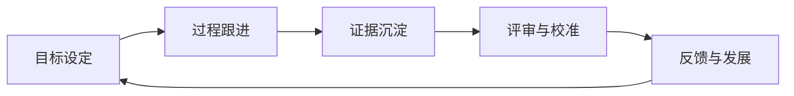

## 绩效管理是什么

绩效管理是把组织目标转成岗位目标，并通过过程沟通、证据记录、结果评审和后续改进持续管理的循环。**绩效考核**只是其中的评审与评分环节，绩效管理还包括目标设定、资源支持、反馈辅导和发展安排。

求职者关注绩效，不只为了估算年终奖。绩效制度会影响工作优先级、试用期转正、调薪、晋升、奖金、岗位稳定性和团队协作方式。入职前看懂考核口径，入职后才能把工作结果转成可被看见的证据。

## 绩效管理的完整循环

### 目标设定

把公司方向拆到部门，再落到岗位和个人。目标至少写清楚四件事：交付什么结果、用什么指标衡量、在什么时间完成、由谁负责。涉及多人协作时，还要写清依赖方、交付边界和验收人。

目标写法示例：

-   模糊写法：优化行政服务，提高员工满意度
-   可执行写法：在第三季度完成行政工单流程改版，将平均首次响应时间从 8 小时降至 4 小时以内；满意度调查覆盖办公区全体员工，月度有效样本不少于 80 份

目标不应只写最终数字。对于行政、项目、研发等受外部依赖影响较大的岗位，还要记录关键过程、质量和风险控制要求。

### 过程跟进

绩效周期内，管理者需要提供资源、澄清优先级、及时反馈风险，员工需要同步进展、暴露阻塞并确认目标变化。季度或月度 1on1 可以回答：

-   当前目标是否仍然有效，优先级有没有变化
-   已完成什么，证据在哪里，结果与预期差距多大
-   哪些事项被外部依赖卡住，需要谁提供资源
-   哪些风险可能影响结果，需要调整范围、时间或指标
-   下个周期需要补什么能力，管理者能提供什么支持

目标发生重大变化时，应留下变更原因、变更时间、审批人和新口径。只在年末凭印象评分，无法准确反映实际工作。

### 证据沉淀

绩效证据要连接目标、行动和结果，常见材料包括：

-   项目计划、里程碑、验收记录和上线数据
-   业务方、客户或协作团队的结构化反馈
-   费用、效率、质量、稳定性和风险数据
-   复盘记录、问题单、改进项及改进后的对比结果
-   目标变更、资源不足、依赖延期等客观背景的书面记录

过程证据不等于堆工作量。会议数量、加班时长和消息条数只能说明活动发生过，不能单独证明绩效结果。

### 评审与校准

直属管理者依据目标结果、过程质量、协作表现和能力成长形成评价。校准会议用于统一不同团队的评分口径、检查证据充分性和识别系统性偏差，不应把校准变成简单排名。

员工需要知道：谁参与评审、谁有最终决定权、评分依据是什么、是否可以提出异议、异议渠道和截止时间是什么。不同公司的等级名称、分值和奖金系数差异很大，不能直接横向比较。

### 反馈与发展

绩效沟通要说明事实、影响、差距和下一步行动。一次有效的沟通至少包含：

1.  **回顾目标**：确认本周期约定的目标、范围和口径
2.  **陈述证据**：说明已完成结果、质量表现和关键事实
3.  **讨论差距**：区分能力问题、资源问题、目标变化和协作问题
4.  **确定行动**：写明改进动作、负责人、支持资源和检查日期
5.  **确认记录**：让双方确认结论，后续按约定节点复查

绩效沟通的结果应当可行动。只写「加强沟通」「提高主动性」无法指导改进，需要补充具体行为、交付标准和观察周期。

## 绩效考核的常见维度

| 维度 | 关注的问题 | 适合的证据 |
| --- | --- | --- |
| 结果 / 产出 | 约定目标是否达成，业务或用户结果如何 | 目标指标、里程碑、验收结果、业务数据 |
| 质量与风险 | 结果是否稳定，是否引入返工、事故或合规风险 | 缺陷率、返工率、事故记录、审计与检查记录 |
| 协作与行为 | 是否履行承诺，信息是否透明，是否有效协作 | 协作反馈、交接记录、问题闭环、冲突处理事实 |
| 能力与成长 | 是否掌握岗位能力，是否沉淀方法并扩大影响 | 能力评估、复盘、SOP、培训与知识沉淀 |

维度权重应与岗位性质匹配。销售岗位可能更看收入与回款，行政岗位要同时看服务、成本和风险，研发岗位不能只看交付数量，也要看质量、稳定性和技术债。

## KPI、OKR 与其他考核口径

| 体系 | 主要用途 | 常见特点 | 求职时要确认 |
| --- | --- | --- | --- |
| KPI | 跟踪关键业务或岗位指标 | 指标、口径和达成标准较明确 | 指标来源、基线、目标值与奖金系数 |
| OKR | 对齐方向、重点和阶段性突破 | O 描述目标，KR 描述关键结果；通常强调透明与复盘 | OKR 是否参与评分，评分是自评、主管评还是单独发展讨论 |
| 目标责任制 | 将部门或岗位结果与责任书绑定 | 常见于经营、项目和管理岗位 | 责任边界、外部依赖、目标调整和追责方式 |
| 360 度反馈 | 收集上下级、同级或客户反馈 | 能补充协作与行为信息，但主观性更高 | 参与人、匿名规则、权重与反馈用途 |
| 能力模型 | 评估岗位能力与职级要求 | 关注专业能力、领导力和行为表现 | 能力等级定义、晋升证据与评审方式 |

OKR 不天然等于「不考核」，KPI 也不代表只看数字。很多公司会把 OKR 用于方向管理，把 KPI、能力模型或价值观行为用于综合评价，必须以目标公司的制度为准。

## 如何设计可用的绩效指标

### 指标的五个组成部分

一个可执行的指标至少包括：

1.  **对象**：评价哪个产品、流程、团队或服务
2.  **口径**：分子、分母、统计范围、数据源和排除项
3.  **基线**：当前水平或历史对照期
4.  **目标**：目标值、达标线、优秀线和截止日期
5.  **责任**：个人直接负责的部分、协作依赖和最终验收人

例如「降低采购成本」需要补充采购范围、比较基准、质量约束、节省计算方式和验收人，否则很容易通过延迟采购、降低规格或减少必要服务制造虚假的节省。

### 结果、过程与边界一起写

-   结果指标说明最终要达到什么
-   过程指标说明关键动作是否按标准完成
-   质量指标说明不能通过什么方式换取结果
-   风险约束说明安全、合规、客户体验或资源边界

目标不宜过多。一个周期内应优先保留真正影响岗位结果的少数目标，把临时任务按变更流程纳入，而不是不断叠加考核项目。

## 行政岗位绩效示例

以下为行政经理的示例评分卡，权重只是展示指标结构，不代表通用制度：

| 维度 | 示例权重 | 目标与证据 |
| --- | ---: | --- |
| 服务结果 | 40% | 工单按时关闭率、办公支持满意度、重大会议保障达成率 |
| 成本与资源 | 25% | 预算执行偏差、采购周期、库存与资产准确率、供应商成本优化 |
| 质量与风险 | 20% | 合同与验收资料完整率、盘点完成率、隐患关闭率、重大事故情况 |
| 团队与改进 | 15% | SOP 覆盖、交接完整、关键岗位备份、流程改版后的效率提升 |

使用这张表时要进一步说明：满意度调查对象和样本量、预算偏差的合理范围、重大事故如何认定、外包团队责任如何划分。行政岗位的服务结果受物业、供应商和业务方共同影响，不能把所有结果简单归因给一个人。

## 评分、校准与奖金

### 绝对评价与强制分布

-   **绝对评价**：把个人结果与既定标准比较，理论上可以多人同时达到优秀
-   **相对评价**：在团队或同职级之间排序，评价结果受团队构成和名额影响
-   **强制分布**：预先规定各等级的大致比例，可能导致团队内部必须区分高低

求职者不应只问「有没有绩效」，还要问评分是绝对标准还是团队排名、是否存在强制比例、跨团队如何校准。强制分布会让「完成目标」与「拿到高等级」成为两件不同的事。

### 绩效与薪酬的关系

需要分别确认：

-   绩效等级是否影响年终奖，奖金是目标值还是固定承诺
-   调薪、晋升和绩效是否使用同一套评审，是否有最低绩效门槛
-   试用期、转正、年度绩效和专项奖励分别采用什么口径
-   奖金发放时间、计算周期、在职条件和离职处理如何约定

口头说法不能替代书面规则。Offer 中没有明确写出的年终奖、绩效奖金或期权收益，都应按不确定收入评估，见[谈薪与 Offer 选择](../interviews/offer-negotiation.md)。

## PIP 与低绩效处理

PIP（Performance Improvement Plan，绩效改进计划）通常包含改进目标、支持资源、检查节点、周期和结果处理方式。PIP 可能是正式的改进机制，也可能出现在劳动关系准备阶段。判断重点不在名称，而在以下事实：

-   目标是否与岗位职责相关，是否具体、可实现、可衡量
-   公司是否提供了合理的资源、培训、反馈和改进机会
-   评价是否有既定记录，标准是否在周期中被临时改变
-   到期评估由谁完成，结果如何影响岗位、薪酬和劳动关系

收到低绩效或 PIP 后，保留目标文件、绩效记录、工作产出、沟通纪要和资源申请记录。对明显不合理的目标，用书面方式说明事实、影响和需要确认的口径。劳动关系、解除和补偿涉及具体法律适用，参阅[裁员、PIP 与劳动权益](../layoff-and-labor.md)，必要时向当地人社部门或专业人士咨询。

## AI 与绩效管理

AI 可以辅助整理工单、项目、服务和客户反馈，但不应直接把自动生成的分数当作员工结论。使用 AI 或数据系统时，管理者需要确认：

-   数据来源是否准确，是否把可见活动误当成真实产出
-   指标是否对不同岗位、地点和资源条件公平
-   员工是否知道收集什么数据、如何使用以及如何纠错
-   是否保留人工复核、申诉和异常处理机制
-   是否避免使用与岗位无关的私人信息进行评价

行政、客服、运营等岗位的工作常包含大量隐性协调。系统容易统计响应次数，却难以完整识别风险预防、复杂问题处理和跨部门推动。数据应帮助管理者发现事实，不能替代绩效沟通与责任判断。

## 求职者如何读 JD 里的绩效信息

| JD 信号 | 可能代表什么 | 面试时追问 |
| --- | --- | --- |
| 对结果负责 / 结果导向 | 岗位有明确业务目标或交付责任 | 结果指标是什么，个人能控制哪些部分 |
| 强执行、抗压、灵活 | 可能有大量临时任务或高峰期工作 | 高峰周期、加班频率、任务优先级由谁决定 |
| 绩效奖金上不封顶 | 收入与结果强绑定，但上限和口径不确定 | 目标奖金、历史发放、计算公式和发放条件 |
| 接受末位调整 / 绩效淘汰 | 可能存在强排名或低绩效处理机制 | 评分规则、改进流程、申诉与反馈机制 |
| 负责团队绩效 | 需要带人、分配目标和进行评价 | 下属数量、管理者培训、校准方式与授权范围 |

## 面试中如何讲绩效案例

用 STAR 结构讲一个真实案例，并补充指标口径：

1.  **情境**：当时的团队、目标和约束是什么
2.  **任务**：你直接负责的结果是什么，哪些事项由他人负责
3.  **行动**：你如何设目标、跟进过程、处理偏差和协调资源
4.  **结果**：目标完成情况、质量与成本变化、他人如何验证结果
5.  **复盘**：哪些指标有效，哪些指标有偏差，下一周期如何调整

准备行政岗位时，可以讲一次通过工单数据发现服务瓶颈、通过供应商评价降低返工、或通过资产盘点减少账实差异的经历。没有正式管理经验，也可以讲自己如何确认目标、同步风险和交付结果。

## 入职前的绩效提问清单

-   绩效周期是月度、季度还是年度？试用期有单独考核吗？
-   目标由谁设定和调整？岗位变更或业务优先级变化时如何更新？
-   绩效由谁评估？是否有跨部门反馈、校准和申诉渠道？
-   结果、能力、协作和价值观分别占多少权重？有没有强制分布？
-   绩效等级怎样影响奖金、调薪、晋升和续约？规则是否写入制度或 Offer？
-   这个岗位上一周期最重要的目标是什么？团队认为做得好与不好的标准是什么？

面试官无法清楚回答指标、评估人和奖金规则时，说明制度可能仍在变化。变化本身不是问题，关键是公司是否愿意说明口径、记录变更并提供反馈。

## 相关阅读

-   [行政岗位与 JD 解读](administrative-roles.md)：行政专员、主管、经理和办公室主任的职责与绩效示例
-   [裁员、PIP 与劳动权益](../layoff-and-labor.md)：低绩效处理、PIP 与劳动关系风险
-   [高管岗位与公司管理黑话](cxo-roles.md)：OKR、KPI、季度 review、PIP、末位淘汰等职场术语
-   [谈薪与 Offer 选择](../interviews/offer-negotiation.md)：核对绩效奖金、年终奖和书面 Offer
-   [面试复盘方法论](../interviews/review-methodology.md)：记录面试信息并识别目标公司的管理方式
