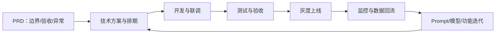

## 岗位是什么

研发工程师是**把产品方案变成可用系统**的角色：负责架构设计、开发、联调、上线与稳定性。在 AI 产品里，研发的核心工作从写业务逻辑扩展为把模型能力可靠地嵌入产品：流式输出、检索链路、Agent 编排、成本控制，都是研发的日常。

常见别名：前端工程师、后端工程师、客户端工程师、全栈工程师、AI 应用研发、架构师。

按工作内容细分：

| 细分方向 | 核心工作 | 说明 |
| --- | --- | --- |
| 前端 | 界面、交互、流式渲染 | 与设计协作最紧 |
| 后端 | 接口、服务、数据、LLM 编排 | AI 产品的中枢 |
| 客户端 | App / 桌面端 / 嵌入式端 | 端上体验与算力约束 |
| 全栈 | 前后端都做 | 小团队常见，大厂少见 |
| 架构 | 系统设计、技术选型、稳定性 | 资历门槛高 |

核心关系是：研发把 PRD 转成技术方案和可上线系统，发布后的效果、成本与稳定性反馈再驱动下一轮排期。

AI 产品的典型研发栈：

-   大模型 API 集成与流式输出（SSE/WebSocket）
-   向量库与 RAG 检索链路
-   Agent 框架与工具调用
-   缓存、限流与成本控制
-   效果评测、可观测性与数据回流

???+ note "时效性说明"
    信息截至 2026-08，岗位名称与 JD 写法变化较快，以最新公开招聘信息为准。

## 典型 JD 长什么样

### 职责

-   负责 XX 产品的前端 / 后端 / 客户端研发，支撑功能迭代
-   集成大模型 API，实现对话、检索、Agent 等 AI 能力
-   优化性能、稳定性与成本，建设监控与日志
-   与产品、算法、测试协作，推动版本上线
-   （架构方向）负责技术选型与系统设计

### 要求

-   统招本科及以上，计算机相关专业，X 年以上开发经验
-   熟练掌握 XX 语言（Java/Go/Python/TypeScript 等）与主流框架
-   熟悉数据库、缓存、消息队列等基础组件
-   有良好的工程素养：代码质量、测试意识、问题排查能力
-   （AI 岗）熟悉 LLM API 调用、提示词、RAG 或 Agent 框架

### 加分项

-   有完整 AI 应用 / Agent 项目落地经验
-   有模型部署、推理优化或微调经验
-   有开源项目贡献或技术博客

## JD 关键词解读

-   **「X 年以上 XX 语言经验」**：硬门槛，面试有编码题；语言本身可迁移，但框架与工程实践要讲深
-   **「熟悉 LLM API / RAG」**：AI 岗位的软性硬门槛。不要求算法功底，但面试会问链路设计与踩坑经验（上下文、延迟、失败兜底）
-   **「全栈」**：小团队要求多面手；大厂写「全栈」的岗位反而要警惕职责边界不清
-   **警惕点**：「要求算法 + 工程 + 产品」的全能岗，往往意味着一个人干三个人的活；「AI 研发」但职责全是调第三方接口的，可能只是换皮外包，技术成长有限

## 与产品经理的协作

### 需求评审与 PRD 交接

-   PRD 要写清**边界**（做什么、不做什么）、**验收标准**（什么算完成）与**异常处理**（失败时怎么办）；研发在评审时补充可行性、成本与工期
-   交接产出物：PRD ↔ 技术方案（设计文档）、排期、风险清单；PRD 没写清的地方，评审会上当场对齐，不留默认理解

### 技术可行性评估

-   PM 先问「能不能做、做到什么程度、代价多少」再定方案，而不是先拍板再让研发硬做
-   研发给出三类结论：「做得到」「做不到」「需要加预算或时间」；涉及模型能力边界的，用评测数据佐证，而不是凭感觉

### 排期与任务拆分

-   按里程碑拆：先打通完整链路（哪怕效果粗糙），再打磨体验与效果。LLM 功能尤其如此，别指望一次交付就是终态
-   LLM 效果不确定 → 效果类任务按「迭代」排期而不是「一次性交付」；PM 要接受「试出来才知道」的节奏

### 联调与验收

-   按 PRD 验收点逐条过；问题分两类：bug 由研发修，需求变更重新评估排期。PM 不要用「顺手改一下」掩盖变更成本
-   上线前 PM / 研发 / 测试三方确认：功能完整、缺陷清零或已知问题有结论

### AI 产品特有：提示词 / 参数 / 评测迭代需反复对齐

-   一个功能的提示词可能要试几十版才稳定，PM 与研发要共同定义「达到什么效果算过」，并沉淀到评测集里，而不是每次凭感觉
-   badcase 修复节奏：建评测集 → PM 定优先级 → 研发改 → 测试回归；三方围绕数据对齐，避免「我觉得不行」「我觉得可以」的空转

### 常见摩擦与解法

-   **「效果不好」是谁的问题**：先看评测数据，归因到 prompt、数据还是模型再动手，不要一上来就重写
-   **需求边做边改**：变更走评审，影响排期要明说；PM 用「冻结核心、小步快跑」代替「随时变」
-   **「先上线再说」vs「做稳再上」**：用灰度与评测数据决策，而不是站位争论；风险讲清，拍板归 PM

## 能力要求与准备建议

1.  **打牢工程基本功**：一门主语言 + 数据库 + 网络 + 基础算法；刷题按目标公司标准准备
2.  **掌握 AI 应用栈**：[大模型基础](../../ai/llm-basics.md)、[提示词工程](../../ai/prompting.md)、[RAG](../../ai/rag.md)、[Agent 与工作流](../../ai/agent.md) 各配一个小项目，做到讲清设计取舍
3.  **建立评测意识**：[评估与评测](../../ai/evaluation.md) 是 AI 研发的必修课：没有评测，「效果好不好」就没法对齐
4.  **读 PRD、会沟通**：读 [PRD 写作](../../pm/prd.md)，能把需求翻译成技术方案与排期；这是 AI 研发区别于纯后端的竞争力
5.  **做出完整作品**：一个端到端 AI 应用项目（如接入私有知识的问答机器人），讲清架构、成本、失败兜底与效果度量

## 发展路径

-   **入行**：后端 / 前端 / 客户端转 AI 应用（补 LLM 栈）或应届直接投；AI 应用研发是当前需求量最大的方向之一
-   **进阶**：应用架构师 / 技术负责人，主导技术选型与稳定性，对效果、成本、延迟做全局决策；通常 3~5 年
-   **横向**：转算法工程师（往模型侧走，需补数学与训练知识）、转 AI Infra（推理部署 / 训练平台）、转 AI 产品经理（技术型 PM）
-   **纵向**：技术负责人 / 平台负责人 / CTO 路径；AI 平台型方向可走向基础架构负责人

## 相关阅读

-   [AI 产品经理](ai-pm.md)：需求从哪来、怎么对齐
-   [算法工程师（LLM/NLP/多模态）](algorithm-engineer.md)：什么时候该找算法，而不是自己硬调
-   [测试工程师](test-engineer.md)：联调与验收的协作方
-   [设计师（UI/UX/交互/视觉）](designer.md)：还原度协作，设计的落地端
-   [AI 系统架构](../../ai/architecture.md)：应用层与模型层的关系
-   [AI 产品开发生命周期（CC/CD）](../../pm/ai-lifecycle.md)：你在开发链路中的位置
