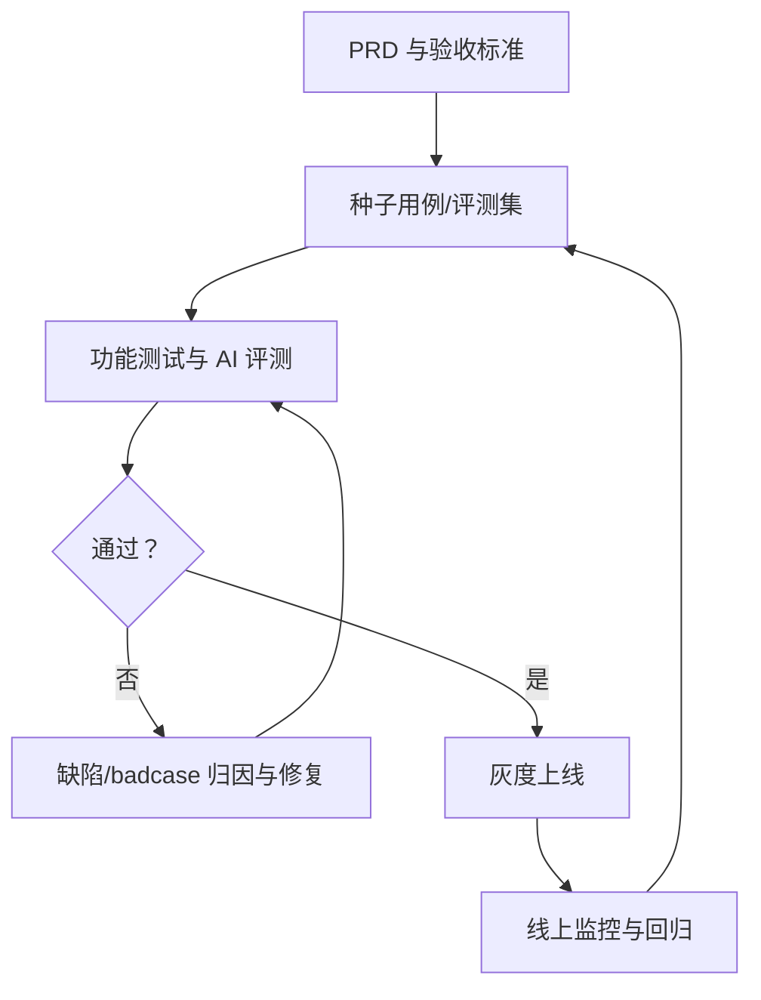

## 岗位是什么

测试工程师是**对产品质量负责**的角色：通过用例设计与执行发现缺陷、验证功能与效果，把好上线前的最后一道关。在 AI 产品里，测试从验证功能对不对扩展到验证效果稳不稳。AI 输出的不确定性，让测试的难度与价值都明显提升。

常见别名：QA、功能测试工程师、自动化测试工程师、性能测试工程师、AI 测试工程师、质量工程师。

按工作内容细分：

| 细分方向 | 核心工作 | 说明 |
| --- | --- | --- |
| 功能测试 | 用例设计、手工执行、缺陷管理 | 入门岗，需求量稳定 |
| 自动化测试 | 脚本化用例、CI 集成、回归 | 提升效率的关键 |
| 性能测试 | 压测、延迟、稳定性 | 大流量产品必配 |
| AI 测试 | 效果评测、badcase 分析、评测集建设 | 增长最快的新方向 |

核心关系是：测试把需求标准转成确定性用例和效果评测，未通过则归因修复，通过后仍以线上回归守住质量。

AI 产品测试与软件测试的差异：

-   **输出不确定**：同一输入多次输出可能不同，断言难写
-   **没有唯一正确答案**：需要评测集 + 人工抽检相结合，而不是一条断言判生死
-   **效果会漂移**：模型升级、提示词改动都可能改变行为，回归体系比传统软件更重要
-   **数据依赖**：测试要造真实感的数据（真实用户问法、边界输入），纯假数据测不出问题

???+ note "时效性说明"
    信息截至 2026-08，岗位名称与 JD 写法变化较快，以最新公开招聘信息为准。

## 典型 JD 长什么样

### 职责

-   负责 XX 产品的功能 / 自动化 / 性能测试，设计并执行测试用例
-   （AI 岗）建设评测集与回归机制，度量并跟踪模型效果
-   分析缺陷与 badcase，推动研发修复
-   建设质量流程与测试工具链

### 要求

-   统招本科及以上，计算机相关专业，X 年以上测试经验
-   熟悉测试方法论与用例设计，了解缺陷管理流程
-   掌握至少一门脚本语言（Python/Java）与主流自动化框架
-   （AI 岗）了解 LLM 能力与局限，有评测或数据分析经验

### 加分项

-   有 AI 产品 / 大模型产品测试经验
-   有接口 / UI 自动化框架从 0 到 1 的搭建经验
-   有性能测试或安全测试经验

## JD 关键词解读

-   **「用例设计能力」**：测试的核心技能，面试常现场给需求让你设计用例。等价类、边界值、场景法要脱口而出
-   **「自动化」**：从手工到自动化是薪资分水岭；只会手工点点的岗位天花板低
-   **「LLM / AI 评测」**：AI 测试岗的核心词，考的是评测集设计与 badcase 归因，[评估与评测](../../ai/evaluation.md) 是必读
-   **警惕点**：纯「点鼠标」的计件外包测试岗不是职业发展路径；测试名义但职责混入运营、客服的，是职责不纯的信号

## 与产品经理的协作

### PM 定义验收标准与种子用例

-   PM 在 PRD 里写「什么叫通过」，测试把它拆成可执行的用例——验收标准必须可度量（如「核心流程无阻断性缺陷」「回答准确率不低于 X」），不可度量的表述（「体验更好」）无法验收
-   PM 提供的真实用户输入是种子用例的来源；测试在此基础上补边界与异常场景

### 功能测试 vs AI 评测的分工

| 事项 | 谁负责 | 说明 |
| --- | --- | --- |
| 功能测试（界面 / 流程 / 权限 / 稳定性） | 测试主导 | 确定性场景，按用例执行、按缺陷闭环 |
| AI 效果评测（准确率 / 幻觉 / 拒答） | PM 定标准，测试执行，算法 / 研发修复 | 用评测集与基线说话，不是「我觉得」 |
| 回归（升级后效果不劣化） | 测试 + 算法 / 研发共同 | 评测集自动跑 + 人工抽检，阻断效果回退上线 |

### 与 PM 一起设计「出错场景」用例

-   AI 产品的典型出错场景：**幻觉**（一本正经胡说）、**拒答**（该答不答）、**边界输入**（超长上下文、多语言混用）、**提示注入**（用户试图绕过限制）、**多轮污染**（前面说错影响后面）
-   PM 提供真实用户会怎么用、怎么误用的场景，测试负责构造用例与断言方式，研发补修复方案。三方一起设计，比测试单方面猜有效得多

### 上线前三方确认

-   发布前：测试报告 + PM 验收 + 研发修复清单，三方确认后再上线；已知问题列清楚「带病上线」的范围与回滚方案
-   上线后：灰度监控效果指标，数据回流给下一轮迭代，而不是发布即结束

### 常见摩擦与解法

-   **「这是设计如此」vs「这是 bug」**：以 PRD 为准；PRD 没写到的走变更评审，而不是当场吵架
-   **AI 效果波动导致用例不稳定**：区分「功能回归」（必须全绿）与「效果趋势」（看统计指标，不追求单次全过），别拿评测集的统计波动卡发布
-   **上线时间 vs 质量**：测试把风险讲清楚、给出建议，拍板归 PM。测试默默加班扛进度，最后出了问题反而没人敢说话

## 能力要求与准备建议

1.  **练测试基本功**：用例设计（等价类 / 边界值 / 场景法）、缺陷管理、测试报告——这是所有测试岗的底座
2.  **补自动化与脚本**：Python + 一个主流自动化框架，自己搭接口 / UI 回归；自动化是涨薪最快的技能
3.  **学 AI 通识**：[大模型基础](../../ai/llm-basics.md) 讲清幻觉、上下文、流式输出；[评估与评测](../../ai/evaluation.md) 教你搭评测集、算指标、做回归
4.  **建立数据意识**：会用 SQL / 日志分析 badcase 分布，把「感觉有问题」变成「这里有 30% 的失败集中在超长输入」
5.  **理解需求与验收**：读 [需求分析](../../pm/requirements.md) 与 [PRD 写作](../../pm/prd.md)，看懂验收标准背后要什么，才能设计出真正拦得住问题的用例

## 发展路径

-   **入行**：功能测试起步，尽快补自动化与脚本能力；AI 测试岗对转岗者相对友好：懂 AI + 会测试的组合稀缺
-   **进阶**：质量负责人 / AI 测试专家，主导评测体系与质量流程，成为发布决策的关键角色
-   **横向**：转评测工程师、AI 训练师 / 数据岗（方法论相通）、AI 产品经理（测试转 PM 的挑刺视角很稀缺）
-   **纵向**：测试团队负责人 / 质量总监；AI 测试方向可走向质量与评测平台负责人

## 相关阅读

-   [AI 产品经理](ai-pm.md)：验收标准从哪来
-   [研发工程师（前端/后端/客户端）](rd-engineer.md)：缺陷修复与联调的协作方
-   [数据、评测与训练类岗位](data-ai-trainer.md)：评测与数据质量的近亲岗位
-   [算法工程师（LLM/NLP/多模态）](algorithm-engineer.md)：效果问题归因到模型时的协作方
-   [评估与评测](../../ai/evaluation.md)：AI 测试的方法论核心
-   [AI 产品开发生命周期（CC/CD）](../../pm/ai-lifecycle.md)：测试在开发链路中的位置
