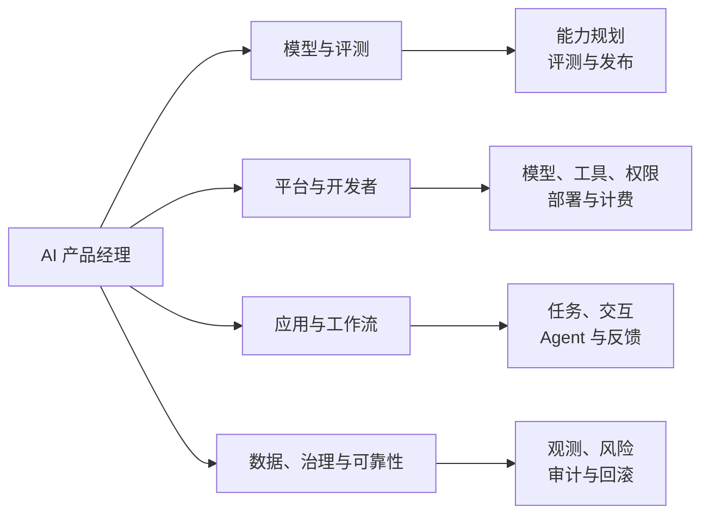

## AI 产品经理方向

AI 产品经理围绕用户任务、AI 系统和业务结果做取舍。重点不只是把模型接进产品，而是把概率性输出变成可验证、可控制、可持续运行的产品能力。

### 模型与评测型

模型与评测型岗位围绕基础模型、多模态模型、模型 API 或领域模型展开。产品经理通常负责场景定义、能力规划、评测标准、版本路线和发布协作，不代替算法工程师完成训练工作。

-   **典型产品**：模型 API、模型能力平台、多模态模型、行业模型、评测平台
-   **主要工作**：拆解能力需求；定义任务和评测集；比较质量、延迟、成本和稳定性；推动版本发布与行为回归
-   **常见指标**：任务质量、评测通过率、延迟、可用性、调用成本、安全事件和开发者采用率
-   **适合背景**：有算法、工程、数据或技术产品经验，能读懂模型评测与部署约束

### 平台与开发者型

平台与开发者型岗位为模型研发、应用构建或团队协作提供基础设施，用户通常是算法工程师、应用开发者、企业管理员或内部业务团队。

-   **典型产品**：模型接入平台、Agent 搭建平台、数据与标注平台、开发者控制台、工具与 MCP 管理平台
-   **主要工作**：设计模型、数据、工具、权限、发布和计费流程；降低开发与部署门槛；维护文档、SDK、版本和可观测性
-   **常见指标**：开发者激活与留存、从创建到上线的时长、任务成功率、平台稳定性、资源利用率和调用成本
-   **关键能力**：理解 API、数据流、鉴权、权限、部署和故障排查，把复杂工程流程整理成可操作的产品流程

### 应用与工作流型

应用与工作流型岗位把模型接入具体场景，直接帮助用户完成任务。产品经理的重点从模型本身转向任务流程、交互体验、效果验收和业务闭环。

-   **典型产品**：对话助手、智能客服、知识库问答、办公 Copilot、营销内容生成、AI 搜索
-   **主要工作**：定义用户任务；选择模型、检索和工具方案；设计反馈、人工接管和降级；建立 badcase 回流和版本评测
-   **常见指标**：任务完成率、采纳率、修改率、转人工率、留存率、转化率、回答质量和单次任务成本
-   **关键能力**：理解真实工作流，能判断幻觉、上下文不足、检索失败、工具失败和用户信任问题

### Agent 与自动化型

Agent 产品经理负责需要动态规划、工具调用或跨步骤执行的任务。很多 Agent 产品同时包含固定 Workflow，选型时要先证明动态决策确实带来收益。

-   **典型产品**：研究 Agent、编码 Agent、运营自动化、数字员工、企业流程 Agent
-   **主要工作**：拆解任务；设计工具 schema 和上下文；规定权限、预算、停止条件、确认节点、检查点和人工接管
-   **常见指标**：端到端任务成功率、工具调用成功率、人工接管率、恢复率、步骤数、延迟、成本和高风险动作拦截率
-   **关键能力**：理解 Agent 与 Workflow 的边界，能把自主性分级并为失败设计恢复路径

### 数据、治理与可靠性型

这类岗位让 AI 系统可观测、可审计、可持续改进，用户可能是内部研发团队、业务团队、风险与合规团队或企业客户。

-   **典型产品**：数据闭环、评测与观测平台、模型运营、AI 安全治理、AI Infra 产品
-   **主要工作**：定义日志和 trace；建设数据、评测、成本、延迟和质量看板；设计权限、审计、灰度、熔断和回滚
-   **常见指标**：数据覆盖率、评测稳定性、问题定位时长、可用性、成本、事故率、修复周期和治理覆盖率
-   **关键能力**：系统思维、数据治理、可靠性、风险分级以及跨团队推动机制

AI 应用、平台、Agent 和治理并不是互斥岗位。比如企业知识库 Agent 可能同时属于应用型、行业型和平台型；判断时以实际交付和责任边界为准。

### 继续阅读

-   [互联网产品经理方向](internet-product-manager.md)
-   [选择方向与阅读 JD](selection-and-jd.md)
-   [产品经理岗位类别总览](index.md)
