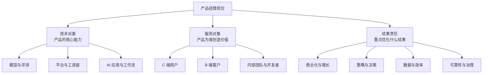

## 产品经理岗位类别

产品经理的分类没有唯一标准。同一个岗位可以同时属于多个类别：AI 应用产品可能面向 C 端用户，也可能服务企业客户；Agent 平台可能是开发者产品，也可能承担基础设施和治理职责。

判断岗位时，先看三个问题：**产品服务谁、产品解决什么问题、产品对什么结果负责**。比岗位名称更重要的是决策权、交付物和结果证据。

### 三个分类维度

下列页面按常见方向展开。分类用于建立认知，不代表公司的组织架构或 JD 一定采用这些名称；岗位可以跨多个维度。

-   [AI 产品经理方向](ai-product-manager.md)：模型与评测、平台与开发者、应用与工作流、Agent、数据治理与可靠性
-   [互联网产品经理方向](internet-product-manager.md)：C 端、B 端、商业化、策略与数据产品
-   [选择方向与阅读 JD](selection-and-jd.md)：公开 JD 样本、方向筛选方法和投递前核验清单
