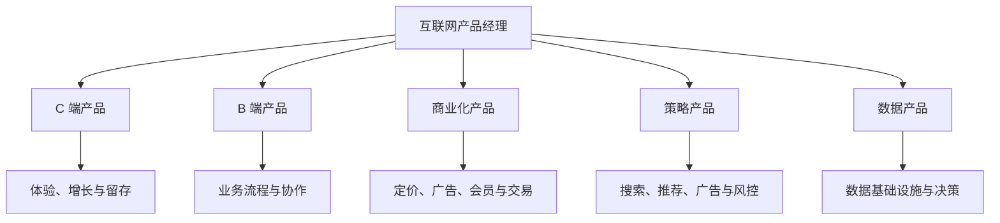

## 互联网产品经理方向

互联网产品经理把用户需求、业务流程和技术能力组织成可持续迭代的产品。AI 能力可以嵌入任何方向，但不改变岗位首先要对用户和业务结果负责的基本要求。

### C 端产品经理

C 端产品直接服务个人用户，工作重点偏向功能设计、用户体验、增长和留存。AI 相机、内容推荐、个人效率工具和消费级助手都可能属于这一方向。

-   **主要工作**：理解用户需求；设计功能和交互；优化用户路径；验证拉新、促活、留存和 AI 功能采纳
-   **常见指标**：DAU、留存率、使用时长、转化率、任务完成率、用户满意度和市场份额
-   **关键挑战**：用户规模大、反馈分散，输出质量和体验变化会直接影响活跃与信任

### B 端产品经理

B 端产品服务企业、组织或特定岗位，工作重点偏向业务流程、中后台和组织协作。使用者、购买者和决策者可能不是同一个人，需求分析要同时考虑业务目标与角色权限。

-   **主要工作**：梳理业务流程；设计角色、权限、审批和配置；建设中后台；支持交付、实施与业务扩展
-   **常见指标**：用户采用率、流程覆盖率、处理时长、错误率、运营成本、验收率和续费率
-   **关键挑战**：客户个性化与标准产品之间的边界，数据隔离和跨组织协作的责任划分

B 端产品不等于没有业绩压力。交付周期、客户续费、项目验收和业务部门的使用效果，都可能成为产品经理的考核内容。

### 商业化产品经理

商业化产品经理负责把用户价值和业务流量转化为收入，重点关注定价、售卖、广告、会员、增值服务和交易抽佣等机制。AI 产品还要把调用成本、人工复核和推理资源纳入单位经济模型。

-   **主要工作**：设计变现模式；搭建售卖和计费流程；优化广告或交易链路；平衡收入、体验、留存与 AI 成本
-   **常见指标**：收入、ARPU、付费率、转化率、ROI、GMV、留存率、毛利和单任务贡献
-   **关键能力**：商业分析、定价、漏斗分析、实验设计和多方利益平衡

### 策略产品经理

策略产品经理负责把业务目标转化为规则、算法策略和决策逻辑，常见于搜索、广告、推荐、增长、风控和内容分发场景。工作方法、需求写法与四类业务应用见[策略产品经理](../../case/strategy-pm/index.md)专题。

-   **主要工作**：定义策略目标与约束；设计排序、召回、分发或激励逻辑；推动算法实验；分析效果与风险
-   **常见指标**：CTR、转化率、准确率、召回率、用户满意度、成本和风险指标
-   **关键能力**：数据分析、实验设计、算法协作、指标拆解与策略迭代

策略产品与商业化产品常常交叉。例如广告排序既影响收入，也影响用户体验；最终要看岗位实际对哪些指标负责。

### 数据产品经理

数据产品经理把数据加工成可使用的基础设施、分析工具或业务能力，服务对象可能是管理者、运营、销售、研发或其他产品团队。

-   **主要工作**：定义数据口径；设计采集、加工和查询流程；建设指标体系；支持业务决策与运营优化
-   **常见指标**：数据覆盖率、准确率、及时性、查询性能、产品使用率和决策效率
-   **关键能力**：数据建模、指标体系、业务分析、SQL 基础与数据治理意识

数据产品不只是做报表。高价值的数据产品要让数据进入业务流程，影响决策、执行和复盘。

### 行业解决方案与商业化型

行业解决方案与商业化型产品经理把模型或平台能力转成客户可购买、可部署、可验收的产品，常见于企业服务、云服务、金融、医疗、教育和政企场景。

-   **主要工作**：理解行业流程与客户角色；定义产品定位、方案和定价；协调研发、算法、售前、销售、架构师与交付团队；把定制需求抽象成可复用能力
-   **常见指标**：签约或转化、收入、毛利、交付周期、客户采用、续费率和单位服务成本
-   **关键能力**：业务抽象、商业分析、需求分层、方案表达、跨组织推进与客户沟通

这类岗位的产品交付不止是 PRD，还包括客户方案、商业化路径、验收标准和需求回流机制。

### 硬件与智能终端型

硬件与智能终端型产品经理把 AI 能力放进手机、穿戴设备、机器人或其他端侧设备，必须同时考虑传感器、功耗、连接、端云协同和设备交互。

-   **主要工作**：定义设备中的 AI 任务与交互；协调硬件、嵌入式、算法、云端、设计和供应链；设计数据闭环与体验评估；处理量产和版本节奏
-   **常见指标**：任务成功率、响应时延、续航影响、设备活跃、功能采用率、故障率和用户满意度
-   **关键能力**：软硬件边界判断、端云架构理解、场景研究、体验设计、质量验证与供应链协作

端侧 AI 岗位通常需要把前瞻性能力转成受设备约束的产品路线，不能只按云端模型能力规划。

### 继续阅读

-   [AI 产品经理方向](ai-product-manager.md)
-   [选择方向与阅读 JD](selection-and-jd.md)
-   [产品经理岗位类别总览](index.md)
