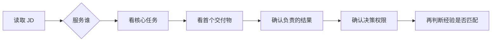

## 选择方向与阅读 JD

产品经理岗位需要结合用户、任务、交付物和结果责任来判断。下面的公开招聘样本用于校准岗位边界，不能替代对目标团队最新 JD 和面试沟通的核验。

### 真实 JD 示例：公开招聘页样本

下表是 2026-09-03 从[字节跳动官方招聘页](https://jobs.bytedance.com/experienced/position)读取的公开职位实例。原文摘录只保留用于判断岗位边界的短句；“站内分析”是基于职责、要求和协作对象做出的产品工作解读，不是招聘方承诺。样本用于校验分类，不代表行业统一标准，也不构成市场规模或薪资统计。

!!! info "阅读真实 JD 样本"
    招聘页面会更新、关闭或调整职位描述。表中职位 ID 和访问日期用于定位本次读取的版本，投递前请重新打开官方招聘页核验。

    现有 [JD 拆解](../jd-breakdowns/index.md)中的「校招」字节跳动开发者 AI 产品经理和「社招」MiniMax Agent 产品经理案例来自用户提供的岗位截图，仍按 OCR 原文与分析分层处理，不与下表的公开招聘页样本混同。

| 站内方向 | 官方职位与原文短摘录 | 典型交付与协作（站内分析） | 来源 |
| --- | --- | --- | --- |
| AI 应用与搜索型 | **搜索产品经理（AI 搜索）-TikTok**；A15884；北京。原文：推动大模型技术在搜索中的落地与创新；主导产品需求挖掘与方案设计 | 搜索任务、相关性与体验方案；协作研发、设计；关注用户满意度和搜索效果 | [官方招聘页](https://jobs.bytedance.com/experienced/position/7519064028641528071/detail)；访问 2026-09-03 |
| AI 应用与开发者产品型 | **AI Coding 产品经理-TRAE**；A30837；北京。原文：负责用户调研、行业分析、产品设计、用户体验设计、用户运营；与研发、算法、测试团队保持紧密合作 | 开发者工作流、AI 效果和交互体验；协作研发、算法、测试、UI/UX、运营、市场与开发者社区 | [官方招聘页](https://jobs.bytedance.com/experienced/position/7360527198607395109/detail)；访问 2026-09-03 |
| Agent 与评测型 | **AI 产品经理（评测方向）-TikTok**；A30185；北京。原文：定义可量化的“好 AI Agent”标准；建立 AI 原生的评估与 Ground Truth 体系 | 质量与安全指标、评测集、抽样方法和线上问题闭环；协作标注、算法、客服或内容安全团队 | [官方招聘页](https://jobs.bytedance.com/experienced/position/7656316786938136885/detail)；访问 2026-09-03 |
| 平台与 AI Infra 型 | **AI 产品经理（异构计算方向）-基础设施**；A76480A；深圳。原文：负责公有云 IaaS 异构计算产品规划；推动与 vLLM、SGLang 等技术融合 | 算力适配层、API、部署效率和推理优化；协作基础设施研发、算法、开源社区与行业伙伴 | [官方招聘页](https://jobs.bytedance.com/experienced/position/7481502264948689170/detail)；访问 2026-09-03 |
| 数据产品与平台型 | **AI 产品经理（数据知识/数据语义层方向）-Data**；O1984；北京。原文：构建指标体系、语义模型、实体关系与知识资产管理能力；支撑数据消费 Agent | 数据语义资产、可复用平台能力和数据质量；协作算法、工程、数据团队及各业务线 | [官方招聘页](https://jobs.bytedance.com/experienced/position/7210674773684619575/detail)；访问 2026-09-03 |
| 行业解决方案与商业化型 | **AI 产品经理**；A207636；北京。原文：负责 AI 应用与安全风控类产品的商业化；制定产品定价策略 | 客户场景、产品定位、定价、商业化流程和差异化策略；协作研发、算法、售前、销售、架构师与外部伙伴 | [官方招聘页](https://jobs.bytedance.com/experienced/position/7473015537938827528/detail)；访问 2026-09-03 |
| 商业化与策略型 | **营销产品经理（投放优化方向）-技术中台**；A199879A；上海。原文：基于投放数据和 A/B 测试优化 ROI、CPA；沉淀可复用的产品能力 | 投放优化、数据诊断和跨项目平台能力；协作研发、算法、数据、运营与游戏业务团队 | [官方招聘页](https://jobs.bytedance.com/experienced/position/7659712778648127797/detail)；访问 2026-09-03 |
| 硬件与智能终端型 | **AI 产品经理-PICO**；A170617；北京。原文：探索 AI 在可穿戴设备上的可能性；结合传感器数据形成数据闭环 | 端侧 AI 任务、生成式交互、传感器数据与体验评估；协作算法研究员、工程师、硬件和设计团队 | [官方招聘页](https://jobs.bytedance.com/experienced/position/7642604041676376325/detail)；访问 2026-09-03 |
| 行业与创作者产品型 | **AI 产品经理（短剧内容/创作者服务）-番茄小说**；A38662；北京。原文：权衡多模态基模和创作场景的应用边界；覆盖从剧本到制作成品全流程 | 创作者工作流、AI 生成能力和内容生产平台；协作内容业务、算法、工程、创作者生态与跨组织团队 | [官方招聘页](https://jobs.bytedance.com/experienced/position/7617832509772302597/detail)；访问 2026-09-03 |
| 多模态与出海平台型 | **AI 产品经理-Story Global**；A162977；北京。原文：负责智能翻译配音平台产品设计；设计 AI 驱动的业务流程 | 多语言、配音和短剧出海能力；协作产品、技术、业务和模型相关团队，对指标与体验负责 | [官方招聘页](https://jobs.bytedance.com/experienced/position/7652699824340601141/detail)；访问 2026-09-03 |

读表时，把每一行的“原文短摘录”与“站内分析”分开：前者证明招聘方写了什么，后者帮助求职者判断岗位属于哪类产品工作。比如“负责商业化”不只意味着增长指标，还可能包含客户定位、定价和售前协作；“负责 AI 产品”也不自动等于模型训练岗位。

### 如何选择产品方向

#### 先按工作内容筛选

阅读 JD 时按四步判断：

1.  **看用户**：服务个人用户、企业客户、开发者、算法工程师、内部团队还是风险与合规团队。
2.  **看任务**：主要解决功能体验、业务流程、模型能力、自动化执行、数据治理还是收入增长。
3.  **看交付物**：第一个交付是 PRD、原型、评测集、模型方案、平台功能、客户方案、指标看板还是运营结果。
4.  **看责任**：谁定义成功标准，谁批准上线，谁处理 badcase、事故和回滚。

四步都能回答清楚，再判断自己的经验是否匹配。不要只根据岗位名称或“AI”前缀决定方向。

### 根据优势匹配方向

-   **用户洞察与交互设计**：C 端 AI 应用、对话产品、Copilot
-   **业务理解与流程梳理**：B 端 AI、行业解决方案、工作流产品
-   **数学、算法与工程协作**：模型、平台、Agent、策略和 AI Infra
-   **数据分析与指标体系**：评测、数据、策略、模型运营和治理
-   **商业分析与增长**：商业化、C 端增长、AI 计费与成本产品

这是初步筛选，不是能力定型。真正的选择还要看团队配置、业务阶段、汇报对象和岗位授权范围。

### 读 JD 时重点确认什么

岗位名称相同，实际工作可能差异很大。投递或面试前，至少确认以下问题：

-   **用户是谁**：使用者、付费者、决策者和受影响者是否不同
-   **第一个交付是什么**：需求、方案、实验、评测集、平台功能、客户交付还是运营结果
-   **结果由谁负责**：指标定义、数据来源、人工验收和线上复盘由谁承担
-   **决策权限在哪里**：能否发起需求、定优先级、选择方案、设置门槛和推动回滚
-   **团队如何配置**：算法、工程、设计、测试、Infra、销售、实施、法务和安全如何分工
-   **系统如何持续运行**：是否有版本、评测、观测、反馈、治理与事故处理机制

如果 JD 只强调会使用 AI 工具，却没有说明用户、问题、指标和团队分工，需要进一步确认岗位是否真正承担产品决策。可以结合[AI 产品经理能力模型](../../intro/capability.md)和[AI 产品经理岗位解读](../positions/ai-pm.md)继续判断。

### 与站内内容的衔接

-   想了解 AI 产品经理需要具备哪些可交付能力，阅读[AI 产品经理能力模型](../../intro/capability.md)。
-   想补齐需求、设计、项目和数据等通用基本功，阅读[产品方法论](../../pm/index.md)。
-   想理解模型、Agent、评测和工程协作，阅读[AI 基础](../../ai/index.md)与[工程与架构](../../tech/index.md)。
-   想系统学习 AI 产品化，阅读[自学路线](../../intro/self-study-roadmap.md)和 [AI 产品实战](../../practice/index.md)。
-   想看跨团队协作接口，阅读[产品经理协作团队与岗位](../positions/index.md)。

### 来源说明

本文按技术对象、服务对象与结果责任三个维度整理岗位方向。岗位职责、指标、组织结构与招聘要求变化较快，具体内容以目标公司的最新公开 JD、面试沟通和实际交付范围为准。真实 JD 示例来自 2026-09-03 访问的字节跳动官方招聘页，页面链接、职位 ID 和原文短摘录见上表；页面可能更新或下线，不将本文的分类视为行业统一标准。
