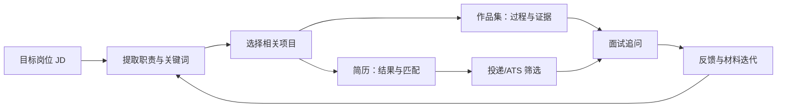
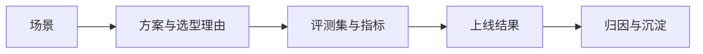

## 简历与作品集：AI 产品经理怎么准备

简历是「能不能过筛」，作品集是「能不能被记住」。AI 产品经理岗位竞争激烈，很多候选人背景相似——都会写 PRD、都「用过 AI 工具」——拉开差距的，往往是两件事：简历里有没有**可量化的项目结果**，以及作品集里有没有**能证明你思考深度的材料**。

本文从简历和作品集两部分展开：先讲简历怎么写（模块结构、量化方法、AI 项目怎么讲、ATS 匹配、一页原则、常见雷区），再讲作品集怎么做（形态、评测报告、承载方式、面试官视角），最后给出虚构但真实感的示例片段与准备节奏。

核心关系是：用 JD 反向组织简历和作品集，简历负责匹配与过筛，作品集负责证据与追问，再用面试反馈持续迭代。

!!! info "时效性"
    本文信息截至 2026-08。求职材料写法与招聘筛选规则变化较快，请结合目标公司的最新 JD 与招聘流程判断。

## 简历：让项目经历「可量化、可追问」

简历的目标不是「把经历都写上」，而是**在有限的篇幅里，让面试官产生三个判断**：你做过相关的事、你带来了可验证的结果、你讲得出细节。围绕这三点，简历的每个模块都服务同一个目的。

### 模块结构

一份 AI PM 简历通常由四块构成，按「与目标岗位的相关性」排序：

1.  **工作经历**：公司、岗位、时间段，每段写「背景 → 我的动作 → 结果（量化）」，而不是职责流水账。社招的筛选和面试几乎都围绕它展开，[社招面经](interviews/social-interviews.md)里有更细的写法。
2.  **项目经历**：**AI PM 简历的核心**。把 1-3 个最有代表性的项目单独展开，每个项目写清场景、方案、评测、上线效果。作品集与项目经历一一对应，面试官会沿着简历深挖。
3.  **技能**：分「产品技能（需求分析、数据分析、PRD）」「AI 相关技能（RAG、Agent、评测、Prompt 工程）」「工具（Figma、SQL、评测平台）」三组。分组写比一条条堆关键词更易读，也让面试官一眼看到你的能力结构。
4.  **教育**：学校、专业、时间段。应届生放最前；社招放最后，一行带过即可。

???+ note "没有正式 AI PM 经历怎么办"
    转岗或应届的候选人，可用**「类 AI 项目」**补位：实习中做的 AI 功能、个人做的 demo、课程项目、甚至用 AI 工具提效的案例。重点是讲出「需求 → 方案 → 评测 → 结果」的完整链路，而不是「做过没有」。参见[入行感悟](insights/newcomers.md)里「技能切入」的路径。

#### 工作经历：每段写「五要素」

每段工作经历建议覆盖五个要素，缺一个都不完整：

-   **背景**：这家公司/这条业务线当时在解决什么问题（一句话）
-   **职责**：你的岗位定位，负责什么范围（不是岗位 JD 复述）
-   **动作**：你做的关键决策与取舍，「为什么这么做」比「做了什么」重要
-   **结果**：量化结果 + 客观归因，哪些来自你的决策、哪些是外部因素
-   **成长**：这一段经历让你沉淀了什么可复用的方法（可写可不写，写了加分）

五要素不是五条都要写满，而是提醒你：**只写「负责 XX」的工作经历没有信息量**。

#### 项目经历：每个项目写「四行结构」

单个项目控制在 3-5 行，按「场景 → 方案 → 评测 → 结果」展开：

-   第一行：项目一句话定位（给谁、解决什么问题、AI 还是非 AI）
-   第二行：你的角色 + 关键方案与选型理由
-   第三行：你怎么验证效果（评测集、指标、迭代方式）
-   第四行：结果（量化）+ 一句话沉淀

这样写出来的项目经历，本身就是面试讲项目的提词器，和[AI 产品经理面试指南](interviews/interview-guide.md)里的 STAR 框架一一对应。

#### 技能：分组 + 按 JD 排序

技能模块的写法有两个原则：

-   **分组展示**：分成「产品 / AI / 工具」三组，让面试官快速建立能力画像；混在一起堆关键词等于没写
-   **按 JD 排序**：把目标 JD 里最看重的技能提到最前。投 Agent 岗就把 Agent、工作流放前面，投 RAG 岗就把 RAG、检索评估放前面

技能列表里的每项都要「**经得起三连问**」：这是什么、你用它做了什么、效果如何。写进技能但不进项目经历的技能，面试官会单独追问。

### 怎么用数字与结果量化项目

量化的本质是把「我做了事」翻译成「我的决策带来了什么变化」。AI PM 最常见的量化维度有四类：

| 维度 | 例子 |
| --- | --- |
| 模型指标 | 评测集准确率从 71% 提到 83%；badcase 率下降 40% |
| 评测分数 | 人工抽检通过率 95%；答案引用准确率 89% |
| 成本 | token 成本下降 62%；单次问答成本从 0.08 元降到 0.03 元 |
| 业务结果 | 客服人工介入率从 45% 降到 18%；首响延迟从 4s 降到 1.2s |

量化写作的句式是「**动词 + 动作 + 数字 + 结果**」：

-   ❌ 负责 AI 客服机器人的优化，提升了用户体验
-   ✅ 负责 AI 客服机器人效果优化，通过 RAG 召回调优 + badcase 回流迭代，**评测集准确率从 71% 提升到 83%，客服人工介入率下降 27%**

数字的选择要「**可验证、有对比**」：尽量给「从 X 到 Y」的区间或百分比，而不是孤立的「提升了 80%」；无法用数字衡量的部分，用「0 → 1 上线」「覆盖 XX 条数据」这类可感知的量替代。**切忌编造数据**——简历上的每个数字都要能讲出出处，面试官追问「数据从哪来」是高频动作。

### 「AI 项目」怎么讲

AI 项目的讲述结构和普通项目不同，面试官更想听的是**你在不确定性中怎么做判断**。一个 AI 项目至少要覆盖三个层次：

1.  **模型选型**：为什么选这个方案（RAG、微调、Agent、还是干脆不引入模型）？效果、成本、延迟、合规之间怎么权衡？这体现的是技术判断力，[AI 产品开发生命周期（CC/CD）](../pm/ai-lifecycle.md)里「先验证再设计」的思路可以帮你组织。
2.  **评测**：你建了什么评测集、定了什么指标、怎么把 badcase 回流到迭代？「我用 200 条种子评测集每周回归」比「我持续优化效果」可信得多。[评估与评测](../ai/evaluation.md)是 AI PM 讲好项目的基础。
3.  **上线效果**：上线后数据怎么变化、出了错怎么兜底、有没有人工接管？主动讲兜底设计，是 AI PM 与普通 PM 的分水岭。

#### 项目的一句话结构

**场景（解决什么问题）→ 方案（怎么做、为什么这么选）→ 评测（怎么验证）→ 结果（量化 + 归因）**。

核心关系是：项目经历把产品判断压缩成一条可追问证据链，面试时再从结果和归因展开细节。

这条结构同时就是面试讲项目的骨架，[AI 产品经理面试指南](interviews/interview-guide.md)里「讲一次你用数据推动决策的经历」可以直接复用。写简历时把每个项目按这个结构压缩成四行，面试准备时再把它展开成 3 分钟的故事，一份材料两头用。

#### 三种候选人的差异化写法

-   **校招 / 应届**：没有正式项目时，用实习、课程设计、个人 demo 补位，突出「学习能力 + 完整走完一个链路」；技能与教育模块占比可以更高
-   **转岗**：把上一段经历里「与 AI 相关」的部分提炼出来——用 AI 工具提效、推动过 AI 功能、自学过评测——并用「类 AI 项目」证明可迁移能力
-   **社招**：结果与增量优先，弱相关的早期经历压缩；每段经历都经得起深挖，因为社招面试就是沿着简历逐个追问

### 关键词与 ATS 匹配

很多公司用 ATS（招聘管理系统，Applicant Tracking System）做第一轮筛选，机器会按关键词匹配度筛简历。应对思路是「**从 JD 反向提取关键词，自然地写进简历**」：

-   JD 出现「RAG」「Agent」「评测」「提示词工程」等能力词，你的简历里要有对应关键词，且最好出现在**项目经历的动词和成果**里，而不是技能清单的孤零零列表
-   岗位方向词（对话产品、企业级 AI、Agent 产品）要在简历里有所体现，与 JD 对齐
-   技术工具（SQL、Figma、评测平台）按 JD 要求排序，最匹配的放最前

要注意，**ATS 匹配的前提是可解析的文本**：导出 PDF 时避免把整块文字变成图片、避免表格嵌套过深、避免用特殊字体导致文字无法被提取。具体岗位的硬门槛与关键词解读见 [AI 产品经理岗位解读](positions/ai-pm.md)。

???+ note "关键词匹配 ≠ 堆砌关键词"
    ATS 匹配是「相关性的信号」，不是「词频竞赛」。在项目经历里自然带出关键词，比在技能栏堆 30 个术语更有效；堆砌被真人面试官看到反而减分。

### 一页原则

「一页原则」的本意是**信息密度**，不是机械地限制页数：

-   应届与 3 年内经验：尽量一页。把与目标岗位最相关的内容放最前，弱相关经历压缩成一行
-   资深候选人：可以两页，但每页都要有「非你不可」的内容，第二页通常放项目深度细节或获奖/专利
-   压缩技巧：删掉「精通 Office」「性格开朗」这类无效内容；每个项目控制在 3-5 行，写不出结果的经历直接砍

判断标准只有一个：**删掉任何一行，剩下的内容是否依然成立？** 如果删掉无关紧要，就说明那一行没有信息量。排版上保持「模块边界清晰、时间线连续、无错别字」——AI PM 的简历本身就是一份「文档能力」的样本。

### 常见雷区

-   **项目罗列无结果**：只写「负责 XX 功能」不写「带来 XX 变化」。这是最普遍的问题，面试官看简历时只找结果
-   **术语堆砌**：RAG、Agent、微调、对齐、幻觉满天飞，但问细节答不出。用术语的前提是能讲清权衡，参考[产品经理黑话速查](../intro/glossary.md)确认每个词的准确含义
-   **把团队成果全揽到自己身上**：面试官最反感这个，追问两句就露馅。写「推动」「牵头」「与 XX 协作」比模糊的「负责」更可信
-   **每一条都经不起追问**：简历是面试提纲，写上去的任何数字和结论都要能展开讲 3 分钟。这是[社招面经](interviews/social-interviews.md)反复强调的硬要求
-   **时间线断裂**：空窗期、离职与入职时间衔接不上，会让面试官怀疑简历的真实性；社招尤其要注意口径统一
-   **格式问题**：错别字、中英混排不规范、页边距混乱。AI PM 的简历出现这些低级错误，会直接影响「文档能力」的判断

### 简历自查清单

投递前把简历逐项过一遍：

-   [ ] 第一屏能否在 10 秒内看到「目标岗位相关 + 量化结果」，而不是个人信息占了大半页
-   [ ] 每个项目经历是否都覆盖「场景 → 方案 → 评测 → 结果」四要素，且结果有数字或可感知的量
-   [ ] 有没有一个「术语」是你不确定能讲清 3 分钟的（有就去掉或补课）
-   [ ] 关键词是否与目标 JD 对齐，且自然出现在项目经历里，而不是只在技能栏堆叠
-   [ ] 时间线是否连续、无空窗或口径矛盾
-   [ ] 导出 PDF 后文字可复制（没有把内容做成图片）
-   [ ] 是否已对 3 个目标岗位各定制一版（而不是一份投到底）
-   [ ] 版式、错别字、中英混排是否经过二次校对

## 作品集：让能力「可见、可带走」

### 作品集 vs 简历的分工

简历是**一页摘要**，回答「你做过什么、结果如何」；作品集是**深度证据**，回答「你是怎么做的、思考过程是什么、细节是否经得起追问」。两者配合使用：

-   **简历负责过筛**：关键词匹配、量化结果、一页原则，目标是让 HR 和面试官愿意约你
-   **作品集负责建立信任**：面试官在面试前或面试中会翻看，用来设计追问、验证简历上的说法
-   **分工原则**：简历里的每个「亮点项目」，作品集里都要有对应的完整材料；作品集里没有支撑的简历亮点，等于给自己埋雷

[职业发展感悟](insights/career.md)把作品集定义为「可带走、不依赖特定平台的能力资产」——它是给**未来的雇主**看的，也是给自己**复盘成长**用的。

### AI PM 作品集的形态

AI PM 的作品集不限于设计稿，五种形态按「AI PM 特色」排序：

1.  **产品拆解**：按拆解框架把一个产品还原成决策过程。这是成本最低、上手最快的形态，框架与案例见[产品拆解](../practice/case-analysis/index.md)。适合展示「产品 sense」
2.  **评测报告**：**最有 AI PM 特色**的形态。把一个模型/方案/产品做一次系统评测，记录评测集构建、指标对比、badcase 分析。这是「数据说话」能力最直接的证明
3.  **Prompt 案例集**：结构化 prompt + 迭代记录 + 效果对比。注意别只贴 prompt 文本，要展示**为什么这么设计、改了什么、效果怎么变化**
4.  **Agent 工作流 demo**：可演示的自动化流程，含任务边界、确认节点、失败兜底。适合展示「把 AI 落地到真实任务」的能力
5.  **数据复盘**：一个项目上线后的复盘文档，含数据变化、归因分析、下一步计划。适合有真实项目经验的候选人

???+ note "不需要五种都做"
    作品集重质不重量。**2-3 个深度作品，胜过 10 个浅尝辄止的合集**。选 1-2 种你最擅长、最贴合目标岗位的形态深耕，比面面俱到更能建立记忆点。

#### 每种形态怎么做

-   **产品拆解**：选一个你真用过、说得清细节的 AI 产品，按定位 → 任务场景 → 技术方案 → 交互体验 → 商业 → 成败归因的框架写 800-1500 字；每部分给「一句话判断 + 一个证据」。直接复用[产品拆解](../practice/case-analysis/index.md)的框架
-   **评测报告**：见下一节「把评测报告做成作品」的完整流程
-   **Prompt 案例集**：选一个真实任务（如「把会议纪要整理成结构化待办」），记录 v1 → v2 → v3 的 prompt 演进、每次改了什么、效果怎么变（用 5-10 条测试输入对比输出）。核心是展示「把 prompt 当代码管理」的工程意识
-   **Agent 工作流 demo**：录一段 3-5 分钟的操作演示 + 一页说明（任务边界、工具、确认节点、兜底策略）。重点是讲清「哪里需要人工确认、失败了怎么办」，而不是展示「多智能体有多炫」
-   **数据复盘**：选一个做过/拆解过的项目，写上线后的数据变化、归因分析、踩坑记录、下一步计划；没有真实项目就写对公开产品/论文数据的二次分析

#### 怎么组织作品集

-   **首页 / 简介页**：你是谁、目标岗位、3-5 个关键词、作品索引（一句话介绍每个作品）
-   **每个作品一页**：背景 → 我的角色 → 方案 → 证据（数据/截图/链接）→ 复盘；控制在 10 分钟内能读完
-   **按目标岗位排序**：投 Agent 岗把 Agent demo 放最前，投评测岗把评测报告放最前
-   **标注日期与版本**：每个作品标注完成时间与所涉模型/工具版本，让「可验证性」可见

### 怎么把「评测报告」做成作品

评测报告是 AI PM 作品集里最「差异化」的一类，也是面试官最愿意花时间看的。一份合格的评测报告至少包含三层：

1.  **评测集构建**：数据从哪来、怎么抽样、怎么标注、覆盖哪些场景。给出「从真实客服日志抽取 200 条问题、覆盖 6 大意图分类、双人标注 + 仲裁」这类细节，比「我建了一个评测集」有说服力得多
2.  **指标对比**：定 3-5 个指标（答案正确率、引用准确率、badcase 率、首响延迟、单次成本），把不同方案/模型/版本放一起横评。用表格呈现，每个指标给出**读得懂的结论**
3.  **badcase 分析**：挑 3-5 个典型 badcase，逐个分析根因（检索召回不精准、上下文截断、幻觉），并给出改进方向。这一步是评测报告的「灵魂」，体现的不只是执行，更是归因能力

#### 评测报告的五步制作流程

1.  **定目标**：这份评测想回答什么问题？（对比两个模型？验证 RAG 改造效果？）先写下一句话结论，再倒推数据
2.  **建评测集**：从真实场景收集问题，覆盖典型与长尾；双人标注标准答案，不一致仲裁；记录标注一致性
3.  **跑指标**：定好 3-5 个指标，逐一跑分；记录模型版本、参数、日期，保证可复现
4.  **badcase 归因**：把失败样本归类、找根因，而不是笼统说「效果不好」
5.  **写结论**：每个指标一句话结论 + 一个证据；最后给出「建议采用哪个方案 + 为什么」

评测方法论可以参考[评估与评测](../ai/evaluation.md)，它同时也是面试概念题的常考内容。写评测报告时记得标注日期与模型版本——AI 能力变化快，**没有日期的评测报告是不可验证的**。

### 承载方式

-   **GitHub**：适合技术向内容——评测脚本、数据样例、可复现的 demo。注意 README 要写得像产品说明，别只有代码
-   **博客**：适合长文复盘与产品拆解。写作本身也是沉淀，参见[案例分析](../practice/case-analysis/index.md)的投稿方式
-   **Notion / 飞书文档**：适合结构化整理，面试时可以直接共享屏幕。重点是把目录组织得清晰，让面试官 10 分钟内能找到重点
-   **PDF 作品集**：适合面试现场携带或邮件附件，内容要自洽、能独立阅读

承载形态不重要，重要的是三件事：**能打开、能讲、有日期**。打不开的链接等于没有；讲不出细节的内容反而减分；没有日期的数据无法验证。

### 给谁看：面试官评审视角

面试官看作品集时，脑子里在跑三个问题：

1.  **这是你做的吗**：会追问细节——评测集怎么建的、badcase 为什么这么归类、数据从哪来的。作品集里任何内容都要能展开讲
2.  **你有判断力吗**：比起「做了什么」，更在意「为什么这么做、为什么不做另一个方案」。作品集里主动写「权衡与取舍」的段落最加分
3.  **你能落地吗**：是不是只停留在「想法」层面？有没有上线、有没有数据、有没有兜底设计？「0 → 1 上线 + 数据复盘」比「概念设计」更有说服力

对应的，做作品集时要刻意做到：**每个作品给一句话结论**（放在开头）、**每个结论给一个证据**（数据/截图/链接）、**每个证据给一个细节**（怎么来的）。这正好与[产品拆解](../practice/case-analysis/index.md)的框架同构。

### 作品集自查清单

-   [ ] 每个作品开头是否有一句话结论，让面试官 30 秒内知道「你在讲什么」
-   [ ] 每个结论是否有证据（数据、截图、链接、可运行的 demo），而不是只有观点
-   [ ] 是否标注了日期与模型/工具版本，让内容「可验证」
-   [ ] 是否主动写了「权衡与取舍」，而不是只报喜不报忧
-   [ ] 是否有 1-2 个 badcase / 失败案例的分析，体现归因能力
-   [ ] 链接是否都能打开、demo 是否能跑、截图是否清晰
-   [ ] 是否按目标岗位排序，把最相关作品放最前
-   [ ] 自己能否对着作品集讲满 10 分钟而不跑题

## 示例片段

以下示例为虚构，仅展示写法，供对照参考。

### 简历项目经历片段

> **项目经历 · 某在线教育公司 · AI 产品经理　2024.03 - 2025.08**
>
> **AI 课程智能问答助手（从 0 到 1，RAG 方案）**
>
> -   负责需求定义与模型选型：对比 GPT-4o 与两款国产开源模型在评测集上的准确率、成本与延迟，选定「开源模型 + RAG」组合方案，单次成本降为闭源方案的 1/4
> -   搭建 200 条种子评测集，建立「答案正确率 + 引用准确率 + badcase 率」三指标评估体系，每周回归迭代
> -   上线后客服人工介入率从 45% 降至 18%，首响延迟从 4s 降到 1.2s，token 成本下降 62%
> -   沉淀评测方法论并在部门推广，成为后续 3 个 AI 项目的评测基线

这段片段同时覆盖了：模型选型（为什么这么选）、评测（怎么建、怎么迭代）、上线效果（三个量化结果）、方法论沉淀（影响力）。面试官可以沿着任意一条追问，都有内容可讲。

### 应届 / 转岗简历片段

> **项目经历 · 个人项目 · 2025.10 - 2026.01**
>
> **「二手书估价」AI 助手（独立完成，从 0 到 1）**
>
> -   用公开数据整理 800 条二手书交易记录作为评测集，双人标注「估价合理 / 偏高 / 偏低」三档标签，标注一致性 88%
> -   对比「纯 Prompt + 规则提取」与「RAG + 图书数据库检索」两套方案：RAG 方案估价准确率 79% vs 纯 Prompt 方案 61%，badcase 率下降一半
> -   用 Gradio 搭建可交互 demo，录制 3 分钟演示视频，整理成 1500 字复盘发布在个人博客
> -   收获：完整走通「需求 → 方案 → 评测 → 上线」链路，学会用评测数据而不是感觉做判断

这个片段展示了应届/转岗候选人如何用**个人项目**证明 AI PM 能力：没有公司资源，但评测集、方案对比、demo、复盘全链路完整，且每个结论都有数据支撑。

### 作品集片段（评测报告）

> **《RAG 知识库问答评测：3 类检索方案对比》（2026-06，评测对象为课程知识库问答助手）**
>
> -   **评测集**：从真实客服日志抽取 200 条问题，覆盖 6 大意图分类；双人标注标准答案，不一致项由第三人仲裁，标注一致性 92%
> -   **指标**：答案正确率、引用准确率、badcase 率、首响延迟、单次成本
> -   **结论**：BM25 + 向量混合检索在答案正确率上最优（较纯向量方案 +11%），纯向量方案在长尾问题上 badcase 更多；混合方案成本仅增加 8%
> -   **badcase 分析**：3 个典型案例，定位「检索召回不精准」「上下文截断导致引用缺失」「模型对否定问句理解偏差」三类根因，并给出对应改进方向

这份报告把「评测集怎么来、指标怎么定、结论怎么得、坏例怎么归因」讲全了，是一份**可验证、可追问**的 AI PM 作品。

## 常见疑问

### 简历要不要放照片、年龄、籍贯？

国内简历没有统一强制要求，但**与岗位能力无关的个人信息可以省**。放不放照片看行业惯例与个人意愿；年龄、籍贯、婚姻状况等信息与能力评估无关，不写不影响筛选。把版面留给项目和结果，性价比更高。

### 要不要做英文简历？

取决于目标公司：外企、出海业务、有海外背景的团队通常需要英文简历；纯国内业务一般不需要。需要时建议**中英两份分开维护**，避免中英混杂。英文简历的量化表达与关键词匹配逻辑相同，只是语言不同。

### 作品集要不要做成独立网页？

**不必**。GitHub、博客、Notion、PDF 都行，关键还是「能打开、能讲、有日期」。独立网页在展示 demo 和排版上有优势，但制作成本高、维护麻烦；内容深度不够时，形式再漂亮也撑不住追问。

### 没有真实数据，评测报告怎么做？

用公开数据或脱敏数据：从公开数据集、评测榜单、社区案例中取材，做二次分析与复现评测；数据来源与处理方式在报告中如实标注。**「没有真实项目」不等于「没有可做的评测」**，关键在于把评测的完整流程走通并讲清楚。

## 准备节奏

1.  **先做作品，再写简历**：没有可展示的项目时，先按[产品拆解](../practice/case-analysis/index.md)做 1-2 个拆解、按[评估与评测](../ai/evaluation.md)做一次小评测，再动笔写简历——简历上的亮点需要有作品集支撑
2.  **简历按目标岗位定制**：每轮投递前，对照目标 JD 调整关键词与项目排序，而不是一份简历投到底
3.  **投递时用上内推**：简历过筛是概率游戏，内推能显著提高被看到的概率，渠道与注意事项见[内推机制](referral.md)
4.  **面试前用简历做模拟**：把简历上的每个项目按「场景 → 方案 → 评测 → 结果」讲一遍，对着[面试指南](interviews/interview-guide.md)查漏补缺
5.  **每半年更新一次作品集**：把做完的项目沉淀成拆解或复盘，让作品集始终反映你当前的能力上限

### 按求职阶段的时间安排

-   **准备期（2-4 周）**：先补方法论（评测、AI 基础），做出 1 个作品集作品，同步整理简历初稿
-   **打磨期（1-2 周）**：简历针对 3-5 个目标岗位各定制一版；作品集按目标岗位排序、补齐「一句话结论」
-   **投递期（持续）**：边投边改，把面试中被追问的高频问题回填到简历和作品集里，越改越扎实
-   **面试期**：用[面试指南](interviews/interview-guide.md)的框架讲项目，作品集作为「证据库」随时取用

## 相关阅读

-   [AI 产品经理岗位解读](positions/ai-pm.md)：岗位方向、典型 JD 与能力要求
-   [AI 产品经理面试指南](interviews/interview-guide.md)：题型结构与答题框架
-   [社招面经](interviews/social-interviews.md)：简历与讲项目方法、背调与离职交接
-   [内推机制](referral.md)：内推渠道、写法与注意事项
-   [产品拆解](../practice/case-analysis/index.md)：作品集的基础形态与拆解框架
-   [评估与评测](../ai/evaluation.md)：评测集构建与指标设计
-   [AI 产品开发生命周期（CC/CD）](../pm/ai-lifecycle.md)：项目从想法到上线的完整链路

## 来源说明

本文为本站原创整理，基于公开的求职方法论与 [AIPM Wiki 简历/作品集讨论](https://github.com/archlizheng/AIPM-Wiki)（CC BY-NC-SA 4.0）的通用建议综合撰写，示例片段均为虚构。欢迎通过[如何参与](../intro/htc.md)投稿更多简历与作品集经验。
