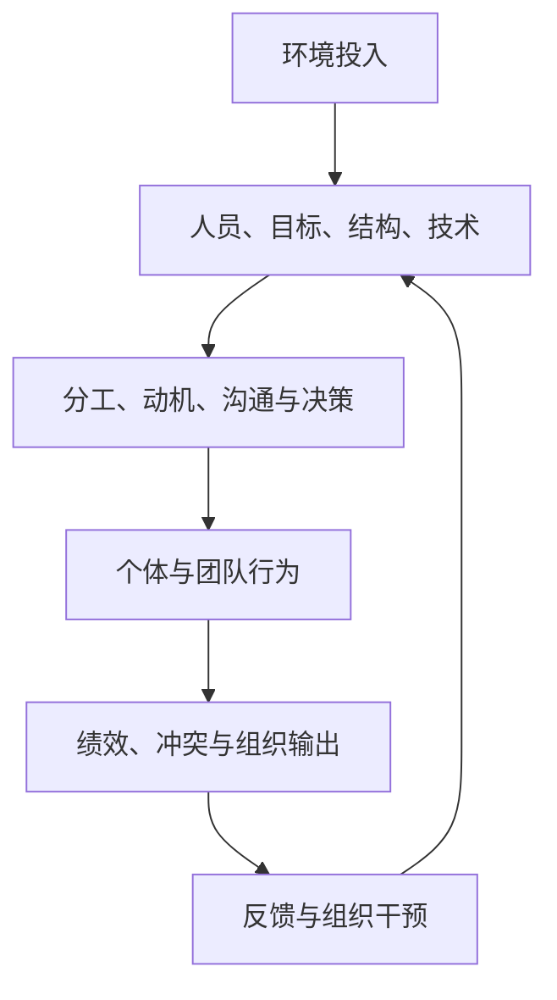

## 组织行为学

> 从组织系统与个体行为出发，理解绩效、动机、压力、团队协作和管理干预如何共同塑造组织有效性。

## 课程概览

组织行为学（Organizational Behavior，OB）研究组织中的个体行为、群体行为及其对组织运行结果的影响。课程材料从“组织为什么存在”开始，先建立人员、目标、结构、技术四要素与输入—转换—输出框架，再逐步进入个体差异、知觉与归因、能力与绩效、压力与动机，最后延伸到公平、文化、群体、团队、权力和冲突。

这套知识的管理价值在于把“人不努力”“团队不配合”“需求总变”“指标没有效果”等模糊判断拆成可观察的问题：目标是否清晰，岗位与能力是否匹配，动机是否被正确激发，反馈是否可靠，结构与技术是否支持协作，制度是否制造了额外压力。课堂强调，管理者的职责不是替所有成员做决定，而是配置资源、设计工作和协调行为，让个人努力转化为组织需要的结果。

本页是对课堂笔记的综合整理。标注“课堂强调”的内容，指源笔记明确记录的课堂模型、案例或判断；没有特别标注的段落，是基于多讲材料进行的结构化综合，不等同于某一讲的原话或经过外部验证的普遍定律。

> 核心关系：组织通过人员、目标、结构和技术把环境投入转成行为与绩效，反馈再推动组织要素调整。

## 知识地图

- **组织与系统**
    - 组织由人员、目标、结构和技术构成。
    - 组织从环境获得投入，经由内部转换产生产品、服务或其他输出。
    - 组织有效性同时涉及结果价值、资源利用、内部协调和环境适应。
- **研究与判断**
    - 用观察、访谈、问卷、测验和实验获取证据。
    - 区分自变量、因变量、中介变量和调节变量。
    - 在解释行为时检查研究伦理与管理伦理，避免用个别故事替代证据。
- **个体与行为**
    - 个性包括心理倾向与心理特征，性格、能力、气质回答不同问题。
    - 大五人格和霍兰德职业类型提供差异与匹配的分析线索。
    - 知觉经过选择、组织和解释；归因需要在个体因素与情境因素之间保持区分。
- **绩效、动机与压力**
    - 课堂用 \(P=M\times A\) 表示绩效受到动机与能力共同影响。
    - 需要—动机—行为—结果链条解释努力从何而来、指向何处。
    - 压力受事件、认知评价、个人资源和环境匹配共同影响，组织应同时提供制度与情感支持。
- **群体与组织干预**
    - 规范、角色、沟通、权力和文化塑造团队行为。
    - 任务冲突、关系冲突和过程冲突需要不同处理路径。
    - 强化、绩效、公平与福利设计必须兼顾效率、协作、尊严和长期动机。

## 核心框架

### 组织的四要素与输入—转换—输出

课堂以 Leavitt 组织框架说明，组织至少包含四个相互依赖的要素：

- **人员**：成员的知识、能力、需要和行为。
- **目标**：组织希望实现的结果，以及协调行动的方向。
- **结构**：分工、层级、权责、沟通链条和协调关系。
- **技术**：工作流程、工具和把投入转化为产出的方式。

目标变化可能要求结构、人员能力和技术同步调整；技术变化也会改变分工和岗位要求。组织不能只改一个要素，再期待其他要素自动适配。

组织与环境之间持续进行输入—转换—输出：

\[
\text{环境投入} \longrightarrow \text{组织内部转换} \longrightarrow \text{产品或服务输出}
\]

输入包括人员、资金、信息、知识和技术；转换包括分工、管理、沟通、决策和生产服务；输出要接受客户、社会或其他外部环境的检验。由此，本页综合出一个诊断顺序：先确认外部需要的结果，再追溯内部流程和协作，最后检查人员、结构、技术与目标是否匹配。

### 科学研究、变量与证据边界

课堂把组织行为学与直觉化的“看人下结论”区分开来。研究问题需要明确变量、可检验的解释和相对规范的过程。常用方法各有适用范围：观察法适合了解自然情境中的行为过程，访谈法提供深入经验，问卷便于比较和统计，测验要求稳定性与有效性，实验更有利于分析因果但可能与真实组织存在差异。

变量关系可以按以下方式理解：

- **自变量（X）**：关注的原因或影响因素。
- **因变量（Y）**：需要解释或预测的结果。
- **中介变量（M）**：解释 X 如何影响 Y 的机制。
- **调节变量（W）**：改变 X 与 Y 关系强弱或方向的条件。

\[
X \longrightarrow M \longrightarrow Y，\qquad Y=f(X\mid W)
\]

例如，某项管理制度可能先改变动机、知觉或态度，再影响绩效；同一种制度在不同岗位、群体或环境下也可能表现不同。课堂还以米尔格拉姆服从实验提示研究伦理：效率与知识价值不能覆盖知情、自主和潜在伤害。

### 个性、能力与岗位匹配

课堂用“复杂人假设”提醒管理者：人的需要、态度和行为会随个人、时间和情境变化，不能用单一的经济利益或固定人格解释所有行为。个性具有独特性、相对稳定性和整体性，同时会受遗传、社会、文化和境遇影响。

- **性格**：对现实、他人和自身的稳定态度及相应行为方式，侧重“通常如何对待”。
- **能力**：完成活动并影响效率的心理条件，侧重“能否完成、完成得如何”。
- **气质**：心理活动在速度、强度、稳定性和灵活性上的动力特征，侧重“以什么节奏表现”。

大五人格可用于提出岗位与团队问题：尽责性关系到交付可靠度，情绪稳定性关系到抗压与团队氛围，外向性可能适合高频对外互动，宜人性有助于合作但不应压制必要异议，开放性可能更适合创新和学习要求高的任务。课堂同时强调，性格测试只能提供线索，不能代替实际任务、持续表现和岗位情境观察。

能力管理可按“求才、用才、育才、留才”展开。实际能力是当前可以表现的能力，潜能是在机会、训练和适当环境下可能发展出的能力。Katz 模型将管理者能力分为技术能力、人际关系能力和概念能力；职位越高，概念能力通常越重要，但各层级都离不开人际关系能力。课堂还用彼得原理提醒：依据当前岗位成绩持续晋升，可能把成员推到其不能胜任的职位。

### 知觉、印象与归因

知觉不是对事实的被动复制，而是“选择—组织—解释”的主动过程。图像—背景、接近性、相似性、连续性和闭合等格式塔原则说明，观察者会把零散线索组织成整体。对人的判断还会受仪表、表情、语言、姿态、关系、文化背景、经验和期待影响。

常见社会知觉效应包括首因效应、近因效应、光环效应、刻板印象、对比效应和定势。它们可以提高判断速度，也可能让面试、绩效评价或冲突处理过度依赖有限线索。归因时可使用三个层次的提醒：

- **海德的内部／外部归因**：区分能力、性格、努力等个体因素与任务难度、制度、资源等情境因素。
- **Kelley 的特殊性—一致性—一贯性**：检查行为是否只在该情境出现、他人是否也如此、个体是否持续如此。
- **Weiner 的成就归因**：从能力、努力、任务难度和运气等因素分析，并考虑稳定性与可控性。

基本归因错误、自利偏差和行为者—观察者偏差都会影响管理判断。分析迟到、绩效下降或争执时，应同时查验个人行为、任务条件、资源、制度和关系环境。

### 绩效、强化与公平

课堂用 \(P=M\times A\) 说明能力与动机共同作用：有能力但缺乏动力，能力不会自动变成绩效；有动力但能力不足，也难以完成任务。激励设计至少要解决努力强度、努力持续性和努力方向三个问题。努力很多但方向错了，仍不能创造组织需要的结果。

需要—动机—行为—结果模型把激励过程串联起来。内容型理论提供不同的需要视角：

- **马斯洛需要层次理论**：从生理、安全、社交、尊重到自我实现，课堂版本强调需要有层次，已满足的需要动力作用下降。
- **奥尔德弗 ERG 理论**：把需要归为存在、关系和成长，允许跨层追求，也允许高层次受挫后回归低层次。
- **麦克利兰成就需要理论**：关注成就、权力和合群需要；高成就需要者倾向于接受挑战、承担适度风险并重视结果反馈。
- **赫茨伯格双因素理论**：薪水、福利和环境等保健因素主要减少不满意；成就、认可、责任和成长等激励因素更直接带来满意与投入。课堂同时记录了该理论研究方法受到质疑的讨论。

强化理论从行为后果入手：正强化和负强化增加行为，惩罚降低行为，消退则是不再提供强化。组织行为矫正（OB Mod）可以按“识别关键行为—测量—分析原因—实施强化—评估变化”操作，但课堂明确讨论了算法控制、公开排名、末位淘汰、过度竞争和外部奖励挤压内在动机的风险。公平不仅是分配结果，还包括程序、互动和信息；规则透明、执行一致、解释决策和提供反馈渠道，才有助于维持信任与合作。

### 压力、资源与组织支持

课堂把压力定义为面对要求、限制、威胁或重要事件时的身心紧张状态。压力可能在适度水平上提高注意和投入，但长期或过度压力可能造成生理、心理和行为损耗。Yerkes–Dodson 定律被课堂用于说明压力与绩效可能呈倒 U 型关系；一般适应综合征则把压力反应分为警觉、阻抗和枯竭阶段。

Lazarus 认知评价理论区分初级评价、次级评价和再评价；个人—环境匹配理论关注个人能力、需要与环境要求、资源和回报是否相称；资源保存理论强调时间、精力、金钱、社会关系、身份、能力和心理能量等资源的获得、保持与损失循环。由此，压力干预不能只要求员工“调整心态”：

- **个人层面**：处理压力源，调整目标和认知，接纳并表达情绪，维护睡眠、营养和运动，建立社会支持，必要时寻求专业帮助。
- **组织层面**：改善人岗匹配和工作设计，校准工作量、权责和资源，减少不必要的持续变动，建立正式与非正式沟通渠道，提供休假、职业支持、健康促进和 EAP。

制度支持与情感支持需要同时存在。只安慰而不改制度，结构性压力会继续；只改制度而不提供尊重和关怀，成员仍可能感到被工具化。

### 群体、团队、权力与冲突

群体规范规定哪些行为被鼓励、容忍或惩罚，因而影响信息共享和绩效。团队围绕共同目标形成相互依赖和协作责任，角色分工可以减少重复与空缺，但过度固化会限制互助和创新。心理安全让成员敢于提问、承认错误和提出异议，是发现风险的条件之一。

冲突至少要区分：

- **任务冲突**：围绕目标、事实和方案，可通过论证与信息补充处理。
- **关系冲突**：围绕情绪、人际评价和信任，需要同时修复关系。
- **过程冲突**：围绕分工、资源、流程和决策权，需要调整职责与机制。

权力不只来自职位，也可能来自资源控制、专业知识和关系网络。权力不对称会影响谁能发言、谁被倾听以及谁能改变决策。课堂综合材料指向一条干预路径：澄清目标和事实，区分利益与情绪，明确角色、资源和反馈规则，再选择合作、妥协或其他处理方式。

## 面向 AI 与产品经理的实践用法

### 1. 用四要素诊断 AI 产品团队

当一个 AI 产品项目交付不稳定时，不要先把问题归因于某个人。依次检查：

- **目标**：产品目标、用户价值和成功指标是否被团队共同理解。
- **人员**：产品、算法、工程、设计和运营的能力是否覆盖任务，是否存在明显人岗错配。
- **结构**：谁决策、谁负责、谁提供输入、谁验收，权责和沟通链条是否清楚。
- **技术**：模型、数据、评测、工具链和发布流程是否支持目标，是否把不成熟的技术要求转嫁给成员。

这套检查把“执行力问题”转化为组织系统问题，适合用于项目复盘和跨职能协作诊断。

### 2. 把实验结果拆成变量关系

AI 功能上线后指标变化，不应直接写成“功能导致转化提升”。先区分自变量、因变量、中介和调节条件：功能改动是 X，激活或留存是 Y，理解成本、信任或工作流嵌入可能是 M，用户类型、任务复杂度、模型版本和渠道可能是 W。产品经理据此设计埋点、分层分析和对照实验，避免把相关性写成因果关系。

### 3. 用动机与公平框架设计指标

为标注、客服、内容审核或销售团队设计 AI 辅助流程时，同时问三件事：成员是否更愿意投入，努力能否持续，努力是否指向真正有价值的结果。指标要给出及时、稳定、公平的反馈，防止团队只追逐可计量数字而忽略质量、协作与用户安全。

课堂关于外卖骑手算法控制和绩效排名的讨论，转化到 AI 产品时意味着：不要只优化响应速度、调用量或完成率，还要检查是否诱发规避规则、牺牲安全、互相拆台或损害内在动机的行为。

### 4. 把用户研究当作知觉与归因问题

用户反馈是被选择、组织和解释后的信息。访谈、问卷和行为数据应互相校验；分析用户流失时，不能只做基本归因错误，把问题归结为“用户不会用”。使用 Kelley 的三个线索追问：问题是否只出现在某一场景，其他用户是否也遇到，是否在多个版本或时间点持续出现。

### 5. 用个体差异改进团队与岗位设计

产品团队不需要把所有成员塑造成同一种性格。外向与表达优势可以支持用户访谈和对外沟通，尽责与稳定性可以支持质量保障，开放性可以支持探索与创新，谨慎与风险意识可以支持安全评审。人格测验只用于提出假设，最终仍要用实际任务、交付结果和持续反馈判断匹配度。

### 6. 把压力管理纳入 AI 产品运营

模型迭代、线上事故、需求变更和多方评审会形成持续压力。产品负责人可以通过缩小目标周期、明确决策权、设置发布闸门、安排轮值与休息、提供复盘和心理支持来减少资源损失。高压不应被当作“高绩效文化”的充分证据；如果压力已经表现为持续耗竭、冲突、缺勤或离职倾向，应同时检查组织结构与工作设计。

### 7. 处理团队冲突时先分型

评审中出现分歧，先判断争议属于方案事实、关系信任，还是流程资源与权限。对任务冲突补证据、做实验；对关系冲突修复承诺和互动；对过程冲突明确责任、优先级、资源和决策机制。这个分型可以减少把技术问题个人化，也能让 AI 安全、产品取舍和上线节奏进入可讨论的共同框架。

## 课程与来源覆盖

本页综合了源目录“组织行为学”下的 16 份课堂笔记，覆盖以下内容：

- **2026-03-03、2026-03-05**：组织行为学研究范围、Leavitt 组织框架、输入—转换—输出与组织有效性。
- **2026-03-10**：科学研究方法、变量关系、研究伦理、人性假设、X 理论与 Y 理论、科学管理与霍桑研究。
- **2026-03-12、2026-03-17**：复杂人假设、个性结构、性格、能力、气质、大五人格、霍兰德职业类型、性格管理与人岗匹配。
- **2026-03-19**：能力与绩效、\(P=M\times A\)、实际能力与潜能、Katz 管理者能力、德行与能力、彼得原理、面试印象。
- **2026-03-24、2026-03-26**：印象管理、Goffman 前台／后台、知觉过程、格式塔原则、社会知觉效应、归因理论与归因偏差。
- **2026-03-31、2026-04-02、2026-04-07**：压力定义与后果、倒 U 型关系、认知评价、资源保存、个人与组织压力管理、工作期望、强化理论和 OB Mod。
- **2026-04-09**：激励的三个目标、需要—动机—行为模型、马斯洛、ERG、麦克利兰、赫茨伯格、组织类型与福利调研。
- **2026-04-14、2026-04-16**：组织公平、绩效管理、工作动机、组织文化。
- **2026-04-21、2026-04-23**：群体规范、团队、冲突类型、权力、沟通、压力与组织干预。

## 材料说明与局限

- 本页依据上述课堂笔记综合撰写，没有补充外部教材、论文或企业一手资料。模型名称和定义以笔记记录的课堂版本为准，不能替代完整教材或原始研究。
- 多份笔记由自动中文字幕整理。源笔记已对部分课次标注术语、案例人物和数据可能存在识别误差，本页保留其主题，但没有把未确认细节扩展成确定事实。
- 2026-03-05 的字幕较短，相关组织框架主要依据同名 PDF 课件标题和图示整理；这里将其作为课堂材料覆盖，不把未清晰读取的市场主体数据写入正文。
- 2026-04-07 的“理想工作”调研包含 40 名在职人员样本，课堂已提示在职样本可能存在幸存者偏差，性别、工龄与职业差异只能视为该课堂展示的观察，不能推广为总体规律。
- 课堂记录的“按计酬职工发挥 20%—30%、充分激励后 80%—90%”等数字，以及企业激励、福利和算法管理案例，均以课堂陈述或小组展示为来源，未在本页独立核验，不应直接作为通用预测或管理处方。
- 马斯洛、赫茨伯格、强化理论等模型用于帮助提出管理问题。源笔记也记录了双因素理论研究方法受到质疑、外部奖励可能挤压内在动机等边界，实际决策应结合岗位、组织、样本和制度环境。
- 压力管理部分讨论组织支持与心理健康，但不提供医学诊断。持续或严重的心理困扰应寻求合格专业人员帮助，不能只依赖组织行为模型。

## 使用这门课的复习顺序

1. 用人员、目标、结构、技术和输入—转换—输出描述组织。
2. 用变量关系、个体差异、知觉和归因检查自己的判断证据。
3. 用能力、动机、公平和压力解释绩效，不把结果直接归因于态度。
4. 用规范、角色、权力和冲突类型定位团队问题。
5. 用工作设计、反馈、激励、支持和伦理边界提出组织干预。
