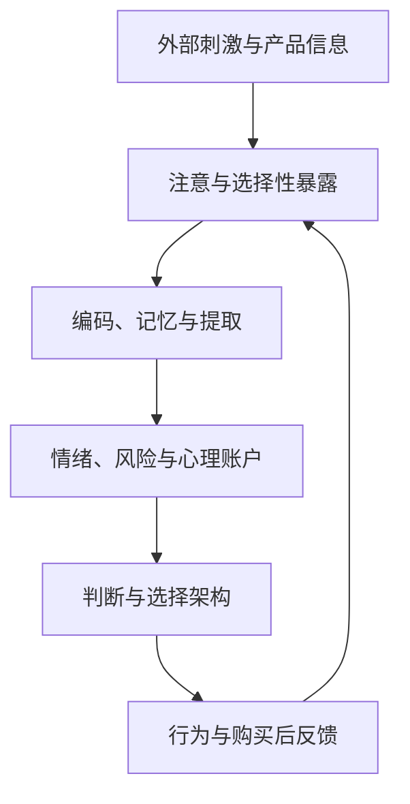

## 消费者信息处理与决策

> 研究消费者如何在有限注意、信息不完全和社会情境中理解线索、形成判断并作出选择。

## 课程概览

消费者并不是把外部信息原样接收后再进行完全理性的计算。信息要经过注意选择、感知加工、心理表象、记忆提取、情绪反应、社会解释和价值权衡，才可能影响判断与行动。

课程可以用一条加工链概括：

$$
\text{外部线索} \rightarrow \text{注意与感知} \rightarrow \text{知识/表象激活} \rightarrow \text{评价与情绪} \rightarrow \text{选择或延迟}
$$

这条链条还受到价格、风险、身份、群体、文化、时间压力和已有经验的调节。课程同时训练研究者区分三件事：观察到的选择是什么、可能的心理机制是什么、证据是否足以支持因果结论。

> 核心关系：消费者信息决策关注刺激如何经过注意、记忆和情绪加工，最终影响判断、选择及后续反馈。

## 知识地图

### 一、消费者研究的证据逻辑

**研究问题**应先于技术和结论。一个可执行的问题至少需要明确：

- 研究对象和消费情境是什么；
- 操纵或比较了什么信息、产品或社会线索；
- 观察什么结果，是选择、反应时间、回忆、态度还是生理反应；
- 哪些因素需要控制，哪些替代解释仍然存在；
- 结论适用于哪些样本、任务和时间范围。

**实验**通过操纵自变量、尽量控制其他条件并观察结果变量来检验因果关系。课堂材料反复提醒，相关关系不自动代表因果关系，学生汇报、课堂互动、单次选择和自我报告尤其需要说明局限。

### 二、启动、知识可及性与无意识线索

- **启动（priming）**：先前接触的概念或刺激提高相关知识的可及性，使其更容易被提取并影响后续判断或行为。
- **基本机制**：

  $$
  \text{先前刺激} \rightarrow \text{相关知识可及性提高} \rightarrow \text{后续判断或行为改变}
  $$

- 启动不要求消费者明确意识到自己被影响。快速闪现的词语、面孔、品牌、价格、产品类别、位置和动作，都可能成为情境线索。
- 课堂用老年相关词语、非裔/白人面孔和快速闪现演示讨论社会刻板印象与潜意识加工。具体实验结果、复制性和外推范围应以原始论文为准，不能把一次课堂演示当作普遍必然效应。
- **被试内与被试间设计**：同一参与者前后比较可以控制个体差异，但易受疲劳、任务顺序和情境变化影响；随机分组的被试间设计有助于降低前测对后测的污染。研究设计的选择应服务于排除具体替代解释。
- **具身认知**：身体姿势、空间位置、动作和环境对象可能参与信息加工。它不意味着身体线索可以直接“读心”，而是说明行为解释不能完全脱离身体和情境。
- **外围线索**：未被主动注意的词语、位置和语境可能提高某些选项的可及性。影响通常是概率性的，不是对消费者选择的百分之百控制。

### 三、购物动量、心态与心理账户

#### 1. 购物动量

购物动量指消费者完成第一次付费购买后，继续购买的可能性上升。课堂把机制拆成中介模型：

$$
X\;(\text{第一次购买}) \rightarrow M\;(\text{购买/实施心态}) \rightarrow Y\;(\text{后续购买})
$$

第一次购买与“获得一个物品”不是同一件事。课堂实验通过付费购买、免费获得和无购买任务的比较，讨论后续购买的增加是否来自购买行为本身，而不是单纯来自心情变好。另一个任务把“为什么买”与“如何买”区分开，说明购买可能提高实施性思考的可及性，使人更容易从审议转入执行。

这些是课堂对实验逻辑的整理，不应脱离原论文把课堂报告的比例直接当作稳定的总体规律。

#### 2. 心理账户

心理账户是消费者对资源进行主观分类的方式。总金额相同，不代表消费者感到可以自由支配的金额相同：

$$
\text{总资源相同} \not\Rightarrow \text{主观可支配性相同}
$$

当一次购买耗尽某个心理账户，下一次购买可能被感知为突破边界，即使另一个账户仍有余额。心理账户因此可以解释预算、优惠券、积分、奖金和不同收入来源为何产生不同消费反应。

#### 3. 心态溢出与程序性知识

- **心态（mindset）**：在一个任务中形成的处理标准或决策倾向，可能迁移到之后的任务。
- **程序（production）**：经过反复学习后由刺激自动引发的动作或反应序列。
- **心态溢出**：情境 A 中激活的处理方式进入情境 B，改变选择、比较或评价。
- **变色龙效应**：个体无意识模仿互动对象的姿势、动作或表情，是课堂用于说明程序性反应的例子。
- **来源遗忘**：消费者记住内容，却忘记何时、从哪里、通过谁接触到内容。熟悉感可能因此被误判为知名度、可信度或普遍共识。

产品沟通应尽量保留信息来源、更新时间和证据层级，避免把重复曝光制造的熟悉感包装成独立可信度。

### 四、视觉与语言信息加工

#### 1. 视觉感知不是被动复制

光线经过视网膜感光细胞转化为神经信号，再经视觉皮层结合注意、经验和情绪形成心理表象。课堂区分：

- **视杆细胞（rods）**：在低光照下更活跃，主要加工明暗；
- **视锥细胞（cones）**：在较强光照下参与颜色和较高空间分辨率的加工。

这些是视觉系统的基础教学概括，不应将整个消费判断归因于单一细胞或单一脑区。

同一刺激可能产生不同知觉。观察距离、视力、背景、既有经验和注意方式，会使消费者在同一图片、包装或广告中先看到不同的内容。视觉信息进入大脑后形成的是主观印象，而不是未经加工的客观副本。

#### 2. 视觉与语言的编码不对称

- 图片通常可以直接提供颜色、形状、动作和空间关系，不必先翻译成完整语言。
- 语言描述会通过语义加工，并可能自动形成视觉心理表象。
- 视觉线索在动作、方向和空间关系上往往更快触发心理模拟；但视觉并不自动等于更容易理解，抽象概念仍需要清晰文字和任务目标。
- 视听结合可能帮助理解与记忆，但实际效果取决于任务、材料、注意和个体差异。

#### 3. 心理表象与情境细节

课堂通过“兔子在大象旁边/苍蝇旁边”“穿上/脱下毛衣”和熟悉/不熟悉空间视角等实验，说明阅读文字时，消费者可能形成带有大小、空间、动作和观察者视角的心理图像。反应时间差异可以作为心理表象存在的间接证据。

这类实验的关键是加工过程，而非具体数字。没有完整方法、样本和统计信息时，不能把课堂报告的反应时直接推广到所有读者。

### 五、视觉隐喻、广告理解与产品属性

#### 1. 视觉隐喻的推理

视觉隐喻把熟悉对象的某个属性带入产品广告，帮助消费者推断目标产品属性：

$$
\text{隐喻对象的可提取属性} \cap \text{产品可承载的属性}
\rightarrow \text{目标属性理解}
$$

隐喻对象可能包含多个属性。若产品线索不足，消费者无法确定广告要表达耐久、轻薄、动力、环保还是其他概念。因此，创意不是越隐晦越好，必须与产品属性和加工目标匹配。

#### 2. 三类产品属性

1. **视觉属性**：外观、颜色、形状和尺寸，可以直接从图片获得；
2. **非视觉但可感知属性**：轻、柔软、温度、触感等，需要其他感官或情境线索；
3. **纯概念属性**：准确、可靠、多功能、耐久或环保，需要语言、证据或明确的加工目标。

课堂讨论的方向是：视觉隐喻对非视觉感知属性可能最有帮助；纯概念属性仍较依赖文字说明和定向理解。

#### 3. 视觉隐喻与语言隐喻

- **视觉隐喻**倾向于提高目标属性的可及性，让相关概念更快进入判断；
- **语言隐喻**需要在多个可能属性之间检验并抑制不合适的联想，作用可能更间接；
- **偶然加工**时，消费者没有明确理解目标，隐喻未必改变抽象属性判断；**定向加工**时，消费者主动理解广告，视觉隐喻的帮助可能更明显。

#### 4. 问题焦点与解决方案焦点

广告是问题聚焦还是解决方案聚焦，取决于产品功能，而不只取决于画面情绪：

- 对咖啡，疲倦可能是问题，清醒是解决方案；
- 对安眠产品，清醒可能是问题，睡眠是解决方案。

产品与目标属性关联很强时，问题聚焦可能更容易让消费者识别需要；关联较弱或方向不明显时，解决方案聚焦可能更直接。结论需结合产品类别、消费者目标和实验条件。

### 六、秩序、相似性与集合完成

消费者不只比较单件产品的功能、价格和质量，也可能判断它是否补全一个集合、是否保持视觉秩序、是否与已有物品构成系列。

- 颜色重复、排列混乱或成套线索会改变选择标准；额外数量不一定弥补结构上的不协调。
- 消费者认为什么是“有秩序”，取决于当前关注的维度，例如颜色或形状的显著性。
- 当消费者相信已有物品来自同一套时，集合完成动机可能提高对同系列新物品的选择。
- 已有系列越多样，新增物品可能被视为扩展系列的机会；这一方向来自课堂实验情境，不能推广为“相似性总会降低收藏意愿”。

对电商、货架和内容推荐而言，系列结构、相邻选项、颜色布局和标签会参与价值判断，应把它们当作选择环境的一部分。

### 七、情绪、尴尬与体验价值

#### 1. 情绪作为信息

情绪、心境和情感需要区分。课堂从尴尬这一具体情绪展示如何提出可检验问题：

- **尴尬**是自我意识和社会性情绪；产品性质本身不一定足以引发尴尬，想象中的社会在场也可能发挥作用。
- 尴尬消费者可能减少与服务人员互动，选择人少的场所，或购买其他商品掩饰真实目的。
- 课堂介绍“护面”实验，讨论尴尬后对更大、更暗太阳镜、护面和修护面部产品的偏好，以及护面与真正恢复社交意愿之间的差异。
- 在不能逃避互动时，课堂还讨论把服务提供者感知为更机械、较少心智的短期应对机制。该部分涉及课堂合作研究，研究年份、合作者和统计细节按课堂笔记记录，不能替代原论文核验。
- 当消费者目标是建立长期关系时，这种短期应对效应可能减弱。服务设计应区分一次性匿名交易和需要持续信任的关系。

#### 2. 物质消费与体验消费

课堂整理的研究讨论指出，体验型购买可能更值得回忆、更具对话价值、更不可比，也更接近自我叙事；物质型购买更容易受到价格、替代品和社会比较影响。它不是“体验一定更幸福、物质一定不幸福”的普遍定律。

产品经理可以把价值拆成：当下功能、过程体验、社会互动、身份表达、记忆价值和购买后的后悔风险，而不是只看成交时刻的支付意愿。

### 八、价格、风险、社会信息与选择

课程后期笔记将以下因素作为消费者判断的常见线索：

- **价格**：可能被解释为质量、稀缺、身份和风险，也可能代表更高财务成本。参照价格、品牌和品类决定价格如何被理解。
- **风险**：财务、功能、时间、社会和心理风险会提高搜索、延迟购买、依赖熟悉品牌或寻求他人建议的可能性。评价、保证、试用和售后可以降低感知风险。
- **社会信息**：他人评价、群体规范、身份、建议和信任关系会改变产品价值和风险解释。
- **注意与选择**：注意是后续理解的前提之一，不是喜欢或购买的充分条件；选择还受选项数量、顺序、比较对象和环境影响。
- **独处与社会身份**：独处描述社会接触状态，孤独感描述主观体验，二者不能混为一谈。消费可能维持、表达或修复社会身份，但学生汇报中的具体结果应以原报告为准。

## 对 AI / 产品经理的实际用途

### 1. 把用户决策拆成过程，而不是只看转化

为一个功能建立完整路径：

1. 用户首先看到什么，哪些信息没有进入注意；
2. 用户如何理解产品问题、利益和风险；
3. 哪些先前知识、品牌线索或社会信息被激活；
4. 用户如何比较选项，是否发生延迟或放弃；
5. 购买后体验是否改变记忆、评价、复购和推荐。

转化率是结果指标，不能替代对注意、理解、信任、反应时间和后悔的分析。

### 2. 设计 AI 产品的信息层级

AI 输出往往同时包含结论、依据、步骤和不确定性。可以沿用课程的沟通原则：

- 首先说明用户需要作出的判断或行动；
- 用共同语言解释问题和结果，再提供专业细节；
- 一页或一个界面聚焦一个核心 point；
- 用图、文字和语音互补，而不是重复堆叠；
- 明确来源、时间、置信度、模型限制和人工复核入口；
- 避免把流畅表达、品牌背书或高价格暗示当作正确性的充分证据。

### 3. 用实验验证视觉、文案和选择架构

测试产品页面、广告或提示语时，先写清可检验假设：

- 图片是否提高属性理解，还是只增加注视？
- 问题聚焦或解决方案聚焦哪个更适合当前功能？
- 信息顺序、默认值、标签和参照项是否降低了理解成本？
- 进度、价格解释和风险提示是否增加控制感，而不是制造焦虑？

实验应记录选择、完成率、反应时间、错误、回忆、退款、复购和满意度，并设置对照。A/B 测试中也要警惕短期点击上升来自误解或冲动，而非真实价值。

### 4. 把模型推荐当作线索，不当作用户意图

推荐系统可以利用先前行为和上下文提高相关选项的可及性，但启动、曝光和熟悉感不等于真实偏好。应提供：

- 推荐理由和数据来源；
- 可修改的兴趣、预算和隐私设置；
- 关闭、跳过、清除历史和撤销选项；
- 对未成年人、敏感健康和高风险消费的额外保护。

不要用用户一次点击或一段停留时间推断稳定身份、真实需求或长期授权。

### 5. 设计降低风险和后悔的购买流程

高价值或低频的 AI 产品需要提供可验证的质量线索：示例、试用、评价、限制、服务承诺、数据处理说明和退出路径。对高风险建议，让用户知道何时需要人工或专业人士复核。购买后追踪错误、返工、退款、投诉和后悔，不用高转化掩盖长期成本。

### 6. 用心理账户理解订阅、积分和计费

订阅、优惠券、额度和积分都会改变用户对预算边界的感受。产品设计应：

- 让周期、自动续费、余额和下一次扣款清晰可见；
- 在心理账户即将耗尽时提醒，而非通过模糊规则诱导继续消费；
- 提供取消、暂停、退款和迁移机制；
- 区分真正的便利价值与让用户难以退出的锁定机制。

### 7. 将神经和心理机制用于福祉设计

课程中的启动、目标梯度、社会比较和情绪机制既可以减少不必要摩擦，也可能被用来制造依赖。AI 产品团队应在评审中问：

- 这项设计帮助用户完成自己的目标，还是替平台扩大欲望？
- 用户是否知道被什么线索影响，可以拒绝或改变吗？
- 是否针对焦虑、孤独、未成年人或经济脆弱者提高了刺激强度？
- 提升参与度后，健康、信任、时间和财务结果是否变差？

## 课程与来源覆盖

本页综合以下 12 次课堂笔记。状态反映指定材料能够支持的范围，不把材料不足的日期补写成完整课程。

| 日期 | 课堂主线 | 覆盖状态 |
| --- | --- | --- |
| 2025-09-17 | 启动、潜意识线索、购物动量、心理账户、心态溢出、来源遗忘 | 主题完整；实验数字以课堂转述为准 |
| 2025-09-28 | 视觉/语言加工、心理表象、视觉隐喻、广告理解、秩序与相似性 | 主题完整；课件图示与字幕相互印证 |
| 2025-09-30 | 字幕主要是回归分析和研究方法，课件图像无法确认课程内容 | **材料不匹配，不能整理为本课程知识点** |
| 2025-10-14 | 尴尬情绪、护面、机制性非人化、物质与体验消费 | 主题完整；合作研究细节未独立核验 |
| 2025-10-15 | 体验价值、信息加工、身份与研究设计 | 主题可确认；研究结果以原论文为准 |
| 2025-10-21 | 产品、品牌、广告、风险与感知价值 | 精简主题笔记；不补企业数据 |
| 2025-10-22 | 注意、选择与消费者实验 | 精简主题笔记；课堂活动不外推 |
| 2025-10-24 | 价格信息、风险、搜索与购买延迟 | 精简主题笔记；数值未独立核验 |
| 2025-10-28 | 记忆组织与信息加工 | **材料不完整；只保留方向性内容** |
| 2025-10-29 | 社会信息、判断偏差与实验研究 | 精简主题笔记；偏差案例不作必然规律 |
| 2025-11-04 | 独处、孤独感、社会身份与消费偏好 | 主题可确认；学生研究结果未核验 |
| 2025-11-05 | 独处消费研究、社会身份与研究汇报 | 主题可确认；具体样本与结果以原报告为准 |

## 材料说明与局限

- 本页只综合指定目录下的 Markdown 课堂笔记。2025-09-30 的字幕主要属于统计方法内容，无法确认消费者信息处理与决策课程知识；本页明确保留为材料不匹配，不把其他课程内容归入本课。
- 2025-10-28 的字幕可识别信息有限，仅支持记忆和信息组织的方向性总结。2025-10-21、10-22、10-24、10-29 等笔记较精简，不能据此恢复未记录的完整实验、课件或论文内容。
- 多数课件 PDF 以图像为主，自动字幕存在误识。视觉隐喻、心理表象、购物动量、尴尬、体验消费和社会判断中的实验样本、统计量、效应量与文献出处，除来源明确说明外均未独立核验。
- 课堂案例、学生汇报和研究口头转述用于说明研究问题或机制。它们不自动构成企业事实、总体消费者规律或因果证据；本页使用“课堂讨论”“可能”“方向性”等限定，并保留原笔记对证据边界的提醒。
- 眼动、反应时间、回忆、问卷、点击和购买各自只能反映加工过程的一部分。较长注视可能表示兴趣、困惑或比较成本；熟悉感可能来自曝光而非真实可信度；最终选择相同也可能来自不同心理路径。
- 视觉、语言、情绪、社会信息和价格线索的效果依赖任务、产品、文化、时间压力、个体差异和实际利益。不能将单一实验结果写成跨场景的设计定律。
- 面向 AI 和产品的应用必须区分帮助理解与操纵选择。推荐、默认项、积分、启动和情绪线索应保留透明说明、用户控制、退出机制和对脆弱群体的保护。
