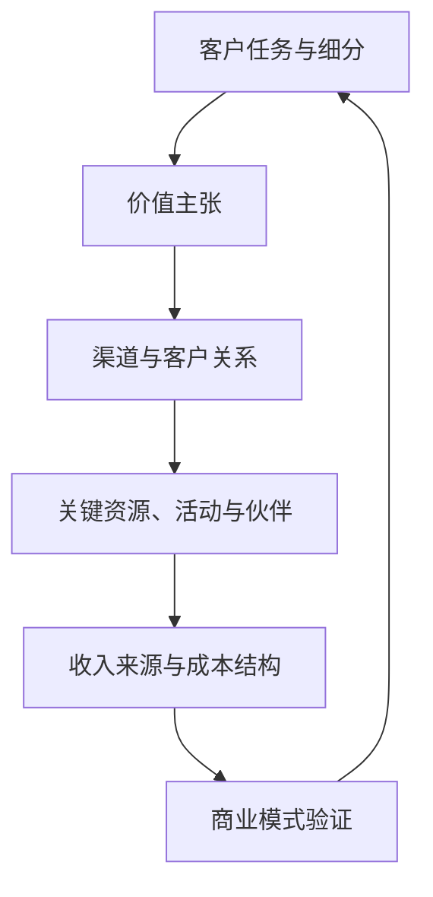

## 商业模式设计与创新

## 课程概览

商业模式回答企业如何为特定参与者创造价值、把价值交付出去，并通过收入、资源交换或其他回报持续获取价值。课程以 **商业模式画布（BMC）** 建立共同语言，再用 **JTBD** 识别用户在具体情境中要完成的工作，向后连接客户关系、关键业务、资源、伙伴、收入与成本，向前连接价值主张、MVP、实验、指标和平台治理。

课程反复强调，画布不是九个格子的填空题。一个模式要能解释：谁需要什么，企业如何完成承诺，哪些参与者共同交付，谁为哪一部分付费，成本如何发生，以及关键假设如何用低成本证据验证。平台、订阅、广告、免费增值和剃刀模式只是结构选项，不能替代对用户、价值和经济性的判断。

> 核心关系：商业模式把客户任务和价值主张连接到交付系统与财务结果，并通过验证持续修正假设。

## 知识地图

### 1. 价值逻辑：从用户工作到 BMC

- **价值创造**：为特定客户解决问题，帮助客户取得功能性、情感性或社会性进展。
- **价值传递**：通过渠道、客户关系、关键业务和合作伙伴，把承诺的结果交付到使用场景。
- **价值获取**：通过销售、订阅、抽佣、广告、增值服务、耗材或其他交换获得可持续回报。
- **BMC 九个模块**：客户细分、价值主张、渠道通路、客户关系、收入来源、核心资源、关键业务、重要合作伙伴、成本结构。
- **内部一致性**：价值主张要由关键业务和资源支撑，渠道要能触达目标客户，伙伴要补足能力，收入要覆盖成本并与关系强度相称。

画布右侧更接近客户与市场，左侧更接近运营与供给，收入和成本把两侧连接起来。分析时应从任意一个关键假设出发，沿着「客户—价值—活动—资源—伙伴—渠道—关系—收入—成本」追问，而不是孤立填写模块。

### 2. 客户洞察：JTBD、细分与关系

- **JTBD**：用户购买产品或服务，是为了在特定情境下完成某项工作。竞争者包括所有能完成同一工作的替代方案，不限于同一产品品类。
- **三类工作**：功能性工作解决实际任务；情感性工作带来安心、放松或掌控感；社会性工作传递身份、品味或地位。
- **Job Story**：写清情境、触发因素、限制、期望进展和结果，避免只写人口统计标签或功能列表。
- **客户细分**：从「谁」推进到「谁在什么时刻遇到什么问题、现在如何解决、为何愿意付费或持续使用」。大众市场、利基市场和多边平台市场需要不同的价值与渠道安排。
- **客户关系**：自助服务适合标准化低风险任务；自动化服务适合可规模化的推荐、提醒和问答；人工辅助适合高价值、高复杂度或高风险任务；社区适合互助、传播和共创，但需要治理。
- **关系陷阱**：自助可能把复杂性转嫁给用户；自动化可能过度推送、不可解释或无法转人工；社区可能空壳化、失控，或被当成免费的客服外包。

客户关系应按客户阶段、任务复杂度和风险组合设计。自动化出口必须保留异常处理、人工转接和责任边界。

### 3. 运营与经济性：业务、资源、伙伴、产能和成本

- **关键业务**：平台运营、内容生产、技术开发、物流履约等实际动作，必须直接支撑价值主张。
- **核心资源**：物理资源、知识产权与算法、人力与组织能力、金融资源、数据、网络和生态关系。独有数据、难以复制的组织能力和较高转换成本可能形成护城河。
- **重要合作伙伴**：补足能力、资源、渠道、信任或合规条件。伙伴数量不等于模式质量，合作关系必须说明双方的价值交换、成本与风险。
- **自建与外包**：在控制力、成本、速度、质量和战略重要性之间取舍。重资产模式控制力强但固定成本高，轻资产模式灵活但更依赖伙伴治理。
- **弹性产能**：固定核心产能承接稳定需求，缓冲层应对常规波动，外部伙伴或溢出层承接峰值。需求预测、资源池化、流程柔性、动态定价和需求塑造可协同使用。
- **成本结构**：区分固定成本与变动成本、直接成本与间接成本、总成本与边际成本。成本控制要前置到设计、采购、流程和产能规划阶段，并回到价值主张检查是否值得。

成本低不是模式成立的充分条件。真正的问题是：投入是否支撑客户愿意付费的结果，是否在规模扩大时保持交付质量，是否把风险隐性地转嫁给用户或伙伴。

### 4. 收入与增长：收入模式、定价和单位经济

- **一次性销售或所有权转让**：交易完成后关系相对短，但对持续服务的依赖较低。
- **按使用或时间付费**：收入随用量或期限变化，适合可计量的使用价值。
- **订阅或周期性付费**：企业必须持续交付价值、维护体验并降低流失。
- **交易抽佣与广告**：收入分别依赖交易撮合或受众触达；需说明平台提供的真实价值和治理成本。
- **免费增值与剃刀模式**：先用低门槛基础产品获取用户，再由增值功能、耗材、维护或服务产生持续收入。
- **指标**：MRR 是月度经常性收入，ARR 是年化经常性收入；收入增长要与留存、流失、使用频率、LTV、CAC 和贡献利润一起看。
- **定价**：应结合支付意愿、客户细分、竞争和战略目标。促销是阶段性手段，不等于长期定价。
- **资源置换与异业联盟**：用自身边际成本较低、但对伙伴有价值的渠道、曝光、积分、场景、数据或能力进行交换，降低现金预算压力。

不能把加盟店营业额、平台交易额或用户总数直接当作企业收入和价值。分析时需要拆清收入确认主体、付费者与使用者、各类客户的稳定性，以及每条收入线对应的交付成本。

### 5. 验证与迭代：从需求证据到 PMF

- **访谈**：围绕真实经历和时间线追问触发情境、替代方案、决策顾虑、说服因素和使用结果，少问抽象态度与假设性问题。
- **痛点排序**：用发生频率、严重程度、时间、金钱和精力等维度识别优先级。
- **价值主张画布**：把客户工作、痛点和收益映射到必备功能、止痛功能和增益功能。
- **MVP**：用最少资源验证最关键假设，不是完整产品的缩小版。假门测试、礼宾式服务、预售、预约和小批量发布都可作为验证手段。
- **实验**：A/B 测试或随机控制实验应预先定义成功指标、设置对照、尽量随机分配，并控制渠道、时间和样本差异。
- **OMTM**：在一个发展阶段聚焦一个最重要指标，指标要根植于商业模式、可指导行动、可比较；阶段改变后重新定义。
- **PMF**：通过构建、测量、学习循环观察转化、活跃、留存、付费和同期群，而非用一次性投票或浏览量下结论。
- **伪需求识别**：点赞、评论、浏览、下载和注册可能只是表层兴趣；应追踪关键功能使用、真实转化、付费、留存与复购，并进行多方法交叉验证。

### 6. 平台与生态：多边关系、网络效应和治理

- **多边定位**：平台连接两个或更多相互依赖的群体，如买家与卖家、求职者与企业、用户与创作者、观众与内容生产者。
- **冷启动**：先选择更容易留存的一侧或一个有限场景，借助内容、补贴、伙伴、人工运营或地域聚焦让网络开始运转。
- **网络效应**：一侧参与者增加可能提升另一侧价值；同边效应也可能因拥挤、竞争和低质量供给转为负向。
- **飞轮与逆向循环**：更好的体验可能吸引流量，流量吸引供给，供给再改善体验；治理不足时，低价低质供给可能损害信任并形成反向循环。
- **平台治理**：身份认证、评价、内容审核、纠纷处理、反欺诈、处罚、数据保护和规则透明共同构成平台基础设施。
- **平台边界**：平台若利用数据、流量和低成本优势与一侧商家不公平竞争，可能产生自我优待和生态失衡。混合业务需要说明哪些部分开放、哪些部分由平台自营。

平台模式的收入可以组合订阅、广告、抽佣和内容合作，但收入线越多，治理、合规、信任和交付成本也越需要被纳入画布。

## 对 AI 产品经理的使用

### 1. 把模型能力转成用户工作

AI 产品容易从「模型能生成什么」出发，再寻找用户。可用 JTBD 反向检查：谁在什么情境下要完成什么任务，现有方案的摩擦在哪里，AI 输出如何改善结果，错误时谁负责。能力演示不能替代需求证据，可结合[需求分析](../../pm/requirements.md)与[用户研究](../../pm/user-research.md)确定第一批用户和可验证问题。

### 2. 用 BMC 约束 AI 产品的完整闭环

AI 产品的画布至少要补充以下问题：

- **价值主张**：模型输出改善了哪个任务结果，而不是只增加了一个聊天入口？
- **关键资源**：模型、数据、评测集、提示词、工具权限、人工审核和合规能力由谁提供？
- **关键伙伴**：模型供应商、数据提供方、渠道、算力或人工服务商的依赖如何管理？
- **客户关系**：哪些环节自助或自动化，哪些环节需要解释、确认、人工接管和审计？
- **成本结构**：把推理、检索、评估、人工复核、存储、工具调用和失败重试纳入单位经济。
- **收入来源**：按席位、按调用量、订阅、项目服务或混合收费分别对应什么价值与成本？

可把[AI 产品开发生命周期](../../pm/ai-lifecycle.md)、[评估与评测](../../ai/evaluation.md)和 [LLM 成本测算](../../tools/llm-cost.md)接到 BMC：评测成本与推理成本不是上线后的附加项，而是模式成立前就要算清的经营成本。

### 3. 设计有兜底的客户关系

自动客服、Agent 和 Copilot 不应只追求自动化比例。先按任务风险分层：低风险任务可自助完成，中风险任务提供建议和确认，高风险或不可逆操作保留人工审批和一键接管。把失败模式、转人工率、任务完成率、采纳率、重试率和单次成本写进产品验收，而不是上线后才补监控。

### 4. 用最小实验验证价值与经济性

验证顺序可以是：

1. 用访谈确认工作、替代方案和痛点优先级；
2. 用假门、预约或礼宾式服务确认用户是否愿意采取行动；
3. 用小规模原型或人工加模型的 MVP 验证结果质量与交付成本；
4. 用 A/B 或灰度比较任务完成、采纳、留存和付费；
5. 用 OMTM 聚焦当前阶段，并持续检查 LTV、CAC、毛利和模型成本。

点击率或注册量只能说明某个表达引起兴趣，不能单独证明 AI 功能产生长期价值。

### 5. 评估平台依赖与生态治理

把模型供应商、开发者、数据提供者、终端用户、人工运营和合规主体画成价值网络，分别写出输入、输出、收益、权限和退出成本。多模型或多供应商策略要保留基线评测和数据迁移能力，平台规则要覆盖隐私、内容安全、提示词注入、滥用和纠纷处理。需要做 Agent 权限设计时，可参照[Agent 产品设计](../../practice/agent-product.md)。

## 课堂案例与事实边界

下表中的对象均来自课堂讲授、课件或小组汇报。它们在本课程中承担的是分析材料，不等于本页对企业现状、经营数据或案例细节作出的独立事实核验。

| 课堂案例或讨论对象 | 课堂用于分析的命题 | 证据边界 |
| --- | --- | --- |
| Airbnb | 双边客户、信任机制、支付与保险伙伴、平台抽佣 | 课堂案例；未核验费率、市场份额或最新业务结构 |
| 亚马逊飞轮、淘宝、拼多多、百度、抖音、B 站 | 网络效应、流量与供给、平台治理、多元收入 | 课堂分析框架；不作为企业最新战略或财务结论 |
| 可口可乐、海底捞、Adobe | 价值主张、体验、授权与订阅关系 | 课堂举例；未核验经营数据和完整收入结构 |
| 京东与阿里物流、亚马逊物流、TikTok、Temu、Jumia | 自建与外包、关键业务、供应链与合作伙伴 | 课件或课堂讨论线索；不据此判断企业全部运营方式 |
| 华为、Apple、智能手机生态 | 客户细分、渠道、硬件、系统、应用和生态资源 | 课堂案例；未核验产品线、收入比例或竞争结论 |
| 足球俱乐部、粉丝代币、NFT、FC Barcelona、PSG | 多边客户、数字权益、青训、场馆、社群与混合收入 | 主要来自课件 OCR；代币价格、募资和市场表现均未核验 |
| 营养快线、OFO、iPod、Kindle | 用 JTBD 解释需求延续、替代方案与产品衰落 | 小组汇报与课堂材料；不等于企业官方复盘或外部因果结论 |
| 麦当劳奶昔、Trivago、亚马逊企业购、飞书、中国大学 MOOC、共享住宿 | JTBD、Job Story、价值主张与实验设计 | 课堂或课件案例；样本量、转化率、预算等未作为业务事实引用 |

???+ warning "材料边界"
    本页把「商业模式的创造、传递与获取价值」「BMC 模块」「JTBD」「实验与指标」整理为课程框架，把企业名称、品牌表现和小组方案保留为课堂案例。课堂举例用于说明分析方法，不替代企业公告、财报、监管文件或原始研究。

    课程笔记中的字幕来自课堂记录，自动转写存在错字；课件 OCR 存在重复、漏字和数字噪音。涉及比例、市场规模、收入、代币价格、融资和企业判断时，应回到原始资料核对，不应把本页当作最新事实数据库。

## 来源与日期覆盖

本页完整阅读并综合以下本地课堂笔记，日期范围为 **2025-11-11 至 2026-01-06**。日期是课堂材料日期，不表示外部资料的发布日期。

| 日期 | 材料覆盖与证据等级 |
| --- | --- |
| 2025-11-11 | 中文字幕为主；课程导论、商业模式三层、BMC 与 JTBD |
| 2025-11-13 | 中文字幕与课件 OCR；客户关系类型、组合与风险 |
| 2025-11-18 | 中文字幕为主、OCR 校对；关系陷阱、收入模式、定价与核心资源 |
| 2025-11-20 | 中文字幕较短；课堂展示安排明确，关键业务、伙伴、自建/外包与弹性产能主要是 OCR 主题线索 |
| 2025-11-25 | 中文字幕为主、课件补充；弹性产能、成本结构与 BMC 综合练习 |
| 2025-11-27 | 中文字幕为主、OCR 补充；平台案例、网络效应与智能手机 BMC |
| 2025-12-02 | 中文字幕较少，主要依赖课件 OCR；足球俱乐部、粉丝代币、NFT 与多元收入 |
| 2025-12-04 | 无可用中文 SRT，主要依赖课件 OCR；JTBD 与案例 |
| 2025-12-09 | 中文字幕为主、OCR 补充；收入结构、成本分类与规模效应 |
| 2025-12-11 | 中文字幕为主、OCR 补充；JTBD 案例汇报 |
| 2025-12-16 | 中文字幕为主、OCR 补充；MRR、ARR、LTV、CAC 与资源置换 |
| 2025-12-18 | 中文字幕为主、OCR 校对；访谈、力量图谱、A/B 测试和需求验证 |
| 2025-12-23 | 无中文 SRT，主要依赖课件 OCR；价值主张画布、MVP、OMTM 与 PMF |
| 2025-12-25 | 无中文 SRT，主要依赖课件 OCR；JTBD 冲刺成果汇报 |
| 2025-12-30 | 中文字幕为主、OCR 补充；平台定义、冷启动、网络效应与治理 |
| 2026-01-06 | **材料不足**：中文 SRT 为空，OCR 仅能确认标题页；不能据此还原本次课堂的具体讲授、案例、结论或作业 |

## 材料说明与局限

- 本页是课程总览，不是 16 次课的逐字实录。内容以课堂笔记中的稳定概念和重复出现的分析主线为基础，压缩了各讲的复习题、作业口径和重复案例。
- 2025-11-20、2025-12-02、2025-12-04、2025-12-23、2025-12-25 的字幕证据较弱，相关知识点按「课件 OCR 主题线索」处理，未伪装成完整课堂讲授。
- 2026-01-06 的材料明确不足：上一讲只预告「整体盘点」，本次 SRT 为空，OCR 只有标题页。文中关于课程总框架的内容来自前 15 次材料的回顾，**不是 2026-01-06 已发生的课堂记录**；作业、考试和教师结论均须以正式通知为准。
- 课堂案例、企业名称和小组方案用于说明概念。除非另有独立来源，本页不把它们当作经过核验的企业事实，不提供未经核对的市场份额、收入比例、代币价格、样本量或实验结果。
- 自动字幕与 OCR 都可能产生识别错误；需要用于研究、投资、合规或产品决策时，应查原始课件、完整录音、企业官方披露和可复现数据。
