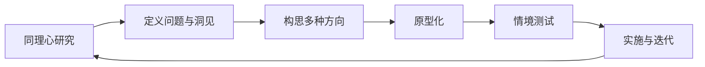

## 设计思维

> 核心关系：设计思维通过研究、定义、构思、原型和测试往返迭代，把用户证据转成可实施方案。

### 课程概览

《设计思维（本）》采用项目制行动学习，围绕两个项目推进：项目一 **AI for Education**，研究人工智能进入学习与教学后产生的真实问题；项目二围绕校园数字学习、生活与研究场景，使用低代码、AI 或既有系统提出数字应用方案。

课程的核心流程是 **同理心、定义、构思、原型、测试**。项目二进一步要求考虑实施，把经过研究和测试的概念细化为表单、数据、流程、权限、通知和异常处理。课程持续强调三条判断标准：设计对象应回到真实用户和场景，方案应有证据支持，技术应服务于用户价值。

### 知识地图

| 阶段 | 核心问题 | 常用产出与方法 |
| --- | --- | --- |
| 同理心 | 用户是谁？在什么情境下做什么？说了什么、实际做了什么？ | 沉浸式体验、观察、访谈；逐字记录；行为与环境线索 |
| 定义 | 表面现象背后的任务、痛点和需求是什么？ | What、How、Why；同理心地图；洞见、用户画像、JTBD、用户旅程图、POV |
| 构思 | 如何围绕已确认的问题保留多种方向？ | HMW；个人头脑风暴；“是的，而且……”；聚类与投票；价值主张画布；SCAMPER |
| 原型与测试 | 用户能否理解并完成任务？哪里产生误解、停顿或额外负担？ | 纸面原型、实物模型、故事板、PPT、角色扮演；情境任务；观察与反馈 |
| 实施与迭代 | 方案如何在真实组织和系统中运行？ | 低代码表单、字段、数据、流程、审核、权限、通知、统计；异常处理；持续迭代 |

课堂将五阶段视为往返过程：研究可能改变问题定义，测试可能推翻原有假设，实施约束也可能促使团队重新选择方案。项目二中的实施不是替代前面的研究，而是检验方案是否有机会进入真实流程。

### 研究与问题定义

#### 从事实到洞见

设计研究需要把以下内容分开记录：

- **事实**：用户明确说了什么，实际做了什么，处于什么时间、地点和环境。
- **解释**：研究者如何理解行为、情绪或矛盾之处。
- **假设**：对原因、需求或机会的暂时判断，仍需通过更多访谈、观察或测试验证。

课堂使用“什么、怎么样、为什么”组织观察。先描述可见事实，再记录行为方式和环境细节，最后提出多个可能原因。身体语言、停顿和口头回答之间的差异都是线索，不能直接当成结论。

#### 同理心资料的获得

- **沉浸式体验**：主动暴露设计者平时不易察觉的身体、环境和心理限制。
- **观察**：记录用户在真实场景中的路线、停顿、动作、表情、物品和系统反馈，避免只听概括性回答。
- **访谈**：从最近一次具体经历开始，用开放式问题和连续追问理解行为、原因、困难与感受。

访谈应保持初学者心态，避免诱导、评价和争辩。问题要问具体时间、地点和行为，例如“上一次使用 AI 时发生了什么”，而不是只问“你是否使用 AI”。提问者和记录者分工，有助于同时保留原话、非语言信息和遗漏问题。

#### 从资料形成用户模型

同理心地图按用户背景、说、做、想、感受和惊奇点组织材料。用户画像是对一类真实用户的具象化概括，应包含身份、任务、时间压力、工具习惯、目标、顾虑、限制和具体经历。它不能直接写成“需要一个 APP”或“需要一个 AI 工具”，因为那已经是解决方案。

**Jobs to Be Done（JTBD）**把注意力放在用户在特定情境下想完成的功能任务、社会任务或情绪任务。用户旅程图进一步拆解任务阶段，记录行动、触点、等待、情绪、痛点、当前替代办法和机会点。旅程应包含异常情况，不能只画顺利完成的主流程。

#### POV 与 HMW

**POV（Point of View）**由具体用户、真实需求和有证据支持的洞见组成，应写成陈述句。需求描述任务、困难或体验，不预设产品形态。

**HMW（How Might We）**把 POV 重新打开，形成可探索的设计方向。它既要保留用户、情境和目标，也要给团队足够空间，从工具、流程、环境、教育、陪伴和风险控制等角度发散。一个 HMW 可以产生多个方案，不能把第一个想法直接当成答案。

### 构思、价值与原型

构思阶段先扩大选择空间，再根据用户证据、场景、资源和约束收敛。个人独立头脑风暴可以避免强势成员过早影响他人；组内用“是的，而且……”接续想法，降低被否定的顾虑；聚类和投票帮助形成共同选择，但票数不等于用户价值已经得到验证。

**价值主张画布**检查方案是否与用户相配：

- 用户侧：用户任务、痛点和获得。
- 方案侧：产品与服务、痛点缓解者和获得创造者。
- 匹配关系：每个核心功能都应说明回应了哪项任务、痛点或获得。

**SCAMPER**从替代、组合、借用或调整、修改、换作他用、消除和重排等角度打破惯性。发散时可以暂时保留大胆设想，随后加入预算、数据、权限、安全、组织责任、运维和时间等约束。

原型的目标是让抽象想法变得可见、可操作、可修改，不是提前制作精美成品。纸张、便利贴、废旧物品、PPT、故事板和角色扮演都可以表达核心流程。测试应给用户一个具体任务，让其先行动，再观察理解、停顿、提问和情绪，避免由设计者单方面介绍功能。

### AI 与产品经理应用

#### AI 产品问题研究

AI for Education 项目要求研究 AI 进入学习和教学后的真实影响，而不是预先判断“应该使用”或“应该禁止”。研究可继续追问：

- 用户在什么任务、时间和专业情境下使用或不使用 AI？
- AI 输出后，用户如何核验、修改和承担结果责任？
- AI 是提升了学习能力，还是只替用户完成了任务？
- 错误、幻觉、专业知识不足、隐私和教师要求如何改变用户选择？
- 使用 AI 是否减少了工作，还是把核验负担转移给用户？

课堂材料中的学生访谈曾涉及专业学习、翻译、文字处理、编程、信息搜索和情绪陪伴等不同使用情境。这些内容可作为研究线索，不应直接概括为所有学生的共同结论。

#### AI 功能设计

产品经理设计 AI 功能时，应先说明：

- AI 在流程中承担检索、生成、提醒、纠错、分类还是对话角色；
- 用户输入什么，系统输出什么，知识来源和更新责任是什么；
- 哪些环节由 AI 自动处理，哪些环节必须由人判断、审核或纠错；
- 输出不准确、知识库未命中、权限失败或系统不可用时如何反馈和转人工；
- 功能是否真正降低任务成本，是否增加核验、学习、隐私或管理负担。

AI 可以辅助整理材料、制作演示稿、生成脚本或代码，但不能代替问题定义、用户理解、事实核验和最终判断。低代码平台也只是实现工具，不能替代用户研究。

#### 从研究到落地

产品方案应形成一条可追溯链：访谈与观察证据 → 用户画像与旅程 → 洞见与 POV → HMW 与候选方案 → 价值主张匹配 → 原型与测试 → 低代码实施。

进入实施阶段后，产品经理需要把故事板转成可配置逻辑：用户输入哪些字段，哪些信息来自既有系统，什么条件触发审核或通知，谁可以查看和修改，用户如何查询状态，数据如何更新和统计，以及取消、超时、重复提交、设备故障和权限失效时由谁处理。应明确区分已实现功能、纸面或 PPT 原型、课堂设想和仍待确认的接口、权限与管理规则。

### 课堂案例与边界

本节案例均是来源笔记中的课堂练习、课堂讲述或学生展示，用于说明方法。它们不自动构成外部事实、企业成效、已上线功能或经过代表性验证的用户结论。

| 课堂案例或方案 | 用于说明的设计问题 | 事实边界 |
| --- | --- | --- |
| 宿舍到教室的同伴访谈、机场照片、花瓶与场景 | 从具体处境、环境和行为出发，保留多种需求假设 | 练习中的情境是教学材料，不代表真实用户研究结果 |
| 儿童检查环境、孕妇驾驶体验、低成本保温产品 | 通过沉浸式体验与情绪价值发现表面需求之下的限制 | 课堂用于解释同理心；医疗与产品细节未在本页作外部核验 |
| 咖啡门店、超市动线、草坪小路、身体语言观察 | 对照用户口述与真实行为，关注路线、停顿和环境线索 | 课堂讲述仅作为观察示例，不据此评价相关企业或项目成效 |
| 药学本科生、外语学习者等 AI 使用访谈 | 用户专业、任务、准确性要求和教师要求会改变 AI 需求 | 属于课堂访谈或分享摘要，样本、方法和结论范围不明，不能外推 |
| 早八早餐、食堂菜品、活动室预约、学院官网检索 | 用用户旅程、价值主张和异常流程分析校园数字服务 | 属于学生项目方案或课堂讨论；数据来源、权限、规则和运营结果尚未确认 |
| 低代码表单、知识库、AI 客服与课堂 AI 角色 | 说明输入、输出、数据、权限、人机分工和人工兜底 | 平台能力和演示细节以课堂当时描述为准，不等同于本校已部署能力 |

### 资料范围与材料限度

本页综合 14 份课堂笔记，日期覆盖：2025-04-15、2025-04-17、2025-04-22、2025-04-24、2025-04-29、2025-05-06、2025-05-08、2025-05-13、2025-05-15、2025-05-20、2025-05-22、2025-05-29、2025-06-03、2025-06-05。

来源以课堂字幕整理为主。多份笔记明确记录，对应 PDF/OCR 文本只有分页符，没有可用课件文字；字幕和 OCR 存在自动识别错误，个别专有名词、平台名称、地点、学生展示细节和英文术语无法完全确认。本页只保留跨笔记反复出现或在笔记中明确说明的课程方法，并将无法确认的内容保留为案例、设想或待验证假设，不补写缺失日期、外部事实和未听清的结论。
