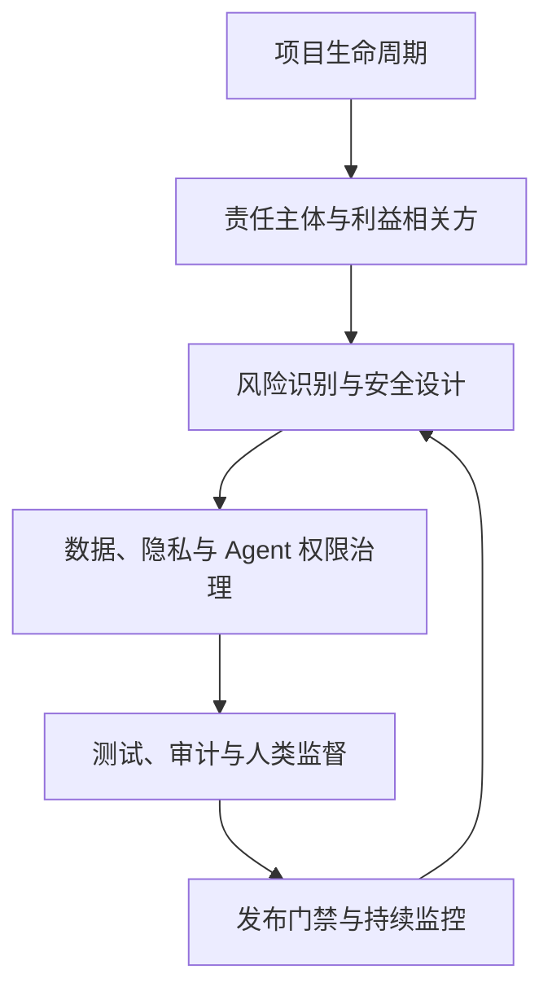

## 工程伦理

工程伦理研究工程共同体如何在不确定性、利益冲突和公共影响下正当地行动。对 IT 与 AI 产品而言，伦理判断不只发生在事故之后，也发生在需求定义、指标选择、数据处理、权限设计、测试发布和运维退役的每一个环节。

本页将课堂笔记中的工程伦理、信息伦理和项目治理框架压缩为一张可复用的知识地图。核心原则是把公众的安全、健康和福祉放在首位，同时关注社会公正、隐私、环境和长期可持续性。项目管理的流程细节见[项目管理与迭代](../../pm/project-management.md)，AI 安全的技术框架见 [AI 安全](../../ai/ai-safety.md)。

## 课程概览

- **工程是社会实践**：工程由多主体在较长生命周期内协作完成，结果可能影响用户、非目标人群、自然环境和未来世代。
- **伦理不是附加检查项**：目标函数、默认设置、排序规则、数据来源、权限边界和发布节奏都会分配利益与风险。
- **责任具有事前性**：工程师和项目负责人需要主动预测、披露、预防和减轻伤害，不能只等法律或事故追责。
- **判断需要多种视角**：功利论关注总体后果，义务论关注原则与权利，契约论关注规则与同意，德性论关注诚实、勇敢和正义等品格。
- **合规不是全部**：形式上合法的设计仍可能在隐私、公平、劳动条件、公共利益或长期影响上不合理。

> 核心关系：工程伦理把责任、风险、数据治理和人类监督嵌入项目全生命周期，发布只是治理闭环的一个节点。

## 知识地图

| 模块 | 核心问题 | 课堂覆盖的概念与案例 |
| --- | --- | --- |
| 工程与伦理基础 | 工程为什么需要伦理判断？ | 工程与技术的区别、工程生命周期、工程共同体、行动者网络、功利论、义务论、契约论、德性论 |
| 风险、安全与责任 | 谁预见风险、谁控制风险、谁承担后果？ | 技术/环境/人为风险、风险可接受性、预防原则、事前与事后责任、责任链、温州动车与挑战者号等案例 |
| 价值、公正与环境 | 谁获得收益，谁承担成本与不可逆影响？ | 科学/政治/社会/文化/生态价值、利益相关者、邻避效应、分配公正、程序公正、DDT 与里海筑堤等案例 |
| 信息、数据与知识产权 | 数据如何被收集、使用和分配？ | 隐私权、个人信息权、数据权属、数字鸿沟、知情同意、数据溯源、专利与著作权、专利滥用 |
| 职业伦理与冲突 | 组织命令与公众责任冲突时如何行动？ | 首要责任、合理关照、完整性、诚实、利益冲突、角色冲突、拒绝、回避、吹哨与职业共同体 |
| 算法与 AI 伦理 | 模型和平台如何把价值选择变成现实后果？ | 外卖时效算法、数字遗产、深度合成、身份认证、算法目标、公平、可解释与可回滚 |
| Agent 与软件供应链 | 高行动力系统怎样被约束和追责？ | 最小权限、沙箱、HITL、TRACE、SBOM、多维护者审批、XZ Utils、Log4j、全球更新事故 |
| 项目治理与组织 | 如何让伦理要求进入交付过程？ | 范围与变更、成本与进度、风险登记册、相关方参与、发布门禁、灰度、回滚、供应商责任与事故复盘 |

## 核心框架

### 从工程生命周期识别伦理问题

工程伦理应沿着计划、设计、建造、使用和结束（退役或处理）展开。每个阶段都要回答四个问题：

1. **影响谁**：列出直接用户、员工、客户、供应商、监管者、社区、公众、弱势群体和自然环境。
2. **改变什么**：识别系统对安全、隐私、自由、公平、劳动条件、环境和公共讨论的影响。
3. **风险如何扩散**：区分直接与间接、短期与长期、局部与系统性后果，记录不确定性和不可逆性。
4. **如何控制与问责**：把约束、审计、申诉、人工接管、回滚、补偿和责任人写入流程与系统。

### 责任的三层结构

- **标准责任**：遵守法律、行业标准、许可证和组织流程，这是最低要求。
- **合理关照责任**：在能力和信息范围内主动识别危险，报告重大风险并采取减轻措施。
- **公共责任**：面对尚无明确规则但可能造成重大伤害的情形，主动保护公众安全、健康、尊严和环境。

法律责任常在损害发生后追究，岗位责任强调角色义务，伦理责任还要求在事前预见和预防。组织不能把复杂系统的后果简化为某个操作人员的个人过错；决策权、信息掌握、可预见性和控制能力都应进入责任分析。

### 伦理冲突的处理路径

面对利益冲突、角色冲突或责任冲突，可以按以下顺序处理：

- 记录可核查事实、风险和决策依据，区分事实与推测。
- 向相关负责人披露冲突，要求补充评估、复核或独立意见。
- 对无法客观处理的事项回避，必要时拒绝参与或暂停有害工作。
- 通过组织合规、职业组织、监管或法律渠道报告重大危害，并保护证据与举报人安全。
- 将最终决策、放行理由、例外条件和后续监控写入决策日志。

忠诚于雇主或客户不能凌驾于公众安全之上。举报也不是跳过事实核验和正常渠道，而是在风险严重、内部纠正无效或继续执行会造成伤害时承担公共责任。

## AI 与产品经理应用

### 1. 把价值选择写进需求与指标

排序目标、转化率、停留时长、响应时间和自动化率都不是纯技术指标。它们会影响劳动者收入、用户选择、内容可见性和风险分配。产品经理应在 PRD 和验收标准中同时写入：

- 目标用户之外的受影响群体，以及其知情、申诉和退出方式；
- 安全、公平、隐私和可及性的底线指标；
- 低概率高损害事件的禁止条件，不用平均收益抵消不可接受的伤害；
- 失败路径、人工接管、回滚和事故沟通要求。

### 2. 管好数据、知识产权与供应商

数据治理不能停在“公开可见”或“用户已点击同意”。应记录数据来源、用途、授权范围、保存期限、再利用边界、删除与撤回机制，并评估关联分析可能推断出的敏感信息。训练数据、蒸馏数据、生成内容和开源依赖分别需要来源核验、许可证审查、署名与通知、版本锁定和安全更新。

低价标注、外包审核和开源维护者的低议价能力会把质量与伦理成本转嫁给弱势主体。供应商评分应同时考察质量、代表性、劳动条件、隐私、合规、维护能力和事故响应，而不以最低价格作为唯一目标。

### 3. 为 Agent 和模型发布设置可执行门禁

AI Agent 具备读文件、调用 API、执行命令和对外发送信息的行动力，产品设计应把权限和确认级别与风险绑定：

| 风险等级 | 典型动作 | 控制要求 |
| --- | --- | --- |
| 低 | 草拟文本、整理信息、生成内部建议 | 最小权限；允许自主执行；保留日志并支持追溯 |
| 中 | 修改业务数据、触发批量任务、发送内部通知 | 沙箱或隔离环境；用户确认；异常检测；可撤销 |
| 高 | 删除数据、付款、改变权限、对外发布或影响生命财产的决策 | 双人确认或人工最终把关；独立审查；强制回滚；事故响应预案 |

发布前应结合红队测试、偏见与有害输出评估、供应链扫描、灰度、观察窗口和回滚演练。安全或合规角色需要拥有提出暂停发布的权力。详见 [评估与评测](../../ai/evaluation.md)、[Agent 工具](../../ai/agent-tools.md) 与 [提示词安全](../../ai/prompt-security.md)。

### 4. 用治理机制替代“下次注意”

项目经理可以把伦理风险转化为可管理的条目：

- 风险登记册记录风险、原因、触发信号、影响、责任人、缓解措施、残留风险和次生风险。
- 相关方登记册不只列高权力主体，也列出承受重大风险但组织化程度较低的群体。
- 变更控制评估范围、时间、成本、质量、安全、隐私和公正影响，避免口头承诺形成隐性范围蔓延。
- 事故复盘追到流程、评测、权限、激励和组织文化等系统根因，不把责任归结为“某人粗心”。
- AI 可以辅助需求整理、风险识别和会议记录，但不能替代项目经理、工程师和治理主体作出价值判断并承担最终责任。

## 来源与日期覆盖

本页综合用户提供的 `IT工程伦理和项目管理` 目录下 16 份课堂笔记，日期覆盖 **2026-04-29 至 2026-06-18**。课堂材料的主题分布如下：

| 日期范围 | 覆盖内容 | 主要材料形态 |
| --- | --- | --- |
| 2026-04-29 ～ 2026-05-07 | 工程伦理基础、风险安全、公正、环境、信息与数据、知识产权 | 课件、课堂案例与讨论题；部分日期字幕缺失或很短 |
| 2026-05-13 ～ 2026-05-14 | 职业伦理、角色与利益冲突、算法、数字遗产、AI Agent、开源与高风险自动化 | 课件、学生展示、录屏或演示文稿截图 |
| 2026-05-20 ～ 2026-05-28 | 项目与运营、项目成功、组织结构、范围、进度、成本与挣值 | 课件、公式练习与案例；部分课件含 OCR 噪声 |
| 2026-06-03 | 材料缺失记录 | 源课堂目录为空，未发现 PDF、PPT、有效字幕或截图 |
| 2026-06-04 ～ 2026-06-11 | 资源、团队、沟通、风险应对、相关方管理 | OCR 课件为主，字幕较短或未见完整讨论记录 |
| 2026-06-17 ～ 2026-06-18 | 大型 IT 项目、迁移、敏捷、AI 服务质量、发布、标注与供应链 | 学生小组展示和中文课堂字幕，部分外部案例未独立核验 |

## 材料说明与局限

!!! warning "2026-06-03 材料不足"
    该日期的源课堂目录为空，未发现可核查的课件、字幕、PDF、PPT 或截图。

    本页没有用相邻日期的内容填补 2026-06-03，也没有推测该日主题。后续若补充原始材料，应先核验日期、课次、课程归属和材料来源，再更新本页。

- 本页是对课堂笔记的二次综合，不是教师逐字讲稿。笔记本身说明部分内容来自课件、自动字幕、录屏和学生小组展示；展示中的具体数字、因果判断和案例细节不视为已完成独立事实核验。
- 课程案例用于训练风险识别、责任分析和治理设计。涉及事故、诉讼、监管和企业行为的事实，应回到官方调查、判决、许可证或标准原文核对。
- 工程伦理理论提供冲突分析的视角，不会自动给出所有情境下唯一答案。实际决策还需要结合组织授权、专业能力、证据质量、适用法律和受影响者意见。
- 数据保护、著作权、专利、深度合成和 AI 治理规则持续变化。本页不构成法律意见，产品上线前应按业务所在地和数据流向进行专业合规审查。
- 工程伦理课程中的项目管理内容只保留与责任、风险和公共影响直接相关的框架；范围、迭代、评测、发布和复盘的操作细节请参阅[项目管理与迭代](../../pm/project-management.md)。
