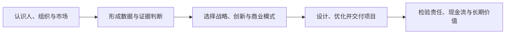

## 工商管理简介

本专题以 **19 门工商管理课程的 265 篇课堂笔记**为原始资料，整理管理者在真实组织中需要反复回答的问题：如何认识组织与人，如何理解市场与消费者，如何做战略与创新，如何把方案变成项目，以及如何用财务与数据检验选择。

这里的重点不是把课程讲义逐字搬到站内，而是把课堂中的概念、模型和案例重组为可检索的知识地图。课堂笔记是学习材料，不等同于经过逐条外部核验的教材；涉及公司案例、市场数据、政策和实验结论时，应以原始研究与官方资料为准。

它与本站其他专题的分工是： [产品方法论](../pm/index.md)回答「怎么判断、怎么设计」，[AI 基础](../ai/index.md)回答「模型能做什么」，[AI 产品实战](../practice/index.md)回答「具体产品怎么落地」，[商业与财会](../business/index.md)回答「金融与财务领域如何运转」，本专题回答「组织、市场与经营决策如何运转」。

> 核心关系：工商管理知识地图从认识对象开始，经由证据和判断选择方向，再把方案交付并对结果负责。

## 课程列表

| 课程 | 主题定位 | 适合解决的问题 |
| --- | --- | --- |
| [管理研究方法](01-management-research/index.md) | 从问题、构念、假设到研究设计 | 这个判断如何被证据支持？ |
| [管理统计](02-management-statistics/index.md) | 抽样、描述统计、检验与回归 | 数据差异是否可靠，关系是否成立？ |
| [管理决策](03-management-decision/index.md) | 有限理性、偏差、风险与群体判断 | 在不确定性下如何减少误判？ |
| [组织行为学](04-organizational-behavior/index.md) | 个体、团队、动机、压力与组织 | 人为什么这样行动，组织如何改善？ |
| [管理沟通](05-management-communication/index.md) | 主体、客体、说服、反馈与冲突 | 如何让信息被理解并促成行动？ |
| [市场营销学](06-marketing/index.md) | 顾客价值、STP 与营销组合 | 为谁创造什么价值，如何传递与实现？ |
| [消费者行为](07-consumer-behavior/index.md) | 需要、身份、感知、控制与选择 | 用户如何形成偏好并做出选择？ |
| [消费者信息处理与决策](08-consumer-information-decision/index.md) | 注意、记忆、情绪、风险与社会信息 | 用户如何处理产品和传播信息？ |
| [消费者神经科学](09-consumer-neuroscience/index.md) | 奖赏、注意、自我、共情与神经测量 | 哪些生理与认知机制影响消费？ |
| [战略管理](10-strategy/index.md) | 竞争优势、价值链、平台与执行 | 企业凭什么赢，如何把战略做成？ |
| [创新管理](11-innovation/index.md) | 创新来源、商业模式、技术曲线与责任 | 新机会如何产生、扩散并负责任地落地？ |
| [商业模式设计与创新](12-business-model/index.md) | 价值创造、传递、获取与验证 | 一个想法如何形成可验证的经营系统？ |
| [创业管理](13-entrepreneurship/index.md) | 机会、资源、团队、融资与路演 | 如何在不确定性中启动并验证新业务？ |
| [设计思维](14-design-thinking/index.md) | 同理心、定义、构思、原型与测试 | 如何从真实场景产生可测试的方案？ |
| [项目管理](15-project-management/index.md) | 生命周期、范围、进度、资源、风险与相关方 | 如何把目标转成可控的交付过程？ |
| [应用运筹学Ⅰ](16-operations-research/index.md) | 线性规划、网络、整数规划与动态规划 | 资源有限时如何求更好的解？ |
| [IT 工程伦理和项目管理](17-engineering-ethics/index.md) | 工程责任、数据伦理、风险与项目治理 | 技术项目如何安全、负责地交付？ |
| [财务管理](18-financial-management/index.md) | 报表、现金流、投资、融资与营运资本 | 一个经营选择是否创造可持续价值？ |

## 知识地图

### 从认识问题到采取行动

可以把工商管理的学习主线压缩成五个连续环节：

1. **认识对象**：用组织行为、消费者行为和市场营销理解人、组织与市场；
2. **形成判断**：用研究方法、管理统计和管理决策，把直觉转成可检验的判断；
3. **选择方向**：用战略管理、创新管理、商业模式和创业管理，决定做什么、为谁做以及如何获得回报；
4. **设计并交付**：用设计思维、项目管理和运筹学，把方案转成可执行、可优化的系统；
5. **承担结果**：用工程伦理与财务管理检查风险、责任、现金流和长期价值。

这不是必须从头读到尾的线性课程。遇到具体问题时，应从问题所在环节切入，再补足它依赖的概念。

### 与 AI 产品工作的连接

- **做用户与市场判断**：从[市场营销学](06-marketing/index.md)、[消费者行为](07-consumer-behavior/index.md)和[设计思维](14-design-thinking/index.md)进入，再结合[用户研究](../pm/user-research.md)；
- **做数据和评测**：从[管理研究方法](01-management-research/index.md)与[管理统计](02-management-statistics/index.md)进入，再结合[评估与评测](../ai/evaluation.md)；
- **做组织协作和推进**：从[组织行为学](04-organizational-behavior/index.md)、[管理沟通](05-management-communication/index.md)和[项目管理](15-project-management/index.md)进入，再结合[AI-Native 研发流程](../tech/ai-native-sdlc.md)；
- **做战略、创新和商业化**：从[战略管理](10-strategy/index.md)、[商业模式设计与创新](12-business-model/index.md)和[创业管理](13-entrepreneurship/index.md)进入，再结合[商业化与增长](../pm/monetization.md)；
- **做高风险或高约束场景**：从[IT 工程伦理和项目管理](17-engineering-ethics/index.md)与[财务管理](18-financial-management/index.md)进入，再结合[出海与合规](../practice/compliance.md)和[LLM 成本测算](../tools/llm-cost.md)。

## 阅读提醒

- **先看问题，再选课程**：课程名相近的内容并不等价，例如消费者行为关注决策过程，消费者信息处理更关注信息加工机制，消费者神经科学关注神经与生理层面的测量及解释。
- **区分模型与结论**：模型是帮助思考的工具，不是脱离情境的答案。课堂案例适合用来理解机制，不应直接当作当前市场事实。
- **对材料不足保持标记**：每门课程页都会说明资料覆盖与缺口；原始课堂笔记中材料不完整、课程混入或仅有占位内容的场次，不会被包装成确定结论。
- **避免重复阅读**：项目管理与[项目管理与迭代](../pm/project-management.md)、财务管理与[公司金融](../business/05-corporate-finance/index.md)、设计思维与[设计哲学与设计思维](../pm/design-philosophy.md)存在交叉，优先读一处，再通过链接补齐差异。
