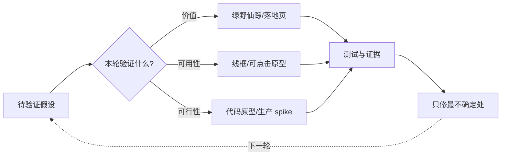

## 原型与设计交付

原型与设计交付是产品设计链路的两个「出口」：**原型把想法变成可验证的实验，交付把设计变成可实现、可验收的规格**。前者回答「这个产品该长什么样、值不值得做」，后者回答「做出来的东西是不是设计要的」。本页面向有经验的产品经理、设计师与候选人，讲四件事：原型的目的、保真度决策、可点击原型方法与工具选型、设计到开发的交接（handoff）。

与[产品设计与原型总览](design.md)的关系：总览页讲 AI 产品特有的设计方法（能力边界、状态机、错误注入、[原型策略：成本与信度矩阵](design.md#原型策略成本与信度矩阵)），本页讲**通用原型方法论与设计交付**，不依赖 AI 的界面设计同样适用；AI 时代的特殊性在文末专节讨论（见 [AI 时代原型的特殊性](#ai-时代原型的特殊性)）。

## 原型的目的：以最小成本获取最大学习

### 原型是实验，不是交付物

精益创业把开发流程定义为"构建-测量-学习"循环（[《精益创业》精读笔记](../case/books/lean-startup.md)），原型的定位就是**循环里最便宜的「构建」**：用最小成本把想法变成可以与人互动的形态，让「测量」和「学习」提前发生。原型是一连串**实验**：每个原型对应一个要回答的问题，问题答完了，这个原型的历史使命就结束了。

把原型当实验，有三个推论：

-   **没有测试的原型只是画稿**：原型本身不产生学习，把它拿给用户或团队看、看他们的反应，才产生学习。只画不测，等于只构建不测量
-   **原型可以是一次性的**：验证完结构问题的线框图不需要补成视觉稿——它已经完成了使命。舍不得扔原型，是把原型当交付物在维护
-   **原型要能证伪**：好的原型设计是"如果这个假设错了，原型会让我看出来"。如果原型只展示了成功路径、只收集赞美，那它验证不了任何东西

### 三类假设与对应的原型

任何一个新功能背后都藏着三类假设，原型要分别验证：

| 假设类型 | 要回答的问题 | 最小原型形式 | 典型判据 |
| --- | --- | --- | --- |
| 价值假设 | 用户真的需要、愿意用吗？ | 绿野仙踪、落地页、故事板 | 用户主动要求继续用、愿意留联系方式 |
| 可用性假设 | 用户会操作吗？能自己走通吗？ | 纸面原型、线框图、可点击原型 | 不提示的情况下独立完成任务 |
| 可行性假设 | 技术做得出来吗？成本与延迟可接受吗？ | 代码原型、生产 spike | 真实数据下跑通、延迟在预算内 |

三类假设的验证顺序也有讲究：**先价值、再可用性、后可行性**。价值不成立，可用性做得再好也是浪费；可用性不成立，可行性再强也没有意义。AI 产品尤其要警惕「可行性先行」：模型能干这活（可行性），不代表用户需要（价值）、也不代表用户会用（可用性）。总览页的[原型策略：成本与信度矩阵](design.md#原型策略成本与信度矩阵)给出了四种原型方式的成本与信度对照，本页以下部分展开讲通用方法。

### 原型 → 测试 → 修订的循环

原型是循环：**原型 → 测试 → 修订 → 再测试**。每轮循环只改最不确定的那部分，其余保持不动，避免"测了一轮、改了一半、没法对比"。实践中三个原则：

图示说明：先按假设类型选择最低成本的原型，再用证据驱动局部修订，形成可比较的迭代闭环。

-   **一轮只验证一个主要问题**：又想验证流程、又想验证视觉，结果两个都测不干净
-   **保留每一轮的版本**：用户行为的变化要能归因——这一版改了导航，转化率变化才能算到导航头上
-   **修订要有记录**：这一轮测试发现了什么、改了什么、为什么改，写进原型的版本说明，后面交付评审（见 [设计评审与还原度验收](#设计评审与还原度验收)）直接复用

???+ note "提示"
    判断该不该做原型的标准：**这个问题不做原型能答吗？**

    能查数据的查数据，能问用户的问用户；只有当「答案只能从互动中长出来」时，原型才是最低成本的路径。

    原型不是仪式，是手段。

## 保真度光谱与决策

### 从纸面到代码的连续谱

保真度（fidelity）是一条**连续谱**。常用档位从低到高：

| 档位 | 典型形式 | 相对成本 | 用户能反馈什么 | 适用时机 |
| --- | --- | --- | --- | --- |
| 纸面草图 | 手绘、便签、白板 | 分钟级 | 结构、布局、流程方向 | 想法刚出现、团队内部对齐 |
| 线框图 | 灰线框 + 内容占位 | 小时级 | 信息架构、导航、主流程 | 结构未定、需要快速迭代 |
| 灰阶高保真 | 灰度视觉稿、可点击灰阶 | 天级 | 流程可用性、状态覆盖 | 流程与状态机验证 |
| 高保真视觉稿 | 彩色视觉稿、可点击高保真 | 天 ~ 周级 | 视觉细节、动效、品牌感 | 视觉方向确认、对外演示 |
| 代码原型 | 可运行的 demo / spike | 周级 | 真实性能、真实数据下的体验 | 技术可行性、真实环境测试 |

关键认知是**保真度与信度的关系不是线性的**：档位越高，用户越容易把注意力放在表面细节上，越少质疑结构本身，这就是保真度的「信度悖论」。用高保真原型测信息架构，用户会反馈「这个颜色不好看」而不是「这两个入口会让人迷路」。Nielsen Norman Group 的结论与之一致：**测结构用低保真，测视觉用高保真**。用错了档位，测出来的不是你想验证的东西。

### 保真度决策的三个问题

每次开工前问三个问题，答案共同决定档位：

1.  **这次要验证什么？** 验证结构 → 线框图就够；验证视觉与动效 → 必须高保真。问题决定档位的下限
2.  **谁来看？** 内部团队评审 → 低保真足够且更高效；真实用户测试 → 灰阶到高保真（见下"受众匹配"）；老板、客户、投资人 → 高保真或可点击原型，因为他们要在几分钟内判断"值不值得做"
3.  **多快需要答案？** 时间预算决定档位的上限。明天要结论，就别做像素级高保真；用纸面草图加任务测试，一样能拿到可用的反馈

三个问题有主次：**要验证什么 > 谁来看 > 多快**。档位下限由第一个问题决定，后两个只负责在保真的范围内压缩成本。

### 常见错误一：过早高保真

结构还没定就上视觉稿，是最常见的浪费：改一个布局，所有像素级细节全部返工；而且高保真把团队注意力从「这个流程对不对」引向「这个颜色对不对」。**过早高保真的本质是把时间花在错的像素上**：等结构尘埃落定，那些像素十有八九要重画。

怎么破：给保真度设**阶梯承诺**：线框图评审通过，才进入视觉稿；视觉稿评审通过，才进入动效与切图。每上一级，改动成本跳一个数量级，所以每级之间留「确认门」。

### 常见错误二：保真度与受众不匹配

-   **给老板看灰阶**：老板的职责是判断"值不值得做"，灰阶看不出价值感，他只能凭想象补全视觉，结果要么不敢拍板，要么凭脑补拍板。两样都伤项目
-   **给用户测像素稿**：用户会被视觉细节带偏，反馈"这个蓝色不喜欢"，而你想测的是"用户能不能自己走完流程"。测试目标被噪声淹没

匹配原则：**内部讨论用最低必要保真度，外部决策用最高可达保真度，用户测试用"足够真实但明确标注未完成"的档位**。给用户测高保真时，开场要说明"这是原型，点不了的地方告诉我"，避免用户把原型当成品、把残缺当缺陷。

???+ warning "误区"
    保真度不是态度问题：「我做得糙」不等于「我做得快」。

    糙要糙得**有目的**：明确省略的是哪一层（视觉、内容、还是逻辑），省略的那层恰好不是本轮要验证的。

    无目的的糙，和过度的精，是同一枚硬币的两面。

## 线框图与草图

### 草图：低承诺的思考工具

Bill Buxton 在《Sketching User Experiences》里把草图定义为**为思考服务的探索性绘画**：快、便宜、可抛弃、有大量变体。画十张草图比精修一张更有价值，因为思考发生在「画」的过程中，而不是画完的成品里。草图的核心价值是**低承诺**：越潦草，越容易被推翻，讨论越放得开；一旦上了工具、对齐了网格，人的心理就倾向于捍卫它。

### 线框图的四个要素

线框图（wireframe）是草图到原型之间的正式一步，用途是**把结构说清楚**。一张合格的线框图包含四个要素：

-   **结构**：页面骨架、区块划分、信息层级——什么在上、什么在下、什么占多大权重
-   **布局**：元素的位置与关系——表单在左还是右、按钮在底部还是右上
-   **内容占位**：灰色方块或斜线表示图片与图标，文字用真实标题级内容而不是乱码（见 [真实内容 vs 占位内容](#真实内容-vs-占位内容)）
-   **注释**：行为说明、状态说明、给开发的备注——线框图自己不说话，注释是它的嘴

### 手绘与数字线框工具

-   **手绘 / 白板**：团队讨论、快速迭代场景的首选；拍照进文档即可留档
-   **数字线框**：Figma、Axure、墨刀等工具的线框模板与组件库；好处是可复用、可标注、可多人协同、可升级为高保真
-   **选择标准**：讨论频率高 → 手绘；需要留档、远程协作、与视觉稿同链路 → 数字工具

### storyboard 与 user flow 图

两类图容易混，用途不同：

| 图 | 画什么 | 回答什么 | 典型使用时机 |
| --- | --- | --- | --- |
| storyboard（场景故事板） | 用户在什么情境下、怎么使用产品（连人带场景带界面） | 需求是否真实、使用场景是否成立 | 需求发现阶段、价值假设验证 |
| user flow（用户流程图） | 页面 / 状态作为节点、动作作为连线 | 用户从哪进、到哪去、有多少分支 | 结构设计阶段、可点击原型前 |

storyboard 的价值在**上下文**：把界面放回"地铁上掏出手机""客服工单快爆了"的真实场景，比抽象的功能列表更能暴露「用户其实不会在这个场景打开这个功能」。user flow 的价值在**路径**：把入口、主流程、异常分支一次画全，是可点击原型的蓝图。flow 上没画的分支，原型里必然缺失。

## 可点击原型

### 从静态稿到流程验证

静态稿（无论线框还是视觉）验证的是"这页长什么样"，可点击原型（clickable prototype）验证的是"用户能不能走到那个结果"。两者差着一整个维度：**静态稿是名词，可点击原型是动词**。流程验证要回答的问题是「用户从入口到完成，要几步、会卡在哪、会不会走错路」，这些只有「能点」才能测出来。

可点击原型不必一次做完：先连主流程（happy path），测通了再补分支。**把分支做成可点的成本远高于做成一张状态图**，所以优先保证主流程的完整与流畅。

### 页面 × 状态矩阵

可点击原型最常见的缺陷是**只覆盖成功路径**：每个页面只有「数据正常」一种形态。用「页面 × 状态」矩阵来穷举，可以系统性补全：

| 页面 \ 状态 | 空 | 加载 | 成功 | 失败 | 边界 |
| --- | --- | --- | --- | --- | --- |
| 列表页 | 无数据引导 | 骨架屏 | 数据 + 操作 | 加载失败重试 | 超长标题截断 |
| 详情页 | 无记录提示 | 加载中 | 完整信息 | 错误 + 返回 | 内容溢出、多语言 |
| 提交页 | 未填写默认态 | 提交中 | 成功反馈 | 校验错误提示 | 超长输入、非法字符 |

矩阵建好后，原型里每个格子至少有一个可点到的形态；测不完的格子标注"未覆盖"，作为风险清单交给评审（见 [设计评审与还原度验收](#设计评审与还原度验收)）。状态矩阵同时也是开发阶段验收的清单，一次投入两处复用。

### 真实内容 vs 占位内容

用"Lorem ipsum"式乱码占位会**掩盖问题**：用户面对看不懂的内容会宽容，面对真实文案才会暴露真实反应——"这个按钮写得太模糊，我不知道点了会怎样""这个结果数字没有单位，我不敢信"。真实内容的三大好处：

-   **暴露长度问题**：真实文案进来，才发现标题会折行、数字会溢出、按钮会变宽
-   **暴露理解问题**：用户对真实文案的困惑，就是对功能真实的理解障碍
-   **暴露语境问题**：占位内容看不出"这个结果对用户意味着什么"，真实数据（脱敏后）才能让测试者进入状态

原则：**能上真实内容的就不占位**；涉及用户隐私或商业数据时，用结构与真实一致的脱敏数据。

### 原型测试脚本

可点击原型的测试效果取决于脚本设计，两条关键规则：

-   **任务给目标，不给步骤**：「帮老板订一张下周去北京的机票」是任务；「点击'出差'标签，选择日期，点击预订」是步骤。给了步骤就测不出用户会不会自己走通
-   **提示只在卡住时给**：用户停滞 30 秒以上，先问"你现在在想什么？"，再给最小提示；直接演示成功路径等于让用户照着答案做题

脚本里还要写清**观察重点**：卡在哪一步、为什么会卡、用户自己怎么绕出来的。卡点清单就是下一轮修订的输入。样本量参照[用户研究](user-research.md)：5~8 名用户即可发现主要问题。

### 团队沟通：比 PRD 更直观的需求载体

可点击原型在团队里还有一个常被低估的作用：**它是比 PRD 更直观的需求载体**。开发看 PRD 要脑补界面，看可点击原型直接上手点；评审会上一分钟走完用户路径，比读十段「用户点击 X 后应显示 Y」的文字高效得多。好的做法是 PRD 与原型互为索引：**PRD 写意图与边界，原型写交互细节**。原型里能直接看到的不写进 PRD，PRD 里说不清的去原型里看。原型不是 PRD 的替代：需求的「为什么」与「不做清单」依然要文字承载（见[需求分析](requirements.md)与 [PRD](prd.md)）。

## 原型工具选型

### 主流工具对照

工具格局变化很快，以下信息整理于 2026-08-24，**功能与价格以官方页面为准**：

| 工具 | 定位与强项 | 交互 / 动效 | 协作与生态 | 设计系统集成 | AI 能力 | 价格模式 |
| --- | --- | --- | --- | --- | --- | --- |
| Figma | 全流程：设计 + 原型 + 交付；生态最大 | 中等（智能动画、变体、条件逻辑） | 强（实时协作、Dev Mode、插件生态） | 强（Components、Variables） | 有（生成、搜索、命名等） | 免费版 + 付费席位 |
| Framer | 网页级原型 / 落地页，可直接发布 | 强（交互、动效、响应式） | 中 | 中 | 有（AI 生成布局与文案） | 免费版 + 付费 |
| ProtoPie | 高保真交互原型，复杂动效与逻辑 | 极强（传感器、多屏联动、变量与条件） | 中 | 中 | 有限 | 付费（有试用） |
| Axure | 复杂流程与逻辑原型，老牌工具 | 强（中继器、函数、数据驱动） | 中 | 中 | 有限 | 付费（有试用） |
| Sketch | Mac 原生设计工具，历史地位高 | 弱（原型能力简单） | 中（插件生态） | 中 | 有限 | 付费订阅 |
| 墨刀 | 国内原型设计工具 | 中 | 中（国内协作、演示分享） | 中 | 有（AI 生成） | 免费版 + 付费 |
| MasterGo | 国内协作设计平台 | 中 | 强（国内团队协作） | 强（组件库、变量） | 有（AI 生成） | 免费版 + 付费 |
| 即时设计 | 国内 AI 协作设计工具 | 中 | 强（国内协作） | 强 | 有（AI 生成） | 免费版 + 付费 |

选型选「最匹配本轮验证目标」的工具。对应关系：

-   **验证流程与信息架构** → Figma、Axure、墨刀（可点击原型）
-   **验证复杂动效与设备交互**（多屏联动、传感器）→ ProtoPie
-   **验证网页真实观感与交互**（可直接给用户链接）→ Framer
-   **验证技术可行性**（真实性能与数据）→ 代码原型，不依赖以上任何工具
-   **国内团队协作与演示** → 墨刀 / MasterGo / 即时设计，按团队习惯选

???+ note "提示"
    工具选型原则：**工具只是手段，由验证目标决定**（总览页的[原型工具](design.md#原型工具)一节同样强调这一点）。

    能用纸笔解决的不开工具，能用免费版解决的不买付费版。

    为工具而工具的团队，往往是在用工具选型回避真正的问题：「这轮到底要验证什么？」

## 设计交付（handoff）

### 交付物清单

设计 → 开发的交接（handoff）是一套让实现不偏离设计的交付物：

图示说明：handoff 把视觉、行为与语义变量交给开发，再用状态覆盖和视觉 QA 把实现偏差回流到设计变更。

-   [ ] **视觉稿**：全页面 + 全状态（空 / 加载 / 成功 / 失败 / 边界），标注每个页面的入口与返回
-   [ ] **标注**：尺寸、间距、字体、颜色、圆角、阴影（见下"标注方式"）
-   [ ] **切图与资源**：图标、插画、图片、字体文件，命名规范、目录清晰
-   [ ] **交互说明**：动效参数、状态迁移、异常处理——写清楚"什么时候发生什么"，不只在视觉稿上画箭头
-   [ ] **组件与 token**：复用组件清单、design tokens 映射（见下），与[设计系统与规范](design-systems.md)一致

### 标注方式与工具

标注要回答开发实现的每一个"是多少"：

| 标注项 | 内容 | 示例 |
| --- | --- | --- |
| 尺寸与间距 | 组件尺寸、内外边距、栅格对齐 | 按钮高 40 px、左右内边距 16 px |
| 字体 | 字号、行高、字重、字色、字体族 | 标题 17/24 Bold，正文 14/22 Regular |
| 颜色 | 色值、不透明度、渐变、明暗模式 | 主色 token 引用，禁用态 40% 不透明度 |
| 状态 | 默认 / 悬停 / 按下 / 禁用 / 加载 / 空 / 错误 | 悬停变深一档，加载显示骨架屏 |
| 交互说明 | 动效时长、缓动、触发条件、状态迁移 | 点击后 200 ms ease-out 展开，可再次点击收起 |

标注工具选择：

-   **Figma Dev Mode**：开发视角的交付模式，直接查看尺寸、变量与代码片段（CSS / Swift / XML 等），设计变更实时同步
-   **Zeplin**：标注与讨论工具，支持与设计稿双向同步，老牌团队仍在使用
-   **平台自带标注**：墨刀、MasterGo、即时设计等国内工具都内置标注与切图功能

标注工具的底线要求：**标注要随设计变更自动更新**。手工截图的标注文档一旦设计改版就失效，是"开发按旧版实现"的最大来源。

### design tokens 的交付

design tokens 是**从设计到代码的映射层**：把设计里重复出现的值（颜色、字号、间距、圆角、阴影、动效时长）命名成变量，设计侧与代码侧共用同一套名字。交付时做到：

-   **命名即文档**：`color.brand.primary`、`space.md`、`radius.sm`、`duration.fast`——名字表达语义，不表达"在哪个页面"
-   **双端对齐**：Figma 的 Variables 与代码仓库的 tokens 文件（JSON / CSS variables / Tailwind 配置）保持同一来源，变更走同一流程
-   **明暗模式用 token 而非硬编码**：颜色 token 默认带明暗两套值，避免实现时"先做亮色，暗色以后再说"

tokens 的治理、命名规范与变更流程属于设计系统范畴，见[设计系统与规范](design-systems.md)。

### 设计规范文档的定位

「设计规范文档」经常被误解为「把视觉稿打印成 PDF」。它的定位是**决策与判据的载体**：不仅写「按钮是蓝色」，还写「为什么是蓝色、什么时候用蓝色、什么时候不能用」。一份好的规范文档回答三类问题：

-   **是什么**：组件的视觉定义与使用方式（与组件库 / tokens 一致）
-   **为什么**：关键决策的依据（来自哪次评审、哪个用户测试发现）
-   **边界**：什么时候不要用（"紧急提示不用这个组件，用横幅"）

与设计系统的关系：**单页规范服务具体项目，设计系统是跨项目资产**。项目规范里能复用的部分应沉淀进设计系统，不能复用的部分（业务特例）留在项目文档里。规范文档是设计系统生长的入口，不是设计系统的副本。

### 设计评审与还原度验收

**交付评审会（design review）**：开发动工前，设计逐页讲解关键交互与状态，开发提问、当场确认实现口径，并留决策记录（日期、决策、理由、负责人）——后面"为什么这里和设计不一样"的争议，一半靠这份记录消解。评审与验收的完整方法见[设计评审与可用性度量](design-evaluation.md)。

**还原度验收（视觉 QA）**：开发完成后，按三项逐页过：

-   **像素对比**：设计稿与实现截图叠图对比（设计稿透明度调低叠在实现上，或用 diff 工具），找尺寸、间距、对齐偏差
-   **状态覆盖**：按页面 × 状态矩阵（见上文）全走一遍——空态、加载、失败、边界在实现里是否都存在且正确
-   **边界情况**：超长文本、极端字号、多语言、无障碍放大、明暗模式切换

### 还原度偏差的常见原因与对策

| 原因 | 典型表现 | 对策 |
| --- | --- | --- |
| 设计-开发沟通断裂 | 设计改版没同步，开发按旧版实现 | 变更走单一通道（Dev Mode / 评论 @），每次改版发变更说明 |
| 组件缺失 | 设计用了设计系统外的新样式，开发临时自造 | 组件库先行——新组件先落地组件库，再进业务页面 |
| 时间压力 | 砍状态、砍细节、悬停态全部省略 | 还原度写进验收标准，按"核心态优先"分级验收，砍掉的项进 backlog 并明示 |

对策的总原则：**把还原度当成测试项而不是态度项**。它不是「开发够不够认真」的道德问题，而是流程有没有把偏差挡下来的机制问题。机制到位，时间压力下砍掉的也会被记录下来，而不是无声消失。

## AI 时代原型的特殊性

AI 时代原型方法论的主体不变（保真度、状态矩阵、测试脚本照用），但多了三个新维度。详细方法见总览页的 [AI 特有的原型验证](design.md#ai-特有的原型验证)，这里只讲与"原型与交付"直接相关的三点：

### prompt-to-UI 与 AI 生成设计稿

用自然语言生成界面（prompt-to-UI）正在成为原型的起稿方式：一句话生成初版布局，比手画快一个数量级。但 AI 生成设计稿有明确的**可用性局限**：

-   **生成不稳定**：同样的 prompt 每次结果不同，无法"锁定"一版作为基线
-   **伪 UI 问题**：看起来完整、点起来残缺——生成的界面常缺状态、缺分支，按钮不可点
-   **难以精确控制**：像素级调整的表述成本高于直接拖拽
-   **品牌一致性弱**：生成的视觉风格漂移，不符合既有设计系统

定位建议：**AI 生成用于起稿与探索，不用作交付物**。生成稿必须经过状态矩阵补全、设计系统对齐，才能进入 handoff 流程。

### 绿野仙踪在 AI 原型中的作用

绿野仙踪（Wizard of Oz）是 AI 原型最独特的武器：**产品看起来由 AI 驱动，实际是人工在后台冒充**。它用最低成本验证「用户愿不愿意与一个 AI 形态的产品协作」，不写一行模型代码。《精益创业》的经典案例：Aardvark 用 8 名真人模拟 AI 后端服务了 9 个月，验证价值假设后才开始做技术（详见[《精益创业》精读笔记](../case/books/lean-startup.md)）。绿野仙踪的成本与信度定位见总览页的[原型策略：成本与信度矩阵](design.md#原型策略成本与信度矩阵)。

### AI 产品原型的独特验证点

AI 产品原型要额外验证三类体验，缺一不可：

-   **不确定性展示**：AI 输出不是确定结果——置信度怎么表达、来源怎么引用、拿不准时界面怎么说（文案契约见总览页的[文案与解释设计](design.md#文案与解释设计)）
-   **失败路径**：答错、超时、拒答、模型不可用——原型阶段就要"故意让产品出丑"（错误注入，见总览页），而不是只测答对的样子
-   **流式输出体验**：首字延迟、逐字输出、中途打断、取消与编辑。流式的等待体验是 AI 产品的「加载态」，不原型验证，上线必炸

一个实用的收尾问题，把本页所有内容串起来：**如果 AI 这次答错了，我的原型里还能带用户走完这条路吗？** 答不上来的状态，就是下一轮原型要补的格子。

## 来源说明

> 以下来源整理于 2026-08-24，页面可能随时更新；工具功能与价格以官方页面为准。

**机构与官方文档**

-   [Nielsen Norman Group：Wireframes](https://www.nngroup.com/articles/wireframes/)（线框图的用途与要素）
-   [Nielsen Norman Group：Design Prototyping](https://www.nngroup.com/articles/design-prototyping/)（原型方法综述）
-   [Nielsen Norman Group：原型主题页](https://www.nngroup.com/topic/prototyping/)（保真度、测试等系列文章入口）
-   [Figma 帮助中心](https://help.figma.com/) 与 [Figma 博客](https://www.figma.com/blog/)（Dev Mode、Variables、AI 功能，以官方页面为准）
-   各工具官方文档：Framer、ProtoPie、Axure、Sketch、墨刀、MasterGo、即时设计（按需查阅）

**经典著作**

-   Bill Buxton, Sketching User Experiences（2007，草图与设计思考）
-   Steve Krug, Don't Make Me Think（2000/2006/2014，可用性测试与任务设计）
-   Jakob Nielsen, Usability Engineering（1993，原型与测试）
-   Eric Ries, The Lean Startup（2011，构建-测量-学习与绿野仙踪）

**仓库相关页面**

-   [《精益创业》精读笔记](../case/books/lean-startup.md)（验证式学习、MVP 是实验）
-   [《启示录》精读笔记](../case/books/inspired.md)（MVP 应是原型）
-   [产品设计与原型总览](design.md)（AI 产品设计方法、原型工具、成本与信度矩阵）
-   [设计系统与规范](design-systems.md)（design tokens 治理与组件库）
-   [设计评审与可用性度量](design-evaluation.md)（评审方法与还原度验收）
