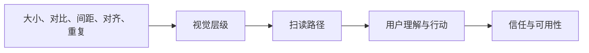
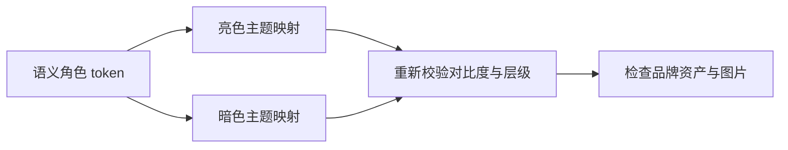

## 视觉设计基础

视觉设计是**用视觉语言传递信息层级、引导注意、建立信任**。用户不会逐字读界面，他们扫读、挑读，凭第一眼的视觉结构决定往哪看。本页写给有经验的产品经理与设计师：不讲 PS 技巧，讲决定性的原理——为什么这样排、为什么这样配色、为什么这样选字体，以及如何把原理落成可执行的检查清单。

本页属于[产品设计与原型总览](design.md)的类目之一；交互行为与可达性细节见[交互设计基础](design-interaction.md)，design token 与组件化实现见[设计系统与规范](design-systems.md)。

### 视觉设计的目标：层级、注意与信任

视觉设计在界面里承担三件事，都服务于"用户更快做对决定"：



图示说明：视觉信号先组织层级和扫读路径，再影响用户行动，最终沉淀为可用性与信任感。

1. **传达层级**：页面上一屏可能有几十个元素，视觉设计决定用户先看什么、后看什么、哪些可以忽略。层级清楚 = 用户在 5 秒内能说出"这页重点是什么"
2. **引导注意**：关键时刻（错误、保存成功、AI 建议）把注意力引到对的地方；不需要时保持安静，不抢戏
3. **建立信任**：对齐、间距、字体的"做工感"是专业度的第一信号。用户判断"这个产品靠不靠谱"，视觉质量先于功能质量

视觉设计与品牌、可用性的关系：

-   **与品牌**：视觉是品牌感知的第一触点。颜色、字体、圆角、动效节奏共同构成品牌识别，一致性建立信任，风格漂移消耗信任。品牌手册里的"气质"最终要靠视觉规则落地
-   **与可用性**：视觉问题就是可用性问题。对比不足导致读不清，层级扁平导致找不到重点，间距混乱导致误操作。**不存在「只是视觉问题」的设计缺陷**，它最后都会变成用户流失与操作错误

### 视觉层级是界面语法

把界面当作一门语言：**大小、颜色、间距、对齐、重复是词汇，层级关系是句法**。用户对界面的理解先解析句法（结构），再填充词义（内容）。Robin Williams 在《写给大家看的设计书》里把视觉组织归结为四个原则——**对比（Contrast）、重复（Repetition）、对齐（Alignment）、接近（Proximity）**（合称 CRAP），至今仍是检验一张界面的最快框架：

| 原则 | 作用 | 界面示例 | 检查问题 |
| --- | --- | --- | --- |
| 对比 | 制造主次，引导注意 | 主按钮实心高对比，次按钮描边弱对比 | 去掉对比后，重点还找得到吗？ |
| 重复 | 建立系统感与预期 | 所有卡片同款圆角、所有标题同款字号 | 同类元素看起来是一家的吗？ |
| 对齐 | 形成看不见的秩序线 | 表单标签右对齐、列表内容左对齐 | 页面上有"漂移"的孤立元素吗？ |
| 接近 | 表达归属关系 | 标签紧贴输入框，远离下一组 | 用户会看错"哪句话属于哪个控件"吗？ |

判断一个视觉方案是否成立，先过这四问；四问都过不了，配色和字体再考究也是白搭。

## 格式塔原则：分组与结构从何而来

格式塔心理学（Gestalt psychology）研究人脑如何把零散元素组织成整体：**看见一张界面时，大脑先做的是自动分组**。所有"为什么这样排"的直觉，几乎都能回溯到格式塔原则；反过来，大部分"看着乱"的界面，都能在格式塔层面找到原因。

### 七条原则速查

| 原则 | 定义 | 界面示例 | 误用后果 |
| --- | --- | --- | --- |
| 接近（Proximity） | 空间距离近的元素被视为一组 | 表单 label 紧贴 input，字段间距大于分组间距 | 间距均匀 → 字段关系不明，用户填错行 |
| 相似（Similarity） | 形状、颜色、大小相似的元素被视为一组 | 所有可点击的次级操作同色同样式 | 主次操作同色 → 用户分不清轻重，误点 |
| 闭合（Closure） | 大脑自动补全不完整的图形 | 省略号、图标缺口、进度环"画个圈" | 元素切得太碎 → 用户无法识别整体形状 |
| 连续（Continuity） | 沿同一方向排列的元素被视为一条线 | 步骤条、时间线、横向卡片滑动 | 断点生硬 → 视线在跳转处断裂，读不懂流程 |
| 对称（Symmetry） | 对称的元素更易被感知为整体 | 居中布局、成对的操作按钮 | 不对称的视觉重量 → 页面"歪"，注意被拽偏 |
| 共同命运（Common Fate） | 一起移动的元素被视为一组 | 收起/展开时同组元素一起动 | 分组内元素不同步 → 用户看不出"哪些是一组" |
| 图底（Figure-Ground） | 视觉自动区分前景与背景 | 卡片 = 前景，页面底色 = 背景 | 前景背景对比不足 → 卡片"浮不起来"，内容糊成一片 |

### 组合使用与自查

-   **原则总是叠加使用**：卡片同时用了接近（内部间距小）、图底（表面色不同）、阴影（高度差）三层编码，所以一眼可辨；只靠一条原则的分组最脆弱
-   **编码要冗余**：重要分组至少用两种手段（间距 + 颜色，或间距 + 阴影），单一手段失效时（如色觉缺陷用户）分组仍然成立
-   **格式塔是"用户视角"的**：设计师按信息架构分组，用户按视觉信号分组；两者冲突时，以用户的为准。自查：把界面截图缩小到 30%，还能看出分组结构吗？

???+ warning "误区"
    分组靠「看起来整齐」而不是靠原则：间距随手拍（11px、7px、23px）会让接近性失效；给所有元素加一样的边框会让相似性失效。

    分组是主动设计的结果，不是排版的副产品。

## 视觉层级与扫读模式

### 制造层级的五种手段

层级靠五种手段的组合完成。**至少用两个维度编码一个层级差**，否则层级在一种条件下就会失效：

| 手段 | 怎么用 | 注意事项 |
| --- | --- | --- |
| 大小 | 标题 > 正文 > 辅助信息 | 只靠大小区分时，小字号信息容易被全部忽略 |
| 对比 | 颜色深浅、字重、明暗差 | 正文对比度 ≥ 4.5:1，弱化元素 ≥ 3:1（见色彩章节） |
| 间距 | 留白 = 亲疏；留白最多的元素往往最"贵" | 间距序列要成体系（8pt 阶梯），不要随缘 |
| 对齐 | 所有元素锚定同一秩序线 | 一处破例对齐就会破坏整页秩序感 |
| 重复 | 同层级用同一套样式，跨页保持一致 | 重复是层级被识别的前提：样式不统一，层级无法建立 |

**层级的本质是相对差**：标题 20px 与正文 16px 的差，比「标题 40px 但正文也是 32px」更能建立层级。经验法则：相邻层级的字号比 ≥ 1.25 倍，字重差 ≥ 1 档（如 400 → 500/700）。

### F 型与 Z 型扫读

Nielsen Norman Group 2006 年的眼动研究（232 名用户、上千次浏览）发现：**网页内容大多被扫读而非细读**，且扫读轨迹呈 F 型：先水平扫过顶部一行，再水平扫过中部一行（较短），然后沿左侧垂直向下。后续研究（2008）进一步确认：用户很少读完大部分内容。

-   **F 型**：描述的是「文本密集页面」的默认行为，不是推荐布局。对 F 型的正确回应是**把最重要的词句放进扫读路径**：段首第一句写结论、列表与短段落优先、关键词加粗/上色，让「扫」也能扫到重点
-   **Z 型**：常见于视觉导向页面（落地页、海报、数据大屏）的设计经验：视线从左上到右上（第一行），斜穿到左下，再到右下（第二行），把品牌与行动按钮放在 Z 的两个顶点。Z 型更多是设计实践的总结，缺乏 F 型那样的严格眼动研究支撑，用它时先确认页面确实是「视觉优先」而非「阅读优先」
-   **共同教训**：不管哪种扫读模式，用户都会跳过中段；所以**关键信息（核心收益、行动按钮、错误提示）必须放在扫读路径上**，而不是藏在段落中段

### 层级检查清单

-   [ ] 截图缩到 30%：只看得到黑白灰结构时，重点还在最显眼的位置吗？
-   [ ] 闭眼 3 秒再睁眼：视线第一落点是页面最重要的元素吗？
-   [ ] 每个层级差都至少用了两种编码手段（大小 + 对比，或间距 + 字重）吗？
-   [ ] 辅助信息（版权、说明文字）真的"退后"了吗，还是和正文一样抢眼？
-   [ ] 同类信息（所有错误提示、所有按钮）跨页面保持一致吗？
-   [ ] 扫读路径（F 的第一行、Z 的顶点）上放的是关键内容吗？

## 色彩

色彩是界面里语义负荷最重的视觉变量，也是最容易凭个人喜好失控的变量。把它当**系统**管理。

### 色轮与色彩关系

-   **互补色**（色轮对侧，如蓝/橙）：对比最强，用于强调与警示；大面积互补色易疲劳，常用于"1 个主色 + 1 个互补强调色"
-   **类似色**（色轮相邻，如蓝/蓝绿/绿）：和谐安静，用于大面积渐变与图表系列色
-   **三元色**（色轮三等分）：活泼，适合图表配色（如红/黄/蓝各一系），难驾驭，慎用于界面大面积
-   **单色**（同一色相不同明度/饱和度）：最稳的组合，配合中性色使用是界面配色的安全起点
-   **分裂互补**（互补色的两侧）：比互补柔和、比类似有活力，图表与数据可视化的常用方案

### 读懂 HSL 与十六进制

-   **HSL**：`hsl(色相 0~360, 饱和度 0~100%, 明度 0~100%)`。色相决定"是什么颜色"，饱和度决定"有多艳"，明度决定"有多亮"。调色时先想清楚要改哪个维度：「这个绿太脏」改饱和度，「这个蓝太暗」改明度，而不是盲调
-   **十六进制**：`#RRGGBB`，每两位一个通道（红/绿/蓝），值 00~FF；简写 `#RGB`（如 `#f00` = `#ff0000`）；带透明度为 `#RRGGBBAA`。十六进制适合精确交接，不适合思考色彩关系——思考用 HSL，交付用 HEX
-   **设计系统里的色板**通常以 HSL 的"明度阶梯"组织：同一色相下取 10~100 共 10 档明度，正文用深档、背景用浅档，保证全站同色相但层次分明

### 色彩语义与品牌联想

颜色的语义**不是普世的**，跨文化差异真实存在，做国际化产品必须核查目标市场的颜色联想：

| 颜色 | 西方常见联想 | 中文语境常见联想 | 设计含义 |
| --- | --- | --- | --- |
| 红 | 危险、停止、错误 | 喜庆、好运；股市上涨 | "错误红"在中文产品里要谨慎与"喜庆红"冲突的场景 |
| 绿 | 通行、成功、环保 | 健康、自然；也有"绿帽"的负面联想 | 通行/成功语义可用，营销语境注意负面联想 |
| 蓝 | 信任、专业、科技 | 冷静、科技、商务 | 全球最"安全"的主色，也是同质化最严重的颜色 |
| 黄 | 警告、乐观 | 皇家、尊贵（历史） | 明度高、白底上对比差，慎做正文色 |
| 白 | 纯洁、简洁 | 哀悼（部分场合） | 丧葬语境下"纯白界面"可能触雷，需看用户群体 |
| 紫 | 奢华、创意 | 神秘、尊贵 | 常用于"高级感"定位，但注意年龄层认知差异 |

**品牌色不等于界面色**：品牌色可以是一整个体系（主色、辅色、强调色、中性色），界面只用其中一部分；把品牌主色铺满全站是新手最常见的配色灾难。

### 对比度：WCAG 与计算方法

WCAG 2.2 对文本对比度的硬性要求（AA 级）：

-   **正文（常规字号）≥ 4.5:1**
-   **大字 ≥ 3:1**（大字 = 24px 常规或 18.66px 加粗，即 18pt / 14pt bold）
-   **非文本内容 ≥ 3:1**（图标、输入框边框、图表线条等 UI 组件与相邻颜色之间，WCAG 1.4.11）

对比度的计算方式（以"足够亮"为标准，用相对亮度公式）：

```text
线性化:c ≤ 0.03928 时 c/12.92,否则 ((c+0.055)/1.055)^2.4
相对亮度 L = 0.2126 × R + 0.7152 × G + 0.0722 × B   (R/G/B 为线性化通道值)
对比度 = (L亮 + 0.05) / (L暗 + 0.05)
```

| 配色 | 对比度 | 判定 |
| --- | --- | --- |
| 白底 #FFFFFF + 黑字 #000000 | 21:1 | 远超 AA |
| 白底 + 灰字 #767676 | 约 4.5:1 | 卡线通过（正文） |
| 白底 + 灰字 #999999 | 约 2.9:1 | 失败，只能做禁用态/装饰 |
| 白底 + 纯蓝 #0000FF | 约 8.6:1 | 远超 AA |
| 白底 + 品牌蓝 #0F62FE | 约 5.0:1 | 通过 |

实践要点：

-   **不要目测对比度**：人眼在颜色偏好上极不可靠，用工具算（WebAIM Contrast Checker、Figma 的 contrast 插件、浏览器 devtools 的自动检查）
-   弱化元素（次要说明、占位符）最容易跌破线：占位符 #999 在白底上是经典失败案例，弱化不等于看不清
-   深色背景上的浅色文字也要算，深底浅字并不自动达标（白底上 4.5:1 的 #767676 灰字，换成 #121212 深底后只剩约 4.1:1，反而跌破线）

### 色觉缺陷：绝不只靠颜色

约 **8% 的男性和 0.5% 的女性**有某种色觉缺陷，红绿色盲（红色弱/绿色弱）最常见。你的用户群里一定有，这不是小众问题。

-   常见类型：红色弱（protanomaly）、绿色弱（deuteranomaly）——两者对红绿差异都不敏感；蓝黄色弱更罕见
-   **铁律：颜色不得单独承担信息**。表单错误用「红 + 图标 + 文案」三重编码；状态点加形状或文字。
-   图表配色要避免"红绿对"这种经典失效组合（对色盲用户完全无法区分）；Figma 有色觉模拟插件，浏览器 devtools 也能模拟，设计稿交付前过一遍模拟器
-   色觉缺陷影响的不只是"看不见"，还有"看得费劲"：红绿不分的人看红绿对比的界面会持续消耗认知资源

### Material 色彩系统：角色与调色板

Material Design 3 把"颜色"抽象为**角色（color roles）**——颜色不再以具体色值出现，而是以语义角色出现在组件里，换肤时只换角色映射：

| 角色 | 用途 | 亮色主题典型映射 | 暗色主题典型映射 |
| --- | --- | --- | --- |
| primary | 主操作、选中态、强调 | tone 40 | tone 80 |
| on-primary | 画在 primary 上的内容（图标、文字） | tone 100 | tone 20 |
| primary-container | 主色的浅色容器（选中背景） | tone 90 | tone 30 |
| on-primary-container | 容器内文字 | tone 10 | tone 90 |
| secondary / tertiary | 次级与第三强调，通常更柔和 | 同构映射 | 同构映射 |
| error | 错误语义 | tone 40 | tone 80 |
| surface / surface-variant | 表面与表面变体 | tone 98 / 90 | tone 6 / 30 |
| on-surface / on-surface-variant | 表面上的正文 / 次级正文 | tone 10 / 30 | tone 90 / 80 |
| outline / outline-variant | 边框、分隔线 | tone 50 / 80 | tone 60 / 30 |

-   **tonal palette（色调调色板）**：每个 key color（关键色）按感知均匀的方式生成 0~100 的色阶，角色 = 具体 tone 的映射。亮色下 primary 取 tone 40，暗色下取 tone 80——**同一角色在两个主题下是不同的值，这就是主题化的基础**
-   M3 用 HCT 色彩空间（Hue/Chroma/Tone）生成调色板，保证"同一 tone 的不同颜色感知亮度一致"——这是传统 HSL 做不到的（相同明度 L 的不同色相，感知亮度差异很大）
-   对非 Material 项目同样适用的是这套**角色思维**：代码里永远写 `--color-primary`，不写 `--color-blue-500`；语义换肤时只改映射表

### 暗黑模式的配色原则

-   **避免纯黑**：用深灰（Material 亮暗主题的 surface 约在 tone 4~6，如 #141218/#121212 级别）。纯黑 #000 的问题：与周围环境对比过强造成眩光、OLED 屏上文字边缘发虚、无法表达"更高一层"（黑色之上再加黑不可见）
-   **饱和度控制**：暗色背景下高饱和色会"发光"刺眼，暗色主题的强调色应降低饱和度（M3 暗色主题里同一 key color 会降低 chroma）
-   **对比度重新校验**：亮色下 4.5:1 的配色换成暗色背景后可能跌破线，必须全量重算，不能"反色了事"
-   **高度用亮度表达**：暗色下阴影几乎不可见，层级改用"表面更亮"表达——弹层比背景亮一档，而不是比背景黑
-   **语义色替换，不是色相替换**：暗色主题的 primary 变亮（提高 tone），不是把蓝换成别的蓝。用户对「这还是同一个品牌色」的感知依赖色相与饱和度的连续性

### 中性色的暖冷调

灰有体温：

-   **冷灰**（偏蓝相）：理性、工具感、科技感，适合数据产品与专业工具
-   **暖灰**（偏黄/粉相）：温和、内容感、阅读感，适合内容型与消费级产品
-   做法：灰阶里混入 5%~15% 的品牌色相——品牌红的产品，它的灰是"带一点红的灰"，全站因此有了统一的色彩血缘；直接用纯 #666/#999 线性灰阶是最常见的中性色偷懒
-   中性色承载了页面 80% 以上的文字，是最容易"悄悄跌破对比度线"的地方——正文灰调深一档，比任何强调色都更能提升可读性

### 色彩检查清单

-   [ ] 正文与背景对比度 ≥ 4.5:1，所有 UI 组件 ≥ 3:1（工具实测，不目测）
-   [ ] 颜色没有单独承担信息：错误 = 红 + 图标 + 文案，状态 = 颜色 + 形状/文字
-   [ ] 色盲模拟器过了一遍，红绿对没有出现在图表与状态里
-   [ ] 色板按明度阶梯组织（同色相 10 档），不是随手取色
-   [ ] 品牌色没有铺满全站，强调色只出现在需要注意的地方
-   [ ] 暗色模式不是反色，而是语义角色换了另一组映射值
-   [ ] 中性色带品牌色相，正文灰不是纯 #666

## 排版

排版是界面的"语音语调"：字号决定音量，字重决定重音，字距决定语速。排版的纪律只有一个目的：**让文字以正确的优先级被读到**。

### 字体分类：认识"性格"与用途

| 分类 | 拉丁字体示例 | 中文对应 | 性格与用途 |
| --- | --- | --- | --- |
| 衬线（Serif） | Georgia、Times New Roman | 宋体、思源宋体 | 传统、权威、长文阅读；屏幕 UI 慎用于正文，常用于展示标题 |
| 无衬线（Sans-serif） | Inter、Roboto、Helvetica | 黑体（苹方、微软雅黑、思源黑体） | 现代、中性、屏幕可读性最好；UI 正文与标题的主力 |
| 等宽（Monospace） | Consolas、JetBrains Mono、SF Mono | 无严格中文对应（全角字天然近等宽） | 代码、数据、日志；数字与表格场景的秩序感 |
| 手写 / 装饰 | Brush、Script | 楷体、行书 | 人情味与品牌调性；只用于极少量展示，正文禁用 |

-   **UI 正文只用无衬线**是默认纪律：屏幕渲染下小字号衬线字的笔锋会糊，中文宋体小字号在低分屏上尤其明显
-   一个界面**最多两个字体族**（如"无衬线正文 + 衬线/手写展示"）；再多就是风格失控的信号
-   中文场景注意：不同黑体的字面率（字身占满程度）差异很大，苹方偏窄、思源黑体偏宽，混用两套中文黑体（如标题苹方 + 正文微软雅黑）会有肉眼可见的"胖瘦不齐"

### 字体层级：字号阶梯

-   **比例建议**：相邻档位 1.25 倍（大三度）或 1.333 倍（纯四度）。从正文 16px 起：1.25 → 16 / 20 / 25 / 31 / 39；1.333 → 16 / 21 / 28 / 37 / 50。展示级大字号可以从更大的基数开始
-   **Material M3 type scale**（一套可直接抄的完整阶梯）：display 57/45/36，headline 32/28/24，title 22/16/14，body 16/14/12，label 14/12/11——display 用于大屏展示，headline 用于页面标题，title 用于区块标题与卡片标题，body 是正文，label 是按钮/标签小字
-   **一个页面 3~5 档字号足够**：超出就会开始"读不出层级"。层级靠"字号 + 字重 + 颜色"三重编码，不要只靠字号
-   数字档位要能整除栅格：字号与行高共同决定行距，16px 正文 + 24px 行高（1.5 倍）能对齐 8pt 栅格；20px 正文 + 30px 行高同理——**字号选完就固定，别随手 +1px 微调**

### 行高与行宽

-   **行高**：拉丁正文 1.4~1.6 倍；中文正文建议 1.6~2.0 倍：中文没有拉丁字母的升部/降部结构，字面几乎占满字身，同样字号下需要更大的行高才不"挤"。标题行高可以收到 1.2~1.3，正文行高与标题行高的差异本身就是层级的一部分
-   **行宽**：拉丁正文 45~75 字符/行（经典排版学结论，超出后眼睛回行困难）；中文正文约 30~45 字/行。中文页面满宽排布（一屏 40+ 字）是阅读疲劳的头号来源，正文容器应限宽
-   **两端对齐（justify）**：中文标点的"行首禁则"处理不好会出现字距不均的"河流"；优先级是"中文优先 justify + 悬挂标点"、次选"左对齐"。拉丁正文在窄栏里 justify 也容易出难看空隙，左对齐是安全默认

### 字重与斜体：克制的强调

-   字重阶梯 400 / 500 / 700 三档足够（中文黑体常见档位更少，如苹方 400/500/600/700 可用但别全用上）；**不要用浏览器伪粗体**（faux bold：系统对不存在的字重做加粗拉伸，字形会糊）
-   斜体在中文里基本是伪斜体（把正体旋转/倾斜），字形走样；**中文强调用字重、颜色、引号，不用斜体**。拉丁正文的斜体也只用于书名、术语等窄场景
-   强调是稀缺资源：一屏里加粗/变色的地方超过 5 处，等于没有强调。层级设计完成后再做强调，而不是边写边画

### 数字与 tabular-nums

数字默认是比例宽度（1 和 8 宽度不同），在表格、价格、计数器、倒计时里会**逐位跳动**。用等宽数字：

```css
font-variant-numeric: tabular-nums;
```

-   适用场景：数据表格、价格、股票行情、倒计时、统计卡
-   不适用：正文里的自然数字（比例数字阅读更自然）、品牌 Logo 里的数字
-   中文场景提醒：等宽数字属性对中文字体（如苹方）支持良好，但老式网页字体可能不实现，交付前在目标字体上验证

### 中文排版要点

| 问题 | 要点 |
| --- | --- |
| 全角/半角 | 中文正文用全角标点（，。；：「」），英文与数字用半角；全角与半角之间不混排标点 |
| 中英混排留白 | 中文与英文/数字之间留一个空格（本页即如此排版）；CSS 层面可通过 font-family 顺序与 word-spacing 辅助，但手动空格最可靠 |
| 引号 | 中文用「」或“”（全角），不要用英文直引号 " 混在中文里 |
| 标题字距 | 中文大标题可略收紧 letter-spacing（如 -0.01em~-0.02em）增强厚重感；正文不要全局调字距 |
| 行首禁则 | 句号、逗号、引号不能出现在行首（排版引擎一般自动处理，自定义渲染时必须检查） |
| 数字与单位 | 中文与数字之间留空格（"16px 栅格"而非"16px栅格"）；百分号、度数与数字之间不加空格 |

### 字体授权与性能

-   **中文字体文件极大**：全量思源黑体超 10 MB，全量加载等于灾难。必须**子集化**：按页面/按字符集拆分（`unicode-range`），或用字蛛/fontmin 等工具按需提取用到的字
-   **加载策略**：`font-display: swap` 避免文字不可见期（FOIT）；WOFF2 是当前压缩率最高的格式；关键字体（正文）自托管优先，第三方字体服务要评估跨域与稳定性
-   **授权是硬门槛**：思源黑体/思源宋体、阿里巴巴普惠体可免费商用；方正、汉仪、造字工房等大量字体**需商业授权**，尤其注意"仅个人使用"的免费版不能用于产品。字体版权纠纷在中文产品里非常常见，用之前先查授权条款
-   **性能与体验的平衡**：系统字体（见下）加载为零、渲染最快；web font 只用于品牌展示字（Logo、大标题），正文尽量用系统字体——正文加载 10 MB 字库换来的"设计感"，远抵不上首屏等待的代价

### 系统字体栈

```css
font-family: system-ui, -apple-system, "Segoe UI", Roboto,
  "PingFang SC", "Hiragino Sans GB", "Microsoft YaHei",
  "Noto Sans CJK SC", sans-serif;
```

-   按平台依次回退：macOS/iOS 落到苹方，Windows 落到微软雅黑，Android/Linux 落到 Noto/思源黑体
-   优点：零下载、渲染最快、与系统 UI 风格天然一致；代价：各平台渲染略有差异（字宽、字面率），跨端验收时每端都要看一眼
-   中文 UI 的默认纪律就是"系统字体栈起步，web font 只做增量"

### 排版检查清单

-   [ ] 全站字号档位 ≤ 5 档，每档字号/字重/行高有明确用途
-   [ ] 正文行高 ≥ 1.5，行宽在 45~75 拉丁字符（中文 30~45 字）范围
-   [ ] 中英文混排空格一致，全角标点没有混入半角
-   [ ] 表格/价格/计时场景用了 tabular-nums
-   [ ] 没有伪粗体、中文没有伪斜体
-   [ ] 字体授权已确认，web font 已子集化，font-display 为 swap

## 栅格与间距

间距是界面的"呼吸"，栅格是间距的秩序来源。没有栅格的界面像没有装订线的文稿：每段都整齐，整体没有结构。

### 列栅格：12 列与 8 列

-   **12 列**：可被 2/3/4/6 整除，组合最灵活，是仪表盘与内容页的默认选择。布局时元素宽度占整列数（如 8/12 + 4/12），列间距（gutter）固定（16/24px），页边距（margin）随断点变化
-   **8 列**：更简单，适合表单与移动端（Material 移动端即 4 列/8 列体系）；12 列在窄屏上会切出 1/12 的碎宽度
-   **断点行为**：移动端 4 列 → 平板 8 列 → 桌面 12 列是常见阶梯；断点处重新排布而不是缩放。内容宽度要有上限（如 1200px 内），超宽屏上"满屏流动"的正文行宽会失控
-   栅格是**约束不是监狱**：特殊元素（数据大屏、沉浸式页面）可以破格，但破格要有理由，且全站破格点少于 3 处

### 8pt 栅格与 4pt 的取舍

-   **8pt 栅格**：间距、尺寸、组件高度都取 8 的倍数（8/16/24/32/48/64）。优点：系统性强、跨组件对齐容易；在主流分辨率（8 的倍数）下天然整除
-   **4pt 栅格**：4 的倍数（4/8/12/16/20/24），粒度更细。取舍：数据密集界面（表格、表单、监控面板）里 8pt 太粗，4pt 能塞进更多信息；代价是"随手 +4"的机会变多，体系感变弱
-   实践共识：**页面级间距用 8pt，组件内部细节（图标间距、输入框内边距）用 4pt**；圆角、阴影等细节可以用 2pt 粒度的值。一个产品里"8pt 为主、4pt 兜底"比"二选一"更常见
-   间距梯度的硬性要求：**相邻档位视觉可区分、跨档位规律一致**：13px 和 15px 的间距差用户感知不到，体系等于没有

### 黄金比例与斐波那契：启发不是教条

黄金比例（1.618）与斐波那契数列（1/2/3/5/8/13/21/34）常被奉为「完美间距」的来源：

-   它们是**启发式**：人类对比例的感知有偏好，相邻元素的比例差在 1.3~1.6 倍时最容易区分——黄金比例恰好落在这个区间，所以"看起来对"
-   它们**不是教条**：黄金比例推导不出栅格系统，斐波那契间距（13/21/34）与 8pt 体系（16/24/32）同样成立，两者没有优劣
-   判断标准只有一个：**间距序列是否可感知、可解释、可复用**。能说出"为什么是 16"（8×2，与组件高度对齐）比"因为是黄金比例"（解释不了为什么 21px）可靠得多

### 间距语义化：space token

间距与颜色一样要语义化，而不是裸数值：

```text
space-1 = 4px   （图标与文字之间、紧凑组件内边距）
space-2 = 8px   （组件内部、标签与内容）
space-3 = 12px  （输入框内边距、小卡片内边距）
space-4 = 16px  （组件间距、卡片内边距）
space-6 = 24px  （区块间距、表单字段间距）
space-8 = 32px  （大区块间距、页面留白）
space-12 = 48px （页面级分隔）
```

-   token 的价值：写布局时用 `space-4` 而不是 `16px`，全局改间距只需改 token 映射；命名按语义（间距用途）而非位置（margin-left），才能跨组件复用
-   token 与栅格对齐：所有间距值都应落在 4/8 的倍数上，组件高度、行高与间距共用同一套数值语言（16px 正文 + 24px 行高 + 8px 间距 = 3 个 8）
-   实现与治理细节见[设计系统与规范](design-systems.md)

## 形状、表面与图标

形状与表面决定"元素是什么质感、有多重要"，是层级在"体量"维度的表达。

### 圆角的语义层级

圆角是**亲和度与密度的刻度**：

| 圆角档 | 典型值 | 组件示例 | 语义 |
| --- | --- | --- | --- |
| 小 | 4~8px | 按钮、输入框、标签、表格单元格 | 紧凑、工具感、数据密集 |
| 中 | 12~16px | 卡片、列表项 | 默认的"内容容器"质感 |
| 大 | 16~28px | 对话框、弹层、大图容器 | 强调容器边界、消费级亲和感 |
| 全圆 | 50% / 999px | FAB、胶囊按钮、头像 | 最亲和，吸引注意，不适合大面积 |

-   **全站圆角 ≤ 3 档**，与间距 token 同源（Material M3 的 shape 体系：none/4/8/12/16/28/full）
-   **嵌套圆角规则**：外层圆角 ≥ 内层圆角 + 间距（如卡片 16px、内部按钮 8px），视觉上"同心缩小"，否则内层元素会顶出外层边界
-   圆角与用途匹配：高密度数据工具用大圆角会浪费空间，消费级内容产品用小圆角会显得生硬——圆角档位本身就是产品气质的一部分

### 阴影与高度：elevation

阴影表达"元素离页面多高"——阴影越大越模糊，元素越"飘起来"：

-   **阴影参数**：偏移（offset-x/y）、模糊半径（blur）、扩展（spread）、颜色与透明度。低高度：1~2px 偏移 + 小模糊 + 较高透明度；高高度：更大偏移 + 大模糊（透明度可略降，防止糊成一团）
-   **Material elevation 体系**：0~5 档高度，0 为平贴（无阴影），1~2 用于卡片/按钮常态，3~4 用于 hover 提升与浮层，5 用于对话框/弹层（最高）
-   **阴影要有层级差**：全站阴影只有"有/没有"两档等于没有层级；常态阴影要「看不见参数、看得见层级」：用户说不出阴影值，但能说出「这个浮在页面上」
-   M3 的现代做法：阴影 + **surface tint**（表面着色：在表面叠一层低透明度 primary 色，高度越高 tint 越明显）组合表达高度，暗色模式下尤其有用（阴影在暗背景上几乎不可见）
-   规则：**能交互的才浮起**。按钮 hover 浮起一档、弹层始终最高、静态卡片不要常驻大阴影——阴影是"可操作"的信号，到处阴影等于没有信号

### 边框与分割线

-   **分割线是最弱的分隔手段**：1px 的线对比度低、视觉噪音高，分隔效果远不如间距与表面差。优先用"间距 + 表面色差"（卡片化）区分区块，分割线留给真正需要"划线"的场景（表格行、清单）
-   **描边（outline）**用于：输入框（可编辑状态）、次级按钮（弱于主按钮的实心）、分隔内容；1px 是默认，强调状态（聚焦）才用 2px 或加色
-   表格分隔的现代倾向是"少线条、多间距"：斑马纹 vs 行网格线 vs 纯间距——数据行数少用间距，行数多用细网格线，两者都不需要再叠分割线
-   边框颜色用 outline 类 token（见色彩章节）而不是灰色随取，保证聚焦/错误/禁用态的边框语义一致

### 图标设计：网格、描边与风格

-   **网格**：标准图标画布 24×24（Material 惯例），描边 1.5~2px（Material 线性图标约 2px 描边）；尺寸取 16/20/24/32 等 4 的倍数，保证缩放对齐像素
-   **线性 vs 面性**：线性图标轻盈、信息密度低；面性图标厚重、远距离可辨。**一套图标只能用一个风格**：线性与面性混用（同一个产品里一半描边一半填充）是界面"业余感"的最快来源
-   风格参数要统一：描边粗细、端点圆角（cap）、转角圆角（join）、视觉重心——同一套图标的"笔触性格"必须一致，哪怕来源是不同图标库
-   **图标不单独承担语义**：图标 + 文字标签是默认（尤其导航与操作）；只有通行度极高的图标（放大镜、齿轮）可以裸用。不认识功能的图标不是装饰，是噪音
-   点击目标：图标本身可小，但可点击区域 ≥ 44×44pt（移动端）或 32~40px（桌面），不可点击区不做视觉干扰

### 插画与图片：风格一致性

-   插画是品牌的延伸：同一套插画必须统一线稿风格、配色体系（用色板的颜色！）、阴影方式、角色比例——混搭"3D 角色 + 扁平插画 + 真实照片"的页面会迅速失去可信度
-   图片统一性：同一批卡片/横幅的照片统一色调（滤镜/LUT 一致）、统一裁切比例、统一主体位置；风格不统一的图库照片堆在一起，比没有图更伤质感
-   空状态、引导页、404 页是插画的主场，也是风格一致性最容易被破坏的地方（外包插画没有接入设计系统是常见原因）

## 动效的视觉角色

动效是**层级与状态的语言**。判据：一个动效如果不能回答「它传达了哪个信息」，就该删掉。

### 动效的三个职责

1.  **引导注意**：新内容出现（消息、AI 输出）、状态变化（成功、错误）时，动效把视线引过去；不需要注意的地方不动
2.  **表达层级**：元素从哪里来、到哪里去——弹层从屏幕下方升起、卡片从列表位置展开，用户因此理解"这个元素和那个元素的关系"
3.  **解释状态变化**：展开/收起、列表重排、元素转换（spinner → 内容）——动效让"变之前 → 变之后"连续可懂，而不是两帧硬切

### 缓动、时长与距离

-   **缓动（easing）**：默认不用 linear（机械感）。进入用 ease-out（快起慢收），离开用 ease-in（快收）；Material 标准缓动 `cubic-bezier(0.2, 0, 0, 1)`；强调缓动 `cubic-bezier(0.2, 0, 0, 1)` 配更长时长。bounce/elastic 类弹性缓动只用于极少数"庆祝"场景
-   **时长**：微反馈（按钮按压、开关）100~150ms；常规过渡（卡片展开、弹层）150~300ms；大场景过渡（页面切换、全屏）300~500ms。超过 500ms 的动效用户会开始等待
-   **距离与时长成正比**：同样的缓动曲线，移动 400px 比移动 40px 需要更长时长（约 250ms vs 150ms），否则远处的元素"飞得太快"显得生硬
-   时长与距离的定量关系比"感觉"可靠：先定基准（如 200ms/100px），再按距离线性外推

### prefers-reduced-motion 与动效可访问性

-   **prefers-reduced-motion**：用户系统开启"减少动态效果"时触发的 CSS 媒体查询。遵守它是动效设计的底线，不是可选项。
-   替代方案：**用低刺激动效替换**：位移动画换成透明度渐变（fade），缩放换成淡入；保留信息（状态变化仍然可感知），去掉位移刺激
-   WCAG 相关条款：2.2.2（Pause, Stop, Hide，闪烁/自动滚动必须可暂停）、2.3.1（闪烁 ≤ 3 次/秒，防癫痫）、2.3.3（Animation from Interactions，AAA：交互触发的动效可关闭）
-   前庭障碍（晕动症）用户对大幅位移动画敏感，长距离平移动效（如横向轮播自动滑动）要提供关闭开关
-   动效与加载的结合：AI 产品的"生成中"动画要克制——无限旋转的 loader 会放大等待焦虑，进度感（流式输出、阶段文字）比动画好看更有用（详见[交互设计基础](design-interaction.md)）

## 深色模式与主题化

深色模式是一次完整的主题设计。设计层面要做的事：



图示说明：深色模式复用同一套语义角色、切换具体映射值，并重新验证对比度、层级和品牌资产，而不是简单反色。

-   **语义色替换**：亮/暗主题是同一组角色映射到两套值（primary 变亮、surface 变暗、outline 变亮一档），不是反色、不是色相替换（见色彩章节的 Material 角色表）
-   **避免纯黑**：表面用深灰（#121212 级），纯黑只留给真正的"沉浸"场景（图片/视频背景）
-   **对比度重新校验**：亮色下算过的 4.5:1 在暗色下要全量重算；深色背景上的灰字更容易跌破线
-   **高度表达切换**：暗色下阴影让位于"表面亮度差"与 surface tint（更高一层 = 更亮），elevation 语义不变、实现换一种
-   **图片与品牌资产**：透明底 Logo 在暗色下可能"黑成一团"，需要为暗色提供反白版本；插画/照片的明暗基调也要检查
-   **切换机制**：跟随系统（prefers-color-scheme）+ 手动切换并存，默认跟随系统；切换不应丢失（记住用户选择）
-   把"亮暗两套值"落成 token 映射是设计系统的活，见[设计系统与规范](design-systems.md)

## 常见错误清单：对照自查

设计评审与自查时逐项打勾，任一错误存在即视为不合格：

| 错误 | 表现 | 修复判据 |
| --- | --- | --- |
| 层级扁平 | 全页同字号同字重同颜色，看不出重点 | 截图缩到 30% 仍能说出重点在哪 |
| 对比不足 | 正文用 #999 灰字、弱化元素看不清 | 正文 ≥ 4.5:1，弱化元素不参与信息传达 |
| 只靠颜色 | 错误只变红、状态只靠色点 | 颜色 + 图标 + 文案三重编码 |
| 字体过多 | 一个页面 ≥ 3 个字体族、字号档位随意 | ≤ 2 个字体族，≤ 5 档字号 |
| 间距随缘 | 间距值 7px/13px/19px 随手拍 | 全站间距落在 4/8 倍数的 token 阶梯 |
| 图标风格混杂 | 线性与面性混用、描边粗细不一 | 一套图标一个风格，参数统一 |
| 圆角无体系 | 每个组件一个圆角值 | 全站 ≤ 3 档圆角，嵌套遵循"同心缩小" |
| 阴影无层级 | 到处是阴影或只有有/无两档 | elevation 阶梯明确，能交互的才浮起 |
| 动效无目的 | 全部元素都在动、全用 linear | 每个动效能说出传达的信息，时长与距离匹配 |
| 深色模式是反色 | 直接 invert 或换色相 | 语义 token 两套值，对比度重算，避免纯黑 |

排查顺序建议：先查层级（结构），再查对比与颜色（语义），最后查形状/图标/动效（质感）——前面的错误不修，后面的打磨全是浪费。

## 来源说明

> 以下来源均于 2026-08-24 验证可达；页面可能随时更新。

**官方文档与博客**

-   [Nielsen Norman Group：Gestalt Principles](https://www.nngroup.com/articles/gestalt-principles/)（格式塔原则与界面应用）
-   [Nielsen Norman Group：Visual Hierarchy](https://www.nngroup.com/articles/visual-hierarchy-ux-definition/)（视觉层级定义与实现手段）
-   [Nielsen Norman Group：F-Shaped Pattern For Reading Web Content](https://www.nngroup.com/articles/f-shaped-pattern-reading-web-content/)（2006 眼动研究：F 型扫读）
-   [Nielsen Norman Group：How Little Do Users Read?](https://www.nngroup.com/articles/how-little-do-users-read/)（2008：用户很少读完网页内容）
-   [Nielsen Norman Group：Designing for Color-Blind Users](https://www.nngroup.com/articles/color-blindness/)（色觉缺陷用户设计）
-   [Material Design 3：Color System](https://m3.material.io/styles/color/system/overview)（color roles、tonal palette、HCT 色彩空间）
-   [Material Design 3：Dark Theme](https://m3.material.io/styles/color/dark-theme)（暗色主题设计与配色）
-   [Material Design 3：Typography](https://m3.material.io/styles/typography/overview)（type scale 与字体使用）
-   [Material Design 3：Shape](https://m3.material.io/styles/shape/overview)（圆角体系）
-   [Material Design 3：Elevation](https://m3.material.io/styles/elevation/overview)（高度与阴影、surface tint）
-   [Material Design 3：Motion](https://m3.material.io/styles/motion/overview)（缓动与时长）
-   [Apple Human Interface Guidelines](https://developer.apple.com/design/human-interface-guidelines/)（颜色、排版、动效与可访问性）
-   [WCAG 2.2（W3C）](https://www.w3.org/TR/WCAG22/)（1.4.3 文本对比度、1.4.11 非文本对比、2.2.2/2.3.1/2.3.3 动效与闪烁）
-   [WebAIM Contrast Checker](https://webaim.org/resources/contrastchecker/)（对比度计算工具）

**经典著作**

-   Steve Krug, Don't Make Me Think（《点石成金》：用户扫读、不做功课）
-   Robin Williams, The Non-Designer's Design Book（《写给大家看的设计书》：对比/重复/对齐/接近四原则）
-   Adam Wathan & Steve Schoger, [Refactoring UI](https://www.refactoringui.com/)（视觉细节决策：层级、间距、颜色的实操清单）
-   小林章《字型之迷》（拉丁与中文排版的差异与共性，字体性格）
-   Jesse James Garrett, The Elements of User Experience（《用户体验要素》：表现层在五层模型中的位置，可对照[产品设计与原型总览](design.md)）
