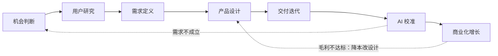

## 产品方法论简介

本页是产品方法论栏目的入口，面向有经验的产品经理与准备 AI PM 岗位的候选人。

栏目主体是一条从机会到商业的**决策链**：做什么、为谁做、如何设计、按时交付、迭代校准、让开发照做、赚钱。

决策链之外还有一组**支撑页**：思维模型给判断结构，能力模型给自测标准，战略决定战场，生命周期判断资源投向，数据分析把指标落到动作。「产品设计与原型」在总览之上另辟七页深度类目（设计哲学、视觉、交互、系统、原型、评审、黑话），按需深入；两条线都以总览页为枢纽。

先看[方法论总图](#方法论总图)看清整条链，再按自己的场景选[分场景阅读路径](#分场景阅读路径)；每篇的位置、产出与误用见[内容列表](#内容列表)。

本页可当「面试前 15 分钟地图」：读完能说出每篇解决什么问题、怎么串起来，也能指出「评测结果会推翻需求优先级」这类环节间的关键关系。

### 方法论总图

一个 AI 产品从机会到增长的完整闭环，大致走七个环节：

图示说明：七个环节以交付为主线，但 AI 校准可以把问题送回机会判断，商业约束也会反向推动设计降本。

| 环节 | 核心问题 | 关键产出 | 主要方法 |
| --- | --- | --- | --- |
| 机会判断 | 解决谁的什么问题？值不值得做？ | P0-P3 需求清单与价值判断 | 需求分析四步（收集→判断→分级→拆解）、频率与强度 × 用户规模 × 付费潜力打分（[需求分析](requirements.md)） |
| 用户研究 | 用户是谁、在什么场景、有什么痛点？ | 用户画像、场景清单、访谈纪要 | 访谈、问卷、可用性测试、数据分析、日志分析（[用户研究](user-research.md)） |
| 需求定义 | 做到什么程度算"好"？边界在哪？ | PRD：能力边界、评测标准、失败路径、成本预算 | 10 节 PRD 模板，先写边界/评测/兜底三节（[AI 产品 PRD](prd.md)） |
| 产品设计 | 用户怎么理解和使用？失败时怎么兜底？ | 包含失败状态的交互原型 | 体验五层、交互范式决策链、错误注入测试（[产品设计与原型](design.md)、[设计哲学与设计思维](design-philosophy.md)、[设计评审与可用性度量](design-evaluation.md)） |
| 交付迭代 | 怎么按时按质交付？ | 迭代计划、评测节奏、灰度回滚方案 | "两快一慢"节奏、小步快跑、灰度与回滚（[项目管理与迭代](project-management.md)） |
| AI 校准 | 效果好不好？错在哪？怎么修？ | 评测报告、错误模式表 | CC/CD 循环、评测集与线上指标（[AI 产品开发生命周期](ai-lifecycle.md)、[评估与评测](../ai/evaluation.md)） |
| 商业化增长 | 怎么赚钱？单位经济是否成立？ | 定价方案、月成本测算、毛利模型 | 五类商业模式、成本优化三杠杆、LTV/CAC（[商业化与增长](monetization.md)、[LLM 成本测算](../tools/llm-cost.md)） |

七环是主链。下面五页不插入某个固定环节，而是给主链提供战场、阶段、证据、提问结构和自测标准：

| 支撑页 | 回答什么 | 何时先读 |
| --- | --- | --- |
| [思维模型](../intro/thinking-models/index.md) | 这个问题该用哪套提问结构 | 范围取舍、根因诊断、任务澄清、1:1 推进之前 |
| [能力模型](../intro/capability.md) | 自己缺哪一维、目标岗要哪些证据 | 自学对照、转岗、拆 JD 时 |
| [产品战略与竞争](strategy.md) | 在哪个市场竞争、凭什么赢 | 立项选战场、面试「套壳有没有护城河」 |
| [产品生命周期](product-lifecycle.md) | 产品处在什么经营阶段、资源投向哪里 | 排增长/变现/收缩目标、和 CC/CD 区分开时 |
| [数据分析入门](data-analysis.md) | 指标怎么拆、漏斗/留存在哪一步坏了 | 看数、搭看板、模型替换前后对比时 |

???+ warning "这不是线性瀑布"
    闭环不等于流水线。AI 产品的机会判断常常由**能力驱动**：先发现"模型新能力"再找场景，不只从用户痛点出发。

    上线后评测结果会反过来推翻需求优先级，逼你回到机会判断重新定义问题。

    正确用法是把它当作检查清单：在任意环节发现"上一环没做实"，就回去补。

**读图方式**：从手头的场景切入，不从第一行开始。0 到 1 立项从战略与机会判断进入，改造现有功能从用户研究进入，企业级落地从需求分析进入。每个环节往下走时，带着上一环的产出逐项检查：问题定义够不够具体、用户证据是否支撑需求、需求是否写得可验收、设计是否覆盖失败路径、迭代是否有评测兜底、商业是否算得过账。对不上的地方，就是当前最该补的环节。

整张图里有两个最容易被跳过的**回环**：一是 AI 校准回到机会判断——评测发现需求不成立时，回去改需求定义，别硬修模型；二是商业化回到产品设计——毛利不达标时先改模型选型与交互降本，别只调价格。

**一个完整走查（客服工单助手）**：机会判断——从「工单流转太慢」的抱怨出发，访谈发现真正的痛点是路由靠人工按标题判断；用户研究——一线客服日均 500 张工单，按退款/物流/投诉/咨询四类分布；需求定义——PRD 写清「只做路由建议、不做自动回复」，路由准确率 ≥ 90% 才算好；产品设计——路由界面放「一键改路由」兜底，识别失败直接转人工；交付迭代——按「两快一慢」节奏先给 10% 工单灰度；AI 校准——每周抽 30 条低置信度工单人工复核，错误回填评测集；商业化增长——按单次调用成本 × 月调用量算账，先确认毛利为正再放量。

## 为什么产品方法论重要

-   **AI 改变技术底座，不改变产品本质**：一个 AI 产品是否成功，仍取决于需求是否真实、体验是否顺畅、成本是否可控、商业是否成立。模型再强，需求是伪需求也白搭。典型失败是先做一个智能助手：功能做了半年，用户没有真实场景，能力越强越不知道该往哪用。
-   **需求是产品工作的起点**：《俞军产品方法论》的第一公式是「用户价值 = 新体验 − 旧体验 − 替换成本」；《人人都是产品经理 2.0》的 Y 模型提醒「用心听，但不要照着做」。用户说的表层需求背后是目标动机，方法论的第一个作用就是把模糊诉求变成可判断、可分级、可执行的需求（[需求分析](requirements.md)）。
-   **方法决定迭代效率**：《精益创业》把进步定义为验证式学习，而非功能交付；《启示录》强调发现与交付的连续循环。产品失败大多源自用昂贵的方式验证错误假设，而非执行不力；方法论的价值是用最小成本尽早证伪（详见[读书笔记](../case/books/index.md)）。
-   **方法论是团队的共同语言**：CC/CD 框架的底层是判断力——发什么、出错时怎么保护用户、何时交还控制、何为足够好。框架给产品直觉一个循环、节奏和共同语言，让产品、工程、数据在同一节奏上协作（[AI 产品开发生命周期](ai-lifecycle.md)）。
-   **AI 放大了方法论的必要性**：不确定性进入需求的每个环节（模型能不能做到、效果达不达标、成本会不会失控）。方法的作用是把这些不确定性收束成可交付、可评测、可运营的产品约束，这正是[能力模型](../intro/capability.md)里「① 产品判断与用户价值」的定位。

## 内容列表

本栏目与其他栏目的分工：**[AI 基础](../ai/index.md)**回答"模型能做什么"（能力边界与评测），**[实战](../practice/index.md)**回答"具体产品形态怎么设计"（Agent、Copilot、知识库问答），**[工具](../tools/index.md)**回答"怎么算账"（成本、数据），**[商业与财会](../business/index.md)**回答"金融与财务领域是怎么运转的"，**[工商管理](../management/index.md)**回答"课堂里的战略、营销、组织与项目管理原理"，**[垂直领域](../vertical/index.md)**回答"具体行业的对象、流程、监管和 AI 切入点"，**[求职](../job/index.md)**回答"怎么把方法论讲给面试官"。本页负责把方法论串成决策链。

读工商管理时，先用本栏目落地，再回课堂页补原理：[产品战略](strategy.md)对应[战略管理](../management/10-strategy/index.md)，[商业化与增长](monetization.md)对应[市场营销](../management/06-marketing/index.md)与[商业模式](../management/12-business-model/index.md)，[项目管理与迭代](project-management.md)对应[项目管理](../management/15-project-management/index.md)，[设计哲学](design-philosophy.md)对应[设计思维](../management/14-design-thinking/index.md)。

决策链上的正文按使用顺序排列，每篇解决一类决策问题：

| 页面 | 适用阶段 | 要回答的问题 | 最小可用产出 | 常见误用 | 不适用时（替代方案） |
| --- | --- | --- | --- | --- | --- |
| [思维模型](../intro/thinking-models/index.md) | 任何需要共享判断语言的讨论 | 这个问题该用哪套提问结构？ | 一张分类/诊断/行动记录 | 把模型当结论；五个模型全套一遍 | RICE、WSJF、KANO、JTBD 见[需求分析](requirements.md)，不必另开模型页 |
| [能力模型](../intro/capability.md) | 自学对照、转岗、拆 JD | 自己能独立承担哪一层责任？ | 五维自测清单 + 作品证据 | 把「了解模型」当成产品能力 | 只想学某一环方法时，直接进对应正文 |
| [产品战略与竞争](strategy.md) | 立项选战场、模型趋同后的差异化 | 在哪个市场竞争？凭什么赢三年？ | 一页纸战略 + 护城河判断 | 把套壳当终局；0 到 1 就建平台生态 | 内部工具以公司目标与 ROI 替代市场竞争分析 |
| [产品生命周期](product-lifecycle.md) | 产品开发、上线与经营全程 | 产品处在什么阶段？资源应该投向哪里？ | 阶段判断表 + 经营目标 + 收缩/转型门槛 | 把生命周期当固定时间表；只看销售额，不看留存、利润与成本 | 一次性交付的定制项目或短期活动，不必建立完整生命周期策略 |
| [需求分析](requirements.md) | 立项前、每次迭代前 | 这个需求真实吗？值不值得做？优先级？ | 一张 P0-P3 需求清单，每条带价值判断 | 用户要什么就给什么；拍脑袋定需求；需求分析只做一次 | 需求已被数据反复验证时，可直接进 PRD，但仍保留迭代校验 |
| [用户研究](user-research.md) | 机会判断之后、需求定义之前 | 用户是谁、在什么场景、有什么痛点？ | 5-8 人访谈纪要 + 场景清单 | 让用户做产品设计；只问"你会不会用"；忽视 AI 素养差异 | 冷启动没有用户时，用竞品分析与客服工单数据替代，访谈后补 |
| [数据分析入门](data-analysis.md) | 上线前后看数、模型替换、看板搭建 | 现在怎么样、哪里坏了、改动有没有效？ | 指标口径 + 漏斗/留存/同期群结论 + 看板 | 先看数再编故事；生成完成当成转化；整体留存不分层 | 还没有埋点时，先补事件再分析，方法见[数据与标注](../tools/data.md) |
| [产品设计与原型（总览）](design.md) | 需求定义之后、开发之前 | 用户怎么理解？失败时怎么兜底？ | 包含失败状态的交互原型 | 把 AI 包装成无所不能；只画成功路径；让用户猜系统在干嘛 | 纯后端 API 或内部工具无界面时，只需能力边界与输出格式设计 |
| [AI 产品 PRD](prd.md) | 需求定义之后、开发之前 | 怎么把判断写清楚，让开发照做、验收有据？ | 10 节 PRD：边界、评测标准、失败路径、成本预算 | 只写功能不写"好坏标准"；失败路径写"加强监控"；不写成本 | 内部工具或快速实验，一页纸需求即可，不必写全 10 节 |
| [项目管理与迭代](project-management.md) | 立项到交付全程 | 怎么按时按质交付？ | 迭代计划 + 评测节奏 + 灰度回滚方案 | 用传统软件节奏套 AI；把 Demo 当产品；评测集建完就不管 | 单人/小团队短任务，轻量看板足够，不必引入完整项目体系 |
| [AI 产品开发生命周期](ai-lifecycle.md) | 开发与上线后持续 | 代理权给多少？效果怎么校准？ | L0–L4 代理权阶梯 + 参考数据集（20~100 条）+ 评测集 | 一上来就全代理；把 v1/v2/v3 当成另一套等级；把部署当终点 | 一次性交付的定制项目（非持续产品），传统瀑布交付即可 |
| [商业化与增长](monetization.md) | 商业模式确定与上线后 | 怎么赚钱？单位经济是否成立？ | 定价方案 + 月成本测算 + 毛利模型 | 用 SaaS 边际成本趋零的思维定价；不算推理成本与评估成本 | 内部效率工具以成本预算与 ROI 替代定价与收入模型 |

产品设计与原型已扩为深度类目：总览页之外，另有[设计哲学与设计思维](design-philosophy.md)、[视觉设计基础](design-visual.md)、[交互设计基础](design-interaction.md)、[设计系统与规范](design-systems.md)、[原型与设计交付](design-prototyping.md)、[设计评审与可用性度量](design-evaluation.md)、[设计师黑话速查](design-jargon.md)七页，对应设计流程的各条支线，需要深入某一环时按名进入。

**相关枢纽页**：

-   [评估与评测](../ai/evaluation.md)：评测集怎么建、线上指标怎么定、三层评估体系
-   [模型能力与边界](../ai/capabilities.md)：判断"模型做得到做不到"，需求可行性的依据
-   [Agent 产品设计](../practice/agent-product.md)：代理权分级、确认点与护栏的实操
-   [LLM 成本测算](../tools/llm-cost.md)：从单次调用到月成本的完整估算方法
-   [数据与标注](../tools/data.md)：埋点、标注与反馈回流，数据飞轮的落地
-   [出海与合规](../practice/compliance.md)：合规是开发前置约束，不是上线前补的检查项
-   [读书笔记](../case/books/index.md)：四本经典的精读笔记，方法论的底层语言

正文给判断框架，枢纽页给落地工具：评测、成本、合规是 AI 产品经理相对传统 PM 的新增必修课，正文里引用它们的地方就是衔接点。

已有正文里、尚未独立成页的方法，按下面读，避免漏掉：

| 主题 | 读哪里 | 不另开专页的原因 |
| --- | --- | --- |
| 竞品分析 | [用户研究 · 竞品分析方法](user-research.md#竞品分析方法) | 竞品是研究的一种输入，产出进需求 |
| 产品市场契合（PMF） | [产品战略 · 产品市场契合](strategy.md#产品市场契合pmf) | PMF 是战略阶段判断，不是单独方法 |
| 实验与 A/B | [设计评审与可用性度量](design-evaluation.md) 的「实验方法：A/B 测试」 | 实验是评估证据，操作层在评审页 |
| 上市（GTM） | [商业化 · 渠道与 GTM](monetization.md#渠道与-gtm) | 渠道选择从属于变现与获客 |
| 跨部门协作与影响力 | [项目管理 · 干系人与组织](project-management.md#干系人与组织) | 协作是交付系统的一部分 |
| 产品运营 / 客户成功 | [商业化 · 增长系统](monetization.md#增长系统) | 运营动作服务增长循环与续费 |

### 产品指标对照

同一类数字出现在多页时，先定口径再看数：

| 要看什么 | 先读 | 再读 | 不要混用的点 |
| --- | --- | --- | --- |
| 北极星、漏斗、留存、同期群、看板 | [数据分析入门](data-analysis.md) | [商业化与增长](monetization.md) 的北极星与 LTV | 数据分析管「怎么算、怎么拆」，商业化管「这个数能不能支撑收钱」 |
| 采纳率、转人工、幻觉代理、badcase | [评估与评测](../ai/evaluation.md) | [数据分析入门](data-analysis.md) 的评测回流 | 离线评测分与线上采纳率不一致时，以线上为准回改评测集 |
| LTV、CAC、毛利、推理成本 | [商业化与增长](monetization.md) | [LLM 成本测算](../tools/llm-cost.md) | 营收同期群要扣推理成本，否则高消耗用户会虚高收入 |
| 任务完成率、SUS、HEART、A/B | [设计评审与可用性度量](design-evaluation.md) | [用户研究](user-research.md) 的可用性测试 | 研究页回答「发现什么、改什么需求」，评审页回答「如何度量与做因果」 |

### 分场景阅读路径

**0 到 1 立项**：战略 → 产品生命周期（确认处于导入期）→ 需求分析 → 用户研究 → 产品设计 → PRD → 商业化。

先选战场（战略：做什么、不做什么），用[产品生命周期](product-lifecycle.md)确认还在导入期、不要按成熟期铺渠道；再证明"值得做"（需求分析判断价值与优先级），搞懂"为谁做"（用户研究），画出含失败路径的原型（设计），把判断落成开发照做的文档（PRD），立项前确认"赚钱的账算得过来"（商业化）。AI 立项最怕做到一半发现赚不回推理成本，也最怕不经设计就把 PRD 写成功能清单。消费级 C 端产品可以把定价后置到验证 PMF 之后——先验证留存与口碑，再谈套餐，但推理成本仍然要在立项时算清楚。

**已有功能改造**：用户研究 → 数据分析 → 产品设计 → AI 生命周期（CC/CD）→ PRD。

改造的前提是知道现状哪里不对（用户研究看真实使用与失败模式，数据分析定位流失步骤与同期群），再改交互与兜底（设计），用 CC/CD 节奏小步校准而不是推倒重写（[AI 产品开发生命周期](ai-lifecycle.md)，不要和经营阶段的[产品生命周期](product-lifecycle.md)混用），最后把改动落进 PRD 让开发照做。别一上来就换模型、重写提示词，先问"错在哪一类"：可能是评测、数据或交互问题，而不是模型问题。

**企业级落地**：需求分析 → 用户研究（含 operator）→ 产品设计 / PRD → 项目管理 → AI 生命周期 → 合规与商业化。

企业客户必须先区分 **buyer / user / operator**——买单的人、日常使用的人、运维的人诉求常常冲突（需求分析），用研究核实三方证据，再把能力边界、失败路径和确认点写进设计与 PRD，然后谈交付节奏与干系人管理（项目管理），Agent 自主度按 L0–L4 逐步放开（生命周期），合规（数据出境、算法备案）是前置约束，最后用单位经济谈价格（商业化）。最常见的坑是把 operator 当 user 访谈——天天面对系统的人，才是错误模式与交接需求的一手来源。

**面试答题**：[方法论总图](#方法论总图) → 战略 → 需求分析 → 产品设计 / PRD → 代理权阶梯 → 商业化，再结合知识库页面组成完整答案。

先有全局地图，能说清环节关系（"评测结果会推翻需求优先级"比堆名词高级）；战略给「套壳 / 护城河 / 模型趋同」的结构，需求分析给"做什么"的判断框架，PRD 给"怎么把 AI 功能写清楚"的模板（面试高频题），商业化补单位经济视角——这是区分普通 PM 与 AI PM 的加分项；遇到 Agent、评测类题目，再补 [Agent 产品设计](../practice/agent-product.md)与[评估与评测](../ai/evaluation.md)的细节。答题时先把总图放进引言——先给框架再给细节，是结构化答题的基本功。面试准备的具体方法见[产品经理求职与面试](../job/interviews/interview-guide.md)。

**系统学习（转岗/自学）**：为什么产品方法论重要 → 方法论总图 → [能力模型](../intro/capability.md)对一下缺哪一维 → 思维模型 → 战略 → 产品生命周期 → 需求分析 → 用户研究 → 数据分析 → 设计总览 → PRD → 项目管理 → AI 生命周期 → 商业化，最后回到能力模型自测。

先用"为什么重要"建立动机，再用总图建立全局（不会学一篇忘一篇）；需求分析、用户研究、设计、PRD、项目与数据对应[自学路线](../intro/self-study-roadmap.md)的**阶段零**；战略与产品生命周期是阶段零的战场与经营判断；思维模型贯穿各阶段；AI 生命周期与商业化在自学路线的阶段二到四展开，本路径把它们提前串一遍，便于转岗一次读完。学完对照[能力模型](../intro/capability.md)的自测清单找短板，再补 [评估与评测](../ai/evaluation.md)与 [LLM 成本测算](../tools/llm-cost.md)。四本[读书笔记](../case/books/index.md)适合在学完正文后对照阅读——正文是方法，笔记是底层语言。

**设计专题**：[产品设计与原型总览](design.md) → 按需钻进[设计哲学](design-philosophy.md)、[视觉](design-visual.md)、[交互](design-interaction.md)、[设计系统](design-systems.md)、[原型交付](design-prototyping.md)、[评审度量](design-evaluation.md)、[设计师黑话](design-jargon.md)——画原型、做评审或面试设计题前，先看总览搭框架，再钻对应支线。要做可用性测试或 A/B 时，先读评审页的实验方法，再回用户研究看发现如何进需求。组件治理与跨端一致性走设计系统页；名词对不上时查黑话页。

**看数与实验**：数据分析入门 → 设计评审的 A/B → 商业化的北极星与毛利。先定口径和漏斗，再用实验验证因果，最后问这个提升能不能覆盖推理成本。

## AI 带来的新变化

AI 产品的方法论在通用框架之上有一些新的特点。原有的三个判断仍然成立：**能力驱动创新**（需求往往由"模型能做什么"启发，落地前先用 Playground 验证"模型能不能做到"）、**迭代成本变化**（调模型、写提示词比写功能代码快得多，但要学会"用评估说话"）、**不确定性管理**（模型输出不可完全预测，产品需要设计兜底与降级策略）。在此基础上，还有七个必须纳入决策的变量：

**概率性输出**：需求、设计、PRD、评测都要写"好坏标准"，而不是"对错断言"。验收从"测试用例断言精确结果"变成"评测集评估做得好不好"——每个 AI 功能都要回答：做到什么程度算好、由谁评、多差算不可接受。设计上体现为可解释、可纠错、状态可见；PRD 里每条功能需求都要跟一条评测指标。

**代理权阶梯**：栏目口径是 L0 只读/建议 → L1 生成草稿 → L2 确认后执行 → L3 受限自治 → L4 全自主，每一级都有权限、护栏、回退责任（权威表见 [AI 产品开发生命周期](ai-lifecycle.md)）。产品版本 v1/v2/v3 是这条阶梯上的切片，不是另一套等级。代理权靠表现逐步赚取，而非一次性授予：先让它给建议，用数据证明"犯错时可控"再放开执行权；不可逆操作必须有人工确认点（[Agent 产品设计](../practice/agent-product.md)）。每一级都要提前回答：出错了谁负责？用户能一键接管吗？

**评估成本**：评测集、人工抽检、线上指标、回归集不是一次性成本，而是随产品生命周期持续投入的固定支出——评测集会失真，需要回填与轮换；预算里不写评估成本，效果就是开盲盒。建议把评测成本写进项目预算与排期，而不是当作临时加班。

**数据飞轮**：反馈、纠错、真实错误回填决定模型/产品能否持续变好。埋点要记录"系统看到什么、返回什么、用户怎么改"，错误要回流进评测集——没有飞轮的产品，每次迭代都在原地打转。第一版就要埋好反馈入口：没有反馈入口的 AI 功能等于盲飞。

**模型依赖**：模型版本、供应商、成本结构、能力边界都是产品变量，不是工程的内部细节。换模型等于换能力边界与成本结构，需求要留出抽象层、要有基线评测与固定版本策略。选供应商时同步评估退出成本：换供应商时，评测集与数据管道能否平移？

**推理成本**：单位经济从传统 SaaS 的"边际成本趋零"变成"每次调用都有 COGS"。单次几分钱、日调用十万次就是几千块，成本要写进 PRD、按毛利率监控（[LLM 成本测算](../tools/llm-cost.md)）。定价要覆盖推理成本与护栏成本，毛利按月监控，超限自动降级。

**合规与安全**：内容安全、数据用途、算法备案、模型供应链组成前置约束——不是上线前补的检查项，而是从一开始就要做的设计约束（[出海与合规](../practice/compliance.md)）。至少在需求评审时过一遍合规清单，而不是等法务来拦。

**落地判断口诀**：先问"怎么算好"，再问"错了怎么办"，最后问"一个月烧多少钱"。三个问题都答得出，才进入开发。答不出任何一个，说明对应的环节（评测、兜底、成本）还没做实，回到[方法论总图](#方法论总图)补那一环。

## 方法论的边界

-   **框架是决策工具，不是结论来源**：方法给出判断的结构与提问顺序，证据和数据决定答案。《俞军产品方法论》的理性决策三要素（信念 > 目标 > 行动）提醒我们：目标错了，跑得越快错得越多。先确认用什么证据判断对错，再套框架。
-   **模型、框架与真实需求之间，至少隔着三类验证**：定性证据（访谈与可用性测试）、定量行为证据（线上指标与评测集）、业务结果证据（商业指标与单位经济）。三者可以互相推翻，任何单一证据都不构成需求成立的结论。举例：访谈里用户都说"想要 X"，线上数据却显示 X 入口几乎没人用——数据会推翻访谈结论，先查行为，再决定做不做。
-   **组织执行、团队信任、工程能力与时机，往往比选哪个框架更重要**：同样的方法，在不同团队、不同时机下结果天差地别（《启示录》强调赋权团队，《精益创业》强调执行速度）。本专题对应[能力模型](../intro/capability.md)的五维：① 产品判断是本栏目主体，③ 评测与观测是它的证据延伸，⑤ 交付与商业约束技术选型，② 系统理解与 ④ 代理权治理决定方案能不能稳定运行。方法用来对照自己缺哪一维，不是用来背的。

**方法的适用条件**：方法论需要"问题可被定义、用户可被接触、结果可被验证"三个前提。当三者都说不清（全新品类的最早期探索），先做原型实验、直接接触用户，比先套完整框架更有效——框架此时给的是提问清单，不是执行计划。

## 来源说明

???+ note "来源说明"
    本页综合自仓库内读书笔记（《俞军产品方法论》《人人都是产品经理 2.0》《启示录（INSPIRED）》《精益创业》，见[读书笔记](../case/books/index.md)）、[信息源索引](../case/info-sources.md)、[资源清单](../case/resources.md)与各正文页（思维模型、能力模型、产品战略、产品生命周期、需求分析、用户研究、数据分析、产品设计与原型、项目管理与迭代、AI 产品开发生命周期、AI 产品 PRD、商业化与增长）中的方法。

    原创撰写，不堆砌站外链接；价格、模型能力等易变信息以各正文页标注的官方页面为准。
