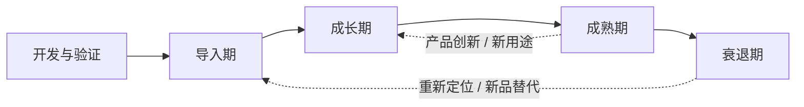

## 产品生命周期

**产品生命周期**（product life cycle，PLC）是产品从准备进入市场、被用户接受，到需求衰减并退出市场的全过程。它描述的是产品在市场中的经济寿命，通常按市场表现分为**导入期、成长期、成熟期和衰退期**。

产品生命周期是经营判断框架，不是产品必然经过的固定时间表。阶段边界要结合用户增长、留存、收入、利润、竞争格局和成本结构判断；一次产品改版、发现新用途或进入新细分市场，也可能让产品重新进入一个增长周期。

### 生命周期与 AI 产品开发生命周期的区别

市场生命周期回答「产品处在什么经营阶段、资源应该投向哪里」，而 [AI 产品开发生命周期（CC/CD）](ai-lifecycle.md) 回答「AI 能力如何上线、评测、校准并逐步扩大代理权」。两者可以同时使用：一个成熟产品新增的 AI 功能，可能仍处于导入期；一个处于成长期的 AI 产品，也必须持续运行 CC/CD 循环。

图示说明：市场生命周期通常从开发与验证进入导入期，再经历成长、成熟和衰退。**开发与验证是上市前准备，不是第五个市场阶段**；创新、重新定位或新用途可能开启新的增长周期。四阶段的经营策略见下表，阶段名称与[需求分析](requirements.md)里的早期 / 增长 / 成熟 / 衰退同义（导入 = 早期，成长 = 增长）。

## 阶段划分与经营策略

四个市场阶段的核心经营目标如下。具体阈值应以产品基线和业务模式为准。

| 阶段 | 市场与经营信号 | 核心经营目标 | 重点策略 | 主要风险 |
| --- | --- | --- | --- | --- |
| 导入期 | 知名度低；用户增长慢；获客和研发投入高；收入与利润偏低或为负 | 聚焦产品稳定性，降低核心功能缺陷率 | 聚焦目标用户和核心场景；小范围发布；验证需求、可用性与首批转化；完善反馈、监控和客服兜底 | 过早扩大范围；产品还不稳定就大规模投放；只看注册量不看激活和留存 |
| 成长期 | 用户和收入快速增长；复购或留存改善；竞争者进入；单位成本下降 | 扩大用户规模，同时验证变现模型 | 扩大渠道与供给能力；优化转化漏斗；验证定价、套餐、广告或增值服务；保持核心体验与交付质量 | 只追求规模而忽视毛利；基础设施、客服和运营能力跟不上增长 |
| 成熟期 | 潜在用户覆盖率高；增速放缓；竞争激烈；利润达到高点后承压 | 提升留存，挖掘用户生命周期价值（LTV） | 做用户分层和精细化运营；提升留存、复购、交叉销售与客单价；改进产品差异化；寻找新用途和新细分市场 | 把成熟误判为衰退；营销费用失控；只做短期促销，损害长期品牌与利润 |
| 衰退期 | 需求减少；活跃、销售和利润下降；替代品或新技术出现；竞争者退出 | 收缩非核心业务，降低运营与研发成本 | 集中资源维护有利润和战略价值的核心市场；降低库存、渠道和推广投入；决定收缩、收获、转型或退出；把资源转向新产品 | 继续平均分配资源；沉没成本阻碍退出；过早放弃仍有再生价值的细分市场 |

### 开发与验证：上市前的准备

产品开发期还没有市场销售，所以它**不属于**导入 / 成长 / 成熟 / 衰退四阶段，但决定导入期能否以可控成本开始。上图把它画在导入期之前，只表示「先验证再进入市场」，不要当成第五个经营阶段。产品经理应完成：

-   **目标与场景定义**：明确为谁解决什么问题，以及首批用户为什么愿意尝试。
-   **最小可用方案**：只交付验证核心价值所需的功能，不把完整产品愿景一次性做完。
-   **验证指标**：预先定义激活、关键行为完成率、留存、付费意愿和核心质量指标。
-   **上线准备**：准备埋点、反馈入口、客服与故障回退路径，确保导入期能看到真实信号。

对 AI 产品，还应在开发期完成能力边界、参考数据集、评测标准和成本基线，具体方法见 [AI 产品开发生命周期](ai-lifecycle.md) 的 CD 0～CD 3。市场阶段判断还要对照[需求分析](requirements.md)里「市场阶段 × 竞争位置」的机会筛选，以及[产品战略](strategy.md)里护城河的建设节奏：导入期先做单点价值，成长期再谈嵌入与数据飞轮。

### 导入期：先证明产品可用

导入期的重点不是追求最大流量，而是缩短「首次接触 → 理解价值 → 完成关键行为」的路径。导入期策略可以拆成四组动作：

-   **稳定核心功能**：优先修复阻断使用、导致数据错误或破坏信任的缺陷，建立版本回归清单。
-   **聚焦种子用户**：选择问题强度高、反馈及时且场景集中的用户群，不同时服务过多细分市场。
-   **验证产品价值**：关注激活率、关键任务完成率、次日或周留存、用户主动反馈，不用曝光和注册替代价值验证。
-   **控制发布范围**：通过内测、白名单或小比例灰度观察真实使用，达到质量门槛后再扩大流量。

导入期的定价可在高价撇脂、低价渗透或免费试用之间选择。选择依据是需求价格敏感度、竞争威胁、单位成本和后续变现路径，而不是单纯追求注册量。

### 成长期：规模与商业模型同时验证

成长期已经证明有人愿意使用，下一步是验证规模化后是否仍然成立。成长期策略不是单一的拉新，而是同时验证增长质量和单位经济：

-   **扩大用户规模**：扩展获客渠道、覆盖更多相邻场景，优化注册、激活和首次付费转化。
-   **提升交付能力**：提前扩容基础设施、客服、内容和供应链，避免增长带来延迟、故障和服务质量下降。
-   **验证变现模型**：比较订阅、按量计费、套餐、增值服务等方案，记录付费转化率、收入、毛利和回收周期。
-   **建立竞争壁垒**：通过数据、品牌、生态、工作流嵌入或服务能力降低用户迁移意愿。

成长期的判断重点是「新增用户是否带来可持续价值」，而不是「新增用户是否足够多」。增长数据应与 [商业化与增长](monetization.md) 中的 LTV、CAC 和单位成本一起看。

### 成熟期：提升留存与用户生命周期价值

成熟期的市场增量有限，经营重心从广泛获客转向存量用户价值。成熟期策略可以拆成：

-   **提升留存**：定位流失节点，改善首次体验、核心使用频率和长期使用理由。
-   **用户分层运营**：区分新用户、稳定用户、高价值用户和流失风险用户，分别设置触达与产品策略。
-   **挖掘 LTV**：通过套餐升级、交叉销售、增值功能、复购和服务续费提高单用户长期贡献。
-   **延长产品寿命**：改进体验、增加新用途、进入新细分市场，或通过产品组合重新激活需求。

成熟期不等于停止创新。若产品的核心需求仍然存在，产品调整、市场调整和营销组合调整都可能带来新的增长循环；但每项投入都应说明预期增量、成本和回收依据。

### 衰退期：控制投入并管理退出

衰退期的关键不是维护所有历史功能，而是判断哪些业务仍值得保留。衰退期策略可按资源收缩程度分为四种：

-   **继续**：保留原有市场和渠道，适用于需求下降缓慢、维护成本低且仍有战略价值的产品。
-   **集中**：把研发、运营和渠道资源集中到仍有利润或竞争优势的细分市场。
-   **收缩**：停止低价值获客和非核心功能，降低营销、库存、客服与研发投入，保持现金流。
-   **放弃或转型**：退出无法形成正向单位经济的市场，把资源转移到新产品；如果仍有可验证的新用途，也可以重新定位并开启新的导入期。

退出决策应写清时间点、用户迁移方案、数据导出、合同履约、客服口径和停服后的责任边界。停止一个产品也是产品管理决策，需要像发布一样可追踪、可沟通、可回退到明确的过渡方案。

## 如何判断所处阶段

阶段不能由单一指标决定。建议按完整业务周期观察以下信号，再判断主要矛盾：

| 观察维度 | 导入期 | 成长期 | 成熟期 | 衰退期 |
| --- | --- | --- | --- | --- |
| 用户 | 认知低，种子用户少 | 新增快速增长 | 覆盖率高，新增放缓 | 活跃与新增持续下降 |
| 收入 | 变现尚未稳定 | 收入与利润快速增长 | 收入高但增速下降 | 收入与利润下降 |
| 竞争 | 竞争者少，教育市场 | 竞争者快速进入 | 品牌、渠道和价格竞争激烈 | 替代品占据需求，竞争者退出 |
| 成本 | 单位成本高，固定投入多 | 规模效应开始出现 | 获客和维护成本上升 | 通过收缩降低可控成本 |
| 产品动作 | 修稳定性、验价值 | 扩规模、验变现 | 提留存、提 LTV、找新用途 | 聚焦核心、降成本、迁移或退出 |

阶段判断的产出应是一份「信号—动作—门槛」记录：当前哪些数据支持阶段判断，下一阶段要完成什么，若指标恶化何时停止投入或切换策略。不要用生命周期曲线替代[用户研究](user-research.md)、[数据分析](data-analysis.md)和[商业化与增长](monetization.md)里的财务测算。

## 生命周期曲线的边界

经典曲线便于建立共同语言，但并非每个产品都呈现标准的 S 型或钟形曲线：

-   **风格型**：兴趣可能反复出现，产品经历多次流行与回落。
-   **时尚型**：接受速度逐渐加快，广泛流行后缓慢衰退。
-   **热潮型**：快速爆发，也快速消退，需求可能主要来自短期新奇感。
-   **扇贝型**：产品通过持续创新或发现新用途，多次延长生命周期。

因此，「进入衰退期」只能说明当前需求或经营指标在下降，不自动等于立即下线。先区分是市场需求消失、产品竞争力下降、渠道变化、价格不匹配，还是产品仍有未开发的细分场景。

## 与 AI 产品管理的结合

AI 产品的市场阶段和模型能力阶段经常错位：

-   **导入期产品**：先把 AI 输出限制在可审查、可撤销的建议范围，建立评测集、反馈入口和人工接管。
-   **成长期产品**：扩大流量前验证推理成本、延迟、容量和单位经济；通过灰度逐步增加使用范围。
-   **成熟期产品**：用用户分层、任务完成率、留存和 LTV 判断 AI 功能是否真的提升产品价值，而不是只看模型基准分。
-   **衰退期产品**：保留有明确价值的自动化能力，收缩高成本、低使用或高风险功能；需要时把用户和数据迁移到新产品。

这意味着「产品成熟」不代表「模型可以全自动」，「产品衰退」也不代表「所有 AI 能力都应删除」。市场经营策略与代理权策略分别建立证据，再在发布、成本和资源决策上汇合。

## 贯穿案例：客服工单助手

同一产品在不同经营阶段，目标和代理权切片都不同。下面用栏目统一的工单助手把四阶段走一遍：

| 阶段 | 经营目标 | 产品动作 | 代理权切片 |
| --- | --- | --- | --- |
| 开发与验证 | 证明「路由建议」值得做 | 完成 CD 0 spike、20～100 条参考数据、失败路径原型 | 停在 L0–L2，不碰自动回复 |
| 导入期 | 核心路径稳定，种子客服愿意用 | 10% 工单一键改路由；看激活、改路由率、转人工，不看注册量 | 维持 L2；达不到评测门槛不放量 |
| 成长期 | 规模与毛利同时成立 | 扩渠道前算推理成本；灰度到更多工单类型 | 证据够了再把低风险类型升到 L3 |
| 成熟期 | 提留存与 LTV | 按客服司龄 / 工单类型分层；砍低使用高成本能力 | L3 只留单位经济为正的动作 |
| 衰退期 | 收缩成本、管理退出 | 停高风险自动解决；保留路由建议；写迁移与停服口径 | 从 L3 降回 L2 或 L0 |

阶段判断要能指出：当前哪组信号支持这个判断、下一阶段门槛是什么、代理权停在哪一级。

## 常见误区

-   **把生命周期当固定时间表**：没有「上线满一年就成熟」。阶段由增长、留存、利润和竞争信号决定。
-   **把 PLC 和 CC/CD 当成一回事**：经营阶段回答资源投向哪里；CC/CD 回答这一级代理权如何校准。成熟期产品仍要跑 CC 循环。
-   **只看销售额或注册量**：导入期看激活与关键任务完成；成长期看毛利与留存；成熟期看 LTV；衰退期看可收缩成本。
-   **导入期就上 L4**：市场还在教育用户时给全自主，失败半径最大。导入期默认 L0–L2。
-   **把开发与验证当成第五个市场阶段**：那是上市前准备，用 CD 0～CD 3 验收，不要拿导入期的获客指标去考核开发期。

## 阶段判断检查清单

写一份「信号—动作—门槛」记录即可开工，不必另做长报告：

-   [ ] 用户、收入、竞争、成本四组信号都看过，没有只用一个指标定阶段
-   [ ] 当前阶段的核心经营目标写清了（稳定 / 规模+毛利 / 留存+LTV / 收缩）
-   [ ] 下一阶段门槛与停止投入条件写清了
-   [ ] 代理权停在 L0–L4 的哪一级，与阶段匹配
-   [ ] 与[需求分析](requirements.md)的市场阶段用词已对齐（导入 = 早期，成长 = 增长）
-   [ ] 需要变现或收缩时，已对照[商业化与增长](monetization.md)的单位经济，而不是只对照功能清单

## 来源说明

???+ note "来源说明"
    四阶段划分与风格型、时尚型、热潮型、扇贝型曲线，整理自 Theodore Levitt, "Exploit the Product Life Cycle", *Harvard Business Review* (1965) 与菲利普·科特勒《营销管理》中的产品生命周期章节；营销组合与收缩/收获策略按经营判断改写，不以百科条目为权威来源。

    本站归纳：导入期聚焦稳定性，成长期扩大规模并验证变现，成熟期提升留存与 LTV，衰退期收缩非核心业务并降低成本。具体指标与决策门槛应以产品自身基线为准。阶段判断须同时对照 [AI 产品开发生命周期](ai-lifecycle.md)、[商业化与增长](monetization.md) 与[产品战略](strategy.md)。
