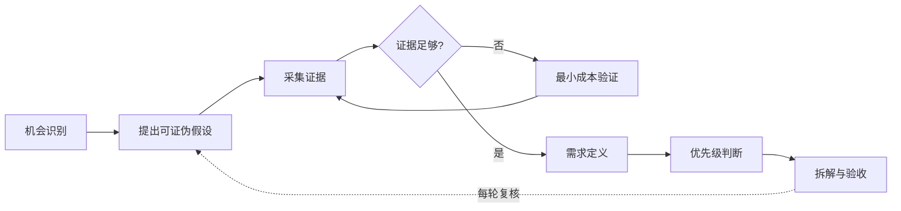

## 需求分析

"你们的导出太麻烦了！"——用户的随口一句抱怨，你怎么判断它是不是一个值得做的需求？是立刻排期改掉，还是先问清楚再动手？

需求分析就是**把模糊的诉求，变成可判断、可分级、可执行的需求**：发现真实问题，判断是否值得做，拆解为可执行的需求。

本页把「发现（discovery）」写成一条完整链路，不是孤立的技巧清单：

图示说明：需求分析用证据门禁把机会逐步收敛为可验收的工作，并在每轮迭代中重新检查假设。

**机会识别 → 假设 → 证据 → 需求定义 → 优先级 → 拆解**

| 环节 | 核心问题 | 主要产出 |
| --- | --- | --- |
| 机会识别 | 市场与策略上，哪里值得做？ | 机会候选空间 |
| 假设 | 我们相信关于用户的什么？ | 可证伪的假设 |
| 证据 | 假设经得起检验吗？ | 证据与置信度 |
| 需求定义 | 要解决的具体问题是什么？ | 需求陈述与目标 |
| 优先级 | 现在做哪个？ | 排序与资源承诺 |
| 拆解 | 开发照做什么？ | 用户故事与验收标准 |

先划清三个边界：

-   **功能请求 ≠ 需求**：用户说"要一个导出按钮"，需求是"把数据发给老板看"，按钮只是解法之一
-   **解决方案 ≠ 需求**："接入大模型"是解决方案；需求是它要解决的问题
-   **市场机会 ≠ 需求**：机会是"可能值得做的空间"，需求是"经过筛选与证据检验后，值得投入资源的具体问题"

AI 时代为什么更需要这条链路？因为**生成成本低让"做东西"变便宜了，而"做对东西"依然很贵**：模型让"能不能做"几乎不再成为门槛，价值判断成为 AI 产品经理的核心工作（《精益创业》的"是否应该造"在 AI 时代成为首要问题）；同时模型能力跃迁带来大量"能力驱动"的机会信号，最容易让人把"模型能做"直接当成"用户需要"——demo 惊艳但没有真实需求，是 AI 产品最常见的死法（《启示录》的价值风险）。

## 常见误区

### 误区一：用户要什么就给什么

用户说"我要导出 Excel"，你就去做导出 Excel。但他真正的问题是"我要把这个数据发给老板看"，PDF、分享链接、甚至一键截图都能解决。**被明确需求绑架，会忽略背后真实的问题**。

怎么做：听到需求先问"为什么"，追到背后的任务场景（见下文 [JTBD 与 Y 模型](#jtbd-与-y-模型)），再判断哪种解法最合适。

### 误区二：自己拍脑袋定需求

"我觉得用户肯定需要这个功能"——没有数据、没有访谈、没有验证。做得越多，错得越远，还容易自我感动。技术驱动型团队尤其容易犯：模型出了新能力，先兴奋地立项，再去找用户。

怎么做：先用最小成本验证——查数据、聊用户、看竞品，把"我觉得"改写成"我假设"（见 [证据强度与样本思维](#证据强度与样本思维)），再决定做不做。

### 误区三：需求分析只做一次

模型能力在变、用户行为在变、竞品在变，当初的判断随时可能过期。**需求分析不是一次性动作，而是随认知迭代的持续过程**。AI 产品更甚：模型每几个月换代一次，半年前"做不了"的今天可能"该做"，半年前"该做"的可能已被通用模型免费覆盖。

怎么做：每次迭代都回头校验——问题还在吗？解法还成立吗？证据还新鲜吗？

### 误区四：把"模型能做"当成"用户需要"

"给产品接个大模型"是 AI 时代最常见的技术驱动伪需求。模型能做 ≠ 有人需要 ≠ 愿意迁移到你的产品。能做只是可行性，不是价值。

怎么做：先写价值假设——谁会因此受益？他今天怎么解决？替代成本多高？回答不了这三个问题，就不碰模型。

### 误区五：访谈几句就当证据

访谈到 3 个用户说"很想要"，就当成需求成立。访谈发现的是模式和假设，不是验证；"样本即结论"是把定性研究当定量用（详见 [证据强度与样本思维](#证据强度与样本思维)）。

怎么做：访谈产出假设，行为数据与业务结果负责验证，分工清楚再开工。

### 误区六：一张评分表决定优先级

RICE 打个分、KANO 分个类，就拍板做哪个。评分表的参数是拍脑袋填的，同一个需求换个模型排序就不同——**分数是沟通工具，不是结论**。

怎么做：把分数差异当讨论材料：为什么 RICE 和 WSJF 结论不同？分歧点正是优先级讨论的核心（见 [需求分级](#需求分级)）。

### 误区七：让框架伪装成结论

KANO、JTBD、Y 模型都是思考工具，不是结论。做完一页分析不等于需求成立，结论必须回到"问题严重度 × 用户规模 × 价值强度 × 成本/风险 × 时机"的组合判断上。

怎么做：框架输出证据与讨论结构，最终决策写清依据、风险与回滚条件。

## 需求分析四步

把下面要讲的方法串起来，是一条四步流程：**收集 → 判断 → 分级 → 拆解**。

它像医生问诊：先听主诉（收集），再查体化验（判断），按轻重缓急分诊（分级），最后开处方时写清剂量与禁忌（拆解）。

1.  **收集**：把各种来源的模糊诉求原样收进来，先不评判（详见下文「需求来源」）
2.  **判断**：从三个维度打分，判断值不值得做（详见「判断需求的价值」）
3.  **分级**：按 P0-P3 排优先级（详见「需求分级」）
4.  **拆解**：把"要做的事"写成可验收的需求——明确验收标准、边界和出错处理。比如"AI 总结会议纪要"要写清：输入什么格式、多长；输出多长、术语怎么处理；模型出错时怎么办

本页在四步之上扩展为六环节，四步不是被替换，而是嵌在六环节里：

| 六环节 | 对应四步 | 关键产出 | 详见 |
| --- | --- | --- | --- |
| 机会识别 | 收集（源头） | 机会候选空间 | 「需求来源」 |
| 假设 | 收集（加工） | 可证伪的假设 | 「判断需求的价值」 |
| 证据 | 判断（依据） | 证据与置信度 | 「判断需求的价值」 |
| 需求定义 | 判断（结论） | 需求陈述与目标 | 「需求拆解产物」 |
| 优先级 | 分级 | 排期与治理规则 | 「需求分级」 |
| 拆解 | 拆解 | 用户故事与验收标准 | 「需求拆解产物」 |

六环节各自的典型失败：

-   **机会识别失败**：把竞品功能列表当机会清单，逐条抄
-   **假设失败**：假设写得不可证伪（"用户会喜欢"永远无法被推翻）
-   **证据失败**：用访谈证明市场规模，用问卷替代行为数据
-   **需求定义失败**：需求与公司目标脱节，做出来没人接得住
-   **优先级失败**：全部 P0，或者只看老板声音最大的需求
-   **拆解失败**：一句话需求，开发靠猜

## 需求来源

-   **用户反馈**：客服记录、App Store 评论、社区吐槽、用户访谈。AI 产品额外有两类高价值反馈：模型出错被纠错的记录（说明能力边界与用户期待）、"拒答/答非所问"日志
-   **数据分析**：用户行为数据、搜索词、漏斗流失点。AI 产品加上对话日志：用户改写提问、放弃对话、复制粘贴输出，都是需求信号
-   **竞品观察**：竞品的新功能、差评集中的点。AI 产品迭代快，竞品差评往往集中在幻觉、延迟与不可解释——这是现成的改进方向
-   **技术驱动**：AI 能力跃迁带来的新可能性（模型新能力 → 新场景）。这是 AI 时代增长最快的来源，也是最容易产生伪需求的来源——能力是必要条件，不是充分条件

### 机会识别与产品策略输入

**机会不是需求列表**：机会是"**市场阶段 × 竞争位置 × 公司目标 × 技术可行性 × 数据资产**"交叉后得到的候选空间。五个因素中任何一个不成立，机会就要打折：

| 因素 | 要回答的问题 | 不成立的表现 |
| --- | --- | --- |
| 市场阶段 | 市场处于早期、增长、成熟还是衰退？ | 衰退市场里投入大资源 |
| 竞争位置 | 我们是领先者、追随者还是补位者？ | 落后方做同质化功能 |
| 公司目标 | 机会推进哪个业务目标（OKR/北极星）？ | 答不上来，做出来无人接 |
| 技术可行性 | 模型现在能做到什么程度？ | 上线后才发现能力不够 |
| 数据资产 | 我们有数据喂给模型和评测吗？ | 没有评测集与反馈闭环 |

**市场阶段决定证据要求与迭代速度**：

| 阶段 | 特征 | 证据要求 | 迭代速度 |
| --- | --- | --- | --- |
| 早期 | 需求未验证、竞品少、玩家多 | 定性 + 行为证据为主，容忍失败，快速试错 | 周级，先跑通再优化 |
| 增长 | 需求已验证、正在规模化 | 行为数据 + 业务结果，验证留存与成本结构 | 双周级，速度优先 |
| 成熟 | 红海竞争、替换成本高 | 实验证据 + 明确 ROI，证明"显著优于"现有方案 | 月级，谨慎投入 |
| 衰退 | 需求萎缩、用户在流失 | 只做防御性低成本改动，不做新探索 | 慢，以回收为主 |

**公司战略与约束是需求的筛选条件**，不是背景噪音。立项前逐条过：

1.  这个需求推进公司的哪个目标？答不上来，至少不是战略级需求
2.  目标客群覆盖了吗？给谁做的，谁买单，谁决策？
3.  渠道可达吗？产品在目标客群会出现的渠道里吗？
4.  品牌允许吗？功能的调性是否与品牌承诺冲突？
5.  合规允许吗？数据获取、内容安全、行业监管是否挡路（AI 功能还要查生成式内容合规，见[出海与合规](../practice/compliance.md)）？

机会向需求转化的标志：能从机会里写出**具体用户、具体情境、可度量的目标**。写不出来，说明还停在机会层，不要进入排期。

## 判断需求的价值

### 第一轮粗筛：频率、规模、付费

判断一个需求是否值得做，可以从三个维度打分：

1.  **频率与强度**：高频（使用次数多）× 强烈（不做不行）
2.  **用户规模**：影响多少用户
3.  **付费潜力**：用户是否愿意为此付费

这是粗筛，不是结论：三个维度都通过，只能说明"值得进一步验证"，不能说明"值得做"。AI 产品尤其如此——频率高但强度低的需求（"偶尔想起来问一句"），会被推理成本与维护成本吃掉利润。粗筛之后必须补两层：**价值公式**（值不值）与**证据**（凭什么信）。

### 用户价值公式与相对价格（俞军）

俞军的两个公式是需求价值的底层标尺（出自《俞军产品方法论》，本站有[精读笔记](../case/books/yujun-product-methodology.md)）：

-   **用户价值 = 新体验 − 旧体验 − 替换成本**。三条提升路径：把新体验做大（AI 引入新能力）、把旧体验做小（对比"不用 AI 的现有流程"）、把替换成本做小（学习成本、迁移成本、信任成本）。AI 产品的替换成本里，**信任成本**是常被低估的一项——LLM 输出质量用户难以自行验证，属于典型信任品，用户迁移过来要重新建立"它到底可不可信"的认知
-   **相对价格 =（直接成本 + 交易成本）÷ 效用组合**。AI 场景的映射：直接成本含推理成本（token 费用），交易成本含用户写提示词的时间、等待延迟、学习成本；同样的价格买到更多效用 = 相对价格下降 = 需求量上升。这是"AI 功能为什么值得做"最可检验的表述：效用组合是否真的翻了倍？

立项前把两个公式的数字都打出来：新体验打几分？旧体验打几分？替换成本几项？效用组合是否显著大于直接成本 + 交易成本？打不出数字，说明需求还没定义清楚。

### JTBD 与 Y 模型

**Jobs-to-be-Done（JTBD）**把需求拆成四个要素（Christensen 等 2016，"Know Your Customers' Jobs to Be Done"，HBR）：

| 要素 | 要回答的问题 |
| --- | --- |
| 任务 | 用户要完成什么"雇佣"产品的活？ |
| 动机 | 为什么是现在？不做的代价是什么？ |
| 情境 | 什么时间、地点、状态（情绪、设备、压力）下发生？ |
| 替代方案 | 现在怎么解决的？包括直接竞品、替代品、"不解决" |

功能请求不是需求：用户买的不是钻头，是墙上的洞。**替代方案是四个要素里最容易被忽略的**——没有替代方案，说明用户要么没这问题，要么问题不痛。

**苏杰的 Y 模型**给拆解提供了路径：**表层诉求（1）→ 目标动机（2）→ 产品功能（3）→ 人性/心智（4）**（出自《人人都是产品经理 2.0》，本站有[精读笔记](../case/books/pm-2-0.md)）。"用心听，但不要照着做"——听的是 1，挖的是 2，做的是 3，沉淀的是 4。第一层产品经理只做 2→3，优秀的做到 1→2→3 并尝试挖 4。

具体案例："**用户要 AI 写周报**"

-   1 表层诉求：帮我写周报
-   2 目标动机：省时间（每周花 40 分钟太烦）、显得专业（领导会看）、让领导满意（格式与重点对齐）
-   3 产品功能候选：周报生成器（模板填空）、会议纪要自动整理、工作数据自动汇总、通用对话（现状）
-   4 人性/心智：懒惰 × 被认可——省事是第一动机，但"显得专业"决定文案与格式设计
-   替代方案：上周模板改一改、借同事的、用通用大模型对话
-   可验证收益：每周节省时长（行为数据）、周报完成率、被退稿率（业务结果）

关键点：2 决定做哪个 3（要"省时间"就做数据自动汇总，要"显得专业"就做格式与重点提炼）；4 决定卖点和话术。**逐层拆完，需求候选就自然浮出来了**——而不是用户说"写周报"就做"周报生成器"。

### 证据强度与样本思维

拆出需求候选之后，回答"凭什么信"：证据分五层，越往上越贵、越能支撑结论：

| 层级 | 证据类型 | 能证明 | 不能证明 |
| --- | --- | --- | --- |
| 1 | 定性证据（访谈、日记、现场观察） | 问题存在、动机、情境、语言 | 规模、频率、因果 |
| 2 | 描述性数据（问卷、调研） | 分布、倾向、人群画像 | 真实行为、因果 |
| 3 | 行为数据（日志、漏斗、留存、搜索词） | 用户实际做了什么 | 动机、因果 |
| 4 | 业务结果（收入、留存、转化、成本） | 是否变好、是否值得 | 是不是这个改动导致的 |
| 5 | 实验证据（A/B、随机对照） | 因果 | 长期效果、外部效度 |

三条纪律，违反任何一条都是证据误用：

-   **访谈无法证明市场规模**：访谈 8 个人说"很痛"，只能说明"存在这问题"，不能说明"有 100 万用户痛"（层级 1 不能证明层级 3 的问题）
-   **调研不能替代行为证据**：问卷里说"我会用"的用户，上线后大半不用——自我报告有系统性偏差（《The Mom Test》的核心警告：问出来的都是好话）
-   **行为相关不自动推出因果**：使用时长与满意度正相关，可能是满意度高才用得久，也可能只是重度用户自我说服——要分因果，上实验（层级 5）

**每个需求主张至少需要哪种证据**：

| 主张 | 最低证据 | 理想证据 |
| --- | --- | --- |
| "用户有这个问题" | 5-8 次访谈 + 行为日志佐证 | 访谈 + 行为 + 业务结果三角互证 |
| "问题影响 X% 用户" | 有抽样框的问卷 | 行为数据（按人群分桶） |
| "解法会带来 Y 改善" | 行为基线（当前值） | 实验证据或对照组 |
| "用户愿意付费" | 定价访谈（弱信号） | 假门测试 / 真实转化数据 |

**"证据不足但先做"是失败率最高的模式**：时间压力、老板指令、技术兴奋都会推动它。后果不只是"上线没人用"——AI 产品还挂着持续的推理成本与维护成本，等于花钱买了个负资产。对策是把证据要求写进门槛：证据不足的需求，要么降级为"验证需求"（只花最小成本做证据），要么不做。

## 需求分级

| 级别 | 描述 | 处理方式 |
| --- | --- | --- |
| P0 | 不做会出事的 | 立即排期 |
| P1 | 核心体验/核心场景 | 优先排期 |
| P2 | 重要但可延后 | 排入后续迭代 |
| P3 | 锦上添花 | 视资源情况 |

分级表是结果，不是方法。决定"做哪个"，要用优先级模型把理由摊开。

### 优先级模型

所有模型都是沟通工具：把判断依据显性化，让团队吵得起来、吵得完。**同一个需求在不同模型下结论不同是常态**，差异本身就是讨论材料。五个常用模型：

**KANO 模型**（Kano et al., 1984）

-   分类：基本型（必须有，缺失即不满——AI 产品的幻觉问题属于此类）、期望型（线性，越多越好——回答质量）、兴奋型（惊喜，缺失无感——超出预期的功能）
-   用法：问卷配对题（有/无两问）把需求分类，用于体验分层与差异化机会识别
-   失效条件：分类依赖用户感知，同一需求不同人群分类不同；无法在同一类内排序
-   常见误用：把"兴奋型"当"必做"（兴奋型是传播点不是承诺）；把基本型缺陷（幻觉、超时）当优化项——基本型没做好，期望型做得再好也是负分

**RICE 评分**（Intercom 提出）

-   公式：RICE =（Reach × Impact × Confidence）÷ Effort
-   参数：Reach 受影响用户数/周期；Impact 对单个用户的影响（0.25-3 分档）；Confidence 对前两者的信心（50%-100%）；Effort 人月数
-   适用：功能候选排序，尤其有影响面数据时
-   失效条件：Impact 打分高度主观；Confidence 常被自欺（填 100% 的项目最多）；忽略依赖与时序——高 RICE 的项目依赖低 RICE 的基建时，顺序会错
-   常见误用：把分数当结论，不回到业务目标；用同一份 Impact 档位跨产品线比较

**WSJF**（SAFe 敏捷）

-   公式：WSJF =（业务价值 + 时间关键性 + 风险降低/机会开发）÷ 任务规模
-   核心思想：延迟成本（Cost of Delay）——晚做一个月损失多少
-   适用：迭代内排期，多需求竞争同一批资源时
-   失效条件：分值膨胀（都打 5，分母成为唯一变量）；任务规模估算误差被放大
-   常见误用：只适用于 backlog 排期，不适合战略选择——它不回答"做不做这个产品"

**机会评分**（成果驱动创新，Anthony Ulwick 提出）

-   公式：机会 = 重要性 − 满意度（均来自用户研究打分）
-   适用：从已有用户的研究数据里找"重要但不满"的机会带
-   失效条件：满意度问卷有自我报告偏差；只适用于已有用户，无法用于全新市场
-   常见误用：忽略成本与时机——"重要但不满意"可能是个黑洞，重要但技术不可行

**MoSCoW 分类**（DSDM 范围管理）

-   分类：Must（必须有）、Should（应该有）、Could（可以有）、Won't（本次不做）
-   适用：固定时间盒（固定发布日）下的范围协商
-   失效条件：全员 Must（等于没分）；Won't 无人认领，范围悄悄蔓延
-   常见误用：把它当排期工具——它是分类不是排序，同类内部还要再排

### 同一组需求的模型对照

用同一组需求跑两个模型，结论不同才是正常的。以"AI 客服工单助手"的候选为例：

| 需求候选 | RICE 视角 | WSJF 视角 |
| --- | --- | --- |
| A 自动分派工单 | Reach 大但 Effort 大（要接全自动链路），Impact 高，Confidence 低（怕错） | 业务价值高，但时间关键性中等（可以晚一周上线） |
| B 路由建议（人工确认） | Reach 大、Impact 高、Effort 小、Confidence 高 → 总分最高 | 价值高、规模小、随时可做 → 中等 |
| C 知识库问答 | Reach 中等（查询工单只占一部分） | 时间关键性极高（每天大量重复问询，延迟一天损失一天人力）→ 总分最高 |

结论：RICE 偏好 B（影响 × 信心 ÷ 成本占优），WSJF 偏好 C（延迟成本最大）。分歧点在"时间关键性"——如果公司正处于客服人力瓶颈期，C 应该先做；如果瓶颈是分派效率，B 先做。**把分歧摆出来讨论，比盯着一个分数有意义得多**。

### 优先级是组合判断

优先级不是模型打出的一个分数，而是 **问题严重度 × 用户规模 × 价值强度 × 成本/风险 × 时机** 的组合判断：

-   **问题严重度**：不解决的代价——安全事故 > 核心流程崩溃 > 效率损失 > 体验瑕疵
-   **用户规模**：受影响人数 × 影响频率
-   **价值强度**：价值公式算出的"新体验 − 旧体验 − 替换成本"
-   **成本/风险**：开发成本、推理成本、技术风险、合规风险
-   **时机**：模型能力是否就绪、市场窗口、依赖是否到位、数据是否可及

五个维度列全再讨论，而不是乘出一个分数。常见偏科：只看用户规模（做出大而低频的功能）、只看严重度（被少数关键用户绑架）、只看技术兴奋（上线无人用）。

### P0-P3 的治理规则

分级表之外，还要有治理规则，否则分级会在两轮迭代内烂掉：

-   **P0 准入条件**：必须**同时满足**：① 不做导致安全/合规问题、不可逆损失或核心流程崩溃；② 证据充分（有行为数据或业务结果支撑，不是感觉）；③ 有明确负责人与回滚/兜底方案；④ 资源已预留。四条缺一条，降为 P1。这保证 P0 是"不做会出事"，而不是"老板催得紧"
-   **避免全 P0**：全部 P0 = 没有优先级。每个迭代 P0 设数量上限（建议 1-2 个），超出的进 P1 排队
-   **降级与撤回机制**：每迭代复核一次——P0 无进展且证据转弱，降 P1；需求被行为数据证伪（如上线后无人用），撤回并归档，记录教训
-   **容量预留**：迭代预算分成"确定性需求"与"探索/技术债"两部分，另预留 15%-20% 给突发事件与验证任务——AI 产品的验证（评测、spike）也是工作量，不预留就会挤掉
-   **技术债与依赖**：P2/P3 的技术债要登记（债务也是需求，不登记就永远不还）；跨团队依赖写进需求文档，排期前确认依赖就绪，否则 P0 会被依赖卡死

### B2B、平台、内部工具、增长型功能

需求分析默认假设"用户 = 买单者"，但多数产品不止一个角色。**用户（用的人）、买单者（付钱的人）、决策者（拍板的人）、管理员（配置的人）、运营者（维护的人）**分离时，需求冲突是常态，必须显式处理。

以 AI 客服工单助手为例，四个角色的诉求：

| 角色 | 诉求 | 冲突点 |
| --- | --- | --- |
| buyer（CTO） | 成本可控、合规、安全 | 全自动功能风险高，想先做保守方案 |
| user（一线客服） | 快、准、少被打扰 | 想要全自动，不想多点一下 |
| sponsor（客户成功 VP） | 客户满意度（CSAT）、响应时长 | 要见效快，不在乎实现路径 |
| operator（客服主管） | 管理报表、质检、权责清晰 | 怕 AI 出错背锅，要人工确认留痕 |

冲突示例与裁决：user 要"全自动回复客户"（省事），buyer 担心合规与失控（生成内容对外），operator 要求出错可追溯。裁决结果：先做"路由建议 + 人工确认"（user 得到效率、buyer 得到可控、operator 得到留痕），全自动回复列入 P3 并在 PRD 写明不做范围与合规约束，以"工单平均处理时长、错误分派率、CSAT"为共同业务结果验收——**冲突写进需求文档的"非目标"与"风险"节，让四方在评审会上签字**。

裁决规则三条：① 以可度量的业务结果为最终准绳，不按嗓门；② 角色权重按产品战略定——平台型产品 user 优先，企业服务 buyer 优先，合规敏感行业合规优先；③ 无法当场裁决的冲突，降级为"先验证"（用行为数据说话），不硬排。

不同产品类型的需求差异：

-   **B2B 产品**：多角色是常态，需求文档必须写清"谁受益、谁买单、谁决策、谁维护"四列；价值主张要分别对 buyer（ROI、降本）与 user（效率、体验）讲
-   **平台产品**：用户是下游开发者，需求要抽象成"可复用的原子能力"；证据看开发者流失率、集成失败率、API 调用增长
-   **内部工具**：用户是员工，需求来自真实工作流，决策链短但组织政治强；证据 = 流程耗时、工单量、手工重复度
-   **增长型功能**：实验驱动，需求自带指标与 A/B 计划；证据要求最高——要判断归因，必须能区分"是这功能带来的增长"还是"大盘波动"

## AI 需求的特殊性

AI 需求在通用框架之上有五项硬性差异：

-   **幻觉风险**：模型可能给出错误答案，需求要包含"出错怎么办"
-   **成本敏感**：每次调用都有成本，高频场景要核算 token 成本
-   **能力边界**：需求落地前先验证"模型能不能做到"——用 Playground 快速试
-   **数据依赖**：AI 产品效果依赖数据与反馈闭环，需求里要写清数据从哪来、反馈怎么回流（比如"回答不准确时，能不能收集用户纠错"）
-   **模型替换成本**：换模型 = 换能力边界与成本结构，需求要留出抽象层：把模型调用封装成接口，别把 Prompt 写死在业务代码里

### AI 特判五查

每一条 AI 需求立项前，过这五查，把结论写进需求文档：

**1. 能力可行性 spike**：先用 Playground/官方 API 拿 10-50 条真实样本试跑，再写完整需求。spike 要记录：能稳定完成什么、在什么输入上失败、输出格式是否可控。提示词实验方法参考 [Anthropic 官方提示词工程指南](https://docs.anthropic.com/en/docs/build-with-claude/prompt-engineering/overview)（或对应厂商文档）。spike 结果直接写进需求的"能力边界"节：**模型做不到的事，需求里要写"拒绝回答"而不是"尽力而为"**。

**2. 数据可得性**：评测集（典型/边界/对抗三类样本）、参考数据、异常样本从哪来？标签由谁定（领域专家还是外包标注）？数据缺失时，需求自动降级为"数据建设需求"——没有评测集，AI 功能无法验收（评测集构建方法见[评估与评测](../ai/evaluation.md)，标注管理见[数据与标注](../tools/data.md)）。

**3. 幻觉与延迟**：验收标准里写清——输出质量（评测集通过率）、错误容忍度（哪些错误类型可接受，哪些零容忍，如承诺赔付类）、超时（P95 延迟上限）、超时与低置信度时的行为（转人工/重试/降级）。"答错不可怕，答错后没有兜底才可怕"。

**4. 成本上限**：单次调用成本（输入/输出 token × 单价）× 调用量 = 月成本，方法见 [LLM 成本测算](../tools/llm-cost.md)；写清缓存策略（相同输入命中缓存，长上下文场景尤其关键）与预算护栏（日成本超限自动降级到小模型或关停，由谁触发、何时触发）。

**5. 模型替换与供应商依赖**：需求是否绑定模型？写"需要能完成 X 任务的模型"而不是"需要 GPT-4o"；换模型后的行为变化（输出风格、格式稳定性、延迟）与成本变化要预演——封装成接口、评测集跨模型可跑，替换就是一次 A/B，而不是一次重构。

自动执行类需求（Agent）额外参考 [Anthropic 的 Agent 设计模式](https://www.anthropic.com/engineering/building-effective-agents)：人工确认环（human-in-the-loop）放在哪些节点，直接影响风险与用户体验，这是需求层就该定的决策，不是开发层的细节。

## 需求拆解产物

优先级定了，把需求拆成开发照做、验收有据的产物。九个字段的模板：

| 字段 | 写什么 | 颗粒度 |
| --- | --- | --- |
| 问题陈述 | 谁、在什么情境、有什么问题、现在怎么解决 | 一段话，不含解法；含解法就是跳步 |
| 假设 | 价值假设（用了觉得值）与能力假设（模型能做） | 一句一个，必须可被数据推翻 |
| 用户故事 | 作为\<角色\>，我想\<做什么\>，以便\<获得什么\> | 一个故事对应一个验收场景，别把系统当角色 |
| 验收标准 | 输入 → 输出 → 边界 → 出错处理 | 每条可测、可量化；禁用"流畅/好用/智能" |
| 非目标 | 明确不做、不优化的范围 | 每条防一次范围蔓延 |
| 依赖 | 数据、模型、接口、其他团队 | 每条依赖有负责人与就绪时间 |
| 风险 | 模型/数据/合规/体验风险 | 每条有应对动作，不写"加强关注" |
| 指标 | 成功指标 + 当前基线 + 目标值 | 上线后能从系统里算出来 |
| 回滚条件 | 什么指标、什么表现触发回滚，谁执行 | 有数字、有责任人 |

颗粒度的判据：**开发拿到文档不需要再问"你是什么意思"，验收时不需要争论"这算不算完成"**。写"AI 总结会议纪要"要写清：输入什么格式、多长；输出多长、术语怎么处理；模型出错时怎么办（重试/截断/提示用户）。"一句话需求让开发猜"的结果是开发按自己的理解做，验收对不上，返工一轮——AI 产品还多一层：不写评测标准，连"对没对"都无法判断。

完整 PRD 的写法见 [AI 产品 PRD](prd.md)；上线后的监控、校准与回滚见 [AI 产品开发生命周期（CC/CD）](ai-lifecycle.md)。

## 贯穿案例：AI 客服工单助手

用同一个案例走完整条链路（与 [PRD 页示例](prd.md) 一致，工单类型：退款/物流/投诉/咨询）。

**原始声音**（收集）：
-   客服主管："工单分派太慢了，能不能让 AI 帮我们自动分派？"
-   一线客服："我老是转错部门，转过去又退回来。"

**JTBD/Y 模型拆解**：
-   1 表层诉求：自动分派工单
-   2 目标动机：分派慢 → 客户响应慢 → 投诉；转错部门 → 返工 → 客服自我怀疑
-   3 产品功能候选：全自动分派、路由建议（人工确认）、知识库问答、自动回复用户
-   4 人性/心智：省事 × 怕担责——客服想要效率，但更怕"是我让 AI 分错的"
-   替代方案：人工看标题猜、问同事、背部门表——猜错了就退单重来

**证据采集**（判断）：
-   定性：访谈 6 名客服（3 名一线 + 主管），确认分派靠"猜"，转错是日常
-   行为数据：工单日志——首次分派平均耗时 40 分钟、错误分派率 15%、日均 500 张
-   描述性：客服小问卷——80% 认为"判断部门"最耗时
-   证据结论：问题真实（访谈 + 日志互证）、规模明确（日均 500 张）、但"全自动"不敢直接做（怕担责 + 怕错）→ 需求候选收敛为"建议 + 确认"

**需求候选与排序**（分级）：

| 候选 | RICE | WSJF | 结论 |
| --- | --- | --- | --- |
| A 全自动分派 | Reach 高，Confidence 低（怕错），Effort 高 | 价值高但时间关键性中 | 不做（本轮） |
| B 路由建议 + 一键改路由 | Reach 高、Impact 高、Effort 小、Confidence 高 | 价值高、规模小 | 优先 |
| C 知识库问答 | Reach 中 | 时间关键性极高（重复问询） | 次优 |
| D 自动回复用户 | 合规风险大 | 风险降低为负 | 暂缓 |

**用户故事与验收标准**（拆解）：
-   用户故事："作为一线客服，我想看到工单的路由建议，以便快速判断归属部门。"
-   验收标准：输入工单描述 → 输出部门 + 置信度 + 推荐理由；路由准确率 ≥ 90%（评测集 50 条：30 典型 + 10 边界 + 10 对抗，客服主管标注）；置信度 < 0.6 输出"建议转人工"，不猜。

**AI 特判**（五查）：
-   spike：拿 50 条历史工单跑通分类链路，确认"退款/物流/投诉/咨询"四分类可稳定输出
-   数据：评测集由客服主管标注（标签权威）；真实改路由记录每周回填评测集
-   幻觉与延迟：只输出结构化"部门 + 置信度"，文案模板化；P95 延迟 < 3 秒，超时直接转人工
-   成本：单次约 0.02 元 × 日均 500 张 ≈ 300 元/月，护栏：日成本超 1.5 倍自动降级
-   模型替换：需求写"能完成四分类的模型"，评测集跨模型可跑

**排期结果**：P0 路由建议 + 一键改路由；P1 置信度展示；P2 知识库问答；P3/不做 自动分派与自动回复（写进非目标）。每条 P0 都满足准入四条：不做会出事（分派慢投诉继续恶化）、证据充分（日志 + 访谈）、有兜底（人工确认 + 转人工）、资源预留。

## 一张表收束

| 步骤 | 关键问题 | 常见坑 |
| --- | --- | --- |
| 机会识别 | 市场、策略、能力、数据都成立吗？ | 竞品功能列表当机会清单 |
| 收集 | 用户真正的问题是什么？ | 只听表面诉求，不追问动机 |
| 假设 | 我们相信什么？能证伪吗？ | 把"我觉得"写成结论 |
| 证据 | 证据够哪一层？访谈还是实验？ | 访谈证明规模、样本即结论 |
| 判断 | 高频？影响多少人？愿意付费吗？ | 拍脑袋定价值，不做验证 |
| 分级 | 不做会怎样？为什么是它？ | 全部 P0，或让分数代替讨论 |
| 拆解 | 怎么验收？边界在哪？出错怎么办？ | 一句话需求，开发靠猜 |
| AI 特判 | 模型能做到吗？数据够吗？换模型呢？ | 上线后才发现幻觉、成本失控 |

???+ example "练习"
    从你的真实工作/生活中找一个 AI 场景，用六环节走一遍：机会成立吗？假设是什么？证据够哪一层？需求候选有几个？用 RICE 和 WSJF 各排一次，两个结论为什么不同？

下一次收到需求，先问自己三个问题：**用户真正要解决什么问题？证据够不够？做到什么程度算完成？**

## 来源说明

**官方文档/博客**：

-   [Anthropic Prompt Engineering Overview](https://docs.anthropic.com/en/docs/build-with-claude/prompt-engineering/overview)（提示词实验与能力验证方法）
-   [Anthropic Building Effective Agents](https://www.anthropic.com/engineering/building-effective-agents)（Agent 设计与人工确认环）

**经典著作与论文**：

-   Kano et al., 1984, "Attractive quality and must-be quality"（KANO 模型）
-   Christensen et al., 2016, "Know Your Customers' Jobs to Be Done"（HBR，JTBD）
-   Eric Ries, 2011, The Lean Startup（验证式学习、价值/增长假设）
-   Marty Cagan, 2018, INSPIRED（价值风险、发现与交付）
-   Teresa Torres, 2021, Continuous Discovery Habits（持续发现）
-   Melissa Perri, 2019, Escaping the Build Trap（以产出代替价值的陷阱）
-   Rob Fitzpatrick, 2013, The Mom Test（访谈问事实不问承诺）

**仓库原创读书笔记**：

-   [《俞军产品方法论》精读笔记](../case/books/yujun-product-methodology.md)：用户价值公式、相对价格、交易成本
-   [《人人都是产品经理 2.0》精读笔记](../case/books/pm-2-0.md)：Y 模型、KANO 应用
-   [《启示录》INSPIRED 精读笔记](../case/books/inspired.md)：价值风险、MVP 是原型
-   [《精益创业》精读笔记](../case/books/lean-startup.md)：最小验证、转型或坚持
