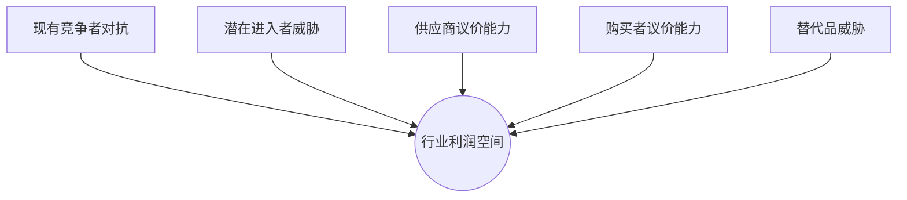
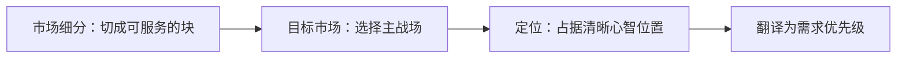
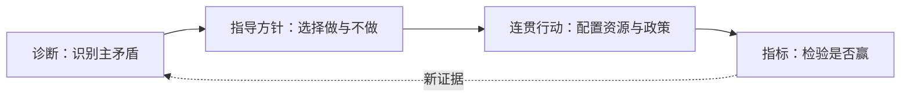

## 产品战略与竞争战略

产品战略回答两个问题：在哪个市场竞争，凭什么赢。竞争战略是它的内核：分析行业结构、选择定位、建立并守住护城河。AI 产品经理日常处理的是需求与排期，但每一项「做什么、不做什么」的底层都是战略判断——为什么做这个不做那个、用户凭什么选我们不选竞品、模型趋同之后还剩下什么。

本页把散落在[需求分析](requirements.md)与[商业化与增长](monetization.md)里的战略素材收拢成体系：先给竞争战略的经典框架，再讲定位与护城河，然后用「套壳有没有护城河」串起 AI 时代的高频实务问题，最后落回战略工具与面试回答框架。

### 本文路线

五步走：先看竞争战略框架（波特五力、三类通用战略、AI 行业结构），再讲定位理论（心智、细分、STP），然后逐类评估护城河在 AI 产品的适用性，接着回答「套壳有没有护城河」与模型趋同后的竞争维度，最后落到战略画布、路线图与 OKR 的工具衔接，并给 AI PM 的实践与面试框架。

## 竞争战略框架

竞争战略的起点是行业结构分析：**行业结构决定平均利润水平，战略选择决定一家公司在行业内的相对位置**。迈克尔·波特的《竞争战略》（1980）是这套框架的源头，至今仍是战略讨论的公共语言。

### 波特五力模型

五力模型回答「这个行业容不容易赚钱」：行业竞争强度由五种力量共同决定，它们决定行业里价格能定在成本之上多少。

图示说明：五种力量共同挤压或支撑行业利润，分析重点是识别当前最强的主力量并针对性回应。

| 力量 | 核心问题 | 力量越强则 |
| --- | --- | --- |
| 现有竞争者对抗 | 同业之间打不打价格战、差异化程度如何 | 利润越薄 |
| 潜在进入者威胁 | 新玩家进场是否容易、需要多少资本与资质 | 在位者越难涨价 |
| 供应商议价能力 | 上游（算力、模型、数据、人力）是否集中 | 成本越被挤压 |
| 购买者议价能力 | 客户是否集中、换供应商是否容易 | 议价空间越小 |
| 替代品威胁 | 有没有不买你的方案（人工、开源、旧软件） | 定价天花板越低 |

用五力分析的目的不是画一张静态图，而是找出**决定利润的关键力量**：五力中通常只有一两个在特定时点起决定作用，战略要针对它布局。AI 行业里「潜在进入者威胁」与「替代品威胁」经常是主矛盾：应用层进场门槛低，任何大模型厂商都可能成为替代品。

#### 五力的 AI 行业实例

逐力看 AI 行业，每类力量都有具象案例：

-   **现有竞争者对抗**：通用对话助手（ChatGPT、Claude、Gemini、豆包）直接互打免费层与订阅档；应用层的同质化更狠，同一个「AI 客服」品类里有几十家打法相近的产品，价格战与补贴是常态
-   **潜在进入者威胁**：应用层几乎为零门槛，一个工程师 + 一个 API key 就能进场；模型层的门槛是百亿美元级资本与稀缺人才，天然挡住绝大多数进入者
-   **供应商议价能力**：应用层供应商是模型厂商，一次调价就重写应用的成本结构（DeepSeek 涨价引发调用量流失是实证，见[商业化与增长](monetization.md)）；模型层供应商是算力厂商，高端 GPU 供不应求时议价权在上游
-   **购买者议价能力**：开发者客户换 API 供应商成本低（OpenAI、Anthropic、Gemini、DeepSeek 可替换），议价能力强；终端用户免费替代品众多，对价格极度敏感
-   **替代品威胁**：应用层的替代品包括人工方案、旧软件与模型官方产品——任何「自己的应用」都要和「直接用 ChatGPT」竞争；模型层的替代品是开源模型，质量接近免费可用

### 差异化、成本领先与聚焦

五力决定行业蛋糕有多大，通用战略决定一家公司切哪一块。波特给出三类通用战略，中间的模糊地带（既非低成本也非差异化）最危险：

-   **成本领先**：以全行业最低成本提供同等价值，靠价格与规模取胜。大模型层的推理优化、硬件自研、批量调度都是成本领先的武器
-   **差异化**：提供用户愿意付溢价的独特价值，靠产品、品牌、体验取胜。应用层的垂直场景深度、工作流绑定、品牌信任都是差异化来源
-   **聚焦**：不做整个市场，只在一个细分市场里做成本领先或差异化。AI 应用层多数公司都是聚焦战略：只做某个行业、某类用户、某个任务

AI 行业里「同时做不好」的陷阱格外常见：模型层厂商想顺手做应用，应用层想自研模型，两边都想，结果成本结构与组织能力互相冲突。战略选择的核心是**接受取舍**：成本领先要放弃高毛利功能，差异化要放弃价格敏感用户，聚焦要放弃相邻市场。

### AI 行业结构：大模型层 / 中间层 / 应用层

把五力套到 AI 行业，先按价值链分三层，每层的竞争结构完全不同：

| 层级 | 玩家 | 核心竞争维度 | 主要利润来源 |
| --- | --- | --- | --- |
| 大模型层 | OpenAI、Anthropic、Google、DeepSeek 等 | 模型能力、推理成本、资本规模 | 模型授权、API 调用 |
| 中间层 | 基础设施、向量库、评测、编排、Agent 框架 | 工具效率、生态兼容、开发者体验 | 订阅、用量计费、开源+商业 |
| 应用层 | 面向终端用户的 AI 产品 | 分发、工作流、数据、体验 | 订阅、交易抽成、企业合同 |

三层各自的五力画像差异巨大：

-   **大模型层**：供应商议价能力来自上游算力集中；进入者威胁来自资本与人才门槛（几百亿美元训练成本）；现有对抗是头部厂商烧钱换份额。利润被成本领先（DeepSeek 靠工程优化把推理成本打到极低）与差异化（能力代差）两头拉
-   **中间层**：工具高度同质化，开源替代多，购买者（开发者）议价能力强，现有对抗是典型价格战。中间层普遍「打不过默认选项」：模型厂商自带工具链会压缩独立中间层的空间
-   **应用层**：进入门槛最低（套壳即可进场），现有对抗最激烈，但替代品威胁与分发成本决定生死。应用层的利润不来自模型能力，而来自**模型的同质化迫使它在模型之外建立差异**

???+ note "提示"
    分层不是静态的：模型厂商向下吞应用（官方产品覆盖 wrapper），应用层向上自研模型（为差异化与控制成本）。分析一个具体产品时，先画它在哪一层、相邻层怎么挤压它，再判断战略空间。

### 行业结构分析四步

五力是思考框架，落地成四步：

1.  **分层定位**：产品在大模型层、中间层还是应用层？主要替代品是谁（人工方案、竞品、模型官方产品）？
2.  **识别主力量**：当前阶段决定利润的关键力量是哪一个（应用层多为进入者威胁与替代品威胁，模型层多为资本门槛与成本结构）？
3.  **看力量方向**：关键力量在变强还是变弱（模型能力跃迁会让应用层的替代品威胁周期性上升）？
4.  **定战略回应**：针对主力量选择成本领先、差异化或聚焦，落到「做什么、不做什么」。

## 定位理论

竞争框架回答「行业里怎么打」，定位理论回答「用户心里我们是谁」。艾·里斯与杰克·特劳特在《定位》（1981）提出：**定位的本质是让品牌在潜在用户心智中占据一个清晰、可记忆、有差异的位置**。产品做什么、怎么做，最终都要服务于这个心智位置。

### 定位是心智问题，不只是市场问题

用户心智是有限资源的竞争场：一个品类里用户通常只记得两三个名字（可乐=可口可乐与百事可乐），其余都被过滤。AI 产品尤其如此——模型能力抽象难懂，用户无法验证输出质量，只能依赖「心智里的默认选项」。定位要回答：**当用户想到某类任务时，第一个浮现的名字是谁**。

定位不是产品功能列表的浓缩，而是**一个可记忆的认知锚点**：

-   **简单**：一句话说得清，用户能转述给朋友
-   **差异**：与竞品和替代方案有明显区分
-   **可信**：有真实能力与证据支撑，不是空喊
-   **可防御**：对手不容易抄袭或覆盖

> 定位的基本方法，不是去创造某种新奇或与众不同的事物，而是去操控心智中已经存在的认知，去重组已存在的关联认知。

### 细分市场选择（STP）

定位的落地路径是 STP：**Segmentation（市场细分）→ Targeting（目标市场选择）→ Positioning（定位）**。先切市场，再选战场，最后定心智位置。

图示说明：STP 把机会空间依次收敛为目标市场与定位，再把战略选择落到具体需求优先级。

| 环节 | 核心问题 | AI 产品注意点 |
| --- | --- | --- |
| 市场细分 | 市场按什么维度切成可服务的块 | 按任务细分（写作、客服、数据分析）比按行业细分更贴合 AI 能力边界 |
| 目标市场 | 选哪个细分，放弃哪些细分 | 选「模型能力够得到、用户痛点够强、竞争尚不拥挤」的交集 |
| 定位 | 在这个细分里占据什么心智位置 | 用「最懂某类任务的 AI」而不是「全能助手」做锚点 |

细分维度有三类：**用户特征**（人群、行业、规模）、**任务场景**（JTBD，用户要完成的任务，见[需求分析](requirements.md)）、**价值诉求**（省时、省钱、省心）。AI 产品里**任务细分**优先：模型能力是按任务分布的，同一个模型在不同任务上表现差异巨大，细分市场应该贴着「模型做得好且用户付得起」的任务切。

#### 定位声明与验证

定位最后要写成一句可沟通的**定位声明**，结构是五要素：目标客群、需求、品类、关键利益、差异化依据。

> 对（目标客群），他们需要（核心需求）；（产品名）是（品类），提供（关键利益），不像（替代方案），我们（差异化依据）。

示例：对跨境电商卖家，他们需要快速处理多语言客服消息；「客服 AI」是客服自动化工具，把回复时间从 2 小时压到 2 分钟，不像通用对话助手，我们直接读写店铺后台并承担误判责任。这句声明同时覆盖了定位四属性（简单、差异、可信、可防御），也是 PRD 边界与需求优先级的一句话依据。

定位验证三问：

1.  **目标客群认账吗**：把定位声明讲给目标用户，他是否觉得「这就是给我做的」？
2.  **与竞品分得开吗**：把产品名换成竞品名，声明还成立吗？成立则定位无效
3.  **有证据支撑吗**：定位里的每个承诺（快、准、安全）都对应可度量的产品能力与评测指标（见[评估与评测](../ai/evaluation.md)）？

### STP 与需求分析衔接

STP 的上游是[需求分析](requirements.md)的机会识别：机会是「市场阶段 × 竞争位置 × 公司目标 × 技术可行性 × 数据资产」交叉后的候选空间。STP 把这个空间收敛成一个明确的战场：

1.  机会识别圈出候选空间（市场需求在哪、我们有什么资产）
2.  市场细分把空间切成可服务的块（哪类任务、哪类用户）
3.  目标市场选择用「价值强度 × 可行性 × 竞争缺口」筛出主战场
4.  定位写出「在这个战场里，用户心智中我们要占据的位置」
5.  需求定义把定位翻译成功能与优先级（用户研究看诉求，PRD 写边界）

衔接点：**定位是需求优先级的前置输入**。需求分析里的「角色权重按产品战略定」（平台型 user 优先、企业服务 buyer 优先）就来自定位；定位不清，需求评审就失去了裁决依据。

## 护城河分类与 AI 适用性

定位决定怎么赢，护城河决定赢多久。**护城河是竞争对手难以复制或绕过的长期优势来源**。巴菲特把好生意比作有护城的城堡，帕特·多尔西在《巴菲特的护城河》（2006）里把护城河归为四类：无形资产、转换成本、网络效应、成本优势。汉密尔顿·赫尔默《七大力量》（2016）进一步给出七种可评估的力量。对 AI 产品，逐类评估「是否适用、强度如何」：

### 网络效应

**网络效应**：用户越多，产品或服务对每个用户的价值越大。直接网络效应（用户彼此互动产生价值）在 AI 产品里罕见——多数 AI 产品是单用户工具；间接网络效应（用户越多 → 生态越丰富 → 用户价值越大）更常见：模板市场、插件生态、社区分享。

AI 适用性评估：**中等，且要区分类型**。同侧网络效应（C 端用户之间）基本不存在；跨侧网络效应（用户 + 开发者、用户 + 内容提供方）能成立，但需要平台化设计与冷启动策略（见[平台与生态](#平台与生态护城河的放大)）。网络效应的真正威力要乘上数据飞轮，单独的网络效应本身较难在 AI 应用层建立。

### 转换成本

**转换成本**：用户换到竞品要付出的数据迁移、流程重构、学习与信任成本。转换成本高，用户留存就高、价格弹性就低。

AI 适用性评估：**强，但取决于嵌入深度**。纯对话式 AI 转换成本几乎为零——换一个聊天窗口毫无代价，这正是 wrapper 容易被替代的原因；深度嵌入工作流的 AI（数据管道、自动化流程、团队协作、企业集成）转换成本显著。AI 产品设计上要主动构建转换成本：沉淀私有数据、嵌入业务流程、形成团队使用习惯。

### 规模经济

**规模经济**：产量越大单位成本越低。传统软件边际成本趋零，AI 产品边际成本是推理成本，规模经济来自批量调度、硬件摊销、缓存复用与训练成本摊薄。

AI 适用性评估：**模型层极强，应用层较弱**。大模型层的规模经济与资本门槛共同构成赢家通吃的推手；应用层的推理成本占比随用量上升，规模经济反而要防「规模不经济」——用户越多推理成本越高（见[商业化与增长](monetization.md)的推理成本三杠杆）。应用层的成本优势更多来自工程优化（模型路由、缓存、小模型）而非单纯规模。

### 数据飞轮

**数据飞轮**：使用产生数据，数据改进产品，改进带来更多使用，形成正循环。AI 产品特有：真实使用中的反馈、纠错、错误回填能持续改善模型效果（见[评估与评测](../ai/evaluation.md)与[数据与标注](../tools/data.md)）。

AI 适用性评估：**AI 最独特、也最常被高估的护城河**。真实飞轮需要三个条件同时成立：使用能沉淀高质量数据、数据能改进系统、改进能带来更多使用。很多产品只满足了「有数据」，没有闭环——数据不回流、不标注、不改进，只是积累，不构成飞轮。判断标准：**每多一万个用户，产品是否真的变好 1%**。

### 品牌与心智

**品牌与心智**：用户因信任与认知而选择，愿意为熟悉的、可信的名字付溢价。AI 产品是典型信任品：输出质量用户难以验证，出错的代价用户自己承担，品牌是风险缓解工具。

AI 适用性评估：**强，且对 AI 更重要**。模型趋同后，用户区分产品的抓手就是品牌：谁更可信、谁更懂我、谁出问题负责。品牌护城河要与定位一致（定位章节），并且要靠持续一致的体验兑现——一次大规模幻觉事故就能侵蚀多年品牌积累。

### 专利与技术壁垒

**专利与技术壁垒**：受法律保护或难以复制的技术能力。模型层有真实技术壁垒（训练方法、对齐技术、硬件协同），应用层极少。

AI 适用性评估：**模型层强，应用层基本不成立**。开源模型与快速迭代大幅压缩了技术领先的时间窗口；应用层的「技术优势」通常是工程细节，对手几个月即可追上。应用层把技术壁垒当护城河是常见误判——真正该建的是工作流、数据与品牌。

#### 护城河的识别与测量

识别真护城河，用两个反事实测试：

1.  **消失测试**：假设明天产品关停，用户会流失到哪里？答案如果是「换个同类产品继续用」，护城河很浅；如果答案是「回到人工方案、无法接受」，护城河真实（转换成本与工作流嵌入的证据）
2.  **复制测试**：假设竞争对手拿到同样的模型、同样的功能清单，用户会流失吗？用户仍留下，说明差异在模型之外（数据、品牌、生态、工作流）；用户转身就走，说明你只有模型能力中转

测量比识别更难，可用代理指标：净收入留存（转换成本强则留存高）、免费到付费转化（品牌与心智强则转化顺）、用户推荐率（体验与品牌强则口碑好）、调用中私有数据占比（数据飞轮强则数据参与度高）。指标本身不是护城河，指标变化方向是护城河在变强还是变弱的信号。

#### 护城河的建设节奏

护城河不是立项时就有的，是分阶段长出来的：

-   **0 到 1**：先做单点价值，不做护城河。验证需求真实、模型可行、用户愿意用（见[需求分析](requirements.md)）
-   **验证期**：找一个最容易建的护城河切入。应用层通常是工作流嵌入或私有数据沉淀，靠深度而不是宽度
-   **放大期**：把单点优势扩成组合。工作流产生数据 → 数据改善体验 → 体验强化品牌，再叠加生态
-   **防守期**：用平台与生态把护城河放大，提高整体迁移成本，见[平台与生态](#平台与生态护城河的放大)

节奏错位的典型病：0 到 1 就在规划平台生态、烧钱建「网络效应」，需求还没验证就把资源撒在护城河上——护城河是围绕真实价值的加固，不是凭空砌墙。

### 护城河小结

| 护城河 | 模型层强度 | 应用层强度 | 判断要点 |
| --- | --- | --- | --- |
| 网络效应 | 中 | 中 | 应用层靠生态与模板，直接网络效应罕见 |
| 转换成本 | 低 | 高 | 取决于嵌入工作流的深度 |
| 规模经济 | 极高 | 低 | 应用层要防规模不经济 |
| 数据飞轮 | 高 | 中 | 三条件闭环才算数，有数据不等于有飞轮 |
| 品牌与心智 | 高 | 高 | AI 信任品，品牌是风险缓解工具 |
| 专利与技术 | 高 | 极低 | 开源与迭代快压缩领先窗口 |

## AI 时代的高频竞争问题

### 「套壳有没有护城河」

「套壳」指直接调用公开模型 API、只做能力中转、不增加独特价值的上层应用。「套壳有没有护城河」在 2026 年仍是高频实务与面试题，完整分析分三层：

**第一层：纯套壳没有护城河**。模型能力是供应商的资产，供应商可以随时降价、推出官方产品、或调整接口与政策。用户在两个套壳之间切换成本为零，竞争者套同一个 API 即可复制功能。历史上 OpenAI 官方产品直接覆盖了大批 wrapper：通用对话、基础写作、通用客服助手。

**第二层：应用层不等于套壳**。判断标准不是「用没用别人的模型」，而是「模型之外有没有不可替代的价值」。基于同一模型，两个产品可以一个是没有护城河的套壳、一个是护城河扎实的应用——差别在模型之外的五个竞争维度。

**第三层：套壳可以作为起点**。从套壳进场快速验证需求、积累用户与数据，是合理的 0 到 1 策略；问题在于**把套壳当终局**。进场之后必须尽快在五个维度里至少建起一个真实壁垒，否则模型厂商或下一个套壳随时覆盖你。

### 模型趋同后的五个竞争维度

当所有应用都能调用同等能力的模型，竞争从「谁的模型强」转移到「谁把模型用好」：

-   **工作流**：深度嵌入用户的业务流程，成为不可替代的一环（CRM 里的销售助手、代码仓库里的编码助手）。工作流是转换成本的载体，是最实在的护城河
-   **数据**：私有数据 + 反馈闭环形成数据飞轮。用户数据沉淀越多，产品越懂特定场景，对手拿同样模型也做不到同等效果
-   **分发**：触达用户的渠道与成本。现有用户群、浏览器插件、企业销售网络、生态伙伴，都是分发优势；AI 产品同质化时，分发往往决定生死
-   **生态**：开发者、插件、模板、集成构成间接网络效应。生态让产品从「一个工具」变成「一个平台」，用户与开发者互相吸引
-   **体验**：对话设计、失败兜底、信任建立、品牌感知。模型输出不可控时，体验是用户区分产品的直观抓手

五个维度不是单选：护城河往往来自几个维度的组合（工作流产生数据 → 数据改善体验 → 体验强化品牌），但**至少一个维度要做到显著领先**。五维全平庸的产品，本质上还是套壳。

#### 从套壳到应用：三条升级路径

基于同一模型能力，应用层产品有三条典型的升级路径，对应不同的护城河侧重：

1.  **垂直深化**：选一个任务场景做到极致，靠工作流与私有数据建立壁垒。路径适合有行业 know-how 的团队；风险是场景天花板有限，需在顶点前规划相邻场景
2.  **体验与品牌**：在通用能力上做出显著更好的体验与信任，靠品牌心智守位。路径适合有设计能力与品牌运营资源的团队；风险是体验壁垒最容易被追赶，需持续迭代
3.  **生态平台**：开放 API 与插件，让第三方贡献长尾价值，靠生态网络效应护城河。路径适合用户基数已经足够大的产品；风险是冷启动期没有生态可用，只能先做工具

三条路径可以分阶段组合：先垂直深化建立基本盘，再靠体验与品牌放大，最后平台化收口。升级的失败模式是三条同时做：垂直没做透就开放生态，能力分散、样样平庸。

### 模型层 vs 应用层的战略差异

模型层与应用层是两种不同的生意，战略逻辑几乎相反：

| 维度 | 大模型层 | 应用层 |
| --- | --- | --- |
| 竞争核心 | 模型能力、推理成本、资本规模 | 分发、工作流、数据、体验 |
| 赢家通吃倾向 | 强（规模经济 + 资本门槛） | 弱（长尾场景多、差异化空间大） |
| 护城河来源 | 规模经济、技术壁垒、品牌 | 转换成本、数据飞轮、生态 |
| 单位经济 | 训练成本前置、边际成本递减 | 推理成本随用量上升、需毛利管理 |
| 风险 | 资本黑洞、技术路线突变 | 模型厂商覆盖、同质化价格战 |
| 典型玩家 | OpenAI、Anthropic、DeepSeek | 垂直 AI 应用、企业 AI 产品 |

战略含义：模型层拼「规模 + 技术 + 资本」的复合壁垒，资源门槛决定谁能留在牌桌上；应用层拼「场景洞察 + 分发 + 数据」的组合优势，胜在纵深而非宽度。**AI PM 大多在应用层**，战略重点是选择纵深场景、构建工作流与数据壁垒，而不是试图在模型能力上与厂商竞争。

### 平台与生态：护城河的放大

单产品护城河有天花板，平台与生态是放大护城河的杠杆。当第三方在平台上开发、用户数据与插件沉淀在平台里，产品就从「可替换的工具」变成「生态的底座」。AI 时代的平台化路径：开放 API 与插件机制（让开发者补足长尾场景）、模板与 Agent 市场（让用户贡献内容）、企业与开发者计划（让生态产生收入分成的共同利益，见[商业化与增长](monetization.md)）。

平台化的前提是**单点价值足够强**：用户先因为核心功能留下来，生态才有东西可依附。冷启动阶段就大谈平台是常见误区——先做成一个不可替代的工具，再开放生态。

## 战略落地工具

### 战略画布与一页纸战略

战略分析再深，不落到一页纸就是空谈。两个常用工具：

**战略画布**（金伟灿与莫博涅，《蓝海战略》2005）：横轴列出行业竞争的要素，纵轴是各要素的价值水平，画出「行业价值曲线」与「本产品价值曲线」。两条曲线重合度高说明在红海里同质化竞争；战略就是通过**剔除、减少、增加、创造**四个动作让两条曲线分叉。对 AI 应用：行业曲线常是「全能对话、通用能力、免费」，差异化曲线可以是「垂直任务深度、行业知识、可审计」。具体画法见[读书笔记](../case/books/index.md)相关章节与[商业化与增长](monetization.md)的商业模式画布。

**一页纸战略**（理查德·鲁梅尔特，《好战略坏战略》2011）：好战略由三部分构成，缺一不可：

1.  **诊断**：当前局势的关键是什么？用一句话说清「发生了什么、决定成败的矛盾在哪」
2.  **指导方针**：为应对诊断，做什么、不做什么？是方向性的选择，不是具体行动
3.  **连贯行动**：把指导方针落成一系列互相配合、资源和政策一致的行动

一页纸战略模板：目标（要赢得的市场与位置）、诊断（主矛盾）、指导方针（3~5 条做/不做）、连贯行动（对应负责人与资源）、指标（怎么算赢）。这页纸是战略讨论的锚，也是需求评审时「这个需求推进哪个战略目标」的对照表（见[需求分析](requirements.md)的「公司战略与约束是需求的筛选条件」）。

图示说明：好战略把诊断转成取舍明确的指导方针和协同行动，再用指标与新证据持续检验主矛盾是否变化。

#### 战略画布与商业模式画布的分工

两个画布经常被混用，分工不同：**战略画布看竞争差异**（我们在哪些要素上比行业做得不同），**商业模式画布看价值创造与捕获结构**（谁付钱、成本在哪、关键资源是什么）。战略画布回答「凭什么赢」，商业模式画布回答「怎么赚钱」——后者在[商业化与增长](monetization.md)展开。AI 产品用两画布的组合逻辑：战略画布挑出差异要素（垂直深度、行业知识），商业模式画布确认差异要素能对应到收入来源与毛利结构（垂直定制带来的企业合同、行业数据带来的成本优势）。

### 路线图 vs 战略：与 OKR 衔接

战略与路线图是两回事，混淆是常见病。**战略是选择（聚焦什么、放弃什么），路线图是在时间轴上排布的执行计划**。[项目管理与迭代](project-management.md)给了一组从愿景到承诺的层级：愿景 → 战略 → OKR → 赌注 → 里程碑 → 高诚信承诺。战略在最上层负责聚焦，OKR 负责把战略翻译成可衡量的业务结果，路线图负责在时间上排布。

| 层级 | 回答什么 | 更新频率 | 谁定 |
| --- | --- | --- | --- |
| 愿景 | 我们想创造什么未来 | 年 | 创始团队 / 高管 |
| 战略 | 聚焦哪条路径、放弃哪些 | 半年 ~ 年 | 产品负责人 |
| OKR | 战略在季度内要什么结果 | 季度 | 产品团队 |
| 路线图 | 结果按什么顺序交付 | 迭代 | 产品 + 交付 |

衔接要点：

-   **战略决定 OKR，OKR 校验战略**：OKR 写业务结果不写输出（「客服一次解决率从 62% 提到 75%」，不是「接入 GPT-5」）；KR 连续完不成，先回头检查战略假设是否还成立
-   **路线图不是承诺**：想法一旦写进 roadmap 文档，全公司就会把它当承诺（《启示录》）。路线图排的是「当前认为正确的顺序」，发现与交付双轨迭代会持续推翻它
-   **优先级挂回战略**：需求优先级（见[需求分析](requirements.md)的 P0-P3）应该能说出「这个需求推进哪个战略目标」，说不出的需求不排进战略资源池

## 对 AI PM 的实践

### 产品经理如何参与战略讨论

战略不是高管的专属会议室议题，PM 是战略的**证据提供者与翻译者**：

-   **提供用户与市场证据**：需求分析与用户研究产出的一手证据，是战略判断的输入——机会在哪、痛点多强、替代成本多高（见[需求分析](requirements.md)与[用户研究](user-research.md)）
-   **量化机会与成本**：市场规模、替代成本、推理成本与毛利模型（见[商业化与增长](monetization.md)），把「这个市场值不值得进」从感觉变成账
-   **评估技术可行性**：模型能力边界与评测结果，判断战略依赖的能力假设是否成立（见[模型能力与边界](../ai/capabilities.md)与[评估与评测](../ai/evaluation.md)）
-   **把战略翻译成产品决策**：战略画成定位、定位落成需求优先级、需求优先级排进路线图，这一条链是 PM 的核心职责

参加战略讨论时，用五力与护城河语言说话：**不讲「我们想做 AI」，讲「我们选择哪个细分市场、靠什么护城河守三年」**。

### 面试中的战略类问题回答框架

战略类面试题（「套壳有没有护城河」「模型趋同后怎么竞争」「怎么给 AI 产品做差异化」）考察的是结构化的战略思维，不是标准答案。回答框架四步：

1.  **先分层**：题目里的产品在哪个层级（模型层 / 中间层 / 应用层）？不同层级战略逻辑不同
2.  **再套框架**：用五力找主矛盾，用通用战略选位置，用 STP 收敛战场
3.  **落到护城河**：逐类评估网络效应、转换成本、规模经济、数据飞轮、品牌、技术壁垒，指出哪个真实成立、哪个是伪护城河
4.  **给出行动**：把判断落成「做什么、不做什么」的连贯行动，并接上 OKR 与指标

「套壳有没有护城河」的满分结构：承认纯套壳无护城河 → 区分套壳与应用 → 给出五个竞争维度 → 选一个真实壁垒展开 → 落到执行。参考其他面试方法论见[产品经理求职与面试](../job/interviews/interview-guide.md)。

#### 示例：回答「模型趋同后怎么竞争」

以「做 AI 客服工具」为例走一遍四步框架：

1.  **分层**：应用层，替代品是模型官方产品、人工客服与同类工具；主力量是替代品威胁与进入者威胁
2.  **套框架**：选聚焦战略，不做通用对话，专攻电商客服；细分按任务切（售后工单处理），不用按行业广铺
3.  **护城河**：转换成本（读写店铺后台、沉淀商品与售后知识库）与数据飞轮（纠错回填评测集）真实成立；纯对话体验是伪护城河，模型厂商几天就能追上
4.  **行动**：三个月内完成后台集成与私有知识库，OKR 写「售后工单一次解决率从 62% 到 75%」，不做「接入新模型」类输出

这个结构同时展示了战略语言（五力、聚焦、护城河）与落地衔接（OKR、指标），是面试官想看到的「想得清楚、落得下来」。

???+ tip "自测"
    用三个问题检验自己的战略思维：这个产品在哪个层级、主矛盾是哪一力？我们占据用户心智中的哪个位置？三年后靠哪类护城河挡住对手？三个问题答得具体，战略基本功就过关。

## 来源说明

本页为原创整理，综合经典战略著作与站内正文页方法。

**经典著作**：

1.  迈克尔·波特《竞争战略》（1980）：五力模型、三类通用战略、行业结构分析
2.  艾·里斯 & 杰克·特劳特《定位》（1981）：心智定位、认知锚点
3.  菲利普·科特勒《营销管理》：STP（细分、目标市场、定位）框架
4.  帕特·多尔西《巴菲特的护城河》（2006）：无形资产、转换成本、网络效应、成本优势
5.  汉密尔顿·赫尔默《七大力量》（2016）：规模经济、网络经济、反定位、转换成本、品牌、稀缺资源、流程优势
6.  金伟灿 & 勒妮·莫博涅《蓝海战略》（2005）：战略画布、价值曲线、剔除-减少-增加-创造
7.  理查德·鲁梅尔特《好战略坏战略》（2011）：诊断、指导方针、连贯行动
8.  Marty Cagan《启示录》INSPIRED（2018）：路线图不是承诺、愿景到承诺的层级

**站内衔接**：

-   [需求分析](requirements.md)：机会识别、市场阶段、公司战略作为筛选条件
-   [商业化与增长](monetization.md)：推理成本、单位经济、平台与生态、商业模式画布
-   [项目管理与迭代](project-management.md)：愿景到 OKR 的层级、路线图与结果导向
-   [评估与评测](../ai/evaluation.md)与[数据与标注](../tools/data.md)：数据飞轮的技术前提
-   [模型能力与边界](../ai/capabilities.md)：技术可行性与战略假设的校验

引用日期：2026-08。AI 行业结构（模型层/中间层/应用层）与模型趋同的判断基于截至 2026-08 的公开行业观察，随模型能力与市场格局演进需持续更新。
