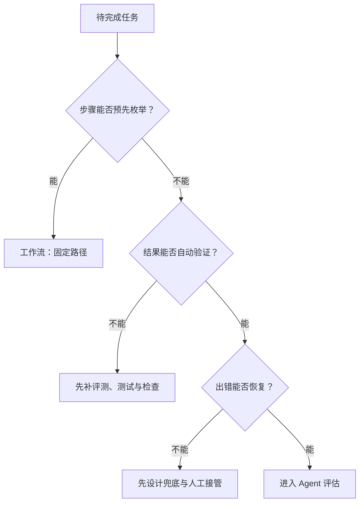

---
---
description: Agent 产品设计决策框架：形态选型、自主度分级、代理权与信任、失败恢复与运营。
---

## Agent 产品设计深度篇

Agent 产品让 AI **独立完成任务**：写报告、做调研、管日程、自动化运维。从「聊天助手」到「自主执行」是产品范式转变：决定权、执行权与风险从人转移到系统。
产品经理的设计重心也随之变为设计**代理权、信任与失败恢复**。技术背景见 [Agent 与工作流](../ai/agent.md)；本文结论均有官方文档等权威来源，原创整理。

本类是「Agent 产品」专题的枢纽页，按阅读路径分流：

- [Agent 工具与 MCP 产品化](agent-tools.md)：工具接口（ACI）、工具治理、MCP 产品化——工具层细节
- [多 Agent 与人机协作](multi-agent.md)：多 Agent 架构选型、分工模式、人在环内的工程落地——编排细节

本篇只保留决策框架与评审清单；技术原理见 [工具调用与 MCP](../ai/agent-tools.md) 与 [Agent 架构与多智能体](../ai/agent-architecture.md)。

### Agent 产品的设计空间

#### 产品形态

| 形态 | 自主程度 | 例子 | 设计要点 |
| --- | --- | --- | --- |
| 任务型 Agent | 完成单个明确任务 | 一键生成周报、调研报告 | 结果可验证，一次成功率高 |
| 流程型 Agent | 完成多步固定流程 | 报销流程、简历筛选 | 确认点设在不可逆节点 |
| 陪伴型 Agent | 持续运行、主动行动 | 智能助理、监控机器人 | 预算护栏 + 主动干预路径 |

三种形态不是互斥的：同一个产品可以同时含任务型与流程型场景（如「报销助手」既是流程型，单次填单又是任务型）。选型看两件事：**任务是否高频、风险是否可控**：

| 使用频度 \ 任务风险 | 低风险 | 高风险 |
| --- | --- | --- |
| 高频 | **值得 Agent 化**：自动化 ROI 最高，可放心逐步放权 | **半自主 Agent**：执行 + 确认点，护栏与审计优先，值得投资 |
| 低频 | **不值得上 Agent**：工作流或模板即可，Agent 的编排成本摊不平 | **人来做**：低频高险任务不值得建自动化，Agent 只做建议与草稿 |

> 选型矩阵的口诀：**高价值 × 高频 → 值得 Agent 化；低频 × 高险 → 人来做**。价值决定 ROI 上限，频度决定自动化投资能否摊平，风险决定放权上限。矩阵里的「低频低险」是最常见的过度设计点：一个每月用两次的固定报表流程，写成工作流就够了。

三种形态还有一层运营差异，写进产品规划：

-   **任务型**按「单次成功率」运营：一次任务的通过率、重试率、平均轮数，优化目标是让单次成功率逼近 100%
-   **流程型**按「节点通过率」运营：哪个确认点通过率最低、哪个节点最常被打回，就是流程与提示词优化的重点
-   **陪伴型**按「长期留存」运营：持续运行意味着成本是常态而非单次，预算护栏与主动干预路径（用户随时能接管）是存活前提

#### 任务边界：什么任务适合 Agent 化

OpenAI 官方定义：Agent 是「能够规划、调用工具、跨专家协作，并保持足够状态以完成多步工作的应用」([OpenAI Agents 指南](https://developers.openai.com/api/docs/guides/agents))。Anthropic 的 [Building Effective Agents](https://www.anthropic.com/engineering/building-effective-agents) 给出更实用的判断框架，先区分两类系统：

-   **工作流（Workflow）**：LLM 与工具被预先编排的代码路径调度，适合步骤明确、要求稳定的任务
-   **Agent**：LLM 动态决定自己的执行过程与工具使用，适合「无法预测所需步骤数、无法硬编码固定路径」的开放式问题

官方建议「先找最简单的方案，只在确有收益时增加复杂度」。很多应用优化单次 LLM 调用（检索 + 上下文示例）就够了。
判断任务是否值得 Agent 化，依次问三个问题：步骤能否预先枚举？结果能否自动验证？出错能否恢复？三者都答「否」才值得上 Agent。官方点名的两个已验证领域是客服（对话 + 工具，可测解决率）与编码 Agent（可用自动化测试验证）([Building Effective Agents](https://www.anthropic.com/engineering/building-effective-agents))。

这棵决策树把 Agent 的适用边界落到三个可检查条件：不确定性需要动态处理，同时结果可验证、失败可恢复。

三问展开为决策树，评审时照着走：

评审时以 Mermaid 决策树为准：步骤固定就用工作流；步骤不固定但结果可验证、失败可恢复，才进入 Agent 评估。

两个常见反例：**不该 Agent 化却做了**：

-   **反例一：把「简历初筛」做成全自主 Agent**。步骤其实可枚举（解析 → 关键词匹配 → 打分 → 排序），结果可验证，出错可恢复——这是典型的工作流。做成 Agent 后行为不可预期、烧 token，且强合规场景要可审计路径，最终退回工作流 + 审批。
-   **反例二：把「自动群发营销文案」一次给满代理权**。发送不可逆、出错不可恢复，第一步就不该放全自主。实际结果是误发事故，回退成「生成草稿 → 人工确认 → 发送」的确认点模式。

判断 Agent 化的本质是判断**不确定性在哪里**：流程确定性高就交给工作流，把 Agent 留给真正需要动态决策的部分。

工程上还有一层边界：想要自己掌控循环、路由与状态，用 Responses API；想让 SDK 管理循环、工具执行、护栏与会话，用 Agents SDK（[OpenAI Agents 指南](https://developers.openai.com/api/docs/guides/agents)）。对应到产品决策，就是「自研编排 vs 用框架」的取舍：自研灵活但成本高，框架快但受制于框架抽象。

#### 自研编排 vs 用框架：产品决策表

「用 Responses API 自研」与「用 Agents SDK / LangGraph」是产品决策：它决定你迭代编排逻辑的速度、出问题时能否定位、以及团队需要什么能力。

| 维度 | 自研编排（Responses API 直连） | 框架（Agents SDK / LangGraph） |
| --- | --- | --- |
| 团队能力 | 需较强的 LLM 工程能力：循环、状态、重试、护栏、并发全部自建 | 门槛低，SDK 自带循环、工具执行、护栏、tracing |
| 迭代速度 | 初期慢，后期无框架约束 | 初期快，但升级受框架版本与抽象限制 |
| 可控性 | 完全掌控执行语义：路由、状态、停止条件都是自己的代码 | 框架决定执行语义，出问题要先读懂框架 |
| 可观测性 | 想埋什么埋什么，但要自己搭 | 自带 tracing（如 OpenAI SDK 的 tracing），定制受限 |
| 适用场景 | 编排逻辑本身是产品差异化的核心 | 快速验证、标准化编排、团队以产品为主 |

> 选型经验：**先用框架验证产品价值，评测证明编排逻辑是差异化壁垒后，再评估自研**。这与「先简单后复杂」的原则一致。框架掩盖底层 prompt 与响应，出问题时无从下手，是常见的踩坑点（见「常见坑」）。

两条路之间还有中间态：**框架之上保留自研点**：用框架管循环与护栏，但路由、状态、停止条件等差异化逻辑自己写扩展（LangGraph 的节点自定义、Agents SDK 的 custom tool/guardrail 都是为此设计的）。大多数产品长期停留在这个中间态，只有编排本身成为壁垒（如自研调度策略、私有状态机）才值得全自研。

#### 工具层设计：把 ACI 当 HCI

Agent 的工具接口（Agent-Computer Interface，ACI）是产品体验的一部分：工具描述决定模型能否正确选择，参数设计决定错误发生率，错误返回决定能否自愈。要点：

-   给模型足够的思考 token 再行动，格式贴近模型见惯的自然文本，避免 JSON 转义等格式开销
-   工具描述要写清「做什么、何时用、边界在哪」，附示例；参数必填最小化
-   用「防错」（poka-yoke）设计让错误难发生——与人类用户的 HCI 同理（[Building Effective Agents](https://www.anthropic.com/engineering/building-effective-agents)）

工具清单的治理、MCP 接入与工具权限的产品化细节见 [Agent 工具与 MCP 产品化](agent-tools.md)；工具调用机制见 [工具调用与 MCP](../ai/agent-tools.md)。

#### 自主度分级：辅助 → 半自主 → 全自主

自主度是产品光谱而非开关。参考 Claude Code 的权限模式设计，可分成三级，每级的产品设计含义不同：

| 级别 | 特征 | 产品设计含义 |
| --- | --- | --- |
| 辅助 | 建议、草稿、可覆写 | 无执行风险，重点是内容质量与上下文 |
| 半自主 | Agent 执行 + 关键节点人工确认 | 确认点设在风险点；不可逆操作必须确认 |
| 全自主 | 自动执行、自动纠错 | 必须有验证闭环与预算护栏（步骤上限、成本上限） |

Claude Code 的权限体系是现成的分级参考：Manual 模式默认只读、写操作逐次征求批准；Auto 模式由分类器模型审查动作、拦截风险操作，常规动作不再打扰人；沙箱提供文件系统与网络隔离，让 Agent 在限定边界内自主工作（[Claude Code 安全文档](https://code.claude.com/docs/en/security)）。OpenAI 官方指南同样指出：人在环内的介入点由开发者决定，SDK 内置「可恢复的审批流程」（resumable approval flows）作为标准机制（[OpenAI Agents 指南](https://developers.openai.com/api/docs/guides/agents)）。

每一级都要定义**四件套**：准入信号（什么证据下允许进入本级）、护栏（本级有哪些硬约束）、回退机制（本级失灵时退到哪）、退出条件（什么时候必须降级或转人工）：

| 级别 | 准入信号 | 护栏 | 回退机制 | 退出条件 |
| --- | --- | --- | --- | --- |
| 辅助 | 内容质量评测达标（如回答采纳率基线） | 无写权限，输出全部可覆写 | 不适用（无执行风险） | 用户连续修改/不采纳 → 回查上下文与提示词质量 |
| 半自主 | 执行正确率达标 + 确认点覆盖全部不可逆操作 | 确认点、步骤预算、工具白名单 | 确认点连续被拒 → 降为辅助（只出建议） | 误操作率超阈值、确认流无人响应 → 转人工或暂停 |
| 全自主 | 终态正确率达标 + 错误可回滚 + 成本有预算 | 步骤/成本上限、沙箱隔离、自动回滚 | 反复触发拦截或失败 → 自动回退到更保守交互 | 预算用尽、错误不可恢复 → 显式降级转人工 |

分级不是一次性决定，而是随信任增长的动态过程：Claude Code 的 Auto 模式在分类器反复拦截时会把会话回退到更保守的交互方式，避免无人值守运行静默失控（[Claude Code 最佳实践](https://code.claude.com/docs/en/best-practices)）。「代理权动态调节」是产品上值得抄的机制。

分级不是抽象概念，每一级都对应具体的界面与交互设计：

| 级别 | 界面呈现 | 用户交互 | 升级时的产品动作 |
| --- | --- | --- | --- |
| 辅助 | 建议卡片、草稿面板 | 一键采纳、一键覆写 | 记录采纳率，作为升级证据 |
| 半自主 | 执行面板 + 确认弹窗 | 批准/拒绝，拒绝可附理由 | 记录确认通过率与拒绝反馈 |
| 全自主 | 执行面板 + 撤销入口 + 预算进度条 | 随时打断、/rewind 回滚 | 记录终态正确率与接管率 |

界面即证据：每一级的界面是**收集信任证据的仪器**。采纳率、确认通过率、终态正确率都是从这些交互里统计出来的。

**全自主的放行条件**：Anthropic 指出 Agent 最适合在「可信环境 + 充分沙箱测试 + 护栏」下运行（[Building Effective Agents](https://www.anthropic.com/engineering/building-effective-agents)）；Claude Code 的实践原则更直接——「无法验证的改动不要上线」（trust-then-verify gap 的解法是永远给 Agent 一个可运行的检查）（[Claude Code 最佳实践](https://code.claude.com/docs/en/best-practices)）。
放行全自主之前，先回答：错误是否被约束在可回滚范围内？

### 代理权与信任

#### 权限最小化与操作确认点

-   **最小权限**：Agent 能调用什么工具、触碰什么数据，是产品设计的第一决定。Claude Code 默认「非白名单即拒绝」（fail-closed），未匹配的敏感命令必须人工批准；工作目录边界限定 Agent 只能写启动目录及其子目录（[Claude Code 安全文档](https://code.claude.com/docs/en/security)）
-   **确认点设在风险点**：不可逆操作（发消息、付款、删除、写生产数据）必须人工确认，可逆操作不打扰用户。OpenAI Agents SDK 的审批流支持「运行暂停 → 人类批准/拒绝 → 从暂停点恢复」，拒绝结果还会反馈给模型学习（[Running Agents 文档](https://openai.github.io/openai-agents-python/running_agents/)）
-   **护栏与确认并用**：输入/输出护栏（guardrails）在 Agent 执行之外并行校验，用「绊线」（tripwire）快速失败；护栏默认并行运行，代价是触发时模型可能已消耗 token，成本敏感场景应改为阻塞模式（[Guardrails 文档](https://openai.github.io/openai-agents-python/guardrails/)）
-   **提示注入是输入面**：Claude Code 把网页抓取放在独立上下文窗口、网络命令默认需批准、复杂命令附自然语言解释——Agent 读到的第三方内容本身就是攻击面，产品要考虑「内容来自不可信来源」时的隔离（[Claude Code 安全文档](https://code.claude.com/docs/en/security)）

权限设计有一个容易被忽略的维度：**参数级最小权限**。光限制「能调用什么工具」不够，还要限制「以什么参数调用」：比如删除工具只能删「当前任务目录内、修改时间早于 X 的临时文件」，而不是任意路径。越界风险从「工具级」下沉到「参数级」，是半自主产品放权的常见杠杆。

企业场景还要加一层**审计日志**：谁在什么时间授权了什么操作、Agent 实际执行了什么、结果如何，全部可追溯。个人产品靠信任，企业产品靠审计。没有审计日志，事故复盘与合规审计都无法进行（与 [AI 产品合规](compliance.md) 的合规要求对应）。

#### 可观测性与信任建立

-   **展示规划步骤**：Anthropic 把「显式展示 Agent 的规划步骤」列为透明度优先项（[Building Effective Agents](https://www.anthropic.com/engineering/building-effective-agents)）；执行中的当前步骤、调用的工具、依据都要可见，用户可以中途插入、暂停、接管
-   **回答带来源**：Anthropic 的研究系统专门设计 CitationAgent 为结论溯源；产品上 Agent 产出应可点击回到依据（[多 Agent 研究系统](https://www.anthropic.com/engineering/multi-agent-research-system)）
-   **失败透明**：Agent 反复尝试同一失败路径时如实展示，不要伪装成正常执行；Claude Code 的最佳实践是「给 Agent 一个能自己跑的检查」（测试、构建、截图对比），让验证闭环而不是靠人盯（[Claude Code 最佳实践](https://code.claude.com/docs/en/best-practices)）
-   **可回退**：Claude Code 的 checkpoint 机制让对话与代码状态都可回滚到任意历史点，用户一句「撤销」即可回退（[Claude Code 最佳实践](https://code.claude.com/docs/en/best-practices)）
-   **系统级可观测**：OpenAI SDK 内置 tracing，把每次工具调用、每轮推理可视化，是 Agent 调试与线上监控的标准设施（[OpenAI Agents SDK](https://openai.github.io/openai-agents-python/)）
-   **信任建立在评测上**：Anthropic 建议「先写简单 prompt，用全面评测迭代优化」（[Building Effective Agents](https://www.anthropic.com/engineering/building-effective-agents)）——对产品经理，这意味着放权前先有可量化的通过率/解决率基线，信任额度 = 评测证据

#### 信任额度模型：信任 = 评测证据 × 失败可恢复性

「信任额度」是代理权放大的量化框架，两个因子缺一不可：

-   **评测证据**：通过率、解决率、终态正确率等可量化的成功率基线。证据来自评测集、回归集与线上指标，不是 demo 观感
-   **失败可恢复性**：出错后的补救成本——可回滚、可重试、可人工接管。同样的 90% 成功率，「可一键回滚」与「不可逆事故」对应的信任额度完全不同

> 信任额度 = 评测证据 × 失败可恢复性。两个因子是乘法关系：**可恢复性低的任务，需要远高于常规的评测证据才配得上放权**；反过来，可恢复性做足（checkpoint、撤销、沙箱），可以在评测证据不足时先行小范围放权试错。

产品动作：每次放大代理权前，把两个因子各自打分（如评测通过率 ≥ 阈值、失败可恢复性满足「可回滚」/「可人工接管」/「不可逆但低风险」三档），只有两个因子同时达标才升一级。这个模型也解释了为什么「演示成功」不能算证据——演示没有覆盖率，也没有失败可恢复性的检验。

打分示例（评审会可用的表格）：

| 任务 | 评测通过率（证据） | 失败可恢复性 | 信任额度 | 放权建议 |
| --- | --- | --- | --- | --- |
| 生成周报草稿 | 92% | 可覆写（无副作用） | 高 | 辅助 → 半自主 |
| 自动发送周报 | 95% | 不可逆（发错收件人难收回） | 中 | 必须半自主 + 确认点 |
| 自动提交代码 | 85% | 可回滚（checkpoint + 测试） | 中高 | 半自主 → 全自主（有回滚） |
| 自动付款 | 99% | 不可逆且高代价 | 低 | 保持人工确认，不放权 |

#### 用户信任的生命周期

用户的信任不是一次建立的，产品要按阶段设计对应交互：

| 阶段 | 用户心理 | 产品动作 | 关键指标 |
| --- | --- | --- | --- |
| 首次使用 | 好奇、谨慎，怕它乱来 | 只读/建议模式，展示规划步骤与来源，给「撤销」入口 | 首次任务完成率、明确拒绝率 |
| 轻度放权 | 开始信任低风险执行 | 半自主：低风险任务自动执行 + 确认点；完成度可视化 | 确认通过率、修改率下降 |
| 深度放权 | 把重要任务交给它 | 全自主 + 护栏 + 自动回滚；订阅/额度升级 | 终态正确率、人工接管率 |
| 事故后的回退 | 信任受损，需要重建 | 显式降级一级、透明复盘（发生了什么、如何补救）、提供补偿 | 回退后复购/继续使用率 |

事故后的回退是生命周期里最考验产品设计的一环：**信任受损后的重建靠透明复盘 + 渐进恢复**，而不是靠一句「下次会更好」。Claude Code 的 /rewind 与 checkpoint 之所以重要，正是因为「可回退」直接转化为用户对事故的容忍度。

首次使用的体验设计要单独打磨：第一次任务展示完整的「规划 → 执行 → 结果」过程（每一步做什么、用了什么依据、结果是什么），给用户一个「全程可见 + 随时可撤销」的安全感知。第一次体验的「可撤销感」决定了用户是否愿意进入轻度放权阶段。很多 Agent 产品死于第一次就让用户觉得失控。

生命周期的节奏建议：每一阶段至少运行 1-2 个完整使用周期（如一周）再考虑升级，用该阶段的指标（确认通过率、采纳率）做升级依据——升级太快会透支信任，太慢会浪费效率。

#### 代理权要赚取，不要授予

每多给系统一分**代理权**，就少一分控制：建议式回复可以覆写，自动发送就必须确保正确。常见错误是系统还没证明「犯错时可控」就直接上全代理：失去可见性、失去信任、动作无法追溯。正确姿势是**控制交接**：出错时人类能无缝接管，如 Agent 做错了一步，用户能一键纠正并记录，信任和可恢复性从这一步开始。

「赚取」在产品上的落地节奏：评测证据不足时只给「建议」；连续 N 次建议被采纳且无事故，升「受控执行」；再积累通过率与回滚能力，才谈「自动执行」。每一级放权都要有一个**可撤回的触发条件**：随时可以按回退机制降级（见「降级阶梯的产品化」）。

### 失败恢复与降级

#### 错误处理与重试

Agent 与传统软件的失败模式不同，错误会**有状态地累积**。Anthropic 团队明确指出：Agent 无法简单重启，需要可恢复的检查点与重试逻辑；「原型到生产的差距往往比预想的大，最后一公里常常占了大部分旅程」（[多 Agent 研究系统](https://www.anthropic.com/engineering/multi-agent-research-system)）。产品层面的落地：

错误累积的机制值得展开：每一步执行都会把结果写回上下文，**坏结果会污染后续所有推理**：第一步检索到错误文档，后续每一步都建立在错误事实上。这也是「无限重试」失效的根因：重试的是同一个坏上下文，而不是干净的重来。产品对策是给关键步骤设置**检查点**（步骤产物先验证再进入下一步），而不是在整条链路上无脑重试。

-   **持久化执行**：LangGraph 等编排框架的 durable execution 让图跨失败持久化、从断点恢复，长任务不因一次故障从头再来（[LangGraph 文档](https://docs.langchain.com/oss/python/langgraph/)）
-   **重试要有边界**：官方数据表明 Agent 错误会复合累积，不能靠无限重试；要区分「可重试的瞬时错误」与「反复失败的系统性问题」——后者应立即降级或转人工，而不是继续烧 token（[多 Agent 研究系统](https://www.anthropic.com/engineering/multi-agent-research-system)）
-   **可打断**：用户随时能叫停，中断后状态保留可续跑；Claude Code 提供 Esc 中断与 /rewind 回滚（[Claude Code 最佳实践](https://code.claude.com/docs/en/best-practices)）
-   **人工接管路径**：任务失败要能无缝转人工，不能静默卡死；Claude Code 的 Plan 模式把「探索 → 计划 → 实施 → 提交」分成四个阶段，人在计划批准点接管（[Claude Code 最佳实践](https://code.claude.com/docs/en/best-practices)）

人工接管的交接物要产品事先定义，最少四件：**任务目标（用户原始诉求）、执行进度（做到哪一步）、失败原因（哪一步错了、为什么）、trace 链接（完整复现路径）**。转人工时把这四样打包给人工处理人，能显著缩短处理时间；缺了 trace 的交接，人工等于从零开始，接管也就名存实亡。

每种失败都要有**触发条件与产品动作**，评审时对照：

| 失败类型 | 触发条件 | 产品动作 |
| --- | --- | --- |
| 瞬时错误 | 网络超时、工具限流、单次调用 5xx | 自动重试，指数退避，上限 2-3 次后转下一步 |
| 反复失败 | 同一步骤连续失败 ≥ 2 次（如检索不到、工具报错） | 停止重试：换策略、降级或转人工，不再烧 token |
| 错误累积 | 后续步骤建立在坏结果上（如第一步检索差） | 关键步骤加验证节点：结果为空/置信度低时换查询、换来源 |
| 用户打断 | 用户 Esc / 停止 | 保留状态可续跑，中断点存档 |
| 不可逆操作 | 发消息、付款、删除、写生产数据 | 确认点挂起等待人工，拒绝结果反馈给模型 |
| 预算/步数用尽 | 触发 max_turns、成本上限 | 显式降级（见「降级阶梯」）或转人工，不静默停止 |

#### 成本失控防护

-   **步骤预算**：OpenAI Agents SDK 的 `max_turns` 限制 Agent 循环步数，超出即抛 `MaxTurnsExceeded`；`max_function_tool_concurrency` 限制并发工具调用（[Running Agents 文档](https://openai.github.io/openai-agents-python/running_agents/)）
-   **按调用链分级**：用廉价模型做护栏、昂贵模型做正事，是官方推荐的省钱模式；护栏阻塞模式在模型启动前拦截，避免无效 token 消耗（[Guardrails 文档](https://openai.github.io/openai-agents-python/guardrails/)）
-   **显式降级路径**：预算用尽或反复失败时，产品应有明确降级——从全自主降为「每一步确认」或转人工；Claude Code 的 Auto 模式在分类器反复拦截时回退到更保守交互，即是「代理权可降级」的参考实现（[Claude Code 最佳实践](https://code.claude.com/docs/en/best-practices)）
-   **接受成本换效果**：Anthropic 明示「Agent 的自主意味着更高成本，且错误会叠加」；多 Agent 系统 token 消耗约为普通对话的 15 倍，在 BrowseComp 上 token 用量单独解释了约 80% 的表现差异（[多 Agent 研究系统](https://www.anthropic.com/engineering/multi-agent-research-system)）。预算上限、超时、最大步数必须作为一等设计要素

成本防护的完整测算方法（单次调用成本 → 业务量 → 工程系数三步法）与降本策略见 [LLM 成本测算](../tools/llm-cost.md)。

#### 降级阶梯的产品化

降级不是「出错后随便退一步」，而是产品要预先设计好的四级阶梯。每级有触发条件、产品动作与恢复条件：

| 阶梯 | 状态 | 触发条件 | 产品动作 | 恢复条件 |
| --- | --- | --- | --- | --- |
| L4 全自主 | 自动执行、自动纠错 | 正常状态 | 护栏 + 验证闭环 + 预算上限兜底 | — |
| L3 每步确认 | 关键步骤人工放行 | 反复失败、误操作率超阈值、用户主动要求 | 确认点全开，拒绝反馈给模型 | 连续 N 次确认通过且无事故 |
| L2 建议模式 | 只生成建议与草稿，不执行 | 信任受损（事故后）、评测证据不足 | 输出可一键采纳/覆写，执行权收回 | 采纳率回升 + 评测补测达标 |
| L1 转人工 | 系统不再执行，转人工处理 | 错误不可恢复、预算彻底用尽、合规要求 | 完整上下文交接（日志、trace、进度），静默卡死是最差结果 | 人工结案或重新授权 |

> 降级阶梯的设计要点：**每一级都要「可回退、可恢复、不静默」**。产品上线前必须回答：L4 降到 L3 的触发阈值是什么？降到 L2 后怎么重新升回来？转人工时交接给谁、交接什么？回答不了的环节，就是事故现场。

一个可对照的实例：社区内容产品的「自动发帖 Agent」设计降级阶梯：正常情况全自主发布已审核通过的内容（L4）；单日内容投诉率超过 0.5% 时，所有发帖改为人工预览后发布（L3）；投诉率超过 2% 或出现舆情事故时，Agent 只产出草稿，运营直接接管（L2 → L1）；问题修复并连续 7 天投诉率回落后再逐级升回。这个设计把「信任额度」与「降级阶梯」串成了一条可执行的策略，而不是出事后的临时决断。

#### 常见坑

-   **Demo 陷阱**：演示场景可控，真实场景千变万化——上线前用真实数据压测
-   Agent 反复尝试同一失败路径，浪费 token——配合步骤预算与护栏
-   工具权限过宽，出现「AI 把公司文件删了」级事故——最小权限 + 确认点
-   忽略了「结果可验证」：Agent 产出的报告没人核对，比没有更糟——验证闭环
-   多 Agent 之间的「传话游戏」：子 Agent 产出经转述后失真——让子 Agent 直接写产物文件，只传引用（[多 Agent 研究系统](https://www.anthropic.com/engineering/multi-agent-research-system)）
-   框架掩盖底层 prompt 与响应，出问题时无从下手——先直接用 LLM API 起步，用框架前先读懂它（[Building Effective Agents](https://www.anthropic.com/engineering/building-effective-agents)）
-   把「演示成功」当「评测通过」：演示是精选场景，评测是覆盖率与基线——没有评测集就谈不上放权（见「Agent 产品的评测与运营」）
-   代理权一次给满：跳过「建议 → 半自主 → 全自主」的渐进过程，直接全自动——没有可撤回的触发条件，出事只能全停
-   没有降级路径：预算用尽或反复失败时产品没有预设动作，静默卡死或无限重试——每一级降级都要在产品里可触发、可恢复
-   工具权限过宽的另一面：给了工具但没给参数级边界（如让 Agent 自由选删除范围而非限定条件）——最小权限要落到参数级
-   忽略终态验证：只对过程打分（回答像不像样），不验证终态（状态改对了没有）——对会改状态的 Agent，必须评测终态
-   评测集当一次性资产：上线后不再扩充，通过率虚高——每个事故复盘都要沉淀回回归集（见「Agent 产品的评测与运营」）
-   确认点设置过多：每个步骤都弹确认，用户被迫批量点「全部同意」，确认点形同虚设——确认点只设在不可逆风险点，可逆操作不打扰

### 多 Agent 编排与人机协作

#### 单 Agent vs 多 Agent：先看官方实测

Anthropic 的实测给出了目前最权威的取舍数据：以 Claude Opus 4 为主、Sonnet 4 为子 Agent 的多 Agent 系统，在其内部研究评测上比单 Agent Opus 4 好 90.2%，但 token 消耗约为普通对话的 15 倍（[多 Agent 研究系统](https://www.anthropic.com/engineering/multi-agent-research-system)）。因此：

-   **适合多 Agent**：重度并行、信息量超出单一上下文窗口、需要对接大量复杂工具的场景
-   **不适合多 Agent**：需要所有 Agent 共享同一上下文、Agent 间强依赖的领域——官方明示大多数编码任务属于此类
-   **两种委托原语**：OpenAI SDK 提供 handoffs（把控制权完全交给另一个 Agent）与「Agent 即工具」（管理者模式，主 Agent 保持控制）两种编排方式，对应产品上「交接责任 vs 保留监督」两种协作关系（[OpenAI Agents SDK](https://openai.github.io/openai-agents-python/)）
-   **编排模式**：官方落地的是 orchestrator-worker（主 Agent 拆任务、子 Agent 并行执行、汇总结果），并强调「把委派写清楚」——子任务描述含糊会导致重复劳动；子 Agent 把产物写入文件系统、只传引用给主 Agent，避免「传话游戏」（[多 Agent 研究系统](https://www.anthropic.com/engineering/multi-agent-research-system)）
-   **社区验证**：linux.do 上有团队复盘自研的 7-Agent 研发流水线（需求分析/架构/审查/编码/测试/部署），结论是链路冗余、职责边界模糊；回复中多名实战者直言「多 Agent 是无效的副作用」——上下文混乱、无效沟通，主张「一个上下文内的 multi mode 比 multi agent 更适合」；另有回复提醒「生产系统不敢用」「这么多 Agent 一个小问题都得跑半天」（[linux.do 讨论帖](https://linux.do/t/topic/2636562)）——与官方「大多数任务先上单 Agent」的建议互相印证

#### 工作流先行：五类官方模式

如果任务还没到需要 Agent 的复杂度，Anthropic 给出五类工作流模式，覆盖大多数确定性流程：**prompt chaining**（链式）、**routing**（路由）、**parallelization**（并行：切分/投票）、**orchestrator-workers**（编排器-工人）、**evaluator-optimizer**（评估-优化循环）。建议先选其一，跑通再加自主度（[Building Effective Agents](https://www.anthropic.com/engineering/building-effective-agents)）。简单的先上：**固定工作流 + 单 Agent + 人工复核**。要算清多 Agent 的账：官方数据显示 token 用量单独解释了约 80% 的评测差异（[多 Agent 研究系统](https://www.anthropic.com/engineering/multi-agent-research-system)）。多 Agent 的收益本质是「花钱买并行度与上下文隔离」，先量化收益再决定值不值。

#### 人在环内（Human-in-the-Loop）的设计

-   **检查点式介入**：LangGraph 的中断（interrupt）机制允许在任何节点暂停并**检查、修改 Agent 状态**后再继续，适合「先看再放行」的高风险步骤（[LangGraph 文档](https://docs.langchain.com/oss/python/langgraph/)）
-   **审批流**：OpenAI SDK 的运行器原生支持「暂停等批准 → 恢复」；配 `pre_approval_tool_input_guardrails` 可让护栏先于审批执行（[Running Agents 文档](https://openai.github.io/openai-agents-python/running_agents/)）
-   **对抗式复核**：Claude Code 推荐用独立上下文中的复核子 Agent 审查产出——「干活的人不给自己打分」；写手/审稿分 session 是官方推荐的并行模式（[Claude Code 最佳实践](https://code.claude.com/docs/en/best-practices)）
-   **长任务与人协作**：审批可能要等几分钟甚至几小时，Agent 必须能「挂起等待」而非超时失败——OpenAI SDK 文档把 Temporal、Dapr 等持久化执行框架列为 human-in-the-loop 工作流的支撑设施（[Running Agents 文档](https://openai.github.io/openai-agents-python/running_agents/)）
-   **机制要确定**：CLAUDE.md 这类提示是「建议性」的，靠模型自觉；需要零例外保证的动作（如禁止写入某目录）要用 hooks 这类确定性机制实现（[Claude Code 最佳实践](https://code.claude.com/docs/en/best-practices)）

完整框架见 [AI 产品开发生命周期（CC/CD）](../pm/ai-lifecycle.md)。

#### 多 Agent 的决策框架

本页只写决策框架，机制细节由 [多 Agent 与人机协作](multi-agent.md) 承接。是否上多 Agent，按顺序回答：

1.  **任务可拆吗？** 子任务边界清晰、可独立描述 → 可考虑；子任务强耦合、共享上下文 → 单 Agent
2.  **需要并行吗？** 重度并行、信息量超出单一上下文窗口 → 多 Agent 有收益；串行强依赖 → 单 Agent
3.  **权限需要隔离吗？** 不同子任务需要不同工具/权限（如写手与审稿人）→ 多 Agent；否则单 Agent 更省
4.  **成本预算够吗？** 多 Agent token 消耗约为普通对话的 15 倍，先量化收益再决定值不值

四问全「是」才上多 Agent，否则单 Agent + 工作流 + 人工复核通常更划算。多 Agent 的分工模式、通信方式（直接传消息 vs 共享黑板）与工程落地，见 [多 Agent 与人机协作](multi-agent.md)；架构层面的代价分析见 [Agent 架构与多智能体](../ai/agent-architecture.md)。

上线后还要持续回答两个运营问题：**什么时候该拆、什么时候该合**。拆的信号：单 Agent 频繁在同一类子任务上失败、上下文被反复截断、并行需求真实存在；合的信号：子 Agent 之间通信开销大、结果拼接困难、排障时长飙升。拆分与合并都按评测证据决策，不凭感觉（官方「大多数任务先上单 Agent」仍是默认起点）。

### Agent 产品的评测与运营

#### 终态评测：对会改状态的 Agent 测终态

普通对话产品可以逐轮打分，但 Agent 会**改变状态**：发消息、写文件、改配置。对这类 Agent，官方建议评测「终态」而非逐轮打分（[多 Agent 研究系统](https://www.anthropic.com/engineering/multi-agent-research-system)）：

| 维度 | 逐轮打分（过程评测） | 终态评测 |
| --- | --- | --- |
| 看什么 | 每一轮回答像不像样 | 任务目标达成度、产物质量、副作用是否越界 |
| 适合 | 对话、内容生成 | 改状态的执行型任务（发送、写入、调用业务 API） |
| 盲区 | 过程漂亮但结果没执行、执行错了 | 中途走了弯路但终态正确（可接受）；需要配合 trace 看成本 |

终态的定义要产品先写清楚：**任务完成标准 + 状态变更清单 + 越界定义**。比如「自动发周报」的终态是「收件人正确、内容准确、发送成功、未发错群」。每一条都要可自动或半自动验证。

**LLM-as-judge 的校准限制**：用 LLM 当裁判要理解它的局限——judge 自带偏好（如偏好结构工整、偏好特定文风）、不同模型当 judge 结果不一致、评分可能被长度与格式干扰；业界实践是用小样本人工标注校准 judge，再放量使用（[LlamaIndex 评测](https://developers.llamaindex.ai/python/framework/understanding/evaluating/evaluating/)）。站内展开见 [评估与评测](../ai/evaluation.md)。

**人工测试补位**：自动评测抓不到的问题要靠人工——比如偏好 SEO 内容农场而非权威来源这类价值观判断。约 20 个代表性 query 就能发现早期大问题（[多 Agent 研究系统](https://www.anthropic.com/engineering/multi-agent-research-system)）；先小后大，评测集随线上反馈持续扩充。

评测集的构建不是一次性工程，三步走：

1.  **采样**：从线上日志采样真实 query（含失败任务与投诉案例），覆盖各任务类型与难度
2.  **标注**：人工标注期望终态（完成标准 + 合法状态变更），小样本（20-100 条）起步即可
3.  **扩充**：每个线上事故复盘后补一条用例，评测集随产品演进而增长

评测集的黄金法则是**从线上来，回线上去**：只用离线自造的 query 评测，等于在用假设检验产品。评测体系的完整三层架构（离线评测集 / 线上指标 / 用户体验）见 [评估与评测](../ai/evaluation.md)。

#### 错误分类学与回归集

Agent 出错时，先把根因归类再动手修。六类根因与对应产品动作：

| 根因类别 | 典型症状 | 定位方法 | 产品动作 |
| --- | --- | --- | --- |
| 数据 | 输入数据缺失、错误、过时 | 检查输入与库内容 | 数据校验、来源标注、刷新策略 |
| 检索 | 召回不足、检索到错文档 | 看 trace 中检索结果与排序 | 检索策略、重排、RAG 链路优化 |
| 提示词 | 指令含糊、输出格式不符、不按流程走 | 对比 prompt 版本与失败样本 | prompt 版本管理、改写、加示例 |
| 模型 | 推理错误、工具选错、幻觉 | 换模型/加上下文复现对比 | 模型选型评测、上下文工程 |
| 工具 | 工具 bug、返回错误、权限拒绝 | 检查工具日志与返回 | 修工具、错误归一化、参数边界 |
| UI | 用户误解、输入不清 | 用户访谈、操作日志 | 文案与引导、输入校验 |

配套机制是**回归集**：每个线上事故复盘后沉淀为一条评测用例，进回归集；模型、prompt、工具任何变更必须先跑回归集再上线。没有回归集的 Agent 产品，每改一次 prompt 都是一次盲盒。检索与 RAG 相关根因的展开见 [RAG 基础](../ai/rag.md)；评测体系三层架构见 [评估与评测](../ai/evaluation.md)。

#### 变更管理与灰度

Agent 的每次变更（prompt 调整、工具改动、模型升级）都可能改变行为分布，必须走灰度：先跑回归集，再小流量上线（如 1%-5% 用户），对比通过率、人工接管率、每任务成本三个指标，达标后放量；不达标则回滚。变更管理与持续校准的方法见 [评估与评测](../ai/evaluation.md) 的「评测会失效：持续校准(CC)」一节。

#### 上线后的运营节奏

Agent 上线后进入持续运营，三条线并行：

-   **日志审查**：定期抽查 trace——失败聚类、反复失败路径、人工接管率、误操作率；每次抽查发现的问题进回归集
-   **成本监控**：按任务统计 token 成本（P50/P95）、异常任务（成本远超同类的任务）自动告警、触发降级；成本模型见 [LLM 成本测算](../tools/llm-cost.md)
-   **代理权逐级放大**：从只读 → 建议 → 受控写入 → 自动执行，每一级有验证目标与放行条件，跳过中间级直接放大是事故源头；放行节奏见 [Agent 与工作流](../ai/agent.md) 的「上线路径」

运营期核心指标：通过率/解决率、确认准确率、人工接管率、每任务成本、终态正确率。前三个决定信任，后两个决定商业可行性。

| 指标 | 口径建议 | 用途 | 恶化信号 |
| --- | --- | --- | --- |
| 任务通过率/解决率 | 完成任务 / 全部任务（终态验证） | 放权决策、版本对比 | 连续下滑 → 冻结变更 |
| 确认准确率 | 用户批准但执行错误 / 确认次数 | 半自主质量 | 上升 → 确认点形同虚设 |
| 人工接管率 | 转人工任务 / 全部任务 | 自主度是否虚高 | 上升 → 降级阶梯触发 |
| 每任务成本 | 总 token 成本 / 任务数（P50/P95） | 单位经济 | P95 飙升 → 异常任务审查 |
| 终态正确率 | 终态验证通过 / 抽样验证数 | 全自主放行依据 | 低于阈值 → 收回全自主 |

### Agent 产品的商业与场景

#### 什么场景用户愿意为 Agent 付钱

一个判断：**任务价值可衡量 > 对话价值**。聊天带来的价值是主观的、难定价的；任务价值是可衡量的：省了多少时间、完成了什么交付物、避免了多少损失。可衡量才有定价锚点（价值等价分析见 [AI 产品商业化与定价](../pm/monetization.md)）。

用户愿意为 Agent 付费的场景有三个特征：

-   **高频重复**：每月固定花费 N 小时的任务（周报、数据整理、竞品调研），自动化省下的是真金白银的时间
-   **结果可验证**：交付物明确（报告、代码、表格、已发送的邮件），用户能判断「做没做好」
-   **价值可量化**：能换算成钱或时间——「每周省 2 小时」比「更智能的对话」好卖得多

反过来，纯闲聊、泛资讯问答这类对话价值场景，用户付费意愿弱，更适合作为引流或订阅附加项。

免费额度是 Agent 产品转化的关键设计：免费档给「有限次数的简单任务」（如每周 5 次、限 1-2 轮），既让用户体验「任务价值」，又控制成本；复杂任务放付费档。注意不要让免费档成为薅羊毛入口：限轮数、限工具、限并发缺一不可（成本控制见下节）。

企业场景单独看：企业客户为 Agent 付费的核心是**可审计、可治理、可私有化**：权限审计日志、数据不出域、与内部系统（审批流、工单、ERP）集成。企业采购决策链路长，但客单价与留存远高于个人市场；是否做企业版取决于团队是否有对应的销售与服务能力（决策框架见 [AI 产品商业化与定价](../pm/monetization.md) 的「客群与包装」）。

#### Agent 任务的单位经济

Agent 的成本结构与对话完全不同：**成本 = 平均轮数 × 每轮 token 消耗 × 单价**，循环让成本放大数倍。定价前先算清单任务成本：

1.  测出平均轮数与每轮输入/输出 token（含思考 token），估算单任务成本（方法见 [LLM 成本测算](../tools/llm-cost.md) 的三步法）
2.  给任务分级：简单任务（1-2 轮）与复杂任务（10+ 轮）分开定价或限档
3.  定价锚定任务价值而不是成本——只要单任务成本占售价的合理比例（如 ≤ 20-30%），就有毛利空间；缓存命中、批处理、模型分级可再降 50%-90%

| 计价方式 | 对 Agent 的适配性 | 注意点 |
| --- | --- | --- |
| 按任务计费 | 最适配：任务价值可衡量，成本可预测 | 要防「一次任务拆成多次调用」薅羊毛 |
| 按量（token/调用）计费 | 适合开发者平台 | 用户难预估成本，Agent 场景体验差 |
| 订阅 + 用量档位 | 常见组合：基础订阅含额度，超额按量 | 免费档必须限轮数与工具，防成本失控 |

一个完整算例（价格以官方页面为准）：调研报告 Agent 实测平均 8 轮循环，每轮约 3000 输入 token + 1500 输出 token；假设输入价 $2/百万 token、输出价 $10/百万 token：

-   单任务成本 = 8 轮 ×（3000 × 2 + 1500 × 10）/ 1,000,000 = 8 × 0.021 ≈ **0.17 美元**
-   月 1000 个付费任务 → 月成本约 170 美元（未计缓存命中与护栏开销；缓存与批处理可再降 50%-90%，见 [LLM 成本测算](../tools/llm-cost.md) 的降本策略）
-   定价对照：若该任务替用户省 1 小时（价值约 20 美元），成本占比不足 1%，定价空间很大；若任务只值 1 美元，成本占比 17%，必须降轮数、换廉价模型或把循环改成工作流

算例揭示的规律：**单任务成本 < 任务价值的 10% 才有健康毛利**。占比越高，越要先做成本优化（降轮数、模型分级、缓存）再谈放量与增长。

单位经济与计价单位设计的完整框架见 [AI 产品商业化与定价](../pm/monetization.md) 的「定价模型与 unit economics」一节。一个现实约束：**成本与用户价值成正比才是健康模型**。如果复杂任务花了大成本但用户感知价值不高，问题不在定价，在任务选型（回到「设计空间」的选型矩阵）。

### 对 AI 产品经理的清单

设计评审时逐项过，每项都是可打勾的问题：

-   **权限**
    - [ ] 工具清单是否最小？有没有未使用的工具或过宽的权限？
    - [ ] 有没有工作目录/网络/数据边界？非白名单动作是否默认拒绝？（[Claude Code 安全文档](https://code.claude.com/docs/en/security)）
    - [ ] 权限是否落到参数级（如删除范围、发送对象）？
    - [ ] 第三方内容（网页、文档）是否按不可信来源隔离？
-   **护栏**
    - [ ] 输入/输出/工具三层护栏是否齐备？（[Guardrails 文档](https://openai.github.io/openai-agents-python/guardrails/)）
    - [ ] 绊线触发后是否快速失败且不产生副作用？
    - [ ] 护栏是并行还是阻塞模式？成本敏感场景是否已改阻塞？
    - [ ] 护栏与确认点是否叠加在不可逆操作上？
-   **恢复**
    - [ ] 是否有持久化检查点？失败后能否从断点续跑？（[LangGraph 文档](https://docs.langchain.com/oss/python/langgraph/)）
    - [ ] 人工能否在任何节点接管？交接内容（日志、trace、进度）是否完整？
    - [ ] 能否区分瞬时错误与反复失败？重试是否有上限？
    - [ ] 用户能否随时打断、撤销、回退到历史状态？
-   **成本**
    - [ ] 步骤预算（`max_turns`）、并发上限、超时、成本上限是否配置？（[Running Agents 文档](https://openai.github.io/openai-agents-python/running_agents/)）
    - [ ] 预算用尽时的降级路径是什么？是否可触发、可恢复、不静默？
    - [ ] 单任务成本是否可观测（按任务统计 token 与金额）？
    - [ ] 是否有按调用链分级的模型策略（廉价护栏 + 昂贵正事）？
-   **可观测性**
    - [ ] 步骤日志、工具调用、token 消耗是否可见？（[Building Effective Agents](https://www.anthropic.com/engineering/building-effective-agents)）
    - [ ] 规划步骤是否对用户透明？回答是否带来源？
    - [ ] 失败是否如实展示，而不是伪装正常？
    - [ ] 是否有 tracing 支撑线上问题复现？（[OpenAI Agents SDK](https://openai.github.io/openai-agents-python/)）
-   **评测**
    - [ ] 是否有评测集与通过率基线？约 20 个代表性 query 是否已跑过？（[多 Agent 研究系统](https://www.anthropic.com/engineering/multi-agent-research-system)）
    - [ ] 对会改状态的 Agent，是否评测「终态」而非逐轮打分？
    - [ ] LLM-as-judge 是否经过人工标注校准？人工测试是否在补位？
    - [ ] 线上事故是否沉淀为回归集用例？变更是否强制跑回归？
-   **工具**
    - [ ] 工具描述是否写清「做什么、何时用、边界在哪」，附示例与格式约束？（[Building Effective Agents](https://www.anthropic.com/engineering/building-effective-agents)）
    - [ ] 参数是否必填最小化？错误返回是否机器可读？
    - [ ] 工具清单与权限是否随产品迭代持续治理？详见 [Agent 工具与 MCP 产品化](agent-tools.md)
-   **信任基线**
    - [ ] 回答带来源、失败透明、可回退——没有这三样，不要放大代理权
    - [ ] 信任额度是否按「评测证据 × 失败可恢复性」评估？
    - [ ] 放权是否有可撤回的触发条件与降级阶梯？

**总结**：Agent 产品设计的三个不变式：代理权靠评测赚取、失败可恢复、成本有预算；实现顺序永远是「先简单后复杂」：工作流 → 单 Agent → 人工复核 → 逐步加自主度。

???+ example "练习"
    设计一个「AI 会议纪要员」Agent：列出它的工具清单、执行步骤、3 个需要人工确认的节点、成本上限策略。进阶题：为它写出终态定义（完成标准 + 状态变更清单 + 越界定义），并设计从半自主升到全自主的准入信号与退出条件。

### 来源说明

> 本文综合参考以下权威来源，内容由本站撰写整理：

-   [Anthropic — Building Effective Agents](https://www.anthropic.com/engineering/building-effective-agents)：工作流与 Agent 的区分、五类工作流模式、透明度与工具设计建议（设计空间、代理权、编排、清单）
-   [Anthropic — How We Built Our Multi-Agent Research System](https://www.anthropic.com/engineering/multi-agent-research-system)：多 Agent 实测数据与架构、成本量级、评测方法（失败恢复、编排、评测、清单）
-   [Anthropic / Claude Code — Best Practices](https://code.claude.com/docs/en/best-practices)：验证闭环、权限模式、checkpoint、对抗式复核（代理权、人机协作、清单）
-   [Anthropic / Claude Code — Security](https://code.claude.com/docs/en/security)：权限架构、工作目录边界、提示注入防护（代理权、清单）
-   [OpenAI — Agents 指南](https://developers.openai.com/api/docs/guides/agents)：Agent 官方定义与能力边界、Responses API 与 Agents SDK 的分工（设计空间）
-   [OpenAI Agents SDK — Overview](https://openai.github.io/openai-agents-python/)：agent/handoff/guardrail/session/tracing 原语（编排、可观测性）
-   [OpenAI Agents SDK — Guardrails](https://openai.github.io/openai-agents-python/guardrails/)：输入/输出护栏、绊线、阻塞模式（代理权、成本、清单）
-   [OpenAI Agents SDK — Running Agents](https://openai.github.io/openai-agents-python/running_agents/)：`max_turns` 步骤预算、审批流、并发上限（失败恢复、人机协作、清单）
-   [LangGraph — 官方文档](https://docs.langchain.com/oss/python/langgraph/)：有状态图、持久化执行、human-in-the-loop 中断（失败恢复、人机协作、清单）
-   [LlamaIndex — 评测](https://developers.llamaindex.ai/python/framework/understanding/evaluating/evaluating/)：LLM-as-judge 的局限与校准方法（评测）
-   [linux.do — 多 agent 协作，研发流水线交流！](https://linux.do/t/topic/2636562)：社区实测反馈（多 Agent 编排的取舍）

**站内延伸阅读**：

-   [Agent 与工作流](../ai/agent.md)：Agent 机制、九层技术栈、成本预算算例与上线路径
-   [工具调用与 MCP](../ai/agent-tools.md) 与 [Agent 架构与多智能体](../ai/agent-architecture.md)：工具机制与架构模式的技术展开
-   [Agent 工具与 MCP 产品化](agent-tools.md) 与 [多 Agent 与人机协作](multi-agent.md)：本类分流页
-   [评估与评测](../ai/evaluation.md)：三层评测体系与 LLM-as-Judge 实践
-   [LLM 成本测算](../tools/llm-cost.md)：成本估算三步法与降本策略
-   [AI 产品商业化与定价](../pm/monetization.md)：unit economics 与计价单位设计
-   [AI 产品开发生命周期（CC/CD）](../pm/ai-lifecycle.md)：从机会到运营的完整流程
