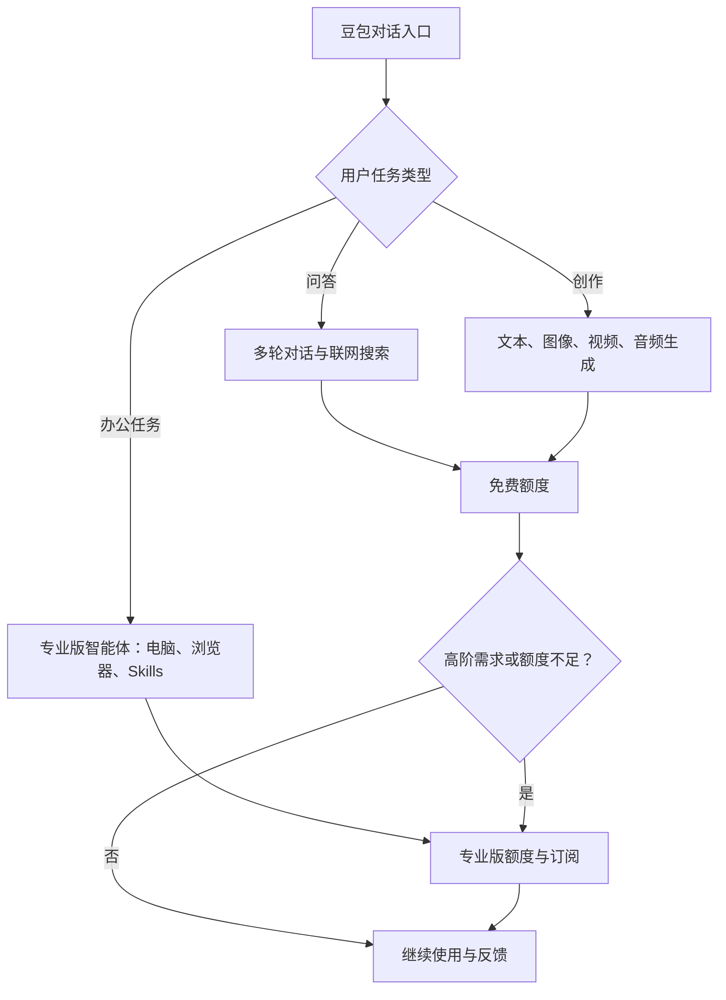

## 豆包产品拆解：免费 + 流量 + 多模态全家桶的国内样本

豆包是国内 C 端 AI 应用规模最大的样本：2026 年第一季度月活 3.45 亿、日活超 1.4 亿、累计用户超 8 亿，国内首个日活过亿的独立 AI 应用（QuestMobile）。它把「免费 + 流量 + 算力降本」打法推到极致，2026-06 又从纯免费转向「免费 + 订阅」分层，是观察国内 AI 产品免费到付费转型的坐标。拆解沿定位、能力、交互、商业、竞争、归因、启示逐层展开，价格与易变数字以官方页面为准，访问日期 2026-08-27。

### 产品定位与目标用户

**面向大众的免费 AI 智能助手**：字节跳动旗下，覆盖对话问答、内容创作、办公助手等通用场景，不做垂直人群（已核实：doubao.com）。与 ChatGPT/Claude 的差异化三条：

- **免费**：C 端对话与生产力功能持续免费，先获客再谈变现
- **抖音生态流量**：抖音/手机号登录，继承字节分发与账号体系
- **字节算力降本**：自研模型 + 大规模算力摊薄单位成本，支撑免费供给

目标用户与规模：

- 面向所有人，无垂直人群设定
- 月活 3.45 亿（2026-03）→ 3.82 亿（2026-06）；日活超 1.4 亿；累计用户超 8 亿
- 国内首个日活过亿的独立 AI 应用；月人均使用 54.8 次（QuestMobile）

定位决策的取舍：先做通用对话而非垂直工具，用零门槛交互验证模型能力，再向场景与智能体收拢；通用对话是覆盖所有任务的交互入口，与字节流量分发天然匹配（本文推断）。

### 能力与迭代

#### 模型能力主线

- 底层模型：豆包大模型 2.x 系列；2.1 Pro 于 2026-06-23 火山引擎 FORCE 大会发布，带 VLM 多模态理解（媒体多源）
- 全模态生成：Seedance 2.5（视频）、Seedream 5.0 Pro（图像）、Seed-Audio 1.0（音频）
- 2026-06 豆包大模型日均 Token 调用 180 万亿

#### 产品功能演进

- 2023-08-18 对外测试，前身代号 Grace
- 智能体：专业版办公任务模式可操作本地电脑/浏览器、调用 Skills、定时任务、兼容 Claude Code 等框架
- 联网搜索：全网检索，免费功能
- 多端：独立 App（Android/iOS）、网页、桌面端，抖音/手机号登录

能力主线读出的决策规律：每轮迭代在扩「任务边界」，从对话扩到内容创作（视频/图像/音频）、办公任务（智能体）、开发者生态（兼容 Claude Code）；多模态全家桶让对话助手覆盖更多「开口就要」的场景（本文推断）。

### 交互与体验设计

对话式交互为主入口，叠加多模态创作与智能体任务三类场景：

这条路径展示豆包的产品取舍：用免费入口覆盖大众和多模态场景，再把高额度与办公 Agent 作为付费价值锚。

- **对话问答**：多轮上下文、可追问，零门槛
- **多模态创作**：文字、图像、视频、音频生成，创作结果即产品输出
- **智能体任务**：专业版办公任务模式，AI 操作本地电脑/浏览器完成多步任务

额度分层与体验：免费版持续提供、额度较低；付费档额度递增。额度即体验边界，免费用户深度使用会触碰额度上限。

信任建立与内容安全：

- 多模态内容（图像/视频）走内容安全过滤
- 国内生成式 AI 备案与内容安全是前置约束
- 免费服务的信任来自结果可验证与字节品牌背书（本文观察）

### 商业模式

免费为主 + 订阅分层：2026-06-24 专业版上线，媒体称「AI 免费时代转折点」。免费版持续提供，基础对话与创作保持可用，额度较低。

订阅定价（媒体多源报道，官方页面 JS 渲染，以官方页面为准）：

| 档位 | 价格 | 额度 |
| --- | --- | --- |
| 免费 | 0 | 持续提供，额度较低 |
| 标准 | 68 元/月（688/年） | 基准 |
| 加强 | 200 元/月（2048/年） | 标准版 5 倍 |
| 高级 | 500 元/月（5088/年） | 标准版 10 倍 |

媒体口径另含 4 倍额度档，以官方页面为准。另有大学生特惠。

收入来源与成本结构：

- 收入：订阅为主，配套抖音生态流量分发（本文观察）
- 成本：推理算力是最大成本项，额度即成本上限
- 算力优势：自研模型 + 大规模算力，API 价格较 Claude Opus 4.6 降近 80%
- 日均 Token 调用 180 万亿，规模摊薄推理成本

免费到付费转型的取舍：免费心智是获客引擎，也是付费转化阻力；只对专业场景（办公任务、更高额度）收费，基础功能保持免费，把付费点放在高频刚需的高阶场景（本文推断）。

### 竞争格局

国内断层第一：2026-03 月活豆包 3.45 亿，高于千问 1.66 亿、DeepSeek 1.27 亿，后两者之和仍不及豆包（QuestMobile）。

| 产品 | 月活（2026-03） |
| --- | --- |
| 豆包 | 3.45 亿 |
| 千问 | 1.66 亿 |
| DeepSeek | 1.27 亿 |

打法与差异化：

- 豆包：免费 + 流量（抖音生态、春晚营销），自称推广费最少的日活过亿产品（媒体口径，推测）
- 与 ChatGPT 的全球化差异：ChatGPT 面向全球、付费订阅为主（周活 9 亿、订阅超 5000 万）；豆包面向国内、免费为主
- 路线分野：前者靠全球订阅收入养模型，后者靠免费规模换心智、再向高阶场景收费（本文推断）

### 成败归因

做对了什么：

- **免费大规模获客**：纯免费起家，月活 3.45 亿、日活超 1.4 亿，免费心智换来国内最大 C 端 AI 用户池
- **字节算力与低成本**：自研模型 + 大规模算力摊薄单位成本，API 价格较 Claude Opus 4.6 降近 80%，免费供给在算力上成立
- **多模态全家桶**：视频/图像/音频/文本全模态生成一体供给，一个 App 覆盖创作场景
- **流量打法**：抖音生态与春晚营销，获客成本低

风险与隐患：

- **算力成本与免费可持续性**：3.45 亿月活扛不住纯免费算力账单，2026-06 转向收费（澎湃新闻）
- **付费转型冲击「免费心智」**：免费是获客引擎，收费后口碑与增长节奏受冲击（本文推断）
- **生态留存偏弱**：月人均使用 54.8 次，低于行业均值 87.1；规模大而深度不足，影响付费转化与生态沉淀（QuestMobile，推测）

如果重来（本文推断）：免费获客仍是正确选择，但会同步设计免费额度上限与付费价值锚，把「免费到付费」预期在早期放进产品，而非大规模沉淀后再补课。

### 对 AI 产品经理的启示

1. **免费漏斗要算清算力账单**：免费获客的边际成本不是零，推理成本随规模放大；先算单位用户算力成本与免费额度的关系，再定免费到付费的分层点。豆包 3.45 亿月活仍转向付费，说明纯免费在推理成本面前不可持续。

2. **流量打法与产品力两条腿**：流量解决获客，人均使用次数低于行业均值暴露产品深度不足。获客解决「来不来」，产品力解决「用不用、留不留」；只有流量没有深度，付费转化无从谈起。

3. **多模态全家桶依赖产品组织**：视频/图像/音频/文本全模态供给，需要模型、产品、内容的统一调度；多模态不是并列堆功能，而是围绕「用户开口就要」的场景组织能力（本文推断）。

4. **国内 C 端 AI 付费转型看时机**：豆包选择在高频刚需的专业场景（办公任务、更高额度）收费，基础功能保持免费。转型时机 = 用户心智成熟度 + 价值锚清晰度；在免费心智最深的国民级产品上试水订阅，是整个行业的付费意愿试验（本文观察）。

### 来源说明

> 本文主题综合参考以下来源，内容由本站撰写整理；价格、版本、日期类事实以官方页面为准，引用日期 2026-08-27。

- [豆包官网](https://www.doubao.com) — 产品定位与多端入口，浏览器实测可达
- [QuestMobile：AI 应用 2026 Q1 报告](https://www.questmobile.cn/research/report/2046482337382842370) — 月活/日活/人均使用次数
- [C114：豆包用户规模报道](https://www.c114.net.cn/ainews/77496.html) — 日活过亿与里程碑，实测可达
- [澎湃新闻：豆包回应收费争议](https://m.thepaper.cn/newsDetail_forward_33312176) — 免费到付费转型与算力成本，实测可达
- 专业版定价分层与额度倍数据南都、界面、澎湃、凤凰等媒体多源报道，以官方页面为准（2026-08-27）
- 模型版本与多模态能力（豆包 2.1 Pro、Seedance 2.5、Seedream 5.0 Pro、Seed-Audio 1.0）据媒体多源，以官方为准
