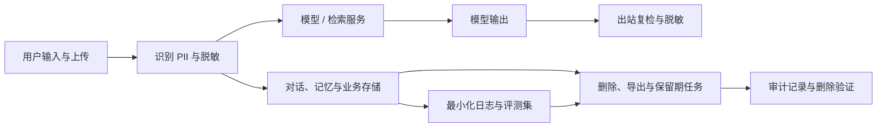

---
---
description: AI 产品隐私机制落地：数据地图、脱敏、保留期、用户删除权控制与事件响应。
---

## 数据隐私与用户控制

AI 产品与普通 SaaS 在隐私问题上的本质差异是：**用户的对话与上传内容本身就是产品的原料**：它既是服务输入，又是记忆与训练的可能来源。因此隐私在 AI 产品里既是法务问题，也是**体验与信任问题**：用户不确定你拿他的对话做了什么，就不敢把真正的业务问题交给你。

本文从产品机制角度回答五个问题：数据在哪、怎么脱敏、留多久、用户能控制什么、出事了怎么办。法规层面的红线见 [出海与合规](compliance.md)；本文只谈能落到产品与工程上的机制。法规条款引用沿用 [出海与合规](compliance.md) 已核验口径，具体以官方文本为准。

### 数据地图（先摸清数据在哪）

这条数据流把隐私控制放在每个落点：输入先脱敏，输出再复检，日志最小化，删除覆盖业务存储、评测集与副本。

「不知道数据在哪，就无法承诺隐私」。数据地图（data map）是隐私工作的起点：任何「我们会删除你的数据」的承诺，都需要一份能对上号的数据清单支撑。

#### 数据流盘点

AI 产品至少存在五类数据流，逐一盘查：

| 数据流 | 典型内容 | 用途 | 默认保留期 | 隐私风险点 |
| --- | --- | --- | --- | --- |
| 输入 | 对话文本、上传文件、语音 | 提供回答、RAG 检索 | 对话可见期内 + 缓冲期 | 用户以为「一次性的」，实际被持久化 |
| 上下文 | 长期记忆、个性化配置、会话历史 | 多轮一致性与个性化 | 随用户删除权联动 | 用户不知道「它记住了我」 |
| 日志 | 推理日志、错误追踪、行为埋点 | 评测、错误分析、产品改进 | 30–90 天 | 含明文对话，比对话数据更难删除 |
| 训练与微调 | 用户反馈、人工标注、精选对话 | 模型改进（opt-in） | 随同意状态 | 进入模型参数后无法「删除」 |
| 第三方 | 模型供应商、检索索引、向量库 | 推理、检索、embedding | 依供应商条款 | 数据出境与二次使用 |

上表是模板：保留期等示例值按产品实际情况替换，行与列按产品扩展（如增加「埋点行为数据」）。

#### 数据地图模板

每行一个数据项（对话正文、记忆条目、语音文件、评测集、审计日志……），字段如下：

| 数据项 | 来源 | 用途 | 类别（PII/敏感/普通） | 存储位置 | 保留期 | 可删除 | 负责人 |
| --- | --- | --- | --- | --- | --- | --- | --- |

盘点方法：找工程要一份**线上实际落库**的清单，而不是文档里的设计稿：以线上为准。常见漏网之鱼：

-   向量库里的 embedding（不可逆但可关联回用户）
-   日志与备份里的数据副本（删了主库，副本还在）
-   第三方子处理者的副本（数据地图要覆盖到供应商链条）

数据地图的输入是线上存储清单与代码改动记录，产出是一张可审计的表加两个机制：发布评审入口与季度对账。失效条件：地图更新滞后于线上（新存储上线没人加行）、负责人缺位。地图一旦失真，后面的删除承诺、出境清单、保留期全部建立在沙地上。

产品动作：

-   建表并纳入发布评审：新功能要新增数据存储，先过数据地图评审——新增字段/存储 = 新增地图行，缺失的行不允许上线
-   每季度与工程对账一次：删掉的地图行，对应代码是否真的下线；新增的存储是否都补了行

验收方式：抽查任意线上存储（数据库表、对象存储、日志系统、向量库），都能在地图里找到对应行；地图与线上清单的差异为 0。数据地图本身也要有负责人，无人维护的地图两周就失真。

???+ note "提示"
    数据地图不是一次性的合规文档，它是产品决策工具：决定「这个功能能不能做」时，先看它要新增哪几行数据、留多久、用户能不能删。

    答不上来，功能就先不做。

### PII 识别与脱敏

脱敏的目标是**让数据在每一站都不携带可识别个人的信息**。PII（个人可识别信息）包括姓名、证件号、手机号、地址、账号、邮箱、生物特征等。

#### 输入侧脱敏

用户输入（对话、上传文件、语音转写）在进入模型与存储前先过一层脱敏：

-   **规则识别**：正则/字典匹配证件号、手机号、邮箱等固定格式字段，替换为占位符（`张三` → `[用户A]`，`138****1234`）
-   **模型识别**：对无固定格式的实体（姓名、公司、地址）用 NER 或 LLM 抽取后替换
-   **映射一致性**：同一实体的多次出现映射到同一占位符：占位符不一致会让多轮对话上下文断裂，回答质量下降

失效条件：脱敏规则跟不上新变体（新证件格式、昵称式写法）；非结构化文本（手写扫描件、语音口述）是规则脱敏的盲区，需要模型识别兜底。

#### 输出侧复检

模型输出同样可能携带 PII：用户上传过简历，模型在后续对话里「想起来」并复述出来；或从检索文档中直接引用。输出链路要做第二次过滤，检测到证件号/手机号等模式时脱敏或提示用户。**输入脱敏不能省输出复检**：PII 可能藏在上下文与知识库里，不是只在用户输入那一刻出现。

#### 脱敏对模型效果的影响权衡

-   脱敏粒度越粗，模型可用的上下文越少：把「地址」整体替换会让「帮我按地址规划通勤」这类任务失效，保留市/区级粒度通常够用
-   一致性比彻底更重要：不一致的占位符会引入幻觉（模型编造占位符之间的关联）
-   判断标准是**任务效果**：脱敏后的数据跑一遍核心评测集，与脱敏前对比，质量下降可接受的粒度才是可用的粒度

#### 日志与评测集脱敏

日志与评测集是 PII 的「第二落点」，且比对话数据更难清理：

-   日志不落明文：结构化记录（session id + 事件），对话正文默认不进日志；确需记录时先脱敏
-   真实错误回填评测集前先洗数据：线上抓取的真实失败案例（见 [数据与标注](../tools/data.md) 的反馈闭环）往往自带真实用户内容，入库前必须过脱敏与授权检查
-   评测集标注与访问权限收紧：评测集是长期资产，PII 一旦进入就难以清除

产品动作：输入脱敏规则与输出复检规则做成可配置清单，随产品迭代维护；脱敏覆盖率纳入发布检查。

常见误用：脱敏只做输入侧、不做出站复检；把脱敏当一次性工程（规则上线后不再维护）；为了「彻底脱敏」把任务效果牺牲到不可用：三者都会让脱敏在线上失效。

验收方式：用含 50+ 种 PII 变体的测试集打回归，漏脱敏率为 0；对脱敏后数据跑核心评测，效果下降超过预设阈值（如 2%）时告警。

### 数据最小化与目的限制

两个原则：**只采必要字段**，**收集即删**。

-   **只采必要字段**：每个采集字段要有明确用途与使用场景；新增字段走评审（用途、保留期、删除方式三件套），说不清用途的字段不允许采集。典型错误：注册就要手机号，实际只有登录用得到
-   **收集即删**：用完即删是默认，留着才是例外：临时文件处理完就删、语音转写后不留音频原文、诊断信息只保留必要栈
-   **目的限制**：采集时声明什么用途就用于什么用途；把「客服日志」顺手改作「模型训练」属于目的变更，需要重新取得同意

#### 与模型供应商的数据处理条款

模型供应商是数据流的必经一站，其数据处理条款是**选型因素**而不是合同细节：

| 条款 | 要什么 | 为什么 |
| --- | --- | --- |
| 不训练（no-train） | 明确承诺用户数据不用于训练其模型 | 否则你的用户对话可能进入对方模型 |
| 不保留（no-retain） | 请求处理完即删除 | 减少第三方副本，简化删除权实现 |
| 数据区域 | 数据存储与处理区域可选 | 配合数据驻留要求（见跨境与本地化） |
| 子处理者披露 | 公开再委托的下游处理者 | 链条上每个环节都要能对上数据地图 |

产品动作：把供应商条款整理成对比表纳入选型评审，「不训练/不保留」与其他功能特性同等权重，不是签约后补看。

验收方式：供应商清单与数据地图的「第三方」行一致；每个供应商都有最新条款归档与不训练承诺存档，每年复核一次。

### 用户控制（产品体验）

用户控制是隐私承诺的产品化：**用户能看见、能导出、能删除**。这是 AI 产品里最值得投入体验设计的隐私功能：它直接决定信任。

#### 隐私中心

一个入口聚合所有隐私操作：

-   **查看**：对话列表、记忆条目、个性化配置、已授权第三方
-   **导出**：一键导出全部对话与记忆（JSON/文本格式），导出内容与用户实际产生的内容一致
-   **删除**：单条删除与全部删除；删除前明确告知影响（「删除后 AI 将不再记得你的偏好」）

#### 记忆可见可改可删

长期记忆是 AI 产品特有的隐私面（对话助手里的记忆机制见 [对话助手](chatbot.md)）。记忆的可见性决定「它记住了我」是安心还是恐惧：

-   **可见**：用户能看到 AI 记住了什么，而不是靠猜
-   **可改**：用户能修正记忆条目（「我不喜欢咖啡」）：改错的权利比删除更常用
-   **可删**：单条可删、一键清空
-   **透明**：记忆被使用时要有感知（如「根据你的偏好」标注），不要偷偷用

设计默认值：新用户默认关闭记忆，首次触发记忆时弹窗解释并让用户选择：「默认记忆」会让用户事后发现「它一直在记我」，信任崩塌。

#### 删除权的时间窗口与实现

删除在工程上分两步：**软删除**（立即从界面消失）与**硬删除**（物理销毁）。

-   **软删除**：用户点击删除后立即从产品界面消失，满足体验即时性；底层标记删除时间，进入回收期
-   **硬删除**：回收期（如 30 天）后物理删除数据及其全部副本（数据库、日志、备份、向量库、第三方副本）
-   **删除请求 SLA**：以 GDPR「无不当延迟、一般一个月内」为基线（具体时限以官方文本为准），面向用户承诺更短的可见 SLA（如 72 小时完成）并公示

验收方式：删除后从所有存储（含备份与第三方）无法恢复：用一个测试账号走完整删除流程，逐存储验证残留为 0；删除 SLA 达标率纳入产品周报。

#### 同意管理

训练数据的使用必须显式同意，且同意可撤回：

-   **默认值**：默认 opt-out（不参与训练）；参与训练是明确动作（单独勾选，不藏在注册流程里）
-   **界面设计**：平实语言说明「你的对话可能被用于改进模型」，配示例，不用法律术语；同意/拒绝按钮同等大小，不搞「拒绝更麻烦」
-   **可撤回**：隐私中心随时可改；撤回后新数据不再进入训练集：**已进入模型参数的数据无法撤回**，这句要在文案里说清
-   **按市场生效**：欧盟市场默认 opt-out 且默认关闭记忆（见跨境与本地化）

#### 用户控制能力验收清单

| 能力 | 验收标准 |
| --- | --- |
| 查看 | 用户在隐私中心能看到自己全部对话与记忆条目 |
| 导出 | 一键导出，导出内容与线上数据一致（抽样比对） |
| 删除 | 单条/全部删除，删除后全链路（含备份、向量库、第三方）残留为 0 |
| 记忆控制 | 记忆可见、可改、可删；使用时有感知标注 |
| 同意管理 | 训练 opt-in/opt-out 可随时切换，管线按状态过滤准确率 100% |
| SLA | 删除请求有公示时限，达标率纳入周报 |

这张清单可以作为隐私功能的季度巡检项：每项都是用户可感知的承诺，不是内部口号。

验收方式：同意记录可查（谁、何时、哪个版本的文案）；撤回流程端到端可用；训练数据管线按同意状态过滤的准确率 100%。

### 保留与归档

#### 保留期策略

每类数据有独立的保留期，而不是统一「永久保留」：

| 数据类别 | 默认保留期 | 说明 |
| --- | --- | --- |
| 对话记录 | 用户可见期内 + 固定缓冲（如 90 天） | 与用户删除权联动 |
| 运行日志 | 30–90 天 | 足够排障，不留永久 |
| 评测集 | 长期 | 需脱敏与授权检查 |
| 审计日志 | 1–3 年 | 合规需要，只保留必要字段 |
| 训练数据 | 随同意状态 | 撤回同意即停止使用 |

#### 自动过期

保留期不能靠「记得删」，要自动化：

-   定时任务扫描过期数据并删除；删除动作本身写审计日志（谁删的、删了什么范围）
-   备份与归档同样有过期策略：**备份里的数据也要按保留期清理**，否则「删除」是假的
-   存储分层（热/温/冷）分别管理，过期策略逐层生效

失效条件：自动过期任务静默失败（权限变更、存储迁移后任务没跟上）：过期任务要有失败告警与月度对账，而不是「跑过一次就行」。

#### 法律保留例外

诉讼、监管调查等场景需要冻结数据（legal hold）：

-   冻结是**例外动作**：由法务发起，明确冻结范围（哪些用户、哪些数据类、多长时间），冻结期间自动过期暂停
-   冻结有解除流程：事项结束后由法务解除，恢复自动过期；冻结清单可审计（谁能看到、谁解除的）
-   冻结与用户删除冲突时：按法律要求响应（以官方文本为准），对用户的沟通要透明

产品动作：保留期配置纳入数据地图同一张表维护；自动过期任务与审计日志上线；法律保留流程做成可触发的内部工具，而不是口头约定。

验收方式：随机抽查 10 条已过期数据，全部已删除；冻结期间过期任务确实跳过该范围；解除冻结后清理恢复正常。

### 安全基础设施

隐私承诺的物理基础：**数据在传输、存储、访问三个环节都受控**。

#### 传输与存储加密

-   **传输**：全链路 TLS——用户端到服务端、服务端到模型供应商
-   **存储**：数据库、对象存储、备份静态加密；密钥独立管理（KMS），与应用代码分离
-   **备份**：加密备份，且恢复流程要演练过：加密的备份如果没人会恢复，等于没有

#### 访问控制与审计日志

-   **最小权限**：按角色授权（客服看工单、工程师看日志、法务看冻结数据）；生产数据默认不可直查，需要时走脱敏视图
-   **默认拒绝**：参考 Claude Code 的权限模式：非白名单即拒绝、以工作目录边界限定可达范围，把「默认拒绝」作为访问控制的默认（[Claude Code 安全文档](https://code.claude.com/docs/en/security)）
-   **审计日志**：谁在什么时间访问了哪些用户数据，append-only 不可篡改；审计日志本身也是数据地图的一行

#### B 端多租户隔离

面向企业客户时，租户隔离是数据隔离的商业承诺：

-   **逻辑隔离**：租户 ID 字段 + 查询强制过滤（成本低，但防「越权查询」类漏洞是长期工程）
-   **物理隔离**：独立实例/独立密钥（成本高，满足金融、医疗等强合规客户）
-   隔离级别要写进销售承诺与合同：答应客户「数据独立存储」却只有逻辑隔离，是事故的起点

#### 漏洞披露与事件响应

-   **漏洞披露**：公开的漏洞报告渠道 + 修复承诺；AI 产品特有的漏洞面见 OWASP LLM Top 10：提示注入、敏感信息泄露、不安全的输出处理等（[OWASP LLM Top 10](https://owasp.org/www-project-top-10-for-large-language-model-applications/)）
-   **事件响应**：数据泄露有 runbook：确认范围 → 止损（下线/吊销密钥）→ 通知义务（GDPR 与 PIPL 均有泄露通知要求，时限以官方文本为准）→ 用户沟通 → 复盘
-   **演练**：每季度一次泄露演练，从「模拟告警」到「通知发布」全流程计时

验收方式：渗透测试与权限审计每年至少一次；泄露演练有报告与改进项闭环；漏洞报告渠道 7×24 可达。

### 跨境与本地化

数据出境是出海产品的硬约束，合规框架见 [出海与合规](compliance.md)。

#### 数据驻留

-   **存储区域选择**：欧盟用户数据存储在欧盟、中国用户数据存储在中国：按用户所在区域路由到对应区域实例
-   区域选择要贯穿全链路：模型调用、检索索引、日志、备份都要落在同一区域，只做「数据库在本地、日志在别处」等于没做
-   产品上如实展示：「你的数据存储于 XX 区域」，作为信任信息而非小字条款

#### 出境合规

-   出境触发条件：将境内收集的个人信息提供给境外主体，模型供应商调用、海外日志系统都算
-   出境路径（以官方文本为准）：安全评估、标准合同、个人信息保护认证——适用哪条由法务判断
-   **工程支撑**：出境清单可枚举：哪些字段流向哪些供应商，与数据地图一致
-   **常见误用**：以为「模型 API 是黑盒，传过去没人知道」：出境合规按数据流向认定，不按服务形态；隐私政策里声明了「境外处理」，不等于走完了合规路径

#### 不同市场的隐私期望差异

-   **欧盟**：默认最小化，隐私设置默认最保守（记忆默认关、训练默认 opt-out）
-   **美国**：按州差异大（如加州 CCPA 的「出售/共享」概念），用户对「数据用于训练」敏感度高
-   **中国**：《个人信息保护法》下的告知-同意、最小必要、删除权；未成年人数据有专门条款
-   落地方式：隐私设置做成「按市场生效」的配置项，而不是一套默认值走全球

产品动作：区域路由规则进发布检查（新存储必须声明区域）；出境清单随数据地图同步维护。

验收方式：用测试账号模拟欧盟/中国/美国用户，检查存储区域、默认隐私设置、出境链路均符合预期。

### 儿童与弱势用户保护

儿童数据在所有主要市场都是特殊类别：采集与处理需要监护人同意，用途受限，删除优先。

-   **年龄门禁**：注册与首次使用时收集年龄；但对话中用户可能透露真实年龄（「我 12 岁」），**对话内检测 + 触发保护模式**比注册门禁更可靠
-   **儿童数据特别保护**：识别为儿童用户后：默认不建长期记忆、数据不用于训练、保留期缩短、监护人可查看与删除
-   **青少年模式的产品化**：内容过滤、使用时长提醒、无个性化推荐、连续对话提醒：这是产品设计决策，不是合规附赠
-   **弱势用户**（认知障碍、高龄用户）：默认保守、界面直白（「删除」按钮用一句话说清后果）、支持家人协助管理

产品动作：儿童识别 → 保护模式切换 → 监护人流程（同意、查看、删除）做成一条完整产品路径，而不是三个孤立功能。

判断边界：年龄门禁挡不住谎报年龄，对话内检测补位但要注意误伤（成年用户开玩笑说自己 12 岁）；保护模式触发后要提供申诉/解除路径，避免「识别错了就永远锁死」。这些边界要在产品文档里写明，作为客服与风控的判定依据。

验收方式：用测试账号模拟儿童使用（注册填年龄、对话透露年龄两种路径），验证保护模式触发、记忆关闭、训练排除；监护人删除流程端到端可用。

### 反模式清单

以下做法每一条都在消耗信任，且几乎都会在事后变成危机：

| 反模式 | 表现 | 为什么错 | 正确做法 |
| --- | --- | --- | --- |
| 隐私政策藏条款 | 训练数据埋在 2 万字条款第 40 条 | 用户以为没有，发现时信任崩塌 | 采集点告知 + 平实语言 + 首次使用弹窗 |
| 默认全收集 | 记忆、训练、分享默认全开 | 事后发现比事前告知更伤信任 | 默认最小化，开启走明确动作 |
| 删除请求走人工邮件 | 发邮件 → 等几天 → 手动处理 | 无 SLA、无记录、成本随规模爆炸 | 产品内自助删除 + 自动化管线 |
| 喂模型不告知 | 用户内容进入训练集但用户不知道 | 目的变更未取得同意，直接踩合规线 | 训练必须 opt-in + 可撤回 |
| 日志存明文对话 | 对话正文进日志，日志永久保留 | 数据地图之外的第二份数据，删不干净 | 结构化日志，正文默认不落 |
| 只删主数据 | 删了数据库，向量库和备份还在 | 删除承诺是假的，用户要求证明就穿帮 | 全链路删除（含向量库、备份、第三方） |

每条反模式的共同点：**把「用户发现不了」当成设计目标**。隐私设计的正确方向是反过来：让用户在任何时候都能轻易发现你存了什么、怎么删掉它。

???+ note "一句话总结"
    数据地图打底、PII 脱敏贯穿、最小化与收集即删、用户全权可控、保留自动过期、安全默认拒绝、跨境按市场合规、儿童单独保护：隐私是 AI 产品的默认设计，不是补丁。

### 来源说明

> 本文为本站原创整理。法规口径沿用 [出海与合规](compliance.md) 已核验口径，标注「以官方文本为准」；不新增未经核验的外部链接。

-   法规（均以官方文本为准）：《个人信息保护法》（最小必要、告知-同意、删除权、出境路径）、《数据安全法》、《生成式人工智能服务管理暂行办法》、GDPR（删除权、泄露通知时限）、欧盟 AI Act、CCPA 等美国各州法案——沿 [出海与合规](compliance.md) 口径
-   [OWASP — LLM Top 10](https://owasp.org/www-project-top-10-for-large-language-model-applications/)：AI 应用特有漏洞面（提示注入、敏感信息泄露、不安全输出处理）
-   [Anthropic / Claude Code — Security](https://code.claude.com/docs/en/security)：权限最小化、「默认拒绝」与边界隔离的参考实现
-   站内相关：[对话助手](chatbot.md)（长期记忆机制）、[数据与标注](../tools/data.md)（评测集与脱敏）、[出海与合规](compliance.md)（法规红线）
