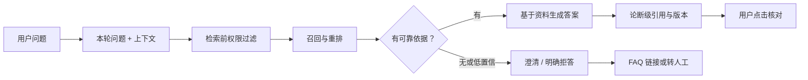

---
---
description: 知识库问答产品设计：场景画像、知识治理、引用可信、权限过滤与评估。
---

## 知识库问答

知识库问答（KB QA）是落地最多的 AI 产品形态之一：让用户用自然语言查询**私有知识**：公司文档、规章制度、产品手册、课程资料等。技术底座以 [RAG](../ai/rag.md) 为主：先检索相关资料，再让模型基于资料回答。本页只讲**产品层**：场景画像、知识治理、可信度、权限、体验与评估；检索、切块、rerank 等技术原理见 [检索技术](../ai/rag-retrieval.md) 与 [高级 RAG](../ai/rag-advanced.md)，从 demo 到生产的工程落地见 [RAG 产品化实战](rag-practice.md)。

知识库问答的本质，是把「查文档」变成「问文档」：用户不关心文档结构、不熟悉术语、不知道答案在哪个文件，只想要一个**有依据、可追溯**的答案。产品设计的主线因此有三条：

1.  **知识能不能被问对**——知识治理决定质量上限
2.  **答案可不可信**——引用、拒答、权限构成信任底座
3.  **问起来顺不顺**——追问、改写、推荐构成体验

它与通用对话助手的差异是结构性的：通用助手答错了用户笑一笑就过去了，知识库问答答错了用户按错流程办事、信了错条款签合同。所以引用、拒答、权限、评估每一项都是硬功能，不是加分项。

| 形态 | 输出 | 信任机制 | 典型产品 |
| --- | --- | --- | --- |
| 通用对话助手 | 开放式回答 | 无（靠模型记忆） | 聊天机器人 |
| 知识库问答 | 有依据的事实回答 | 引用 + 拒答 + 权限 | 企业知识库、智能客服 |
| 文档检索工具 | 相关文档列表 | 排序质量 | 站内搜索 |

## 典型场景

知识库问答有四个高发场景，画像差异很大：**准确度要求**决定拒答与人工兜底的严格程度，**权限复杂度**决定检索层过滤与审计的投入，**更新频率**决定索引流水线的自动化程度。先看画像表，再逐个展开。

| 场景 | 典型用户 | 核心问题类型 | 准确度要求 | 权限复杂度 | 更新频率 | 关键设计差异 |
| --- | --- | --- | --- | --- | --- | --- |
| 企业知识库 | 员工 | 制度、流程、IT 支持 | 高 | 高 | 中 | 权限过滤、审计、引用溯源 |
| 客服知识库 | 客户 | 产品功能、FAQ、售后 | 高 | 低–中 | 高 | 拒答与转人工、话术合规 |
| 教育资料 | 学生 | 概念、练习、复习 | 中 | 低 | 中 | 多轮追问、推荐追问、答案边界 |
| 法律/合同 | 法务、业务 | 条款查询、合规检查 | 极高 | 高 | 低 | 版本回溯、人工审核、免责声明 |

### 场景之间的复用关系

四个场景是同一套底座的四种配置：企业知识库是「内部全量 + 权限过滤」，客服知识库是「对外白名单子集 + 高拒答阈值」，教育资料是「开放子集 + 多轮增强」，法律/合同是「隔离子库 + 人工审核」。底座（知识治理、检索、引用、评测）不变，差异在**权限面、拒答阈值与兜底强度**。立项时先问「复用哪套底座」，而不是「重新做一个」；客服知识库常常就是企业知识库的对外视图加一层白名单（见 [RAG 产品化实战](rag-practice.md) 的客服案例）。

### 从问题到可信答案

核心关系是：权限先于检索，依据先于生成；有证据才回答并引用，无证据就澄清或降级。

### 企业知识库

员工问制度、流程、IT 支持。画像上**权限复杂度最高**：部门、职级、项目组之间的可见范围不同，同一套文档要给不同的人看到不同的子集；准确度要求高，「报销额度」答错会直接导致员工按错误流程办事。产品要点：

-   权限过滤做在检索层（见下文「权限控制」），敏感文档（薪酬、绩效、人事档案）不进公共索引
-   回答必须引用制度原文并可点击核对——员工敢按答案办事的前提是「能查到出处」
-   错答案例回流渠道要短：员工纠错 → 归因（修文档 / 修检索 / 修提示词）→ 修复，见 [评估标准](#评估标准)
-   典型问题示例：「报销流程」「年假怎么算」「IT 支持电话多少」——查询型为主、流程型次之；评估侧重引用正确率与权限泄漏（答错代价高、权限面大）

### 客服知识库

基于产品文档与 FAQ 的智能客服，直接对外，**准确度要求高且更新频率高**——产品每次发版，FAQ 与话术都要跟着变。答错伤品牌、引发客诉，所以「答不上来」比「答错」更安全。产品要点：

-   拒答阈值要保守：没有把握就转人工或给 FAQ 链接，不要硬编（见下文「回答可信度」）
-   无答案率、转人工率是核心指标，而不是「解决率」——先保证不犯错，再追求解决
-   回答要符合话术合规要求（退款政策、承诺性表述），必要时接入人工审核
-   自动化比例是运营决策：自动解决率目标从低到高逐步放开（v1 只答高频 → v3 自动解决），每一步以「转人工率与投诉率双达标」为前提（路径见 [RAG 产品化实战](rag-practice.md) 客服案例与 [AI 产品开发生命周期](../pm/ai-lifecycle.md)）
-   从种子知识库起步的完整路径见 [RAG 产品化实战](rag-practice.md) 的客服案例
-   典型问题示例：「怎么退款」「这个功能支持哪些套餐」——高频低复杂度为主；评估侧重无答案率与拒答正确率（对外答错的代价最高）

### 教育资料

课程内容问答、复习助手。画像上**准确度要求中、权限低**：同一份讲义可以开放给全班，错题可以允许解释性差异。产品要点：

-   多轮追问是主交互：学生从概念问起、逐层深入（「什么是 RAG」→「那它的检索是怎么做的」），多轮检索的上下文管理是体验核心，机制见 [高级 RAG](../ai/rag-advanced.md) 的「多轮对话中的检索」
-   推荐追问有价值：每答完一题推荐 2–3 个相关问题，把「被动答题」变成「引导学习」
-   区分「事实型回答」与「讲解型回答」：事实（定义、公式）要求严格引用资料；讲解（举例、类比）允许模型基于资料展开，但要标注是补充
-   典型问题示例：「什么是梯度下降」「这道题为什么选 C」——概念与练习混存；评估侧重覆盖率与多轮追问表现（学生的问题分布最散）

### 法律/合同

条款查询、合规检查。画像上**准确度要求极高、权限高、更新低但影响大**：一份合同的改版可能影响所有引用它的回答，且合同本身是保密资产。产品要点：

-   版本回溯是硬需求：回答必须能追溯到「哪一份合同的哪个版本」，来源带版本号与更新时间
-   高风险结论（是否合规、是否违约）需要人工审核兜底，或提高拒答阈值——护栏严格程度与场景风险匹配
-   免责声明与使用边界：明确告知「本回答不构成法律意见」，防止把 AI 回答当正式结论
-   典型问题示例：「这个条款的违约金怎么算」「我们和 A 公司的合同是否合规」——多跳与比较问题多；评估侧重版本回溯准确性与高风险结论的拒答正确率

## 产品设计要点

四个要点环环相扣：**知识管理**决定质量上限，**权限控制**是安全底线，**回答可信度**决定信任，**问答体验**决定可用性。预算紧张时先砍体验类投入，权限控制与知识治理不能砍。

### 知识管理前置

**文档质量决定问答质量**。知识治理发生在检索之前，这一步不做，后面所有检索优化都是给烂数据打补丁。治理四件事：

| 治理项 | 做什么 | 不做会怎样 |
| --- | --- | --- |
| 去重 | 同一主题的多份版本/转载合并，标注唯一来源 | 同一问题多份结论互相打架，模型随机挑一个 |
| 结构化 | 表格、条款、流程用对应解析器提取，标题层级保留 | 表格被切散、条文与正文分离，检索命中率崩 |
| 版本化 | 文档带版本号与更新时间，知识条目记录「来源版本 + 更新时间」 | 改版后答案停留在旧版，无法回溯 |
| 来源可信度分级 | 官方文档 > 部门规范 > 员工上传，冲突时按权威级加权 | 权威来源被长尾文档淹没，答出「错误但有人这么写」的结论 |

#### 「哪些知识可被问、哪些必须保密」的边界清单

立项时就和业务方一起划出边界，逐条确认，写进权限配置：

| 知识类别 | 示例 | 处理方式 |
| --- | --- | --- |
| 可公开问 | 制度、流程、FAQ、产品文档 | 进索引，全员可见 |
| 分权限问 | 部门制度、项目资料、内部数据 | 进索引，按权限标签在检索层过滤 |
| 必须保密 | 薪酬绩效、个人信息、未公开战略、法务内部意见 | 不进索引；确需入库的单独隔离库 + 更强审计 |
| 不能答 | 医疗诊断、法律意见、投资建议（涉监管） | 拒答并引导人工渠道，见 [出海与合规](compliance.md) |

???+ warning "边界不是一次划完的"
    新文档上线要过同一道分类检查，不能默认「能问」。

    补丁式做法是发现泄密再补救，正确做法是把分类做成入库流程的一步。

判断一份新文档能不能入库，按顺序问四步：

1.  内容是否有效（谁批准的、是否过期）？不是 → 不入库
2.  是否涉密（薪酬、个人信息、未公开信息）？是 → 不入库，或进隔离库
3.  是否受监管（医疗诊断、法律意见、投资建议）？是 → 标注高风险，走拒答 + 人工兜底
4.  是否对外可见（客服 / 客户场景）？是 → 走对外白名单视图，只答可公开内容

#### 知识入库 SOP：一条可执行的检查清单

| 步骤 | 检查项 | 不合格的后果 |
| --- | --- | --- |
| 1. 格式解析 | PDF 是文本型还是扫描型（需 OCR）；表格是否完整；页眉页脚剥离 | 表格拆散、扫描件检索不到 |
| 2. 结构化提取 | 标题层级、条款编号、流程步骤保留；代码/表格用对应解析器 | 命中「第 34 条」却看不到条文内容 |
| 3. 元数据补齐 | 文档类型、部门、版本号、更新时间、权限标签、来源可信度 | 权限/时间/来源过滤全部失效 |
| 4. 质量门槛 | 至少一名业务方确认内容有效、非过期版本 | 过期制度入库，答出「旧版真相」 |
| 5. 切块与嵌入 | 切法与 embedding 模型匹配，抽样检查块质量 | 明明有答案却检索不到 |

入库 SOP 的目的：把「文档能不能进知识库」从拍脑袋变成可检查的流程。权限分类是其中一步，不是事后补丁；生产化的切块与索引细节见 [RAG 产品化实战](rag-practice.md) 的「索引运营」。

???+ note "知识治理的投入节奏"
    治理不是上线前的一次性大工程：先用 20–100 条高频文档起步，随错案回流逐步扩充与清洗。

    治理的优先级由「错误代价」决定（答错会害人的知识先治理），不是按文档数量排。

#### 文档变更 → 索引更新的流水线

「文档改了、索引没跟上」是知识库问答最常见的事故源。产品化要做成流水线而不是靠人肉刷新：

| 环节 | 做什么 | 常见失败 |
| --- | --- | --- |
| 变更检测 | 文档系统 webhook / 定时扫描（文件 mtime + 内容哈希） | 只扫了目录没扫子目录，漏掉新文档 |
| 增量索引 | 按文档 id + 内容哈希只重刷变化的文档（机制见 [RAG 产品化实战](rag-practice.md) 的「索引运营」） | 全量重跑，量大后成本与延迟失控 |
| 失效处理 | 下架文档同步删除对应块并记录原因 | 文档下架了答案还在，用户按旧流程办事 |
| 同步监控 | 暴露「最后同步时间」，超 SLA 报警 | 静默失败——没人知道索引三天没刷 |

### 回答可信度

信任是知识库问答产品的生命线：用户敢不敢按答案办事，取决于答案能不能被验证。

#### 引用来源

-   **必须引用来源**，用户要能点开原文核对——这是知识库问答与通用聊天的根本区别
-   引用粒度：论断级引用（每个关键论断对应来源）优于段落级引用；来源要能直达原文位置，依赖索引时记录「块 → 源文档页码/段落」的映射
-   实现上可用 [Anthropic 官方 Citations](https://platform.claude.com/docs/en/build-with-claude/citations) 的原生引用能力：API 直接返回支撑每条论断的原文段落，产品在界面上展示可点击来源
-   引用的正确性要单独评估——「答案对但来源张冠李戴」是独立的缺陷类别，见 [评估标准](#评估标准)

#### 区分「资料有依据」与「模型推断补充」

模型会在资料基础上做推断、补常识，这两类内容混在一起最危险。产品要求：

-   资料里有的结论，标注来源编号
-   模型推断补充的内容（「根据第 5 条推断，你可能还需要……」「一般做法是……」），单独标注为补充说明，不给它挂来源
-   高风险场景宁可少补：拿不准是不是资料里的内容，就只答资料里的

#### 无答案时明确「没有相关资料」

-   资料里没有就明确说「没有相关资料」，不要硬编。**拒答是可信度的一部分**；[PromptingGuide 的 RAG 综述](https://www.promptingguide.ai/research/rag)把「负面拒答」（无依据时拒答）列为 RAG 鲁棒性评测的维度
-   拒答策略分层：直接拒答（资料确实没有）→ 低置信引导（「你问的是不是 XX？我可以查 XX 相关资料」）→ 降级渠道（给 FAQ 链接、转人工）
-   拒答阈值是产品决策：客服场景阈值保守（宁转人工），内部工具可以阈值放宽（答错代价低、纠错渠道近）

#### 置信度与拒答策略

-   置信度从哪里来：检索相关性分数、rerank 分数、faithfulness 检查——单一来源都不可靠，产品上常用「低置信信号」组合：检索命中数过少、rerank 分低于阈值、论断无法被来源支持
-   要不要展示置信度：内部工具可以展示「基于 N 份资料，置信度中等」；面向客户的产品一般只做「低置信时降级」（转人工/给 FAQ），不做数字展示——用户看不懂「0.72」，只看得到「你确定吗」
-   拒答策略分层（承接上文）：直接拒答 → 引导澄清 → 降级渠道；拒答话术要给出下一步（「你可以问 XX，或联系人工客服」），不能只说「不知道」
-   拒答不是终点，是数据：每次拒答都记录原因（无资料 / 低置信 / 命中冲突文档），按主题归类——拒答日志是知识覆盖缺口的第一手数据源（见 [评估标准](#评估标准)）

### 权限控制

**权限过滤必须作用在检索层，不只做显示层**。这是知识库问答的安全底线。

#### 检索前过滤 vs 检索后过滤

| 方案 | 做法 | 安全含义 |
| --- | --- | --- |
| 检索前过滤（正确） | 权限标签随元数据入库，查询时先按用户权限过滤候选集 | 高权限内容根本不会进入检索结果——不会进模型上下文、不会进日志、不会进引用 |
| 检索后过滤（危险） | 先全量检索，再在 UI 层隐藏高权限结果 | 高权限内容已进入检索结果与上下文：换接口/换出口就能看到；模型可能引用它；日志可能落它 |

「答案脱敏、检索不过滤」等于没做权限。检索后过滤在 demo 里「看起来没问题」，因为界面层把结果藏住了。但权限必须假设**接口会被人直接调用**。这与 [OWASP LLM Top 10](https://owasp.org/www-project-top-10-for-large-language-model-applications/) 对 LLM 应用数据泄露风险的定位一致：高权限内容一旦进入上下文，输出侧再拦已经晚了。

#### 多租户隔离、最小权限、审计

-   **多租户隔离**：租户间数据严格隔离时，物理隔离（独立索引/独立库）比逻辑隔离（同一库 + 权限标签）更稳；逻辑隔离省成本，但必须保证每一路检索都带租户过滤——包括多路召回里的每一路，见 [高级 RAG](../ai/rag-advanced.md) 的权限放大案例
-   **最小权限**：权限按「完成工作所需的最小集合」发放；API key、服务账号同理，不共享、不超发
-   **审计**：医疗、法律、金融等合规场景留存审计记录——谁在什么时间问了什么、检索命中了哪些文档、引用来源是什么；审计日志不落问答全文，降低敏感数据扩散面
-   **引用与来源也要过滤**：不能「答案脱敏、来源泄密」——引用的原文可能属于不同权限级别，展示来源时同样要过权限

#### 权限模型怎么设计：先想清楚谁看什么

-   **最小起步按文档级授权**（同一文档同权限），绝大多数内部场景够用；需要「同一文档不同人看到不同段落」时才做块级权限——块级权限维护成本高，先确认真有场景
-   **权限来源与现有身份体系打通**（SSO、OA、工号体系），不要另建一套用户表——权限跟着组织架构走，离职/转岗自动失效
-   **变更可追溯**：权限变更留痕（谁在何时改了什么）；上线前用「最小权限账号 × 全部文档」全量扫描一遍，确认检索不到越权内容

???+ tip "上线前权限自检清单"
    ① 最小权限账号直接调 API，检索不到越权内容；② 换一个出口（移动端 / 内部工具）再测一遍；③ 日志里确认没有高权限内容落盘；④ 权限变更留痕可查。

### 问答体验

知识库问答的体验目标：**让用户用最少的提问成本拿到可信答案**。

#### 追问与澄清（多轮检索）

-   追问是知识库问答的常态交互：「报销流程是什么」→「那差旅费呢？」——检索必须带上文，只拿本轮问题去搜必然失焦
-   产品要求：把「本轮问题 + 上文摘要 + 上轮命中的文档」一起作为检索输入，并限制轮次内话题漂移（机制见 [高级 RAG](../ai/rag-advanced.md) 的「多轮对话中的检索」）
-   澄清式反问：用户问题含糊（「那个表填错了怎么办」）时，先反问确认对象，比直接猜着答更稳；低置信时引导澄清是拒答策略的一部分
-   话题切换要能被系统识别：用户从报销跳到年假，检索应重置到新话题，而不是继续沿用旧上下文

#### 提问改写与同义改写

用户的问题往往简短、含混、带口语，直接拿去检索经常搜不中。产品化的做法是把「查询处理」做成检索前的一步：展开缩写（「报销」→「费用报销流程与标准」）、纠错、补全意图。实现方式与取舍见 [高级 RAG](../ai/rag-advanced.md) 的「查询处理」。产品决策点：

-   改写用规则还是用 LLM：规则零延迟但要维护术语表；LLM 改写多一次调用，适合口语化问题占比高的场景
-   改写效果要进评测集：改偏方向是常见失败，不能「改了就是好的」

#### 推荐追问与答案边界展示

-   **推荐追问**：回答末尾给 2–3 个相关问题，引导用户问得更准、问得更深——同时也是知识缺口的探测手段：用户点不点推荐、推荐之外还问什么，都是知识覆盖不足的信号
-   **答案边界展示**：告诉用户「这个回答覆盖了哪些范围、基于哪些资料」——比如「本回答基于《差旅费用管理规定 v3》第 2 章」；用户知道边界，就不会拿「问不到」当「没有」
-   **FAQ 型问题直接给步骤**：用户问「报销流程」时直接给分步步骤 + 来源，比展开聊天式对话高效——知识库问答是任务导向，不是闲聊（见 [常见坑](#常见坑)）

#### 答案呈现

-   长度与结构：事实问答给「结论先行 + 分点 + 来源」；流程问答直接给步骤清单；默认限长（如 300 字内），避免模型凑字数
-   流式输出与首 token 延迟：流式改善体感，但引用编号要与流式配合好（编号不能中途变）；延迟预算见 [RAG 产品化实战](rag-practice.md) 的「成本与性能」
-   来源展示位置：关键论断处编号 + 文末来源列表 + 点击直达原文；来源列表要显示文档名、版本、章节，而不是只有链接
-   多轮中的呈现：追问的回答要带「本轮依据」，跨轮引用保持编号连续（见 [高级 RAG](../ai/rag-advanced.md) 的「引用在多轮中的连续性」）
-   **用户引导**：在入口放「怎么问得好」的示例句式（「问『报销流程』，别问『钱怎么报』」）；回答旁展示「依据来源」增强信任感。不要指望用户自动学会与 AI 沟通

## 评估标准

评估体系分两层：**离线评测集**管「改得好不好」，**线上指标**管「真实用户体感」。方法论见 [评估与评测](../ai/evaluation.md)，RAG 专属指标（hit rate、MRR、faithfulness 等）见 [高级 RAG](../ai/rag-advanced.md) 的「RAG 评测体系」；与通用 AI 产品评估相比，知识库问答多了**引用正确率**与**拒答正确率**两个专属维度。

### 离线评测：答案质量 + 引用 + 覆盖率 + 拒答

| 指标 | 衡量什么 | 怎么测 |
| --- | --- | --- |
| 答案相关性 | 是否答所问 | 人工判分或 LLM-as-judge 打分 |
| 答案忠实度 | 回答是否忠于检索资料（有没有编） | 逐条核对回答论断能否由引用来源支持 |
| 答案完整性 | 是否漏掉关键点 | 对照标注的要点清单查漏 |
| 引用正确率 | 引用的来源是否真的支撑论断 | 逐条核对「论断 → 来源」，单独统计「答案对但引用错」 |
| 覆盖率 | 用户想知道的知识有多少能问到 | 真实问题里「检索无命中」的比例 + 用户反馈「问不到」的归类 |
| 拒答正确率 | 该拒的拒、不该拒的不拒 | 评测集里应拒答样本的拒答率 + 应回答样本的误拒率 |

-   **覆盖率是产品级指标**：检索命中率再高，知识库里没有用户想要的内容，产品也是失败的——无命中问题要按主题归类，反哺知识运营（补文档、补 FAQ）
-   **拒答要双向看**：该拒不拒是幻觉风险，不该拒乱拒是把用户推走——两个方向的错误分开统计
-   **评测集覆盖五类问题**：常见、长尾、应拒答、跨文档、多轮追问；30–50 条起步，错案持续回流（构建方法见 [RAG 基础](../ai/rag.md) 的「评测集构建」）

知识库问答的评估按环节拆三条线（与 [高级 RAG](../ai/rag-advanced.md) 的「RAG 评测体系」一致）：

| 评估线 | 指标 | 回答什么问题 |
| --- | --- | --- |
| 检索线 | hit rate、MRR、context recall / precision | 该检的检到了吗、排得靠前吗 |
| 回答线 | faithfulness、answer relevancy、完整性 | 答得忠实吗、答所问吗、漏点了吗 |
| 引用线 | 引用正确率 | 来源真的支持论断吗 |

三条线的依赖关系：检索线决定「有没有料」，回答线决定「答得好不好」，引用线决定「敢不敢信」。修复时按「检索 → 生成 → 引用」的顺序排查（排查方法见 [RAG 基础](../ai/rag.md)）。

### 指标怎么用：基线、回归红线与选型

-   **先出基线**：当前版本在评测集上跑一遍，记录各指标分数作为基线。没有基线，「改好了还是改坏了」无从谈起
-   **设回归红线**：每次改动（换模型、改提示词、调检索）后重跑评测集，关键指标（如忠实度、引用正确率）下降超过阈值（如 -0.05）就拦截
-   **按形态选指标**：客服知识库主看忠实度与拒答正确率（对外答错代价高）；企业知识库还要盯引用正确率（员工要按答案办事）；教育资料看覆盖率与多轮追问表现——没有一套指标适合所有形态
-   **LLM-as-judge 要校准**：自动打分可规模化，但判断器可能偏爱冗长或自带立场——用一小批人工标注样本校准（一致性达到阈值如 80%），并定期人工抽检（方法见 [评估与评测](../ai/evaluation.md)）
-   **评测集版本管理**：记录「评测集版本 + 模型版本 + 提示词版本 + 采样日期」四元组，分数之间才可比；评测集与生产链路隔离，防止污染

### 线上指标：采纳率、无答案率、用户纠错率

| 指标 | 定义 | 说明 |
| --- | --- | --- |
| 采纳率 | 用户接受/复制答案的比例 | 间接衡量「答得有用」；配合点踩数据看 |
| 无答案率 | 回答「没有相关资料」或转人工的比例 | 过高说明知识覆盖不足或检索太差；过低可能说明在硬答 |
| 用户纠错率 | 用户明确纠正/点踩/投诉的比例 | 幻觉与引用错误的代理指标 |
| 引用被质疑率 | 用户点开来源后仍不满意的比例 | 引用错配的直接信号 |

线上指标噪声大、归因难，必须与离线评测集互为补充：线上发现异常 → 抽样错案 → 归因（修文档 / 修检索 / 修提示词）→ 修复 → 补进评测集防回归。这条闭环与 [AI 产品开发生命周期](../pm/ai-lifecycle.md) 的 CC/CD 循环一致。

### 评估节奏：什么时候跑什么

| 时机 | 动作 | 目的 |
| --- | --- | --- |
| 每次改动（模型 / 提示词 / 检索） | 重跑评测集，对比基线 | 防回归 |
| 每周 | 人工抽检 20–50 条真实对话评分 | 校准 LLM-as-judge、发现评测集外的新失败 |
| 每月 | 错案归类 + 评测集扩充 + 知识缺口清单 | 让评测集跟着真实分布走 |
| 上线前 | 低权限账号安全扫描、拒答阈值走查 | 权限与护栏验证 |

## 常见坑

-   **知识库不更新**：文档改了索引没跟上，答案停留在旧版。这是最隐蔽的坑，因为「答得挺像回事」。检测：索引最后同步时间、用户反馈「答案过时」；兜底：更新流水线 + 同步延迟 SLA 监控（见上文「文档变更 → 索引更新的流水线」）
-   **权限只做显示层**：检索层不过滤，换接口就泄密——demo 里看不出来，上线前必须用低权限账号直接调 API 验证（见上文「权限控制」）
-   **权限模型在 demo 期不做**：上线前才补权限，发现「文档没带权限标签、检索层没过滤、历史数据全裸」——权限必须从第一批文档入库就开始做，补做等于重跑一遍入库
-   **引用幻觉**：模型引用了资料里没有的来源，或「答案对但来源张冠李戴」——用户点开原文发现对不上，信任瞬间崩塌。检测：引用校验（回答里的编号必须在真实来源集合内）、引用正确率单独评估
-   **覆盖率黑洞**：检索做得再好，用户想问的 80% 不在知识库里——用户问不到想知道的，产品等于没用。检测：无答案率按主题归类；兜底：知识缺口清单反哺文档运营（见上文「评估标准」）
-   **文档切块不当**导致明明有答案却答不出——块太大检索不精确，块太小语义断裂，切法与 embedding 模型不匹配（策略见 [检索技术](../ai/rag-retrieval.md) 的「切块策略」）
-   **把 FAQ 型问答做成自由对话**：用户问「报销流程」时直接给步骤比聊天更高效——知识库问答是任务导向，对话式开场白只增加回答延迟
-   **多轮追问失焦**：用户改问别的问题，还在答上一个——话题切换要重置检索上下文，追问要带上文（见上文「追问与澄清」）
-   **评测集只放简单问题**：自己出题自己答，测出来的分数自我感觉良好——评测集必须从真实用户日志、客服工单、FAQ 里收集，覆盖长尾、应拒答、跨文档、多轮追问（见上文「评估标准」）

???+ example "练习"
    用你所在公司的 3 份规章制度搭一个最小知识库问答 demo（用任一 RAG 工具），测试 10 个问题，记录 3 类失败：① 答不出——检索失败还是知识缺失；② 答错——幻觉还是资料矛盾；③ 拒答不当——该答的拒了还是该拒的答了。

产品化落地链路 → [RAG 产品化实战：从 demo 到可信知识库](rag-practice.md)。
