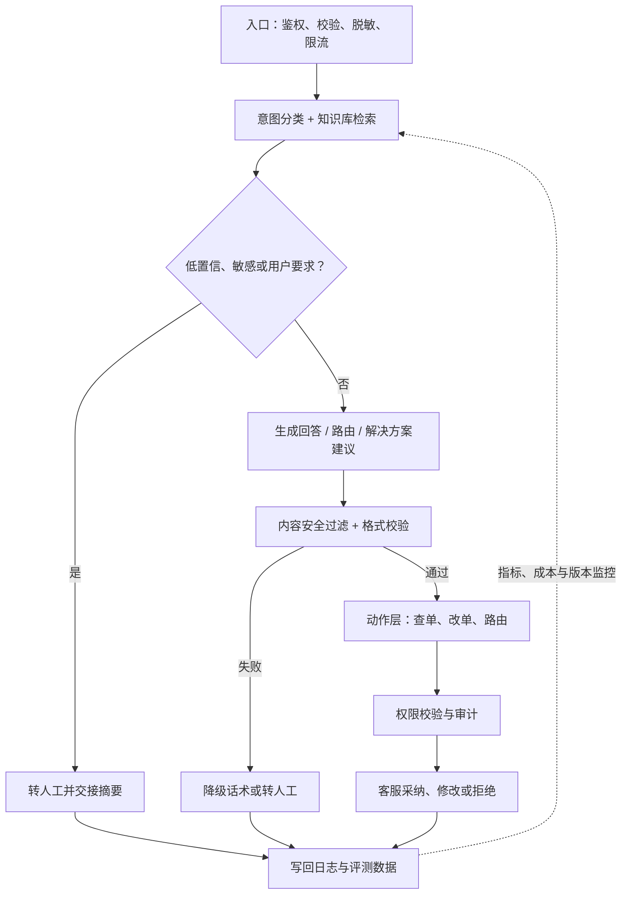

---
---
description: 客服自动化产品设计：ROI 账本、场景分层、系统组成、转人工控制交接与评测运营。
---

## 客服自动化

客服自动化是垂直对话助手中**最成熟、ROI 最清晰**的场景：用户带着明确的求助意图来，问题可以归到有限类别，答案大多来自已有知识库，失败有「转人工」兜底。四个条件让「对话式客服」成为 AI 产品落地密度最高的形态之一。

本文承接 [对话助手](chatbot.md) 的垂直助手方法，是客服场景的深度页：价值主张与场景分层、系统组成、转人工与控制交接、评测与运营、合规与风险、反模式六部分。口径与 [AI 产品开发生命周期（CC/CD）](../pm/ai-lifecycle.md) 的「客服工单助手」走查、[AI 产品 PRD](../pm/prd.md) 的客服工单 PRD 节选保持一致（同一案例，不同视角：生命周期页讲过程，本页讲产品设计）。

???+ note "读本文之前"
    知识库问答的技术与产品基础见 [知识库问答](kb-qa.md) 与 [RAG 产品化实战](rag-practice.md)；对话体验与信任设计见 [对话助手](chatbot.md)；本页以文本客服（网页 / IM / 邮件）为主，语音客服的合规与体验特殊性见 [语音与音频](../ai/audio.md)。

## 价值主张与场景分层

### 客服自动化的 ROI 公式

ROI = 节省的工时成本 − 推理成本 − 错误成本。三项都要算，只算前两项是常见的立项错误：

| 项 | 构成 | 常见低估 / 高估 |
| --- | --- | --- |
| 节省的工时 | 人工处理时长 × 客服时薪 × 真正被自动化的量 | 用「AI 处理的会话量」冒充「节省的工单量」；AI 处理 ≠ 问题解决 |
| 推理成本 | token 费 + 知识库维护 + 抽检与评测人力 | 漏掉知识库维护与转人工后的客服成本 |
| 错误成本 | 答错的客诉升级、赔付、满意度损失 | 最难量化，经常被低估；一次大额错误可能吃掉一个月的节省 |

一个可抄的立项账本：客服平均处理一单 10 分钟、时薪折算每分钟 1 元，日均 1,000 单、其中 30% 可被自动化且真解决，则日节省 = 1,000 × 30% × 10 × 1 = 3,000 元；对比推理成本（按 [LLM 成本测算](../tools/llm-cost.md) 的公式估算）与错误成本预算，三列对比后决定做不做、做到哪一级。**ROI 的三个版本结构不同**：v1 路由省的是「客服花在判断上的时间」，v2 建议省的是「客服找答案的时间」，v3 自动解决省的是「整单的人工时间」。每一级都要单独算账。

价值不只「省钱」，还有四样常被漏掉的好处：**24×7 覆盖**（夜间与节假日的咨询有人接）、**并发弹性**（大促流量冲击时机器人顶住洪峰）、**质量一致性**（同样的问题得到同样的答案，不随客服状态波动）、**数据沉淀**（对话记录变成改进知识库与客服培训的原料）。这些在 ROI 公式里没有行，但立项汇报里值得单独写一节。

### 场景分层：哪些问题适合自动化

客服问题按「能否自动化」分层，先分层再设计——不是所有问题都该让机器人答：

| 层 | 问题特征 | 例子 | 自动化策略 |
| --- | --- | --- | --- |
| 可自动化 | 高频、低风险、答案在知识库内、用户情绪平稳 | 查物流、改地址、常见政策咨询 | 机器人直接答（v3 前为「建议」） |
| 半自动化 | 需要收集信息、需要判断、轻微风险 | 退换货申请、投诉分类 | 机器人引导收集信息，人工确认动作 |
| 人工优先 | 高风险、强情绪、开放式、无标准答案 | 重大投诉、人身安全、法律争议 | 直接转人工，机器人只做辅助（摘要、资料准备） |

判断「这单该谁接」比训练模型更优先。分层标准要写进路由规则与评测集：评测集按层配样本，自动化层测「答得准」，人工层测「转得对」。

### 与通用对话助手的差异

客服机器人虽然是对话产品，但产品逻辑与通用助手不同：

| 维度 | 通用助手 | 客服机器人 |
| --- | --- | --- |
| 会话目标 | 开放式问答 | 解决问题并关闭工单 |
| 成功定义 | 用户满意 / 留存 | 问题解决率 + 处理时长 |
| 失败兜底 | 用户放弃 | 转人工（必须存在） |
| 知识 | 通用知识 | 私有知识库 + 工单系统 |
| 交互 | 自由聊天 | 引导式任务流 + 边界拒答 |
| 评测 | 体验指标为主 | 场景指标为主（解决率、转人工率） |

### 代理权阶梯：v1 → v2 → v3

与 [AI 产品开发生命周期（CC/CD）](../pm/ai-lifecycle.md) 的代理权阶梯完全一致，客服自动化按「能替用户/客服做多少事」分三级，**每级都要赚到准入信号才放行下一级**：

| 层级 | 行为 | 准入信号 | 护栏 | 回退机制 |
| --- | --- | --- | --- | --- |
| v1 检索回答 / 路由 | FAQ 检索回答；工单按意图路由建议，不自动改状态 | 路由准确率达标（如 ≥ 90%） | 只输出建议不落库；路由建议附置信度 | 低置信直接转人工，客服一键改路由 |
| v2 工单路由与建议 | 路由 + 建议解决方案（SOP 检索），客服可编辑后再发 | 建议采纳率达标 + 无重大误导 | 建议卡片带引用来源，不可直发 | 客服编辑或弃用，修改写回日志 |
| v3 自动解决 | 自动回复 + 自动处理（查单、改地址等），带人工兜底 | v2 指标稳定 + 修正成本可控 | 自动回复带「由 AI 处理」标识；高风险动作需确认 | 用户一键转人工，客服随时接管 |

**关键提醒：第一版往往是「路由」，不做「自动回复」**。[PRD](../pm/prd.md) 的客服工单示例 v1 只做工单路由、不做自动回复。先让系统证明「判断准」，再让它「开口说」，最后才让它「自己办」。跳过 v1/v2 直接上 v3 是客服 AI 项目最常见的失败方式：错误不可控、用户信任崩塌、项目被叫停。

## 系统组成

客服机器人是一个四层系统，不是「一个模型 + 一个知识库」：

| 层 | 职责 | 关键决策点 | 常见错误 |
| --- | --- | --- | --- |
| 检索层 | 知识库（FAQ / 政策 / 流程）的索引、检索、更新 | 混合检索 + rerank、知识治理与版本管理 | 知识库不更新，答旧政策旧价格 |
| 对话层 | 意图理解、FAQ 问答、多轮澄清 | 意图分类器、拒答阈值、澄清策略 | 意图全靠模型猜，无分类层兜底 |
| 动作层 | 路由、改单、查单等动作 | 动作权限、确认点、审计留痕 | 权限过宽，自动改单无审计 |
| 人工层 | 转人工、控制交接、人工兜底 | 转人工触发条件、交接上下文 | 转人工出口深、交接无上下文 |

四层之间有依赖关系：检索层喂对话层（召回片段 → 生成回答），对话层喂动作层（意图 → 动作选择），人工层兜底所有层（低置信的检索、越界的意图、高风险的动作都汇到人工层）。排查问题按层定位：答非所问先查检索与对话，动作出错查权限与审计。与相邻形态的关系：客服机器人 = 知识库问答（检索 + 对话）+ 动作层（工单集成）+ 人工层（转人工）；相比 [Agent 产品](agent-product.md) 自主度受限，「权限最小化 + 人工兜底」是常态。

### 检索层：知识库是产品，不是资料堆

-   **知识库构成**：FAQ 库（高频问答）、政策库（规则与条款）、流程库（操作步骤）、工单历史（相似案例）——四类更新频率与格式不同，分开管理
-   **检索质量工程**：混合检索（关键词 + 向量互补）、rerank 两阶段、按评测集调 chunk 策略（方法见 [RAG 产品化实战](rag-practice.md)）
-   **知识治理**：每条知识有负责人、有效期、版本；政策变更当天必须生效——「知识库不更新」是客服 AI 的第一大死因
-   **引用绑定**：回答必须能溯源到知识条目，引用即评测依据——没有引用的回答在客服场景直接判错

### 对话层：意图分类是地基

-   **意图清单**：按工单类别建意图（退款 / 物流 / 投诉 / 咨询……），每个意图配示例问法、同义词与边界样本——意图清单就是路由规则的雏形
-   **多轮澄清**：信息不足时逐项收集（先订单号，再问题描述），一次只问一项；澄清超过三轮转人工
-   **拒答与阈值**：意图置信度低于阈值不硬猜——「猜错意图」比「拒答」贵得多，猜错会答非所问、加剧情绪
-   **渠道差异**：IM 短句、邮件长文、网页输入，同一意图在不同渠道的表述差异大，分类器按渠道分别调

### 用户侧体验：FAQ 会话怎么答

-   **答案长度**：客服场景短答优先。先给结论（能不能、怎么做），细节再展开；用户要的是「现在怎么办」，不是论文
-   **澄清的体验**：每次只问一项，附带示例格式（「请提供订单号，形如 12345」）；信息收集齐了再一次性处理，而不是问一项答一项
-   **结束会话**：任务完成后确认解决（「已为您查询，预计明天送达」）+ 满意度收集（赞踩 / 评分）；未解决时主动给转人工出口
-   **AI 身份明示**：自动动作带「由 AI 处理」标识，重大动作（改地址、申请退款）给出确认与撤销入口。用户知情是信任的前提

### 动作层：权限与审计

-   **动作清单最小化**：v1 只有「路由建议」一个动作；每加一个动作（查单、改地址）都要过「权限 + 确认 + 审计」三问
-   **权限矩阵**：谁（机器人 / 客服 / 用户）能做什么动作、要不要确认、留不留痕——高风险动作默认要人工确认
-   **审计留痕**：每笔动作记录「谁触发、什么参数、结果如何、模型与 prompt 版本」——事故回溯全靠它

端到端流程（聚焦客服机器人形态）：

这条链把客服自动化的核心边界画清：模型负责理解和建议，权限、审核、人工接管与评测闭环共同约束实际动作。

### 与工单系统的集成

客服机器人不是独立产品，而是工单系统（Zendesk、自研客服工作台等）的前置层，集成做不好机器人就是空中楼阁：

-   **消息渠道**：网页插件、IM（企业微信 / Slack）、邮件——多渠道意味着同一知识库要适配不同输入形态（邮件长文 vs IM 短句），意图分类要为渠道分别调。
-   **工单 API 双向读写**：机器人读工单状态（查单、查进度），客服的修正写回（改路由、改答案）——**写回日志是评测数据的来源**，工单系统要与日志系统打通。
-   **动作权限与审计**：机器人能执行哪些动作、谁审批、每笔动作留痕——把机器人当「一个权限受限的员工」管理，而不是「一个函数」。
-   **集成边界**：涉及资金、赔付、法律承诺的动作（退款、改价、承诺赔偿）默认不做、只建议——建议可以 AI 出，动作必须人来点（与「代理权阶梯」的护栏一致）。

## 转人工与控制交接（重点）

### 转人工触发条件

转人工是**系统设计的一部分**：把「什么时候交给人类」写成显式规则，而不是等模型「自觉」：

| 触发条件 | 判断信号 | 动作 |
| --- | --- | --- |
| 低置信度 | 检索得分 / 意图置信度低于阈值 | 直接转人工，不展示 AI 回答 |
| 重复失败 | 同一会话多次未解决、用户重复相同问题 | 转人工 + 附对话摘要 |
| 情绪检测 | 负面情绪词、投诉类意图 | 优先转人工（投诉处理优先级高于成本） |
| 用户主动要求 | 「转人工」「找客服」「我要投诉」 | 立即转，不挽留不引导 |
| 敏感内容 | 辱骂、违法、医疗法律金融高敏话题 | 转人工或中止，按红线流程处理 |
| 成本熔断 | 日成本超预算阈值 | 全量转人工，暂停调用（见 [LLM 成本测算](../tools/llm-cost.md)） |

转人工率的正确用法：**该转不转 = 客诉升级，不该转乱转 = 成本没省**。健康的产品看「该转的都转了、不该转的没转」，不是「转人工率越低越好」。把「转人工」从产品设计里去掉，等于把安全阀焊死。

### 转人工分级

转人工不是一个开关，是三个强度：

| 级别 | 触发 | 行为 |
| --- | --- | --- |
| 建议转 | 置信度略低 | 机器人继续答，但提示「也可以转人工」 |
| 主动转 | 置信度低 / 重复失败 / 情绪检测 | 机器人停止回答，直接转人工 |
| 强制转 | 用户要求 / 敏感内容 / 成本熔断 | 立即转，无任何条件 |

级别阈值要可配置并进日志（灰度期调高阈值多转人工，稳定后逐步放权）。「转人工策略」本身也是要评测的产品变量。

### 控制交接：出错时人类能无缝接管

「控制交接」（control handoff）是客服 AI 信任的地基（源自 [AI 产品开发生命周期（CC/CD）](../pm/ai-lifecycle.md) 的关键设计）：

-   **客服一键改路由**：v1 工单被错路由，接收的客服要能一键改路由——这个修正会被记录，既改进系统又保住体验。
-   **修改写回日志 → 评测数据回填**：客服的每次采纳 / 修改 / 拒绝都是标注数据，「是否被人工改路由」就是路由准确率的线上代理指标——控制交接同时是评测闭环的入口。
-   **交接的体验设计**：
### 交接的体验设计

用户侧：转人工后不用重复描述。对话摘要随转接传递，用户只说一遍；「由 AI 处理」与「已转人工」状态可见。客服侧：看到 AI 建议了什么、置信度多少、引用了哪些知识条目。人工接管不是从零开始，是接着 AI 的进度继续。交接摘要的必填字段（转人工时自动生成）：

| 字段 | 说明 | 示例 |
| --- | --- | --- |
| 用户诉求 | 一句话概括 | 订单 12345 未收到货，要求退款 |
| 已尝试 | 机器人做了什么 | FAQ 命中 2 条，用户反馈不解决 |
| AI 判断 | 意图与置信度 | 退款意图，置信度 0.55 |
| 引用条目 | 命中的知识库条目 | KB-0342 退款流程 |
| 会话关键信息 | 订单号等实体（脱敏后） | 订单 12345 |

### 转人工的常见错误

-   **出口藏太深**：转人工按钮藏在多级菜单里，用户找不到出口，只能愤怒刷屏。转人工入口放在对话界面的常驻位置。
-   **机器人「挡人」**：用户多次要求转人工，机器人反复「让我先帮您看看」。主动要求转人工的用户情绪已经上线，拦截就是火上浇油。
-   **交接断片**：转过去只给客服一句话「用户有疑问」，摘要缺失，用户被迫重述。交接摘要与置信度是交接的必填字段。

### 转人工的质量指标

转人工环节本身也要评测，别只数「转了几单」：

| 指标 | 含义 | 健康方向 |
| --- | --- | --- |
| 转人工后首次解决率 | 转人工后一次会话解决的比例 | 越高越好——转得「值」 |
| 重复转接率 | 同一用户被多次转接 | 越低越好——交接断片的表现 |
| 人工处理时长 | 转人工后客服处理耗时 | 与 AI 处理时长对照，验证「摘要传递」的价值 |
| 转人工满意度 | 转人工用户的满意度 | 不低于纯人工基线——转人工不能降体验 |

## 评测与运营

### 指标

| 指标 | 公式 | 数据来源 | 频率 | 说明 |
| --- | --- | --- | --- | --- |
| 解决率 | 解决会话数 ÷ 总会话数 | 会话闭环状态 | 按周 | 业务结果，核心指标；必须用「真解决」定义 |
| 路由准确率 | 正确路由数 ÷ 总路由数 | 评测集全量 | 每次变更 | 系统判断与人工判断一致的比例 |
| 平均处理时长 | 工单总处理时长 ÷ 工单数 | 工单系统 | 按周 | 直接对应客服人效 |
| 满意度（CSAT） | 好评数 ÷ 参评数 | 会话后评价 | 按周 | 与解决率对照，防「答了没解决还生气」 |
| 人工改路由率 | 被改路由数 ÷ 总路由数 | 日志 | 按周 | 路由准确率的线上代理指标 |

**反指标**：投诉率不上升、转人工率在合理区间、客服满意度不下降——AI 上线的目标是把人效做上去，不是把用户体验做下去（反指标与停止条件见 [PRD](../pm/prd.md) 示例）。

### 评测集与真实回填

-   **种子评测集**：起步 20~100 条，构成 30 典型 + 边界 + 对抗（「退款」说成「退钱」、中英混杂、辱骂内容），由客服主管标注「应路由部门 / 正确答案」。种子集打破冷启动（schema 与治理六件事见 [AI 产品开发生命周期（CC/CD）](../pm/ai-lifecycle.md) 的参考数据集一节）。

| 类型 | 占比 | 例子 | 测什么 |
| --- | --- | --- | --- |
| 典型 | 60% | 正常退款咨询、查物流 | 日常质量 |
| 边界 | 25% | 「退钱」说成「退款子」、缺订单号、长句 | 表达鲁棒性 |
| 对抗 | 15% | 诱导越权、辱骂、领域外问题 | 安全与边界 |

-   **真实回填**：线上日志脱敏后回填评测集。真实分布与种子集不一样，评测集要持续吸收真实样本才不失真；脱敏在写入日志时做，不是评测时做。
-   **人工抽检**：每周抽 20~50 条低置信 / 低分样本，客服主管复核——低分样本是「评测集测不到、线上正在发生」的错。
-   **错误模式复盘（CC/CD）**：把抽检发现的错误归纳成模式表，数据驱动修复：

| 错误模式 | 触发条件 | 影响 | 修复方向 |
| --- | --- | --- | --- |
| 用户用简称 / 方言描述工单 | 同义词缺失 | 工单流转慢，客户等待 | 补同义词到路由规则，或换检索方式 |
| 中英混杂工单全被拒答 | 输入校验过严 | 客户被挡在门外 | 放宽校验 + 拒答话术改为引导补充信息 |
| 引用存在但内容过时 | 知识库未更新 | 答旧政策引发投诉 | 知识版本管理 + 到期提醒 |

### 灰度与回滚

-   新模型 / 新 prompt / 新阈值走灰度：10% → 50% → 100%，对照期指标对比；跑评测要固定「评测集版本 + 模型版本 + prompt 版本 + 采样日期」四元组，否则分数之间不可比
-   回滚预案：线上指标明显变差（改路由率飙升、投诉率上升）5 分钟退回旧版本——回滚是发布流程的一部分，不是事后补救
-   灰度期转人工阈值调高：宁可多转人工观察，也不要让错误回答先触达用户（方法见 [评估与评测](../ai/evaluation.md)）

### 运营节奏

| 频率 | 动作 |
| --- | --- |
| 每周 | 抽检 20~50 条低分样本，客服主管复核；错误模式表更新 |
| 每两周 | 评测集回填真实样本 + 全量回归 |
| 每月 | 指标复盘：解决率 / 转人工率 / CSAT 趋势；ROI 对照（节省 vs 成本） |
| 每次变更 | 评测集回归 → 灰度 → 监控 → 回滚预案 |

## 合规与风险

-   **对话记录 = 个人信息**：用户对话内容（含姓名、手机号、地址、订单信息）受个人信息保护法规约束——脱敏在写入日志时执行，敏感字段白名单化（红线框架见 [出海与合规](compliance.md)）。
-   **数据脱敏**：手机号、身份证、地址等字段写入日志前脱敏；客服可见原始数据，日志与评测集只见脱敏数据。「脱敏要在写入日志时做，而不是评测时做」。
-   **录音与用户知情**：语音客服的通话录音需告知并取得同意，质检（QA）调用录音需在授权范围内（见 [语音与音频](../ai/audio.md) 与 [出海与合规](compliance.md)）。
-   **保留期与删除权**：对话记录设保留期，用户可申请删除——产品机制（保留期、删除入口、导出）见 [数据隐私与用户控制](data-privacy.md)。
-   **内容安全**：辱骂、违法、涉政内容自动过滤或转人工；输出侧内容安全过滤与人工兜底双链路。
-   **用户知情权**：对话开场声明「智能客服，可随时转人工」；AI 生成内容显式标识——既是合规要求也是信任设计（《生成式人工智能服务管理暂行办法》等要求见 [出海与合规](compliance.md)）。
-   **提示注入与滥用**：用户可能诱导机器人泄露知识库原文、越权执行动作——输入校验、工具权限最小化、敏感信息不回显（参考 [OWASP LLM Top 10](https://owasp.org/www-project-top-10-for-large-language-model-applications/) 与 [提示词安全](../ai/prompt-security.md)）。

### 风险矩阵

| 风险 | 概率 | 影响 | 缓解 |
| --- | --- | --- | --- |
| 答错引导用户做危险动作（如泄露账户） | 低 | 极高 | 高敏意图强制转人工，机器人只答非敏感范围 |
| 知识库过期政策被引用 | 中 | 中 | 知识版本管理 + 到期提醒 + 引用绑定 |
| 对话数据泄露（日志裸存 PII） | 中 | 极高 | 写入时脱敏 + 权限白名单 + 保留期 |
| 提示注入套取知识库原文 | 中 | 中 | 输入校验 + 敏感信息不回显 + 红队测试 |

## 反模式

| 反模式 | 表现 | 后果 | 解法 |
| --- | --- | --- | --- |
| 机器人挡人 | 转人工出口藏得深，AI 反复兜圈子 | 用户愤怒、客诉升级 | 转人工入口常驻可见，主动要求立即转 |
| 无转人工出口 | 纯自动回复，无人工兜底 | 答错即事故，无恢复路径 | 人工层是系统组成部分，不是可选件 |
| 知识库不更新 | 答旧政策、旧价格、旧流程 | 用户信任崩塌，投诉量上升 | 知识治理与更新流程，变更进版本记录 |
| 把「解决率」刷成「拦截率」 | 用「AI 处理占比」冒充业务价值 | 指标好看，业务没改善 | 解决率必须用「真解决」闭环状态定义 |
| 全自动一步到位 | 跳过 v1/v2 直接 v3 自动解决 | 错误不可控，项目被叫停 | 按代理权阶梯逐级上，级级赚准入信号 |
| 全渠道一把梭 | 一套配置直接上全部渠道 | 渠道差异导致意图分类掉点 | 分类器与话术按渠道分调 |
| 只答不办 | 只有 FAQ 问答，无动作层 | 问题「答」了，事没办成 | 按代理权阶梯逐步加动作层 |
| 只测「答得好不好」 | 评测集全是问答对错，无路由/动作样本 | 路由错误和动作越权测不出来 | 评测集按层级配样本：问答、路由、动作各一套 |

### 从 0 到 1 的落地顺序

1.  **定场景分层与意图清单**：画出可自动化 / 半自动化 / 人工优先三层，意图清单 20~50 个（多退少补）
2.  **建种子评测集**：每意图 3~5 条典型 + 边界 + 对抗样本，客服主管标注（20~100 条即可起步）
3.  **v1 只做路由建议**：接入工单系统，客服界面一键改路由，修改写回日志
4.  **跑通评测闭环**：改路由率做线上代理指标，每周抽检，错误模式文档化
5.  **再放量**：v2 建议 → v3 自动解决，每级赚准入信号后再升级

落地顺序与 CC/CD 循环一一对应（完整走查见 [AI 产品开发生命周期（CC/CD）](../pm/ai-lifecycle.md)）。

???+ example "练习"
    选一个真实客服场景（如电商售后），写出：① 代理权三级阶梯各做什么、准入信号是什么；② 转人工触发条件清单（≥ 5 条）；③ 5 个核心指标与 2 个反指标；④ 错误模式复盘表的前 3 行（含修复方向）。

## 来源说明

> 本文为原创整理，综合参考以下来源：

-   linux.do — [客服自动化的工程实现](https://linux.do/t/topic/2471489)：社区一线工程实践（系统组成、转人工、评测运营）
-   [Anthropic — Building Effective Agents](https://www.anthropic.com/engineering/building-effective-agents)：先简单后复杂、工作流优先原则（代理权阶梯）
-   [OWASP — LLM Top 10](https://owasp.org/www-project-top-10-for-large-language-model-applications/)：提示注入等 LLM 应用风险清单（合规与风险）
-   站内 [AI 产品开发生命周期（CC/CD）](../pm/ai-lifecycle.md)：代理权阶梯、控制交接、参考数据集治理、错误模式复盘的完整方法论
-   站内 [AI 产品 PRD](../pm/prd.md)：客服工单助手 PRD 节选（能力边界、评测标准、失败路径、反指标）
-   站内 [知识库问答](kb-qa.md) 与 [RAG 产品化实战](rag-practice.md)：检索层与引用溯源的产品化方法
