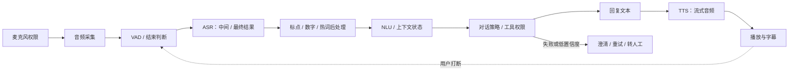
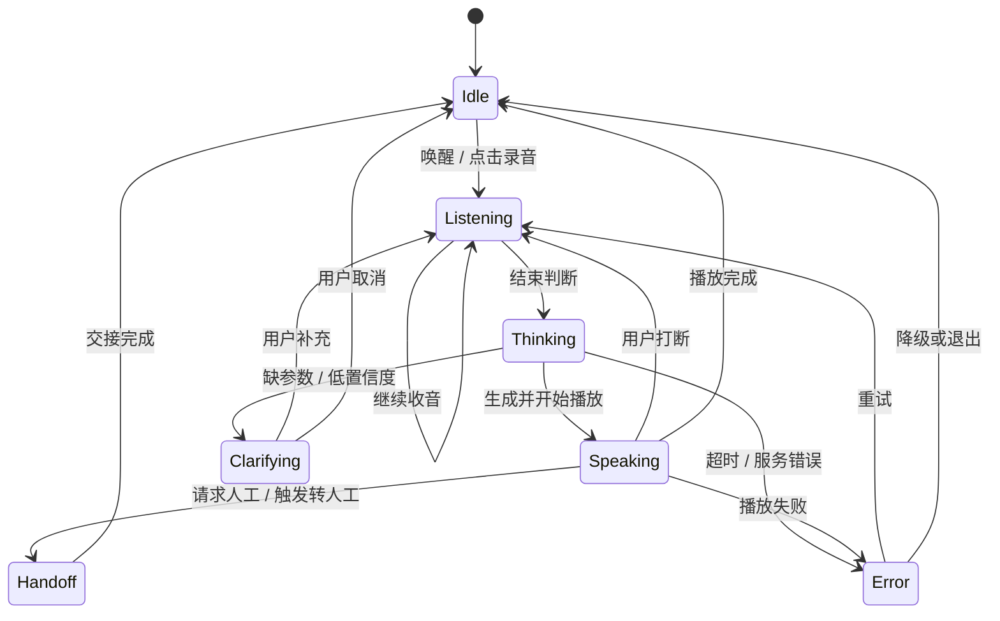

## 智能语音产品

智能语音产品用声音完成输入、理解、决策和输出。最基础的技术链路由三部分组成：**语音识别（Automatic Speech Recognition，ASR）**把声音转换为文字，负责听见；**自然语言处理（Natural Language Processing，NLP）**理解和处理语言，负责识别意图、提取信息、维护上下文和生成回复；**语音合成（Text-To-Speech，TTS）**把文字转换为语音，负责播报。

产品设计还要补上麦克风采集、权限、语音活动检测（Voice Activity Detection，VAD）、结束判断、会话编排、播放、打断、错误恢复和人工接管。三段模型链路回答“听什么、想什么、说什么”，产品链路还要回答“何时听、何时回应、被打断后如何继续”。

???+ note "与相邻页面的分工"
    [语音与音频](../ai/audio.md) 解释 ASR、TTS、实时语音对话和音频能力的技术基础，本页专注产品形态、交互决策、评测和上线运营。

    [对话助手](chatbot.md) 解释文字对话的冷启动、上下文、记忆和信任设计，本页补充语音特有的轮次、延迟、声学环境和播放控制。

    [客服自动化](support-bot.md) 解释客服场景的知识库、转人工和业务闭环，本页补充电话录音、实时质检和语音客服的交互约束。

    录音、转写和音色数据的治理见 [数据隐私与用户控制](data-privacy.md) 与 [出海与合规](compliance.md)。

## 产品边界：语音入口不等于语音产品

语音可以是既有产品的输入方式，也可以成为完整的交互媒介。先确定用户要完成的任务，再决定是否需要实时对话、语音输出或持续监听。

| 产品形态 | 用户任务 | 主要链路 | 产品重点 |
| --- | --- | --- | --- |
| 语音输入 | 更快录入搜索词、消息或表单 | 采集 → ASR → 文本编辑 | 识别准确、可修改、权限透明 |
| 语音转写 | 把会议、采访或通话变成可检索文本 | 录音 → 离线 ASR → 后处理 | WER、说话人、时间戳、术语 |
| 实时字幕 | 让现场参与者同步阅读内容 | 采集 → 流式 ASR → 字幕渲染 | 延迟、稳定性、关键术语 |
| 语音助手 | 通过多轮对话获取信息或完成简单操作 | VAD → ASR → NLU / LLM → TTS | 轮次、打断、简短回答、兜底 |
| 语音客服 | 解决咨询、查询和办理业务 | 电话 / App 音频 → 对话编排 → 人工或系统处理 | 业务成功率、录音告知、转人工 |
| 语音生成 | 生成播报、配音或个性化声音 | 文本 → TTS → 音频交付 | 自然度、音色授权、标识与溯源 |

同一个产品可以组合多种形态。例如会议助手同时包含实时字幕、会后转写和摘要；车载助手同时包含唤醒、语音控制、导航工具调用和播报。组合越多，状态管理、成本和失败恢复越复杂。

### 什么时候值得用语音

语音优先适合以下任务：

-   用户双手被占用，输入速度比文字输入更重要
-   信息本身来自通话、会议、采访或现场环境
-   任务需要连续表达，键盘输入会打断思路
-   用户需要即时反馈，等待完整页面操作的成本较高
-   屏幕较小、视线受限或设备处于车内、家居等场景

语音不适合所有任务。金额、地址、订单号、药品剂量和权限变更等内容需要可视化核对；公共场所、多人环境和弱网环境需要提供文字、按钮或人工渠道作为替代入口。

### 产品形态的选择表

| 判断问题 | 选择倾向 | 需要补的设计 |
| --- | --- | --- |
| 用户只想把话变成可编辑文本吗 | 语音输入 | 中间结果、纠错、重新录入 |
| 用户需要实时看到内容吗 | 流式 ASR | partial / final 结果、延迟和滚动策略 |
| 用户需要和系统连续交流吗 | 实时语音助手 | VAD、轮次、打断、回声消除 |
| 用户需要系统执行动作吗 | 语音 + 工具调用 | 参数确认、权限、不可逆操作拦截 |
| 用户只需要听内容吗 | TTS 播报 | 语速、停顿、跳过、暂停和缓存 |
| 用户需要指定真人音色吗 | 定制 TTS / 音色克隆 | 单独授权、用途限制、生成标识和撤回 |

## 三段能力与产品责任

### ASR：识别准确不等于任务可用

ASR 把音频转换为文字。产品验收不能只看整体字错误率（Character Error Rate，CER）或词错误率（Word Error Rate，WER），还要看错误是否出现在任务关键字段。

-   **流式识别**：持续接收音频并返回中间结果，适合实时助手和字幕。界面需要区分临时文本与最终文本，避免用户把仍会变化的内容当成确定答案。
-   **离线识别**：拿到完整音频后统一处理，适合会议、采访、质检和归档。它可以使用更长上下文和更复杂的后处理，但不适合即时反馈。
-   **热词与领域词**：人名、品牌、药品、型号、法律条款和产品名需要专门词表或定制模型。热词表属于持续运营资产，不能只在上线前配置一次。
-   **声学环境**：噪声、混响、远场、多人重叠、口音、方言和中英混说会改变识别效果。测试集必须覆盖真实设备和真实环境。
-   **后处理**：标点、数字格式、专名纠正、敏感信息脱敏、说话人和时间戳决定转写结果是否可以直接进入下游流程。

Google Cloud、Azure、AWS 和腾讯云的实时接口都将流式音频、部分结果、最终结果、结束事件和错误事件作为接口契约，但编码、包大小、时长、配额和计费方式存在差异。产品定义接口时应保存供应商无关的内部事件模型，避免把某一家厂商的字段直接暴露给上层业务。

### NLP：产品层通常要拆成 NLU、对话管理和生成

NLP 是总称。智能语音产品的语言层至少包含三类职责：

| 语言层职责 | 处理内容 | 产品输出 |
| --- | --- | --- |
| NLU | 意图、实体、槽位、情绪和语言置信度 | 结构化用户请求 |
| 对话管理 | 上下文、状态、缺失参数、权限和下一步 | 下一轮问题或动作计划 |
| 生成与表达 | 回复文本、工具结果解释、拒答和澄清 | 可显示、可播报的回复 |

任务型产品可以用意图、槽位和显式状态机获得可控性；开放式助手可以用 LLM 处理更宽的表达，再用工具白名单、结构化输出和业务规则约束动作。新增一个 API 或业务能力时，Schema 应同时描述意图、槽位、参数类型、权限、确认要求和失败结果。

语言层的失败通常分为四类：

-   **理解错**：用户说“改到下周一”，系统没有识别日期或时区
-   **状态错**：系统忘记用户已经提供过城市，重复提问
-   **权限错**：系统把查询请求误当成写入请求，直接执行不可逆动作
-   **表达错**：答案事实正确，但句子过长、重点不清或不适合播报

产品需求文档应分别记录这四类失败的兜底动作，不能只写“提升 NLP 准确率”。

### TTS：合成的重点是表达和控制

TTS 将文本转换为可播放音频。音质只是基础，产品还要控制发音、停顿、语速、音量、重音、情绪、语言和音色一致性。

-   **文本预处理**：日期、数字、缩写、单位、网址和专有名词先转成适合朗读的形式。
-   **韵律控制**：长句需要拆分，重点信息需要停顿或重音，客服和导航需要清晰优先，内容阅读需要连续性优先。
-   **流式合成**：先返回首个可播放片段，再持续生成后续音频，适合实时对话。播放端必须处理片段排序、丢包、暂停和用户打断。
-   **音色管理**：标准音色适合批量播报；定制音色适合品牌、角色和个性化场景。真人音色需要授权链路和用途边界。
-   **缓存策略**：固定话术、导航提示和常见问答可以预合成并缓存，减少实时延迟和合成成本。

Google Cloud 文档以纯文本或 SSML 控制停顿、发音、音高、音量和语速；Azure 文档还提供多语言音色、custom voice 和口型相关能力。厂商能力、语言覆盖、计费单位和授权条件更新很快，选型时应以当前官方页面和实际试听为准。

## 实时语音产品管线

实时产品的核心不是把三段模型串起来，而是让音频、文本、决策和播放形成可中断的事件流。



麦克风权限、音频采集、VAD、ASR、语言理解、策略、TTS 和播放共同决定一次轮次。任何一个环节没有可观测事件，产品就难以解释“为什么没有回应”。

### 级联管线与端到端语音模型

| 维度 | 级联管线 | 端到端语音模型 |
| --- | --- | --- |
| 组成 | ASR → NLU / LLM → TTS | 音频输入 → 音频输出或统一语音表示 |
| 可替换性 | 各模块独立替换和评测 | 整体调优，模块边界较少 |
| 可观测性 | 文本、状态和工具事件清晰 | 中间决策较难拆解 |
| 表达能力 | 语气和停顿经过文本中转 | 有机会保留更多语气与情绪 |
| 成本控制 | 可以按场景选择模型和缓存 | 需要按统一模型的用量计费 |
| 适合起步 | 大多数业务助手、客服、转写 | 实时性和自然表达是核心差异的场景 |

起步阶段优先使用级联管线，先建立业务闭环、日志和评测集。端到端方案需要在延迟、表达和留存上证明收益，也要补齐中间状态、审计和失败恢复能力。Whisper、Conformer 和 Paraformer 等研究展示了不同的 ASR 质量与效率路线；SpeechT5、VITS 和 SeamlessM4T 等工作展示了统一语音表示、并行 TTS 与语音翻译的探索，但论文基准不能直接替代真实设备和真实用户验收。

### 用状态机管理一轮对话



状态机至少要记录当前阶段、最近一次用户输入、已确认槽位、正在执行的动作和可恢复位置。用户说“停”“算了”“重新来”时，系统需要把取消命令优先级提高，停止尚未完成的播放或工具调用。

### partial、final 与确认边界

流式 ASR 的中间结果会被后续音频修正。产品应建立明确的事件协议：

-   `started`：本轮开始，显示录音状态并记录会话 ID
-   `partial`：显示临时识别结果，不触发不可逆动作
-   `final`：本段识别结束，进入语言理解和业务判断
-   `interrupted`：用户抢话，停止当前播放并保留上下文
-   `completed`：本轮回复播放完成
-   `canceled`：用户取消或服务中止，清理临时资源
-   `error`：记录可重试、需澄清或需转人工的错误类型

金额、收件地址、删除、支付、发送消息、下单和权限变更等动作必须等待最终结果，并在执行前以文字、语音或按钮进行确认。中间结果只适合驱动字幕、候选建议和非关键 UI 状态。

### 打断、回声与轮次结束

-   **打断（barge-in）**：用户开始说话后，播放端立即降低音量或停止播放；系统保留已生成文本和已执行动作的状态。
-   **回声消除（AEC）**：扬声器声音返回麦克风会造成自激和错误识别；耳机、手机、会议音箱和车载设备的处理条件不同。
-   **VAD**：判断是否存在人声，适合控制录音和唤醒；它不等于用户已经说完。
-   **端点检测**：结合静音时长、语言边界、上下文和用户行为判断一轮是否结束；阈值过短会截断，过长会让用户等待。
-   **双工**：全双工允许系统边听边说，但需要处理同时说话、抢话、回声和并发事件；半双工更容易实现，适合先验证业务价值。
-   **唤醒词**：误唤醒率与拒识率必须分场景测量。隐私敏感场景要提供物理开关、明显录音状态和关闭持续监听的入口。

## 语音交互设计

### 语音界面需要视觉反馈

语音不是无界面的交互。用户需要知道设备是否在听、是否识别到、是否理解、是否正在执行，以及如何纠正。

| 阶段 | 用户疑问 | 推荐反馈 |
| --- | --- | --- |
| 待机 | 设备是否可用 | 唤醒入口、麦克风状态、可执行示例 |
| 收音 | 系统是否听见我 | 波形或录音状态、计时、停止按钮 |
| 识别 | 系统听成了什么 | 可编辑的中间 / 最终文本 |
| 思考 | 系统是否卡住 | 处理中状态、取消入口、超时提示 |
| 执行 | 系统准备做什么 | 动作摘要、目标对象、确认按钮 |
| 播放 | 系统说到哪里 | 字幕、暂停、重播、跳过和音量 |
| 出错 | 我怎样继续 | 明确原因、重试、改用文字或转人工 |

Google Conversation Design 将提示、确认、错误处理和多模态组件视为语音用户界面的共同设计对象。语音输出应配合卡片、列表、按钮或文字记录，给用户保留核对和纠正渠道。

### Push-to-talk、唤醒词与持续监听

| 方式 | 优点 | 风险 | 适合场景 |
| --- | --- | --- | --- |
| 按住说话 | 意图明确、隐私边界清楚 | 需要持续操作 | 语音输入、敏感任务 |
| 点击录音 | 易理解、便于控制时长 | 多一步操作 | 会议、消息、搜索 |
| 唤醒词 | 解放双手、启动快 | 误唤醒、环境噪声、隐私担忧 | 家居、车载、设备控制 |
| 持续监听 | 轮次自然、可抢话 | 采集边界难解释、功耗高 | 电话或明确授权的实时会话 |

默认从短时、显式授权的输入开始。持续监听、后台唤醒和跨应用收音需要独立的权限说明、状态指示、停止机制和数据保留策略。

### 让语音回复适合听

语音回复与文字回复使用不同的内容标准：

-   先说结论，再补充一到两个必要细节
-   一轮只处理一个主要任务，长内容分段并提供“继续”
-   朗读前展开缩写、格式化数字、处理标点和专名
-   用停顿表达层次，避免连续播报表格、链接和长编号
-   让用户随时暂停、重播、跳过或切换为文字
-   对不确定内容明确说明来源、置信度或下一步核对方式

“回复正确”与“回复适合听”是两个评测维度。文本评分高的答案可能因为过长、句式复杂或重音错误而不适合语音播放。

### 澄清、重试与转人工

低置信度时不要把猜测当成理解。按错误类型选择不同恢复动作：

| 错误类型 | 例子 | 恢复动作 |
| --- | --- | --- |
| 没听清 | 噪声导致内容缺失 | 请求用户重说，显示已识别片段 |
| 没理解 | 意图不在支持范围 | 提供两个可选任务，或转文字 |
| 缺参数 | 没有日期或对象 | 一次只追问一个缺失字段 |
| 有歧义 | “把它发给他” | 展示候选对象，要求确认 |
| 动作失败 | 外部 API 超时 | 说明状态，避免重复扣款或重复提交 |
| 超出能力 | 请求不受支持 | 明确边界，给出可执行替代路径 |
| 高风险 | 账户、支付或敏感服务 | 提高确认级别，必要时转人工 |

重复三次同一句“请再说一遍”会让用户陷入死循环。应设置重试次数、可切换入口和人工接管条件，并把已经识别的上下文一并交给人工。

## 评测与运营

### 指标体系

| 维度 | 指标 | 解释 |
| --- | --- | --- |
| ASR 质量 | WER / CER、关键字段错误率 | 评估整体转写和金额、地址、姓名等字段风险 |
| 语言理解 | 意图准确率、实体 / 槽位 F1、澄清率 | 判断语言层是否得到可执行结构 |
| 任务结果 | 任务成功率、一次完成率、重试率 | 连接模型效果与业务目标 |
| 体验 | 首帧音频延迟、往返延迟、轮次时长 | 衡量用户说完到听到回应及整轮完成的速度 |
| 交互控制 | 打断成功率、误打断率、唤醒误触发率、拒识率 | 衡量用户能否接管和设备是否过度响应 |
| TTS 质量 | 首字延迟、实时率、MOS、发音错误率 | 衡量音频何时开始、生成是否跟得上播放和听感 |
| 系统稳定 | 可用性、超时率、音频丢包率、播放失败率 | 衡量链路和依赖服务的可靠性 |
| 商业结果 | 会话完成、转人工、留存、每分钟成本 | 衡量语音体验是否带来实际价值 |
| 合规信任 | 录音告知率、授权覆盖度、删除完成率、标识覆盖率 | 衡量采集和生成是否符合承诺 |

首帧延迟应拆成 VAD 结束判断、ASR 最终结果、LLM 首 token、TTS 首片段和网络传输等部分。只看单模型延迟无法解释端到端体验。

### 分层评测集

评测集至少按以下维度分层：

-   设备：手机、耳机、会议音箱、车载麦克风和网页麦克风
-   环境：安静室内、办公室、户外、车内、远场和混响空间
-   说话人：年龄、性别、口音、方言、语速和发音差异
-   内容：日常口语、专名、数字、地址、金额、缩写、代码和中英混说
-   交互：停顿、改口、重复、抢话、背景讲话、同时说话和用户取消
-   业务：低风险查询、关键字段填写、外部工具调用、失败重试和转人工
-   安全：误唤醒、录音越权、提示注入、音频重放、音色冒用和儿童误触发

ASR 的验收应同时报告整体 WER / CER 和关键字段错误率。NIST SCTK 的 `sclite` 可用于转写评分与对齐，统计比较应记录评测集、规范化规则、工具版本和模型版本。TTS 的 MOS 需要主观听测，ITU-T P.800、P.808 和 P.863 分别提供主观或客观语音质量评估的标准入口；这些标准不是完整的业务成功率评测。

### 线上运营闭环


日志采集必须先经过脱敏、访问控制和保留期限判断。只保存业务需要的事件，不默认长期保存原始音频。每次模型、词表、阈值、提示词或供应商变更都要关联版本，方便回溯错误来源。

错误分类建议至少包含：声学听错、端点截断、语言理解错、状态丢失、工具执行错、TTS 发音错、播放或网络错、用户主动取消和不支持请求。不同错误由不同团队负责，统一归为“模型效果”会阻断改进。

## 成本与架构取舍

语音产品的成本来自音频处理、模型推理、网络、存储、监控、人工审核和合规运营。可以用以下模型做早期估算：

```text
月成本 ≈ 实时 ASR 分钟 × 单价
       + 离线 ASR 分钟 × 单价
       + TTS 字符数 × 单价
       + LLM 输入 / 输出 token × 单价
       + 音频存储与传输
       + 人工审核与转人工
```

成本估算要按实时和离线拆分。实时 ASR、实时 TTS 和低延迟 LLM 通常同时增加资源压力；固定播报、常见问答和导航提示可以使用预生成缓存；会议、质检和归档优先采用异步处理；敏感数据场景还要把私有化部署、日志治理和审计计入总成本。

供应商价格和配额会持续变化。AWS、Google Cloud、Azure 和腾讯云的官方文档分别按音频时长、文本字符或模型档位计费，具体金额、免费额度、舍入规则和区域价格以当前页面为准。上线前使用真实流量分布测算，而不是用平均时长乘一个单价。

### 端侧、云端与混合部署

| 方案 | 优势 | 代价 | 适合场景 |
| --- | --- | --- | --- |
| 端侧 | 断网可用、响应快、隐私边界清楚 | 模型和设备适配受限、升级分发复杂 | 唤醒、短命令、隐私敏感输入 |
| 云端 | 模型选择多、统一更新、复杂理解能力强 | 网络依赖、数据出域、持续调用成本 | 多轮对话、复杂任务、统一运营 |
| 混合 | 端侧处理唤醒和 VAD，云端处理复杂任务 | 状态同步和故障降级复杂 | 手机、车载、家居和企业助手 |

端侧采集也要处理权限和生命周期。Web 的 `getUserMedia` 需要安全上下文和用户授权；Android 与 iOS 的官方语音 API 都支持部分结果和最终结果，但都要求应用处理权限、错误、取消和识别生命周期，且不适合无边界地持续识别。

## 数据、隐私与安全

### 采集前明确数据边界

录音、转写文本、说话人标签、声纹特征、设备标识和会话日志可能对应不同的数据类别和风险。产品上线前需要回答：

1. 收集哪一种数据，为什么必须收集
2. 是否实时处理，是否保存原始音频
3. 转写文本是否进入训练、质检、搜索或记忆
4. 谁可以访问，访问是否留痕
5. 保存多久，用户如何查看、导出和删除
6. 数据是否跨境，供应商是否留存或用于改进服务
7. 合成音色是否来自真人，授权用途和期限是什么

用于声纹识别、身份验证或个性化识别时，语音可能涉及生物识别信息等更高风险处理；普通语音输入也可能包含姓名、联系方式、健康、财务和位置等个人信息。不能把所有语音数据简单归为同一等级，应按处理目的、字段内容和识别能力分级。

### 合成语音和音色克隆

音色克隆应把授权作为产品对象管理，而不是只在合同中留档：

-   采集授权：记录授权人、授权范围、用途、渠道、期限和撤回方式
-   音色入库：绑定授权状态，未授权或已过期音色不可调用
-   生成控制：限制批量生成、冒充身份、诈骗话术和敏感场景
-   内容标识：对合成人声提供显著提示和必要的技术标识
-   使用留痕：记录账号、音色、文本、时间、用途和交付渠道
-   撤回处置：停止新生成，处理已交付内容和缓存副本

中国《互联网信息服务深度合成管理规定》涉及人声等生物识别信息的处理、合成人声的显著标识、技术标识和日志留存。产品设计应直接核对第 14、16、17、18 条及后续适用规则，并以主管部门最新页面为准。

### 语音安全测试

语音系统既面临内容风险，也面临音频通道风险：

-   **重放攻击**：录音或合成语音冒充真人，影响身份验证和电话业务
-   **提示注入**：背景音、音频转写或外部内容诱导模型忽略业务规则
-   **误唤醒**：电视、他人对话或环境音触发持续收音
-   **越权执行**：识别错关键字段，导致错误发送、下单或支付
-   **敏感信息泄露**：字幕、播放、日志或转人工上下文暴露隐私
-   **合成内容滥用**：克隆音色冒充公众人物、亲属、领导或客服

高风险动作需要多因素确认、账号权限、关键字段复述、可视化核对和审计记录。语音识别置信度不能替代业务授权。

## 从 0 到 1 的落地路径

### 阶段一：选择一个窄任务

把“做语音助手”改写为一个可以验收的任务，例如：

-   会议结束后生成带说话人的行动项
-   用户口述地址后生成可编辑收货信息
-   客服坐席在通话中获得知识库检索建议
-   车载用户通过短命令控制导航和音乐
-   课程内容生成可暂停、可跳过的语音讲解

定义任务的输入、输出、失败代价、人工替代路径和业务指标。暂不同时承诺开放聊天、持续监听、复杂工具调用和音色克隆。

### 阶段二：用级联管线跑通最小闭环

1. 选择一种输入方式，优先采用点击录音或按住说话
2. 接入流式或离线 ASR，保存中间和最终结果
3. 用显式意图、槽位和状态约束语言层
4. 对关键动作增加确认，不直接执行不可逆操作
5. 用流式 TTS 生成短回复，提供文字同步和停止按钮
6. 设置重试、改用文字、取消和转人工入口
7. 建立真实场景评测集和端到端延迟看板

先证明任务完成率和用户愿意使用，再扩展自由表达和更高自主权。

### 阶段三：根据瓶颈增加复杂度

-   ASR 在真实环境掉点：增加热词、降噪、设备适配和领域数据
-   用户觉得系统反应慢：拆解端到端延迟，优化 VAD、首 token、TTS 首片段和网络
-   用户频繁抢话：改进全双工、回声消除、播放停止和状态恢复
-   用户不信任执行结果：增加复述、可视化确认、来源和审计
-   用户只使用少数固定命令：把高频路径做成按钮、快捷词或确定性工作流
-   用户需要自然表达和情绪：对比端到端语音模型，但保留规则、日志和人工兜底

每次升级都重新评测质量、延迟、成本、失败半径和数据风险。模型升级不是自动的产品升级。

## 设计评审清单

-   语音解决的具体任务是什么，用户为什么不使用文字、按钮或人工渠道
-   产品选择了按键、点击、唤醒词还是持续监听，权限边界是否可见
-   ASR 中间结果和最终结果如何区分，关键字段如何纠错
-   VAD 和端点检测何时结束一轮，用户停顿、改口和抢话如何处理
-   语言层使用显式状态机、LLM 还是两者组合，工具调用的权限边界是什么
-   回复是否适合听，是否同步文字、暂停、重播、跳过和切换输入方式
-   首帧延迟、往返延迟、打断成功率和误打断率如何测量
-   噪声、方言、远场、多人、儿童、弱网和设备差异是否进入评测集
-   录音、转写、声纹和音色数据保存多久，谁可以访问，如何删除和撤回
-   合成语音是否有授权、显著标识、技术标识、日志和滥用拦截
-   ASR、LLM、TTS、网络和人工服务分别怎样降级，失败后用户如何继续
-   每分钟成本、缓存命中率、转人工成本和供应商配额是否进入上线门槛

## 常见坑

-   **只看演示音频**：安静环境和标准普通话掩盖真实设备、噪声、方言和口语修正问题。
-   **把三段模型当成完整产品**：没有权限、VAD、轮次、播放和失败恢复，模型再强也无法形成稳定体验。
-   **让中间结果触发写入**：partial 文本会变化，关键动作必须等待 final 并完成确认。
-   **把 WER 当唯一指标**：整体错误率低不代表订单号、金额、地址和药品剂量正确。
-   **用文字回复标准验收语音**：长答案、表格、链接和复杂数字适合阅读，不一定适合听。
-   **忽略回声和抢话**：没有 AEC、VAD 和播放中断，用户会觉得系统听不见或不肯闭嘴。
-   **持续监听默认开启**：权限、功耗和数据边界不透明会直接损害信任。
-   **把音色授权留到上线后**：真人音色的来源、期限、渠道和撤回必须进入音色库和生成链路。
-   **只测单模块**：ASR、LLM 和 TTS 各自达标，链路衔接仍可能产生不可接受的端到端延迟。
-   **重试没有幂等保护**：网络超时后重复提交订单、消息或付款会造成业务事故。
-   **把失败都归因于模型**：端点、网络、播放、权限和工具错误需要独立分类与监控。

## 来源说明

本文为原创整理，资料检索与页面访问日期为 2026-09-01。模型能力、接口限制、配额、价格和法规均会更新，实际采购与上线以官方当前页面、合同和适用法律为准。用户提供的牛客网页面当前会跳转至公司题库入口，无法独立核验原题正文；其中 ASR、NLP、TTS 三模块仅作为本文的入门框架线索。

### 技术与接口

1.  [Google Cloud Speech-to-Text：StreamingRecognize](https://docs.cloud.google.com/speech-to-text/docs/streaming-recognize)：流式音频、中间结果和最终结果的接口契约。
2.  [Microsoft Azure Speech to text](https://learn.microsoft.com/en-us/azure/ai-services/speech-service/speech-to-text)：实时、快速和批量识别，以及自定义语音能力。
3.  [Amazon Transcribe Streaming](https://docs.aws.amazon.com/transcribe/latest/dg/streaming.html)：实时音频流、编码和分片要求。
4.  [腾讯云实时语音识别](https://cloud.tencent.com/document/product/1093/35635)：中文实时 WebSocket 接口、中间结果和结束事件示例。
5.  [Whisper 项目与论文](https://github.com/openai/whisper) / [论文页面](https://arxiv.org/abs/2212.04356)：多语言、多任务 ASR 与公开模型的能力边界。
6.  [Conformer](https://arxiv.org/abs/2005.08100) 与 [Paraformer](https://arxiv.org/abs/2206.08317)：局部与全局建模、并行解码和 ASR 效率路线。
7.  [Google Cloud Text-to-Speech：Create audio](https://docs.cloud.google.com/text-to-speech/docs/create-audio)：文本、SSML、发音、停顿和语速控制。
8.  [Microsoft Azure Text to speech](https://learn.microsoft.com/en-us/azure/ai-services/speech-service/text-to-speech)：神经音色、custom voice、SSML 与多语言输出。
9.  [FastSpeech 2](https://arxiv.org/abs/2006.04558)、[VITS](https://arxiv.org/abs/2106.06103) 与 [HiFi-GAN](https://arxiv.org/abs/2010.05646)：并行 TTS、韵律建模和声码器的研究路线。
10.  [SpeechT5](https://arxiv.org/abs/2110.07205) 与 [SeamlessM4T](https://arxiv.org/abs/2308.11596)：统一语音表示、语音翻译和语音到语音的研究探索。

### 交互、评测与工程

11.  [Google Conversation Design](https://developers.google.com/assistant/conversation-design/welcome)：语音用户界面的提示、确认、错误恢复和多模态设计。
12.  [WebRTC overview](https://webrtc.org/getting-started/overview)：浏览器端媒体流采集与端点连接。
13.  [MDN getUserMedia](https://developer.mozilla.org/en-US/docs/Web/API/MediaDevices/getUserMedia)：麦克风权限、安全上下文和设备约束。
14.  [Android SpeechRecognizer](https://developer.android.com/reference/android/speech/SpeechRecognizer) 与 [Apple Speech framework](https://developer.apple.com/documentation/speech)：移动端部分结果、最终结果、权限和生命周期。
15.  [NIST SCTK](https://github.com/usnistgov/SCTK)：ASR 对齐、评分和统计比较工具。
16.  [SUPERB](https://arxiv.org/abs/2105.01051)：统一语音表示的多任务评测框架。
17.  [ITU-T P.800](https://www.itu.int/rec/T-REC-P.800)、[P.808](https://www.itu.int/rec/T-REC-P.808) 与 [P.863](https://www.itu.int/rec/T-REC-P.863)：主观、众包和感知式客观语音质量评估的标准入口。
18.  [Opus RFC 6716](https://www.rfc-editor.org/rfc/rfc6716)：实时语音和音乐编码的 IETF 标准。

### 合规与站内相关阅读

19.  [《互联网信息服务深度合成管理规定》](https://www.gov.cn/zhengce/2022-12/11/content_5731431.htm)：合成人声标识、技术标识、日志和人声等生物识别信息处理要求；适用条款以最新官方页面为准。
20.  [NIST AI Risk Management Framework](https://www.nist.gov/itl/ai-risk-management-framework)：从治理、识别、测量和管理角度组织 AI 风险。
21.  [语音与音频](../ai/audio.md)：站内技术全景、实时语音管线、延迟、授权和成本。
22.  [对话助手](chatbot.md)、[客服自动化](support-bot.md)、[数据隐私与用户控制](data-privacy.md)：站内相邻产品形态和数据治理页面。
